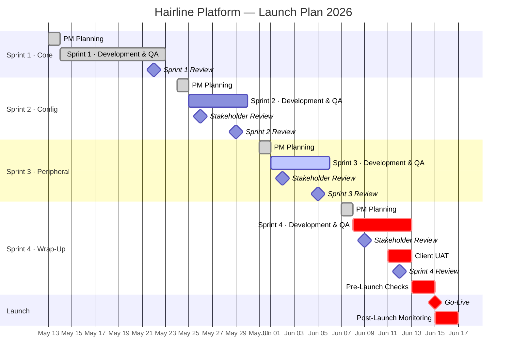
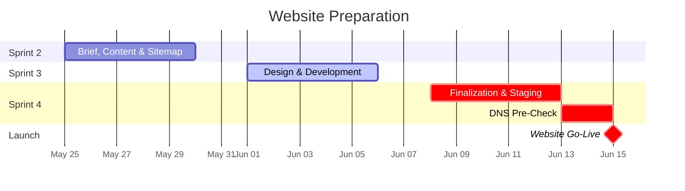
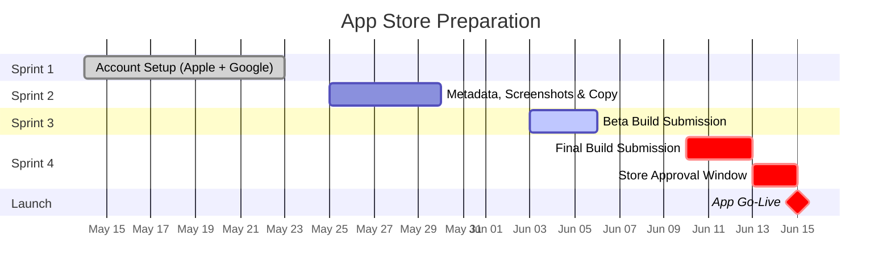
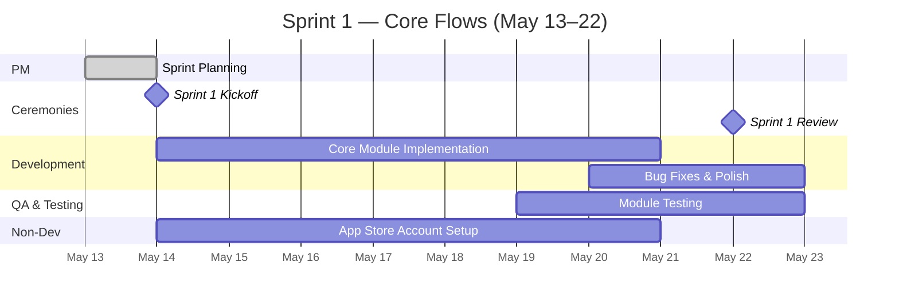
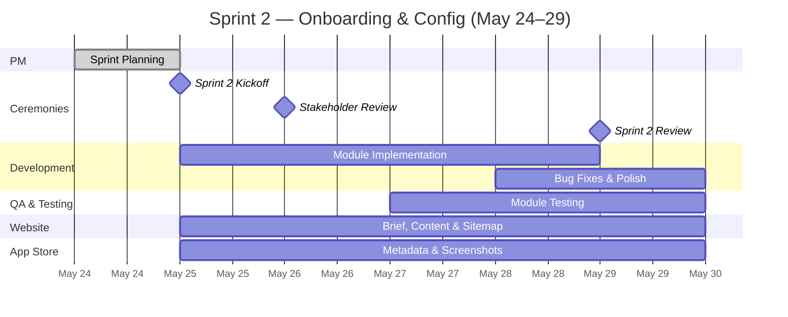
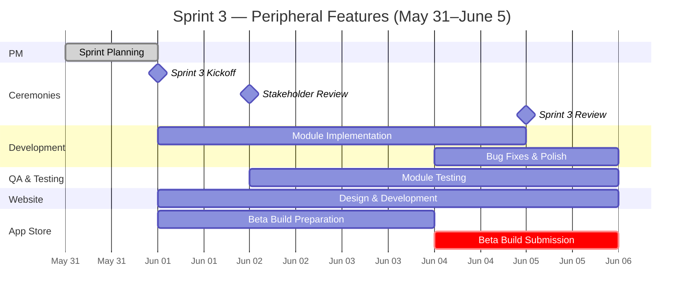
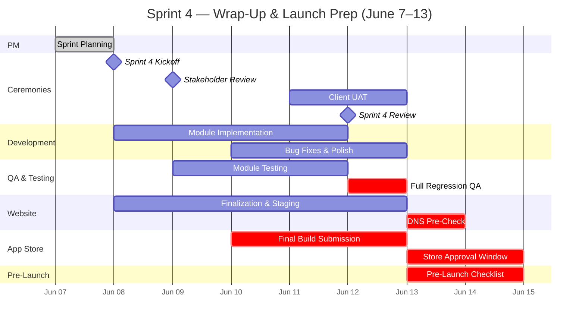
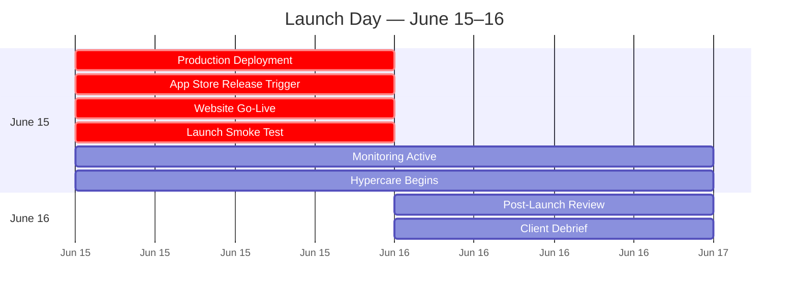

# Hairline Platform — Launch Plan 2026

**Document Type:** Product Launch Plan
**Prepared By:** Product Manager
**Date:** May 13, 2026
**Target Go-Live:** June 15–16, 2026
**Scope:** All three tenants — Patient Mobile App, Provider Dashboard, Admin Dashboard
**Methodology:** Agile Scrum (adapted)

---

## Overview

This plan covers the final development, testing, and launch of the Hairline Platform from May 14 to June 16, 2026. It is organized into four development sprints followed by a launch sprint. All three tenants are worked on in parallel within each sprint — no module is considered done until it is verified across every tenant involved in that feature.

Sprint 1 is slightly longer to absorb initial planning overhead. Sprints 2–4 are equal in length at one week each. Website preparation begins in Sprint 2 and runs through to launch. App Store preparation begins in Sprint 1 with account setup and runs through to the final build submissions in Sprint 4.

---

## Team Roles

| Role | Responsibility |
|------|---------------|
| **PM** | Sprint planning, backlog management, stakeholder communication, client updates, go/no-go decisions |
| **Backend Dev** | API implementation, service integrations, database migrations |
| **Mobile Dev** | Flutter patient app (iOS + Android) |
| **Web Dev** | React provider dashboard and admin dashboard |
| **QA Lead** | Test case execution, regression testing, bug reporting |
| **Designer** | Website design, app store creative assets, UI polish |
| **DevOps** | CI/CD pipeline, staging and production environments, deployment |

---

## Sprint Calendar

| Sprint | Theme | Dates | Working Days |
|--------|-------|-------|-------------|
| Sprint 1 | Core: Inquiry, Quote, Treatment & Aftercare | May 14 (Thu) – May 22 (Fri) | 7 |
| Sprint 2 | Config: Onboarding, Auth & Quoting Rules | May 25 (Mon) – May 29 (Fri) | 5 |
| Sprint 3 | Peripheral: Messaging, Notifications & Additional Config | June 1 (Mon) – June 5 (Fri) | 5 |
| Sprint 4 | Wrap-Up: Financial, Analytics & Non-Critical | June 8 (Mon) – June 12 (Fri) | 5 |
| **Launch** | **Go-Live** | **June 15 (Mon) – June 16 (Tue)** | **2** |

---

## Ceremony Cadence

| Ceremony | Timing | Duration | Participants |
|----------|--------|----------|--------------|
| **Sprint Planning** (PM solo prep) | Day before each sprint starts | 2–3 hrs | PM |
| **Sprint Kickoff** | Sprint Day 1 | 1 hr | All team |
| **Daily Scrum** | Every working day | 15 min | All team |
| **Sprint Review** | Sprint last day | 1.5 hrs | Dev team + QA |
| **Sprint Retrospective** | Sprint last day, after Review | 30 min | All team |
| **Stakeholder Review** (client-facing) | Day 2 of Sprints 2, 3, and 4 | 1 hr | PM + Client |

> The Stakeholder Review is held on Day 2 rather than Day 1 to give the team one full day to settle into the new sprint before the client-facing update. The PM recaps the previous sprint and previews the current one. The client uses this session to review progress, raise issues, and provide feedback, which is incorporated into the active sprint backlog if needed.

---

## Master Timeline

> Note: Mermaid Gantt does not support vertical background shading of date ranges. Sprint differences are shown through horizontal bar colours — gray (Sprint 1), blue (Sprint 2), teal/highlighted (Sprint 3), red (Sprint 4 + Launch).

---

## Website Timeline

---

## App Store Timeline

---

---

# Sprint 1 — Core: Inquiry, Quote, Treatment & Aftercare

**Dates:** May 14 (Thu) – May 22 (Fri) · 7 working days
**Goal:** Complete and verify the end-to-end operational core — the clinical journey from inquiry submission through aftercare — across all three tenants simultaneously.

## Sprint 1 Timeline

> Note: Gantt bars span calendar days. May 16–17 (Sat–Sun) are non-working days.

## Day-by-Day Schedule

| Date | Day | Activities |
|------|-----|-----------|
| May 13 | Wed | PM — Sprint Planning |
| May 14 | Thu | Sprint Kickoff (all team) · Development begins — all tracks · App Store account registration starts |
| May 15 | Fri | Development · Daily Scrum |
| May 16–17 | Sat–Sun | — |
| May 18 | Mon | Development · Daily Scrum |
| May 19 | Tue | Development · Daily Scrum · QA begins on completed modules |
| May 20 | Wed | Development + QA · Daily Scrum |
| May 21 | Thu | Development + QA · Daily Scrum |
| May 22 | Fri | QA + Bug Fixes · Sprint Review (Dev + QA) · Retrospective (all team) · PM begins Sprint 2 backlog prep |

## Modules

**Mobile (Patient)**
- P-02 Quote Request & Management
- P-03 Booking & Payment
- P-05 Aftercare & Progress Monitoring
- P-07 3D Scan Capture & Viewing

**Web (Provider)**
- PR-02 Inquiry & Quote Management
- PR-03 Treatment Execution & Documentation
- PR-04 Aftercare Participation

**Web (Admin)**
- A-01 Patient Management & Oversight
- A-03 Aftercare Team Management
- A-09a Content & Treatment Management

**Shared Services**
- S-01 Head Scan Media Processing Service
- S-02 Payment Processing Service
- S-05 Media Storage Service

## Sprint 1 Definition of Done

- All Sprint 1 modules pass QA on the staging environment
- No open critical (P0/P1) bugs on any Sprint 1 module
- The full patient journey — inquiry → quote acceptance → booking → treatment check-in → aftercare activation — is testable end-to-end on staging
- A-09a: medical questionnaire catalog is manageable and the active set is publishable and reflected in the patient inquiry flow
- A-03: admin can reassign aftercare cases, edit active plans, add case notes, and request additional patient scans
- PR-04: provider can view the content of patient questionnaire responses (not just completion status)
- P-05: activity restriction timeline is visible in the patient aftercare dashboard
- P-05b: provider-authored treatment summary is visible to the patient after treatment completion
- P-04: return flight submission is available in the patient travel section
- PR-02b: provider can withdraw a submitted quote
- Apple Developer Program account and Google Play Console account created and verified

---

---

# Sprint 2 — Config: Onboarding, Auth & Quoting Rules

**Dates:** May 25 (Mon) – May 29 (Fri) · 5 working days
**Goal:** Verify and complete all configuration that must be in place before providers can be properly onboarded and before quotes can be correctly priced — commission rules, deposit rates, installment settings, regional display, and auth management.

## Sprint 2 Timeline

## Day-by-Day Schedule

| Date | Day | Activities |
|------|-----|-----------|
| May 24 | Sun | PM — Sprint Planning |
| May 25 | Mon | Sprint Kickoff (all team) · Development begins · Website brief starts · App Store metadata drafting |
| May 26 | Tue | **Stakeholder Review — Client (Sprint 1 recap + Sprint 2 preview)** · Development · Daily Scrum |
| May 27 | Wed | Development · Daily Scrum · QA begins |
| May 28 | Thu | Development + QA · Daily Scrum |
| May 29 | Fri | QA + Bug Fixes · Sprint Review (Dev + QA) · Retrospective (all team) · PM begins Sprint 3 backlog prep |

## Modules

**Mobile (Patient)**
- P-01 Auth & Profile Management
- P-04 Travel & Logistics

**Web (Provider)**
- PR-01 Auth & Team Management
- PR-06 Profile & Settings Management

**Web (Admin)**
- A-02 Provider Management & Onboarding
- A-09b Aftercare Template Configuration
- A-09c System Settings & Payment Rules *(Part 1 — commission rates, deposit rules, installment plan rules, regional groupings, destination pricing)*

**Shared Services**
- S-04 Travel API Gateway

## Sprint 2 Definition of Done

- All Sprint 2 modules pass QA on the staging environment
- No open critical bugs on any Sprint 2 module
- A-09c: global platform commission rate configurable; per-provider commission overrides operational
- A-09c: deposit rate (20–30%) configurable by admin and reflected correctly in patient payment screen
- A-09c: installment plan rules (number of installments, cutoff days, grace period) configurable and enforced
- A-09c: regional groupings and destination display order manageable by admin and reflected in patient location selection
- A-09b: aftercare templates can be priced and activated/deactivated by admin
- A-02: admin can resend provider activation emails from the provider detail screen
- PR-01: team member profile is editable; formal suspend with session revocation working
- PR-06: provider package catalog create/edit forms operational
- Website brief, sitemap, and content plan complete and signed off by PM
- App Store metadata draft (app name, description, keywords, category) and screenshot plan complete

---

---

# Sprint 3 — Peripheral: Messaging, Notifications & Additional Config

**Dates:** June 1 (Mon) – June 5 (Fri) · 5 working days
**Goal:** Verify and complete all communication infrastructure, notification configuration, and supporting admin config that wraps around the core platform flow.

## Sprint 3 Timeline

## Day-by-Day Schedule

| Date | Day | Activities |
|------|-----|-----------|
| May 31 | Sun | PM — Sprint Planning |
| June 1 | Mon | Sprint Kickoff (all team) · Development begins · Website design/dev starts · Beta build preparation begins |
| June 2 | Tue | **Stakeholder Review — Client (Sprint 2 recap + Sprint 3 preview)** · Development · Daily Scrum · QA begins |
| June 3 | Wed | Development + QA · Daily Scrum |
| June 4 | Thu | Development + QA · Daily Scrum · Beta build submitted to Apple TestFlight + Google Play internal track |
| June 5 | Fri | QA + Bug Fixes · Sprint Review (Dev + QA) · Retrospective (all team) · PM begins Sprint 4 backlog prep |

## Modules

**Mobile (Patient)**
- P-06 Communication
- P-08 Help Center & Support Access

**Web (Provider)**
- PR-07 Communication & Messaging

**Web (Admin)**
- A-06 Discount & Promotion Management
- A-09c System Settings & Payment Rules *(Part 2 — notification templates, notification rules, admin team management, role & permission configuration)*
- A-10 Communication Monitoring & Support

**Shared Services**
- S-03 Notification Service

## Sprint 3 Definition of Done

- All Sprint 3 modules pass QA on the staging environment
- No open critical bugs on any Sprint 3 module
- A-09c: notification templates created; notification rules active and delivering to the correct user types and channels
- A-09c: admin team management operational (invite, suspend, change roles); role permissions enforced across all admin modules
- A-10: all support case and conversation monitoring screens connected to live data — no mock or hardcoded content
- A-06: applied and completed discount records showing live data; provider acceptance workflow for shared discounts operational
- PR-07: outgoing audio/video call initiation works from the provider chat interface
- S-03: push notifications, email notifications, and in-app notifications all verified end-to-end
- Website design complete; development at 80%+ completion
- Beta build successfully submitted to Apple TestFlight and Google Play internal track with no store rejection

---

---

# Sprint 4 — Wrap-Up: Financial, Analytics & Non-Critical

**Dates:** June 8 (Mon) – June 12 (Fri) · 5 working days · *+ June 13 (Sat) pre-launch buffer*
**Goal:** Complete all financial processing and analytics modules. Run full regression QA across all three tenants. Complete client UAT. Submit final App Store builds. Bring website to staging. Verify production environment.

## Sprint 4 Timeline

## Day-by-Day Schedule

| Date | Day | Activities |
|------|-----|-----------|
| June 7 | Sun | PM — Sprint Planning |
| June 8 | Mon | Sprint Kickoff (all team) · Development begins · Website finalization starts · Production environment provisioning check |
| June 9 | Tue | **Stakeholder Review — Client (Sprint 3 recap + Sprint 4 preview)** · Development · Daily Scrum · QA begins |
| June 10 | Wed | Development + QA · Daily Scrum · Final production build submitted to Apple App Store and Google Play for public release |
| June 11 | Thu | QA · Daily Scrum · **Client UAT — Day 1** |
| June 12 | Fri | Full Regression QA across all three tenants · **Client UAT — Day 2** · Sprint Review (Dev + QA) · Retrospective (all team) |
| June 13 | Sat | Pre-launch checklist · Production environment final smoke test · Website staged and DNS pre-check · Awaiting store approvals |

## Modules

**Web (Provider)**
- PR-05 Financial Management & Reporting

**Web (Admin)**
- A-04 Travel Management
- A-05 Billing & Financial Reconciliation
- A-07 Affiliate Program Management
- A-08 Analytics & Reporting

**Shared Services**
- S-06 Audit Log Service

## Sprint 4 Definition of Done

- All Sprint 4 modules pass QA on the staging environment
- Full regression test pass completed across all modules in all three tenants — no open critical bugs
- P-03b: installment plan enrollment, multi-currency payment, receipt download, and refund request all working
- A-05 (a/b/c): patient billing, provider payout processing, and financial reconciliation dashboard all operating on live data — no mock data remaining
- A-07: affiliate commission automatically calculated on booking completion
- A-08: patient acquisition funnel, geographic intelligence, and pricing analytics screens connected to real data
- Client UAT completed and sign-off received
- Website finalized, QA passed, and deployed to staging environment
- Final App Store builds submitted to Apple and Google
- Production Stripe environment configured and verified
- Production environment fully provisioned and validated by DevOps

---

---

# Sprint 5 — Launch

**Dates:** June 15 (Mon) – June 16 (Tue)

## Launch Day Timeline

## Go-Live Checklist

| Time | Activity | Owner |
|------|----------|-------|
| June 15 — Early morning | Production database migrations run; zero downtime deployment executed | DevOps |
| June 15 — Morning | App Store public release trigger — Apple App Store + Google Play | Dev + PM |
| June 15 — Morning | Website DNS cutover; website go-live confirmed | DevOps |
| June 15 — Mid-morning | Launch smoke test — all five critical user flows verified | QA |
| June 15 — Mid-morning | All monitoring dashboards active — errors, payments, signups, API health | DevOps |
| June 15 — Afternoon | Hypercare standby begins — Dev, QA, DevOps on call | All |
| June 16 — Morning | Post-launch monitoring review — review error rates, sign-up volumes, payment flows | PM + DevOps |
| June 16 — Afternoon | Post-launch debrief with client | PM + Client |

## Critical Smoke Test Flows

| # | Flow | Tenants |
|---|------|---------|
| 1 | Patient registers → submits inquiry → receives quote → accepts quote → pays deposit | Mobile + Admin |
| 2 | Provider reviews inquiry → builds and submits quote → checks in patient for treatment | Provider + Admin |
| 3 | Admin onboards a new provider → configures commission → views financial dashboard | Admin |
| 4 | Patient submits aftercare milestone scan → provider reviews → admin monitors case | All three |
| 5 | Patient sends message to provider → provider responds → provider initiates outgoing video call | Mobile + Provider |

---

---

# Non-Dev Milestones

| Milestone | Sprint | Deadline | Owner |
|-----------|--------|----------|-------|
| Apple Developer Program account created and verified | Sprint 1 | May 18 | Dev / PM |
| Google Play Console account created and verified | Sprint 1 | May 18 | Dev / PM |
| App Store metadata draft complete (name, description, keywords) | Sprint 2 | May 29 | PM / Designer |
| App Store screenshots and preview video complete | Sprint 2 | May 29 | Designer |
| Website brief, content outline, and sitemap signed off | Sprint 2 | May 29 | PM |
| Production Stripe environment configured | Sprint 3 | June 5 | Dev / PM |
| Website design complete | Sprint 3 | June 5 | Designer |
| Beta builds submitted — Apple TestFlight + Google internal track | Sprint 3 | June 4 | Dev |
| Production environment provisioned and accessible | Sprint 4 | June 8 | DevOps |
| Final App Store builds submitted — Apple + Google | Sprint 4 | June 10–11 | Dev |
| Website finalized, QA passed, and deployed to staging | Sprint 4 | June 12 | Dev |
| Client UAT sign-off received | Sprint 4 | June 12 | PM + Client |
| App Store approvals received (both stores) | Pre-launch | June 13–14 | — |
| Production environment final smoke test passed | Pre-launch | June 13 | DevOps + QA |
| DNS pre-check complete; cutover ready to execute | Pre-launch | June 13 | DevOps |
| **Go-Live** | **Launch** | **June 15** | **All** |

---

# Risk Register

| Risk | Severity | Mitigation |
|------|----------|------------|
| **Apple App Store review delay** — new app reviews can take 5–10 business days for a first-ever submission, potentially pushing approval past June 15 | High | Submit beta build to TestFlight on June 4 (Sprint 3) to initiate account review early; submit final public release build June 10–11 to allow a 4–5 day buffer before launch |
| **A-09a at 30% completion in Sprint 1** — if questionnaire catalog and active set publication slips, the entire inquiry flow cannot be properly tested and all downstream sprints are affected | High | Assign senior backend developer to A-09a as the first task on Sprint 1 Day 1; PM treats it as a hard blocker with daily check-in |
| **A-05b Provider Payouts at 20% completion in Sprint 4** — large backend scope in the final development sprint | High | Backend developer begins preliminary A-05b route work during Sprint 3 as background work alongside Sprint 3 scope; not in Sprint 3 scope but reduces Sprint 4 load |
| **Multi-currency payment complexity in P-03b** — real-time exchange rate integration adds risk to Sprint 4 | Medium | Scope multi-currency as a stretch goal for Sprint 4; core payment (installments, receipts, refunds in base currency) is the non-negotiable must-ship item |
| **Late client UAT findings** — issues raised on June 11–12 leave very little time for fixes before launch | Medium | Share a Sprint 3 demo recording with the client ahead of the Sprint 4 Stakeholder Review (June 9) to surface issues early; define and agree on UAT scope in advance to prevent scope creep |
| **Google Play extended new developer review** — new developer accounts can face 7–14 day review periods | Medium | Register Google Play Console this week (May 13–14); submit beta to the internal track on June 4 to establish a review history before the final submission on June 10–11 |
| **Production environment not ready in time** — infrastructure underestimated, blocking final deployment | Low | DevOps begins production environment provisioning during Sprint 3; full environment verified and accessible by Sprint 4 Day 1 (June 8) |
