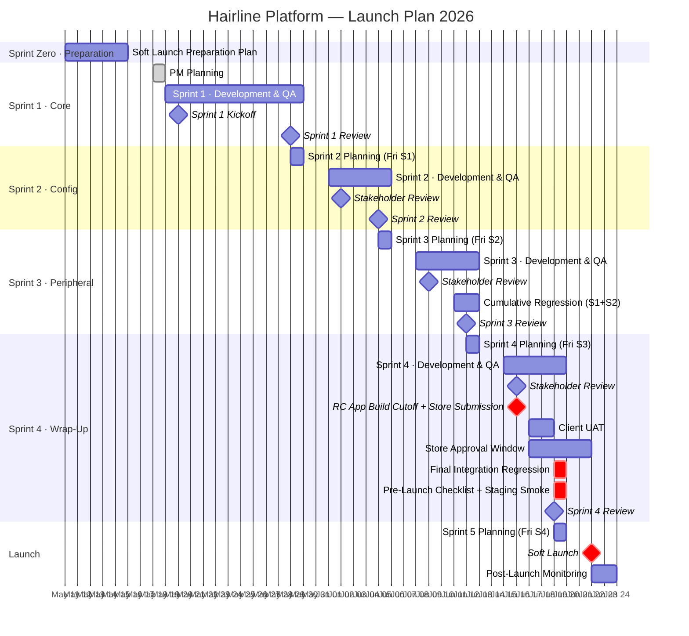
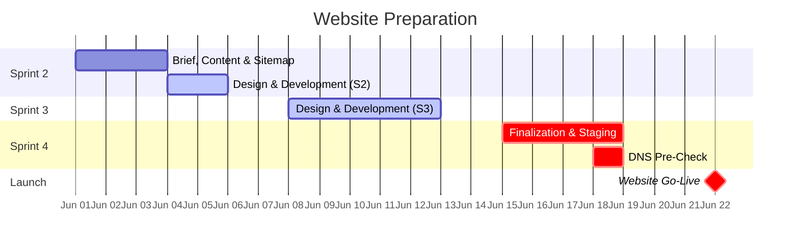
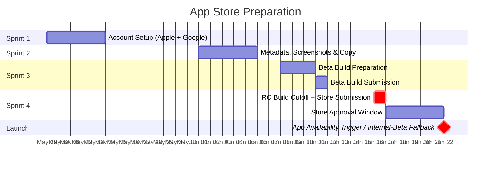
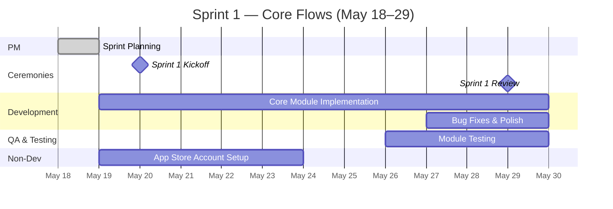
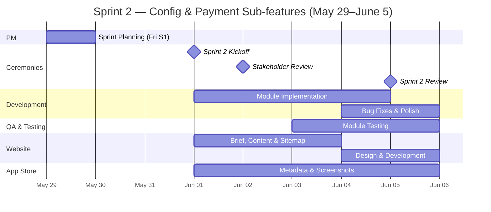
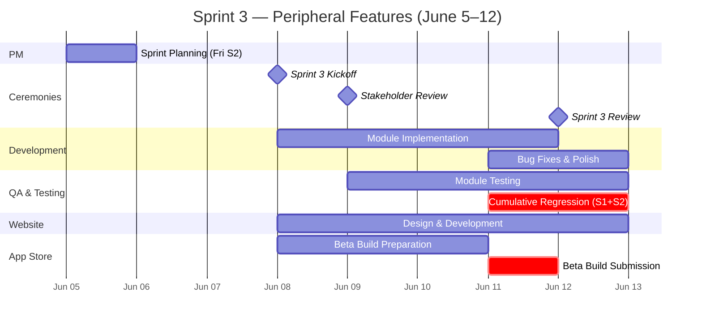
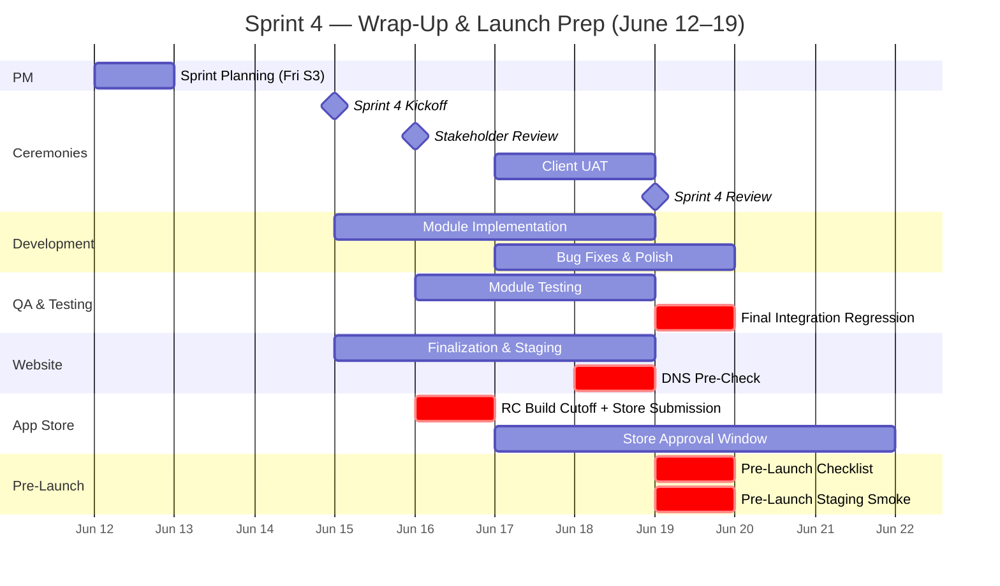
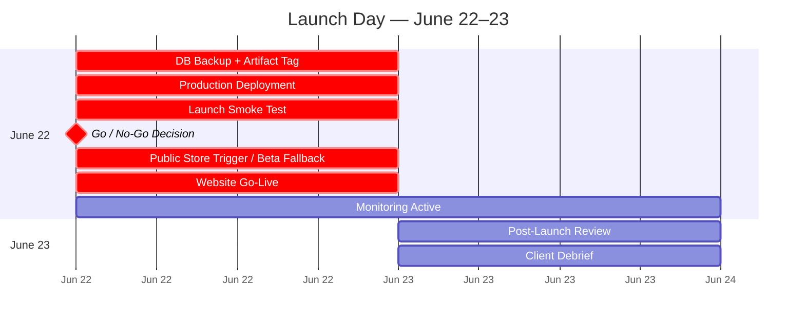

# Hairline Platform — Launch Plan 2026

**Document Type:** Product Launch Plan
**Prepared By:** Product Manager
**Date:** May 20, 2026 *(updated — plan shifted one week to reflect operational delay)*
**Target Go-Live:** June 22–23, 2026
**Scope:** All three primary tenants — Patient Mobile App, Provider Dashboard, Admin Dashboard — plus limited Affiliate/Partner launch surfaces required for FR-018
**Methodology:** Agile Scrum (adapted)

---

## Overview

This plan covers the final preparation, development, testing, and launch of the Hairline Platform from May 11 to June 23, 2026. It is organized into one lightweight preparation sprint (Sprint Zero), four development sprints, and a launch sprint. All three tenants are worked on in parallel within each delivery sprint — no module is considered done until it is verified across every tenant involved in that feature.

Sprint Zero runs from May 11 to May 15 as a soft-launch preparation window for planning and task setup only. Sprint 1 is slightly longer to absorb initial delivery overhead (planning occurs Mon May 18; development begins Tue May 19; Kickoff ceremony is Wed May 20). Sprints 2–4 are equal in length at one working week each, starting Monday. Website preparation begins in Sprint 2 and runs through to launch. App Store preparation begins in Sprint 1 with account setup and runs through to the release-candidate store submission in Sprint 4.

> **Launch framing:** June 22–23 is a **soft launch** intended for vendor demonstrations and business collaboration discussions — not a full public consumer launch. A full public launch will follow after the post-launch vendor feedback cycle. This framing intentionally sets a leaner pre-launch checklist (no formal hypercare schedule, no full DR runbook); the minimum safeguards retained are database backup, previous-version deployment artifact, and a single go/no-go decision point at smoke test.

> **Weekend policy:** Saturdays and Sundays are non-working days for all roles, including PM. The only approved exception is passive PM monitoring of App Store / Google Play review inboxes on June 20–21; no development, QA, or deployment work is planned on those days. Sprint Planning sessions are scheduled on the Friday of the previous sprint, immediately after Sprint Review + Retrospective, except for Sprint 1 planning on Mon May 18 following Sprint Zero.

> **Launch-scope authority notes:** FR-018, FR-021, FR-023, and FR-035 are launch-scope items even where their source PRDs are still in draft; the latest PRD text remains the acceptance baseline until those PRDs are formally approved. FR-036 is acknowledged as an existing future requirement only. It is not composed yet, has no implementation-ready PRD, and must not become a Sprint 4 delivery dependency for this launch plan.

---

## Team Roles

| Role | Responsibility |
|------|---------------|
| **PM** | Sprint planning, backlog management, stakeholder communication, client updates, go/no-go decisions |
| **Backend Dev** | API implementation, service integrations, database migrations |
| **Mobile Dev** | Flutter patient app (iOS + Android) |
| **Web Dev** | React provider dashboard and admin dashboard; website implementation support only after sprint-critical dashboard capacity is protected |
| **QA Lead** | Test case execution, regression testing, bug reporting |
| **Designer** | Website design, app store creative assets, UI polish |
| **DevOps** | CI/CD pipeline, staging and production environments, deployment |

---

## Sprint Calendar

| Sprint | Theme | Dates | Working Days |
|--------|-------|-------|-------------|
| Sprint Zero | Soft Launch Preparation | May 11 (Mon) – May 15 (Fri) | 5 |
| Sprint 1 | Core: Inquiry, Quote & Treatment | May 19 (Tue) – May 29 (Fri) · *Kickoff: May 20 (Wed)* | 9 |
| Sprint 2 | Config & Aftercare: Quoting Rules, Payment Sub-features & Aftercare Activation | June 1 (Mon) – June 5 (Fri) | 5 |
| Sprint 3 | Peripheral: Messaging, Notifications & Additional Config | June 8 (Mon) – June 12 (Fri) | 5 |
| Sprint 4 | Wrap-Up: Financial, Analytics & Non-Critical | June 15 (Mon) – June 19 (Fri) | 5 |
| **Launch** | **Soft Launch / Go-Live Gate** | **June 22 (Mon) – June 23 (Tue)** | **2** |

---

## Ceremony Cadence

| Ceremony | Timing | Duration | Participants |
|----------|--------|----------|--------------|
| **Sprint Planning** (PM solo prep) | Friday of prior sprint, after Review + Retro *(Sprint 1 planning: Mon May 18 — first workday after Sprint Zero)* | 2–3 hrs | PM |
| **Sprint Kickoff** | Sprint Day 1, except Sprint 1 kickoff on Wed May 20 because development starts Tue May 19 | 1 hr | All team |
| **Daily Scrum** | Every working day | 15 min | All team |
| **Sprint Review** | Sprint last day | 1.5 hrs | Dev team + QA |
| **Sprint Retrospective** | Sprint last day, after Review | 30 min | All team |
| **Stakeholder Review** (client-facing) | Day 2 of Sprints 2, 3, and 4 | 1 hr | PM + Client |

> The Stakeholder Review is held on Day 2 rather than Day 1 to give the team one full day to settle into the new sprint before the client-facing update. The PM recaps the previous sprint and previews the current one. The client uses this session to review progress, raise issues, and provide feedback, which is incorporated into the active sprint backlog if needed.

---

## Master Timeline

> Note: Mermaid Gantt does not support vertical background shading of date ranges. Sprint differences are shown through horizontal bar colours — gray (Sprint 1), blue (Sprint 2), teal/highlighted (Sprint 3), red (Sprint 4 + Launch).

---

## Website Timeline

---

## App Store Timeline

> **App build freeze rule:** the June 16 release-candidate submission is the cut-off for app-store-affecting mobile code. Any Sprint 4 work after this point must be web/backend/admin/provider-side work, server-side configuration, or remotely published content/bundles that do not require a new App Store / Google Play binary. If a P0/P1 mobile-code fix is found after June 16, the public store release is deferred and the vendor-facing soft launch proceeds through the approved internal/beta distribution track until a corrected build is approved.

> **Store-launch assumption:** June 22 soft launch does not depend on public App Store / Google Play listing availability. Public release is triggered only if both stores approve in time and the go/no-go decision is green; otherwise vendor demos proceed through TestFlight / Google internal testing or another approved beta distribution route.

---

---

# Sprint 1 — Core: Inquiry, Quote & Treatment

**Dates:** May 19 (Tue) – May 29 (Fri) · 9 working days *(Kickoff ceremony: Wed May 20)*
**Goal:** Complete and verify the core clinical journey from patient registration through inquiry, quoting, booking, and treatment execution across all three tenants simultaneously. Aftercare modules (P-05, PR-04, A-03) move to Sprint 2 where they are grouped with the configuration and template setup they depend on.

## Sprint 1 Timeline

> Note: Gantt bars span calendar days. May 23–24 (Sat–Sun) are non-working days.

## Day-by-Day Schedule

| Date | Day | Activities |
|------|-----|-----------|
| May 18 | Mon | PM — Sprint 1 Planning (solo) |
| May 19 | Tue | Development begins — all tracks · App Store account registration starts *(Kickoff ceremony tomorrow)* |
| May 20 | Wed | **Sprint 1 Kickoff (all team)** · Development · Daily Scrum |
| May 21 | Thu | Development · Daily Scrum |
| May 22 | Fri | Development · Daily Scrum |
| May 23–24 | Sat–Sun | — |
| May 25 | Mon | Development · Daily Scrum |
| May 26 | Tue | Development · Daily Scrum · QA begins on completed modules |
| May 27 | Wed | Development + QA · Daily Scrum |
| May 28 | Thu | Development + QA · Daily Scrum |
| May 29 | Fri | QA + Bug Fixes · Sprint Review (Dev + QA) · Retrospective (all team) · **Sprint 2 Planning (PM solo, after Retro)** |

## Modules

> **Allocation rule**: each FR is completed in full for one tenant within a single sprint unless the scope is explicitly split by tenant or by named sub-scope with a later owning sprint (for example, FR-007 core deposit in Sprint 1 and payment sub-features in Sprint 2; patient/provider travel in Sprint 2 and admin embedded travel oversight in Sprint 4). Module IDs (P-, PR-, A-, S-) are platform code names; the FR column is authoritative for scope.

| Tenant | Modules | FR(s) directly affected |
|---|---|---|
| Mobile (Patient) | P-01 Auth & Profile Management | FR-001 Patient Authentication; FR-026 App Settings & Security *(consumer only: policy/reason lists managed in A-09a)* |
| Mobile (Patient) | P-02 Quote Request & Management | FR-003 Inquiry Submission; FR-004 Quote Submission; FR-005 Quote Comparison & Acceptance; FR-022 Search & Filtering *(quote comparison filter P1)* |
| Mobile (Patient) | P-03a Booking & Payment *(core deposit + base-currency only; sub-features in Sprint 2)* | FR-006 Booking & Scheduling; FR-007 Payment Processing *(core deposit / base-currency portion)* |
| Mobile (Patient) | P-07 Head-Scan Photo Capture & Viewing | FR-002 Medical History & Head-Scan Media *(V1 standardised 2D photo-set capture/viewing; true 3D deferred)* |
| Web (Provider) | PR-01 Auth & Team Management | FR-009 Provider Team Roles |
| Web (Provider) | PR-02 Inquiry, Quote & Booking Management *(includes PR-02b quote withdrawal and confirmed-booking list/detail)* | FR-003 Inquiry Submission *(provider-side)*; FR-004 Quote Submission *(provider-side)*; FR-006 Booking & Scheduling *(provider-side)* |
| Web (Provider) | PR-03 Treatment Execution & Documentation | FR-010 Treatment Execution |
| Web (Provider) | PR-06 Profile & Settings Management *(clinic profile, account settings, role & permission config, package catalog)* | FR-032 Provider Dashboard Settings; FR-024 Treatment Package Management |
| Web (Admin) | A-01 Patient Management & Booking Oversight | FR-016 Admin Patient Management; FR-003 Inquiry Submission *(admin oversight)*; FR-004 Quote Submission *(admin oversight)*; FR-005 Quote Comparison & Acceptance *(admin oversight)*; FR-006 Booking & Scheduling *(admin oversight/intervention)* |
| Web (Admin) | A-02 Provider Management & Onboarding | FR-015 Provider Management |
| Web (Admin) | A-09a Content & Treatment Management *(treatment catalog, medical questionnaire publication, legal content, security/list settings)* | FR-024 Treatment Package Management *(admin-side)*; FR-025 Medical Questionnaire Management; FR-026 App Settings & Security *(owning configuration surface)*; FR-027 Legal Content Management |
| Shared Services | S-01 Head Scan Media Processing Service | FR-002 Medical History *(media intake/validation/alerts)* |
| Shared Services | S-02 Payment Processing Service | FR-007 Payment Processing *(core deposit infrastructure)* |
| Shared Services | S-05 Media Storage Service | FR-002 Medical History *(media storage layer)* — cross-cutting infra |

> **Deferred to Sprint 2:** P-05 Aftercare & Progress Monitoring · PR-04 Aftercare Participation · A-03 Aftercare Team Management — all grouped with the aftercare template and configuration setup (A-09b, A-09c) they depend on.

## Sprint 1 Definition of Done

**Sprint-level gates**
- All Sprint 1 modules pass QA on the staging environment
- No open critical (P0/P1) bugs on any Sprint 1 module
- The core commercial journey — registration → inquiry → quote acceptance → booking/deposit — is testable end-to-end on staging; treatment execution is verified against a fully-paid staging booking fixture in Sprint 1, while the patient final-balance path that unlocks real check-in is completed in Sprint 2
- Apple Developer Program account and Google Play Console account created and verified

**P-01 — Auth & Profile (FR-001, FR-026)**
- Patient signup (email OTP), login, password recovery, profile editing all working
- Password policy enforced: 12+ characters with mixed case, digit, special character
- Account deletion request flow operational with reason capture

**P-02 — Quote Request & Management (FR-003, FR-004, FR-005, FR-022 P1 quote filter)**
- Inquiry submission complete: Service Selection → Destination → Medical Questionnaire / Required Inquiry Details → Head Scan Capture → Treatment Date → Provider Selection → Summary & Submission. Provider Selection appears only after the patient has completed the necessary inquiry information and before final submission/distribution; this is selection from the available provider list and does not introduce P2 provider-discovery search/filtering.
- 3-tier medical alert classification surfaced in the inquiry summary
- Quote comparison view supports sort by Price / Graft Count / Rating / Date plus P1 filters required by FR-005/FR-022, including submitted-date range where applicable
- Patient can ask quote-specific questions through the secure messaging path without breaking quote acceptance or audit trail
- **Inquiry cancellation cascade**: cancelling an inquiry auto-transitions all open quotes to "Cancelled (Inquiry Cancelled)", releases held appointment slots, and notifies affected providers
- 48-hour payment window enforced after quote acceptance for the provider-pre-scheduled slot; expiry releases the slot and reopens quote availability where valid

**P-03a — Booking & Deposit (FR-006, FR-007 core)**
- Pre-existing appointment slot validation: booking screen renders read-only if slot was released or inquiry was cancelled
- Deposit payment in base currency works end-to-end using a launch-default deposit rate in the FR-029-supported 20–30% range; the admin-editable deposit-rate control is delivered in Sprint 2 under A-09c Part 1
- 48-hour payment-failure hold available: failed deposit puts booking into retry window before auto-cancellation
- Booking Confirmation & Itinerary view renders with remaining-balance display

**P-07 — Head-Scan Photo Capture (FR-002 patient side)**
- V1 photo set capture (multiple standardised 2D angles) validated client-side before upload
- Uploaded V1 photo set is viewable from the patient record/profile after S-01 processing returns; true V2 3D model viewing is out of launch scope unless separately approved

**PR-01 — Auth & Team Management (FR-009)**
- Provider login, team member invite, role assignment, profile edit, and formal suspend with session revocation all working
- Four clinic-side roles operational with documented permission matrix: Owner, Manager, Clinical Staff, Billing Staff
- Permission inheritance applied automatically on role assignment
- **Task transfer wizard** operational: removing/suspending a team member triggers task reassignment before session revocation
- New team member first-login state reflects assigned role and effective permissions; any educational tour is optional UI polish and not a FR-009 launch acceptance requirement

**PR-02 — Inquiry, Quote & Booking Management (FR-003, FR-004, FR-006 provider side)**
- Provider receives inquiries with patient data **anonymised pre-payment**; de-anonymisation triggers automatically on deposit payment confirmation
- Provider can build, edit, and submit quotes with pre-scheduled appointment slot assignment
- All 8 quote statuses operate correctly: draft, sent, expired, withdrawn, archived, accepted, cancelled_other_accepted, cancelled_inquiry_cancelled
- 48-hour default quote expiry enforced according to FR-004 quote rules
- **PR-02b**: provider can withdraw a submitted quote with reason capture
- Provider can view accepted/confirmed bookings in table list format and open booking detail with chronological inquiry → quote → acceptance → booking context
- Treatment check-in action is blocked unless the booking is confirmed, appointment date is due, and payment status is fully paid

**PR-03 — Treatment Execution & Documentation (FR-010)**
- Day-by-day treatment status documentation operational: Not Started, In Progress, Finished, Need Caution/Attention, Cancelled/Deferred
- End-of-Treatment modal captures conclusion notes, prescription, actual graft count, final head scan link

**PR-06 — Profile & Settings Management (FR-032, FR-024)**
- Full clinic profile editable across all 6 tabs: Basic Information, Languages, Staff List, Awards, Reviews (display only this sprint), Documents
- **Languages tab** operational — provider can declare clinic-spoken languages (critical for international scope)
- Account Settings, Notification Preferences, and Billing Settings sections operational
- Role and permission settings for clinic staff operational (cross-ref PR-01)
- Provider package catalog create/edit forms operational (FR-024 provider tier)

**A-01 — Patient Management & Booking Oversight (FR-016, FR-006 admin-side)**
- Patient List + Patient Detail with all 8 tabs (Overview, Treatment Journey, Medical Data, Payments, Communications, Admin Actions, Deletion Requests, Audit) connected to live data
- Admin can view inquiry list/detail, quote list/detail, quote acceptance context, and zero-quote/delayed-quote cases from A-01 with status, provider, patient, and timestamp context
- Admin can perform PRD-supported inquiry/quote oversight actions only where allowed, with mandatory reason capture for manual intervention and no silent quote mutation
- Admin can search bookings, view full booking context, intervene in exceptional booking/payment/cancellation disputes, and modify status/date only with mandatory reason + audit trail
- Admin actions include patient support operations required by FR-016: reset/unlock account, suspend/deactivate account, and record manual intervention notes
- **Admin audit trail** captures inquiry / quote / payment lifecycle state changes with actor, timestamp, before/after, reason where applicable

**A-02 — Provider Management & Onboarding (FR-015)**
- Admin can create provider accounts via wizard (Basic Info → Professional → Clinic → Documents → Commission → Review & Create)
- Activation email send/resend operational; provider detail screen + suspension/deactivation modal working

**A-09a — Content & Treatment Management (FR-024 admin, FR-025, FR-027)**
- **FR-025 questionnaire management**: questionnaire catalog manageable; sets (Inquiry, Aftercare, Multi-Context) publishable with version history; Yes/No constraint enforced for Inquiry and Multi-Context sets per MVP rule; active set reflected in patient inquiry flow
- **FR-027 legal document management**: T&C, Privacy Policy, Consent, and Cancellation Policy each draftable, previewable, and publishable with version history; Acceptance Coverage Dashboard populated
- **FR-026 granular settings**: OTP configuration editable (max attempts 3–10, expiry 5–30 min, resend cooldown 30–300s); country/calling-code list manageable; inquiry cancellation reasons and account deletion reasons editable; OTP email template editable

**S-01 — Head Scan Media Processing (FR-002 service layer)**
- Normalised payload returned to client with media URI + alert classification result
- Async job queue handling concurrent intake; processing latency within target

**S-02 — Payment Processing (FR-007 service layer)**
- Deposit charge captured via Stripe in base currency; status tracking pending → completed / failed; audit logged
- Payment-event webhook handling updates booking/payment state and records immutable service-level audit entries
- Refund eligibility calculator available as shared service for Sprint 2 patient/admin refund flows; user-facing refund request/approval surfaces are delivered in Sprint 2/4
- Provider payout overview and admin refund-processing screens are not S-02 UI scope; they are delivered through PR-05/A-05 where mapped

**S-05 — Media Storage Service**
- Encrypted media bucket configured; access controlled via signed URLs; lifecycle policies set per retention requirements (FR-023 alignment in Sprint 4)

## User Stories

> Business-level stories for testing planning and stakeholder alignment. Grouped by user role and mapped to the modules in scope for this sprint.

### Patient (Mobile App)
- As a new patient, I want to register an account with email OTP verification and build my health and preference profile, so that clinics can match me with suitable treatments.
- As a patient, I want to browse available treatments, complete the required inquiry details, upload a standardised head-scan photo set, then select preferred providers from the available list before final inquiry submission, so that my request is distributed only after the necessary context is complete without requiring P2 provider-discovery search/filtering.
- As a patient, I want to cancel an inquiry I no longer wish to pursue and have all related open quotes and held slots automatically released, so that I'm not blocked by zombie bookings.
- As a patient, I want to receive and compare quotes from clinics — sorted by price, graft count, rating, or date — so that I can make an informed decision before committing.
- As a patient, I want to accept a quote with its provider-pre-scheduled treatment date, pay a deposit in my base currency, and keep the slot only while the payment window is valid, so that my booking is confirmed and secured without stale holds.
- As a patient, I want refund eligibility to be clearly explained before payment and reflected when I later request a refund, so that I understand my cancellation rights without expecting a Sprint 1 refund-management UI.
- As a patient, I want to see my treatment status and day-by-day clinical updates after my provider checks me in, so that I feel informed and supported throughout the procedure.

### Provider (Dashboard)
- As a provider team member, I want to log in securely with role-based permissions automatically applied and trust that suspending a colleague triggers task reassignment, so that operational continuity is preserved.
- As a provider, I want to receive patient inquiries with patient identity anonymised pre-payment, review their medical questionnaire and head-scan, and respond with a tailored quote that includes a pre-scheduled appointment slot, so that I can convert interested patients into confirmed bookings without privacy leakage.
- As a provider, I want to withdraw a submitted quote with a reason logged when circumstances change, so that I do not commit to a patient I can no longer treat.
- As a provider, I want to document every treatment session day-by-day (status, notes, prescription, actual graft count, final head scan), so that the clinical record is complete and the patient's downstream aftercare can be planned accurately.
- As a provider, I want to manage my clinic's full profile across all six tabs — Basic Information, Languages, Staff List, Awards, Reviews, Documents — plus account settings, notification preferences, billing settings, and the treatment package catalog, so that our clinic is accurately represented to international patients with the right staff permissions.

### Admin (Dashboard)
- As an admin, I want a patient management dashboard with all eight tabs (Overview, Treatment Journey, Medical Data, Payments, Communications, Admin Actions, Deletion Requests, Audit) connected to live data, so that I can monitor operations without digging into raw records.
- As an admin, I want to see stuck inquiries, delayed quotes, zero-quote cases, quote acceptance context, and booking exceptions in the patient/booking oversight surfaces, so that I can intervene where the core inquiry-to-booking journey is blocked.
- As an admin, I want to onboard new clinic providers via a guided wizard (Basic Info → Professional → Clinic → Documents → Commission → Review), resend activation emails when needed, and suspend or deactivate providers with audit logging, so that only verified providers operate on the platform.
- As an admin, I want to manage the medical questionnaire catalog (Inquiry / Aftercare / Multi-Context sets with Yes/No constraint enforcement) with version history, so that the patient intake captures the right information consistently.
- As an admin, I want to draft, preview, and publish legal documents (T&C, Privacy Policy, Consent, Cancellation Policy) with version history and an Acceptance Coverage Dashboard, so that patient and provider agreements are auditable and compliant.
- As an admin, I want to configure OTP behaviour (attempts, expiry, cooldown), maintain country/calling-code lists, edit cancellation/deletion reason lists, and customise the OTP email template, so that authentication and account lifecycle behaviour is centrally controlled.

### Platform Foundations (Shared Services)
- As any platform user, I want my login session to be secure, fast, and persistent across devices, so that I can access the platform reliably without repeated authentication prompts.
- As a patient or provider, I want inquiry received, quote ready, and booking confirmed events to be recorded and visible in the relevant product surfaces during Sprint 1, with full push/email/in-app delivery verified when S-03 is delivered in Sprint 3, so that early core-flow testing does not depend on unfinished notification infrastructure.
- As the platform, I need head-scan media to be ingested, validated, classified for medical alerts, and stored encrypted with signed-URL access, so that downstream provider review and aftercare are based on a trusted clinical record.
- As the platform, I need every deposit charge to flow through Stripe with audit logging and refund eligibility computed from shared policy logic, so that Sprint 2/4 refund and finance surfaces inherit accountable payment lifecycle data.

---

---

# Sprint 2 — Config & Aftercare: Quoting Rules, Payment Sub-features & Aftercare Activation

**Dates:** June 1 (Mon) – June 5 (Fri) · 5 working days
**Goal:** Complete the configuration layer that pricing and aftercare depend on (commission, deposit, installment, regional rules, aftercare templates), complete the patient payment sub-features (installment, multi-currency display, payment confirmation references, refunds) so they ship close behind the core booking flow, and activate the full aftercare journey across all three tenants (P-05, PR-04, A-03).

## Sprint 2 Timeline

## Day-by-Day Schedule

| Date | Day | Activities |
|------|-----|-----------|
| May 29 | Fri | *(End of Sprint 1)* Sprint 1 Review + Retro · **Sprint 2 Planning (PM solo, after Retro)** |
| June 1 | Mon | Sprint Kickoff (all team) · Development begins · Website brief & sitemap starts · App Store metadata drafting |
| June 2 | Tue | **Stakeholder Review — Client (Sprint 1 recap + Sprint 2 preview)** · Development · Daily Scrum · Website content drafting |
| June 3 | Wed | Development · Daily Scrum · QA begins · Website brief/sitemap sign-off |
| June 4 | Thu | Development + QA · Daily Scrum · Website design & development kicks off |
| June 5 | Fri | QA + Bug Fixes · Sprint Review (Dev + QA) · Retrospective (all team) · Website design & dev continues · **Sprint 3 Planning (PM solo, after Retro)** |

## Modules

| Tenant | Modules | FR(s) directly affected |
|---|---|---|
| Mobile (Patient) | P-03b Payment Sub-features *(installment enrollment, multi-currency display, payment confirmation reference, refund request)* | FR-007 Payment Processing *(sub-features only — refund flow, multi-currency display, patient-facing payment confirmation/status)*; FR-007b Payment Installments |
| Mobile (Patient) | P-04 Travel & Logistics *(patient-side travel — Path A passport capture for provider-included; Path B self-booked submission)* | FR-008 Travel Booking Integration *(patient-side workflows only — admin-side travel mgmt in Sprint 4)* |
| Mobile (Patient) | P-05 Aftercare & Progress Monitoring *(plan view, progress check-ins, follow-up, status tracking, standalone aftercare purchase)* | FR-011 Aftercare & Recovery Management *(patient-side)* |
| Web (Provider) | PR-04 / Booking Detail Travel Coordination *(provider-included travel data entry, patient self-booked travel review embedded in confirmed booking detail)* | FR-008 Travel Booking Integration *(provider-side Path A/Path B workflows)* |
| Web (Provider) | PR-04 Aftercare Participation *(template selection, milestone & medication customisation, case monitoring, participation confirmation, follow-up submission)* | FR-011 Aftercare & Recovery Management *(provider-side)* |
| Web (Admin) | A-03 Aftercare Team Management *(staff assignment, case override, team configuration)* | FR-011 Aftercare & Recovery Management *(admin-side case mgmt)* |
| Web (Admin) | A-09b Aftercare Template Configuration *(admin-managed template catalog, milestone structure, pricing, activation/deactivation)* | FR-011 Aftercare & Recovery Management *(admin template authority)* |
| Web (Admin) | A-09c System Settings & Payment Rules — **Part 1** *(commission rates, deposit rules, installment plan rules, regional groupings, destination pricing, Stripe accounts, currency conversion)* | FR-029 Payment System Configuration; FR-028 Regional Config & Pricing |
| Shared Services | S-04 Travel API Gateway | FR-008 Travel Booking Integration *(shared travel integration layer)* |

## Sprint 2 Definition of Done

### Sprint-level gates

- All Sprint 2 modules pass QA on the staging environment
- No open critical bugs on any Sprint 2 module
- Cumulative regression on Sprint 1 modules (inquiry → consultation → quote → booking → deposit) passes
- All financial flows produce immutable audit log entries (actor, before/after value, timestamp, IP) per FR-029 audit requirements
- Website brief, sitemap, and content plan complete and signed off by PM (by June 3); website design & development kicked off (June 4–5)
- App Store metadata, screenshots, and preview video complete enough for release-candidate submission; only copy polish that does not affect the submitted binary may continue after June 5

### P-03b — Payment Sub-features *(FR-007 sub-features, FR-007b)*

- Installment plan enrollment working end-to-end against A-09c installment rules (plan selection, schedule generation, first charge)
- Final-balance payment path operational before treatment check-in; provider check-in remains blocked until the booking is fully paid
- Auto-charge logic for scheduled installments operational; failed charges follow the FR-007b fixed retry/grace model surfaced by admin settings where applicable
- Grace-period notification events (patient + provider + admin) are generated on failure, retry, and grace-period expiry; full push/email/in-app delivery is verified in Sprint 3 under S-03
- Multi-currency display in patient payment screen: patient sees local currency with locked FX-rate disclosure and timestamp
- Patient receives payment confirmation/receipt by email and can view payment status, paid amount, remaining balance, and receipt reference in-app; full in-app invoice/receipt history remains outside launch scope per FR-017 backlog
- Refund request flow operational with tier-based policy enforcement (full / partial / non-refundable) per FR-007
- Refund decision routes for admin approval; outcome reflected in patient payment/refund status with reason code

### P-04 — Travel & Logistics (patient-side) *(FR-008)*

- **Path A (provider-included travel):** patient can capture/upload passport details required for provider-arranged travel; submission visible to the provider travel surface and stored with correlation ID for Sprint 4 embedded admin oversight
- **Path B (patient self-booked):** patient can submit their own booked flight numbers, dates, and accommodation details; provider is notified for coordination and admin can see the record in the embedded travel oversight context
- Travel status tracker on patient app shows current state (Submitted → Acknowledged → Confirmed) with timestamps
- Edge cases handled: missing passport data blocks submission with clear remediation; flight-date conflicts with treatment date trigger warning

### PR-04 / Booking Detail Travel Coordination *(FR-008 provider-side)*

- Provider can see travel status indicators from the confirmed booking detail
- For provider-included travel, provider can view submitted passport details and enter confirmed flight/hotel records for the patient
- For patient self-booked travel, provider can view patient-submitted flight/accommodation details read-only and acknowledge review
- Provider travel actions update the patient travel status tracker and are visible to admin with correlation ID

### P-05 — Aftercare & Progress Monitoring (patient-side) *(FR-011)*

- Patient can view their active aftercare plan with milestone timeline, medication schedule, and care-team contacts
- Patient can submit progress check-ins (photos, symptom notes, milestone responses) tied to active milestones
- Patient can view follow-up instructions per milestone and acknowledge them
- **Standalone aftercare purchase path:** non-treatment patient can browse aftercare catalog, purchase a standalone aftercare plan (Stripe), and receive activation once admin assigns the case to a provider
- 48-hour escalation rule: unanswered patient check-in or unresolved milestone triggers escalation event and dashboard flag for the aftercare team lead; full delivery-channel verification is completed in Sprint 3 under S-03
- Patient status board surfaces overdue milestones, missed medications, and pending care-team responses

### PR-04 — Aftercare Participation (provider-side) *(FR-011)*

- Upon marking treatment as complete, provider is prompted to configure an aftercare plan (Screen 10 multi-step setup)
- Provider can select an admin-created aftercare template and preview its milestone structure before confirming
- Provider can customise milestone durations, scan frequency, and questionnaire sets per milestone
- Provider can prescribe patient-specific medications with dosage, frequency, start/end dates, and special instructions
- Provider can add patient-specific custom instructions per milestone before activating the plan
- Upon plan activation, patient activation event and aftercare team case-assignment event are generated and visible in-app/dashboard; full delivery-channel verification is completed in Sprint 3 under S-03
- Provider can view assigned aftercare cases, monitor patient progress, and access the full case history
- Provider can submit follow-up notes and aftercare participation confirmations for assigned patients

### A-03 — Aftercare Team Management *(FR-011 admin-side)*

- Admin can assign and reassign aftercare team staff (lead, nurse, coordinator) to treatment cases
- Admin override capability: reassign case from one team to another with reason logged
- Aftercare team configuration (roles, on-call rotation, capacity limits) operational

### A-09b — Aftercare Template Configuration *(FR-011 admin template authority)*

- Admin can create, edit, version, and activate/deactivate aftercare templates
- Admin is the sole authority for reusable aftercare templates in launch scope; providers select and customise admin-created templates per case, but provider-submitted reusable template variants are deferred until separately specified
- Templates can be priced independently (for standalone aftercare purchase) and tagged by treatment type
- Deactivated templates remain visible on already-active patient cases but cannot be selected for new cases

### A-09c Part 1 — System Settings & Payment Rules *(FR-029, FR-028)*

- Global platform commission rate configurable; per-provider commission overrides operational with audit trail
- Deposit rate (20–30%) configurable by admin and reflected correctly in patient payment screen
- Installment plan rules configurable: number of installments (2–9), cutoff days before treatment, **grace period (0–14 days)**; retry attempts/schedule follow FR-007b fixed retry behavior rather than arbitrary admin cadence
- **Stripe configuration:** admin can enter Stripe API keys + webhook secret per region; pre-save API test must pass before save is allowed
- **Currency pair sequencing:** base currency configured first; conversion pairs (e.g., USD→TRY, EUR→TRY) enforced in dependency order
- **FX sync scheduling:** FX rate refresh cadence (hourly / daily / on-demand) configurable; manual override with reason logged
- Regional groupings and destination display order manageable by admin; ordering reflected in patient location selection screen
- Destination pricing tier configuration (per-region treatment base price) operational and linked to FR-028 regional config

### S-04 — Travel API Gateway *(FR-008 shared)*

- Travel API gateway routes provider-side and patient-side travel data submissions
- MVP storage and event-dispatch layer in place for travel records; no external travel-provider API integration is required for launch
- All travel submissions logged with correlation ID for cross-tenant traceability

## User Stories

> Business-level stories for testing planning and stakeholder alignment. Grouped by user role and mapped to the modules in scope for this sprint.

### Patient (Mobile App)

**P-03b — Payment Sub-features**
- As a patient, I want to enrol in an installment plan at checkout, with the schedule and per-installment amount shown clearly, so that I can commit to the treatment without paying the full amount upfront.
- As a patient, I want my scheduled installments to be auto-charged with retries during a grace period if a charge fails, and to see each failure/retry/expiry state reflected in the product while full push/email/in-app delivery is completed in Sprint 3, so that I have a chance to update my payment method before the booking is at risk.
- As a patient, I want to clear my final balance before treatment check-in, so that my provider can start treatment without unresolved billing risk.
- As a patient, I want the payment screen to display prices in my local currency with the FX rate and timestamp visible, so that I understand exactly what I am paying and at what conversion rate.
- As a patient, I want to receive an itemised receipt by email and see the matching payment confirmation reference in the app, so that I have a clear record without requiring a full in-app invoice archive at launch.
- As a patient, I want to submit a refund request from my payment history, see the applicable refund tier (full / partial / non-refundable), and track the admin decision, so that I have transparent recourse if I need to cancel.

**P-04 — Travel & Logistics**
- As a patient on a provider-included travel package, I want to upload my passport details from the app, so that the clinic can arrange my flights and hotel records through the provider-side workflow.
- As a patient self-booking my travel, I want to submit my booked flight numbers, dates, and accommodation details, so that the provider can coordinate arrival details and align with my treatment schedule.
- As a patient, I want a travel status tracker that shows Submitted → Acknowledged → Confirmed with timestamps, so that I know where my travel arrangements stand without having to chase anyone.

**P-05 — Aftercare & Progress Monitoring**
- As a patient post-treatment, I want to view my aftercare plan with milestones, medication schedule, and care-team contacts, so that I always know what to do next in my recovery.
- As a patient, I want to submit progress check-ins (photos, symptom notes, milestone responses), so that my care team can monitor my recovery and intervene early if needed.
- As a patient with no prior treatment on the platform, I want to purchase a standalone aftercare plan and have it activated once an admin assigns me a provider, so that I can access structured recovery support even if I had my procedure elsewhere.
- As a patient, I want to be reminded of overdue milestones and missed medications, and to know when my care team has been escalated, so that nothing critical slips through the cracks.

### Provider (Dashboard)

**PR-04 / Booking Detail Travel Coordination**
- As a provider, I want to review passport details for provider-included travel, enter confirmed flight/hotel records, and acknowledge self-booked travel details, so that travel status stays synchronized before the patient arrives.

**PR-04 — Aftercare Participation**
- As a provider, I want to set up an aftercare plan immediately after marking a treatment as complete — selecting a template, customising milestones and medications, and adding patient-specific instructions — so that the patient has a structured recovery programme ready from day one.
- As a provider, I want to monitor my assigned aftercare cases, review patient progress, and submit follow-up notes and participation confirmations, so that each patient's recovery is properly tracked and I can intervene early if something looks wrong.

### Admin (Dashboard)

**A-03 — Aftercare Team Management**
- As an admin, I want to assign and reassign aftercare team members (lead, nurse, coordinator) to specific patient cases with a logged reason, so that each patient has a clearly accountable care team and reassignments are auditable.

**A-09b — Aftercare Template Configuration**
- As an admin, I want to create, version, price, and activate/deactivate aftercare templates (including templates sellable as standalone aftercare), so that quality and structure of aftercare is standardised and commercially controllable across the platform.
- As an admin, I want to keep reusable aftercare templates under admin authority while allowing providers to customise a selected template per patient case, so that launch scope stays controlled and clinically consistent.

**A-09c Part 1 — System Settings & Payment Rules**
- As an admin, I want to configure platform-wide commission rates and per-provider overrides with audit trail, so that pricing is consistent and any deviations are explainable.
- As an admin, I want to configure deposit percentages and installment plan rules (2–9 installments, cutoff days, **grace period 0–14 days**, with FR-007b fixed retry behavior), so that payment behaviour is enforceable without unsupported validation ranges.
- As an admin, I want to enter Stripe API keys and webhook secrets per region with a pre-save API test, so that I cannot accidentally save broken payment credentials into production.
- As an admin, I want to configure currency pairs and FX sync cadence (with manual override + reason logging), so that multi-currency display is accurate and explainable.
- As an admin, I want to configure regional groupings, destination display ordering, and per-region destination pricing tiers, so that patients see well-organised, regionally-appropriate options.

### Platform Foundations (Shared Services)

**S-04 — Travel API Gateway**
- As a patient and provider, I want travel submissions and provider confirmations to move through one shared travel record with clear status changes, so that provider-included and self-booked travel stay synchronized without external travel API dependency at launch.
- As an admin, I want all travel submissions logged with a correlation ID across tenants, so that I can trace any travel-related issue from patient submission to provider acknowledgement.

---

---

# Sprint 3 — Peripheral: Messaging, Notifications & Additional Config

**Dates:** June 8 (Mon) – June 12 (Fri) · 5 working days
**Goal:** Verify and complete all communication infrastructure, notification configuration, and supporting admin config that wraps around the core platform flow.

## Sprint 3 Timeline

## Day-by-Day Schedule

| Date | Day | Activities |
|------|-----|-----------|
| June 8 | Mon | Sprint Kickoff (all team) · Development begins · Website design/dev starts · Beta build preparation begins |
| June 9 | Tue | **Stakeholder Review — Client (Sprint 2 recap + Sprint 3 preview)** · Development · Daily Scrum · QA begins |
| June 10 | Wed | Development + QA · Daily Scrum |
| June 11 | Thu | Development + QA · Daily Scrum · Beta build submitted to Apple TestFlight + Google Play internal track · **Cumulative regression QA over Sprint 1 + Sprint 2 modules begins** |
| June 12 | Fri | QA + Bug Fixes · Cumulative regression continues · Sprint Review (Dev + QA) · Retrospective (all team) · **Sprint 4 Planning (PM solo, after Retro)** |

## Modules

| Tenant | Modules | FR(s) directly affected |
|---|---|---|
| Mobile (Patient) | P-06 Communication *(in-app messaging with provider, media attachments, audio/video call initiate/receive)* | FR-012 Secure Messaging *(patient-side)* |
| Mobile (Patient) | P-08 Help Center & Support Access *(help articles, FAQ browse, support ticket submission)* | FR-035 Patient Help & Support |
| Cross-tenant (Patient + Provider) | P-02 / PR-06 Reviews & Ratings *(patient post-treatment review submission, provider response surface)* — **added Sprint 3** | FR-013 Reviews & Ratings *(patient + provider response surfaces; admin moderation lives in A-01/A-10)* |
| Mobile (Patient) | P-03 Promotion Code Application *(checkout code entry, single-discount enforcement, discount summary)* | FR-019 Promotions & Discounts *(patient-side checkout surface)* |
| Mobile (Patient) | P-01 Language & Privacy/DSR Surfaces *(settings language selector, seeded launch translation bundle fetch, privacy/retention policy access, deletion request status)* | FR-021 Multi-Language & Localization *(patient-side runtime switch before RC freeze)*; FR-023 Data Retention & Compliance *(patient-side surfaces before RC freeze)* |
| Web (Provider) | PR-07 Communication & Messaging *(provider chat, media attachments, outgoing audio/video call initiation, conversation history)* | FR-012 Secure Messaging *(provider-side)* |
| Web (Provider) | PR-06 Help Centre & Support Access *(provider help articles, support case submission/status/reply, deletion request)* | FR-032 Provider Dashboard Settings; FR-033 Help Centre Management; FR-034 Support Center Ticketing |
| Web (Provider) | PR-02 / PR-05 Discount Participation *(quote/booking discount context, provider-created discounts, accept/decline provider-shared discounts)* | FR-019 Promotions & Discounts *(provider-side)* |
| Web (Admin) | A-06 Discount & Promotion Management *(three program types, approval workflow, single-discount-per-booking enforcement, usage reporting)* | FR-019 Promotions & Discounts *(admin-side)* |
| Web (Admin) | A-09c System Settings & Payment Rules — **Part 2** *(notification templates with variables & multi-language, notification rules, admin team management, role & permission config)* | FR-020 Notifications & Alerts; FR-030 Notification Rules Configuration; FR-031 Admin Access Control |
| Web (Admin) | A-09 Help Centre Content Management *(patient/provider article taxonomy, publish/version/audit)* | FR-033 Help Centre Management *(admin authoring surface)* |
| Web (Admin) | A-10 Communication Monitoring & Support *(automatic keyword flagging, message thread monitoring, emergency intervention with "Hairline Admin" badge + mandatory reason logging, support case lifecycle/escalation)* | FR-012 Secure Messaging *(admin monitoring surfaces)*; FR-034 Support Center Ticketing |
| Web (Admin) | A-01 Reviews Moderation *(takedown request queue, admin removal for policy violations, authenticated review insertion)* — **added Sprint 3** | FR-013 Reviews & Ratings *(admin moderation surfaces)* |
| Shared Services | S-03 Notification Service *(push/email/in-app delivery, throttling, retry, bounce handling, delivery tracking)* | FR-020 Notifications & Alerts *(delivery infrastructure)* |

## Sprint 3 Definition of Done

### Sprint-level gates

- All Sprint 3 modules pass QA on the staging environment
- No open critical bugs on any Sprint 3 module
- Cumulative regression QA pass over Sprint 1 + Sprint 2 modules completed on staging — no open critical bugs in those areas
- Production Stripe environment configured and verified end-to-end (live keys loaded, webhook secret encrypted, test deposit transaction processed) — required before Sprint 4 final regression
- Website design complete; development at 80%+ completion
- Beta build successfully submitted to Apple TestFlight and Google Play internal track with no store rejection

### P-06 — Patient Communication *(FR-012 patient-side)*

- Patient can send/receive in-app text messages with assigned provider; patient-support and aftercare-team messaging stay in FR-034/FR-011 paths rather than FR-012 chat scope
- Media attachments (photos, documents) supported up to platform size cap; virus scan on upload
- Patient can initiate and receive Twilio audio/video calls within the app with mic/camera permission flows
- Message thread shows read receipts, timestamps, and per-message delivery state

### P-08 — Help Center & Support Access *(FR-035, FR-033, FR-034)*

- Patient can browse Help Center articles organised by category (per FR-033 published taxonomy)
- Patient can search FAQs with keyword matching and result ranking
- Emergency contact/help option is always visible from the Help Center entry point
- Patient can submit a support ticket with category, priority hint, attachments, and contact preference (FR-034)
- Patient can view open and resolved support tickets, read admin responses, add follow-up replies, reopen eligible resolved cases, and see auto-close status where applicable
- Help content supports launch-required content types: article, FAQ, video/resource link, and emergency-contact guidance; patient helpfulness feedback captured on article/resource views
- Help Center content reflects only published articles managed in admin (FR-033 publish state honoured)

### P-02 / PR-06 — Reviews & Ratings *(FR-013, added Sprint 3)*

- Post-treatment review submission flow on patient app: rating + free-text + photo upload, with anti-abuse guardrails (one review per completed treatment)
- Provider can view received reviews and post a single response per review
- Reviews become eligible at least 3 months after completed treatment, publish immediately after authenticated submission, and do not require pre-publication moderation; post-publication flagging/removal handles policy issues
- All review actions feed into A-01 moderation queue and A-10 monitoring

### PR-07 — Provider Communication & Messaging *(FR-012 provider-side)*

- Provider can send/receive text messages with assigned patients from the dashboard
- Media attachments (photos, treatment plans, documents) supported on both directions
- **Outgoing audio/video call initiation** works from provider chat interface (Twilio integration)
- Conversation history accessible by patient thread and treatment context; FR-012 messaging search/filter remains FR-022 P2 post-MVP unless explicitly reprioritised

### PR-06 — Provider Help Centre & Support Access *(FR-032, FR-033, FR-034)*

- Provider can browse/search provider-facing Help Centre articles by published category
- Provider can submit support cases, view status, read admin replies, and send follow-up replies
- Provider can submit account deletion/support requests through the provider settings support path; admin approval handling routes through A-10/A-02 as applicable

### PR-02 / PR-05 — Discount Participation *(FR-019 provider-side)*

- Provider can create provider-owned discount programs where permitted by FR-019
- Provider can accept/decline platform-shared provider discounts before activation
- Provider can view active provider-linked discount programs and usage summary relevant to their clinic

### A-06 — Discount & Promotion Management *(FR-019)*

- Admin can create all three FR-019 program types: Admin-via-Provider, Provider Self-Created, and Hairline-Funded & Direct-Issued
- Approval workflow: admin-via-provider and other provider-shared discounts require provider acceptance before activation where required by FR-019
- **Single-discount-per-booking enforcement** at checkout (no stacking)
- Usage reporting: applied vs. completed counts, revenue impact, expiry tracking — live data, no mocks

### P-03 — Promotion Code Application *(FR-019 patient-side)*

- Patient can enter a valid promotion/affiliate/provider code at checkout
- Checkout shows discount value, discount source/type, and final payable amount before payment confirmation
- Invalid, expired, ineligible, or second stacked codes are rejected with clear reason

### P-01 — Patient Language & Privacy/DSR Surfaces *(FR-021, FR-023 patient-side before RC freeze)*

- Settings screen language selector visible and persistent across sessions and devices
- Selecting a language fetches the seeded launch translation bundle at runtime and re-renders all strings; missing keys fall back to default language. Sprint 4 A-09c later adds admin authoring/publish/rollback controls for those bundles.
- Locale preference recorded server-side and available to S-03 notification-template selection once S-03 is delivered
- Patient can view applicable privacy/retention policy content from settings/help entry points
- Patient can submit deletion/erasure request and view request status/outcome; admin actioning remains in A-01/A-09c/S-06 during Sprint 4

### A-09c Part 2 — Notifications, Team & Roles *(FR-020, FR-030, FR-031)*

- Notification templates configurable per event type with variables and multi-language (EN/TR minimum)
- Notification rules active and delivering to the correct user types via correct channels (push / email / in-app)
- Admin team management operational: invite, suspend, change roles, assign custom roles, and revoke sessions on suspension/removal
- Role and permission configuration enforced across all admin modules per FR-031 RBAC matrix, including Super Admin-only controls and provider permission matrix synchronisation where FR-031 links to FR-009
- Last-Super-Admin lockout prevention, Effective From tracking, and immutable audit entries are enforced for all admin team/role changes

### A-09 — Help Centre Content Management *(FR-033)*

- Admin can create, edit, publish, unpublish, and version Help Centre articles for patient and provider audiences separately
- Category taxonomy, article status, and audience targeting are enforced so P-08 and PR-06 only show published content for the correct audience
- Help Centre content changes are audit-logged with author, timestamp, before/after status, and publish version

### A-10 — Communication Monitoring & Support *(FR-012 monitoring, FR-034)*

- **Automatic keyword flagging** active on all message threads (configurable keyword list, severity scoring)
- Admin monitoring dashboard surfaces flagged threads with context preview
- **Emergency intervention:** admin can post into a patient↔provider thread under "Hairline Admin" badge with **mandatory reason logging**; intervention recorded in audit log
- Support case lifecycle operational for patient and provider tickets: intake, admin reply, user follow-up reply, status change, reassignment, priority change, escalation, reopen, closure, and auto-close rules with reason/audit where applicable
- All monitoring/intervention screens connected to live data — no mock or hardcoded content

### A-01 — Reviews Moderation *(FR-013 admin-side, added Sprint 3)*

- Takedown request queue: patient-flagged or provider-flagged reviews surface to admin with reason
- Admin can remove a review for policy violations with reason logged and patient notified
- Authenticated review insertion (admin entry on behalf of verified offline patient) operational with elevated audit trail

### S-03 — Notification Service *(FR-020 delivery infrastructure)*

- Push notifications (FCM/APNS) verified end-to-end with delivery tracking
- Email notifications (SMTP / transactional provider) verified with bounce handling
- In-app notification centre verified with read state, throttling, and retry on transient failure
- All channels emit delivery telemetry (sent / delivered / failed / bounced) viewable by admin

## User Stories

> Business-level stories for testing planning and stakeholder alignment. Grouped by user role and mapped to the modules in scope for this sprint.

### Patient (Mobile App)

**P-06 — Communication**
- As a patient, I want to send and receive messages with my assigned provider directly within the app, including photos and documents, so that quote/treatment questions stay inside the secure patient-provider thread.
- As a patient, I want to initiate and receive audio and video calls with my provider inside the app, so that I can have face-to-face consultations without installing a separate tool.

**P-08 — Help Center & Support Access**
- As a patient, I want to browse organised Help Center articles and search FAQs, so that I can self-serve answers at any stage of my journey.
- As a patient, I want emergency contact/help to remain visible, and I want article/resource helpfulness feedback captured, so that urgent and low-quality self-service content can be identified.
- As a patient, I want to submit a support ticket with category, attachments, and contact preference, then reply, reopen eligible cases, and see closure/auto-close status, so that I have a complete support lifecycle when self-service isn't enough.

**P-02 / PR-06 — Reviews & Ratings**
- As a patient who completed a treatment, I want to submit a rating, review text, and photos, so that I can share my experience and help future patients make informed decisions.
- As a patient, I want to flag a review or provider response that violates platform policy, so that quality on the platform stays trustworthy.

**P-03 — Promotion Code Application**
- As a patient, I want to apply one valid promotion, provider, or affiliate code at checkout and see the final discount before payment, so that the booking price is transparent and discount stacking is prevented.

**P-01 — Language & Privacy/DSR**
- As a patient, I want to switch the app language from settings and have that preference remembered across sessions and devices, so that I can use the platform in the language I'm most comfortable with before the release-candidate mobile freeze.
- As a patient, I want to view privacy/retention policy information, submit a deletion or erasure request, and track its status/outcome, so that my compliance rights are visible inside the app.

### Provider (Dashboard)

**PR-07 — Communication & Messaging**
- As a provider, I want to send messages, attach media, and initiate audio and video calls with my patients from the dashboard, so that I can deliver timely, personalised support without switching to external tools.
- As a provider, I want patient conversation threads grouped by patient and treatment context, so that I can retrieve the right thread without relying on deferred FR-022 messaging search/filter scope.

**PR-06 — Help Centre & Support**
- As a provider, I want to browse provider-specific Help Centre articles, submit a support case, reply to admin follow-ups, and track case status, so that I have the same support lifecycle patients have.

**PR-02 / PR-05 — Discount Participation**
- As a provider, I want to create my own eligible discounts and accept or decline platform-shared discounts before they go live for my clinic, so that promotions do not apply to my patients without provider awareness.

**PR-06 — Reviews Response**
- As a provider, I want to view reviews left by my patients and post one response per review, so that I can professionally acknowledge feedback and clarify any issues raised.

### Admin (Dashboard)

**A-06 — Discount & Promotion Management**
- As an admin, I want promotion creation to follow the FR-019 program model — Admin-via-Provider, Provider Self-Created, and Hairline-Funded & Direct-Issued — so that campaign setup matches the approved PRD taxonomy.
- As an admin, I want the platform to enforce a single-discount-per-booking rule and produce live applied/completed reporting, so that promotional spend stays predictable and measurable.

**A-09c Part 2 — Notifications, Team & Roles**
- As an admin, I want to configure notification templates with variables and multi-language content, so that communications are localised and consistent for every user type.
- As an admin, I want to configure notification delivery rules per event and channel (push/email/in-app), so that the right people are notified through the right channel at the right time.
- As an admin, I want to invite, suspend, assign built-in/custom roles, prevent last-Super-Admin lockout, sync linked provider permission rules, and audit every effective permission change, so that internal access stays controlled and auditable.

**A-09 — Help Centre Content Management**
- As an admin, I want to manage separate patient and provider Help Centre article repositories with category, publish state, version history, and audit trail, so that each tenant sees accurate self-service content.

**A-10 — Communication Monitoring & Support**
- As an admin, I want automatic keyword flagging on message threads with a configurable keyword list, so that risky conversations surface for review without manual scanning.
- As an admin, I want to intervene in a patient↔provider thread under a "Hairline Admin" badge with mandatory reason logging, so that emergency intervention is possible while remaining fully auditable.
- As an admin, I want patient and provider support tickets to support reply, follow-up, reopen, auto-close, escalation, reassignment, and priority changes with reason tracking, so that critical support issues route to the right person and every lifecycle step is auditable.

**A-01 — Reviews Moderation**
- As an admin, I want to review takedown requests and remove policy-violating reviews with reason logged and patient notified, so that platform content stays within standards.
- As an admin, I want to insert authenticated reviews on behalf of verified offline patients, so that legitimate experiences from non-platform-acquired patients can still be represented (with elevated audit trail).

### Platform Foundations (Shared Services)

**S-03 — Notification Service**
- As any platform user, I want push, email, and in-app notifications to be delivered reliably and in real time, so that no critical update or required action is ever missed.
- As an admin, I want delivery telemetry (sent / delivered / failed / bounced) per channel, so that I can detect and act on systemic delivery problems.

---

---

# Sprint 4 — Wrap-Up: Financial, Analytics & Non-Critical

**Dates:** June 15 (Mon) – June 19 (Fri) · 5 working days
**Goal:** Complete all financial processing and analytics modules. Complete client UAT. Run final integration regression (Sprint 3 + Sprint 4 modules + cross-tenant flows — Sprint 1+2 regression already completed in Sprint 3). Submit final App Store builds. Bring website to staging. Verify production environment.

## Sprint 4 Timeline

## Day-by-Day Schedule

| Date | Day | Activities |
|------|-----|-----------|
| June 15 | Mon | Sprint Kickoff (all team) · Development begins · Website finalization starts · Production environment provisioning check |
| June 16 | Tue | **Stakeholder Review — Client (Sprint 3 recap + Sprint 4 preview)** · Development · Daily Scrum · QA begins · **Release-candidate production build submitted to Apple App Store + Google Play; app-store-affecting mobile code frozen after submission** |
| June 17 | Wed | Development + QA · Daily Scrum · **Client UAT — Day 1** |
| June 18 | Thu | QA + Bug Fixes · Daily Scrum · **Client UAT — Day 2** · Website DNS pre-check |
| June 19 | Fri | Final Integration Regression (Sprint 3 + Sprint 4 + cross-tenant flows) · UAT triage buffer · Pre-Launch Checklist · **Pre-launch staging smoke test** (on staging/pre-prod; production smoke happens June 22) · Sprint Review (Dev + QA); Retrospective and Sprint 5 Planning proceed only if regression is green, otherwise PM converts them to launch triage |
| June 20–21 | Sat–Sun | *No team work* — awaiting App Store approvals; PM monitors store review inbox only |

## Modules

| Tenant | Modules | FR(s) directly affected |
|---|---|---|
| Web (Provider) | PR-05 Financial Management & Reporting *(main cockpit, performance/conversion, patient analytics, finance & payouts, pricing benchmarks, export reports)* | FR-014 Provider Analytics & Reporting *(provider-side)*; FR-017 Admin Billing & Financial Management *(provider earnings/payout visibility surfaces)* |
| Web (Provider) | PR-06 Provider i18n & Compliance Visibility — **added Sprint 4** *(dashboard top-bar language selector, runtime translation bundle fetch, privacy/retention policy visibility, read-only audit visibility)* | FR-021 Multi-Language & Localization *(provider-side runtime switch)*; FR-023 Data Retention & Compliance *(provider-side visibility)* |
| Web (Admin) | A-04 Travel Oversight *(admin-side travel monitoring embedded in booking/inquiry detail, exception handling, itinerary coordination notes)* | FR-008 Travel Booking Integration *(admin-side embedded workflows only — patient and provider travel surfaces delivered in Sprint 2)* |
| Web (Admin) | A-05 Billing & Financial Reconciliation *(patient billing, approved-statement provider payout processing, affiliate billing, discount reconciliation, financial reporting, currency alerts)* | FR-017 Admin Billing & Financial Management |
| Web (Admin) | A-07 Affiliate Program Management *(affiliate CRUD, commission tracking, discount-code assignment, monthly payout on 7th, £50 threshold + roll-over)* | FR-018 Affiliate Management |
| Affiliate / Partner | AF-01 Affiliate Dashboard *(read-only partner earnings, attribution, payout status)* | FR-018 Affiliate Management *(affiliate-facing launch surface)* |
| Web (Admin) | A-08 Analytics & Reporting *(platform overview, provider performance, patient acquisition funnel, geographic intelligence, treatment outcomes, financial health, pricing intelligence — with anonymization rules)* | FR-014 Provider Analytics & Reporting *(admin-side)* |
| Web (Admin) | A-09c System Settings & Payment Rules — **Part 3 (i18n & compliance)** — **added Sprint 4** *(admin runtime language selector, supported locales, translation registry & key editing, JSON import/export, publish/version/rollback, coverage; data retention policies; GDPR deletion/erasure DSR workflow; compliance exports)* | FR-021 Multi-Language & Localization *(admin runtime + authoring)*; FR-023 Data Retention & Compliance |
| Web (Admin) | A-01 Patient i18n + Compliance Surfaces — **added Sprint 4** *(patient language preference visibility, DSR request handling)* | FR-021 Multi-Language & Localization; FR-023 Data Retention & Compliance |
| Cross-cutting (all tenants) | Search & Filtering Capability — **added Sprint 4** *(P1 MVP scope: provider-platform PR-01 team directory, PR-02 inquiries/quotes, PR-03 treatments, PR-04 aftercare, PR-05 financial, PR-06 settings/support; admin-platform A-01/02/03/05/06/07/09/10 search & filter; patient quote-comparison filter, help search, and ticket filtering; patient provider-discovery is P2 post-MVP)* | FR-022 Search & Filtering |
| Shared Services | S-02 / S-03 Localization Support *(localized currency/timezone display support, notification-template fallback and locale routing)* | FR-021 Multi-Language & Localization *(shared service dependencies)*; FR-020/FR-030 *(notification delivery rules already delivered in Sprint 3)* |
| Shared Services | S-06 Audit Log Service *(immutable audit log capture, retention enforcement per FR-023, admin retrieval/export for compliance)* | FR-023 Data Retention & Compliance *(audit log layer)*; FR-031 Admin Access Control *(admin-action logging)* |

> **Acknowledged outside launch delivery:** FR-036 Admin Profile & Settings Management exists in the system PRD but has no composed implementation PRD yet. Sprint 4 does not carry FR-036 implementation scope; admin profile/security preferences should continue to use the existing shared admin-auth/settings stack until FR-036 is composed.

## Sprint 4 Definition of Done

### Sprint-level gates

- All Sprint 4 modules pass QA on the staging environment
- Final integration regression completed across Sprint 3 + Sprint 4 modules and cross-tenant flows (Sprint 1+2 regression already done in Sprint 3) — no open critical bugs
- Client UAT completed and sign-off received
- Website finalized, QA passed, and deployed to staging environment
- Release-candidate App Store builds submitted to Apple and Google on June 16, with no app-store-affecting mobile code merged afterward unless the public store release is explicitly deferred
- Production Stripe environment configured and verified (carry-forward from Sprint 3 readiness)
- Production environment fully provisioned and validated by DevOps

### PR-05 — Provider Financial Management & Reporting *(FR-014, FR-017 provider surfaces)*

- **Main cockpit:** revenue, pending payouts, completed treatment count, current period snapshot
- **Performance & conversion:** inquiry → consultation → booking → completion funnel with per-stage drop-off
- **Patient analytics:** acquisition source, demographics, treatment-type breakdown (anonymised per FR-014)
- **Finance & payouts:** payout schedule (3-day buffer rule), payout history, fee/commission breakdown
- **Pricing benchmarks:** per-treatment market position vs. peer providers within region (aggregate, anonymised)
- **Export reports:** CSV / PDF export with date range and filter selection; export action audit-logged
- **Scheduled exports:** recurring export setup works, and generated reports remain available for 7-day re-download per FR-014

### PR-06 — Provider i18n & Compliance Visibility *(FR-021, FR-023 provider-side)*

- Dashboard top-bar language selector visible and persistent across sessions
- Selecting a language fetches the published translation bundle at runtime and re-renders all strings
- Fallback to default language when a key is missing in the selected locale
- Provider-facing privacy and data-retention policy content visible from settings/help surfaces
- Provider can view read-only audit/retention visibility where required by FR-023 without gaining admin compliance privileges

### A-04 — Admin Travel Oversight *(FR-008 admin-side)*

- Admin can view travel information from existing booking/inquiry detail context, plus an exception-focused list for records needing admin attention; no standalone travel dashboard is introduced for launch
- Admin can review provider-entered and patient-submitted travel records, add coordination notes, and resolve exceptions with reason logging
- Lightweight travel-status summary (counts by status/date) is available for operational awareness; driver assignment / pickup-dispatch operations remain out of MVP unless separately approved
- Admin actions on travel records audit-logged with correlation ID linking back to S-04 patient submission

### A-05 — Billing & Financial Reconciliation *(FR-017)*

- **Patient billing (A-05a):** full ledger of charges, refunds, installments per patient, live data
- **Provider payouts (A-05b):** 3-day buffer rule enforced; cron generates pending payout statements, admins approve during the buffer window, and payout-day cron processes **approved statements only**
- **Affiliate billing (A-05c):** monthly affiliate payout pipeline aligned with A-07 (7th of month)
- **Discount reconciliation:** applied discounts reconciled against A-06 program records
- **Financial reporting:** revenue, fees, commissions, payouts, refunds — exportable
- **Currency alerts:** FX-rate divergence or missing rate alerts surfaced to admin
- All A-05 surfaces operating on live data — no mock data remaining

### A-07 — Affiliate Program Management *(FR-018)*

- Affiliate CRUD: create / edit / suspend affiliate partners with contact, payout, and tax details
- Commission tracking: automatic calculation on booking completion (rate per affiliate or default)
- Discount-code assignment: each affiliate can be linked to A-06 discount codes for attribution
- **Monthly payout on 7th** with **£50 minimum threshold** — sub-threshold balances **roll-over** to next cycle
- Affiliate dashboard access operational for launch: read-only attribution, commission, payout status, and linked discount-code performance visible to the affiliate/partner

### AF-01 — Affiliate Dashboard *(FR-018 affiliate-facing launch surface)*

- Affiliate can log in or access an approved partner dashboard/reporting surface
- Affiliate can view assigned discount codes, attributed bookings, commission earned, payout status, and payout history
- Affiliate-facing data is read-only; admin remains owner of affiliate CRUD, payout execution, and discount-code assignment

### A-08 — Analytics & Reporting *(FR-014 admin-side)*

- Platform overview dashboard: total bookings, revenue, active providers, active patients
- Provider performance comparison view (with anonymization rules where peer-comparison applies)
- Patient acquisition funnel: source → signup → inquiry → booking with per-stage retention
- Geographic intelligence: bookings by origin country, treatment destination heatmap
- Treatment outcomes summary: completion rate, aftercare adherence, review sentiment
- Financial health: revenue trend, payout obligations, cash position
- Pricing intelligence: market-rate distribution per treatment type
- All A-08 screens connected to real data — no mocks

### A-09c Part 3 — i18n & Compliance *(FR-021 admin authoring, FR-023)*

- Admin dashboard runtime language selector visible and persistent across sessions
- Supported locales configurable (EN, TR at minimum; structure ready for more)
- Translation registry with per-key editing, **JSON import/export**, draft/publish workflow
- **Version + rollback:** every publish creates a snapshot; admin can roll back to any prior snapshot
- Coverage report: per-locale % of keys translated; missing-key alerts before publish
- **Data retention policies (FR-023):** configurable retention windows per data category; **7-year retention** for medical/financial records enforced
- **GDPR / DSR workflow:** patient deletion/erasure request routes to admin queue; SLA timer visible; legally-required retention overrides erasure where applicable
- DSR notifications generated for patient/admin status changes through S-03 templates and rules
- Compliance reporting exports available for audit/retention/DSR activity with date range, actor/action/entity filters, and tamper-evident export metadata

### A-01 — Patient i18n + Compliance Surfaces *(FR-021, FR-023)*

- Admin can view a patient's language preference and recent locale activity
- Admin can action DSR (Data Subject Request) tickets against the specific patient record from A-01
- Admin can view patient DSR status/outcome history and the patient-facing request submitted from P-01
- DSR actions (erasure approved/denied, retention override applied) audit-logged with reason and legal-basis tag

### Cross-cutting — Search & Filtering *(FR-022)*

- **Provider platform P1 MVP scope:** PR-01 (team directory), PR-02 (inquiries/quotes), PR-03 (treatment cases), PR-04 (aftercare), PR-05 (financial), PR-06 (settings/support) — list views searchable + filterable
- **Admin platform P1 MVP scope:** A-01 (patients), A-02 (providers), A-03 (aftercare cases), A-05 (billing), A-06 (discounts), A-07 (affiliates), A-09 (settings), A-10 (monitoring) — list views searchable + filterable
- **Patient app P1 MVP scope:** P-02 quote-comparison filtering, P-08 help-article search, and support-ticket filtering — patient provider-discovery search remains P2 post-MVP
- Filter chips persist across pagination and session; URL-shareable filter state where applicable

### S-02 / S-03 — Localization Support *(FR-021 shared services)*

- Localized currency display uses configured currency/FX data from S-02 and shows rate/timestamp where money is displayed
- Date/time display is timezone-aware for patient, provider, and admin contexts
- Notification-template language routing uses user locale preference with fallback to default locale when a translated template/key is missing

### S-06 — Audit Log Service *(FR-023, FR-031)*

- Immutable audit log capture for: all admin actions, all financial mutations, all DSR actions, all aftercare plan changes, all moderation actions, all role/permission changes
- Retention enforcement per FR-023 categories (7-year for medical/financial; configurable for others)
- Admin retrieval/export for compliance: filterable by actor, action, entity, date range; export produces tamper-evident bundle (hash + timestamp)
- All audit writes use append-only path; no UPDATE/DELETE on audit entries from application layer

## User Stories

> Business-level stories for testing planning and stakeholder alignment. Grouped by user role and mapped to the modules in scope for this sprint.

### Provider (Dashboard)

**PR-05 — Financial Management & Reporting**
- As a provider, I want a main cockpit showing revenue, pending payouts, and completed treatments, so that I have a one-glance view of my financial position.
- As a provider, I want to see my inquiry → consultation → booking → completion funnel with per-stage drop-off, so that I can identify where I'm losing prospective patients and act on it.
- As a provider, I want anonymised patient analytics (acquisition source, demographics, treatment-type mix), so that I understand who I'm attracting without violating patient privacy.
- As a provider, I want to see my payout schedule with the 3-day buffer applied and full payout history with fee/commission breakdown, so that I can reconcile my own books with platform statements.
- As a provider, I want pricing benchmarks showing where my treatments sit versus regional peers (aggregated), so that I can price competitively.
- As a provider, I want to export my reports (CSV/PDF) for any date range, so that I can share them with my accountant or use them offline.
- As a provider, I want scheduled reports to remain available for 7-day re-download, so that I can recover recently generated exports without rerunning them manually.

**PR-06 — i18n & Compliance Visibility**
- As a provider, I want a language selector in the dashboard top bar that persists across sessions, so that I can work in my preferred language without resetting on every login.
- As a provider, I want to view applicable privacy/retention policy content and my own read-only compliance/audit visibility, so that I understand how provider data is governed without needing admin privileges.

### Admin (Dashboard)

**A-04 — Travel Management**
- As an admin, I want travel information visible from existing booking/inquiry detail context plus an exception-focused list, so that I can monitor travel coordination without introducing a standalone travel dashboard outside the PRD.
- As an admin, I want to review provider-entered and patient-submitted travel records, resolve exceptions, and leave coordination notes with audit trail, so that travel records stay reliable without creating out-of-scope dispatch operations.
- As an admin, I want lightweight travel-status counts by date/status, so that I can understand travel pressure before patient arrival without taking on driver dispatch or pickup operations at launch.

**A-05 — Billing & Financial Reconciliation**
- As an admin, I want to view a full ledger of patient charges, refunds, and installments, so that I can answer any patient billing query immediately.
- As an admin, I want payout statements generated before payout day, approved during the 3-day buffer, and then processed automatically only when approved, so that provider payouts are timely without bypassing finance control.
- As an admin, I want discount applications reconciled against A-06 program records and an FX-rate alert when currency conversions look off, so that financial integrity is protected.

**A-07 — Affiliate Program Management**
- As an admin, I want to create, edit, and suspend affiliate partners with payout and tax details, so that the affiliate programme is administratively complete.
- As an admin, I want affiliate commissions to be automatically calculated and recorded when a booking is completed, so that the affiliate programme operates without manual tracking.
- As an admin, I want affiliate payouts processed monthly on the 7th with a £50 minimum threshold and sub-threshold balances rolled over, so that payout operations stay efficient and predictable.
- As an admin, I want to link affiliates to A-06 discount codes for attribution, so that every conversion is tied back to the correct partner.

### Affiliate / Partner

**AF-01 — Affiliate Dashboard**
- As an affiliate or partner, I want read-only access to my assigned codes, attributed bookings, commissions, and payout status, so that I can verify performance without asking Hairline for manual reports.

### Admin (Dashboard)

**A-08 — Analytics & Reporting**
- As an admin, I want a platform overview dashboard (bookings, revenue, active providers/patients), so that I have a single executive-level view of platform health.
- As an admin, I want patient acquisition funnel analytics by source, so that marketing spend can be allocated to channels that convert.
- As an admin, I want geographic and pricing intelligence views, so that we can identify expansion opportunities and pricing imbalances.
- As an admin, I want a financial health view (revenue trend, payout obligations, cash position), so that finance decisions are grounded in current data.

**A-09c Part 3 — i18n & Compliance**
- As an admin, I want to switch my own admin dashboard language from the top bar, so that I can operate the back office in my preferred language.
- As an admin, I want a translation registry with per-key editing, JSON import/export, and versioned publish/rollback, so that localisation is manageable at scale without engineering involvement.
- As an admin, I want a coverage report flagging missing keys per locale before publish, so that we never ship a half-translated locale.
- As an admin or compliance officer, I want to configure data retention policies per category (with 7-year retention enforced for medical/financial), so that the platform meets legal obligations.
- As an admin, I want a GDPR deletion/erasure DSR workflow with SLA timer and legally-required retention overrides, so that we meet regulatory deadlines defensibly without promising unsupported patient data export scope.
- As an admin or compliance officer, I want DSR notifications and compliance exports for audit/retention/DSR activity, so that compliance activity can be communicated and evidenced from the platform.

**A-01 — Patient i18n + Compliance Surfaces**
- As an admin, I want to see a patient's language preference and recent locale activity from their A-01 record, so that I can support them in the right language.
- As an admin, I want to action deletion/erasure DSR tickets directly from a patient's A-01 record with reason and legal-basis tag, so that compliance work happens in context with the patient data.

### Cross-cutting

**Search & Filtering (FR-022)**
- As a provider or admin, I want consistent search and filter behaviour on all major list views (with shareable filter state), so that I can find any patient, case, or transaction quickly across the platform.
- As a patient, I want to filter quote comparison results, search help articles, and filter my support tickets, so that I can make decisions and navigate self-service content efficiently.

### Platform Foundations (Shared Services)

**S-02 / S-03 — Localization Support**
- As any user, I want prices, dates, times, and notifications to follow my selected locale with safe fallback to the default locale when translation data is missing, so that localization behaves consistently across the launch flow.

**S-06 — Audit Log Service**
- As an admin or compliance officer, I want all significant platform actions and system events recorded in a tamper-evident, append-only audit log with category-based retention, so that the platform meets accountability and compliance standards.
- As an admin, I want to retrieve and export audit log entries filtered by actor, action, entity, and date range as a tamper-evident bundle, so that compliance and incident-response queries can be answered confidently.

---

---

# Sprint 5 — Launch

**Dates:** June 22 (Mon) – June 23 (Tue)

## Launch Day Timeline

## Go-Live Checklist

| Time | Activity | Owner |
|------|----------|-------|
| June 22 — Early morning | **Production database backup taken**; previous deployment artifact tagged for potential rollback | DevOps |
| June 22 — Early morning | Production database migrations run; zero downtime deployment executed | DevOps |
| June 22 — Morning | Launch smoke test — all eight critical user flows verified on production | QA |
| June 22 — Morning | **Go / No-Go decision point** — PM reviews smoke test results; explicit go/no-go call before public store trigger or beta fallback confirmation | PM |
| June 22 — Morning | Public store release trigger if both stores are approved; otherwise confirm TestFlight / Google internal-track vendor-demo fallback | Dev + PM |
| June 22 — Morning | Website DNS cutover; website go-live confirmed | DevOps |
| June 22 — Mid-morning | All monitoring dashboards active — errors, payments, signups, API health | DevOps |
| June 23 — Morning | Post-launch monitoring review — review error rates, sign-up volumes, payment flows | PM + DevOps |
| June 23 — Afternoon | Post-launch debrief with client | PM + Client |

## Critical Smoke Test Flows

| # | Flow | Tenants |
|---|------|---------|
| 1 | Patient registers → completes required inquiry details → selects providers → submits inquiry → receives quote → asks quote question → accepts quote → pays deposit/first installment | Mobile + Provider + Admin |
| 2 | Patient clears final balance before appointment → provider verifies fully-paid booking → provider checks in patient for treatment | Mobile + Provider + Admin |
| 3 | Confirmed booking triggers travel path → patient submits Path A/Path B travel details → provider reviews/enters travel records → admin reviews travel status/exceptions from booking context | All three |
| 4 | Provider completes treatment → aftercare plan activates → patient submits milestone scan → provider reviews → admin monitors case | All three |
| 5 | Patient sends message/call request → provider responds and initiates video call → admin monitoring/intervention path remains auditable | Mobile + Provider + Admin |
| 6 | Patient/provider support ticket lifecycle: submit → admin reply → user follow-up → reopen/close → audit trail | Mobile + Provider + Admin |
| 7 | Promotion/affiliate flow: admin creates campaign → provider accepts/self-creates where applicable → patient applies one code at checkout → affiliate attribution visible | Mobile + Provider + Admin + Affiliate |
| 8 | Compliance/i18n/search smoke: patient/provider/admin language selector persists; DSR erasure queue works; quote/help/support and major admin/provider list filters work | All tenants |

## Integrated Launch User Stories

> These stories cut across sprint/module boundaries and are the business-level acceptance layer for launch readiness. Sprint-level stories remain useful for module QA, but these integrated stories are the basis for final regression and vendor-demo readiness.

| # | Integrated story | Expected system reaction |
|---|---|---|
| 1 | As a new patient, I register, complete inquiry details, upload head-scan photos, select providers, receive quotes, ask a quote-specific question, accept one quote, and pay the deposit or first installment. | Provider sees anonymised inquiry before payment, quote/slot statuses update correctly, admin can inspect inquiry/quote/booking context, payment/audit records are created, and rejected/expired quotes are handled cleanly. |
| 2 | As an admin, I monitor a delayed or zero-quote inquiry and intervene only through PRD-supported oversight actions. | Stuck inquiry/quote cases are visible with patient/provider/timestamp context, intervention requires reason capture, providers/patients receive the correct event/notification path, and audit trail records before/after state. |
| 3 | As a patient who cancels or requests a refund, I expect inquiry, quote, slot, payment, refund, and notification state to remain consistent. | Open quotes are cancelled where applicable, held slots are released, refund eligibility is computed from policy, admin approval is required where defined, and all state changes are auditable. |
| 4 | As a provider, I confirm treatment readiness only after the patient has cleared payment, check the patient in, document treatment day-by-day, complete the treatment, and trigger aftercare activation. | Check-in is provider-owned, final-balance blocking works, clinical documentation saves required fields, aftercare setup opens from treatment completion, and patient/admin/provider views stay synchronized. |
| 5 | As a patient after treatment or standalone aftercare purchase, I follow milestones, submit scans/symptoms, and receive escalation when recovery attention is needed. | Aftercare plan, milestones, medication schedule, check-ins, escalation flags, provider follow-ups, team assignment, and admin monitoring work as one connected recovery flow. |
| 6 | As a patient, provider, or admin handling a support case or secure message, I expect each communication path to stay in its correct PRD boundary. | Patient-provider secure messaging/calls remain in FR-012, support ticket lifecycle remains in FR-034/FR-035, aftercare communication/escalation remains in FR-011, and admin intervention is auditable. |
| 7 | As an affiliate-driven booking, the platform carries attribution from code creation to patient checkout, completed booking, commission accrual, affiliate dashboard visibility, and payout processing. | A-06 discount rules, provider acceptance/self-created discount rules, patient single-code checkout, A-07 affiliate records, AF-01 dashboard, and A-05 payout reconciliation all agree on attribution and amounts. |
| 8 | As a multilingual/compliance-sensitive user, I set locale preferences, receive localized communications where available, submit/view DSR status, and rely on retention/audit behavior. | Patient/provider/admin locale preferences persist, S-02/S-03 localization fallback works, DSR request/action/status is visible to the right actors, retention overrides are respected, and compliance exports are tamper-evident. |
| 9 | As an operator preparing the soft launch, I run cross-tenant search/filter checks on the agreed P1 surfaces and verify public-store fallback readiness. | P1 search/filter surfaces work without pulling in P2 provider-discovery or messaging search, RC app build remains frozen after June 16, and vendor demos can proceed through beta/internal distribution if public store approval is delayed. |

---

---

# Non-Dev Milestones

| Milestone | Sprint | Deadline | Owner |
|-----------|--------|----------|-------|
| Apple Developer Program account created and verified | Sprint 1 | May 25 | Dev / PM |
| Google Play Console account created and verified | Sprint 1 | May 25 | Dev / PM |
| App Store metadata draft complete (name, description, keywords) | Sprint 2 | June 5 | PM / Designer |
| App Store screenshots and preview video complete | Sprint 2 | June 5 | Designer |
| Website brief, content outline, and sitemap signed off | Sprint 2 | June 3 | PM |
| Website design & development kicked off | Sprint 2 | June 4 | Designer + Dev |
| Production Stripe environment configured | Sprint 3 | June 12 | Dev / PM |
| Website design complete | Sprint 3 | June 12 | Designer |
| Beta builds submitted — Apple TestFlight + Google internal track | Sprint 3 | June 11 | Dev |
| Cumulative regression (Sprint 1 + Sprint 2) passed on staging | Sprint 3 | June 12 | QA Lead |
| Production environment provisioned and accessible | Sprint 4 | June 15 | DevOps |
| Release-candidate App Store builds submitted — Apple + Google; mobile binary code frozen | Sprint 4 | June 16 | Dev |
| Website finalized, QA passed, and deployed to staging | Sprint 4 | June 18 | Dev |
| DNS pre-check complete; cutover ready to execute | Sprint 4 | June 18 | DevOps |
| Client UAT sign-off received | Sprint 4 | June 18 | PM + Client |
| Final integration regression passed | Sprint 4 | June 19 | QA Lead |
| Pre-launch staging smoke test passed | Sprint 4 | June 19 | DevOps + QA |
| App Store approvals received (both stores) or internal/beta vendor-demo fallback confirmed | Pre-launch | June 21 evening | PM (monitoring) |
| **Go-Live** | **Launch** | **June 22** | **All** |

---

# Risk Register

| Risk | Severity | Mitigation |
|------|----------|------------|
| **Apple App Store review delay** — new app reviews can take 5–10 business days for a first-ever submission, potentially pushing approval past June 22 | High | Submit beta build to TestFlight on June 11 (Sprint 3) to initiate account review history early; submit release-candidate public build on **June 16 (Tue)** to give 3 full business days plus launch-morning buffer before launch; if rejected or delayed, request expedited review and run the vendor-facing demo through approved internal/beta distribution until public store approval lands |
| **A-09a at 30% completion in Sprint 1** — if questionnaire catalog and active set publication slips, the entire inquiry flow cannot be properly tested and all downstream sprints are affected | High | Assign senior backend developer to A-09a as the first task on Sprint 1 Day 1; PM treats it as a hard blocker with daily check-in |
| **A-05b Provider Payouts at 20% completion in Sprint 4** — large backend scope in the final development sprint | High | Backend developer begins preliminary A-05b route work during Sprint 3 as background work alongside Sprint 3 scope; not in Sprint 3 scope but reduces Sprint 4 load |
| **Multi-currency payment complexity in P-03b** — real-time exchange rate integration adds risk to Sprint 2 | Medium | Multi-currency display, locked FX-rate disclosure, and audit trail remain must-ship; live automated FX refresh may fall back to admin-managed rates if integration risk threatens Sprint 2 |
| **Late client UAT findings** — issues raised on June 18 leave very little time for fixes before launch | Medium | Share a Sprint 3 demo recording with the client ahead of the Sprint 4 Stakeholder Review (June 16), define UAT scope in advance, and reserve June 19 as triage buffer before final launch decision |
| **Google Play extended new developer review** — new developer accounts can face 7–14 day review periods | Medium | Register Google Play Console this week (May 20–21); submit beta to the internal track on June 11 to establish a review history before the release-candidate store submission on **June 16** |
| **Production environment not ready in time** — infrastructure underestimated, blocking final deployment | Low | DevOps begins production environment provisioning during Sprint 3; full environment verified and accessible by Sprint 4 Day 1 (June 15) |
