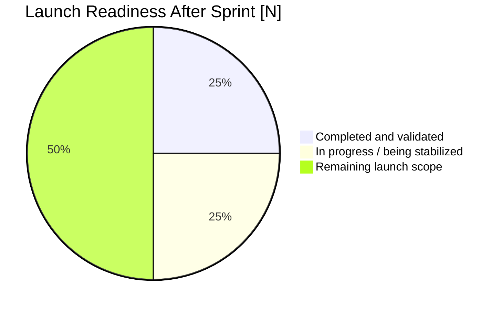

# Sprint [N] Client Review Report

> Fill-in guidance: Duplicate this template after the sprint is complete. Write for the client and business stakeholders. Keep the report concise, visual, and decision-oriented. Do not include developer-level reproduction steps, Plane ticket IDs, internal implementation ownership, or detailed sprint-planning backlog content.

---

## Document Control

> Fill-in guidance: Keep this section short. It should identify the sprint, report timing, launch-plan source, and review basis.

| Field | Value |
|---|---|
| Sprint | Sprint [N] |
| Sprint dates | [Copy from launch plan] |
| Report date | YYYY-MM-DD |
| Prepared by | [Name / role / AI agent] |
| Source launch plan | `local-docs/product-plans/2026-05-13/launch-plan.md` |
| Product environment reviewed | [Staging / production / build number / app version] |

---

# 1. Executive Summary

> Fill-in guidance: Use 3-5 bullets only. Each bullet should tell the client what changed, why it matters, or what needs attention. Avoid technical implementation detail unless it changes business risk or launch readiness.

- [Main sprint achievement and why it matters]
- [Progress made toward launch readiness]
- [Most important completed capability or validated workflow]
- [Most important remaining concern, if any]
- [Client decision or input needed, if any]

---

# 2. Launch Plan Position Snapshot

> Fill-in guidance: This section must be visual, not a repeated sprint listing table. Update the two diagrams so the client can immediately understand where the sprint sits in the launch path and how much launch readiness has moved forward. Keep labels short and business-facing.

## 2.1 Launch Progress Track

> Fill-in guidance: Mark completed stages as `done`, the reviewed sprint as `active`, the next sprint as `next`, and later stages as `future`. Keep each label focused on the business purpose of that stage, not the technical module list.

```mermaid
flowchart LR
    S0["Preparation<br/>Plan and setup"] --> S1["Core Journey<br/>Inquiry to treatment"]
    S1 --> S2["Operational Setup<br/>Config, payment, aftercare"]
    S2 --> S3["Engagement Layer<br/>Messaging, support, notifications"]
    S3 --> S4["Launch Controls<br/>Finance, analytics, UAT"]
    S4 --> L["Soft Launch<br/>Vendor demo readiness"]

    classDef done fill:#E8F5E9,stroke:#2E7D32,color:#1B5E20;
    classDef active fill:#E3F2FD,stroke:#1565C0,color:#0D47A1,stroke-width:3px;
    classDef next fill:#FFF8E1,stroke:#F9A825,color:#5D4037,stroke-width:2px;
    classDef future fill:#F5F5F5,stroke:#9E9E9E,color:#424242;

    class S0 done;
    class S1 active;
    class S2 next;
    class S3,S4,L future;
```

## 2.2 Launch Readiness Gauge

> Fill-in guidance: Update the numbers to approximate the client-facing launch readiness state after this sprint. Use broad categories only. Do not turn this into a detailed task completion chart.

**Current position:** [One sentence explaining where the reviewed sprint sits in the launch path and how it moves the project closer to soft launch.]

**Client takeaway:** [One sentence explaining what the client should understand from the visuals, such as whether the project is on track, where attention is needed, or what the next sprint will unlock.]

---

# 3. Sprint Outcomes

> Fill-in guidance: Combine planned focus, completed work, progress, and review highlights in this one section. Each row should be concise and business-facing. The client should be able to see what was done, why it matters, and whether they need to review or decide anything.

| Area | Planned Focus | Completed / Validated This Sprint | Business Impact | Client Review / Action |
|---|---|---|---|---|
| [Patient / Provider / Admin / Platform / Website / App Store] | [Brief planned focus from launch plan] | [What was completed, validated, or made ready to review] | [Why this matters for launch, operations, revenue, compliance, or user experience] | [Review needed / decision needed / no action needed / watch item] |

---

# 4. Open Items, Risks & Next Sprint Direction

> Fill-in guidance: Keep this section short. Include only items the client should know about because they affect launch confidence, business decisions, expectations, or next sprint direction. Do not turn this into an internal bug list.

| Topic | Business Impact | Current Handling | Next Step / Client Input |
|---|---|---|---|
| [Remaining issue, risk, decision, or next-sprint area] | [What this means for the client or launch readiness] | [How the team is handling it now] | [What happens next, or what the client needs to decide/provide] |
