# FR-001 - Patient Authentication & Profile Management

**Module**: P-01: Auth & Profile Management  
**Feature Branch**: `fr001-patient-authentication`  
**Created**: 2025-10-28  
**Status**: ✅ Verified & Approved  
**Source**: FR-001 from system-prd.md

## Executive Summary

The Patient Authentication & Profile Management module enables patients to securely register, authenticate, and manage their personal profiles within the Hairline platform. This module serves as the foundation for all patient interactions, providing secure access control, profile management, and account recovery capabilities essential for the medical tourism platform.

## Module Scope

### Multi-Tenant Architecture

- **Patient Platform (P-01)**: Auth & Profile Management
- **Provider Platform**: Anonymized patient data access (read-only)
- **Admin Platform (A-01)**: Patient Management & Oversight
- **Shared Services (S-XX)**: Email OTP delivery, session management, audit logging, notification integration

### Multi-Tenant Breakdown

**Patient Platform (P-01)**:

- Register and create accounts via mobile app only
- Login and authenticate with email/password
- Manage profile information (name, email, phone, date of birth, gender, country)
- Update profile image and preferences
- Reset password via email OTP
- Manage notification preferences and privacy settings
- View and manage active device sessions
- Request account deletion (soft-delete handled by admin)
- Access profile overview, settings, and account management features

**Provider Platform**:

- Access anonymized patient data only (no direct patient communication)
- View patient identifiers and basic profile information for assigned cases
- No authentication or profile management capabilities for providers
- Patient data remains anonymized until payment confirmation (per system PRD)

**Admin Platform (A-01)**:

- View all patient accounts and profiles
- Edit patient profile information with audit trail
- Suspend/reactivate patient accounts
- Reset patient passwords
- Manage patient account status and verification state
- View and manage patient authentication logs
- Handle account deletion requests (soft-delete)
- Cannot create new patient accounts (patients must register via mobile app)

**Shared Services (S-XX)**:

- Email service for OTP delivery and notifications
- Session management and authentication tokens
- Audit logging for all authentication and profile changes
- Password hashing and security utilities
- Notification service integration for account-related alerts

### Communication Structure

**In Scope**:

- Patient → System: Registration, login, profile updates, password management
- System → Patient: One-time passcodes (OTP) for email confirmation and password reset, profile update notifications
- Admin → Patient Data: Admin can view and manage patient profiles (with audit trail)
- System → Provider Platform: Anonymized patient data (no direct communication)
- System → Admin: Authentication logs, security events, and account status updates

**Out of Scope**:

- Direct patient-provider communication (handled by FR-012, future)
- Provider-initiated patient account creation
- Admin-initiated patient account creation (patients must register via mobile app)
- Social authentication (Google, Apple, Facebook OAuth - future enhancement)
- Multi-factor authentication beyond email OTP (future enhancement)

### Entry Points

1. **Patient-Initiated**: Primary flow through mobile app registration and login (patients can ONLY be registered via the mobile app)
2. **Admin-Managed**: Admin can manage patient accounts (view/edit/suspend) but CANNOT create new patient accounts
3. **System-Triggered**: Automatic notifications and confirmations (OTP delivery, security alerts)

## Business Workflows

### Workflow 1: Patient Registration (Primary Flow)

**Actors**: Patient, System, Email Service

**Main Flow**:

```mermaid
flowchart TD
   subgraph W1S1["1. App Launch & Service Selection"]
     direction TB
     W1S1_1["Patient opens Hairline mobile app"] --> W1S1_2["Patient sees splash screen with Hairline branding"] --> W1S1_3["Patient navigates to landing screen with &quot;Get Started&quot; option"] --> W1S1_4["Patient taps &quot;Get Started&quot; to begin registration"]
   end

   subgraph W1S2["2. Name Collection"]
     direction TB
     W1S2_1["System displays &quot;First, tell us your name&quot; screen"] --> W1S2_2["Patient enters first name and last name"] --> W1S2_3["Patient taps &quot;Continue&quot; button"] --> W1S2_4["System validates name fields (required, minimum 2 characters)"]
   end

   subgraph W1S3["3. Account Creation"]
     direction TB
     W1S3_1["System displays &quot;Let's create an account with your email&quot; screen"] --> W1S3_2["Patient enters email address"] --> W1S3_3["Patient creates password (12+ characters, at least one uppercase, one lowercase, one digit, and one special character from !@#$%^&(),.?&quot;:{}|&lt;&gt;)"] --> W1S3_4["Patient confirms password"] --> W1S3_5["Patient taps &quot;Create account&quot; button"] --> W1S3_6["System validates email format and password strength"]
   end

   subgraph W1S4["4. Email Verification (OTP)"]
     direction TB
     W1S4_1["System displays &quot;Enter verification code&quot; screen"] --> W1S4_2["System sends a 6-digit OTP code to the patient's email"] --> W1S4_3["Patient enters the 6-digit OTP in the app"] --> W1S4_4["System validates the OTP and confirms email verification (codes expire after 15 minutes; resend available with rate limiting)"]
   end

   subgraph W1S5["5. Profile Completion"]
     direction TB
     W1S5_1["System displays &quot;Create your profile&quot; screen"] --> W1S5_2["Patient selects gender (Male, Female, Other, Prefer not to say)"] --> W1S5_3["Patient selects date of birth using calendar picker"] --> W1S5_4["Patient enters phone number with country code selection"] --> W1S5_5["Patient selects country of residence"] --> W1S5_6["Patient taps &quot;Create account&quot; to complete registration"]
   end

   subgraph W1S6["6. Discovery Question"]
     direction TB
     W1S6_1["System displays &quot;How did you find out about us?&quot; screen"] --> W1S6_2["Patient selects from centrally-managed options configured in Admin Settings (A-09)"] --> W1S6_3["Patient taps &quot;Continue&quot; to proceed to main app"]
   end

  W1S1_4 --> W1S2_1
  W1S2_4 --> W1S3_1
  W1S3_6 --> W1S4_1
  W1S4_4 --> W1S5_1
  W1S5_6 --> W1S6_1
```

**Alternative Flows**:

#### A1: Patient abandons registration mid-process

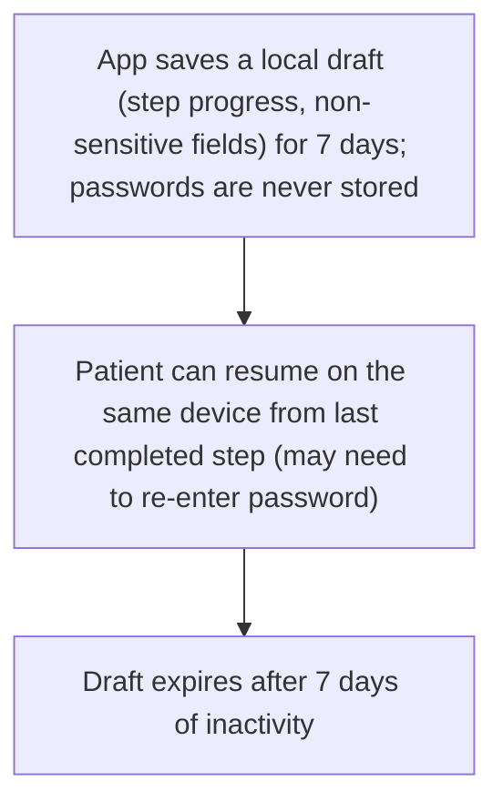

#### A2: Email verification fails or expires

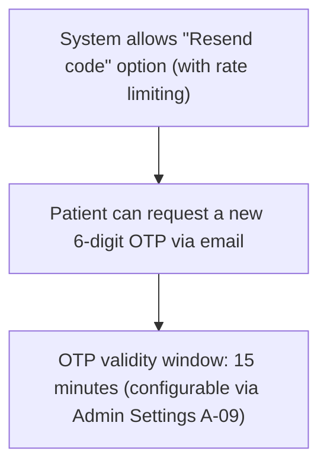

#### A3: Invalid email format or weak password

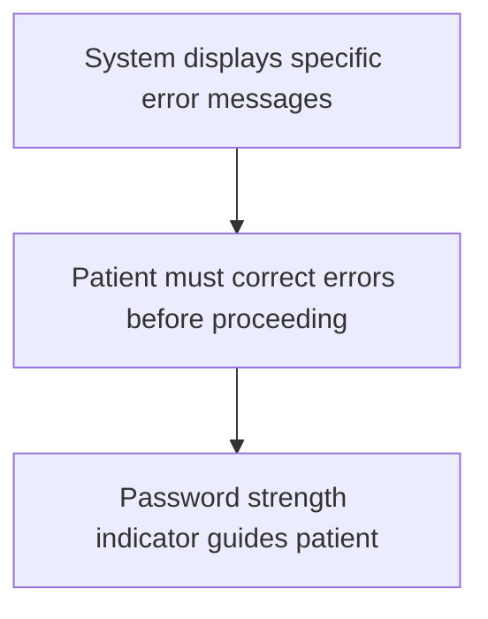

### Workflow 2: Patient Login (Primary Flow)

**Actors**: Patient, System

**Main Flow**:

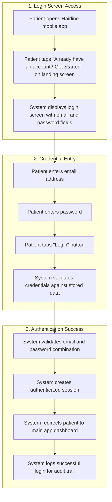

**Alternative Flows**:

#### B1: Invalid credentials

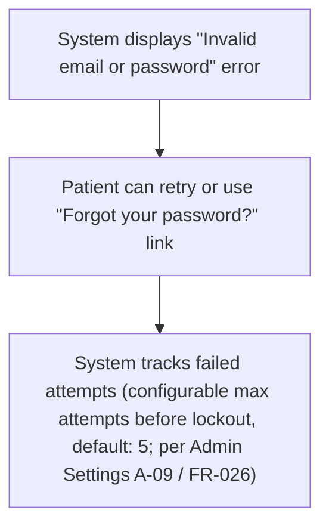

#### B2: Account locked due to failed attempts

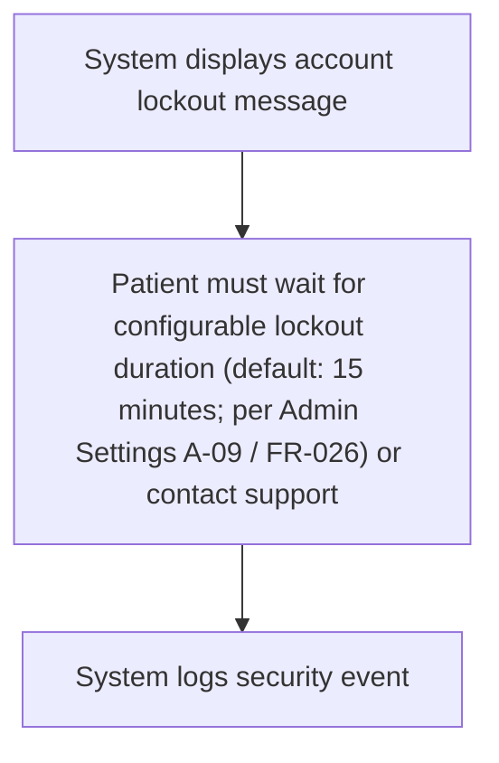

### Workflow 3: Password Reset (Recovery Flow)

**Actors**: Patient, System, Email Service

**Main Flow**:

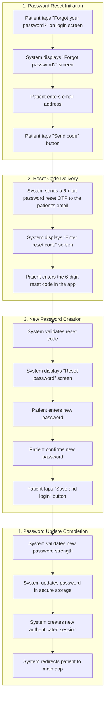

**Alternative Flows**:

#### C1: Reset code expires or is invalid

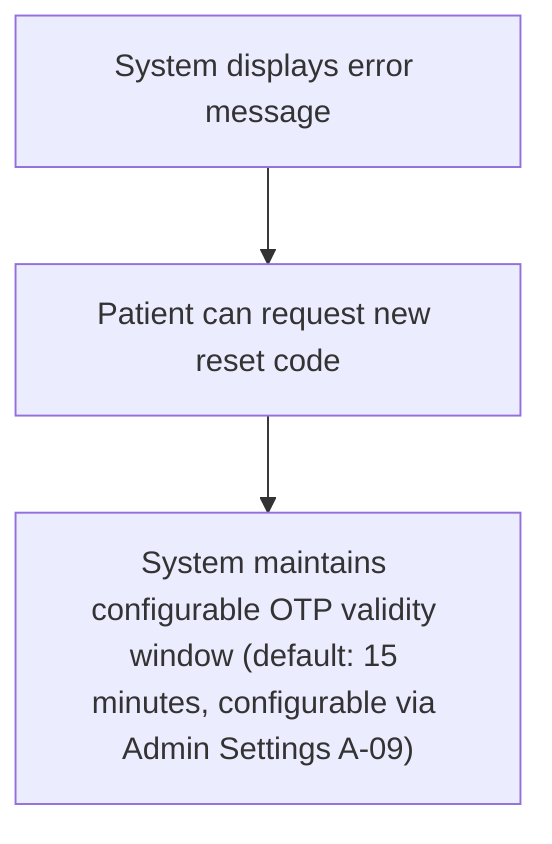

#### C2: Patient doesn't receive email

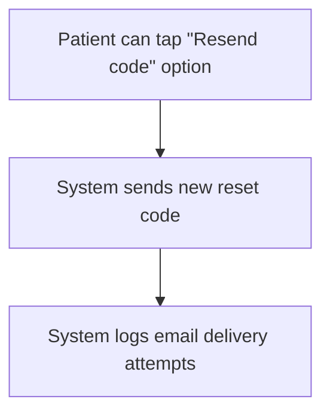

#### C3: Email address not registered

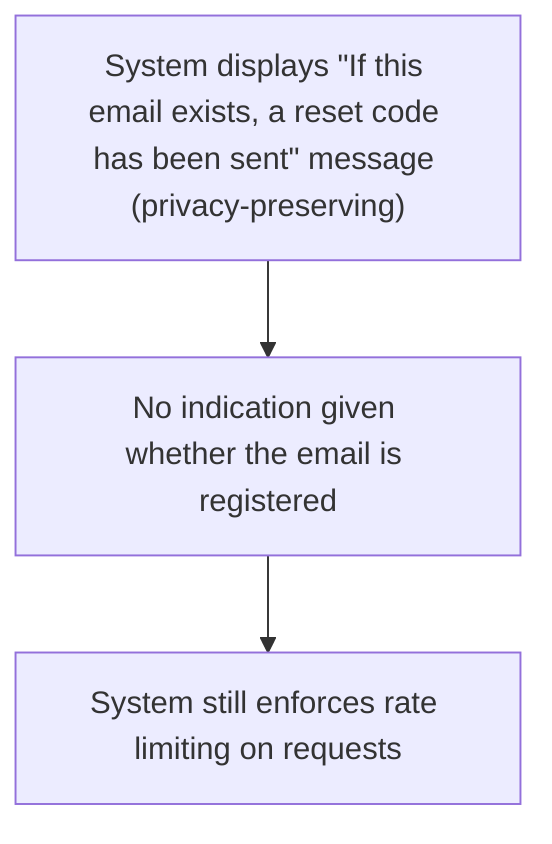

### Workflow 4: Profile Management (Ongoing Flow)

**Actors**: Patient, System, Admin

**Main Flow**:

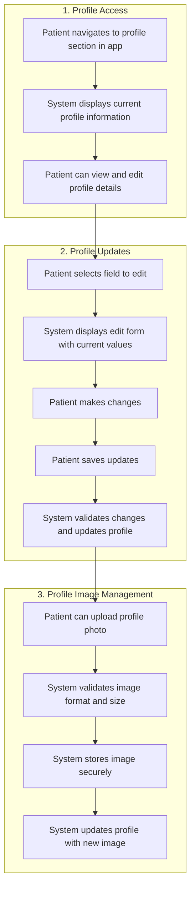

**Alternative Flows**:

#### D1: Admin profile modification

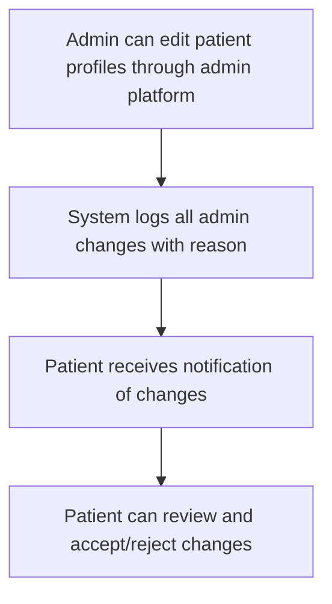

---

## Screen Specifications

### Patient Platform Screens

#### Screen 1: Splash Screen

**Purpose**: Initial app loading and branding display

**Data Fields**:

- Hairline logo with integrated green plus sign
- Loading indicator with animated dots
- App version information (system)

**Business Rules**:

- Splash screen displays for maximum 3 seconds
- Loading animation provides visual feedback
- Branding consistent across all platforms

#### Screen 2: Landing Screen

**Purpose**: Welcome screen with call-to-action for new and returning users

**Data Fields**:

- Background image of satisfied patient
- Semi-transparent overlay for text readability
- "Begin Your Transformation Journey with Hairline" headline
- "Get Started" primary button (green)
- "Already have an account? Get Started" secondary link

**Business Rules**:

- Background image rotates based on admin configuration
- Primary CTA leads to registration flow
- Secondary link leads to login flow
- Screen responsive to different device sizes

#### Screen 3: Name Collection Screen

**Purpose**: Collect patient's first and last name

**Data Fields**:

- "First, tell us your name" header
- Back arrow navigation
- "First name" text input field
- "Last name" text input field
- "Continue" button (green)
- Terms & Conditions link (opens latest published Terms; FR-027)
- Privacy Policy link (opens latest published Privacy Policy; FR-027)
- Terms acceptance checkbox: "I agree to the Terms & Conditions" (required)

**Business Rules**:

- Both name fields are required
- Minimum 2 characters per field
- Maximum 50 characters per field
- Continue button disabled until both name fields are valid and Terms acceptance is checked
- On first acceptance, the app MUST record Terms acceptance via FR-027 acceptance tracking (document type, version, locale, acceptedAt, channel)

#### Screen 4: Account Creation Screen

**Purpose**: Create patient account with email and password

**Data Fields**:

- "Let's create an account with your email" header
- Back arrow navigation
- "Email address" text input field
- "Password" text input field (masked)
- "Confirm password" text input field (masked)
- "Create account" button (green)
- Terms of Service and Privacy Policy footer text

**Business Rules**:

- Email must be valid format
- Password minimum 12 characters, at least one uppercase, one lowercase, one digit, and one special character from !@#$%^&(),.?":{}|<> (fixed in codebase, not editable in Admin)
- Password confirmation must match
- Create account button disabled until all fields valid
- Real-time password strength validation

**Notes**:

- The client transcription mentioned "email, confirmation of email" during signup. This PRD omits a separate "Confirm email" re-entry field because email correctness is verified via 6-digit OTP in the next step (Screen 5), which provides stronger validation than a re-entry field.

#### Screen 5: Email Verification Screen

**Purpose**: Verify patient's email address with OTP

**Data Fields**:

- "Enter verification code" header
- Back arrow navigation
- Six separate input boxes for code digits
- "Continue" button (green)
- "Resend code" link (rate limited)

**Business Rules**:

- Email verification required for account activation
- 6-digit OTP sent automatically to email; codes expire after 15 minutes (configurable)
- Resend option available with rate limiting

#### Screen 6: Profile Creation Screen

**Purpose**: Complete patient profile with additional information

**Data Fields**:

- "Create your profile" header
- Back arrow navigation
- Large green circular icon with person silhouette
- "Gender" dropdown field
- "Date of birth" date picker field
- "Phone number" text input with country code dropdown (centrally managed list)
- "Country" dropdown field (centrally managed list)
- "Create account" button (green)

**Business Rules**:

- Gender options: Male, Female, Other, Prefer not to say
- Date of birth required (minimum age 18)
- Phone number with country code validation
- Country and country code lists are centrally managed in Admin Settings (A-09)
- Country selection affects currency and language preferences
- All fields required to complete registration

#### Screen 7: Calendar Picker Overlay

**Purpose**: Date selection for date of birth

**Data Fields**:

- Month/year navigation arrows
- Calendar grid with selectable dates
- Selected date highlighted in green
- "Done" confirmation button

**Business Rules**:

- Default to current month/year
- Minimum age 18 years enforced
- Maximum age 100 years
- Selected date updates parent form

#### Screen 8: Discovery Question Screen

**Purpose**: Collect information about how patient discovered Hairline

**Data Fields**:

- "How did you find out about us?" header
- Back arrow navigation
- "Select an option" dropdown field (centrally managed list)
- "Continue" button (green)

**Business Rules**:

- Options centrally managed in Admin Settings (A-09)
- Selection required before proceeding (per client transcription: discovery question is part of the mandatory registration flow)
- Data used for marketing analytics
- Continue button disabled until an option is selected
- Continue button proceeds to main app

#### Screen 9: Login Screen

**Purpose**: Authenticate existing patients

**Data Fields**:

- Background image with semi-transparent overlay
- "Login" header
- "Login with email and password" subtitle
- "Email address" text input field
- "Password" text input field (masked)
- "Forgot your password?" link
- "Login" button (green)
- "New to Hairline? Get Started" footer link

**Business Rules**:

- Email and password required
- Password field masked by default
- Forgot password link leads to recovery flow
- Footer link leads to registration flow
- Failed attempts tracked for security

#### Screen 10: Password Reset Initiation Screen

**Purpose**: Initiate password reset process

**Data Fields**:

- "Forgot password?" header
- Back arrow navigation
- "Enter your email to request a password reset code" instruction
- "Email address" text input field
- "Send code" button (green)

**Business Rules**:

- Email address required
- Reset code sent to registered email
- OTP validity window: 15 minutes (configurable via Admin Settings A-09)
- Rate limiting prevents abuse

#### Screen 11: Reset Code Entry Screen

**Purpose**: Enter 6-digit password reset verification code

**Data Fields**:

- "Enter reset code" header
- Back arrow navigation
- "Enter the 6 digit code that you received in your email" instruction
- Six separate input boxes for code digits
- "Continue" button (green)
- "Resend code" link

**Business Rules**:

- 6-digit numeric code required
- Code expires after 15 minutes (configurable via Admin Settings A-09)
- Resend option available
- Invalid code shows error message

#### Screen 12: Password Reset Screen

**Purpose**: Create new password

**Data Fields**:

- "Reset password" header
- Back arrow navigation
- "Enter a new password and login to their account" instruction
- "Password" text input field with visibility toggle
- "Confirm Password" text input field
- "Save and login" button (green)

**Business Rules**:

- New password must meet strength requirements (12+ chars, 1 upper, 1 lower, 1 digit, 1 special from !@#$%^&(),.?":{}|<>)
- Password confirmation must match
- Password visibility toggle available
- Successful reset creates new session

### Admin Platform Screens

#### Screen 13: Patient Management Dashboard

**Purpose**: Admin oversight of patient accounts

**Data Fields**:

- Patient list with search and filter options
- Patient status indicators (Active, Inactive, Pending Verification)
- Profile completion status
- Last login information
- Action buttons (Edit, View, Suspend)

**Business Rules**:

- Admin can view all patient profiles
- Admin can edit patient information with reason logging
- Admin can suspend/reactivate accounts
- All admin actions logged for audit trail

#### Screen 14: Profile Overview (Patient)

**Purpose**: Show patient's profile with key actions

**Data Fields**:

- Large circular avatar placeholder
- Patient full name
- Patient email
- **Action Buttons** (top section): "Profile edit", "Settings"
- **Menu Items** (scrollable list):
  - Payment method
  - Previous treatment (Completed only)
  - Reviews
  - Delete account (navigates to Screen 17; destructive action)
  - Logout

**Business Rules**:

- All items navigable; back navigation available
- Delete account submits a data deletion request (DSR) queued for Admin review per FR-023
- Sensitive actions (delete account) require re-auth within the last 5 minutes (password or 6-digit OTP)
- If there is an active treatment or aftercare case, delete account is blocked with guidance to contact support
- If there is an active payment in progress, delete account is blocked until payment flow completes
- If there is an active inquiry, delete account is allowed and the system cancels the inquiry using FR-003 cancellation mechanics (status = "Cancelled"; cancellation reason = "Account Deleted (System)"; reason is not shared with providers)
- **Note**: System-triggered inquiry cancellation due to account deletion request is distinct from patient-initiated inquiry cancellation (FR-003 Workflow 5). Both end in status "Cancelled", but the cancellation reason provenance differs (system-generated vs patient-provided).

**Acceptance Scenarios**:

1. Given patient is authenticated, When opening Profile tab, Then avatar, name, email, and actions (Profile edit, Settings) are visible and tappable.
2. Given patient taps Delete account, When re-auth is not fresh (>5 minutes), Then system prompts for password or sends 6-digit OTP to email and only proceeds on success.
3. Given patient has an active treatment or aftercare, When confirming Delete account, Then system blocks action and shows message “Account deletion is unavailable during active care; contact support.”
4. Given patient has a payment in progress, When confirming Delete account, Then system blocks action until payment finishes, with a message to retry later.
5. Given patient selects Logout, When confirmed, Then session tokens are revoked and user returns to Landing screen.
6. Given patient selects Reviews, When eligible (Completed ≥ 3 months), Then “Write review” CTA is shown; else read-only history only.
7. Given patient opens Previous treatment, Then list shows only Completed items with links to details.

#### Screen 15: Edit Profile

**Purpose**: Allow patient to edit core profile fields

**Data Fields**:

- Avatar with add/update overlay
- First name, Last name
- Email address (may require re-verification if changed)
- Phone number with country code (centrally managed list)
- Birthday (date picker)
- Gender (enum)
- Location / Country (centrally managed list)
- "Save and update" button

**Business Rules**:

- Validation applied per field; back navigation available
- Email change triggers re-verification via 6-digit OTP

#### Screen 16: Settings Main Screen

**Purpose**: Top-level settings navigation hub

**Data Fields**:

| Field Name | Type | Required | Description | Validation Rules |
|---|---|---|---|---|
| Screen Title | text | Yes | "Settings" | Displayed at top of screen |
| Back Navigation | action | Yes | Back arrow to return to Profile screen (Screen 14) | Top-left corner |
| Notification Settings | link | Yes | Row with bell icon + "Notification Settings" label + chevron | Navigates to Screen 16a |
| Privacy & Security | link | Yes | Row with lock icon + "Privacy & Security" label + chevron | Navigates to Screen 16b |
| Terms & Conditions | link | Yes | Row with document icon + "Terms & Conditions" label + chevron | Navigates to Screen 16d |
| Help & Support | link | Yes | Row with help/question icon + "Help & Support" label + chevron | Navigates to Help & Support flow (FR-033/FR-034) |

**Business Rules**:

- Navigation sections are static items — always visible in the same order
- Tapping a navigation row opens the corresponding sub-screen and preserves back navigation to Screen 16
- Help & Support routes to the Help Center & Support Access module (FR-033/FR-034)
- Settings items are patient-app only; no provider/admin controls appear here

**Minimal API/State (Reference)**:

- GET/PUT user profile (firstName, lastName, phone, countryCode, country)
- GET/PUT notificationPreferences { email, push }
- POST changePassword { oldPassword, newPassword }
- POST deleteAccountRequest { reason? } (deletion request / DSR; queued for Admin review per FR-023)
- Read-only lists: previousTreatments[], reviews[]

#### Screen 16a: Notification Settings

**Purpose**: Manage push and email notification preferences

**Data Fields**:

| Field Name | Type | Required | Description | Validation Rules |
|---|---|---|---|---|
| Screen Title | text | Yes | "Notification Settings" | Displayed at top |
| Back Navigation | action | Yes | Back arrow to return to Settings Main (Screen 16) | Top-left corner |
| Explanation Text | text | Yes | "Choose how you want to receive notifications from Hairline." | Displayed below title for context |
| MVP Notice (Conditional) | text | Conditional | "Per-category preferences coming soon. For now, you can enable/disable all notifications by channel." | Shown only in MVP; removed in V2 when per-category toggles ship |
| Global Email Toggle | toggle | Yes | Master switch: "Email Notifications" with ON/OFF state | Auto-saves immediately on toggle; default for new accounts: ON |
| Global Push Toggle | toggle | Yes | Master switch: "Push Notifications" with ON/OFF state | Auto-saves immediately on toggle; default for new accounts: ON |
| Mandatory Notifications Note | text | Yes | "Security notifications (password reset, account changes) are always sent and cannot be disabled." | Displayed below toggles as info text |
| System Event Notifications Note | text | Yes | "You will receive automatic notifications when your inquiry, booking, or payment status changes (including Inquiry Cancelled, Quote Received, Booking Confirmed, Payment events, and Aftercare reminders). These keep you informed of important updates." | Read-only informational text; per FR-020 |
| Save Status Indicator (Conditional) | text | Conditional | "Saved" or "Saving..." feedback | Shown briefly after toggle change; success message: "Preferences saved" |
| Error Message (Conditional) | text | Conditional | Displayed if save fails | "Failed to save preferences. Please try again." with Retry button; on failure, UI reverts to last saved state |

**Business Rules**:

- **MVP scope**: Only global Email/Push toggles available; per-category preferences (Inquiry, Quote, Booking, Payment, Aftercare, Marketing) are deferred to V2
- Security-critical notifications (email verification, password reset, account security alerts) are mandatory and cannot be disabled — not affected by global toggles
- System event notifications (inquiry stage changes including Inquiry Cancelled, quote received, booking confirmed, payment events, aftercare reminders) are automatically sent per FR-020; user cannot disable individual events in MVP
- Changes auto-save immediately upon toggle (no explicit "Save" button); preference changes effective within 1 minute; default for new accounts: both Email and Push toggles ON
- Marketing notifications are OFF by default unless explicit consent is stored (applies when V2 categories ship)
- If save fails, UI MUST revert to previous toggle state and show actionable error with Retry option

**Acceptance Scenarios**:

1. Given user toggles Push OFF, When saved (immediate), Then push notifications stop within 1 minute.
2. Given a save error occurs, When toggling a global control (Email/Push), Then UI reverts to prior state and displays error message with retry option.
3. Given inquiry stage changes (e.g., Quote received), When Email or Push is ON, Then the user receives a stage update notification according to FR-020.
4. Given user changes notification preferences, Then a preference-change audit entry is recorded with who/when/before/after.

#### Screen 16b: Privacy & Security Menu

**Purpose**: Provide access to security and privacy items

**Data Fields**:

| Field Name | Type | Required | Description | Validation Rules |
|---|---|---|---|---|
| Screen Title | text | Yes | "Privacy & Security" | Displayed at top |
| Back Navigation | action | Yes | Back arrow to return to Settings Main (Screen 16) | Top-left corner |
| Change Password | link | Yes | Row with key icon + "Change Password" label + chevron | Navigates to Screen 18 (Change Password flow) |
| Privacy Policy | link | Yes | Row with shield/document icon + "Privacy Policy" label + chevron | Navigates to Screen 16c |

**Business Rules**:

- Change Password always routes to Screen 18; this menu does not embed inline password-edit controls
- Privacy Policy is read-only static content sourced from the Legal Content system (FR-027)
- If legal content cannot be loaded, show a retry state and allow returning to Screen 16 without blocking the user
- This menu contains only patient-facing items (no admin/provider configuration)
- All server-write actions use optimistic UI with retry/backoff; on final failure, UI rolls back to last persisted values

**Acceptance Scenarios**:

1. Given user selects Change Password and submits currentPassword and a new password that meets policy, When request succeeds, Then prior refresh tokens are revoked and user remains logged in with current session.
2. Given user cannot remember current password, When they tap "Forgot your password?" on the Change Password screen, Then the app routes to Password Reset Initiation (Screen 10).

#### Screen 16c: Privacy Policy

**Purpose**: Display Privacy Policy content (static/read-only)

**Data Fields**:

| Field Name | Type | Required | Description | Validation Rules |
|---|---|---|---|---|
| Screen Title | text | Yes | "Privacy Policy" | Displayed at top |
| Back Navigation | action | Yes | Back arrow to return to Privacy & Security menu (Screen 16b) | Top-left corner |
| Policy Version | badge | Conditional | Current legal content version label | Shown if version metadata is available (FR-027) |
| Last Updated | datetime | Conditional | Last updated timestamp for the policy | Shown if available (FR-027) |
| Policy Content | text | Yes | Scrollable rich-text policy body | Must be readable and selectable; supports long content |
| Loading State (Conditional) | text | Conditional | Loading indicator while content fetches | Shown during content load |
| Error State (Conditional) | text | Conditional | Non-blocking error with Retry and Back options | "Unable to load content. Please try again." with Retry button |

**Business Rules**:

- Policy content is read-only and must match the latest published Privacy Policy for the patient app (FR-027)
- If a newer version is published while the user is viewing, the app may prompt to refresh but must not interrupt reading
- If content fails to load, show a non-blocking error state with Retry and Back navigation
- Analytics/audit (if implemented) must not capture the policy text itself; only view events and version identifiers (privacy-by-design)

**Acceptance Scenarios**:

1. Given user opens Privacy Policy, Then the latest published policy content is shown with version label, last updated date (if available), and working back navigation (FR-027).

#### Screen 16d: Terms & Conditions

**Purpose**: Display Terms & Conditions content (static/read-only)

**Data Fields**:

| Field Name | Type | Required | Description | Validation Rules |
|---|---|---|---|---|
| Screen Title | text | Yes | "Terms & Conditions" | Displayed at top |
| Back Navigation | action | Yes | Back arrow to return to Settings Main (Screen 16) | Top-left corner |
| Document Version | badge | Conditional | Current legal content version label | Shown if version metadata is available (FR-027) |
| Last Updated | datetime | Conditional | Last updated timestamp for the document | Shown if available (FR-027) |
| Document Content | text | Yes | Scrollable rich-text terms body | Must be readable and selectable; supports long content |
| Loading State (Conditional) | text | Conditional | Loading indicator while content fetches | Shown during content load |
| Error State (Conditional) | text | Conditional | Non-blocking error with Retry and Back options | "Unable to load content. Please try again." with Retry button |

**Business Rules**:

- Terms content is read-only and must match the latest published Terms & Conditions for the patient app (FR-027)
- If a newer version is published while the user is viewing, the app may prompt to refresh but must not interrupt reading
- If content fails to load, show a non-blocking error state with Retry and Back navigation
- Analytics/audit (if implemented) must not capture the document text itself; only view events and version identifiers (privacy-by-design)

**Acceptance Scenarios**:

1. Given user opens Terms & Conditions, Then the latest published terms content is shown with version label, last updated date (if available), and working back navigation (FR-027).

**Help & Support Acceptance Scenario**:

1. Given user opens Help and support → Report a problem, When submitting feedback, Then device/os/app version and timestamp are attached; submissions are throttled to prevent spam.

**Data/Validation & Audit Acceptance Scenarios**:

1. Given user changes password, Then a security audit entry is recorded and password policy is enforced.
2. Given user initiates a password reset (forgot password), Then audit captures the reset request event (without storing OTP codes).

#### Screen 17: Delete Account (Deletion Request / DSR)

**Purpose**: Allow patient to submit a data deletion request (right to erasure) with clear expectations and legal retention disclosures

**Data Fields**:

- Back navigation
- Warning icon + "Delete your account" header
- Blocking message (if active treatment/aftercare or payment in progress) with "Contact support" link
- Consequences section: what may be deleted/anonymized (PII, preferences, messages, reviews, uploaded media where not legally retained)
- Retained data section: what will be retained and why (medical + financial records retained ≥ 7 years; restricted access)
- Processing timeline notice: verified deletion requests completed within 30 calendar days (SLA)
- Optional "Reason for deletion" selector (does not block submission)
- Primary CTA: "Request deletion"
- Final confirmation modal: "Submit deletion request?" (Confirm / Cancel)
- **Identity re-verification step (conditional)**: When last auth > 5 minutes, system navigates to Screen 19 (Identity Re-verification) before showing the final confirmation modal. On successful verification, patient returns to the confirmation modal.
- Submission confirmation state: "Deletion request submitted" with request reference and next steps (status updates, possible additional verification)

**Business Rules**:

- Delete account is a request flow (DSR) queued for Admin review and fulfillment per FR-023; no immediate hard-delete occurs in-app
- If active treatment/aftercare exists, deletion request is blocked with guidance to contact support (patient safety)
- If payment is in progress, deletion request is blocked until payment completes
- If an active inquiry exists, deletion request is allowed and system auto-closes open inquiries
- Sensitive action re-auth required when last successful auth > 5 minutes; re-auth via Screen 19 (Identity Re-verification) using password or 6-digit email OTP
- Deletion reason is optional and must not block request submission (`deleteAccountRequest { reason? }`)
- Verification failures and throttling/lockout behavior follow configured authentication security policy (do not hardcode attempt counts in UI copy)
- On submission: system creates deletion request record, sends confirmation, and later sends status updates and outcome (including legal basis for any retained records)

#### Screen 18: Change Password

**Purpose**: Allow an authenticated patient to change their password (with an in-flow link to password reset if they forgot the current password)

**Data Fields**:

| Field Name | Type | Required | Description | Validation Rules |
|---|---|---|---|---|
| Screen Title | text | Yes | "Change Password" | Displayed at top |
| Back Navigation | action | Yes | Back arrow to return to Privacy & Security menu (Screen 16b) | Top-left corner |
| Current Password | text | Yes | Masked password input | Required; show/hide toggle icon |
| Forgot Your Password Link | link | Yes | "Forgot your password?" link shown under Current Password | Navigates to Password Reset Initiation (Screen 10) |
| New Password | text | Yes | Masked password input | Must meet password policy (12+ chars, mixed case, digit, special char) |
| Confirm New Password | text | Yes | Masked password input | Must match New Password exactly |
| Password Policy Helper | text | Yes | Short reminder of password requirements | Must not list attempt limits; reference policy only |
| Save Button | button | Yes | Primary CTA: "Save" | Disabled until all required fields are present |
| Error Message (Conditional) | text | Conditional | Inline field-level errors for validation or server failures | Must not reveal whether current password is correct — use generic "Unable to change password. Please check your entries and try again." |
| Throttle/Lockout Message (Conditional) | text | Conditional | Displayed when authentication throttling or lockout is triggered | "Too many attempts. Please try again later." with back navigation to Screen 16b |

**Business Rules**:

- Current password is required for in-session password change; user must use Password Reset if they cannot provide current password (Screens 10–12)
- New password must meet password rules and cannot reuse last 5 passwords
- Do not hardcode attempt counts in UI copy; throttling/lockout follows configured authentication security policy
- Validation errors shown inline without revealing sensitive details (avoid "current password incorrect" style disclosures)
- On success: prior refresh tokens are revoked and current session remains active; system displays Screen 18a (success confirmation)
- If throttled/locked, show blocked message and navigate back to Screen 16b

#### Screen 18a: Password Changed Confirmation

**Purpose**: Confirm password change succeeded and return user back to settings

**Data Fields**:

| Field Name | Type | Required | Description | Validation Rules |
|---|---|---|---|---|
| Confirmation Icon | icon | Yes | Green success checkmark icon | Displayed prominently at top center |
| Screen Title | text | Yes | "Password Updated" | Displayed prominently |
| Message Text | text | Yes | Short confirmation copy (e.g., "Your password has been successfully changed.") | Must not include attempt limits or sensitive details |
| Done Button | button | Yes | Primary CTA: "Done" | Returns to Privacy & Security menu (Screen 16b) |

**Business Rules**:

- Confirmation screen is shown only after the server confirms the password change
- If token revocation fails after password change succeeds, the user still sees success but the app MUST retry revocation in background and log a security event
- Returning to Settings must preserve navigation state (back stack returns to Screen 16b)

#### Screen 19: Identity Re-verification (Shared Component)

**Purpose**: Verify patient identity before performing sensitive actions (used by Screen 17 Delete Account and any future sensitive action requiring re-auth)

**Data Fields**:

| Field Name | Type | Required | Description | Validation Rules |
|---|---|---|---|---|
| Screen Title | text | Yes | "Verify Your Identity" | Displayed at top |
| Back Navigation | action | Yes | Back arrow to return to the calling screen | Top-left corner; cancels the sensitive action flow |
| Security Icon | icon | Yes | Lock or shield icon indicating security step | Displayed at top center |
| Instruction Text | text | Yes | "For your security, please verify your identity before proceeding." | Clear, concise explanation |
| Verification Method Selector | chips | Yes | Options: "Password" or "Email OTP" | Patient can switch methods; methods per FR-001 auth policy |
| Password Field (Conditional) | text | Conditional | Masked password input; shown if "Password" method selected | Must match current account password; show/hide toggle icon |
| Email OTP Field (Conditional) | text | Conditional | 6-digit OTP input; shown if "Email OTP" method selected | System sends OTP to registered email; code expires in 15 minutes |
| Resend OTP Link (Conditional) | link | Conditional | Shown only if "Email OTP" method selected | Rate-limited; cooldown applies per OTP rules |
| Error Message (Conditional) | text | Conditional | Displayed on verification failure | Actionable: "Invalid password/code. Please try again." |
| Verify Button | button | Yes | Primary CTA: "Verify" | Disabled until password entered OR 6-digit OTP entered; on success, returns to calling screen's next step |
| Cancel Button | button | Yes | Secondary CTA: "Cancel" | Returns to the calling screen; cancels the sensitive action |

**Business Rules**:

- Re-verification is required when last successful auth > 5 minutes (configurable threshold)
- Selecting "Email OTP" sends a 6-digit code to the registered email; code expires in 15 minutes; resend is rate-limited
- Verification failures, throttling, and any lockout behavior follow the configured authentication security policy (do not hardcode attempt counts in UI copy)
- Successful verification returns the patient to the calling screen's next step (e.g., final confirmation modal for Delete Account)
- Patient can cancel at any time to exit without completing the sensitive action
- This screen is a shared component reused across all sensitive actions requiring re-auth (currently: Delete Account Screen 17; extensible to future sensitive actions)

## Business Rules

### General Authentication Rules

1. **Registration Rules**
   - Email addresses must be unique across the platform
   - Password must meet minimum security requirements
   - Email verification required for full account access
   - Profile completion required before inquiry submission

2. **Login Rules**
   - Maximum failed login attempts before account lockout (configurable in Admin Settings A-09)
   - Lockout duration after failed attempts (configurable in Admin Settings A-09)
   - Session timeout after 24 hours of inactivity
   - Successful logins logged for security monitoring

3. **Password Rules**
   - Minimum 12 characters
   - Must contain at least one uppercase, one lowercase, one digit, and one special character from !@#$%^&(),.?":{}|<>
   - Cannot reuse last 5 passwords
   - Email verification and password reset use 6-digit OTP codes
   - OTP validity windows and resend rate limits are configurable (Admin Settings A-09)

### Data and Privacy Rules

1. **Data Protection**
   - All passwords hashed using bcrypt (cost factor 12+)
   - Personal data encrypted at rest
   - Profile images stored securely with access controls
   - Audit trail maintained for all profile changes

2. **Data Access**
   - Patients can only access their own profile data
   - Admin can access all patient data with justification logging
   - Provider platform receives anonymized patient data only
   - Data retention follows 7-year healthcare compliance requirement

3. **Data Security**
   - All authentication attempts logged
   - Failed login attempts monitored for security threats
   - Profile changes require re-authentication for sensitive fields
   - Account lockout prevents brute force attacks

### Admin Editability Rules

1. **Full Admin Override**
   - Admin can edit ALL patient profile data
   - Admin can modify patient account status
   - Admin can reset patient passwords
   - Admin can suspend/reactivate patient accounts

2. **Edit Capabilities**
   - **Profile Data**: Modify name, email, phone, address, preferences
   - **Account Status**: Change active/inactive status, verification status
   - **Security**: Reset passwords, unlock accounts, modify security settings
   - **Preferences**: Update language, currency, notification settings

3. **Edit Tracking**
   - All admin edits logged with timestamp and admin identification
   - Change reason required for all modifications
   - Patient notified of significant changes via email
   - Edit history maintained for audit trail

### UI/UX Display Rules

1. **Form Validation**
   - Real-time validation for email format and password strength
   - Clear error messages for invalid inputs
   - Visual indicators for required fields
   - Progress indicators for multi-step processes

2. **Error Handling**
   - User-friendly error messages
   - Specific guidance for password requirements
   - Clear instructions for email verification
   - Graceful handling of network errors

3. **Accessibility**
   - Support for screen readers and assistive technologies
   - High contrast mode support
   - Large text options for readability
   - Voice input support where applicable
   - Every screen MUST provide a clear route to go back to the previous step when applicable

### Validation and Constraints

1. **Input Validation**
   - Email format validation (RFC 5322 compliant)
   - Password strength validation with visual indicators
   - Phone number format validation by country
   - Date of birth validation (age restrictions)

2. **Business Logic Validation**
   - Unique email address enforcement
   - Account status validation for login attempts
   - Verification status checking for account access
   - Rate limiting for password reset requests

## Success Criteria

### Patient Experience Metrics

- **SC-001**: 95% of patients can complete registration in under 5 minutes
- **SC-002**: 90% of patients successfully verify email on first attempt
- **SC-003**: 85% of patients can complete login in under 30 seconds
- **SC-004**: Patient satisfaction score of 4.5+ stars for authentication process

### Security Metrics

- **SC-005**: Zero successful brute force attacks on patient accounts
- **SC-006**: 100% of password reset attempts properly validated
- **SC-007**: All authentication events logged with 99.9% accuracy
- **SC-008**: Account lockout prevents 95% of unauthorized access attempts

### Admin Management Metrics

- **SC-009**: Admin can manage all patient accounts from single dashboard
- **SC-010**: 95% of profile issues resolved without patient contact
- **SC-011**: Admin dashboard loads with all data in under 3 seconds
- **SC-012**: Admin can edit patient data with full audit trail

### System Performance Metrics

- **SC-013**: Login authentication completes in under 2 seconds
- **SC-014**: Registration process completes in under 30 seconds
- **SC-015**: System supports 1000+ concurrent authentication requests
- **SC-016**: 99.9% uptime for authentication services during business hours

### Business Impact Metrics

- **SC-017**: 90% of registered patients complete profile setup
- **SC-018**: 25% reduction in authentication-related support tickets
- **SC-019**: 50% improvement in patient onboarding completion rate
- **SC-020**: 30% increase in patient engagement after streamlined registration

## Dependencies

### Internal Dependencies

- **FR-003**: Inquiry Submission & Distribution (requires completed profile)
- **FR-020**: Notifications & Alerts (email verification, password reset)
- **FR-025**: Medical Questionnaire Management (profile integration)
- **FR-026**: App Settings & Security Policies (OTP + throttling config; centrally managed lists)
- **FR-027**: Legal Content Management (Terms/Privacy content + acceptance tracking)
- **FR-023**: Data Retention & Compliance (DSR deletion request handling)
- **Future FR**: Multi-Factor Authentication (security enhancement)

### External Dependencies

- **Email Service**: SendGrid for verification and reset emails
- **SMS Service**: Twilio for phone number verification (future; **no SMS-based verification is available in MVP and may be introduced in a later phase in coordination with S-03/FR-020/FR-030**)
- **Social Auth**: Google, Apple, Facebook OAuth (future enhancement)
- **Analytics Service**: User behavior tracking and analytics

### Data Dependencies

- **Patient Data**: Core patient profile and authentication data
- **Admin Data**: Admin user accounts and permissions
- **System Data**: Configuration settings and audit logs
- **Notification Data**: Email templates and delivery tracking

## Assumptions

### User Behavior Assumptions

- **Assumption 1**: Patients will actively complete registration and provide accurate information
- **Assumption 2**: Patients prefer streamlined registration over comprehensive data collection
- **Assumption 3**: Patients have reliable access to email for verification and password reset
- **Assumption 4**: Patients understand password security requirements and will follow password strength guidelines

### Technology Assumptions

- **Assumption 1**: Patients have smartphones with camera and internet access
- **Assumption 2**: Patients use mobile devices (iOS/Android) with modern operating systems
- **Assumption 3**: Patients have reliable internet connectivity for authentication and profile management
- **Assumption 4**: Email service provider maintains high delivery rates for OTP and notification emails

### Business Process Assumptions

- **Assumption 1**: Admin team has capacity to manage patient accounts and resolve issues
- **Assumption 2**: Healthcare data handling meets regulatory requirements (HIPAA/GDPR compliance)
- **Assumption 3**: Patients will provide accurate personal information during registration
- **Assumption 4**: Account lockout and security measures are understood and accepted by users

## Implementation Notes

### Technical Considerations

- **Security-First Design**: Authentication system designed with security as primary concern
- **Mobile Optimization**: All screens optimized for mobile devices and touch interaction
- **Offline Capability**: Core authentication features should work with limited connectivity
- **Performance**: Authentication responses must be sub-second for optimal user experience

### Integration Points

- **Patient Module**: Seamless integration with patient profile and preferences
- **Admin Module**: Integration with admin oversight and account management
- **Notification Module**: Automated email notifications in MVP; SMS notifications are a future enhancement dependent on S-03/FR-020/FR-030 and are **not** available currently
- **Analytics Module**: User behavior tracking and security monitoring

### Scalability Considerations

- **Database Design**: Efficient querying for large numbers of patient accounts
- **Session Management**: Scalable session storage and management
- **Rate Limiting**: Protection against abuse and brute force attacks
- **Load Balancing**: Support for high concurrent authentication requests

### Security Considerations

- **Encryption**: All sensitive data encrypted at rest and in transit
- **Access Control**: Strict role-based access to patient data
- **Audit Logging**: Comprehensive logging of all authentication activities
- **Compliance**: Healthcare data protection regulations compliance

---

## User Scenarios & Testing

### User Story 1 - Patient Registration (Priority: P1)

A new patient successfully registers an account through the mobile app, completes email verification, and sets up their profile.

**Why this priority**: This is the foundational user journey that enables all other platform interactions. Without successful registration, patients cannot access any platform features.

**Independent Test**: Can be fully tested by walking through the complete registration flow from app launch to profile completion, verifying each step completes successfully and account is created.

**Acceptance Scenarios**:

1. **Given** patient opens the mobile app for the first time, **When** patient taps "Get Started", **Then** system displays name collection screen
2. **Given** patient enters name and email/password, **When** patient submits account creation form, **Then** system validates inputs and sends OTP email
3. **Given** patient receives OTP email, **When** patient enters correct 6-digit code, **Then** system verifies email and proceeds to profile completion
4. **Given** patient completes profile with all required fields, **When** patient submits profile, **Then** system creates account and redirects to discovery question
5. **Given** patient answers discovery question, **When** patient taps Continue, **Then** system completes registration and redirects to main app dashboard

---

### User Story 2 - Patient Login (Priority: P1)

An existing patient successfully logs into their account using email and password credentials.

**Why this priority**: This is essential for returning users to access the platform. All authenticated features depend on successful login.

**Independent Test**: Can be fully tested by attempting login with valid credentials, verifying session creation and dashboard access.

**Acceptance Scenarios**:

1. **Given** patient has an existing account, **When** patient enters correct email and password, **Then** system authenticates and creates session
2. **Given** patient enters incorrect credentials, **When** patient attempts login, **Then** system displays error message and tracks failed attempt
3. **Given** patient exceeds configured max failed login attempts (default: 5; per Admin Settings A-09 / FR-026), **When** patient attempts login again, **Then** system locks account and displays lockout message
4. **Given** patient successfully logs in, **When** session is created, **Then** system logs authentication event and redirects to dashboard

---

### User Story 3 - Password Reset (Priority: P2)

A patient who forgot their password successfully resets it using email OTP verification.

**Why this priority**: Password recovery is critical for account accessibility and reduces support burden. However, it's secondary to initial registration and login flows.

**Independent Test**: Can be fully tested by initiating password reset flow, verifying OTP delivery, and confirming password change completes successfully.

**Acceptance Scenarios**:

1. **Given** patient forgot password, **When** patient requests password reset, **Then** system sends OTP to registered email
2. **Given** patient receives reset OTP, **When** patient enters correct code, **Then** system validates code and allows new password entry
3. **Given** patient enters new password meeting requirements, **When** patient confirms password, **Then** system updates password and creates new session
4. **Given** reset OTP expires, **When** patient tries to use expired code, **Then** system displays error and allows requesting new code

---

### User Story 4 - Profile Management (Priority: P2)

A patient successfully updates their profile information and manages account settings.

**Why this priority**: Profile management enables users to maintain accurate information and customize their experience. Important but not blocking for core platform functionality.

**Independent Test**: Can be fully tested by accessing profile, editing fields, and verifying changes are saved and reflected correctly.

**Acceptance Scenarios**:

1. **Given** patient is authenticated, **When** patient navigates to profile, **Then** system displays current profile information
2. **Given** patient edits profile field, **When** patient saves changes, **Then** system validates and updates profile with audit log
3. **Given** patient changes email address, **When** patient saves, **Then** system triggers email re-verification via OTP
4. **Given** patient updates notification preferences, **When** patient saves, **Then** system applies changes within 1 minute

---

### Edge Cases

- What happens when patient attempts to register with an email that already exists?
- How does system handle OTP delivery failure or email service unavailability?
- What occurs if patient's device loses internet connection during registration process?
- How to manage concurrent login attempts from multiple devices?
- What happens when patient attempts to reset password for non-existent email?
- How does system handle account lockout expiration and unlock process?
- What occurs if patient tries to delete account with active treatment/aftercare case?
- How to manage session timeout and automatic logout behavior?
- What happens when admin modifies patient profile while patient is viewing it?
- How does system handle password reset OTP expiration mid-flow?

---

## Functional Requirements Summary

### Core Requirements

- **REQ-001-001**: System MUST allow patients to register accounts via mobile app only with email and password
- **REQ-001-002**: System MUST require email verification via 6-digit OTP before account activation
- **REQ-001-003**: System MUST authenticate patients with email and password credentials
- **REQ-001-004**: System MUST support password reset via email OTP verification
- **REQ-001-005**: System MUST allow patients to view and edit their profile information
- **REQ-001-006**: System MUST enforce password strength requirements (12+ chars, mixed case, numbers, special chars)
- **REQ-001-007**: System MUST track and lock accounts after configurable max failed login attempts (default: 5; per Admin Settings A-09 / FR-026)
- **REQ-001-008**: System MUST log all authentication events for audit trail

### Data Requirements

- **REQ-001-009**: System MUST maintain unique email addresses across all patient accounts
- **REQ-001-010**: System MUST store patient profile data (name, email, phone, DOB, gender, country)
- **REQ-001-011**: System MUST maintain session management for authenticated users
- **REQ-001-012**: System MUST retain patient data for minimum 7 years per healthcare compliance

### Security & Privacy Requirements

- **REQ-001-013**: System MUST hash passwords using bcrypt (cost factor 12+)
- **REQ-001-014**: System MUST encrypt patient data at rest and in transit
- **REQ-001-015**: System MUST anonymize patient data when shared with providers (until payment confirmation)
- **REQ-001-016**: System MUST require re-authentication for sensitive actions (delete account, password change)
- **REQ-001-017**: System MUST log all admin profile modifications with reason and timestamp

### Integration Requirements

- **REQ-001-018**: System MUST integrate with email service for OTP delivery and notifications
- **REQ-001-019**: System MUST expose APIs for profile management and authentication
- **REQ-001-020**: System MUST integrate with notification service (FR-020) for account-related alerts

---

## Key Entities

- **Patient**: patientId, email (unique), firstName, lastName, phoneNumber, dateOfBirth, gender, country, profileImageUrl, emailVerified, accountStatus, createdAt, updatedAt
  - **Key attributes**: Unique email address, encrypted password, profile completion status, account verification state
  - **Relationships**: One patient has many sessions; one patient has one profile; one patient has many audit logs

- **PatientSession**: sessionId, patientId, deviceInfo, ipAddress, userAgent, expiresAt, createdAt, lastActivityAt
  - **Key attributes**: Authentication token, session expiration, device information
  - **Relationships**: Belongs to Patient; can be revoked independently

- **AuditLog**: auditId, patientId, action, actorId (patient/admin), actionType, beforeValue, afterValue, reason, ipAddress, createdAt
  - **Key attributes**: Immutable log entry, change tracking, audit trail
  - **Relationships**: Belongs to Patient; tracks all profile and authentication changes

- **OTPCode**: otpId, email, code (hashed), type (verification/reset), expiresAt, used, attempts, createdAt
  - **Key attributes**: 6-digit code, expiration time, usage tracking
  - **Relationships**: Linked to email address; one-time use

---

## Appendix: Change Log

| Date | Version | Changes | Author |
|------|---------|---------|--------|
| 2025-10-28 | 1.0 | Initial PRD creation | Product & Engineering |
| 2025-11-04 | 1.1 | Template compliance: Added User Scenarios & Testing, Functional Requirements Summary, Key Entities, restructured Assumptions, added Appendices | Product & Engineering |
| 2026-02-05 | 1.2 | Cancel Inquiry flow (FR-003 Workflow 5): Clarified distinction between account deletion auto-close and explicit inquiry cancellation (Screen 14); added "Inquiry Cancelled" to system event triggers in Settings (Screen 16) | AI     |
| 2026-02-06 | 1.3 | Settings (Screen 16): Added Terms & Conditions entry; refactored Privacy & Security into a 2-item menu (Change Password, Privacy Policy); removed device sessions and data export from patient settings. Added Change Password (Screen 18) with "Forgot your password?" link to Password Reset (Screens 10–12). Added Delete Account DSR request screen (Screen 17) and clarified DSR submission behavior. | AI     |
| 2026-02-06 | 1.4 | Integrity fixes aligned with design complement (P01.2/P01.3). Expanded Screen 16 into sub-screens (16, 16a–16d) with formal 5-column field tables. Added Screen 18a (Password Changed Confirmation) with token-revocation resilience rule. Added Screen 19 (Identity Re-verification shared component) for sensitive actions requiring re-auth. Added error/throttle/lockout states to Screen 18. Added version metadata and error/loading states to legal content screens (16c, 16d). Added audit privacy constraint for legal content views. Clarified Screen 14 navigation structure (action buttons vs menu items). Updated Screen 17 to reference Screen 19 for identity re-verification. | AI     |
| 2026-02-10 | 1.5 | Verification fixes: (1) Unified password reset OTP expiry from 1 hour to 15 min configurable, aligning with FR-026 system-level OTP policy. (2) Replaced hardcoded lockout values (5 attempts, 15-min lockout) with configurable references per FR-026. (3) Added design decision note on Screen 4 explaining OTP verification replaces confirm-email field per client transcription. (4) Made discovery question required on Screen 8 per client transcription. Password reuse rule (last 5) also added to system-prd.md and constitution. | AI     |

## Appendix: Approvals

| Role | Name | Date | Signature/Approval |
|------|------|------|--------------------|
| Product Owner | [Name] | [Date] | [Status] |
| Technical Lead | [Name] | [Date] | [Status] |
| Stakeholder | [Name] | [Date] | [Status] |

---

**Document Status**: ✅ Complete  
**Next Steps**: Technical specification and implementation planning  
**Maintained By**: Product & Engineering Teams  
**Review Cycle**: Monthly or upon major changes
