# FR-003 - Inquiry Submission & Distribution

**Module**: P-02: Quote Request & Management | PR-02: Inquiry & Quote Management | A-01: Patient Management & Oversight  
**Feature Branch**: `fr003-inquiry-submission`  
**Created**: 2025-10-23  
**Status**: ✅ Verified & Approved  
**Source**: FR-003 from system-prd.md

## Executive Summary

The Inquiry Submission & Distribution module enables patients to submit comprehensive treatment requests through the mobile app, which are then automatically distributed to relevant providers based on location and availability. The module supports multi-country selection, detailed medical questionnaires, 3D head scanning, and comprehensive inquiry management across all platform tenants.

## Module Scope

### Multi-Tenant Architecture

- **Patient Platform (P-02)**: Quote Request & Management
- **Provider Platform (PR-02)**: Inquiry & Quote Management  
- **Admin Platform (A-01)**: Patient Management & Oversight

### Multi-Tenant Breakdown

**Patient Platform (P-02)**:

- Create and manage inquiries on mobile (service selection, destinations, medical questionnaire, media upload, date ranges)
- Resume drafts; view inquiry dashboard and status timeline
- Review anonymized provider responses (quotes handled by FR-004)

**Provider Platform (PR-02)**:

- View distributed inquiries with anonymized patient info and medical alerts
- Review inquiry details including 3D scans and questionnaire
- Manage inquiry status prior to quote creation (quote creation in FR-004)

**Admin Platform (A-01)**:

- Global oversight of all inquiries across lifecycle stages
- Edit/override inquiry details; reassign providers; soft-delete with audit
- Configure distribution rules and expirations aligned with system PRD

**Shared Services (S-XX)**:

- Notification service for distribution and status changes
- Media/scanning service for secure storage and retrieval of 3D scans
- Audit logging, anonymization and soft delete utilities

### Communication Structure

**In Scope**:

- Patient → System: Inquiry submission with comprehensive data
- System → Provider: Automatic inquiry distribution and notifications
- Provider → System: Inquiry management prior to quote (quotes in FR-004)
- Admin → All Parties: Oversight, edit, and management actions
- Structured Updates: System-generated notifications and status updates

**Out of Scope**:

- Direct patient-provider chat (handled by FR-012)

### Entry Points

1. **Patient-Initiated**: Primary flow through mobile app inquiry creation
2. **Admin-Managed**: Direct inquiry creation and management by admin team
3. **Provider-Viewed**: Provider access to distributed inquiries

## Business Workflows

### Workflow 1: Patient Inquiry Creation (Primary Flow)

**Actors**: Patient, System, Medical Questionnaire Engine, 3D Scan Service  
**Trigger**: Patient starts a new inquiry in the mobile app and proceeds through the creation steps  
**Outcome**: A complete inquiry is created with destinations, media, scan reference, date ranges, and medical questionnaire; inquiry ID generated

**Flow Diagram**:

```mermaid
flowchart TD
  subgraph W1S1["1. Service Selection"]
    direction TB
    W1S1_1["Patient opens mobile app and selects &quot;Get a Hair Transplant&quot;"] --> W1S1_2["Patient chooses treatment type (Hair, Beard, Both)"] --> W1S1_3["System validates patient eligibility"]
  end

  subgraph W1S2["2. Destination Selection"]
    direction TB
    W1S2_1["Patient selects preferred countries/locations (max 10 countries)"] --> W1S2_2["System displays starting prices for each location"] --> W1S2_3["Patient can select multiple destinations"] --> W1S2_4["System suggests nearest countries to patient's location first"]
  end

  subgraph W1S3["3. Detailed Information Collection"]
    direction TB
    W1S3_1["Patient provides detailed hair concerns: nature, duration, previous treatments, severity (1-10), lifestyle factors, additional notes"] --> W1S3_2["Patient uploads visual evidence (max 5 photos/videos: JPG/PNG ≤ 2MB each, MP4 ≤ 30s ≤ 20MB each)"]
  end

  subgraph W1S4["4. 3D Head Scan Capture"]
    direction TB
    W1S4_1["Patient receives scan instructions"] --> W1S4_2["Patient captures 3D head scan using mobile camera"] --> W1S4_3["System validates scan quality"] --> W1S4_4["Scan data stored for provider review"]
  end

  subgraph W1S5["5. Treatment Date Selection"]
    direction TB
    W1S5_1["Patient selects preferred treatment dates (max 10 date ranges, up to 2 years in future)"] --> W1S5_2["Patient can select multiple non-overlapping ranges"] --> W1S5_3["System validates date availability"]
  end

  subgraph W1S6["6. Medical Questionnaire Completion"]
    direction TB
    W1S6_1["Patient completes comprehensive medical questionnaire (allergies, medications, chronic diseases, previous surgeries, etc.)"] --> W1S6_2["Each question requires Yes/No answer; detailed explanation required for Yes answers"] --> W1S6_3["System applies 3-tier medical alert system: Critical (red), Standard (amber), None (green)"]
  end

  subgraph W1S7["7. Provider Selection"]
    direction TB
    W1S7_1["Patient selects preferred providers (max 5) on Screen 7a"] --> W1S7_2["System suggests providers based on positive reviews and admin curation"] --> W1S7_3["Patient can search/filter providers by country, rating, and specialty"]
  end

  subgraph W1S8["8. Inquiry Review &amp; Submission"]
    direction TB
    W1S8_1["Patient reviews complete inquiry summary (including selected providers)"] --> W1S8_2["Patient confirms all information accuracy"] --> W1S8_3["Patient submits inquiry to system"] --> W1S8_4["System generates unique inquiry ID (HPID format)"]
  end

  W1S1_3 --> W1S2_1
  W1S2_4 --> W1S3_1
  W1S3_2 --> W1S4_1
  W1S4_4 --> W1S5_1
  W1S5_3 --> W1S6_1
  W1S6_3 --> W1S7_1
  W1S7_3 --> W1S8_1
```

### Alternative Flows

**A1: Patient abandons inquiry mid-process**:

- **Trigger**: Patient leaves the inquiry creation flow before submission
- **Outcome**: Draft saved; patient can resume within 7 days
- **Flow Diagram**:

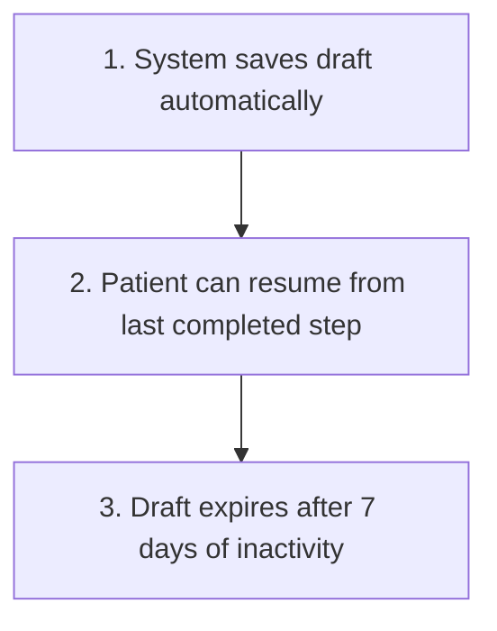

**A2: Patient has existing incomplete inquiry**:

- **Trigger**: Patient returns to the app with an existing incomplete inquiry
- **Outcome**: Patient resumes or modifies existing inquiry
- **Flow Diagram**:

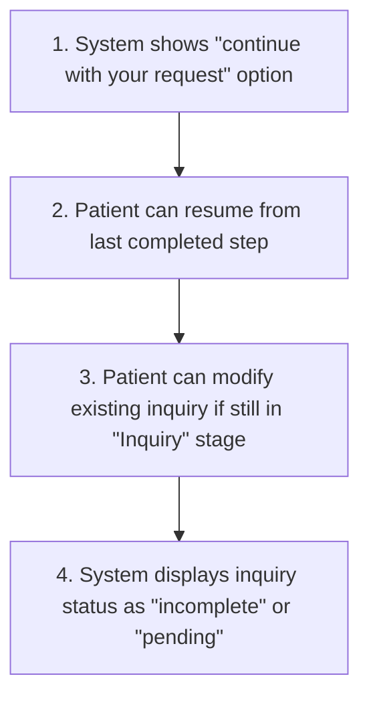

**A3: Medical questionnaire reveals critical conditions**:

- **Trigger**: Patient answers indicate high-risk medical conditions
- **Outcome**: Inquiry flagged with critical alerts for provider awareness (not patient rejection)
- **Flow Diagram**:

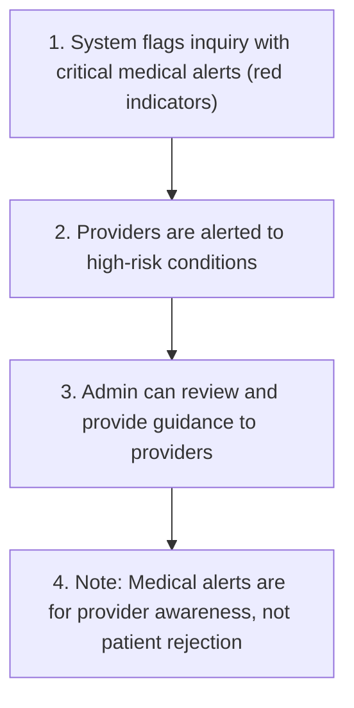

**A4: Patient cancels inquiry (see Workflow 5)**:

- **Trigger**: Patient initiates cancellation from Inquiry Dashboard (Screen 8) in stages: Inquiry, Quoted, or Accepted
- **Outcome**: Inquiry cancelled; quotes auto-cancelled; providers notified; inquiry becomes read-only
- **Flow Diagram**:

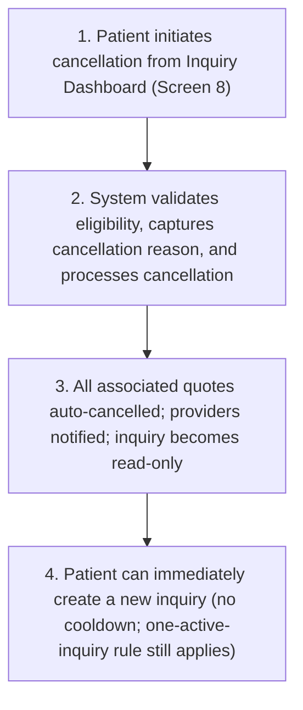

---

### Workflow 2: Inquiry Distribution (System Flow)

**Actors**: System, Providers, Admin  
**Trigger**: System detects a newly submitted inquiry meeting completeness requirements  
**Outcome**: Inquiry is distributed to matching providers; provider dashboards updated and notifications sent

**Flow Diagram**:

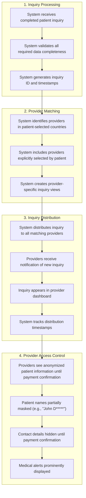

### Alternative Flows

**B1: No providers available in selected countries**:

- **Trigger**: No active providers found in patient's selected countries
- **Outcome**: Admin manually assigns providers; patient notified of potential delay
- **Flow Diagram**:

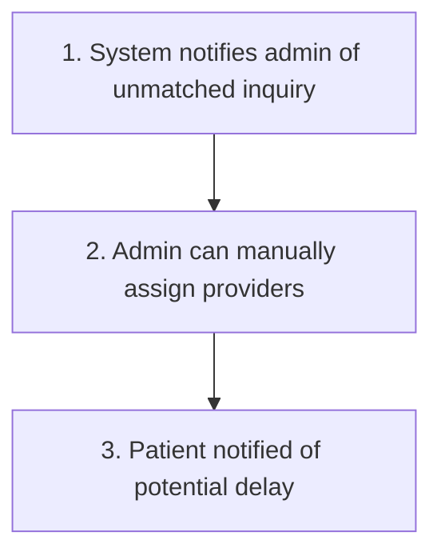

**B2: Provider capacity exceeded**:

- **Trigger**: Provider's inquiry capacity is reached
- **Outcome**: Deferred to separate FR for provider capacity management
- **Flow Diagram**:

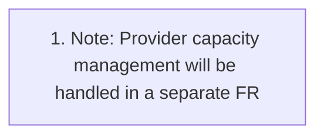

---

### Workflow 3: Provider Inquiry Management (Provider Flow)

**Actors**: Provider, System, Admin  
**Trigger**: Provider receives a distributed inquiry or opens an assigned inquiry from the dashboard  
**Outcome**: Provider reviews anonymized details and manages status prior to quote creation

**Flow Diagram**:

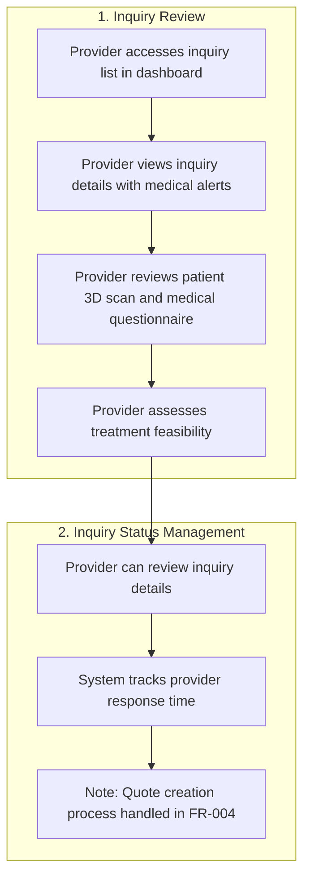

### Alternative Flows

**C1: Provider cannot accommodate patient dates**:

- **Trigger**: Provider's schedule does not align with patient's requested date ranges
- **Outcome**: Provider declines inquiry with reason; cannot suggest alternative dates (handled in FR-004)
- **Flow Diagram**:

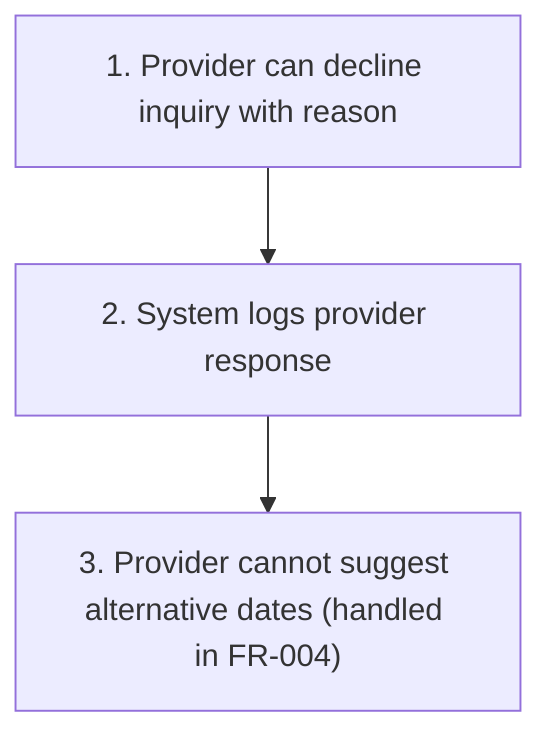

**C2: Provider needs additional information**:

- **Trigger**: Provider cannot make assessment based on submitted inquiry data
- **Outcome**: Clarification requested through admin; inquiry stays in current stage
- **Flow Diagram**:

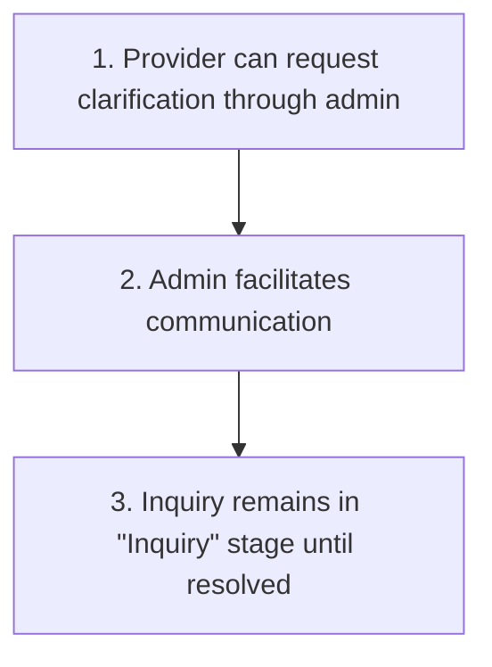

---

### Workflow 4: Admin Inquiry Management (Admin Flow)

**Actors**: Admin, System, Providers, Patients  
**Trigger**: Admin opens an inquiry for oversight or intervention, or a policy/action requires admin processing  
**Outcome**: Admin edits/overrides/reassigns/archives with full audit; re-notifications triggered as needed

**Flow Diagram**:

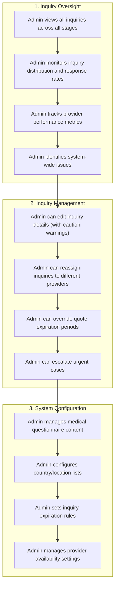

### Alternative Flows

**D1: Admin needs to delete inquiry**:

- **Trigger**: Inquiry needs to be removed from active system
- **Outcome**: Soft delete (archival) with audit trail; patient notified
- **Flow Diagram**:

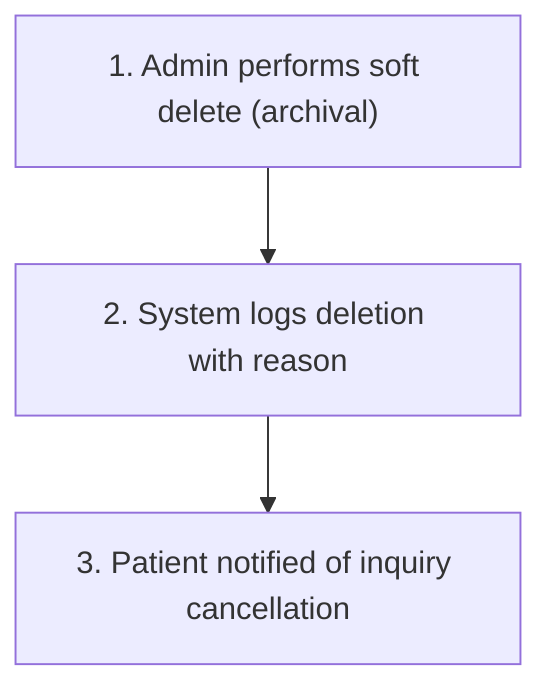

**D2: Inquiry requires manual intervention**:

- **Trigger**: System or user-reported issue with an inquiry
- **Outcome**: Admin resolves issue and updates inquiry status
- **Flow Diagram**:

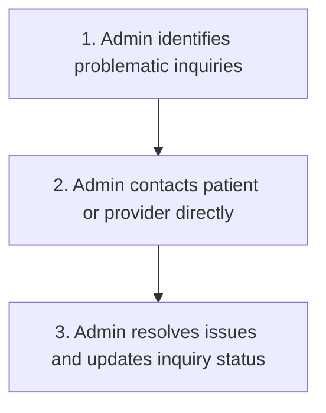

---

### Workflow 5: Patient-Initiated Inquiry Cancellation

**Actors**: Patient, System, Providers (notified), Admin (observer)  
**Trigger**: Patient opens the Inquiry Dashboard (Screen 8), taps into an inquiry detail view, and selects "Cancel Inquiry" from the action menu, for an inquiry in stage Inquiry, Quoted, or Accepted  
**Outcome**: Inquiry transitions to "Cancelled"; all associated quotes auto-cancelled; providers notified; inquiry becomes read-only in patient dashboard

**Flow Diagram**:

```mermaid
flowchart TD
  subgraph W5S1["1. Initiate Cancellation"]
    direction TB
    W5S1_1["Patient opens Inquiry Dashboard (Screen 8) and taps into the inquiry to view its detail"] --> W5S1_2["Patient selects &quot;Cancel Inquiry&quot; from the inquiry detail action menu"]
    W5S1_2 --> W5S1_3["System validates inquiry is in an eligible stage (Inquiry, Quoted, or Accepted)"]
    W5S1_3 --> W5S1_4["If inquiry is in Confirmed, In Progress, Aftercare, or Completed stage, system blocks cancellation with error message"]
  end

  subgraph W5S2["2. Capture Cancellation Reason"]
    direction TB
    W5S2_1["System displays cancellation confirmation modal (Screen 8a) with warning about irreversibility"] --> W5S2_2["Patient selects a cancellation reason from predefined options (required; admin-configurable via FR-026 Screen 5a)"]
    W5S2_2 --> W5S2_3["Patient may optionally provide additional feedback text"]
  end

  subgraph W5S3["3. Process Cancellation"]
    direction TB
    W5S3_1["System updates inquiry status to &quot;Cancelled&quot; with timestamp and reason"] --> W5S3_2["System auto-cancels all associated quotes with status &quot;Cancelled (Inquiry Cancelled)&quot; regardless of their current state"]
    W5S3_2 --> W5S3_3["If inquiry was in Accepted stage with active 48-hour appointment slot hold (per FR-005/FR-006), system releases the hold immediately"]
  end

  subgraph W5S4["4. Notify Stakeholders"]
    direction TB
    W5S4_1["System sends cancellation confirmation notification to patient (Email + Push per preferences) within 5 minutes"] --> W5S4_2["System sends inquiry.cancelled notification to all affected providers (Email + Push) within 5 minutes"]
    W5S4_2 --> W5S4_3["System sends quote.cancelled_inquiry notification per affected quote (provider-facing) within 5 minutes"]
    W5S4_3 --> W5S4_4["Provider cancellation notifications do NOT reveal the patient's cancellation reason (patient-private data for analytics)"]
    W5S4_4 --> W5S4_5["System logs cancellation event in immutable audit trail"]
  end

  subgraph W5S5["5. Post-Cancellation State"]
    direction TB
    W5S5_1["System displays Cancellation Success screen (Screen 8b) with impact summary and next-step actions"] --> W5S5_2["Inquiry appears in patient's Inquiry Dashboard with &quot;Cancelled&quot; badge (read-only)"]
    W5S5_2 --> W5S5_3["Patient can view cancelled inquiry details for reference but cannot modify or reopen"]
    W5S5_3 --> W5S5_4["Patient can immediately create a new inquiry (no cooldown; one-active-inquiry-at-a-time rule applies)"]
  end

  W5S1_3 --> W5S2_1
  W5S2_3 --> W5S3_1
  W5S3_3 --> W5S4_1
  W5S4_5 --> W5S5_1
```

### Alternative Flows

**E1: Patient cancels inquiry with no quotes received (Inquiry stage)**:

- **Trigger**: Patient cancels an inquiry that has not yet received any quotes
- **Outcome**: Only inquiry status updated; no quote cascade needed
- **Flow Diagram**:

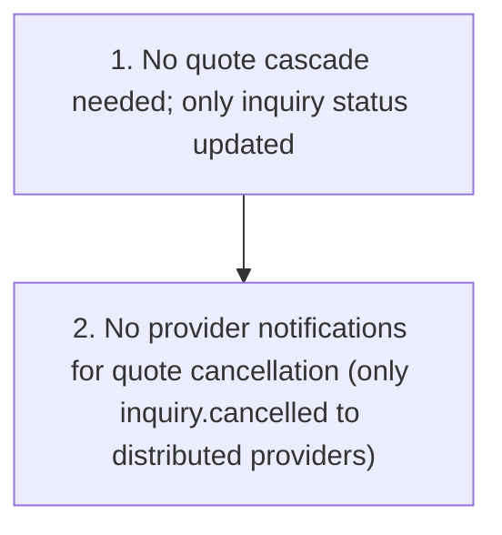

**E2: Patient cancels inquiry during Accepted stage**:

- **Trigger**: Patient cancels an inquiry with an accepted quote and active appointment slot hold
- **Outcome**: Quote auto-cancelled; slot hold released; provider notified; booking/payment inaccessible
- **Flow Diagram**:

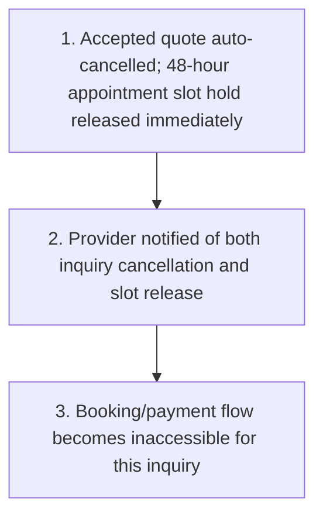

**E3: System cancels inquiry due to account deletion request (DSR)**:

- **Trigger**: Patient submits an account deletion request (DSR) in FR-001 (Delete Account flow)
- **Outcome**: Inquiry transitions to "Cancelled" without prompting for a patient-entered cancellation reason; system stores a system-generated cancellation reason for audit ("Account Deleted (System)"); all associated quotes auto-cancelled; providers notified; inquiry becomes read-only
- **Notes**:
  - Provider-facing cancellation notifications MUST NOT reveal the cancellation reason (treat as patient-private/system-private data), consistent with Workflow 5 stakeholder notification rules.

## Screen Specifications

### Patient Platform Screens

#### Screen 1: Service Selection

**Purpose**: Patient selects desired hair transplant service

**Data Fields**:

| Field Name | Type | Required | Description | Validation Rules |
| --- | --- | --- | --- | --- |
| Service Option | select (single) | Yes | Primary service selection | Must select one |
| Treatment Type | checkbox (multi) | Yes | Hair/Beard/Both | At least one selected |

**Notes**:

- Service Options:
  - "Get a Hair Transplant" (primary option)
  - "Monitor Hair Loss" (secondary - different workflow)
  - "Aftercare: Monitor Transplant Progress" (secondary - different workflow)
  - "Aftercare for Transplant" (secondary - different workflow)
- Treatment Type Selection:
  - Hair (checkbox)
  - Beard (checkbox)
  - Both (checkbox)

**Business Rules**:

- Patient must select at least one treatment type
- Primary focus on "Get a Hair Transplant" option
- Other services are secondary features

#### Screen 2: Destination Selection

**Purpose**: Patient selects preferred treatment locations

**Data Fields**:

| Field Name | Type | Required | Description | Validation Rules |
| --- | --- | --- | --- | --- |
| Countries | multiselect | Yes | Up to 10 preferred countries | Max 10; ordered by FR-028 regional configuration when available, otherwise proximity |
| Price Display | derived | No | Starting price per country | Fallback currency support |

**Notes**:

- Country List:
  - Show country name with starting price
  - Order by proximity to patient location
  - Support fallback currency/pricing display
- Price Display:
  - Starting price per country
  - Currency based on patient location
  - Price range indicators

**Business Rules**:

- Maximum 10 countries selectable
- Countries ordered by FR-028 regional configuration when available, otherwise by proximity to patient location
- Starting prices displayed for transparency
- Fallback pricing for unsupported currencies

#### Screen 3: Detailed Information Form

**Purpose**: Patient provides comprehensive hair concern details

**Data Fields**:

| Field Name | Type | Required | Description | Validation Rules |
| --- | --- | --- | --- | --- |
| Nature of concern | text | Yes | Patient description | Max length; not empty |
| Duration | select | Yes | Duration enum | Must select one |
| Previous treatments | text | Yes | Prior treatments | Max length |
| Symptom severity | slider (1-10) | Yes | Severity index | Integer 1-10 |
| Lifestyle factors | text | No | Optional context | Max length |
| Additional notes | text | No | Optional notes | Max length |
| Photos | file (image) | No | Up to 5 images | JPG/PNG ≤ 2MB each; total ≤ 5 |
| Videos | file (video) | No | Up to 5 videos | MP4 ≤ 30s, ≤ 20MB each |

**Notes**:

- Visual Evidence:
  - Photo upload: max 5 files (JPG/PNG ≤ 2MB each)
  - Video upload: max 5 files (MP4 ≤ 30s, ≤ 20MB each)
  - Enforce file size/format and total file count

**Business Rules**:

- All required fields must be completed
- Visual evidence limited to 5 files total
- Photos: JPG/PNG ≤ 2MB each
- Videos: MP4 ≤ 30s, ≤ 20MB each
- Text fields have character limits

#### Screen 4: Head Video Capture (V1 3D Scan Substitute)

**Purpose**: Patient captures guided head video for provider assessment (V1 implementation of “3D scan”)

**Data Fields**:

| Field Name | Type | Required | Description | Validation Rules |
| --- | --- | --- | --- | --- |
| Head Video | capture | Yes | Guided head video of patient’s head | Must meet duration/quality constraints from FR-002 |
| Quality Indicators | derived | Yes | Real-time quality feedback | Retake if below threshold |

**Notes**:

- Capture Instructions:
  - Visual guidance for positioning (front, top, left, right angles)
  - Quality indicators and feedback
  - Retake options available
- Media Characteristics (V1):
  - Guided video file (not true 3D model)
  - Validated and processed by FR-002 engine and S-01/S-05
  - Future 3D model capture and interactive viewer deferred to V2 (per system PRD)

**Business Rules**:

- Head video must meet minimum quality threshold required by FR-002
- Patient can retake capture if quality poor
- Captured media encrypted and stored securely
- Media accessible to providers for assessment via engine outputs

#### Screen 5: Treatment Date Selection

**Purpose**: Patient selects preferred treatment dates

**Data Fields**:

| Field Name | Type | Required | Description | Validation Rules |
| --- | --- | --- | --- | --- |
| Date Ranges | date range (multi) | Yes | Up to 10 ranges | Max 10; non-overlapping; ≤ 2 years out |

**Notes**:

- Date Range Selection:
  - Multiple pickers (max 10)
  - Calendar with availability
  - Non-overlapping validation
- Date Constraints:
  - Max 2 years in future
  - Min 30 days from inquiry date
  - Consider provider availability

**Business Rules**:

- Maximum 10 date ranges selectable
- Date ranges cannot overlap
- Dates limited to 2 years in future
- System validates provider availability

#### Screen 6: Medical Questionnaire

**Purpose**: Patient completes comprehensive medical history assessment

**Data Fields**:

| Field Name | Type | Required | Description | Validation Rules |
| --- | --- | --- | --- | --- |
| Question | enum | Yes | Medical question item | Must answer Yes/No |
| Answer | boolean | Yes | Yes/No | Required |
| Details | text | Cond. | Required if Answer = Yes | Non-empty when required |
| Alert Level | derived | No | Critical/Standard/None | Derived from rules |

**Notes**:

- Question List:
  - Allergies to medications (Yes/No + details)
  - Other allergies (Yes/No + details)
  - Respiratory conditions (Yes/No + details)
  - Cardiovascular disease (Yes/No + details)
  - Hypertension (Yes/No + details)
  - Diabetes (Yes/No + details)
  - Implanted medical devices (Yes/No + details)
  - Hepatitis B/C (Yes/No + details)
  - HIV/AIDS (Yes/No + details)
  - Arthritis (Yes/No + details)
  - Neurological disorders (Yes/No + details)
  - Other medical conditions (Yes/No + details)
  - Bleeding disorders (Yes/No + details)
  - Kidney disease (Yes/No + details)
  - Cancer history (Yes/No + details)
  - Digestive diseases (Yes/No + details)
  - Mental health disorders (Yes/No + details)
  - Blood clots/DVT (Yes/No + details)
  - Previous surgeries (Yes/No + details)
  - Pregnancy status (Yes/No + details)
  - Regular medications (Yes/No + details)
- Alert System:
  - Critical (red)
  - Standard (amber)
  - None (green)

**Business Rules**:

- All questions require Yes/No answers
- Detailed explanations required for "Yes" answers
- Medical alerts generated automatically
- Questionnaire managed by admin (not hard-coded)

#### Screen 7: Inquiry Summary & Submission

**Purpose**: Patient reviews complete inquiry before submission

**Data Fields**:

| Field Name | Type | Required | Description | Validation Rules |
| --- | --- | --- | --- | --- |
| Section Summary | group | Yes | Read-only summary of prior steps | Must reflect latest data |
| Terms Acceptance | checkbox | Yes | Accept T&C before submission | Required to submit |

**Notes**:

- Summary includes: treatment type, countries with prices, concern details, media, 3D scan, date ranges, questionnaire summary
- Submission Controls: per-section Edit, Submit button, T&C acceptance

**Business Rules**:

- Patient must review all sections
- Patient can edit any section before submission
- Terms and conditions must be accepted
- Submission generates unique inquiry ID

#### Screen 7a: Provider Selection

**Purpose**: Patient selects preferred providers to receive the inquiry

**Data Fields**:

| Field Name | Type | Required | Description | Validation Rules |
| --- | --- | --- | --- | --- |
| Suggested Providers | list | Yes | System-suggested providers based on reviews and admin curation | Non-empty; ordered by rating/curation score |
| Provider Card | group | Yes | Provider summary: name, country, rating, review count, specialty, starting price | Read-only per card |
| Selected Providers | multiselect | Yes | Patient's chosen providers | Min 1, max 5 |
| Search | control | No | Search by provider name or keyword | Debounced; case-insensitive |
| Filters | control | No | Filter by country (from selected destinations), rating range, specialty | Valid enums/ranges |

**Notes**:

- Provider Suggestions:
  - Ordered by positive reviews and admin curation score
  - Filtered to providers in patient's selected destination countries
  - Each card shows: provider name, country, star rating, review count, specialty tags, starting price in patient's currency
- Selection Controls:
  - Tap to select/deselect provider card
  - Visual indicator (checkmark/highlight) on selected providers
  - Counter shows "X of 5 selected"
  - "Continue" button enabled when at least 1 provider selected

**Business Rules**:

- Maximum 5 providers selectable
- Only providers in patient's selected destination countries are shown
- Provider suggestions based on positive reviews and admin curation (system PRD)
- Patient must select at least 1 provider to proceed
- Selected providers are included in the inquiry for distribution; system may also distribute to additional matching providers per distribution rules

#### Screen 8: Inquiry Dashboard (Post-Submission)

**Purpose**: Patient views submitted inquiry status and details

**Data Fields**:

| Field Name | Type | Required | Description | Validation Rules |
| --- | --- | --- | --- | --- |
| Current Stage | badge | Yes | Inquiry stage (Inquiry/Quoted/Accepted/Cancelled/...) | Valid lifecycle value; includes "Cancelled" |
| Timeline | timeline | Yes | Chronological status changes | Timestamps present |
| Responses Count | number | Yes | Number of provider responses | Non-negative integer |
| Inquiry Summary | group | Yes | Read-only inquiry info | Complete and consistent |
| Quotes Received | list | No | Provider quotes (from FR-004) | Read-only links |
| Deadlines | datetime | Yes | Response/expiry deadlines | Future or past allowed |
| Next Actions | actions | Yes | Available user actions | Based on stage/permissions |
| Cancel Inquiry | action | Conditional | "Cancel Inquiry" button; visible only in Inquiry, Quoted, or Accepted stages | Hidden when stage is Confirmed, In Progress, Aftercare, Completed, or Cancelled; triggers Workflow 5 cancellation flow |

**Notes**:

- Dashboard shows: full inquiry summary, provider responses, deadlines, and context-aware next actions
- "Cancel Inquiry" action appears in Next Actions area only for eligible stages (Inquiry, Quoted, Accepted)
- If inquiry is in "Cancelled" stage, dashboard is read-only with "Cancelled" badge; no actions available except viewing details

**Business Rules**:

- Patient can only have one active inquiry at a time
- Patient can modify inquiry if still in "Inquiry" stage
- Patient can cancel inquiry if in Inquiry, Quoted, or Accepted stage (see Workflow 5)
- Patient receives notifications for status changes
- Inquiry data persists for 7 years minimum
- Cancelled inquiries are not counted as "active" — patient can create a new inquiry immediately after cancellation

#### Screen 8a: Cancel Inquiry Confirmation Modal

**Purpose**: Confirm patient's intent to cancel and capture cancellation reason (Workflow 5 step 2)

**Data Fields**:

| Field Name | Type | Required | Description | Validation Rules |
| --- | --- | --- | --- | --- |
| Warning Icon | icon | Yes | Red warning triangle or alert icon | Displayed at top of modal |
| Modal Title | text | Yes | "Cancel Inquiry?" | Displayed prominently in red/destructive color |
| Warning Message | text | Yes | Explanation of consequences: "Canceling this inquiry is irreversible. All quotes you've received will be cancelled and providers will be notified." | Read-only informational text |
| Current Stage Badge | badge | Yes | Shows inquiry current stage | Enum: "Inquiry", "Quoted", "Accepted"; read-only |
| Inquiry Reference | text | Yes | Inquiry ID (HPID format) | Read-only; format: HPID + YY + MM + 4-digit sequence |
| Impact Summary | text | Yes | Summary of cancellation impact based on current stage | Conditional: "X active quotes will be cancelled" OR "No quotes received yet"; derived from associated quote count |
| Cancellation Reason Selector | select | Yes | Dropdown or radio list of predefined reasons | Must select one option; default options: "Changed my mind", "Found a better option elsewhere", "Medical concerns", "Financial reasons", "Travel restrictions", "Timeline doesn't work", "Other" (admin-configurable via FR-026 Screen 5a) |
| Additional Notes | text | Conditional | Free text field; shown when "Other" selected | Required if "Other" selected; max 500 characters |
| Optional Feedback | text | No | General feedback text area | Max 1000 characters; placeholder: "Any additional feedback? (Optional)" |
| Provider Notification Note | text | Yes | Informational message: "Affected providers will be notified of this cancellation within 5 minutes" | Read-only |
| Confirm Cancellation Button | button | Yes | Destructive primary CTA | Red/destructive style; label: "Confirm Cancellation"; disabled until reason selected |
| Go Back Button | button | Yes | Secondary CTA to dismiss modal | Default/neutral style; label: "Go Back"; closes modal without action |

**Business Rules**:

- Modal is triggered from the "Cancel Inquiry" action on Screen 8 (Inquiry Dashboard)
- Modal is only reachable when inquiry stage is Inquiry, Quoted, or Accepted (Workflow 5 step 1 validates this)
- Cancellation reason is required before the Confirm button becomes active
- Cancellation reason is patient-private data (not shared with providers; stored for analytics and audit)
- On "Confirm Cancellation", system processes Workflow 5 steps 3–5; modal is dismissed and Screen 8b is shown
- On "Go Back", modal is dismissed with no state change

**Acceptance Scenarios**:

1. **Given** inquiry in eligible stage, **When** patient opens modal, **Then** Current Stage Badge and Impact Summary reflect actual inquiry state and quote count
2. **Given** patient has not selected a reason, **When** patient taps Confirm Cancellation, **Then** button remains disabled
3. **Given** patient selects "Other", **When** Additional Notes is empty, **Then** Confirm Cancellation remains disabled until notes entered
4. **Given** patient taps Go Back, **When** modal dismisses, **Then** no inquiry state is changed

#### Screen 8b: Cancellation Success Confirmation

**Purpose**: Confirm the inquiry has been successfully cancelled and provide next-step navigation (Workflow 5 step 5)

**Data Fields**:

| Field Name | Type | Required | Description | Validation Rules |
| --- | --- | --- | --- | --- |
| Success Icon | icon | Yes | Checkmark or completion illustration | Green color; displayed at top center |
| Confirmation Title | text | Yes | "Inquiry Cancelled" | Displayed prominently below icon |
| Confirmation Message | text | Yes | "Your inquiry has been successfully cancelled." | Read-only |
| Inquiry Reference | text | Yes | Inquiry ID (HPID format) | Read-only; label: "Reference:" |
| Cancellation Timestamp | datetime | Yes | Server-side cancellation timestamp | Format: "Cancelled on [Month DD, YYYY] at [HH:MM AM/PM]"; reflects server time, not client |
| Impact Summary | text | Yes | Summary of what was cancelled | Conditional based on stage: "Your inquiry was cancelled." / "Your inquiry and X active quote(s) were cancelled." / "Your inquiry, accepted quote, and reservation were cancelled." |
| Provider Notification Status | text | Yes | "All affected providers have been notified of this cancellation." | Read-only |
| Back to My Inquiries Button | button | Yes | Primary CTA | Default style; label: "Back to My Inquiries"; navigates to Inquiry Dashboard (Screen 8) |
| Start New Inquiry Button | button | Yes | Secondary CTA | Outlined/secondary style; label: "Start New Inquiry"; navigates to Inquiry Creation flow (Screen 1) |
| Contact Support Link | link | No | Optional support contact link | Text link; label: "Need help? Contact support"; navigates to Help & Support |

**Business Rules**:

- This screen is shown only after Workflow 5 completes successfully (steps 3–4 finished)
- Cancellation Timestamp reflects server-side time (not client clock) for audit consistency
- Impact Summary must match the actual cascade results (number of quotes cancelled, whether slot hold was released)
- Cancelled inquiry is now read-only; "Back to My Inquiries" returns to Screen 8 where it shows "Cancelled" badge
- "Start New Inquiry" navigates to Screen 1; patient can create immediately (one-active-inquiry rule: cancelled inquiry is no longer "active")

**Acceptance Scenarios**:

1. **Given** cancellation completed for Inquiry-stage inquiry with 0 quotes, **When** Screen 8b displays, **Then** Impact Summary shows "Your inquiry was cancelled." with no quote mention
2. **Given** cancellation completed for Quoted-stage inquiry with 3 quotes, **When** Screen 8b displays, **Then** Impact Summary shows "Your inquiry and 3 active quote(s) were cancelled."
3. **Given** cancellation completed for Accepted-stage inquiry, **When** Screen 8b displays, **Then** Impact Summary shows reservation cancellation language and slot release confirmation

### Provider Platform Screens

#### Screen 9: Inquiry List Dashboard

**Purpose**: Provider views all distributed inquiries

**Data Fields**:

| Field Name | Type | Required | Description | Validation Rules |
| --- | --- | --- | --- | --- |
| Patient ID | column | Yes | HPID + YY + MM + 4-digit sequence | Sortable; searchable |
| Patient Name | column | Yes | Partially masked name | Mask until payment confirmation |
| Age | column | No | Patient age | Number; sortable |
| Problem/Concern | column | No | Primary concern enum | Filterable |
| Requested Date Ranges | column | Yes | Primary + tooltip for others | Non-overlap; tooltip expansion |
| Location | column | No | Patient country | Filterable |
| Medical Alerts | column | Yes | Color-coded chips | Critical/Standard/None |
| Inquiry Date | column | Yes | Created timestamp | Relative formatting rules |
| Action | column | Yes | View/Create Quote buttons | State-aware actions |
| Search | control | No | Keyword search (ID, Name) | Debounced; case-insensitive |
| Filters | control | No | Age range, Concern, Date range, Alerts, Location | Valid ranges/enums |

**Notes**:

- Requested Date Ranges: primary displayed; all ranges via tooltip
- Patient Name: masked until payment confirmation
- Time Display: relative for recent; formatted for older
- Empty States: Loading, Error, No permission

**Business Rules**:

- Only shows inquiries for provider's countries OR explicitly selected by patient
- Patient names partially masked until payment confirmation
- Medical alerts prominently displayed with color coding
- Inquiry expiration configurable by admin
- Date ranges display primary range with tooltip for additional ranges
- Time display: relative for recent ("X minutes ago"), specific for older ("Sep 22, 2025")
- Empty states: Loading, Error, No permission

#### Screen 10: Inquiry Detailed View

**Purpose**: Provider reviews comprehensive inquiry details

**Data Fields**:

| Field Name | Type | Required | Description | Validation Rules |
| --- | --- | --- | --- | --- |
| Inquiry ID | text | Yes | Unique ID and current stage | Read-only |
| Timestamps | group | Yes | Created/updated/activity times | ISO 8601 |
| Patient (masked) | group | Yes | Partially masked identity | Reveal post-payment confirmation |
| Countries | list | Yes | Selected treatment countries | Non-empty |
| Problem Details | group | Yes | Concern text, duration, previous treatments | Complete |
| Media | gallery | No | Photos/videos previews | File constraints enforced |
| 3D Scan | viewer | No | Special viewer for 3D scan | Available if captured |
| Date Ranges | list | Yes | All selected date ranges | Non-overlapping |
| Medical Questionnaire | group | Yes | Full Q&A responses | Completed |
| Medical Alerts | chips | Yes | Tiered alert indicators | Critical/Standard/None |

**Notes**:

- Inquiry Metadata:
  - Inquiry ID (HPID + YY + MM + 4-digit sequence)
  - Current stage (Inquiry/Quoted/Accepted/...)
  - Created at, Updated at, Last activity timestamps (ISO 8601)
- Patient (Masked):
  - Display name: First name + last initial + asterisks (e.g., "John D*****")
  - Age, Gender, Country (contact details masked until payment)
  - Patient ID (HPID-based) visible; name, phone number, and email remain masked/hidden until payment confirmation
- Countries:
  - Full list of selected treatment countries (ISO country + display name)
  - Primary country highlighted; remaining listed in order selected
- Problem Details:
  - Nature of concern (required)
  - Duration (enum)
  - Previous treatments (required)
  - Symptom severity (1–10)
  - Lifestyle factors (optional)
  - Additional notes (optional)
- Media:
  - Photos (JPG/PNG ≤ 2MB each, max 5): show thumbnails with modal preview
  - Videos (MP4 ≤ 30s, ≤ 20MB each, max 5): show poster frame with player
  - Validation messages for any file policy violations
- 3D Scan:
  - Special viewer control (orbit/zoom)
  - Quality score and capture metadata if available
  - Retake indicator if replaced after initial capture
- Date Ranges:
  - Display all selected ranges, non-overlapping
  - Primary range shown first; additional ranges listed below
  - Server-side validation notes for overlaps and max count (10)
- Medical Questionnaire:
  - Full Q&A list (Yes/No + required details for Yes)
  - Derived medical alerts: Critical (red), Standard (amber), None (green)
  - Link to audit trail of questionnaire version used
- Timeline:
  - Creation, distribution to providers, provider views, status changes
  - Sorted descending by time with relative and absolute timestamps

**Business Rules**:

- Full patient details visible only after payment confirmation
- Medical alerts color-coded by severity
- 3D scan requires special viewer
- All data editable by admin
- Provider can review inquiry details
- **Note**: Quote creation functionality handled in FR-004

### Admin Platform Screens

#### Screen 11: Hairline Overview Dashboard

**Purpose**: Admin monitors all inquiries across all stages

**Data Fields**:

| Field Name | Type | Required | Description | Validation Rules |
| --- | --- | --- | --- | --- |
| Patient ID | column | Yes | HPID + YY + MM + 4-digit sequence | Sortable; searchable |
| Full Patient Name | column | Yes | Unmasked name | Admin only |
| Age | column | No | Patient age | Number; sortable |
| Problem/Concern | column | No | Primary concern enum | Filterable |
| Requested Date Ranges | column | Yes | Primary + tooltip for others | Non-overlap; tooltip expansion |
| Location | column | No | Patient country | Filterable |
| Medical Alerts | column | Yes | Color-coded chips | Critical/Standard/None |
| Inquiry Date | column | Yes | Created timestamp | Relative date logic |
| Current Status | column | Yes | Lifecycle stage | Enum validation |
| Quotes Count | column | No | Number of quotes | Non-negative integer |
| Payment Status | column | No | Payment indicator | Enum validation |
| Last Active | column | No | Last activity timestamp | ISO 8601 |
| Assigned Providers | column | No | Provider(s) assigned | List formatting |
| Action | column | Yes | Action buttons | State-aware actions |
| Advanced Filters | control | No | Patient/Provider locations, Stage, Payment, Date ranges | Valid enums/ranges |

**Business Rules**:

- Shows all inquiries in all lifecycle stages
- Admin has full visibility of all data
- Advanced filtering capabilities
- Bulk actions available
- Real-time status updates

#### Screen 12: Inquiry Detailed Management (Admin)

**Purpose**: Admin manages individual inquiry with full control

**Data Fields**:

| Field Name | Type | Required | Description | Validation Rules |
| --- | --- | --- | --- | --- |
| Full Inquiry | group | Yes | All patient and inquiry data | Admin-only visibility |
| Admin Actions | actions | Yes | Edit, reassign, override, soft delete | Reason required; audited |
| Override Controls | form | No | Expiry/distribution overrides | Confirmation + reason required |
| Reassignment | control | No | Assign/reassign providers | Validation on provider eligibility |
| Soft Delete | control | No | Archive inquiry | Requires reason; reversible view-only |
| Audit Trail | log | Yes | Full change history | Immutable; timestamped |

**Notes**:

- Full Inquiry (read-only groups):
  - Patient (unmasked for admin): name, contact, country
  - Inquiry metadata: ID, stage, created/updated/activity times
  - Countries, Problem details, Media, 3D scan viewer, Date ranges
  - Medical questionnaire Q&A and derived alerts
- Admin Actions:
  - Edit inquiry details with caution banners and field-level audit
  - Reassign providers (single/multi) with eligibility checks
  - Override expiry/distribution windows with required reason
  - Soft delete (archive) with reason; read-only view after deletion
  - Add admin notes (time-stamped; visible to admins only)
  - Trigger re-notifications when impactful fields change
- Override Controls:
  - Expiry: set new deadline (cannot be in the past without justification)
  - Distribution: re-run matching; include/exclude specific providers
  - All overrides require confirmation and reason entry
- Reassignment:
  - Search providers by country/specialty; multi-select
  - Validation: avoid duplicates; respect provider capacity policies (if enabled)
  - Optional note sent to provider(s) upon assignment
- Soft Delete:
  - Requires reason; retains data for audit; prevents further edits
  - Display badge "Archived" across all admin views
- Audit Trail:
  - Records: who, when, what changed (old → new), reason, IP (if available)
  - Filterable by field, user, date range
  - Exportable (CSV/JSON) for compliance

**Business Rules**:

- Admin can edit any inquiry data
- All changes require reason documentation
- Soft delete only (no hard deletes)
- Visual warnings for data modification
- Complete audit trail maintained

**Note**: Medical questionnaire and system configuration management will be handled in a separate FR for centralized settings management.

## Business Rules

### General Inquiry Rules

1. **Submission Rules**
   - Patient must complete medical questionnaire before submission
   - Patient can only have one active inquiry at a time
   - Inquiry automatically expires if unquoted (configurable timeframe)
   - Patient can modify inquiry if still in "Inquiry" stage

2. **Distribution Rules**
   - System distributes inquiry to providers in selected countries OR explicitly selected by patient
   - Providers must respond within 72 hours (configurable)
   - Provider capacity limits affect distribution where capacity data is available; until the dedicated Provider Capacity Management FR is delivered, capacity checks are advisory and MUST NOT block inquiry distribution
   - Admin can manually assign inquiries
   - Patient can select maximum 5 preferred providers
   - Provider suggestions based on positive reviews and admin curation

3. **Data Access Rules**
   - Patient direct identifiers (name, phone number, email) anonymized until payment confirmation
   - Provider access limited to assigned inquiries
   - Admin has full access to all inquiry data
   - All data access logged for audit trail

4. **Cancellation Rules**
   - Patient can cancel their own inquiry in stages: Inquiry, Quoted, or Accepted (before Confirmed)
   - Cancellation is blocked for inquiries in Confirmed, In Progress, Aftercare, or Completed stages — patient must contact support
   - Cancellation is immediate and irreversible; no grace period, no admin approval required
   - Cancellation reason is required (predefined options; see Workflow 5)
   - System MAY cancel an eligible inquiry as a consequence of a patient account deletion request (FR-001). In that case, the system MUST set a system-generated cancellation reason for audit (e.g., "Account Deleted (System)") and MUST NOT prompt the patient for a cancellation reason.
   - All associated quotes are auto-cancelled with status "Cancelled (Inquiry Cancelled)" regardless of quote state
   - If inquiry is in Accepted stage with an active 48-hour appointment slot hold (FR-005/FR-006), the hold is released immediately
   - All affected providers receive notification of cancellation; cancellation reason is NOT shared with providers (patient-private analytics data)
   - Cancelled inquiry remains visible in patient dashboard with "Cancelled" badge (read-only)
   - No cooldown period after cancellation — patient can immediately create a new inquiry (one-active-inquiry rule: cancelled inquiry is no longer "active")
   - Admin has oversight visibility of patient-initiated cancellations but cannot block or reverse them
   - Cancellation event is logged in immutable audit trail with: patient ID, inquiry ID, timestamp, reason, optional feedback

### Medical Data Rules

1. **Medical Alert System**
   - 3-tier color-coded alert system:
     - Critical alerts (red - high risk conditions)
     - Standard alerts (yellow/amber - moderate concerns)
     - No alerts (green - no medical concerns)
   - Alerts generated automatically from questionnaire
   - Alerts prominently displayed to providers

2. **Questionnaire Management**
   - Medical questionnaire managed by admin through FR-025 (not hard-coded)
   - Questions require Yes/No answers
   - Detailed explanations required for "Yes" answers
   - Questionnaire content versioned and auditable
   - **Note**: Centralized questionnaire management handled in FR-025

### Data and Privacy Rules

1. **Data Retention**
   - Inquiry data retained for 7 years minimum
   - 3D scans retained for 2 years after inquiry completion
   - Medical questionnaire responses retained for 7 years
   - All data encrypted at rest and in transit
   - Cancelled inquiries are subject to the same retention policy as completed inquiries; cancellation does not accelerate data deletion timelines

2. **Data Access**
   - Patient direct identifiers (name, phone number, email) anonymized until payment confirmation
   - Provider access limited to assigned inquiries
   - Admin access logged for audit trail
   - Cross-tenant data access through authenticated APIs only

3. **Data Security**
   - All inquiry data encrypted at rest and in transit
   - 3D scans watermarked with patient ID
   - Access attempts logged and monitored
   - Soft deletes only (no hard deletes allowed)

### Admin Editability Rules

1. **Full Admin Override**
   - Admin can edit ALL inquiry data in the system
   - Admin can modify any patient's inquiry details
   - Admin can reassign inquiries to different providers
   - Admin can override any system-calculated settings

2. **Edit Capabilities**
   - **Inquiry Data**: Modify all patient-submitted information
   - **Patient Data**: Edit patient information, contact details
   - **Provider Data**: Modify provider assignments and settings
   - **System Data**: Override expiration rules, capacity limits
   - **Medical Data**: Edit questionnaire responses and alerts

3. **Edit Tracking**
   - All admin edits logged with timestamp and admin identification
   - Change reason required for all modifications
   - Edit history maintained for audit trail
   - Patient and provider notified of significant changes
   - Visual warnings displayed for data modification

### UI/UX Display Rules

1. **Date Range Display**
   - Primary date range displayed prominently
   - Additional ranges shown as "[+ X other ranges]" with tooltip expansion
   - Tooltip shows all date ranges with full details

2. **Time Display Logic**
   - Recent inquiries: Relative format ("X minutes ago", "X hours ago")
   - Previous day: Specific format ("Yesterday at 3:45 PM")
   - Older inquiries: Date format ("Sep 22, 2025")

3. **Patient ID Format**
   - Format: HPID + YY + MM + 4-digit sequence
   - Example: HPID2501001 (HPID + 25 + 01 + 0001)

4. **Medical Alert Display**
   - Critical alerts: Red color-coded chips
   - Standard alerts: Yellow/amber color-coded chips
   - No alerts: Green color-coded chips

5. **Patient Name Masking**
   - Format: First name + last initial + asterisks (e.g., "John D*****")
   - Full name revealed only after payment confirmation

### Validation and Constraints

1. **Input Validation**
   - Country selection limited to 10 countries maximum
   - Date ranges limited to 2 years in future
   - Visual evidence limited to 5 files total
   - File size and format validation enforced
   - Text field character limits enforced

2. **Business Logic Validation**
   - Date ranges cannot overlap
   - Provider capacity validation
   - Medical questionnaire completeness validation
   - 3D scan quality validation
   - Inquiry uniqueness validation

## Success Criteria

### Patient Experience Metrics

- **SC-001**: 95% of patients can complete inquiry submission in under 15 minutes
- **SC-002**: 90% of patients successfully upload 3D scans on first attempt
- **SC-003**: 85% of patients complete medical questionnaire without assistance
- **SC-004**: Patient satisfaction score of 4.5+ stars for inquiry process

### Provider Efficiency Metrics

- **SC-005**: Providers can review inquiry details in under 5 minutes
- **SC-006**: 90% of providers respond to inquiries within 24 hours
- **SC-007**: Provider inquiry review completion rate of 95%
- **SC-008**: Provider quote creation time under 10 minutes

### Admin Management Metrics

- **SC-009**: Admin can manage all inquiries from single dashboard
- **SC-010**: 95% of inquiries processed without admin intervention
- **SC-011**: Admin dashboard loads with all data in under 3 seconds
- **SC-012**: Admin can edit inquiry data with full audit trail

### System Performance Metrics

- **SC-013**: Inquiry submission completes in under 30 seconds
- **SC-014**: Inquiry distribution to providers in under 2 minutes
- **SC-015**: System supports 1000+ concurrent inquiry submissions
- **SC-016**: 99.5% uptime for inquiry module during business hours

### Business Impact Metrics

- **SC-017**: 80% of submitted inquiries receive provider quotes
- **SC-018**: 25% conversion rate from inquiry to quote acceptance
- **SC-019**: 50% reduction in inquiry-related support tickets
- **SC-020**: 30% improvement in provider response times

## Functional Requirements Summary

### Core Requirements

- **REQ-003-001**: System MUST allow patients to create and submit inquiries with destinations, media, date ranges, 3D scan, and medical questionnaire.
- **REQ-003-002**: System MUST distribute completed inquiries to matching providers in selected countries and those explicitly chosen by the patient.
- **REQ-003-003**: Providers MUST see anonymized patient data and tiered medical alerts until payment/acceptance per system PRD.
- **REQ-003-004**: System MUST support draft autosave and resume with 7-day inactivity expiry for incomplete inquiries.
- **REQ-003-005**: Admin MUST be able to view, edit (with warnings), reassign, soft delete, and override distribution/expiration with full audit trail.

### Data Requirements

- **REQ-003-006**: System MUST retain inquiry data for at least 7 years; scan retention per system policy.
- **REQ-003-007**: System MUST link inquiries to patients, providers, locations, 3D scans, and questionnaire responses.

### Security & Privacy Requirements

- **REQ-003-008**: System MUST mask patient names and hide phone numbers and email addresses until payment confirmation; patient ID (HPID-based) may remain visible as a pseudonymous identifier.
- **REQ-003-009**: System MUST encrypt all inquiry-related data at rest and in transit, and maintain immutable audit logs.

### Integration Requirements

- **REQ-003-010**: System MUST integrate with Shared Services for notifications and media/scan handling.
- **REQ-003-011**: System MUST expose internal APIs required by FR-004 (quote) to consume inquiry data without mutation.

### Cancellation Requirements

- **REQ-003-012**: System MUST allow patients to cancel their own inquiry in Inquiry, Quoted, or Accepted stages with a required cancellation reason; cancellation is immediate and irreversible.
- **REQ-003-013**: System MUST auto-cancel all associated quotes when an inquiry is cancelled by the patient, with distinct cancellation status "Cancelled (Inquiry Cancelled)" and provider notifications via FR-020.
- **REQ-003-014**: System MUST release any active appointment slot hold (FR-005/FR-006 48-hour hold) immediately when an Accepted-stage inquiry is cancelled by the patient.

### Marking Unclear Requirements

- **REQ-003-015**: Provider capacity management is referenced but handled by a separate FR (TBD); integration expectations remain.

## Key Entities

- **Inquiry**: patientId, destinations[], problem details, media[], scanRef, dateRanges[], questionnaireSummary, status, createdAt, cancelledAt, cancellationReason, cancellationFeedback
  - Status enum: Inquiry, Quoted, Accepted, Confirmed, In Progress, Aftercare, Completed, **Cancelled**
  - Relationships: belongsTo Patient; hasMany ProviderInquiry; hasOne Scan; hasMany MedicalAlert
- **ProviderInquiry**: inquiryId, providerId, distributionAt, viewedAt, status
  - Relationships: belongsTo Inquiry; belongsTo Provider
- **MedicalQuestionnaireResponse**: inquiryId, questionId, answer, details
  - Relationships: belongsTo Inquiry
- **MedicalAlert**: inquiryId, level (critical/standard/none), reason
  - Relationships: belongsTo Inquiry
- **Scan**: inquiryId, storageUrl, qualityScore, metadata
  - Relationships: belongsTo Inquiry

### Inquiry Payload (Composition)

- Every Inquiry record MUST, at minimum, include:
  - Destinations (selected treatment countries/locations)
  - Treatment date ranges (up to configured limits)
  - Problem details and questionnaireSummary (including derived medical alerts)
  - Media attachments (photos/videos and/or head video/scanRef from FR-002)
  - Linked patient identifier (HPID-based patientId)
  - Distribution metadata via related ProviderInquiry records
- These fields MUST be fully populated before an inquiry is eligible for distribution to providers.

## Dependencies

### Internal Dependencies

- **FR-001**: Patient Authentication & Profile Management (patient registration)
- **FR-002**: Medical History & 3D Scanning (scan capture technology)
- **FR-004**: Quote Submission & Management (provider quote creation)
- **FR-020**: Notifications & Alerts (inquiry notifications)
- **FR-025**: Medical Questionnaire Management (centralized settings)
- **Future FR**: Provider Capacity Management (provider availability)

### External Dependencies

- **3D Scanning SDK**: ARKit (iOS) and ARCore (Android) for mobile scan capture
- **Cloud Storage**: Secure storage for 3D scans and documents
- **Geolocation Services**: Country/location detection and mapping
- **Currency APIs**: Real-time exchange rates for pricing

### Data Dependencies

- **Patient Data**: From patient registration and profile management
- **Provider Data**: From provider onboarding and location management
- **Location Data**: From admin-configured country/location lists
- **Medical Data**: From admin-configured questionnaire templates

## Assumptions

### User Behavior Assumptions

- Patients will actively complete comprehensive inquiries and provide accurate medical information
- Patients can have incomplete inquiries and resume from where they left off
- Patients will provide honest and complete medical information
- Providers will respond to distributed inquiries within specified timeframes

### Technology Assumptions

- Patients have access to smartphones with camera capabilities for 3D scanning
- Patients have reliable internet access for inquiry submission
- Infrastructure can handle concurrent inquiry operations without degradation

### Business Process Assumptions

- Sufficient provider capacity exists to handle inquiry volume (capacity management handled separately)
- Admin team has capacity to manage inquiry operations and system configuration
- 3D scans and questionnaire responses will be of sufficient quality for medical assessment
- Medical data handling meets healthcare compliance requirements
- Medical questionnaire alerts are for provider awareness, not patient rejection

## Implementation Notes

### Technical Considerations

- **Real-time Distribution**: Inquiry distribution requires real-time processing
- **File Management**: 3D scan storage and retrieval must be optimized for performance
- **Mobile Optimization**: Patient screens must work seamlessly on mobile devices
- **Offline Capability**: Core inquiry features should work with limited connectivity

### Integration Points

- **Patient Module**: Seamless integration with patient authentication and profile
- **Provider Module**: Integration with provider dashboard and quote management
- **Admin Module**: Integration with admin oversight and system configuration
- **Notification Module**: Automated notifications for inquiry status changes

### Scalability Considerations

- **Database Design**: Efficient querying for large numbers of inquiries
- **File Storage**: Scalable storage solution for 3D scans and documents
- **Distribution Logic**: Automated distribution algorithms for high-volume inquiries
- **Provider Assignment**: Intelligent provider matching based on capacity and specialization

### Security Considerations

- **Data Encryption**: All inquiry data encrypted at rest and in transit
- **Access Control**: Strict role-based access to inquiry data
- **Audit Logging**: Comprehensive logging of all inquiry activities
- **Compliance**: Healthcare data protection regulations compliance

---

## User Scenarios & Testing

### User Story 1 - Submit Complete Inquiry (Priority: P1)

Why: Core entry point that powers distribution and provider review.

Independent Test: Patient completes all sections (destinations, media, 3D scan, date ranges, questionnaire) and submits; verify inquiry creation and distribution readiness.

Acceptance Scenarios:

1. Given patient completes required fields, When submitting inquiry, Then system validates and creates inquiry with unique ID
2. Given a created inquiry, When distribution runs, Then matching providers are identified and prepared for notification
3. Given a created inquiry, When viewing patient dashboard, Then status shows Inquiry with full summary

### User Story 2 - Draft Autosave & Resume (Priority: P2)

Why: Reduces drop-off and improves completion rates.

Independent Test: Patient abandons mid-flow; later resumes and completes submission.

Acceptance Scenarios:

1. Given patient leaves mid-inquiry, When returning within 7 days, Then system restores last step and data
2. Given a restored draft, When continuing, Then previously validated sections remain intact
3. Given 7 days of inactivity, When resuming, Then draft has expired and patient starts a new inquiry

### User Story 3 - Provider Review Read-Only (Priority: P2)

Why: Ensures providers can triage efficiently while protecting patient privacy.

Independent Test: Provider opens distributed inquiry and reviews anonymized details, media, 3D scan, date ranges, and medical alerts.

Acceptance Scenarios:

1. Given distributed inquiry, When provider opens it, Then anonymized patient and medical alerts are visible
2. Given 3D scan and media, When provider views, Then performance and policy constraints are respected
3. Given pre-quote stage, When provider attempts to modify patient data, Then system blocks and logs read-only access

### User Story 4 - Patient Cancels Inquiry (Priority: P2)

Why: Gives patients autonomy to cancel inquiries they no longer wish to pursue, reducing provider effort on abandoned inquiries.

Independent Test: Patient cancels inquiry at each eligible stage; verify status update, quote cascade, provider notifications, and dashboard state.

Acceptance Scenarios:

1. Given inquiry in "Inquiry" stage (no quotes), When patient cancels with reason, Then inquiry status becomes Cancelled; no quote cascade; distributed providers notified
2. Given inquiry in "Quoted" stage with 3 active quotes, When patient cancels, Then inquiry and all 3 quotes are cancelled; all 3 providers notified
3. Given inquiry in "Accepted" stage with 48h slot hold active, When patient cancels, Then inquiry cancelled; accepted quote cancelled; appointment slot hold released immediately; provider notified of cancellation and slot release
4. Given inquiry in "Confirmed" stage, When patient taps Cancel Inquiry, Then system blocks with message "Cannot cancel at this stage. Please contact support."
5. Given patient cancels inquiry, When patient returns to Inquiry Dashboard, Then cancelled inquiry visible with "Cancelled" badge (read-only); patient can create new inquiry immediately

### Edge Cases

- Patient uploads invalid media exceeding limits: validation blocks with actionable guidance
- Overlapping date ranges: server-side validation rejects with correction prompts
- Missing questionnaire details for "Yes" answers: system requires completion before submission
- Patient cancels inquiry while provider is drafting a quote: provider's draft is locked with "Inquiry Cancelled" banner upon next save/refresh
- Patient cancels inquiry during simultaneous provider quote submission: system processes cancellation first (inquiry status is source of truth); incoming quote submission rejected with "Inquiry no longer active" error. **Cross-FR note**: FR-004 must implement corresponding rejection handling for this edge case.

---

**Document Status**: ✅ Complete  
**Next Steps**: Technical specification and implementation planning  
**Maintained By**: Product & Engineering Teams  
**Review Cycle**: Monthly or upon major changes

## Appendix: Change Log

| Date | Version | Changes | Author |
| --- | --- | --- | --- |
| 2025-10-23 | 1.0 | Initial PRD creation | Product & Engineering |
| 2025-11-03 | 1.1 | Template normalization; added tenant breakdown, field tables, FR summary, entities, appendices | Product & Engineering |
| 2025-12-01 | 1.2 | Aligned with client scope by removing unsourced budget requirement from System PRD, defining explicit inquiry payload composition, and clarifying anonymization to keep IDs visible while masking name/phone/email until payment confirmation | Product & Engineering |
| 2025-12-16 | 1.3 | Aligned destination selection ordering with FR-028 (regional configuration when available, proximity fallback) | Product & Engineering |
| 2026-02-05 | 1.4 | Added Workflow 5 (Patient-Initiated Inquiry Cancellation), Alternative Flow A4, Screen 8 Cancel Inquiry action + Cancelled stage, Cancellation Rules in Business Rules, REQ-003-013/014/015, updated Key Entities with Cancelled status and cancellation fields, added User Story 4 and edge cases. Cross-FR impact: FR-004, FR-005, FR-006, FR-020, FR-030, FR-001, FR-016, FR-023. See cancel-inquiry-fr-impact-report.md | Product & Engineering |
| 2026-02-08 | 1.5 | Integrity fixes: Added Screen 11 (Cancel Inquiry Confirmation Modal) and Screen 11a (Cancellation Success Confirmation) with formal 5-column field tables and acceptance scenarios. Enumerated default cancellation reason options (admin-configurable via FR-026 Screen 5a). Added 5-minute notification timing SLA to Workflow 5 step 4. Added cross-FR note for FR-004 concurrent cancellation handling. Aligned design complement P02.2 status and status string. Updated system PRD cancellation scope to "before Confirmed stage". | AI |
| 2026-02-10 | 1.6 | Moved Cancel Inquiry screens from Provider Platform section to Patient Platform section (they are patient-facing). Renumbered Screen 11 → Screen 8a (Cancel Inquiry Confirmation Modal) and Screen 11a → Screen 8b (Cancellation Success Confirmation). Updated all internal cross-references. | AI |
| 2026-02-10 | 1.7 | Verification fixes: Added Screen 7a (Provider Selection) with full field table and business rules — resolves orphaned provider selection from Workflow 1. Updated Workflow 1 to separate provider selection (step 7) from review/submission (step 8). Aligned provider response time from 48h to 72h to match system PRD. | AI |
| 2026-02-11 | 1.8 | Workflow 5 (Patient-Initiated Inquiry Cancellation): Updated trigger and Step 1 to include intermediary inquiry detail view before Cancel Inquiry action, aligning with P02.2 design complement flow. Patient now navigates: Dashboard → Inquiry Detail → Cancel Inquiry (action menu) instead of Dashboard → Cancel Inquiry (direct). | AI |

## Appendix: Approvals

| Role | Name | Date | Signature/Approval |
| --- | --- | --- | --- |
| Product Owner | [Name] | [Date] | [Status] |
| Technical Lead | [Name] | [Date] | [Status] |
| Stakeholder | [Name] | [Date] | [Status] |
