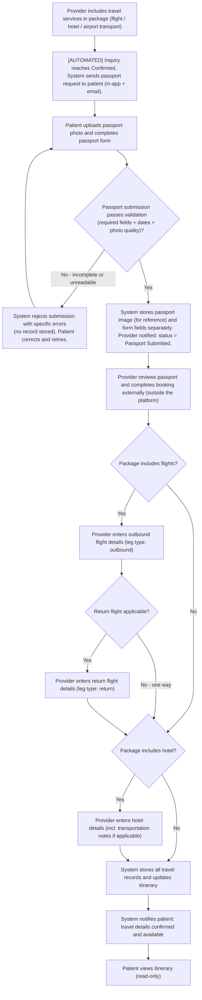
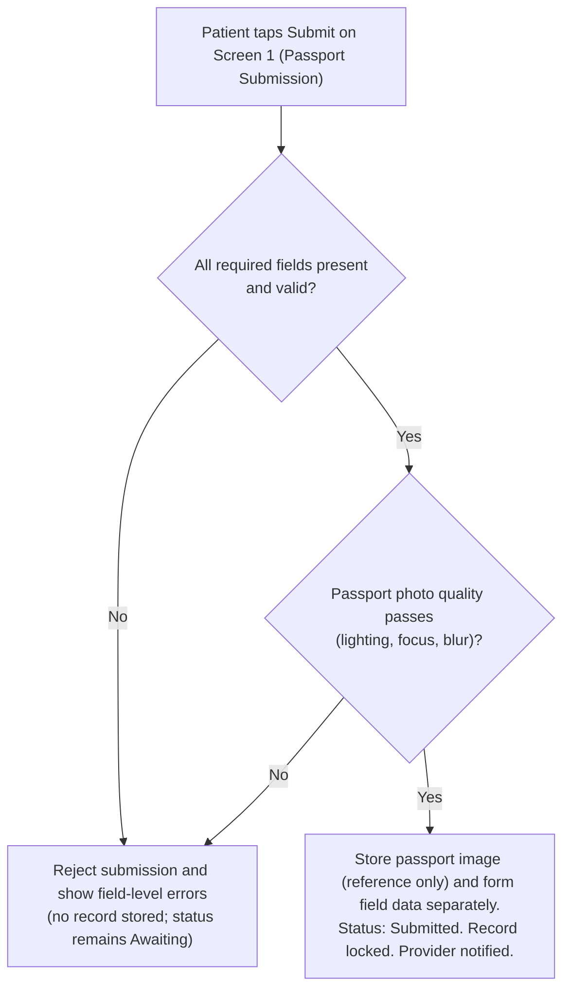

# FR-008 - Travel & Logistics Coordination

**Module**: P-04: Travel & Logistics | A-04: Travel Management | S-04: Travel API Gateway (future phase)
**Feature Branch**: `fr008-travel-booking-integration`
**Created**: 2025-11-10
**Last Updated**: 2026-02-24
**Status**: ✅ Verified & Approved
**Source**: FR-008 from system-prd.md; cross-checked with transcriptions (HairlineApp-Part1/2, ProviderPlatformPart1, AdminPlatformPart1/2, HairlineOverview)

---

## Executive Summary

Enable coordinated travel logistics for patients and providers across the full appointment lifecycle. In MVP, the platform does **not** support in-app flight or hotel booking — instead it facilitates information capture and coordination between patients and providers. There are two distinct travel paths:

1. **Provider-included travel**: The provider covers flights, hotel, and/or transport as part of their package. The patient submits passport details so the provider can complete the bookings externally. Travel items appear in the package breakdown.
2. **Patient self-booked travel**: The patient arranges their own flights and hotel independently. They submit the confirmed flight and hotel details into the platform so the provider has visibility for coordination (arrival times, airport pickups, etc.).

In both paths, the platform captures, stores, and surfaces travel details to all relevant parties (patient, provider, admin). In-app booking via flight/hotel APIs and platform-managed transport are planned for a **future phase** (post-MVP).

---

## MVP Scope Boundaries

### In Scope (MVP)

- Passport capture: patient submits photo + form fields for all relevant passport details
- Patient-submitted flight and hotel information (patient self-booked path)
- Provider-entered flight and hotel information (provider-booked path)
- Package travel inclusion: provider marks flight/hotel/transport as included in the package
- Itinerary aggregation: unified view of all confirmed travel per appointment (read-only for admin)
- Round-trip flight support: two separate flight records (outbound + return) per appointment
- Admin oversight: view and manage all travel records linked to appointments
- Email notifications for travel record submission and updates

### Out of Scope (MVP — Future Phase)

- In-app flight search and booking via API (e.g. Amadeus, Skyscanner)
- In-app hotel search and booking via API (e.g. Booking.com, Expedia)
- Platform-managed transport (Hairline-owned driver network, driver apps, real-time tracking)
- Commission tracking on platform-facilitated bookings (depends on API booking being live)
- Airport transport booking (informational only in MVP via hotel form's Transportation Details field)
- Travel price preview during inquiry date selection (requires live flight API — future)
- OCR / auto-extraction of flight or hotel booking data from patient screenshots (client expectation noted; deferred to future phase — all travel details entered manually in MVP)

---

## Multi-Tenant Architecture

### Patient Platform (P-04)

- Receive an **automated** passport submission request (in-app prompt + email) when the inquiry transitions to **Confirmed** status and the package includes provider-booked travel (Path A only) — no action required from the patient to trigger this
- Submit passport details (photo upload + form) — **Path A only**; not required when the patient self-books travel
- Receive an **automated** flight and hotel submission request (in-app prompt + email) when the inquiry transitions to **Confirmed** status — patient self-booked path (Path B) only
- Submit outbound and return flight information per leg — patient self-booked path
- Submit hotel information — patient self-booked path
- View submitted passport data (form fields; masked passport number) — Path A only; passport image is stored for provider reference only and is not auto-parsed
- View unified travel itinerary (flights, hotel, package inclusions) linked to the appointment
- Receive notifications when the provider enters or updates travel details on their behalf

### Provider Platform (PR-04)

- Mark which travel services are included in a package when travel is provider-included (flight / hotel / airport transport). These inclusions determine which records the provider must enter after confirmation.
- View travel status indicators (passport, outbound flight, return flight, hotel) within the **booking/quote detail screen** — updated automatically when the booking reaches **Confirmed** status (e.g. "Awaiting passport details", "Passport submitted"). No separate travel dashboard.
- View submitted passport details for a confirmed patient (passport number shown in full for booking purposes) — accessed from the Travel section of the booking detail screen.
- Enter confirmed flight details (outbound + return legs) and hotel details on behalf of the patient after completing the external booking — provider-booked path; accessed from the Travel section of the booking detail screen.
- View patient-submitted flight and hotel details for coordination — patient self-booked path; read-only view accessed from the Travel section of the booking detail screen.
- View combined travel itinerary per appointment within the booking detail screen.

### Admin Platform (A-04)

- View travel status (passport, flight, hotel) and records within the **booking/inquiry detail screen** — no separate travel dashboard. Admin navigates to any booking via the existing admin inquiry/booking management, then accesses the Travel section there.
- Monitor automated travel request status per appointment (whether requests were sent, what is pending) from within each booking's Travel section.
- Manually re-trigger travel submission requests to patients for any pending record directly from the Travel section.
- Edit or override any travel record via Screen 12, reached from the Travel section of the booking detail screen; all corrections require a mandatory audit log entry.
- Manage travel settings and future API configurations.
- Future: configure commission parameters and per-country enablement once API booking is live.

### Shared Services

> **S-04 (Travel API Gateway)**: In MVP, S-04 provides travel record storage and event dispatch only — no external API integration. Live flight/hotel API connections are deferred to the future phase.

- Listen for inquiry **Confirmed** status transitions and automatically dispatch travel submission requests: passport request to patient for Path A (provider-booked travel); flight and hotel submission request to patient for Path B (patient self-booked)
- Store and serve all travel records (passport, flight, hotel) against `quote_id` (booking context); records are immutable after submission — admin corrections create a new locked version with a mandatory audit log entry
- Send notifications (email + in-app) for all travel record events: automated requests on Confirmed, submissions received, provider updates
- Enforce access control: passport PII restricted to the submitting patient, assigned provider, and admin

---

## Business Workflows

### Main Flow 1: Provider-Included Travel

**Actors**: System (automated), Patient, Provider, Admin
**Trigger**: Inquiry/appointment status transitions to **Confirmed** (deposit paid, booking status = Confirmed per FR-006, appointment locked). The system automatically fires the passport request — no manual action from provider or admin required.
**Outcome**: Provider has all patient travel details needed to complete external bookings; patient's itinerary is updated with confirmed flight and hotel records.

**Flow Diagram**:



---

### Main Flow 2: Patient Self-Booked Travel

**Actors**: System (automated), Patient, Provider, Admin
**Trigger**: Inquiry/appointment status transitions to **Confirmed** (deposit paid, booking status = Confirmed per FR-006). System automatically prompts the patient to submit all travel details — no manual trigger required.
**Outcome**: Provider has visibility of the patient's confirmed travel details for coordination; unified itinerary is available to both parties.

**Flow Diagram**:


---

### Alternative Flows

**A1: Passport Submission Rejected (Validation Failure)**

- **Trigger**: Patient attempts to submit passport details but fails validation (missing required fields, invalid dates, or passport photo quality checks fail).
- **Outcome**: Submission is rejected; **no passport record is created/updated**; patient remains on Screen 1 with field-level errors. Passport status remains **Awaiting** until a successful submission is completed.
- **Flow Diagram**:



**A2: Provider or Patient Attempts to Edit a Submitted Record**

- **Trigger**: Provider or patient attempts to modify a flight, hotel, or passport record that has already been submitted.
- **Outcome**: Edit is blocked; submitter is directed to contact admin for any correction.
- **Flow Diagram**:


**B1: No Travel Required (Local Patient)**

- **Trigger**: Patient is local and does not need flights or hotel.
- **Outcome**: Travel submissions are skipped; itinerary is marked &quot;No travel required.&quot; Patient can still continue to procedure.
- **Flow Diagram**:


---

## Screen Specifications

### Patient Platform

#### Screen 1: Passport Submission

**Purpose**: Capture patient passport details (photo + structured form) after appointment is confirmed, exclusively for use by the provider when booking travel on the patient's behalf (Path A — provider-included travel). Passport submission is **not required** when the patient self-books travel (Path B).

**Data Fields**:

| Field Name | API Field | Type | Required | Description | Validation Rules |
|---|---|---|---|---|---|
| Passport Photo | `passport_image` | File (image) | Yes | Photo of the passport's data page | JPEG/PNG/HEIC; max 10 MB; must be legible |
| Full Name | `passport_name` | Text | Yes | As it appears on passport | Non-empty; max 100 chars |
| Passport Number | `passport_number` | Text | Yes | Machine-readable passport number | Non-empty; max 20 chars |
| Date of Birth | `passport_dob` | Date | Yes | As on passport | Valid past date |
| Gender | `gender` | Select | Yes | As on passport | Male / Female / Other |
| Location (Nationality) | `location` | Text | Yes | Country of nationality | Non-empty |
| Place of Birth | `place_of_birth` | Text | Yes | City/country of birth | Non-empty |
| Date of Issue | `passport_issue` | Date | Yes | Passport issue date | Valid past date |
| Date of Expiry | `passport_expiry` | Date | Yes | Passport expiry date | Must be a future date |

**Business Rules**:

- This screen is triggered automatically when the inquiry reaches **Confirmed** status **and the package includes provider-booked travel (Path A)**. It is NOT shown for patient self-booked journeys (Path B).
- Passport number is captured and stored but **masked in display** (e.g. `A1234****`); full number visible only to the assigned provider and admin.
- Passport photo is stored in compliant secure storage as a reference document only. It is **not parsed or processed automatically** — all passport fields must be filled in manually by the patient via the form.
- Passport photo upload MUST run an on-device quality check before submission is allowed (lighting conditions, focus, blurriness). Use the app's standard Flutter implementation (Google ML Kit) for this quality gate. If the check fails, the app blocks submission and provides an actionable error (e.g., "Too blurry — retake in better light"). This is a **quality gate only** (no OCR / data extraction).
- The stored image is accessible to the assigned provider and admin for manual verification purposes; it is not shown in any list or itinerary view.
- Once submitted, the passport record is **locked** and cannot be edited, deleted, or re-submitted by the patient or provider. Corrections must be requested through admin (Screen 12 replacement + audit reason).
- If passport details were previously submitted for an earlier appointment, the patient may reuse them; if the passport has since changed (e.g. renewed), admin must update the record.
- All passport fields are treated as PII and subject to GDPR/data protection rules.

**Notes**:

- After submission, the screen transitions to a read-only confirmation view showing the manually entered form fields: Full Name, Date of Birth, Gender, Location, Place of Birth, Date of Issue, Date of Expiry, and masked Passport Number. The passport photo is not displayed in the confirmation view.
- Provide clear progress indication during photo upload. The photo upload and the form fields are submitted together; no automatic data extraction occurs from the photo.

---

#### Screen 2: Travel Requirement Check — Patient (Path B)

**Purpose**: Allow the patient to confirm whether they need to arrange travel for their upcoming appointment. Shown immediately after the automated travel submission request is received (Path B only). Local patients who do not require flights or a hotel can dismiss the submission workflow here, preventing unnecessary prompts.

**UI Layout**: Full-screen prompt with appointment context (clinic name, appointment date) and a single question with two action options.

| Element | Type | Description |
|---|---|---|
| Appointment summary | Display | Clinic name + appointment date (read-only context) |
| Prompt | Heading | "Do you need to arrange travel for this appointment?" |
| Option A | Primary button | "Yes — I need to arrange travel" |
| Option B | Secondary button | "No — I am local / no travel needed" |

**Business Rules**:

- This screen is shown **only for Path B** (patient self-booked travel). It is not shown for Path A because the provider handles all travel; passport submission is requested instead (Screen 1).
- If the patient selects **"Yes"**: the system proceeds to Screen 3 (Flight Information) and Screen 4 (Hotel Information) in sequence.
- If the patient selects **"No"**: the system sets the appointment's travel status to `no_travel_required`, suppresses all further travel submission reminders for this appointment, and redirects the patient to Screen 5 (Travel Itinerary View) showing "No travel required."
- Once set to `no_travel_required`, the patient cannot reverse this themselves. If the patient's situation changes, they must contact admin.
- Admin can override `no_travel_required` from Screen 11 (Oversight) and re-send the travel submission request.
- This decision is recorded with a timestamp and actor ID (patient).

---

#### Screen 3: Flight Information — Patient Submission (Path B)

**Purpose**: Allow the patient to submit confirmed flight details for one leg of their trip. Used twice for a round-trip: once for the outbound leg and once for the return leg.

**Data Fields**:

| Field Name | API Field | Type | Required | Description | Validation Rules |
|---|---|---|---|---|---|
| Leg Type | `leg_type` | Select (header) | Yes | Outbound or Return | Must select one; drives form header label |
| Airline Name | `airline_name` | Text | Yes | Name of the airline | Non-empty |
| Flight Number | `flight_number` | Text | Yes | Specific flight number | Non-empty |
| Departure Airport | `departure_airport` | Text | Yes | IATA code + airport name | Non-empty |
| Arrival Airport | `arrival_airport` | Text | Yes | IATA code + airport name | Non-empty |
| Departure Date | `departure_date` | Date | Yes | Scheduled departure date | Valid date; outbound must be before procedure start date |
| Departure Time | `departure_time` | Time | Yes | Scheduled departure time | Valid time (HH:MM) |
| Arrival Date | `arrival_date` | Date | Yes | Scheduled arrival date | Must be ≥ departure date |
| Arrival Time | `arrival_time` | Time | Yes | Scheduled arrival time | Valid time (HH:MM) |
| Ticket Confirmation Number | `ticket_confirmation_number` | Text | Yes | Booking reference from airline | Non-empty |
| Ticket Class | `ticket_class` | Select | Yes | Economy / Business / First | Must select one |
| Baggage Allowance | `baggage_allowance` | Text | No | Checked + carry-on allowance details | Free text; max 300 chars |
| Special Requests | `special_request` | Text | No | Seat preference, meal preference, etc. | Free text; max 500 chars |

**Business Rules**:

- `total_price` is explicitly excluded from this form. Flight cost is captured at the package/quote level (FR-004/FR-007).
- The form header must display the leg type label clearly: "Outbound Flight" or "Return Flight."
- After submitting the outbound leg, the system prompts the patient to also submit the return leg.
- Once submitted, the flight record is **locked**. The patient cannot edit it, and the provider cannot edit a patient-submitted record. Corrections must be requested through admin only.
- `baggage_allowance` field name corrected from `baggages_allowance` (API normalisation — resolve with backend team).

**Notes**:

- Present outbound and return as two sequential steps or two tabs under "Flight Information."
- Both legs are independent; either may be submitted separately if the return is not yet confirmed.

---

#### Screen 4: Hotel Information — Patient Submission (Path B)

**Purpose**: Allow the patient to submit their confirmed hotel booking details so the provider has visibility for coordination.

**Data Fields**:

| Field Name | API Field | Type | Required | Description | Validation Rules |
|---|---|---|---|---|---|
| Hotel Name | `hotel_name` | Text | Yes | Full name of the hotel/lodging | Non-empty |
| Hotel Address | `hotel_address` | Text | Yes | Full address for patient navigation | Non-empty |
| Check-In Date | `check_in_date` | Date | Yes | Arrival date at hotel | Valid date; must be before check-out |
| Check-In Time | `check_in_time` | Time | Yes | Expected check-in time | Valid time (HH:MM) |
| Check-Out Date | `check_out_date` | Date | Yes | Departure date from hotel | Must be after check-in |
| Check-Out Time | `check_out_time` | Time | Yes | Expected check-out time | Valid time (HH:MM) |
| Reservation Number | `reservation_number` | Text | Yes | Booking/reservation reference | Non-empty |
| Room Type | `room_type` | Select/Text | Yes | Room category (e.g. Single, Double, Suite) | Non-empty |
| Amenities Included | `amenities` | Text | No | Gym, breakfast, parking, etc. | Free text; max 500 chars |
| Transportation Details | `transportation` | Text | No | Transfer/pickup info tied to this stay | Free text; max 500 chars |
| Special Requests | `special_request` | Text | No | Accessibility needs, preferences, etc. | Free text; max 500 chars |
| Phone Number | `contact_number` | Text | No | Hotel contact phone | Valid phone format |
| Email | `contact_email` | Email | No | Hotel contact email | Valid email format |

**Business Rules**:

- One hotel record per appointment in MVP.
- The `Transportation Details` field is the canonical field for recording airport pickup and transfer notes. There is no separate transport form in MVP.
- Once submitted, the hotel record is **locked**. The patient cannot edit it, and the provider cannot edit a patient-submitted record. Corrections must be requested through admin only.

**Notes**:

- Airport transport is not a standalone entity in MVP. Providers should be guided to use the Transportation Details field for any transfer instructions (e.g. "Private limousine from IST Airport — driver meets at arrivals with name sign").

---

#### Screen 5: Travel Itinerary View — Patient

**Purpose**: Unified, read-only view of all confirmed travel details for the appointment, assembled automatically from submitted records.

**Data Fields**:

| Section | Fields Displayed | Notes |
|---|---|---|
| Package Travel Items | List of provider-included services (e.g. "Hotel included", "Airport transfer included") | Shown only if provider-included items exist |
| Passport | Full Name, masked Passport Number, Date of Expiry | **Shown only for Path A** (provider-booked travel); not shown when patient self-books |
| Outbound Flight | Airline, flight number, departure → arrival airport, date/time, confirmation number, ticket class | Always shown if record exists |
| Return Flight | Same fields as outbound | Shown only if return record exists |
| Hotel | Hotel name, address, check-in/out date & time, reservation number, transportation details | Shown if record exists |

**Business Rules**:

- Patient sees own records only; no access to other patients' data.
- All records are read-only once submitted. No edit capability exists for the patient; any correction requires admin intervention.
- Each record section shows the submission timestamp and the submitter (patient or provider).
- If a record is pending (not yet submitted), the section displays the relevant "Awaiting submission" prompt with a link to the submission screen.

---

### Provider Platform

#### Screen 6: Travel Section — Booking/Quote Detail Screen (Provider)

**Purpose**: Travel status and actions surfaced as a section within the provider's existing booking/quote detail screen (FR-006 Screen 4). No standalone travel dashboard — the provider accesses all travel coordination directly from the booking they are already viewing, keeping travel in context with the appointment it belongs to.

**Placement**: Rendered as a collapsible "Travel" section at the bottom of the confirmed booking detail screen. Visible only once the booking reaches **Confirmed** status.

**Data Fields**:

| Field Name | Type | Description |
|---|---|---|
| Travel Path | Badge | Provider-included (Path A) / Patient self-booked (Path B) |
| Passport Status | Badge | Awaiting / Submitted / Incomplete — **Path A only**; hidden for Path B |
| Outbound Flight Status | Badge | Not included / Awaiting / Submitted |
| Return Flight Status | Badge | Not included / Awaiting / Submitted |
| Hotel Status | Badge | Not included / Awaiting / Submitted |
| Actions | Buttons | View Passport (Path A) · Enter Flight / Enter Hotel (Path A, if not yet submitted) · View Travel Details (Path B) |

**Business Rules**:

- Status badges update in real-time when travel records are submitted (by patient in Path B, by provider in Path A) and when admin applies corrections.
- Provider can only see and act on the booking currently open; no cross-patient or cross-clinic access from this section.
- For **Path A** appointments, "Enter Flight" and "Enter Hotel" action buttons appear only for travel services included in the accepted package. Services not included show "Not included" — no entry action is rendered.
- For **Path B** appointments, only "View Travel Details" is shown (read-only). Provider cannot enter or modify patient-submitted records.
- Provider can flag a patient-submitted record (Path B) as requiring review from the View Travel Details screen (Screen 10); admin resolves the dispute.
- "Incomplete" is an admin-managed status used when a submitted passport record is deemed unusable/incorrect and is pending admin correction (Screen 12). Patients/providers cannot "re-submit" to change a locked record.
- Each action button navigates to the relevant screen: View Passport → Screen 7; Enter Flight → Screen 8; Enter Hotel → Screen 9; View Travel Details → Screen 10.

---

#### Screen 7: Passport View — Provider

**Purpose**: Allow the provider to view a confirmed patient's passport details in order to complete external travel bookings (Path A).

**Data Fields**:

| Field Name | API Field | Display |
|---|---|---|
| Full Name | `passport_name` | Plain text |
| Passport Number | `passport_number` | Shown in full to assigned provider and admin only |
| Date of Birth | `passport_dob` | Plain text |
| Gender | `gender` | Plain text |
| Location (Nationality) | `location` | Plain text |
| Place of Birth | `place_of_birth` | Plain text |
| Date of Issue | `passport_issue` | Plain text |
| Date of Expiry | `passport_expiry` | Plain text |
| Passport Photo | `passport_image` | Viewable (not downloadable in MVP) |

**Business Rules**:

- Passport number is shown **in full** to the assigned provider (unlike the patient's own masked view) so the provider can use it for booking.
- Read-only. Provider cannot edit passport data. If the data is incorrect, the provider must contact admin for correction.
- Access is logged (timestamp, provider user ID) for audit purposes.
- Provider must not be able to view passport data for patients not assigned to their clinic.

---

#### Screen 8: Flight Information — Provider Entry (Path A)

**Purpose**: Allow the provider to enter confirmed flight details on behalf of the patient after completing the external booking. Used twice for a round-trip: once for the outbound leg and once for the return leg.

**Data Fields**: Same fields as Screen 3 (Patient Flight Submission), including `leg_type`. Provider-facing form is identical in structure; the submitter is recorded as the provider.

| Field Name | API Field | Type | Required | Description | Validation Rules |
|---|---|---|---|---|---|
| Leg Type | `leg_type` | Select (header) | Yes | Outbound or Return | Must select one; drives form header label |
| Airline Name | `airline_name` | Text | Yes | Name of the airline | Non-empty |
| Flight Number | `flight_number` | Text | Yes | Specific flight number | Non-empty |
| Departure Airport | `departure_airport` | Text | Yes | IATA code + airport name | Non-empty |
| Arrival Airport | `arrival_airport` | Text | Yes | IATA code + airport name | Non-empty |
| Departure Date | `departure_date` | Date | Yes | Scheduled departure date | Valid date; outbound must be before procedure start date |
| Departure Time | `departure_time` | Time | Yes | Scheduled departure time | Valid time (HH:MM) |
| Arrival Date | `arrival_date` | Date | Yes | Scheduled arrival date | Must be ≥ departure date |
| Arrival Time | `arrival_time` | Time | Yes | Scheduled arrival time | Valid time (HH:MM) |
| Ticket Confirmation Number | `ticket_confirmation_number` | Text | Yes | Booking reference from airline | Non-empty |
| Ticket Class | `ticket_class` | Select | Yes | Economy / Business / First | Must select one |
| Baggage Allowance | `baggage_allowance` | Text | No | Checked + carry-on allowance details | Free text; max 300 chars |
| Special Requests | `special_request` | Text | No | Seat preference, meal preference, etc. | Free text; max 500 chars |

**Business Rules**:

- Enabled only for **Path A** appointments where flights are included in the accepted package. Patient flight submission is not available in Path A.
- The form header must display the leg type label clearly: "Outbound Flight" or "Return Flight."
- After entering the outbound leg, the system prompts the provider to also enter the return leg.
- Both legs are independent; either may be entered separately if the return booking is not yet finalised.
- `total_price` is excluded from this form; flight cost is captured at the package/quote level (FR-004/FR-007).
- Once submitted, this record is **locked**. Neither the provider nor the patient can edit it. If a correction is needed, the provider must contact admin.

**Notes**:

- Present outbound and return as two sequential steps or two tabs under "Flight Information," consistent with the patient-facing version (Screen 3).

---

#### Screen 9: Hotel Information — Provider Entry (Path A)

**Purpose**: Allow the provider to enter confirmed hotel details on behalf of the patient after completing the external booking (Path A only).

**Data Fields**:

| Field Name | API Field | Type | Required | Description | Validation Rules |
|---|---|---|---|---|---|
| Hotel Name | `hotel_name` | Text | Yes | Full name of the hotel/lodging | Non-empty |
| Hotel Address | `hotel_address` | Text | Yes | Full address for patient navigation | Non-empty |
| Check-In Date | `check_in_date` | Date | Yes | Arrival date at hotel | Valid date; must be before check-out |
| Check-In Time | `check_in_time` | Time | Yes | Expected check-in time | Valid time (HH:MM) |
| Check-Out Date | `check_out_date` | Date | Yes | Departure date from hotel | Must be after check-in |
| Check-Out Time | `check_out_time` | Time | Yes | Expected check-out time | Valid time (HH:MM) |
| Reservation Number | `reservation_number` | Text | Yes | Booking/reservation reference | Non-empty |
| Room Type | `room_type` | Select/Text | Yes | Room category (e.g. Single, Double, Suite) | Non-empty |
| Amenities Included | `amenities` | Text | No | Gym, breakfast, parking, etc. | Free text; max 500 chars |
| Transportation Details | `transportation` | Text | No | Airport pickup and transfer arrangements | Free text; max 500 chars |
| Special Requests | `special_request` | Text | No | Accessibility needs, preferences, etc. | Free text; max 500 chars |
| Phone Number | `contact_number` | Text | No | Hotel contact phone | Valid phone format |
| Email | `contact_email` | Email | No | Hotel contact email | Valid email format |

**Business Rules**:

- Enabled only when the package is Path A (provider-included travel) and no hotel record has been submitted yet for this appointment.
- The `Transportation Details` field is the canonical place to record airport pickup and transfer arrangements (e.g. "Private transfer from IST Airport — driver meets at arrivals with name sign").
- Once submitted, this record is **locked**. Neither the provider nor the patient can edit it. If a correction is needed, the provider must contact admin.
- A hotel record submitted by the provider is not editable by the patient.

#### Screen 10: Travel Details — Booking/Quote Detail Screen (Provider, Path B)

**Purpose**: Patient-submitted flight and hotel details rendered inline within the Travel section of the provider's booking/quote detail screen for Path B appointments. No separate screen — the provider reads all travel coordination detail without leaving the booking context.

**Placement**: Rendered as two collapsible sub-sections ("Flight Details" and "Hotel Details") that expand within Screen 6's Travel section when the provider opens a Path B booking. Passport sub-section is not present (not collected in Path B).

**Flight Details** *(up to two sub-sections: Outbound and Return)*:

| Field Name | API Field | Display |
|---|---|---|
| Airline Name | `airline_name` | Plain text |
| Flight Number | `flight_number` | Plain text |
| Departure Airport | `departure_airport` | Plain text |
| Arrival Airport | `arrival_airport` | Plain text |
| Departure Date | `departure_date` | Plain text |
| Departure Time | `departure_time` | Plain text |
| Arrival Date | `arrival_date` | Plain text |
| Arrival Time | `arrival_time` | Plain text |
| Ticket Confirmation Number | `ticket_confirmation_number` | Plain text |
| Ticket Class | `ticket_class` | Plain text |
| Baggage Allowance | `baggage_allowance` | Plain text |
| Special Requests | `special_request` | Plain text |
| Submitted By | — | Patient name + submission timestamp |
| Status | — | Submitted / Awaiting |

Return flight uses the same fields, shown as a separate sub-section. If no return record exists, shows "Return flight not yet submitted."

**Hotel Details**:

| Field Name | API Field | Display |
|---|---|---|
| Hotel Name | `hotel_name` | Plain text |
| Hotel Address | `hotel_address` | Plain text |
| Check-In Date | `check_in_date` | Plain text |
| Check-In Time | `check_in_time` | Plain text |
| Check-Out Date | `check_out_date` | Plain text |
| Check-Out Time | `check_out_time` | Plain text |
| Reservation Number | `reservation_number` | Plain text |
| Room Type | `room_type` | Plain text |
| Amenities Included | `amenities` | Plain text |
| Transportation Details | `transportation` | Plain text |
| Special Requests | `special_request` | Plain text |
| Phone Number | `contact_number` | Plain text |
| Email | `contact_email` | Plain text |
| Submitted By | — | Patient name + submission timestamp |
| Status | — | Submitted / Awaiting |

**Business Rules**:

- Entirely read-only. Provider cannot enter or correct any record in Path B.
- If a flight leg has not been submitted, its sub-section shows "Awaiting patient submission."
- If no hotel record has been submitted, the Hotel Details sub-section shows "Awaiting patient submission."
- Provider can use the Transportation Details field to plan clinic-side logistics (e.g. verifying patient arrival times for airport pickup arrangements).
- Visible only for Path B appointments. For Path A, the provider enters records directly via Screens 8 and 9 from the same Travel section.
- Provider can only view records for patients assigned to their clinic; no cross-clinic access.
- If a record appears incorrect, the provider must contact admin — no edit or flag capability from this view.

---

### Admin Platform

#### Screen 11: Travel Section — Admin Booking/Inquiry Detail Screen

**Purpose**: Travel status, records, and correction actions surfaced as a section within the admin's existing booking/inquiry detail screen. No standalone travel oversight dashboard — admin accesses all travel coordination for a specific appointment directly from the booking they are already viewing.

**Placement**: Rendered as a "Travel" section within the confirmed booking/inquiry detail screen in the admin platform. Visible for all confirmed bookings regardless of travel path.

**Data Fields**:

| Field Name | Type | Description |
|---|---|---|
| Travel Path | Badge | Provider-included (Path A) / Patient self-booked (Path B) |
| Passport Status | Badge | Awaiting / Submitted / Incomplete — **Path A only**; hidden for Path B |
| Outbound Flight Status | Badge | Not included / Awaiting / Submitted |
| Return Flight Status | Badge | Not included / Awaiting / Submitted |
| Hotel Status | Badge | Not included / Awaiting / Submitted |
| Actions | Buttons | Re-notify patient (per pending record) · Apply Correction (→ Screen 12) |

**Business Rules**:

- Admin can view all travel records without access restrictions; no cross-clinic filtering needed — admin is already within a specific booking.
- "Re-notify patient" triggers a manual reminder for any specific pending travel record (passport, flight, or hotel).
- "Apply Correction" navigates to Screen 12 for the detailed correction workflow.
- All admin edits require a mandatory reason note and are logged for audit.

---

#### Screen 12: Travel Record Detail & Admin Correction

**Purpose**: Full travel record view and correction screen for a specific appointment, reached via "Apply Correction" from the Travel section of the admin booking/inquiry detail screen (Screen 11). Admin can inspect all submitted records and apply corrections with a mandatory reason note. Records are locked for patients and providers; only admin can write to them post-submission.

**Screen Header (always visible across all tabs)**:

| Field | Type | Description |
|---|---|---|
| Patient Name | Text | Full name of the patient |
| Provider / Clinic | Text | Assigned clinic |
| Appointment Date | Date | Procedure date |
| Travel Path | Badge | Provider-included (Path A) / Patient self-booked (Path B) |
| Overall Status | Badge | Pending / Partially submitted / Complete |

---

**Tab 1: Passport**

*(Visible only for Path A appointments. Hidden for Path B.)*

| Field Name | API Field | Display | Admin Correction |
|---|---|---|---|
| Passport Photo | `passport_image` | Viewable in full (not downloadable) | Replaceable with new file upload |
| Full Name | `passport_name` | Plain text | Editable |
| Passport Number | `passport_number` | Shown in full (unmasked) | Editable |
| Date of Birth | `passport_dob` | Plain text | Editable |
| Gender | `gender` | Plain text | Editable |
| Location (Nationality) | `location` | Plain text | Editable |
| Place of Birth | `place_of_birth` | Plain text | Editable |
| Date of Issue | `passport_issue` | Plain text | Editable |
| Date of Expiry | `passport_expiry` | Plain text | Editable |
| Submitted By | — | Patient name + timestamp | Read-only |
| Status | — | Submitted / Incomplete / Awaiting | Read-only badge |

**Tab 1 Business Rules**:

- Passport number and photo are shown unmasked/in full to admin only.
- If no passport has been submitted yet, tab shows "Awaiting submission" with a "Re-notify patient" button.
- If the passport record is marked "Incomplete", it indicates admin has determined the submitted passport data/photo is unusable/incorrect and requires correction. The patient cannot re-submit; admin must apply a correction (replace photo and/or edit fields) with a mandatory reason note.
- Admin correction replaces the current record with a new locked version; the previous version is retained in the system's backend records.
- Every admin correction to this tab requires a mandatory "Reason for correction" note before saving.

---

**Tab 2: Flight Details**

*(Shown for both Path A and Path B. Contains up to two sub-sections: Outbound and Return.)*

**Outbound Flight**:

| Field Name | API Field | Display | Admin Correction |
|---|---|---|---|
| Leg Type | `leg_type` | Outbound | Read-only |
| Airline Name | `airline_name` | Plain text | Editable |
| Flight Number | `flight_number` | Plain text | Editable |
| Departure Airport | `departure_airport` | Plain text | Editable |
| Arrival Airport | `arrival_airport` | Plain text | Editable |
| Departure Date | `departure_date` | Plain text | Editable |
| Departure Time | `departure_time` | Plain text | Editable |
| Arrival Date | `arrival_date` | Plain text | Editable |
| Arrival Time | `arrival_time` | Plain text | Editable |
| Ticket Confirmation Number | `ticket_confirmation_number` | Plain text | Editable |
| Ticket Class | `ticket_class` | Plain text | Editable |
| Baggage Allowance | `baggage_allowance` | Plain text | Editable |
| Special Requests | `special_request` | Plain text | Editable |
| Submitted By | — | Patient or provider name + timestamp | Read-only |
| Status | — | Submitted / Awaiting | Read-only badge |

**Return Flight**:

Same fields as Outbound Flight. Displayed as a separate sub-section below. If no return record exists, tab shows "Return flight not yet submitted."

**Tab 2 Business Rules**:

- If neither outbound nor return has been submitted, tab shows "Awaiting submission" for each with a "Re-notify" option.
- Admin correction on either leg creates a new locked version of that leg's record, marking the previous as superseded.
- Every admin correction requires a mandatory "Reason for correction" note before saving.

---

**Tab 3: Hotel Details**

*(Shown for both Path A and Path B.)*

| Field Name | API Field | Display | Admin Correction |
|---|---|---|---|
| Hotel Name | `hotel_name` | Plain text | Editable |
| Hotel Address | `hotel_address` | Plain text | Editable |
| Check-In Date | `check_in_date` | Plain text | Editable |
| Check-In Time | `check_in_time` | Plain text | Editable |
| Check-Out Date | `check_out_date` | Plain text | Editable |
| Check-Out Time | `check_out_time` | Plain text | Editable |
| Reservation Number | `reservation_number` | Plain text | Editable |
| Room Type | `room_type` | Plain text | Editable |
| Amenities Included | `amenities` | Plain text | Editable |
| Transportation Details | `transportation` | Plain text | Editable |
| Special Requests | `special_request` | Plain text | Editable |
| Phone Number | `contact_number` | Plain text | Editable |
| Email | `contact_email` | Plain text | Editable |
| Submitted By | — | Patient or provider name + timestamp | Read-only |
| Status | — | Submitted / Awaiting | Read-only badge |

**Tab 3 Business Rules**:

- If no hotel record has been submitted, tab shows "Awaiting submission" with a "Re-notify" option.
- Admin correction creates a new locked version and marks the previous as superseded.
- Every admin correction requires a mandatory "Reason for correction" note before saving.

**General Business Rules (Screen 12)**:

- Admin can soft-delete any record with a mandatory reason; deletion is not permanent and is retained in the system's backend audit trail.
- Every admin correction requires a mandatory "Reason for correction" note before saving.
- All corrections notify both the patient and the provider automatically.
- Passport tab is hidden entirely for Path B appointments (no passport is captured).
- Future: this screen will also surface travel API configuration settings (provider, commission parameters, per-country enablement) once API booking is live.

---

## Business Rules

### Automated Trigger on Confirmed Status

- The **Confirmed** inquiry/appointment status is the single automated trigger for all travel information requests.
- When an inquiry transitions to Confirmed, the system MUST automatically:
  - **Path A** (provider-included travel): Send a passport submission request to the patient (in-app + email). No flight or hotel submission is requested from the patient — the provider handles all travel bookings externally.
  - **Path B** (patient self-booked): Send a flight and hotel submission request to the patient (in-app + email). **No passport request is sent** — the patient is booking independently.
- These requests are sent without any manual action from the provider or admin.
- The provider's travel coordination view MUST update immediately to show the relevant "Awaiting..." status indicators as soon as the Confirmed transition fires.

---

### Travel Path Determination

- The travel path is binary and **automatically derived** from the accepted package's `included_services`:
  - **Path A (provider-included travel)**: `included_services` contains `flight` or `hotel` (or both). Provider books included travel services externally; the platform captures passport details (from patient) and confirmed travel details (from provider).
  - **Path B (patient self-booked travel)**: `included_services` does not contain `flight` or `hotel` (may contain only `transport`, or be empty). Patient books externally; the platform captures confirmed travel details (from patient). No passport request is sent.
- `travel_path` is **not a user-selectable field**. The provider selects which travel services to include via the `included_services` checklist during **quote creation** (FR-004 Screen 1), and the system derives `travel_path` automatically on save. The derived value is persisted onto the accepted package. FR-008 consumes `travel_path` and `included_services` post-confirmation to route the automated requests and determine which record statuses/actions are applicable.
- In **Path A**, the accepted package MAY include any mix of travel services (flight, hotel, transport). Services not included are treated as "Not included" for that appointment and are not collected in MVP.
- **No submitter mixing**:
  - In **Path A**, flight/hotel details are entered by the provider only (patient does not submit flight/hotel records).
  - In **Path B**, flight/hotel details are submitted by the patient only (provider does not enter travel records).
  - Admin can correct records in both paths (versioned + audited).
- Transport (airport pickup) is always provider-arranged when included; it is not tracked as a separate record in MVP (captured via notes where applicable).

### Passport Rules

- Passport submission is **required** for all **Path A** appointments (provider-included travel).
- Passport submission is **not required and not requested** when the patient self-books travel (Path B). The patient manages their own passport for their independent bookings.
- Passport number is always masked in the patient's display view; stored encrypted at rest; shown in full to the assigned provider and admin only.
- Once submitted, the passport record is **locked** and cannot be edited by the patient or provider. Admin correction only, with a mandatory audit log entry.

### Flight Records

- Maximum of 2 flight records per appointment (outbound + return).
- Both legs use the same form; leg type (outbound/return) is set at creation.
- Flight records are **locked immediately after submission**. No edits by patient or provider; admin correction only with audit log.
- The `baggages_allowance` API field name should be normalised to `baggage_allowance` (single, not plural) — this is a minor API naming discrepancy to resolve with the backend team.

### Hotel Records

- One hotel record per appointment in MVP.
- `Transportation Details` in the hotel record is the canonical place to capture airport pickup notes.

### Round-Trip

- Round-trip = two `FlightRecord` entries (leg type: outbound / return) linked to the same appointment.
- The UI presents these as two separate tabs or sequential forms under "Flight Information."
- Both legs are independent; either may be missing (e.g. one-way, or return not yet confirmed).

### Itinerary Rules

- Itinerary is automatically assembled from all confirmed travel records per appointment.
- One active itinerary per appointment. Individual records are locked after submission and can only be corrected by admin. Admin corrections automatically refresh the relevant itinerary section.
- All record submissions and admin corrections are logged (who, when, what).

### Notifications

- Patient is notified when: passport is requested, travel details are entered by provider, admin applies a correction to any travel record.
- Provider is notified when: patient submits passport, patient submits flight/hotel details, admin applies a correction to any travel record.
- All notifications via email + in-app.

### Data & Privacy

- Passport data (especially `passport_number` and `passport_image`) is PII and must be encrypted at rest and in transit.
- Access to passport data is restricted to: the patient (own record), the assigned provider, and admin.
- Booking confirmation data (flight/hotel) retained for 7 years (aligned with medical data retention per constitution). All audit log entries for travel record mutations retained for 10 years per constitution Section VI.
- All access and modification events logged with timestamp, user ID, and IP.

---

## Success Criteria

### Patient Experience

- **SC-001**: 90% of patients complete passport submission (photo + form) in under 3 minutes.
- **SC-002**: 85% of patients successfully submit flight and hotel details without support intervention.
- **SC-003**: 95% of patients can view their combined itinerary within 5 seconds after all records are submitted.

### Provider Efficiency

- **SC-004**: Providers can view patient passport details and enter travel info within 2 minutes per patient.
- **SC-005**: Support tickets about "where are my travel details" reduced by 50% after launch.
- **SC-006**: 100% of confirmed appointments with travel-included packages have a "travel status" indicator visible to the provider.

### Admin Oversight

- **SC-007**: 100% of travel records accessible and filterable in admin oversight view.
- **SC-008**: 100% of travel record mutations logged for audit.
- **SC-009**: Admin can resolve any travel data dispute and update a record with full audit trail.

### System Performance

- **SC-010**: Passport photo upload completes within 5 seconds for 95% of submissions (10 MB image, standard mobile connection).
- **SC-011**: Itinerary view loads within 3 seconds for 95% of requests.
- **SC-012**: 99.9% uptime for travel record submission and retrieval.
- **SC-013**: Zero loss of submitted travel records.

---

## Dependencies

### Internal

- **FR-001 / P-01**: Patient authentication — only verified, logged-in patients may submit passport and travel records.
- **FR-005 / Package Offers**: Package offer defines which travel services are provider-included vs. patient self-booked; travel path is derived from the accepted package.
- **FR-006 / P-03**: Booking & Scheduling — `quote_id` is the anchor for all travel records; procedure dates determine flight date constraints.
- **FR-007 / P-05**: Payment — passport submission and travel info prompts are triggered after payment confirmation.
- **S-03 / Notification Service**: Sends email + in-app notifications for all travel record events.

### External (Future Phase Only)

- **Flight Provider API** (e.g. Amadeus, Skyscanner) — for live price preview and in-app booking. Not in MVP.
- **Hotel Provider API** (e.g. Booking.com, Expedia) — for in-app hotel booking. Not in MVP.
- **Transport Partner** — for Hairline-managed airport pickup. Not in MVP.

### Data

- **Appointment / Quote record**: `quote_id` is the foreign key on all travel records (passport, flight, hotel).
- **Patient profile**: Home location, preferred language (for notification formatting).
- **Provider package data**: Defines which travel items are included.

---

## Assumptions

- In MVP, all flight and hotel bookings are completed **outside the platform** by either the patient or the provider. The platform is used solely for information capture and coordination.
- Transport is always either included as a package service item (with notes in the hotel form's Transportation Details) or arranged independently by the patient — no separate transport form in MVP.
- Round-trip is the standard expectation; the UI should present outbound and return as two sequential steps and prompt for both.
- Passport submission is mandatory when the provider is booking any travel item on the patient's behalf (Path A). It is not required and not requested when the patient self-books (Path B).
- One hotel per appointment is sufficient for MVP (no multi-city or multi-hotel scenario).
- The `total_price` field visible in the flight UI design is **removed for MVP** as no transaction is processed in-platform. Cost is captured at the package/quote level.
- The API field `baggages_allowance` is a naming inconsistency to resolve with backend (should be `baggage_allowance`).

---

## Implementation Notes

### API Payload Reference

**Flight Record** (`POST /api/v1/travel/flights`):

```json
{
  "quote_id": "{{QUOTE_ID}}",
  "leg_type": "outbound | return",
  "airline_name": "string",
  "flight_number": "string",
  "departure_airport": "string (IATA code + name)",
  "arrival_airport": "string (IATA code + name)",
  "departure_date": "YYYY-MM-DD",
  "departure_time": "HH:MM",
  "arrival_date": "YYYY-MM-DD",
  "arrival_time": "HH:MM",
  "ticket_confirmation_number": "string",
  "ticket_class": "Economy | Business | First",
  "baggage_allowance": "string",
  "special_request": "string"
}
```

Note: `total_price` is excluded. `baggages_allowance` corrected to `baggage_allowance`. `leg_type` is a new required field.

**Hotel Record** (`POST /api/v1/travel/hotels`):

```json
{
  "quote_id": "{{QUOTE_ID}}",
  "hotel_name": "string",
  "hotel_address": "string",
  "check_in_date": "YYYY-MM-DD",
  "check_in_time": "HH:MM",
  "check_out_date": "YYYY-MM-DD",
  "check_out_time": "HH:MM",
  "reservation_number": "string",
  "room_type": "string",
  "amenities": "string",
  "transportation": "string",
  "special_request": "string",
  "contact_number": "string",
  "contact_email": "string"
}
```

**Passport Record** (`POST /api/v1/travel/passport`):

```json
{
  "quote_id": "{{QUOTE_ID}}",
  "passport_image": "file",
  "passport_name": "string",
  "passport_number": "string",
  "passport_dob": "YYYY-MM-DD",
  "gender": "string",
  "location": "string",
  "place_of_birth": "string",
  "passport_issue": "YYYY-MM-DD",
  "passport_expiry": "YYYY-MM-DD"
}
```

### Security

- `passport_number` and `passport_image`: encrypted at rest (AES-256); access-controlled; masked in all display views.
- All travel record endpoints require valid auth token (patient or provider role).
- Admin endpoints require admin role with audit logging on all writes.
- TLS 1.3 for all data in transit.

### Architecture Notes

- All travel records are keyed on `quote_id` (booking context). Appointment identifiers can be derived from the booking context as needed.
- Travel records are immutable after submission. Admin corrections write a new locked version and mark the previous as superseded; both versions are retained in the audit log. Patient and provider have no write access to submitted records.
- Passport image stored in secure object storage (separate from other files) as a reference document for manual provider verification only. No OCR or automatic data extraction is performed. Separate access policy from other travel record data.

---

## Functional Requirements Summary

### Passport

- **REQ-008-001**: The system MUST allow patients to submit a passport photo and structured form data after payment is confirmed.
- **REQ-008-002**: The system MUST store passport data encrypted and mask `passport_number` in all display views.
- **REQ-008-003**: The system MUST restrict passport data access to the submitting patient, their assigned provider, and admin.
- **REQ-008-004**: The system MUST notify the provider when a patient submits or updates passport details.
- **REQ-008-005**: The system MUST automatically request passport details from the patient when the inquiry transitions to **Confirmed** status and the package includes provider-booked travel (Path A). This MUST be triggered without any manual action.
- **REQ-008-005b**: The system MUST automatically request flight and hotel details (no passport) from the patient when the inquiry transitions to **Confirmed** status and travel is patient self-booked (Path B). This MUST be triggered without any manual action.

### Flight Records

- **REQ-008-006**: The system MUST allow flight information to be submitted as two independent records (outbound and return), each with a `leg_type` indicator.
- **REQ-008-007**: The system MUST allow either the patient (Path B) or the provider (Path A) to submit flight records for an appointment.
- **REQ-008-008**: The system MUST validate that `arrival_date` is ≥ `departure_date` and that flight dates are consistent with the appointment window.
- **REQ-008-009**: The system MUST NOT include a `total_price` field in the flight record (payment is handled at the package/quote level).
- **REQ-008-010**: The system MUST normalise the flight API field to `baggage_allowance` (singular) for consistency.

### Hotel Records

- **REQ-008-011**: The system MUST allow hotel information to be submitted by either the patient (Path B) or the provider (Path A) for an appointment.
- **REQ-008-012**: The system MUST validate that `check_out_date` is after `check_in_date`.
- **REQ-008-013**: The `transportation` field in the hotel record MUST be the canonical field for airport pickup and transfer coordination in MVP.

### Itinerary

- **REQ-008-014**: The system MUST assemble a unified travel itinerary per appointment from all submitted passport, flight, and hotel records.
- **REQ-008-015**: The system MUST display the itinerary to the patient, provider (for coordination), and admin.
- **REQ-008-016**: The system MUST log all changes to travel records (who, when, what) for audit.
- **REQ-008-017**: Travel records (passport, flight, hotel) MUST be locked immediately after submission. The system MUST prevent any edit by the patient or provider post-submission. Admin corrections MUST write a new locked version, mark the previous as superseded, and log the correction with a mandatory reason.

### Package Travel Inclusion

- **REQ-008-018**: The travel path MUST be automatically derived from the quote's `included_services` selection — not manually chosen by the provider. If `included_services` contains `flight` or `hotel`, `travel_path` = `provider_included` (Path A); otherwise `travel_path` = `patient_self_booked` (Path B). The provider selects which travel services to include (any mix of flight, hotel, airport transport) via the `included_services` checklist during quote creation (FR-004 Screen 1: Quote Creation/Edit). This selection MUST be reflected in the package breakdown and determines the travel workflow post-confirmation. The derived `travel_path` and `included_services` are persisted onto the accepted package and consumed by FR-008 post-confirmation.
- **REQ-008-019**: When a package is Path A (provider-included travel), the system MUST surface a travel status tracker on the provider's confirmed appointment view covering: passport status, outbound flight status, return flight status, and hotel status.

### Notifications

- **REQ-008-020**: The system MUST automatically send a travel request notification to the patient (in-app + email) when the inquiry transitions to Confirmed status — no manual trigger required.
- **REQ-008-021**: The system MUST notify the patient when the provider enters travel details on their behalf (Path A), and when admin applies a correction to any of their travel records.
- **REQ-008-022**: The system MUST notify the provider when the patient submits passport or travel details, and when admin applies a correction to any travel record for their patient.

### Admin

- **REQ-008-023**: Admin MUST be able to view, filter, and drill into all travel records across all appointments.
- **REQ-008-024**: Admin MUST be able to edit any travel record with a mandatory audit log entry.

### Future Phase (Out of Scope for MVP)

- **REQ-008-F01**: The system SHOULD integrate a flight search API (e.g. Amadeus) to enable in-app flight booking in a future phase.
- **REQ-008-F02**: The system SHOULD integrate a hotel search API (e.g. Booking.com) to enable in-app hotel booking in a future phase.
- **REQ-008-F03**: The system SHOULD support commission tracking on platform-facilitated bookings once API booking is live.
- **REQ-008-F04**: The system SHOULD support a dedicated transport record entity when Hairline operates its own driver network.
- **REQ-008-F05**: The system SHOULD display real-time flight price estimates during inquiry date selection once a flight API is integrated.

---

## Key Entities

### PassportRecord

**Key attributes**: `patient_id`, `quote_id`, `passport_name`, `passport_number` (encrypted), `passport_dob`, `gender`, `location`, `place_of_birth`, `passport_issue`, `passport_expiry`, `passport_image` (file reference), `submitted_by`, `submitted_at`, `status` (pending / complete / incomplete), `version`
**Relationships**: One per patient per context; linked to appointment/quote; accessible by patient, assigned provider, admin.

### FlightRecord

**Key attributes**: `id`, `quote_id`, `leg_type` (outbound/return), `airline_name`, `flight_number`, `departure_airport`, `arrival_airport`, `departure_date`, `departure_time`, `arrival_date`, `arrival_time`, `ticket_confirmation_number`, `ticket_class`, `baggage_allowance`, `special_request`, `submitted_by`, `submitted_at`, `version`
**Relationships**: Up to 2 per appointment (outbound + return); linked to Itinerary.

### HotelRecord

**Key attributes**: `id`, `quote_id`, `hotel_name`, `hotel_address`, `check_in_date`, `check_in_time`, `check_out_date`, `check_out_time`, `reservation_number`, `room_type`, `amenities`, `transportation`, `special_request`, `contact_number`, `contact_email`, `submitted_by`, `submitted_at`, `version`
**Relationships**: One per appointment; linked to Itinerary.

### Itinerary

**Key attributes**: `id`, `quote_id`, `passport_status` (null for Path B), `outbound_flight_id`, `return_flight_id`, `hotel_id`, `package_travel_inclusions` (array), `last_updated_at`
**Relationships**: One per appointment; composed of PassportRecord, FlightRecord(s), HotelRecord; visible to patient, provider, admin.

### PackageTravelInclusion

**Key attributes**: `package_id`, `travel_path` (enum: `provider_included` | `patient_self_booked` — **derived, not user-selected**), `included_services` (array: `flight`, `hotel`, `transport`)
**Derivation rule**: `travel_path` is computed from `included_services` — if the array contains `flight` or `hotel`, `travel_path = provider_included`; otherwise `travel_path = patient_self_booked`. Computed on save during quote creation (FR-004) and persisted for query convenience.
**Relationships**: Part of the accepted package offer; drives which travel path (A or B) applies post-confirmation. For Path A, included services define which travel records the provider is responsible for entering.

---

## Appendix: Change Log

| Date | Version | Changes | Author |
|------|---------|---------|--------|
| 2025-11-10 | 1.0 | Initial PRD creation | AI |
| 2025-11-10 | 1.1 | Added clarifications and success criteria | AI |
| 2026-02-13 | 2.0 | Full rewrite: removed in-app booking from MVP scope; added two-path model (provider-included vs patient self-booked); added passport capture; added round-trip flight model; added transport guidance; resolved UI/API discrepancies (Total Price removed, baggage_allowance normalised, leg_type added); updated all screens, flows, requirements, entities | AI |
| 2026-02-23 | 2.1 | Verified & approved; aligned System PRD/Constitution to Phase 2 flight/hotel APIs; updated Path A to allow any mix of included services with provider-only entry (no submitter mixing); standardized travel record keying on `quote_id` | AI |
| 2026-02-24 | 2.2 | Screen redesign: removed standalone travel dashboards for provider and admin; travel status and actions now embedded as a Travel section within the existing booking/quote detail screen (Screens 6, 10, 11); Screen 12 entry point updated accordingly; module header corrected (removed PR-04, added S-04); "Confirmed" trigger aligned with FR-006 deposit-paid definition; data retention extended to 7 years; OCR deferred to future phase; FR-005 estimated travel costs dependency removed (deferred); REQ-008-018 cross-reference to FR-004/FR-024 added; travel table definitions added to system-data-schema.md | AI |
| 2026-02-24 | 2.3 | Clarified passport submission behavior: reject invalid submissions (no stored incomplete record), lock records post-submission with admin-only corrections, added Flutter (Google ML Kit) photo-quality gate, and clarified `travel_path`/`included_services` origin in FR-004. | AI |
| 2026-02-25 | 2.4 | Changed `travel_path` from manual provider selection to automatic derivation from `included_services`. If flight or hotel is included → Path A (provider_included), otherwise → Path B (patient_self_booked). Updated REQ-008-018, Travel Path Determination section, and PackageTravelInclusion entity. Aligned with FR-004 v1.6. | AI |

---

## Appendix: Approvals

| Role | Name | Date | Signature/Approval |
|------|------|------|--------------------|
| Product Owner | [Name] | 2026-02-23 | ✅ Verified & Approved |
| Technical Lead | [Name] | 2026-02-23 | ✅ Verified & Approved |
| Stakeholder | [Name] | 2026-02-23 | ✅ Verified & Approved |

---

**Template Version**: 2.0.0 (Constitution-Compliant)
**Constitution Reference**: Hairline Platform Constitution v1.0.0, Section III.B (Lines 799-883)
**Based on**: FR-011 Aftercare & Recovery Management PRD
**Last Updated**: 2026-02-24
