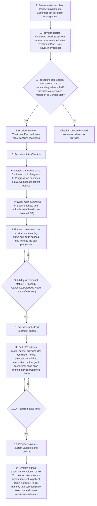
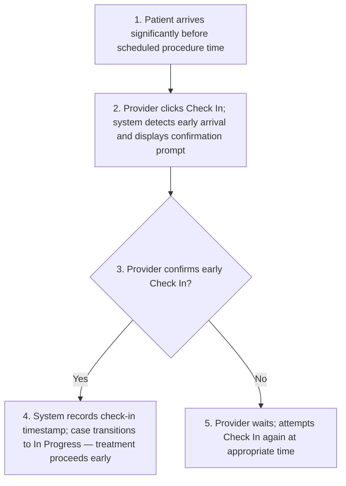
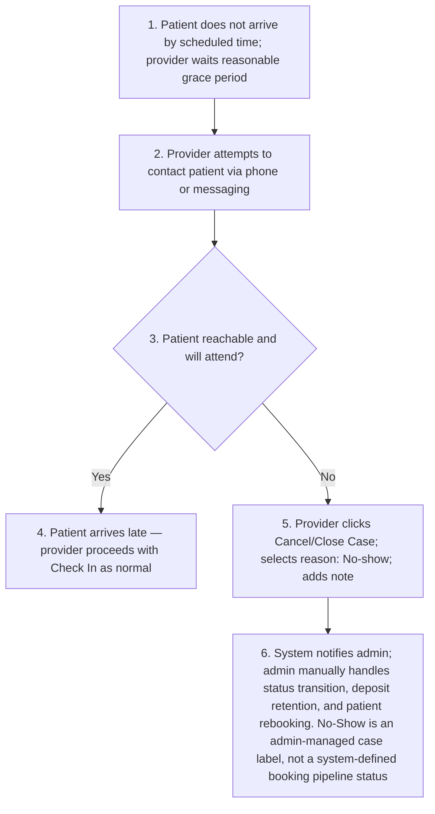
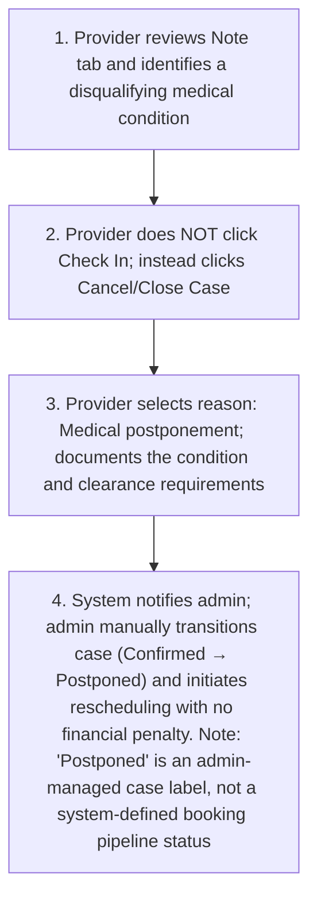
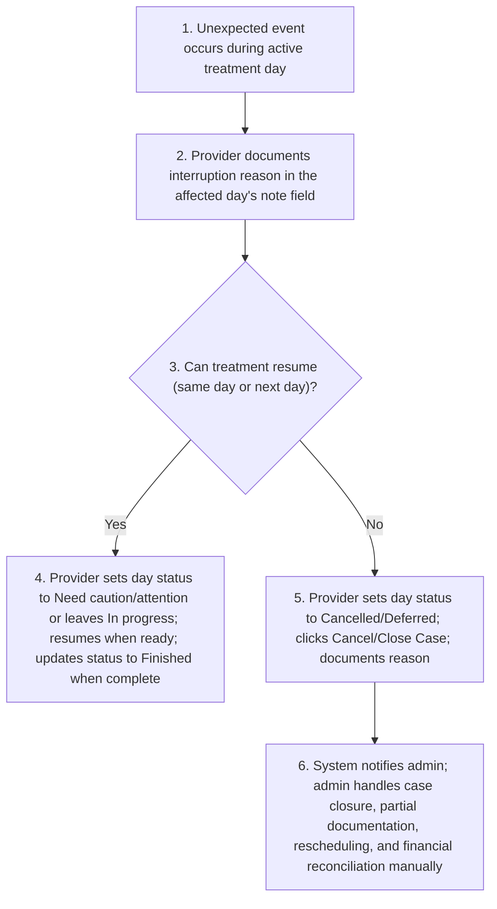
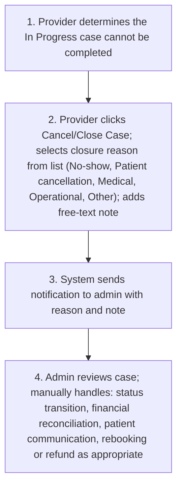

# FR-010 - Treatment Execution & Documentation

**Module**: PR-03: Treatment Execution & Documentation
**Feature Branch**: `fr010-treatment-execution`
**Created**: 2025-11-11
**Status**: ✅ Verified & Approved
**Source**: FR-010 from system-prd.md

---

## Executive Summary

The Treatment Execution & Documentation module enables providers to document the entire hair transplant procedure lifecycle from patient arrival through treatment completion. This module serves as the critical transition point where patients move from "Confirmed" bookings to active "In Progress" treatments and eventually to "Aftercare" status. The module captures comprehensive procedure details including clinician information, treatment details, graft counts, day-by-day treatment notes, head scan photo sets *(V1; true 3D scan in V2)*, and post-operative instructions that form the foundation for subsequent aftercare activities.

This module operates exclusively within the Provider Platform (PR-03) tenant, with data outputs consumed by both the Patient Platform (treatment completion notifications, post-op instructions) and Admin Platform (oversight, billing triggers). The module bridges the pre-treatment phase (bookings, scheduling) with the post-treatment phase (aftercare and billing reconciliation), ensuring complete documentation for audit trail, quality assurance, and seamless transition to long-term aftercare.

---

## Module Scope

### Multi-Tenant Architecture

- **Patient Platform (P-05)**: Receives real-time day-based progress updates during treatment execution (current treatment day and day status based on the accepted quote’s Treatment Plan (per-day)); receives completion notifications and post-op instructions after treatment finishes; NOT involved in detailed clinical documentation
- **Provider Platform (PR-03)**: PRIMARY tenant - providers document treatment progress day-by-day in real-time: update each day’s status and add provider-only day notes against the accepted quote’s Treatment Plan (day descriptions are read-only); day statuses are synced to patient/admin platforms; detailed clinical observations remain provider-only
- **Admin Platform (A-01)**: Real-time oversight and full editorial access — admins monitor all active treatments, can view and edit any treatment record, can manually intervene in case status, and audit completed documentation
- **Shared Services (S-05)**: Media Storage Service handles head scan photo sets (V1) and treatment documentation uploads; Real-time sync service (WebSocket/SSE) propagates day-based status updates to patient and admin platforms

### Multi-Tenant Breakdown

**Patient Platform (P-05)**:

- Receives real-time status updates (booking moved to "In Progress" when patient arrives)
- **Views current treatment day progress in real-time** (e.g., "Day 1 of 4: Consultation & Scans" or "Day 2 of 4: Hair Transplant Procedure") based on the accepted quote’s Treatment Plan (per-day)
- Receives treatment completion notification with post-op instructions
- Views provider-authored treatment summary note after completion (high-level outcome, final graft count, treatment type)
- Accesses before/after photos uploaded by provider (after completion)
- NOT involved in clinical documentation (no access to detailed medical notes, complications, or real-time clinical data during procedure)

**Provider Platform (PR-03)**:

- **Check In** patient to trigger "In Progress" status
- **Update each treatment day's status** (Not started / In progress / Finished / Need caution/attention / Cancelled/Deferred) per the accepted quote’s Treatment Plan (per-day) — synced to patient app and admin
- Add **day notes** for each day (provider-only clinical observations — not visible to patient)
- Add a **beginning-of-treatment note** and upload head scan photo sets at key stages *(V1; true 3D scan in V2)*
- Document actual graft count, conclusion notes, prescription, advice, and medication at end of treatment
- **End Treatment** (completes treatment documentation; signals to FR-011 for aftercare setup)

**Admin Platform (A-01)**:

- View all active treatments across all providers (real-time "In Progress" list with current day and status)
- **Monitor real-time treatment progress** for all active procedures (current day, day status)
- **Edit any treatment record** — admin can update day statuses, notes, end-of-treatment fields, and trigger status transitions manually
- Access and audit complete treatment documentation for quality assurance
- View and manage payment status (outstanding balance / split pay) for operational follow-up

**Shared Services (S-05)**:

- **Media Storage Service**: Secure, encrypted storage for head scan photo sets (V1) and treatment documentation uploads

### Communication Structure

**In Scope**:

- System-generated status notifications to patient (booking moved to "In Progress", treatment completed)
- **Real-time treatment day progress updates to patient app** (current day number, day description from the quote Treatment Plan, and day status - NOT detailed clinical data)
- Post-op instruction delivery to patient via email/in-app notification
- Provider-to-patient medication prescription delivery
- Admin notification of treatment completion for billing purposes
- **Admin real-time visibility** into treatment progress across all active procedures (which day + day status + day description — for oversight)

**Out of Scope**:

- Real-time chat between patient and provider during treatment (patients are physically present)
- Video documentation of procedure (future enhancement)
- Live streaming of detailed treatment progress to third parties (e.g., patient's family) (future enhancement)
- SMS notifications to patient's emergency contact (handled by S-03: Notification Service configuration; **no SMS treatment alerts are sent in MVP and this capability is reserved for a future phase once S-03 SMS support is enabled**)

### Entry Points

**Primary Entry Point**:

1. Provider navigates to **"Confirmed"** section in Patient Management (Provider Platform dashboard)
2. Provider selects a confirmed booking with procedure date = today or past and no outstanding balance
3. System opens the case detail page in tabbed view (tabs: Treatment Plan | Note | Book hotel & Book flight | In Progress)
4. Provider clicks **"Check In"** button to begin the treatment
5. System transitions booking status from "Confirmed" → "In Progress" — this is the moment the case changes stage; the In Progress tab becomes the active documentation workspace as part of this transition

**Secondary Entry Points**:

- Provider can resume documentation for "In Progress" treatments from the "In Progress" section in Patient Management
- Provider can view completed treatments from "Completed" section (read-only mode)

**Access Requirements**:

- Provider must have role: Owner, Manager, or Clinical Staff (Billing Staff may view but cannot document treatments)
- Patient must have "Confirmed" booking status (deposit paid) and no outstanding balance (full payment completed)
- Procedure date must be today or in the past (cannot mark future appointments as "In Progress")

---

## Business Workflows

### Main Flow: Treatment Execution & Documentation

**Actors**: Provider (Clinical Staff), Patient, System, Admin
**Trigger**: Patient arrives at clinic on scheduled procedure day
**Outcome**: Treatment documented day by day; patient receives post-op instructions; booking status moves to "Aftercare" (handled by FR-011)

**Flow Diagram**:

### Alternative Flows

**A1: Patient Arrives Early (Before Scheduled Time)**

- **Trigger**: Patient arrives significantly before the scheduled procedure time
- **Outcome**: Treatment proceeds earlier than scheduled; original appointment time preserved in booking record

**B1: Patient No-Show (Does Not Arrive)**

- **Trigger**: Patient fails to arrive at clinic on scheduled procedure day
- **Outcome**: Booking flagged as no-show; financial penalties applied per cancellation policy; admin notified; rebooking offered to patient

**B2: Medical Complication Prevents Treatment Start**

- **Trigger**: Pre-procedure review (Note tab) reveals an unmanaged medical condition or patient arrives unwell
- **Outcome**: Treatment postponed without financial penalty; patient given medical clearance instructions

**B3: Treatment Interrupted During Procedure**

- **Trigger**: Unexpected event during active treatment (medical emergency, power outage, equipment failure)
- **Outcome**: Interruption documented in day note; case managed by admin if closure is required

**B4: Provider Cancels or Closes an In Progress Case**

- **Trigger**: Provider needs to close an active case that cannot be completed (any reason: no-show discovered after Check In, patient decided not to proceed, operational failure)
- **Outcome**: Admin notified; admin handles all case closure actions, status transitions, and financial reconciliation manually

---

## Screen Specifications

---

### Patient Platform Screens

#### Screen 1: In Progress Case View

**Purpose**: Show the patient a read-only view of their active treatment case, including the provider's beginning-of-treatment note, day-by-day treatment status, and an estimated graft count reference.

**Data Fields**:

| Field Name | Type | Required | Description | Validation Rules |
|------------|------|----------|-------------|------------------|
| Case Status Badge | status badge | Yes (read-only) | "In Progress" badge displayed prominently | Display only |
| Provider / Clinic Name | text | Yes (read-only) | Name of treating provider and clinic | Display only |
| Treatment | text | Yes (read-only) | Treatment name from admin-curated catalog via quote's treatmentId (e.g., "FUE - Follicular Unit Extraction") — defines the procedure type | Display only |
| Package | text | No (read-only) | Optional add-on package from provider via quote's packageId (e.g., "5-Star Hotel Package") — shown only if a package was included in the quote | Hidden if no package selected |
| Assigned Clinician | text | Yes (read-only) | Clinician assigned to the patient's case from the accepted quote | Display only |
| Procedure Date | date | Yes (read-only) | Scheduled date(s) of treatment | Display only |
| Estimated Graft Count | number | Yes (read-only) | Graft estimate from accepted quote — for patient reference | Display only |
| Beginning Note | text area | No (read-only) | Provider's note at treatment start — visible to patient if entered | Hidden if provider has not entered it; no placeholder shown |
| Overall Progress | progress indicator | Yes (read-only) | Summary of treatment completion (e.g., "2 of 3 days complete") | Display only; auto-calculated from day statuses |
| Treatment Days | list | Yes (read-only) | One row per treatment day: day label, description, and current status badge | Tap a row to open Day Details Popup (Screen 2) |
| Journey Timeline | timeline | Yes (read-only) | Case stage milestones: Inquiries → Quotes → Accepted → Confirmed → In Progress | Current stage highlighted; timestamps shown |

**Business Rules**:

- Patient sees day status badges only — provider clinical notes are NOT visible to the patient.
- Beginning note is visible to the patient only if the provider has entered it; otherwise the section is hidden.
- Estimated graft count is shown for patient reference; actual graft count appears after End of Treatment.
- All fields are read-only; the patient cannot take any action on this screen.

---

#### Screen 2: Day Details Popup

**Purpose**: Show the patient a focused view of a single treatment day's description and current status when they tap a day row in Screen 1.

**Data Fields**:

| Field Name | Type | Required | Description | Validation Rules |
|------------|------|----------|-------------|------------------|
| Day Label | text | Yes (read-only) | "Day 1", "Day 2", etc. | Display only |
| Scheduled Date | date | Yes (read-only) | Calendar date for this treatment day (e.g., "15 Mar 2026") | Display only |
| Day Description | text | Yes (read-only) | Description from the accepted quote’s Treatment Plan (per-day) (e.g., "Hair Transplant Procedure") | Display only |
| Status | status badge | Yes (read-only) | Current status for this day — synced from provider in real-time | Display only |
| Close | button | — | Dismisses the popup | — |

**Business Rules**:

- Status is synced from provider in real-time; the patient sees the updated status immediately after provider saves.
- Provider clinical notes for this day are NOT visible to the patient.
- No editing or interaction is available to the patient.

---

### Provider Platform Screens

#### Screen 3: In Progress Listing

**Purpose**: Display all cases currently in the "In Progress" stage for the provider's clinic, with search and filter capabilities.

**Data Fields**:

| Field Name | Type | Required | Description | Validation Rules |
|------------|------|----------|-------------|------------------|
| Search Bar | text input | No | Search by patient ID, name, or booking reference | Real-time filter |
| Filter: Date Range | date range picker | No | Filter by treatment start date | Default: current month |
| Filter: Clinician | dropdown | No | Filter by assigned clinician | Dropdown of clinic's active clinicians |
| Patient ID | text | Yes (read-only) | Unique patient identifier (e.g., HP202401) | Clickable — opens case detail (Screen 4) |
| Patient Name | text | Yes (read-only) | Patient's full name | Display only |
| Treatment | text | Yes (read-only) | Treatment name from catalog via treatmentId (e.g., "FUE - Follicular Unit Extraction") | Display only |
| Assigned Clinician | text | Yes (read-only) | Clinician assigned at quote stage | Display only |
| Procedure Date | date | Yes (read-only) | Scheduled start date of procedure | Display only |
| Days Status Summary | progress indicator | Yes (read-only) | Completion summary e.g., "2 / 3 days complete" | Display only |
| Current Day Status | status badge | Yes (read-only) | Status of the most recent active day | Display only |

**Business Rules**:

- List shows only cases in "In Progress" status for the provider's clinic.
- Clicking a row opens Screen 4: In Progress Case Detail.
- Search and filters apply in real-time without page reload.
- Default sort: procedure date ascending.

---

#### Screen 4: In Progress Case Detail

**Purpose**: The primary treatment execution workspace, displayed as a tabbed case detail page with tabs: Treatment Plan | Note | Book hotel & Book flight | **In Progress** (active tab during treatment). The In Progress tab is organised into three stages: Before Procedure, During Procedure, and End of Procedure.

**Stage A — Before Procedure**

| Field Name | Type | Required | Description | Validation Rules |
|------------|------|----------|-------------|------------------|
| Case Status Badge | status badge | Yes (read-only) | Current status (Confirmed or In Progress) | Display only |
| Patient ID | text | Yes (read-only) | Bold patient identifier | Display only |
| Check In button | button | Conditional | Visible when status = Confirmed AND procedure date ≤ today AND no outstanding balance; triggers transition to In Progress | Disabled with tooltip if conditions not met |
| End Treatment button | button | Conditional | Visible when status = In Progress; green button; opens End of Treatment modal (Screen 6) | Enabled only when ALL day records are in terminal status |
| Cancel / Close Case button | button | Conditional | Visible when status = In Progress; secondary button style; opens Cancel modal | Provider selects reason and adds note; triggers admin notification |
| Journey Timeline (Right Sidebar) | timeline | Yes (read-only) | Inquiries → Quotes → Accepted → Confirmed → In Progress, with timestamps | Active stage highlighted |
| Beginning Note | text area | No | Provider's observations at treatment start — visible to patient | Max 2000 characters; auto-saved every 2 minutes |
| Initial Head Scan Photo Set (V1) | file uploader | No | Standardized head scan photo set captured at treatment start (e.g., front/left/right/top/back) | JPG/PNG only; multiple uploads allowed |
| Treatment Photos (Before) | file uploader | No | Regular photos of patient's condition before procedure (JPG/PNG) | Max 10MB per file; JPG/PNG only; multiple uploads allowed |

**Stage B — During Procedure (Day-by-Day Records)**

| Field Name | Type | Required | Description | Validation Rules |
|------------|------|----------|-------------|------------------|
| Day Rows | list | Yes | One row per treatment day from the accepted quote’s Treatment Plan (per-day); discrete independent records, never consolidated | — |
| Day Label | text | Yes (read-only) | "Day 1", "Day 2", etc., with calendar icon | Display only |
| Day Description | text | Yes (read-only) | Pre-populated from the accepted quote’s Treatment Plan (per-day) (e.g., "Consultation & Scans") | Read-only |
| Status Badge (per day) | status badge | Yes | Current status for this day; click row or Edit icon to open Day Edit modal (Screen 5) | Valid: Not started \| In progress \| Finished \| Need caution/attention \| Cancelled/Deferred |
| Note Preview (per day) | text | No | First line of saved day note; "+ Add note" if empty | Display only |
| Edit icon | icon button | — | Opens Day Edit modal (Screen 5) | — |

**Stage C — End of Procedure**

| Field Name | Type | Required | Description | Validation Rules |
|------------|------|----------|-------------|------------------|
| Head Scan Photo Set Upload (V1) | file uploader | No | Upload additional head scan photo set(s) captured during or after treatment | JPG/PNG only; multiple uploads allowed |
| Treatment Photos (During/After) | file uploader | No | Regular photos captured during or after treatment (JPG/PNG) | Max 10MB per file; JPG/PNG only; multiple uploads allowed |
| Estimated Graft Count | number | Yes (read-only) | Graft estimate from quote — reference only | Display only; prominently shown |

**Business Rules**:

- **Tab activation**: The In Progress tab becomes the active workspace as the case transitions from Confirmed to In Progress at Check In. Other tabs remain accessible for reference.
- **Day independence**: Each day record is a discrete, independent document. Day records are NEVER consolidated into a single multi-day record.
- **Day status constraint**: Valid day statuses are: Not started | In progress | Finished | Need caution/attention | Cancelled/Deferred. "Pause" is NOT a valid status.
- **Treatment plan lock**: Treatment Plan (per-day) day descriptions and assigned clinician (singular, from quote) are locked at Check In. No plan or clinician changes are possible from this screen once In Progress.
- **End Treatment gate**: The "End Treatment" button is enabled only when ALL day records are in a terminal status (Finished, Need caution/attention, or Cancelled/Deferred). Days remaining in "Not started" or "In progress" block the button.
- **Auto-save**: Beginning note auto-saved every 2 minutes.
- **Day status sync**: Day status updates are synced to the patient app and admin dashboard in real-time. Provider clinical notes are NOT shared with the patient.
- **Cancel / Close Case**: Opens a modal for the provider to select a reason and add a note. Admin handles all downstream status changes and financial reconciliation.

---

#### Screen 5: Day Edit Modal

**Purpose**: Allow the provider to update the status of a specific treatment day and add or edit a clinical note.

**Data Fields**:

| Field Name | Type | Required | Description | Validation Rules |
|------------|------|----------|-------------|------------------|
| Day Label | text | Yes (read-only) | "Day 1", "Day 2", etc. | Display only |
| Day Description | text | Yes (read-only) | Description from the accepted quote’s Treatment Plan (per-day) | Display only |
| Status | select | Yes | Status for this day | Options: Not started \| In progress \| Finished \| Need caution/attention \| Cancelled/Deferred |
| Note | text area | No | Provider's clinical notes for this day — not visible to the patient | Max 2000 characters |
| Cancel | button | — | Discard changes and close modal | — |
| Save | button | Yes | Save day status and note; update day row in Screen 4 | — |

**Business Rules**:

- "Pause" is NOT a valid day status and must not appear in the Status dropdown.
- Clinical notes entered here are provider-only and are NOT visible to the patient.
- Status changes are synced to the patient app and admin immediately upon save.
- Provider may return to this modal at any time while the case is In Progress.

---

#### Screen 6: End of Treatment Modal

**Purpose**: Capture final treatment documentation — conclusion, prescription, advice, medications, actual graft count, final head scan photo set *(V1; true 3D scan in V2)*, and treatment photos — and signal treatment completion to FR-011.

**Triggered by**: Clicking the "End Treatment" button in Screen 4 (enabled only when all day records are in terminal status).

**Data Fields**:

| Field Name | Type | Required | Description | Validation Rules |
|------------|------|----------|-------------|------------------|
| Conclusion Notes | text area | Yes | Provider's summary of the treatment outcome | Max 2000 characters |
| Prescription | text area | Yes | Prescribed medications and dosage instructions | Max 2000 characters |
| Advice | text area | Yes | Post-op advice for patient recovery | Max 2000 characters |
| Medication | text area | Yes | Medication instructions (drug name, dosage, frequency, duration) | Required; non-empty |
| Actual Graft Count | number | Yes | Total grafts successfully transplanted — actual result | Min 0, max 10000; compared against estimated count for reference |
| Final Head Scan Photo Set (V1) | file uploader | Yes | Standardized head scan photo set captured after procedure completion (e.g., front/left/right/top/back) | Required; JPG/PNG only; multiple uploads supported |
| Cancel | button | — | Discard and return to In Progress tab | — |
| Save (Complete Treatment) | button | Yes | Finalise treatment documentation; signals treatment completion to FR-011 for aftercare setup | All required fields must be filled |

**Business Rules**:

- This modal is accessible only after all day records are in terminal status.
- Clicking Save finalises treatment documentation and signals completion to FR-011. FR-010 does NOT transition the booking status — FR-011 owns the aftercare template selection, status transition (In Progress → Aftercare), and aftercare plan activation.
- Patient receives post-op instructions and medication instructions via in-app notification and email.
- Admin receives treatment completion notification for billing reconciliation.
- Once saved, the provider cannot return to edit In Progress documentation — an audit snapshot is captured.
- Actual graft count is the definitive record; estimated graft count from quote is preserved for reference and audit.

---

### Admin Platform Screens

#### Screen 7: In Progress Listing (Admin)

**Purpose**: Display all active In Progress cases across all providers and clinics platform-wide, with search, filter, and direct access to edit any case.

**Data Fields**:

| Field Name | Type | Required | Description | Validation Rules |
|------------|------|----------|-------------|------------------|
| Search Bar | text input | No | Search by patient ID, name, booking reference, or provider name | Real-time filter |
| Filter: Provider / Clinic | dropdown | No | Filter by provider or clinic | All providers in the platform |
| Filter: Date Range | date range picker | No | Filter by procedure start date | Default: current month |
| Filter: Clinician | dropdown | No | Filter by assigned clinician | — |
| Patient ID | text | Yes (read-only) | Unique patient identifier | Clickable — opens admin case detail (Screen 8) |
| Patient Name | text | Yes (read-only) | Patient's full name | Display only |
| Provider / Clinic | text | Yes (read-only) | Treating provider and clinic name | Display only |
| Treatment | text | Yes (read-only) | Treatment name from catalog via treatmentId (e.g., "FUE - Follicular Unit Extraction") | Display only |
| Assigned Clinician | text | Yes (read-only) | Clinician from quote | Display only |
| Procedure Date | date | Yes (read-only) | Scheduled procedure date | Display only |
| Days Status Summary | progress indicator | Yes (read-only) | Completion summary e.g., "2 / 3 days complete" | Display only |
| Action | button | — | Edit / View case | Opens Screen 8 |

**Business Rules**:

- Admin listing shows all providers' In Progress cases — platform-wide visibility.
- Clicking a row or the Action button opens Screen 8: In Progress Case Detail in editable mode.
- Default sort: procedure date ascending.

---

#### Screen 8: In Progress Case Detail (Admin)

**Purpose**: Allow admin to view and edit all aspects of an In Progress case — including treatment day statuses, provider notes, case actions, and manual status transitions. All fields are editable by admin unless system-locked for audit integrity.

**Data Fields**:

| Field Name | Type | Required | Description | Validation Rules |
|------------|------|----------|-------------|------------------|
| Case Status | editable badge | Yes | Current case status — admin can manually trigger status transitions | Options: Confirmed \| In Progress \| Aftercare \| Completed; all transitions logged; reason required |
| Patient ID | text | Yes (read-only) | Patient identifier | Display only |
| Provider / Clinic | text | Yes (editable) | Treating provider and clinic — admin can reassign | Edit logged in audit trail |
| Assigned Clinician | text | Yes (editable) | Clinician — admin can update even after Check In (singular clinicianId) | Edit logged; reason required |
| Procedure Date | date | Yes (editable) | Editable for operational corrections | Edit logged |
| Estimated Graft Count | number | Yes (read-only) | From quote | Display only |
| Beginning Note | text area | No (editable) | Provider's beginning-of-treatment note — admin can edit | Max 2000 characters; edit logged |
| Treatment Days | list | Yes (editable) | One row per day; admin can open any day via Day Edit modal | All day fields editable by admin |
| Day Status (per day) | select | Yes (editable) | Admin can override any day's status | Valid: Not started \| In progress \| Finished \| Need caution/attention \| Cancelled/Deferred |
| Day Note (per day) | text area | No (editable) | Admin can view and edit provider's clinical notes | Edit logged |
| Head Scan Photo Sets (V1) | file viewer / uploader | No (editable) | Admin can view, add, or archive (soft-delete) uploaded head scan photo sets | Changes logged; archived items retained/restorable |
| Actual Graft Count | number | No (editable) | Admin can correct if submitted in error | Min 0, max 10000; edit logged |
| End Treatment button | button | Conditional | Admin can trigger End of Treatment on behalf of provider | Opens End of Treatment modal (same fields as Screen 6); FR-011 handles aftercare setup separately |
| Cancel / Close Case button | button | Conditional | Admin can cancel or close the case with reason and note | Triggers status change; admin handles financial reconciliation |
| Audit Trail | expandable section | Yes (read-only) | Full log of all edits, status changes, and system events | Timestamped; actor-attributed |
| Journey Timeline (Right Sidebar) | timeline | Yes (read-only) | Inquiries → Quotes → Accepted → Confirmed → In Progress with timestamps | Display only |

**Business Rules**:

- Admin has full edit access to all treatment record fields as confirmed in client requirements — no read-only restrictions apply to admin.
- All edits by admin are logged in the audit trail with timestamp and admin identity; admin MUST provide a reason for each edit (stored alongside before/after values).
- Admin clinician reassignment overrides the provider-level lock applied at Check In; the edit is always logged with reason (previous value preserved in audit history).
- Admin can manually trigger any status transition for operational resolution (e.g., In Progress → Aftercare if End Treatment was not completed by the provider).
- Admin can trigger End Treatment on behalf of a provider; the End of Treatment modal collects the same required fields as Screen 6.
- Case cancellation and financial reconciliation are handled entirely by admin; the platform does not perform automatic financial resolution.
- Editing provider clinical notes by admin is permitted for legal or compliance corrections and is always logged.
- Admin “remove” actions are archive/soft-delete only (no hard delete) for treatment documentation or media assets; archived items remain retained per policy and are restorable.

## Business Rules

### General Module Rules

- **Rule 1**: Booking status MUST transition through sequence: Confirmed → In Progress → Aftercare → Completed (no skipping stages)
- **Rule 2**: Treatment documentation MUST be initiated by the "Check In" action from the Confirmed list (cannot pre-document treatments)
- **Rule 3**: Procedure date MUST be today or in past to enable "Check In" action (cannot check in future appointments)
- **Rule 4**: Provider role MUST be Owner, Manager, or Clinical Staff to document treatments (Billing Staff can view but not edit)
- **Rule 5**: All timestamps (check-in, end of treatment) MUST be recorded in UTC and displayed in provider's local timezone
- **Rule 6**: Treatment documentation MUST be completed within 24 hours of Check In (system sends reminder notifications)
- **Rule 7**: Maximum one treatment can be "In Progress" per patient at any time (prevents duplicate documentation)
- **Rule 8**: Treatment Plan (per-day) day descriptions and assigned clinician are LOCKED for providers once Check In is performed — providers cannot modify them mid-procedure. Admin may override when required for operational exceptions, but MUST provide a reason and the override MUST be captured in the audit trail (previous values preserved).
- **Rule 9**: Each treatment day is a discrete record — day records are NEVER consolidated into a single multi-day record
- **Rule 10**: Valid day statuses are: **Not started** | **In progress** | **Finished** | **Need caution/attention** | **Cancelled/Deferred**. No other statuses are permitted.
- **Rule 11**: Cancel / Close Case action does NOT auto-transition status or trigger financial actions — admin handles all case closure steps manually

### Data & Privacy Rules

- **Privacy Rule 1**: Patient full name and contact details visible to provider ONLY after payment completion (pre-payment shows anonymized ID)
- **Privacy Rule 2**: Treatment photos and head scan photo sets MUST be encrypted at rest using AES-256 (handled by S-05: Media Storage Service)
- **Privacy Rule 3**: Treatment documentation MUST be retained for minimum 7 years per healthcare compliance regulations
- **Privacy Rule 4**: Only assigned provider clinic can access patient's treatment documentation (other clinics cannot view)
- **Audit Rule**: All changes to treatment documentation MUST be logged with timestamp, user ID, and action type (create, update, status change, archive/soft-delete, restore). Hard deletes are forbidden for treatment documentation and associated media assets.
- **HIPAA/GDPR**: Treatment photos and medical notes constitute Protected Health Information (PHI) and MUST comply with data protection regulations

### Admin Editability Rules

**Editable by Admin**:

- Treatment catalog (hair transplant treatments available in the admin-curated catalog; each treatment defines the procedure type)
- Aftercare templates (milestone structures, questionnaire schedules, scan frequencies)
- Medication templates (common post-op medication presets to speed up prescribing)
- Post-op instruction templates (standard instruction text that providers can customize)
- Photo upload limits (max number of photos, max file size)

**Fixed in Codebase (Not Editable)**:

- Status transition sequence (Confirmed → In Progress → Aftercare → Completed cannot be changed)
- Encryption standards (AES-256 for photos, TLS 1.3 for data in transit)
- Audit log retention (10 years minimum, immutable)
- Required fields for treatment completion (conclusion notes, prescription, advice, medication, actual graft count, final head scan photo set (V1))

**Configurable with Restrictions**:

- Admin can adjust "treatment documentation completion deadline" (default 24 hours, range 12-48 hours)
- Admin can configure reminder notification timing (default: 12 hours after arrival if not completed)
- Admin cannot disable required fields or bypass validation rules (ensures data quality)

### Payment & Billing Rules

- **Payment Rule 1**: FR-010 MUST NOT initiate payment capture. Final payment collection is handled in FR-007 / P-03: Booking & Payment.
- **Payment Rule 2**: "Check In" MUST be blocked when booking has an outstanding balance (Payment Status ≠ Full paid). Provider sees a clear reason and admin is able to assist per billing ops.
- **Billing Rule**: Treatment completion timestamp is used for billing reconciliation and reporting (admin notified on completion).
- **Currency Rule**: Booking totals are locked at booking time; treatment completion does not modify amounts.
- **No-Show Rule**: If a case is flagged as No-Show, admin handles deposit retention and reconciliation per cancellation policy (EC-004).

---

## Success Criteria

### Patient Experience Metrics

- **SC-001**: Patients receive treatment status updates in real-time (status change notifications delivered within 1 minute of provider action)
- **SC-001A**: **Patients receive treatment day progress updates within 30 seconds of provider updating a treatment day’s status** (measured via timestamp comparison between provider update and patient app sync)
- **SC-001B**: **95% of patients report day-based progress updates were helpful for understanding how their treatment day progressed** (measured via post-treatment survey)
- **SC-002**: Patients receive post-op instructions within 5 minutes of treatment completion
- **SC-003**: 95% of patients report receiving clear, understandable post-op instructions (measured via post-treatment survey)
- **SC-004**: Patients can view their before/after photos in mobile app within 1 hour of treatment completion

### Provider Efficiency Metrics

- **SC-005**: Providers complete treatment documentation within 1 hour of procedure end for 90% of treatments
- **SC-006**: Providers spend less than 10 minutes on post-treatment documentation (conclusion notes, prescription, advice, medication, graft count, final head scan photo set (V1))
- **SC-007**: 85% of providers report treatment documentation workflow as "easy to use" or "very easy to use" (measured via provider satisfaction survey)
- **SC-008**: Provider can upload treatment photos in under 2 minutes per photo set

### Admin Management Metrics

- **SC-009**: Admins can view all active treatments (currently "In Progress") in real-time dashboard
- **SC-009A**: **Admins can see current treatment day and day status for all active treatments with accuracy of 100%** (no stale data; updates within 30 seconds of provider changes)
- **SC-010**: 100% of completed treatments have full documentation (no missing required fields)
- **SC-011**: Admins can audit any treatment record within 30 seconds (search by patient ID, provider, date)
- **SC-012**: Zero incidents of missing treatment documentation in completed bookings

### System Performance Metrics

- **SC-013**: Status transition from "Confirmed" → "In Progress" completes within 2 seconds
- **SC-014**: Photo uploads complete within 10 seconds per photo (for files up to 10MB on standard broadband)
- **SC-015**: Treatment documentation auto-save occurs every 2 minutes with no data loss
- **SC-016**: System supports 50 concurrent "In Progress" treatments across all providers without performance degradation
- **SC-017**: 99.9% uptime for treatment documentation functionality during business hours

### Business Impact Metrics

- **SC-018**: Treatment completion rate (confirmed bookings that reach "Completed" status) exceeds 95%
- **SC-019**: Final payment collection success rate exceeds 98% (for bookings with deposit-only payment)
- **SC-020**: Zero financial discrepancies between documented treatments and billing records
- **SC-021**: Provider payout processing time reduced by 40% compared to manual treatment record collection

---

## Dependencies

### Internal Dependencies (Other FRs/Modules)

- **FR-004 / Module PR-02: Inquiry & Quote Management**
  - **Why needed**: Treatment documentation requires access to quote details (estimated graft count, treatment, package, assigned clinician)
  - **Integration point**: Provider views quote details in pre-procedure review screen; quote data pre-fills treatment documentation fields

- **FR-006 + FR-007 / Module P-03: Booking & Payment**
  - **Why needed**: Treatment can only be documented for "Confirmed" bookings (deposit paid) with no outstanding balance (full payment complete per billing rules)
  - **Integration point**: System validates booking status + payment state before enabling "Check In"; payment capture itself is handled by FR-007

- **FR-011 / Module P-05: Aftercare & Progress Monitoring**
  - **Why needed**: FR-010 signals treatment completion to FR-011. FR-011 owns the aftercare template selection, status transition (In Progress → Aftercare), and aftercare plan activation
  - **Integration point**: FR-010 Save (Complete Treatment) triggers FR-011 workflow; FR-011 presents aftercare template selection, generates milestones, activates aftercare plan, and transitions booking status to "Aftercare"

- **FR-009 / Module PR-01: Auth & Team Management**
  - **Why needed**: Treatment documentation requires authenticated provider with appropriate role (Owner, Manager, or Clinical Staff); assigned clinician originates from provider clinic staff list (selected at quote stage)
  - **Integration point**: System validates provider role before enabling treatment documentation; clinic staff list powers clinician assignment upstream in FR-004

- **FR-020 / Module S-03: Notification Service**
  - **Why needed**: Status transition notifications sent to patient (treatment started, treatment completed); post-op instructions and medication instructions delivered via email/push
  - **Integration point**: Treatment documentation triggers notification events; notification service handles delivery to patient mobile app and email

### External Dependencies (APIs, Services)

- **External Service 1: S-05 Media Storage Service**
  - **Purpose**: Secure storage for treatment photos and head scan photo sets (V1) with encryption and retrieval
  - **Integration**: RESTful API for media uploads; encrypted storage
  - **Failure handling**: If storage service unavailable, media queued locally and uploaded when service restored; treatment completion blocked until required media (final head scan photo set) uploads successfully

### Data Dependencies

- **Entity 1: Confirmed Booking Record**
  - **Why needed**: Treatment documentation can only be initiated for bookings with status = "Confirmed" (deposit paid) and no outstanding balance (full payment completed)
  - **Source**: P-03: Booking & Payment module; booking is confirmed on deposit payment and becomes fully paid when remaining balance is settled

- **Entity 2: Quote Details (Treatment, Package, Graft Estimate, Assigned Clinician)**
  - **Why needed**: Quote details pre-fill treatment documentation fields; treatment (via treatmentId) defines the procedure type; package (via packageId, optional) defines add-on services; provider reviews estimated graft count vs. actual graft count and the assigned clinician
  - **Source**: PR-02: Inquiry & Quote Management module; quote accepted by patient during booking

- **Entity 3: Aftercare Templates** *(owned by FR-011; referenced by FR-010 as a downstream dependency)*
  - **Why needed**: FR-010 signals completion to FR-011, which uses aftercare templates to create the patient's aftercare plan. FR-010 does not directly interact with templates.
  - **Source**: Admin Platform A-09: System Settings & Configuration; admin creates and manages aftercare templates

- **Entity 4: Provider Clinic Staff List**
  - **Why needed**: Clinician assignment and additional Clinical Staff selection require active staff members with appropriate roles
  - **Source**: PR-01: Auth & Team Management module; provider creates staff accounts with roles (Owner, Manager, Clinical Staff, Billing Staff)

---

## Assumptions

### User Behavior Assumptions

- **Assumption 1**: Providers will mark patients as "arrived" promptly when they check in (not hours later)
- **Assumption 2**: Providers will document treatment progress in real-time or immediately after procedure (not days later from memory)
- **Assumption 3**: Providers will upload before/after photos from same device used for treatment documentation (not separately)
- **Assumption 4**: Aftercare template selection (handled by FR-011 after treatment completion) will be done appropriately by the provider based on treatment type and patient needs
- **Assumption 5**: Patients will arrive on scheduled procedure date (no-show rate below 5%)

### Technology Assumptions

- **Assumption 1**: Providers use tablets or desktop computers in treatment rooms with stable internet connectivity
- **Assumption 2**: Providers have access to digital cameras or smartphone cameras for before/after photos (or use device camera)
- **Assumption 3**: Photo file sizes average 2-5MB per image (modern smartphone quality)
- **Assumption 4**: Treatment documentation interface accessed via modern web browsers (Chrome, Safari, Firefox, Edge - latest 2 versions)
- **Assumption 5**: Media storage service (S-05) has sufficient capacity for 10,000+ treatment photo sets per year

### Business Process Assumptions

- **Assumption 1**: Hair transplant procedures typically last 4-8 hours (treatment documentation designed for long-duration procedures)
- **Assumption 2**: Providers perform 1-5 treatments per day (system designed for moderate concurrent treatment volume per clinic)
- **Assumption 3**: Aftercare plans are standardized enough to use templates with minor customization (not fully bespoke per patient)
- **Assumption 4**: Full payment is completed before treatment starts (e.g., by a configurable cutoff such as 30 days prior); FR-010 does not collect payments during treatment execution
- **Assumption 5**: Providers prescribe 3-5 medications per patient on average (medication prescribing interface designed for this volume)

---

## Implementation Notes

### Technical Considerations

- **Architecture**: Treatment documentation requires real-time data persistence with auto-save every 2 minutes to prevent data loss during long procedures
- **Technology**: Photo uploads should support chunked/resumable transfers for large files (10MB) on potentially unstable clinic internet connections
- **Performance**: Photo uploads should complete asynchronously without blocking the provider workflow; processed images cached for fast retrieval
- **Storage**: Treatment photos require long-term archival storage (7+ years) with fast retrieval (< 5 seconds) for provider/admin/patient access

### Integration Points

- **Integration 1: Provider Platform → Patient Platform & Admin Platform (Real-Time Day-Based Progress Sync)**
  - **Data format**: JSON payload with treatment ID, current treatment day number, day description (from accepted quote `plan` / Treatment Plan (per-day)), day status
  - **Technology**: WebSocket connections or server-sent events (SSE) for real-time updates; fallback to 30-second polling if WebSocket unavailable
  - **Authentication**: OAuth 2.0 bearer token with treatment record access validation
  - **Error handling**: If real-time sync fails, queue update for retry; patient/admin see last known day status with "last updated [time] ago" indicator

- **Integration 2: Provider Platform → Media Storage Service (S-05)**
  - **Data format**: Multipart form upload with metadata (patient ID, treatment ID, photo type: "before"/"during"/"after", timestamp)
  - **Authentication**: OAuth 2.0 bearer token with provider identity
  - **Error handling**: If upload fails, photos queued locally; retry with exponential backoff; provider notified of pending uploads

- **Integration 3: Provider Platform → Notification Service (S-03)**
  - **Data format**: JSON payload with notification type ("treatment_started", "treatment_completed", "treatment_day_updated"), recipient (patient ID), message content, delivery channels (email, push, in-app)
  - **Authentication**: API key authentication (server-to-server)
  - **Error handling**: If notification fails, queue for retry; notifications are informational, not critical to treatment workflow

- **Integration 4: FR-010 → FR-011 (P-05 Aftercare Activation Signal)**
  - **Data format**: JSON payload with patient ID, treatment record ID, conclusion notes, prescription, advice, medication instructions, actual graft count, treatment completion date
  - **Authentication**: Internal service-to-service authentication
  - **Error handling**: If signal to FR-011 fails, treatment still marked complete in FR-010, but admin notified to manually trigger aftercare setup in FR-011

### Scalability Considerations

- **Current scale**: Expected 50-100 treatments per day across all providers at launch
- **Growth projection**: Plan for 500 treatments per day within 12 months as provider network grows
- **Peak load**: Handle 100 concurrent "In Progress" treatments (100 providers documenting simultaneously)
- **Data volume**: Expect 200GB of treatment photos per month (average 10 photos per treatment, 5MB per photo, 1000 treatments/month)
- **Scaling strategy**: Horizontal scaling of API servers; CDN for photo delivery; separate database for treatment records with read replicas for reporting

### Security Considerations

- **Authentication**: Providers must authenticate via OAuth 2.0 with role-based access control (RBAC); only Owner, Manager, and Clinical Staff roles can document treatments
- **Authorization**: Providers can only document treatments for their own clinic's bookings (cross-clinic access forbidden); system validates clinic ownership before allowing documentation
- **Encryption**: All treatment photos and head scan photo sets (V1) encrypted at rest (AES-256) in media storage service; media transmitted over TLS 1.3; patient medical data encrypted in database
- **Audit trail**: All treatment documentation actions logged with timestamp, provider user ID, IP address, action type (create, update, status change); audit logs immutable and retained 10 years
- **Threat mitigation**: Rate limiting on media uploads (max 50 uploads per hour per provider) to prevent abuse; file type validation (JPG, PNG for treatment photos and head scan photo sets (V1)) and virus scanning on uploads
- **Compliance**: Treatment documentation must comply with HIPAA-equivalent standards (access controls, audit trails, encryption); patient consent obtained during booking for photo storage and usage

---

## User Scenarios & Testing

### User Story 1 - Provider Documents Standard FUE Treatment (Priority: P1)

A provider performs a routine FUE (Follicular Unit Extraction) hair transplant procedure and documents the entire treatment from patient arrival through completion, including before/after photos, graft counts, and post-op instructions.

**Why this priority**: This is the core workflow that 80%+ of treatments follow; must work flawlessly for MVP launch. Represents the happy path with no complications or deviations.

**Independent Test**: Can be fully tested by creating a confirmed booking, checking in the patient, filling in all required treatment details (conclusion, prescription, advice, medication, graft count, final head scan photo set (V1)), uploading treatment photos, and verifying that treatment completion signals FR-011 for aftercare setup.

**Acceptance Scenarios**:

1. **Given** a confirmed booking with procedure date = today, **When** provider clicks "Check In", **Then** booking status transitions to "In Progress" and treatment documentation interface activates
2. **Given** the In Progress tab is active, **When** provider uploads a head scan photo set (V1), **Then** the media is stored securely and accessible from the case detail page
3. **Given** provider has documented graft counts and uploaded the final head scan photo set (V1), **When** provider clicks "End Treatment", **Then** system validates all required fields are filled before proceeding
4. **Given** all required fields are filled, **When** provider saves the End of Treatment modal, **Then** system signals completion to FR-011, patient receives post-op instructions, and admin is notified for billing reconciliation

---

### User Story 2 - Provider Handles Treatment Interruption (Priority: P2)

During an active treatment, an unexpected event (power outage, equipment failure) interrupts the procedure. Provider documents the interruption in the affected day's note, sets the day status to "Need caution/attention", and resumes documentation when the issue is resolved.

**Why this priority**: Edge case that occurs infrequently (< 5% of treatments) but critical for data integrity; providers must be able to document interruptions and resume without losing data.

**Independent Test**: Can be tested by starting treatment documentation, filling some fields, simulating interruption (close browser tab), verifying auto-saved data persists, re-opening treatment record, and resuming documentation from where provider left off.

**Acceptance Scenarios**:

1. **Given** treatment documentation is in progress, **When** provider closes browser unexpectedly, **Then** all data entered up to last auto-save (2 minutes ago) is preserved
2. **Given** an interruption occurs during treatment, **When** provider re-opens treatment record, **Then** system displays last auto-saved state and provider can continue documenting
3. **Given** provider documents interruption in day note and sets day status to "Need caution/attention", **When** provider resumes and completes treatment, **Then** interruption is recorded in audit trail and treatment completes normally

---

### User Story 3 - Provider Manages Patient No-Show (Priority: P2)

A patient fails to arrive at clinic on scheduled procedure day. Provider waits reasonable grace period, attempts to contact patient, and flags the case as "No-Show" (admin label) for financial reconciliation.

**Why this priority**: Occurs in 3-5% of bookings; important for financial accuracy and rebooking workflow; not critical for MVP but needed for production operations.

**Independent Test**: Can be tested by creating confirmed booking, not marking patient as arrived, waiting until grace period expires (or manually triggering no-show action), and verifying the case is flagged as "No-Show" (admin label) with admin notified for reconciliation.

**Acceptance Scenarios**:

1. **Given** a confirmed booking with procedure date = today, **When** patient does not arrive within 2 hours of scheduled time, **Then** provider can flag the case as "No-Show"
2. **Given** provider marks a case as "No-Show", **When** action confirmed, **Then** the system flags the case as "No-Show" (admin-managed label), notifies admin, and blocks automated financial resolution pending admin action
3. **Given** case is flagged as no-show, **When** admin reviews, **Then** admin can override the no-show label if patient had valid emergency (manual intervention)

---

### User Story 4 - Provider Prescribes Multiple Post-Op Medications (Priority: P1)

After completing treatment, provider records post-op medication instructions (may include multiple medications) in the Medication field. Patient receives the medication instructions via email and app.

**Why this priority**: Medication instructions are required for every treatment; must handle multiple medications with clear dosage and frequency guidance; critical for patient safety and post-op care.

**Independent Test**: Can be tested by completing treatment documentation, entering medication instructions covering multiple medications, saving, and verifying patient receives the medication instructions with clear dosage/frequency guidance.

**Acceptance Scenarios**:

1. **Given** provider is on the End of Treatment modal, **When** provider enters medication instructions, **Then** the medication field is validated as non-empty and saved with the treatment record
2. **Given** treatment is completed, **When** patient opens the mobile app or email, **Then** patient sees the medication instructions in the post-op instruction content
3. **Given** admin audits the completed treatment record, **When** admin views end-of-treatment fields, **Then** medication instructions are visible and timestamped in the audit trail

---

### User Story 5 - Provider Completes Treatment and FR-011 Handles Aftercare Setup (Priority: P1)

Provider completes all treatment documentation (conclusion, prescription, advice, medication, graft count, final head scan photo set (V1)) and saves the End of Treatment modal. FR-010 signals completion to FR-011, which owns the aftercare template selection, plan activation, and status transition.

**Why this priority**: Treatment completion is the handoff point to aftercare; FR-010 must reliably signal completion data to FR-011 for every treatment.

**Independent Test**: Can be tested by completing all required fields in the End of Treatment modal, saving, and verifying that completion data (conclusion, prescription, advice, medication, graft count) is signalled to FR-011 and patient receives post-op instructions.

**Acceptance Scenarios**:

1. **Given** provider has filled all required fields in the End of Treatment modal, **When** provider clicks Save, **Then** system validates and signals treatment completion to FR-011
2. **Given** treatment completion is signalled, **When** FR-011 receives the data, **Then** FR-011 proceeds with aftercare template selection, plan activation, and status transition to "Aftercare"
3. **Given** treatment is completed, **When** patient opens the mobile app, **Then** patient sees post-op instructions and medication instructions sent by FR-010

---

### User Story 6 - Admin Audits Completed Treatment Record (Priority: P2)

Admin receives report of potential issue with treatment. Admin searches for patient by ID, views complete treatment record including all photos, graft counts, medications, and provider notes to verify accuracy and completeness.

**Why this priority**: Admin oversight critical for quality assurance and dispute resolution; not used daily but essential for compliance and patient safety.

**Independent Test**: Can be tested by completing a treatment with full documentation, logging in as admin, searching for patient by ID, and verifying admin can view all treatment details including photos, notes, medications, and audit trail of who documented what and when.

**Acceptance Scenarios**:

1. **Given** admin is on admin platform, **When** admin searches for patient by ID or name, **Then** system displays list of patient's bookings with treatment statuses
2. **Given** admin selects completed treatment, **When** admin opens treatment record, **Then** admin can view all documentation: photos, head scan photo sets (V1), graft counts, treatment details, medications, notes, timestamps
3. **Given** admin is viewing treatment record, **When** admin clicks "View Audit Trail", **Then** system displays chronological log of all documentation actions with provider names and timestamps

---

### Edge Cases

- **What happens when provider uploads too many head scan photo sets?** System enforces a reasonable per-case upload limit (configurable by admin). Upload interface shows current count and disables additional uploads when limit reached with a clear message.

- **How does system handle provider attempting to check in a future appointment?** "Check In" button disabled for bookings with procedure date > today; tooltip displays "Cannot check in future appointments. Wait until procedure date."

- **What occurs if provider closes browser during treatment documentation without manually saving?** Auto-save mechanism persists all field changes every 2 minutes to server; when provider re-opens treatment record, last auto-saved state restored; provider can continue from where they left off.

- **How to manage two providers attempting to document same treatment simultaneously?** System implements optimistic locking: first provider to save changes succeeds; second provider receives warning "Another user has modified this treatment record. Reload to see latest version?" with option to review changes before overwriting.

- **What happens when media storage service is unavailable during photo upload?** Media files (head scan photo sets and treatment photos) queued locally on provider device with status "Pending Upload"; background process retries upload every 5 minutes; provider sees upload progress indicator; treatment completion blocked until all required uploads (final head scan photo set) are successfully stored — optional treatment photos may remain queued without blocking completion.

- **How does system handle provider forgetting to complete treatment documentation?** System sends reminder notification to provider 12 hours after Check In if treatment still "In Progress"; second reminder at 24 hours; admin dashboard flags treatments "In Progress" > 24 hours as "Overdue Documentation" for manual follow-up.

- **What occurs if booking has an outstanding balance at procedure time?** "Check In" is disabled with a clear message. Patient must complete payment through the booking/payment flow (FR-007) before treatment documentation can start.

- **How to manage issues with aftercare setup after completing treatment?** Provider cannot edit completed treatment record; aftercare template selection and plan activation are handled entirely by FR-011. If adjustments are needed, provider contacts admin; admin can modify the aftercare plan through FR-011's admin interface; audit trail logs admin intervention.

---

## Functional Requirements Summary

### Core Requirements

- **REQ-010-001**: System MUST allow providers to "Check In" confirmed bookings when patient arrives at clinic, transitioning status to "In Progress"
- **REQ-010-002**: System MUST validate provider role (Owner, Manager, or Clinical Staff) before allowing treatment documentation; Billing Staff cannot document treatments
- **REQ-010-003**: System MUST auto-save treatment documentation every 2 minutes during active procedures to prevent data loss
- **REQ-010-004**: System MUST require minimum documentation before allowing treatment completion: conclusion notes, prescription, advice, medication (min 1), actual graft count, final head scan photo set (V1)
- **REQ-010-006**: System MUST signal treatment completion to FR-011 upon provider saving the End of Treatment modal. FR-011 owns the status transition to "Aftercare" and aftercare plan activation
- **REQ-010-007**: System MUST send real-time status notifications to patient mobile app when treatment starts ("In Progress") and when treatment completes ("Aftercare")
- **REQ-010-007A**: System MUST sync day-based treatment progress (current treatment day number, day description from accepted quote `plan` / Treatment Plan (per-day), and day status) to patient app and admin dashboard in real-time (within 30 seconds of provider update) for transparency into day-to-day treatment progress *(day statuses only — clinical notes are provider-only)*
- **REQ-010-008**: System MUST generate and send post-op instruction sheet to patient via email and in-app notification within 5 minutes of treatment completion
- **REQ-010-009**: System MUST signal treatment completion data (conclusion, prescription, advice, medication, graft count) to FR-011 for aftercare setup. FR-011 owns aftercare template selection, plan activation, milestone generation, scan schedules, and questionnaire cadence
- **REQ-010-010**: System MUST enforce treatment documentation completion within 24 hours of Check In; send reminder notifications at 12 and 24 hours if incomplete

### Data Requirements

- **REQ-010-011**: System MUST persist all treatment documentation fields with audit trail: graft counts, treatment reference, head scan photo sets (V1), treatment photos, medications, notes, timestamps, provider actions
- **REQ-010-012**: System MUST link treatment documentation to original quote details, allowing providers to compare estimated vs. actual graft counts
- **REQ-010-013**: System MUST store treatment photos encrypted at rest (AES-256) with retention period of 7+ years per healthcare compliance regulations
- **REQ-010-014**: System MUST maintain immutable audit log of all treatment documentation actions: who documented, what changed, when changed (timestamp), IP address

### Security & Privacy Requirements

- **REQ-010-015**: System MUST restrict treatment documentation access to provider clinic that owns the booking (no cross-clinic access)
- **REQ-010-016**: System MUST encrypt patient medical data (treatment notes, complications, medications) in transit (TLS 1.3) and at rest (AES-256)
- **REQ-010-017**: System MUST implement role-based access control (RBAC) for treatment documentation: Owner, Manager, and Clinical Staff roles can document treatments; Billing Staff can view according to their access level but cannot document
- **REQ-010-018**: System MUST validate file types on uploads — JPG, PNG for treatment photos and head scan photo sets (V1) — and perform virus scanning before storage
- **REQ-010-019**: System MUST rate-limit photo uploads (max 50 uploads per hour per provider) to prevent abuse or system overload

### Integration Requirements

- **REQ-010-020**: System MUST integrate with S-05 Media Storage Service for secure treatment photo and head scan photo set (V1) uploads with encryption and retrieval
- **REQ-010-021**: System MUST read booking payment state (from P-03 / FR-007) to gate "Check In" when there is an outstanding balance; FR-010 does not initiate payment capture
- **REQ-010-022**: System MUST integrate with S-03 Notification Service to send status notifications, post-op instructions, and medication instructions to patients
- **REQ-010-023**: System MUST integrate with P-05 Aftercare Module (FR-011) by signalling treatment completion data; FR-011 handles aftercare plan creation and activation
- **REQ-010-024**: System MUST expose RESTful API endpoints for treatment documentation CRUD operations (create treatment record, update progress, upload photos, complete treatment)

---

## Key Entities

- **Entity 1 - Treatment Record**
  - **Key attributes** (conceptual): Booking ID (foreign key), patient ID, provider clinic ID, assigned clinician ID (singular, from quote — provider-locked after Check In; admin-overridable with reason + audit history), **treatment plan reference** (foreign key to quote `plan` from FR-004), **day records** (one per day: day number, day description, day status, day note, last updated timestamp), beginning note, conclusion notes, prescription, advice, medication instructions (free-text), estimated graft count (from quote — read-only reference), actual graft count (entered at end of treatment), status ("In Progress", "Completed"), check-in timestamp, completion timestamp
  - **Relationships**: One booking has one treatment record; one treatment record belongs to one provider clinic; one treatment record references one Treatment Plan (per-day) (from quote `plan`); one treatment record has one assigned clinician (from quote, singular clinicianId); one treatment record has multiple treatment photos / head scan photo sets (V1); **one treatment record tracks day-based progress changes over time for patient/admin visibility**

- **Entity 2 - Treatment Photo / Head Scan Photo Set**
  - **Key attributes**: Treatment record ID (foreign key), media type ("head_scan_before", "head_scan_after", "treatment_photo"), file URL (encrypted storage path), original file name, file size, upload timestamp, uploaded by (provider user ID)
  - **Relationships**: One treatment record has many media assets (treatment photos + head scan photo sets); each media asset belongs to one treatment record

- **Entity 3 - Medication Instructions**
  - **Key attributes**: Treatment record ID (foreign key), medication instructions (free-text), author (provider user ID), updated timestamp
  - **Notes**: Stored as a single free-text field in FR-010 (no structured schedule generation in this FR)

- **Entity 4 - Aftercare Plan** *(owned by FR-011; not an FR-010 entity)*
  - FR-010 signals treatment completion data to FR-011. FR-011 owns aftercare plan creation, template selection, milestone generation, and plan activation. See FR-011 for entity definition.

---

## Appendix: Change Log

| Date | Version | Changes | Author |
|------|---------|---------|--------|
| 2025-11-11 | 1.0 | Initial PRD creation for FR-010 Treatment Execution & Documentation | Claude (AI) |
| 2026-01-14 | 1.1 | **Added real-time day-based treatment progress visibility**: (1) Patient app now displays current treatment day (e.g., "Day 2 of 4: Hair Transplant Procedure"), activity completion status, and elapsed time for current day's activities based on the pre-defined treatment itinerary; (2) Admin dashboard shows real-time day-based progress across all active treatments; (3) Provider platform includes "Current Treatment Day", "Day Description" (auto-populated from treatment itinerary), and "Activity Status" fields that sync to patient/admin platforms; (4) Added WebSocket/SSE integration for real-time day/activity updates; (5) Enhanced transparency while keeping detailed clinical data provider-only. **Progress tracking aligns with pre-defined day-by-day treatment itinerary from quote (FR-004) rather than arbitrary procedural stages.** Change driven by systematic review questioning whether treatment progress tracked by providers should be visible to patients/admins for transparency, with subsequent correction to use existing itinerary structure. | Claude (AI) |
| 2026-02-27 | 1.2 | **Major revision based on client feedback review**: (1) **Entry point corrected** — provider entry point is the "Confirmed" list in Patient Management, action renamed from "Mark as Arrived" to "Check In"; (2) **Tabbed display model adopted** — screen specifications restructured to match tabbed case detail model used by previous FRs (tabs: Treatment Plan, Note, Book hotel & Book flight, In Progress); (3) **Treatment plan model enforced** — day-by-day discrete records confirmed; no single record spanning multiple days; (4) **Day status list corrected** — valid statuses: Not started, In progress, Finished, Need caution/attention, Cancelled/Deferred; "Pause" removed; (5) **Clinician assignment model corrected** — clinicians assigned at quote stage, cover full procedure, NOT editable during In Progress; (6) **Mid-progress treatment plan updates disallowed** — A3 reclassified as NOT ALLOWED; deviations documented in day notes only; (7) **Graft number added to screen specs** — estimated graft count (from quote) and actual graft count (at end of treatment) both explicitly specified; (8) **Elapsed time tracking removed** — not an explicit client requirement; removed from all tenant scopes and screen specs; (9) **Withdraw consent flow simplified** — B4 now directs provider to contact admin; no in-app consent withdrawal workflow; (10) **Cancel / Close Case button added** — for no-show / case closure scenarios with reason audit trail; admin handles all closure actions; (11) **"Monitor completion rates by provider" removed from FR-010 scope** — moved to FR-014 (Provider Analytics); (12) Admin elapsed time visibility removed — not in client transcriptions. | Product feedback (2026-02-27) |
| 2026-02-28 | 1.3 | **Second revision pass — workflow Mermaid conversion, admin scope, screen spec restructure**: (1) **Admin edit capability added** — Multi-Tenant Architecture and Admin Platform breakdown updated to reflect full admin edit access confirmed in client transcriptions (AdminPlatform-Part1); removed "no intervention" read-only language; (2) **Entry point wording clarified** — "In Progress tab becomes the active workspace as the case transitions from Confirmed to In Progress" for clarity; (3) **Donor area removed** — not found in client transcriptions; removed from Provider Platform breakdown; (4) **Clinician reassignment removed from scope** — not in transcriptions or other PRDs; (5) **Elapsed time annotation removed** — clean removal, no annotation left; (6) **End Treatment gate added** — "End Treatment" button enabled only when ALL day records are in terminal status; days in "Not started" or "In progress" block the button; (7) **Graft count confirmed as single end-of-treatment capture** — no per-day graft tracking; (8) **A3 (Treatment Plan Modification) simply removed** — no "NOT ALLOWED" label; entry deleted from Alternative Flows; (9) **A4 integrated into Main Flow** — day-by-day model already captured in Main Flow; A4 removed as redundant; (10) **B4 (consent withdrawal) removed** — no replacement text; entry deleted; (11) **All Business Workflows converted to Mermaid flowchart format** — Main Flow + A1 + B1 + B2 + B3 + B4 (Cancel/Close Case) now use `flowchart TD` with gating and conditional flows per prd-template; (12) **Screen Specifications completely restructured** — "Page Header" section removed; replaced with proper 3-tenant format: Patient Platform (2 screens: In Progress Case View, Day Details Popup), Provider Platform (4 screens: In Progress Listing, In Progress Case Detail with 3 stages, Day Edit Modal, End of Treatment Modal), Admin Platform (2 screens: In Progress Listing, In Progress Case Detail — all editable). | Product feedback (2026-02-28) |
| 2026-03-02 | 1.4 | **Post-verification fixes — 14 issues resolved**: (1) **Aftercare scope boundary fixed** — FR-010 stops at Complete Treatment; aftercare template selection, status transition, and plan activation moved exclusively to FR-011; Screen 6 aftercare fields removed; Entity 4 redirected to FR-011; Integration 5 updated to signal-only; (2) **Media types clarified** — treatment photos (JPG/PNG) and head scan capture assets clarified throughout screens/workflows; terminology normalized throughout; (3) **Final head scan photo set (V1) made required** — Screen 6 updated from optional to required; REQ-010-004 and Business Rule "Required fields" aligned; (4) **Donor/recipient areas removed** — REQ-010-011 cleaned; not in transcriptions; (5) **User Story 2 rewritten** — "Pause" references removed; interruption workflow uses day status "Need caution/attention" and day notes; (6) **RBAC aligned to FR-031** — Owner + Manager + Clinical Staff can document treatments; updated in REQ-010-002, REQ-010-017, Rule 4, Access Requirements, Main Flow; (7) **Singular clinician model** — aligned to FR-004 (singular clinicianId); "Clinician(s)" → "Clinician" throughout all screens and entities; (8) **Technique derived from treatmentId** — Patient Screen 1 clarified; not a direct quote field; (9) **No-Show/Postponed clarified** — B1 and B2 workflows note these are admin-managed case labels, not system-defined booking pipeline statuses; (10) **Header updated** — v1.3; (11) **Admin module fixed** — A-01 for oversight in Module Scope; A-09 retained for templates in Entity 3; (12) **"Mark as Completed" renamed** — "End Treatment" in User Story 1; (13) **Medication field** — changed to text area (both Prescription and Medication available); (14) **Edge case updated** — media storage failure text reflects required head scan photo set + optional photos; (15) **User Story 5 rewritten** — now covers FR-010 → FR-011 handoff instead of in-FR aftercare template selection; REQ-010-018 updated for scan file types; Assumption 4 updated. | Verification issue resolution (2026-03-02) |
| 2026-03-03 | 1.5 | Alignment updates: (1) **Payment gating clarified** — FR-010 does not trigger final payment; Check In blocked if outstanding balance (payment handled in FR-007); (2) **No-Show semantics aligned** — no-show treated as admin-managed label/flag (no pipeline status change); (3) **Medication model simplified** — medication instructions treated as free-text; removed structured “add medication” UI expectations; (4) **Dependency + integration notes updated** — removed direct payment service integration, updated FR-011 payload to include medication instructions. | Product alignment (2026-03-03) |
| 2026-03-03 | 1.6 | Alignment + cleanup updates: (1) **Head scan capture clarified for V1** — head scan documented as a standardized photo set (V1), with true 3D scan deferred to V2; updated all screens/workflows/requirements accordingly; (2) **Deprecated media policy removed** — removed optional media-policy notes from the PRD; (3) **Consistency sweep** — replaced P-XX with P-05, normalized upload limits (10MB), fixed RBAC wording and file-type rules, and refreshed dependency wording. | Product alignment (2026-03-03) |
| 2026-03-03 | 1.7 | Alignment updates: (1) **In Progress day model clarified** — day-level status + quote-provided day description + provider day notes; removed “activity status” semantics and removed `activity_status_updated` event type; (2) **Admin override policy clarified** — provider locks after Check In remain, but admin can override with mandatory reason + audit history; (3) **Delete/remove semantics clarified** — all “remove” actions are archive/soft-delete only (no hard delete) for treatment documentation and media. | Product alignment (2026-03-03) |
| 2026-03-03 | 1.8 | Status finalized: set PRD status to **✅ Verified & Approved**, updated approvals to **✅ Approved**, and refreshed footer to match `prd-template.md`. | Documentation governance (2026-03-03) |

---

## Appendix: Approvals

| Role | Name | Date | Signature/Approval |
|------|------|------|--------------------|
| Product Owner | — | 2026-03-03 | ✅ Approved |
| Technical Lead | — | 2026-03-03 | ✅ Approved |
| Stakeholder | — | 2026-03-03 | ✅ Approved |

---

**Template Version**: 2.0.0 (Constitution-Compliant)
**Constitution Reference**: Hairline Platform Constitution v1.0.0, Section III.B (Lines 799-883)
**Based on**: FR-010 from system-prd.md (Lines 682-705)
**Last Updated**: 2026-03-03
