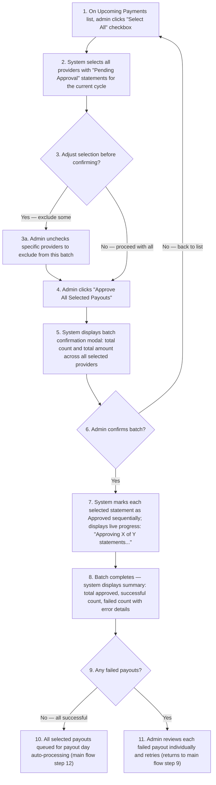
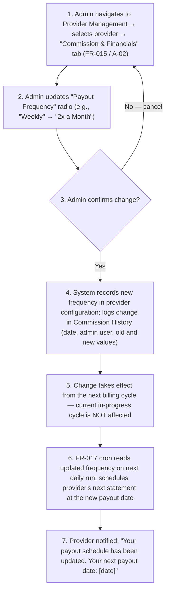
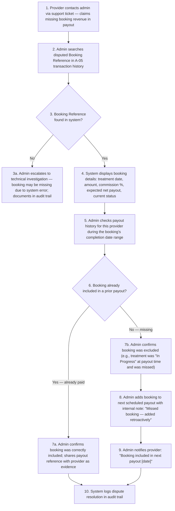
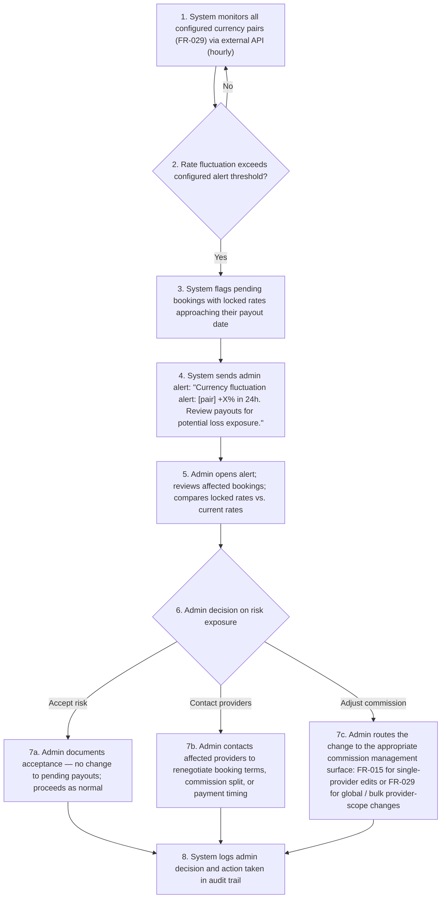

# FR-017 - Admin Billing & Financial Management

**Module**: A-05: Billing & Financial Reconciliation | PR-05: Financial Management & Reporting
**Feature Branch**: `fr017-admin-billing-finance`
**Created**: 2025-11-12
**Status**: ✅ Verified & Approved
**Source**: FR-017 from system-prd.md

---

## Executive Summary

The Admin Billing & Financial Management module provides Hairline administrators with comprehensive tools to manage the platform's financial operations across all stakeholders (patients, providers, and affiliates). This module centralizes transaction monitoring, provider payout processing, discount code management, multi-currency revenue reporting, and financial reconciliation across the three-tenant architecture.

This module serves as the financial control center for the platform, ensuring timely payments, accurate commission calculations, transparent billing, and complete audit trails for all financial transactions. It enables Hairline to scale its medical tourism operations while maintaining financial integrity and regulatory compliance.

**Key Capabilities**:

- View and manage all patient billing and payment transactions
- Process provider payouts with automated commission calculations
- Process affiliate billing and commission payouts using commission outputs from FR-018/A-07
- Track discount code usage and financial impact across bookings (creation owned by FR-019/A-06)
- Generate multi-currency financial reports and analytics
- Reconcile payments across multiple Stripe accounts (account configuration owned by FR-029/A-09)
- Monitor outstanding balances and payment schedules
- Audit all financial transactions with complete traceability

---

## Module Scope

### Multi-Tenant Architecture

- **Patient Platform (P-03)**: Patients initiate payments through booking flow; invoices and receipts generated
- **Provider Platform (PR-05)**: Providers view upcoming payouts, earnings history, and commission structure
- **Admin Platform (A-05)**: Admins manage all financial operations, billing, and reconciliation
- **Shared Services (S-02)**: Payment Processing Service handles Stripe integration and transaction processing

### Multi-Tenant Breakdown

**Patient Platform (P-03: Booking & Payment)**:

- Patients make payments (deposit, installments, final payment) through integrated Stripe checkout
- Patients apply discount codes at checkout
- Payment data flows to admin platform for processing and reconciliation
- **[BACKLOG — Future Phase]** In-app invoice history and receipt viewing for patients: not included in the MVP mobile flow. Patients receive invoices via email (PDF) at payment confirmation; in-app access deferred to a future release.

**Provider Platform (PR-05: Financial Management & Reporting)**:

*Stage 1 — Treatment Earnings Tracking (Provider-visible, per case)*:

- Providers view earnings per completed treatment case (booking-level income visibility)
- Providers view commission structure and breakdown per booking
- Providers can see running total of pending earnings yet to be paid out
- All earnings data is read-only (providers cannot modify financial records)

*Stage 2 — Payout Consolidation & Processing (Admin-initiated, Provider-visible summary)*:

- Admin consolidates all eligible treatment earnings into scheduled payouts (weekly, bi-weekly, or monthly per provider agreement)
- Providers view their upcoming payout schedule and expected payout amounts
- Providers view payout history (completed payouts with itemised breakdown)
- Providers download invoices for completed payouts (PDF, generated after admin processes payout)

**Admin Platform (A-05: Billing & Financial Reconciliation)**:

- **Patient Billing**: View all patient invoices, payment status, process refunds, manage installment plans
- **Provider Billing**: View provider payment schedules, approve/process payouts, reconcile payments, generate invoices
- **Affiliate Billing**: View affiliate commissions, process monthly payouts, track referral revenue
- **Discount Usage & ROI Tracking**: View discount code usage, financial impact, and ROI across bookings — creation and approval managed in FR-019 / A-06: Discount & Promotion Management
- **Financial Reporting**: Generate revenue analytics, commission breakdowns, outstanding balance reports
- **[Not in scope — see FR-029]** Stripe Account Management: Stripe account configuration, regional account mapping, and currency conversion rate setup are owned by FR-029 / A-09: Payment System Configuration. A-05 consumes the configured Stripe accounts for payout execution.
- **Audit & Compliance**: Complete transaction logs, payment reconciliation, dispute resolution

**Shared Services (S-02: Payment Processing Service)**:

- Stripe API integration for payment processing (charges, refunds, transfers)
- Multi-currency payment support with locked exchange rates
- Installment payment scheduling and automated charging
- Commission calculation engine
- Payment retry logic for failed transactions
- Webhook handling for Stripe events (successful payments, failed charges, disputes)

### Communication Structure

**Billing/payout notification events required by FR-017** (FR-017 is the authoritative source for billing events; FR-020 / S-03 handles delivery, channels, and user preferences):

| Event | Recipients | Channel (MVP) | Notes |
|---|---|---|---|
| Payment received / receipt | Patient, Provider (optional), Admin (optional) | Email + Push | Triggered on successful Stripe payment |
| Payment failed | Patient, Admin (optional) | Email + Push | Triggered on failed charge or webhook |
| Payment due reminder (installment / balance) | Patient | Email + Push | Sent 3 days before due date |
| Provider payout processed | Provider, Admin (optional) | Email + Push | Sent after admin confirms payout |
| Affiliate payout processed | Affiliate, Admin (optional) | Email + Push | Sent after monthly affiliate payout |
| Payout failed | Admin (primary), Provider (optional), Affiliate (optional) | Email + Push | Triggered on failed Stripe transfer |
| Outstanding invoice alert | Admin | Email + Push | Internal alert for overdue patient invoices (configurable threshold) |
| Overdue payout alert | Admin | Email + Push | Triggered on payout day when a statement was not approved during the buffer window and was skipped by auto-processing |

**Channels**: Email and in-app push (notification dropdown) for both admin and provider platforms. SMS is deferred to a future phase.

**Admin & Provider notification access**: Both admin and provider have an in-app **notification dropdown** (infinite scroll) in their respective dashboards for push notifications. Admin notification preferences are configurable via FR-030; provider preferences are managed in FR-032 / PR-06.

**Out of Scope**:

- SMS notifications for payment events — **not available in MVP**
- In-app chat for payment disputes (handled by FR-034 / A-10: Support Center & Ticketing)
- Provider-patient direct communication about payments (routed through admin support)
- **In-app invoice history for patients** — **BACKLOG (Future Phase)**: Patient invoice and receipt access within the mobile app is not in MVP scope. Patients receive invoices via email only at this stage.

### Entry Points

**Admin Access**:

- Admin logs into Admin Platform → navigates to "Billing & Finance" section
- Dashboard displays: upcoming payouts, outstanding patient invoices, pending provider payments, affiliate commissions due

**Automated Triggers**:

- Treatment completion triggers provider payout eligibility calculation; eligible earnings are immediately added to the provider's running earnings total
- Scheduled cron job runs daily (e.g., 3 AM UTC) to check each active provider's individual payout schedule (configured in FR-015 / A-02 — Commission & Financials tab); for each provider whose buffer window starts on that day, the system generates a payout statement with status "Pending Approval"; admin notified to review and approve newly generated statements
- Scheduled cron job on payout day (e.g., Friday at 6 AM UTC) auto-processes all statements with status "Approved" — no admin action required on payout day; statements still in "Pending Approval" are marked "Overdue" and admin is notified
- Scheduled cron jobs check for upcoming installment payments (daily at 3 AM UTC)
- Scheduled cron jobs generate monthly affiliate payout summaries at the start of the buffer period before the monthly payout date
- Stripe webhook events (`transfer.created`, `transfer.paid`, `transfer.failed`) trigger real-time payout status updates
- Failed payment events trigger admin alerts and retry mechanisms

**Provider Access**:

- Provider logs into Provider Platform → navigates to "Financial Management" section
- Stage 1 (earnings tracking): Provider sees per-treatment earnings accumulate in real time as treatments complete — this is always visible
- Stage 2 (payout visibility): Provider sees a confirmed payout entry ONLY after admin has approved the payout statement and the Stripe transfer is initiated — providers do NOT see draft statements during the buffer review window
- Providers download invoice PDFs after a payout is fully confirmed (Stripe transfer complete)

---

## Business Workflows

### Main Flow: Provider Payout Processing

**Actors**: Admin, Provider, System (Payment Processing Service), Stripe
**Trigger**: System auto-generates payout statement at start of buffer period; admin reviews and approves during the buffer window; system auto-processes on payout day
**Outcome**: Provider receives payout; invoice generated and sent; transaction logged

> This diagram incorporates the optional note flow, overdue payout path, and payout failure/retry path as decision branches — see Alternative Flows for Bulk Approval (A2), Schedule Change (A3), Dispute Resolution (B2), and Currency Alert (B3).

**Flow Diagram**:

```mermaid
flowchart TD
  S1["1. Daily cron checks each provider's individual payout schedule (FR-015 / A-02)"] --> S2["2. System calculates eligible earnings per provider: completed/aftercare treatments, commission %, net payout amount"]
  S2 --> S3["3. Payout statement created per provider — status &quot;Pending Approval&quot;; dashboard view only, no PDF generated"]
  S3 --> S4["4. System notifies admin via push + email: &quot;X statements ready for review. Payout date: [date]&quot;"]
  S4 --> S5["5. Provider does NOT see the statement — internal to admin review workflow only"]
  S5 --> S6["6. Admin opens Provider Billing → Upcoming Payments list; selects a provider statement"]
  S6 --> S7["7. Admin reviews payout detail: treatment revenue, commission %, net payout, treatment breakdown, bank details"]
  S7 --> S8{"8. Admin needs to add an internal note?"}
  S8 -->|"Yes"| S8A["8a. Admin enters note (max 500 chars) and saves — attached to payout record, not visible to provider"]
  S8 -->|"No"| S9
  S8A --> S9["9. Admin clicks &quot;Approve Payout&quot; — system prompts confirmation: amount, destination (last 4 digits), Yes / No"]
  S9 --> S10{"10. Admin confirms approval?"}
  S10 -->|"No — cancel"| S6
  S10 -->|"Yes"| S11["11. Statement status → &quot;Approved&quot;; admin repeats for remaining providers (or uses Bulk Approval — see A1)"]
  S11 --> S12["12. Payout day cron runs — auto-processes all &quot;Approved&quot; statements; no admin action required on payout day"]
  S12 --> S13{"13. Any statements still in &quot;Pending Approval&quot; on payout day?"}
  S13 -->|"Yes — admin missed buffer window"| S13A["13a. Skipped statements → status &quot;Overdue&quot;; admin notified via push + email"]
  S13A --> S13B["13b. Overdue section surfaces at top of Provider Billing list — admin reviews and approves at any time"]
  S13B --> S9
  S13 -->|"No — all approved"| S14["14. Payout day cron initiates Stripe transfer for each approved statement — status → &quot;Processing&quot;"]
  S14 --> S15["15. Stripe processes transfer (typically 1–2 business days)"]
  S15 --> S16{"16. Stripe webhook received"}
  S16 -->|"transfer.paid"| S17["17. Status → &quot;Paid&quot;; system generates invoice PDF with itemised treatment breakdown"]
  S16 -->|"transfer.failed"| S16A["16a. Status → &quot;Failed&quot;; admin notified: &quot;Payout failed for [Provider Name]&quot;"]
  S16A --> S16B{"16b. Failure cause"}
  S16B -->|"Invalid bank account"| S16C["16c. Admin contacts provider (A-10); provider updates bank details in FR-032 / PR-06 Billing Settings; admin retries payout"]
  S16B -->|"Other Stripe error"| S16D["16d. Admin investigates error; resolves; retries transfer"]
  S16C --> S14
  S16D --> S14
  S17 --> S18["18. System sends email + push notification to provider with invoice attachment"]
  S18 --> S19["19. Provider Financial Management dashboard updates — confirmed payout and invoice download available"]
  S19 --> S20["20. Full transaction logged in audit trail (timestamp, payout amount, provider ID, statement ID)"]
```

### Alternative Flows

**A1: Bulk Payout Processing (Multiple Providers)**

- **Trigger**: Admin wants to approve all pending statements at once rather than one by one
- **Outcome**: Batch of payouts approved and queued; failed transactions flagged individually for retry
- **Flow Diagram**:

**A2: Provider Payment Schedule Change**

- **Trigger**: Admin updates an individual provider's payout frequency via Provider Management (FR-015 / A-02)
- **Outcome**: Provider payout frequency updated in FR-015 / A-02; FR-017 cron recalibrated for this provider on next run; change logged in Commission History
- **Flow Diagram**:

**B1: Provider Disputes Payout Amount**

- **Trigger**: Provider claims missing booking revenue in their payout calculation
- **Outcome**: Dispute resolved — either booking is confirmed as paid or added to next payout; provider notified; audit trail updated
- **Flow Diagram**:

**B2: Currency Conversion Rate Protection Triggers Alert**

- **Trigger**: System detects exchange rate fluctuation on any monitored currency pair (configured in FR-029 / A-09) exceeding the configured alert threshold
- **Outcome**: Admin alerted to currency risk; decision documented in audit trail; affected payouts reviewed
- **Flow Diagram**:

---

## Screen Specifications

> **Tenant scope**:
>
> - **Admin Platform (A-05)**: Screens 1–8 below. Core billing management for providers, patients, affiliates, financial reporting, investigation, and audit workflows.
> - **Provider Platform (PR-05)**: Screens 9–10 below. Provider-facing read-only views for earnings tracking (Stage 1) and confirmed payout history (Stage 2). FR-017 defines the screen specs since it owns the financial data model; FR-032 provides the provider dashboard navigation shell.
> - **Patient Platform**: No patient-facing billing screens in this FR. Patient payment initiation (deposit, installments, final payment) is owned by FR-007: Payment Processing. Patient-facing invoice history is **[BACKLOG — Future Phase]**.
> - **Affiliate Platform**: No affiliate-facing screens in this FR. Affiliates view their commission earnings via a read-only dashboard in FR-018 (A-07: Affiliate Program Management). FR-017 Screen 6 is the admin-side view for processing affiliate payouts only.

---

### Admin Platform Screens (A-05)

**Role-Based Action Visibility**:

- **Billing Admin** and **Super Admin** can view all admin financial screens and execute payout approvals, retries, refunds, overrides, and bulk actions
- **Billing Viewer** can access the same screens in read-only mode, but selection checkboxes, money-moving buttons, retry buttons, override buttons, and confirmation modals are hidden
- Any action that moves money or changes a financial status MUST invoke the financial re-authentication step before the final confirm action is enabled

#### Screen 1: Financial Reporting - Revenue Dashboard

**Purpose**: Executive overview of platform financial performance with filterable analytics

**Data Fields**:

| Field Name | Type | Required | Description | Validation Rules |
|------------|------|----------|-------------|------------------|
| Date Range Selector | daterange | Yes | Filter reports by date range | Default: Last 30 days |
| Currency Selector | select | Yes | View amounts in selected currency | Default: system default currency from FR-029 Screen 6 (USD in MVP seed) |
| Total Revenue | currency (large) | Yes | Sum of all patient payments | Auto-calculated |
| Platform Commission | currency | Yes | Total Hairline commission earned | Auto-calculated |
| Provider Payouts | currency | Yes | Total paid to providers | Auto-calculated |
| Affiliate Payouts | currency | Yes | Total paid to affiliates | Auto-calculated |
| At Risk Invoice Count | number | Yes | Count of invoices currently in "At Risk" status | Auto-calculated |
| Failed Payout Count | number | Yes | Count of provider + affiliate payouts currently in "Failed" status | Auto-calculated |
| Active Currency Alerts | number | Yes | Count of unacknowledged currency fluctuation alerts. Clicking opens the notification list filtered to unresolved currency alerts; each alert links to Screen 8. Displays "0" when no active alerts (badge hidden at zero) | Auto-calculated from alert state in FR-029 |
| Refund Trend | chart | Yes | Time-series view of refund amount and refund count across the selected period | Interactive line/bar chart |
| Outstanding Patient Invoices | currency | Yes | Pending patient payments (total). Clicking this KPI opens an aging breakdown panel: 0–30 days overdue, 31–60 days overdue, 60+ days overdue — each showing count and total amount | Auto-calculated |
| Overdue Aging Breakdown | panel | Yes | Drill-down from Outstanding Patient Invoices KPI: three buckets (0–30 days, 31–60 days, 60+ days) each showing invoice count and total outstanding amount. "At Risk" invoices shown as a separate row | Visible on click of KPI |
| Pending Provider Payouts | currency | Yes | Provider earnings awaiting payout | Auto-calculated |
| Affiliate Payout Status Summary | table | Yes | Summary counts and totals grouped by affiliate payout status: Pending, Processing, Paid, Failed | Sortable table |
| Revenue by Country | chart | Yes | Geographic breakdown of patient bookings | Interactive pie/bar chart |
| Revenue by Treatment Type | chart | Yes | Breakdown by FUE, FUT, DHI, etc. | Interactive bar chart |
| Revenue Trend | chart | Yes | Line chart showing revenue over time | Interactive time series |
| Top Providers by Revenue | table | Yes | Highest-earning providers | Sortable table |
| Discount Usage | table | Yes | Most-used discount codes with ROI | Sortable table |
| Conversion Rate | percentage | Yes | (Bookings / Inquiries) × 100. Inquiries count sourced from FR-003 / P-02: Quote Request & Management. | Display: X.X% |

**Business Rules**:

- All currency amounts displayed in selected currency (with real-time conversion if multi-currency)
- Currency selector initializes to the system default currency configured in FR-029 / A-09 Currency Management; MVP environments seed this default to USD unless an admin changes it later
- "Active Currency Alerts" count reflects alerts triggered by FR-029 / A-09 rate monitoring that have not yet had a decision recorded via Screen 8; count resets to 0 once all active alerts have a confirmed admin decision
- "Outstanding Patient Invoices" includes ONLY invoices with status "Pending", "Partial", "Overdue", or "At Risk"
- Overdue aging buckets calculated from the invoice Due Date to today: 0–30 days, 31–60 days, 60+ days; "At Risk" (all retries exhausted) shown as a separate row regardless of age
- "Pending Provider Payouts" includes treatments with status "Completed" or "Aftercare" not yet paid
- "Failed Payout Count" includes both provider payouts and affiliate payouts currently awaiting retry or manual resolution
- Revenue by Country based on patient location (not provider location)
- Revenue by Treatment Type excludes refunded bookings
- Refund Trend includes full and partial refunds and supports drill-down into Screen 4a
- Top Providers table sortable by: revenue, booking count, average booking value
- Discount Usage table shows: code name, times used, total discount amount, estimated ROI (bookings generated vs. discount cost)
- Charts interactive: clicking segment filters dashboard to that subset (e.g., click "Turkey" → filters to Turkey bookings)

**Notes**:

- Provide "Export Full Report" button to download PDF/CSV with all dashboard data
- Support comparison mode: "Compare to previous period" (e.g., last 30 days vs. previous 30 days)
- Display warning icons for anomalies: sudden revenue drop, high refund rate, unusual currency fluctuations

---

#### Screen 2: Provider Billing - Upcoming Payments List

**Purpose**: Display all providers with earnings awaiting payout, grouped by payment schedule

**Data Fields**:

| Field Name | Type | Required | Description | Validation Rules |
|------------|------|----------|-------------|------------------|
| Select | checkbox | Conditional | Row selection for batch payout approval | Enabled ONLY for Billing Admin / Super Admin when Status = "Pending Approval" or "Overdue" and Payout Readiness = "Ready" |
| Provider Name | text | Yes | Clinic/provider name | Display only |
| Provider ID | text | Yes | Unique provider identifier (e.g., "HP-PRV-00123") | Display only |
| Payout Reference | text | Yes | Unique payout statement reference (e.g., "PST-HP-PRV-00123-2026-04-W1") | Display only |
| Payment Schedule | badge | Yes | Provider's individual payout frequency: "Weekly", "2x a Month", or "Monthly" (configured in FR-015 / A-02) | Display only |
| Next Payout Date | date | Yes | Scheduled payout date for this provider, derived from their individual payout frequency configured in FR-015 / A-02 | Format: DD-MM-YYYY |
| Outstanding Earnings | currency | Yes | Total revenue pending payout | Format: £X,XXX.XX |
| Commission | text | Yes | Effective commission snapshot for the bookings in this statement. Source: provider-specific commission configuration managed in FR-015 / A-02 or FR-029 / A-09 when defined; otherwise the FR-029 / A-09 global default captured at booking confirmation | Display: 15% or £150 Flat |
| Net Payout | currency | Yes | Provider payout after commission | Auto-calculated |
| Bank Account | text | Yes | Bank account last 4 digits (masked) | Display: ****1234 |
| Payout Readiness | badge | Yes | Indicates whether the statement can be approved: "Ready", "Missing Bank Details", "Invalid Bank Details", "Manual Review Required" | Color-coded |
| Status | badge | Yes | "Pending Approval", "Approved", "Processing", "Paid", "Failed", "Overdue", "Voided" | Color-coded |
| Blocked Reason | text | Conditional | Explanation shown when payout approval is unavailable | Visible when Payout Readiness is not "Ready" |
| Actions | buttons | Yes | "View Details", "Approve Payout", "Unapprove", "Void Statement", "Add Note", "Retry Payout" | Conditional visibility |

**Batch Approval Toolbar** (shown when one or more rows are selected):

| Element | Description |
|---------|-------------|
| Selected Statements | Count of currently selected payout statements |
| Selected Net Total | Sum of Net Payout across selected rows |
| Approve All Selected Payouts | Opens batch confirmation modal |
| Clear Selection | Removes all current row selections |

**Business Rules**:

- Providers appear in list ONLY if a payout statement has been auto-generated for them (i.e., the buffer period for their individual schedule has started)
- Each provider has their own payout frequency (Weekly, 2x a Month, or Monthly) configured in FR-015 / A-02 — Commission & Financials tab; there is no single platform-wide schedule
- Payout statement auto-generated at start of buffer window based on each provider's individual payout schedule (read from FR-015 / A-02); only then does the provider appear in this list
- Payout amount MUST include all treatments with status "Completed" or "Aftercare" completed since the last payout cycle
- Treatments with status "Scheduled", "In Progress", or "Cancelled" are NOT included
- Providers with status "Suspended" or "Deactivated" do NOT have statements generated
- Commission shown in this list comes from the booking-time snapshot: provider-specific commission configuration managed in FR-015 / A-02 or FR-029 / A-09 when defined, otherwise the FR-029 / A-09 global default; supported models are Percentage and Flat Rate where applicable
- Bank account details shown ONLY if provider has a valid bank account on file in FR-032 Billing Settings
- Statements with missing or invalid bank details remain visible in the list for operational follow-up, but Payout Readiness is not "Ready" and approval controls remain disabled until the provider updates payout details in FR-032 / PR-06
- "Approve Payout" button enabled ONLY for statements with status "Pending Approval" or "Overdue"
- "Retry Payout" button enabled ONLY for statements with status "Failed"; clicking it re-initiates the Stripe transfer for that statement; retry is logged in audit trail with admin ID, timestamp, and failure reason from prior attempt
- "Unapprove" button enabled ONLY for statements with status "Approved" and ONLY before the payout-day cron runs (i.e., the payout date has not yet been reached); on click, admin must enter a mandatory reason (max 500 chars); statement reverts to "Pending Approval"; action logged in audit trail with action_type "Payout Unapproved"
- "Void Statement" button enabled ONLY for statements with status "Pending Approval" or "Overdue"; on click, admin must enter a mandatory reason (max 500 chars); statement is marked "Voided" and permanently removed from auto-processing; action logged with action_type "Payout Voided"; a new statement can be re-generated on the next payout cycle; voided statements remain visible in list with "Voided" status badge for audit history
- "Add Note" button available for all statements at any status (for audit documentation)
- Batch selection is allowed ONLY for statements with Status = "Pending Approval" or "Overdue" and Payout Readiness = "Ready"
- Clicking "Approve All Selected Payouts" opens a batch confirmation modal showing selected count, total net payout amount, and a financial re-authentication challenge; confirm remains disabled until re-authentication succeeds
- After batch approval, the UI MUST show a batch result summary with: total selected, total approved, total failed, and error details per failed statement
- Statements with status "Overdue" are surfaced at the top of the list in a dedicated "Overdue" section
- Statements with status "Failed" are surfaced in a dedicated "Failed" section below "Overdue", above "Upcoming / Pending Approval"

**Notes**:

- List is divided into three sections: **Overdue** (top, highlighted), **Failed** (below Overdue, highlighted in red), and **Upcoming / Pending Approval** (below)
- List should support filtering by: status, payment schedule, date range, provider name/ID
- List should support sorting by: payout date, net payout amount (ascending/descending)
- Export to CSV functionality for batch processing and accounting reconciliation

---

#### Screen 3: Provider Payout Detail Modal

**Purpose**: Display itemized breakdown of provider payout with treatment-level details

**Data Fields**:

| Field Name | Type | Required | Description | Validation Rules |
|------------|------|----------|-------------|------------------|
| Provider Name | text | Yes | Clinic name | Display only |
| Provider ID | text | Yes | Unique provider identifier | Display only |
| Payout Reference | text | Yes | Unique payout statement reference | Display only |
| Statement Status | badge | Yes | "Pending Approval", "Approved", "Overdue", "Processing", "Paid", "Failed", "Voided" | Color-coded |
| Payout Period | daterange | Yes | Date range covered by payout | Format: DD-MM-YYYY to DD-MM-YYYY |
| Payout Readiness | badge | Yes | Indicates whether approval can proceed: "Ready", "Missing Bank Details", "Invalid Bank Details", "Manual Review Required" | Color-coded |
| Blocked Reason | text | Conditional | Reason the statement cannot currently be approved or retried | Visible when Payout Readiness is not "Ready" or Statement Status = "Failed" |
| Bank Account | text | Yes | Destination bank account (masked) | Display: ****1234 |
| Treatment List | table | Yes | Itemized list of included bookings | See sub-table below |
| Payout Adjustments | table | Conditional | Non-treatment deductions or credits applied to this payout, including refund deductions carried from previously paid bookings | See adjustment sub-table below; visible only when adjustments exist |
| Total Revenue | currency | Yes | Sum of treatment amounts | Auto-calculated |
| Commission Configuration | text | Yes | Platform commission model/value applied to this payout | Display: 15% or £150 Flat |
| Commission Amount | currency | Yes | Commission deducted | Auto-calculated |
| Net Payout | currency | Yes | Provider receives this amount | Auto-calculated |
| Approved By | text | Conditional | Admin who approved the statement | Visible once status is "Approved", "Processing", "Paid", or "Failed" |
| Approved At | datetime | Conditional | Date/time the statement was approved | Format: DD-MM-YYYY HH:MM:SS UTC |
| Processed At | datetime | Conditional | Date/time Stripe transfer was initiated | Visible once status is "Processing", "Paid", or "Failed" |
| Stripe Transfer ID | text | Conditional | Stripe transfer reference for reconciliation | Visible once Stripe transfer has been created |
| Failure Reason | text | Conditional | Human-readable reason for transfer failure or manual review block | Visible when status is "Failed" or retry is blocked |
| Internal Notes | textarea | No | Admin notes (not visible to provider) | Max 500 characters |

**Treatment List Sub-Table** (nested within payout detail):

| Field Name | Type | Required | Description | Validation Rules |
|------------|------|----------|-------------|------------------|
| Booking Reference | text | Yes | Unique booking reference (e.g., "HPID2511234") | Clickable link |
| Patient Name | text | Yes | Full patient name (revealed post-payment) | Display only |
| Treatment Date | date | Yes | Date treatment was performed | Format: DD-MM-YYYY |
| Treatment Type | text | Yes | FUE, FUT, DHI, etc. | Display only |
| Treatment Amount | currency | Yes | Total booking amount (inc. packages) | Display only |
| Commission Deducted | currency | Yes | Commission withheld for this treatment | Auto-calculated |
| Net Contribution | currency | Yes | Net payout contribution from this treatment | Auto-calculated |
| Currency | text | Yes | Original booking currency | Display: GBP, EUR, USD, etc. |
| Exchange Rate | number | No | Locked rate at booking time (if multi-currency) | Display: 1 GBP = 1.17 EUR |
| Status | badge | Yes | "Completed", "Aftercare" | Color-coded |

**Payout Adjustments Sub-Table** (nested within payout detail, shown only when adjustments exist):

| Field Name | Type | Required | Description | Validation Rules |
|------------|------|----------|-------------|------------------|
| Adjustment Type | badge | Yes | "Refund Deduction" or "Carry-Forward Adjustment" | Color-coded |
| Booking Reference | text | Yes | Original booking tied to the adjustment | Clickable link |
| Effective Date | date | Yes | Date the adjustment first applied to a payout statement | Format: DD-MM-YYYY |
| Description | text | Yes | Provider-visible label shown on the payout statement | Display only; format example: "Adjustment: Refund deducted — [Booking Reference] — [Date]" |
| Adjustment Amount | currency | Yes | Deduction or credit applied in the current payout cycle | Display only; negative values allowed |
| Remaining Balance | currency | Conditional | Outstanding adjustment balance that will carry into a later payout cycle | Visible only when current payout does not fully absorb the adjustment |
| Status | badge | Yes | "Applied" or "Carried Forward" | Color-coded |

**Business Rules**:

- Payout MUST include ALL treatments with status "Completed" or "Aftercare" within the payout period
- Payout period determined by provider's payment schedule (read from FR-015 / A-02):
  - **Weekly**: Monday to Sunday of the preceding week
  - **2x a Month**: Either 1st–15th or 16th–last day of the preceding month period
  - **Monthly**: Full preceding calendar month
- The commission model/value for each included booking comes from the booking-time snapshot: provider-specific commission configuration managed in FR-015 / A-02 or FR-029 / A-09 when defined, otherwise the FR-029 / A-09 global default
- If provider commission model is Percentage, the percentage calculation is applied AFTER currency conversion (if applicable)
- If provider commission model is Flat Rate, the configured fixed deduction from FR-015 / A-02 is applied per completed procedure included in the payout
- Exchange rates locked at time of patient booking acceptance (no fluctuation risk to provider during payout)
- If a patient refund is processed AFTER the provider has already been paid, the next provider payout statement MUST include a row in `Payout Adjustments` labelled `Adjustment: Refund deducted — [Booking Reference] — [Date]`
- If a refund deduction exceeds the provider's current payout amount, the unapplied balance remains visible in `Remaining Balance` and carries forward to the next payout cycle until fully recovered
- Internal notes visible ONLY to admins (never exposed to provider)
- "Approve Payout" is enabled ONLY when Payout Readiness = "Ready", the user role is Billing Admin or Super Admin, and financial re-authentication succeeds
- "Approve Payout" button marks the statement as "Approved" and queues it for the payout-day cron; Stripe transfer is not initiated during the buffer review action
- On payout day, the cron initiates Stripe transfer for all statements already in "Approved" status; status changes to "Processing" → "Paid" after Stripe confirmation webhook
- Stripe Transfer ID remains blank until Stripe confirms `transfer.created`; failure reason remains blank unless Stripe or validation returns a blocking error

**Batch Approval Confirmation Modal** (appears when admin clicks "Approve All Selected Payouts" in Screen 2):

| Element | Description |
|---------|-------------|
| Summary line | "Approve payouts for [count] providers totalling [total net payout]?" |
| Selected count | Number of payout statements included in this batch |
| Selected net total | Combined net payout amount across all selected statements |
| Warning | "Each provider's payout destination was last validated in FR-032 Billing Settings. Confirm all details are correct before proceeding." |
| Re-authentication | Password re-entry in MVP; MFA challenge after FR-026 / FR-031. Confirm remains disabled until re-authentication succeeds |
| Confirm button | "Yes, Approve All" — marks all selected statements as "Approved" sequentially; displays live progress: "Approving X of Y statements..." |
| Cancel button | "No, Cancel" — returns to list with no changes |
| Result Summary | Displayed after processing completes: "Approved: X / Failed: Y". Failed entries show provider name and error reason. Failed statements remain in "Pending Approval" for individual retry |

**Approve Confirmation Modal** (appears when admin clicks "Approve Payout"):

| Element | Description |
|---------|-------------|
| Summary line | "Approve payout of [Net Payout amount] to [Provider Name]?" |
| Destination | "Bank account ending in [last 4 digits]" |
| Re-authentication | Password re-entry field in MVP. After FR-026 / FR-031 shared MFA rollout, this is replaced by MFA challenge verification |
| Confirm button | "Yes, Approve" — marks statement "Approved". Enabled ONLY after successful re-authentication |
| Cancel button | "No, Cancel" — returns to payout detail without change |

**Retry Payout Confirmation Modal** (appears when admin retries a failed payout):

| Element | Description |
|---------|-------------|
| Summary line | "Retry payout of [Net Payout amount] to [Provider Name]?" |
| Failure context | Shows prior failure reason and the current payout readiness state |
| Destination | "Bank account ending in [last 4 digits]" |
| Re-authentication | Password re-entry field in MVP; MFA challenge after shared MFA rollout |
| Confirm button | "Yes, Retry Payout" — re-initiates Stripe transfer after successful re-authentication |
| Cancel button | "No, Cancel" — closes modal with no action |

**Notes**:

- Clicking on "Booking Reference" opens booking detail view in A-01: Patient Management & Oversight
- Provide "Download Detailed Report" button to export payout breakdown as PDF for provider records
- Highlight any bookings with special conditions (refunds, partial payments) with warning icon

---

#### Screen 4: Patient Billing - Invoice Management

**Purpose**: Admin view of all patient invoices with filtering, search, and bulk actions

**Data Fields**:

| Field Name | Type | Required | Description | Validation Rules |
|------------|------|----------|-------------|------------------|
| Invoice Number | text | Yes | Unique invoice ID (e.g., "INV-2511-00456") | Clickable link |
| Patient Name | text | Yes | Full patient name | Searchable |
| Patient ID | text | Yes | Unique patient identifier (e.g., "HP-PAT-00789") | Clickable link |
| Booking Reference | text | Yes | Associated booking reference | Clickable link |
| Invoice Date | date | Yes | Date invoice generated | Format: DD-MM-YYYY |
| Due Date | date | Yes | Payment due date. Derived from FR-007B installment schedule (if installment plan) or booking confirmation terms (if full/deposit payment — 7 days before treatment date per Payment Rule 2) | Format: DD-MM-YYYY |
| Total Amount | currency | Yes | Total invoice amount | Display: £X,XXX.XX |
| Amount Paid | currency | Yes | Amount paid so far (for installment plans) | Display: £X,XXX.XX |
| Outstanding Balance | currency | Yes | Remaining amount due | Auto-calculated |
| Currency | text | Yes | Invoice currency | Display: GBP, EUR, USD, etc. |
| Payment Status | badge | Yes | "Pending", "Partial", "Paid", "Overdue", "Refunded", "At Risk" | Color-coded. "At Risk" = all installment retries exhausted, booking requires admin intervention |
| Payment Method | text | Yes | Masked Stripe payment method | Display: "Visa ending in 1234", "Mastercard ending in 5678", or masked bank transfer reference |
| Installment Plan | badge | No | Installment progress with retry indicator (if applicable): "2/5 installments paid" or "2/5 — Retry 2/3 in progress" if a payment is currently in retry | Display format |
| Actions | buttons | Yes | "View Details", "Send Reminder", "Process Refund", "Download Invoice", "Override Status" | Conditional |

**Send Reminder Confirmation Modal** (appears when admin clicks "Send Reminder" on Screen 4 or Screen 4a):

| Element | Description |
|---------|-------------|
| Summary line | "Send payment reminder to [Patient Name]?" |
| Invoice reference | Invoice Number and Outstanding Balance shown for context |
| Reminder Type | Auto-selected based on invoice status: "Upcoming Due Reminder" (Pending), "Overdue Reminder" (Overdue), "At Risk — Final Notice" (At Risk). Display-only; not editable by admin |
| Channel | "Via: Email + Push Notification" — display only |
| Confirm button | "Yes, Send Reminder" — triggers FR-020 notification event; creates entry in Reminder History |
| Cancel button | "No, Cancel" — dismisses modal with no action |

**Business Rules** (Send Reminder):

- Reminder content and template are determined by FR-020 / S-03 based on the reminder type; admin cannot customize the message text
- On confirm: FR-020 notification event is triggered; Reminder History table on Screen 4a is updated with: type, channel, sent timestamp, delivery status
- Admin sees a success toast: "Reminder sent to [Patient Name]" (or an error toast if FR-020 returns a failure)
- Sending a manual reminder does NOT reset or interfere with any automated reminder schedule

**Business Rules**:

- Invoice generated automatically when patient completes booking payment (deposit or full)
- Invoices with installment plans display: "X of Y installments paid"
- "Overdue" status triggered if outstanding balance remains 7 days after due date
- **"At Risk" status** triggered when all 3 retry attempts for any installment have failed; booking is flagged for admin review. Admin MUST manually follow up with patient (contact via support, update payment method, or cancel booking)
- "Send Reminder" button available ONLY for invoices with status "Pending", "Overdue", or "At Risk"
- "Process Refund" button available ONLY for invoices with status "Paid" or "Partial"
- Refunds require admin to enter mandatory reason (max 500 characters) and follow cancellation policy (FR-006: Booking & Scheduling); see Screen 4b: Refund Confirmation Modal
- Clicking "Download Invoice" generates PDF with Hairline branding, itemized breakdown, and payment instructions
- Clicking "View Details" opens Screen 4a: Patient Invoice Detail
- **Manual Payment Status Override**: Admin can manually override a payment status when the Stripe webhook fails, is delayed, or when an off-system payment adjustment is needed
  - "Override Status" button available for ANY invoice (all statuses)
  - On click: admin selects new status from dropdown ("Pending", "Partial", "Paid", "Overdue", "Refunded", "At Risk"), enters mandatory reason (free text, max 500 characters), and confirms
  - Override is logged to audit trail with: admin ID, timestamp, previous status, new status, reason entered
  - Overridden invoices display a warning badge: "Status manually adjusted — [date]" visible to admins only
  - Override does NOT automatically trigger Stripe refund or charge — admin is responsible for ensuring any off-system action is completed separately
  - "Override Status" REQUIRES financial re-authentication (password re-entry in MVP; MFA challenge after FR-026 / FR-031) before the Confirm button is enabled — consistent with the module-level RBAC rule that all actions changing a financial status require re-authentication

**Notes**:

- Implement advanced filtering: date range, payment status, currency, installment vs. full payment, patient name/ID
- Support bulk actions: "Send reminders to all overdue invoices", "Export selected invoices to CSV"
- Display warning icon for installments with upcoming payment dates (within 7 days)
- "At Risk" invoices surfaced at top of list in a dedicated section, similar to Overdue pattern in Screen 2

---

#### Screen 4a: Patient Invoice Detail

**Purpose**: Full detail view of a single patient invoice, opened when admin clicks "View Details" on Screen 4. Shows complete payment history, installment schedule with retry state, refund history, and applied discount.

**Invoice Header** (read-only summary):

| Field Name | Type | Description |
|------------|------|-------------|
| Invoice Number | text | Unique invoice ID |
| Patient Name | text | Full name (post-payment reveal) |
| Patient ID | text | Clickable link to patient record in A-01 |
| Booking Reference | text | Clickable link to booking record in A-01 |
| Invoice Date | date | Date invoice was generated |
| Currency | text | Invoice currency |
| Total Amount | currency | Full invoice amount |
| Adjusted Total After Refund | currency | Updated invoice total after any completed partial refund. Hidden if no refund adjustment exists |
| Outstanding Balance | currency | Remaining unpaid amount (auto-calculated) |
| Payment Status | badge | Current status (including "At Risk") |
| Discount Code Applied | text | Discount code used at checkout (if any); display code + type (e.g., "SUMMER25 — Platform-Wide 10%"); links to FR-019 detail. "None" if no discount applied |

**Payment History Table**:

| Field Name | Type | Description |
|------------|------|-------------|
| Payment # | number | Sequential payment number (e.g., 1 = deposit, 2 = installment 1, etc.) |
| Payment Type | badge | "Deposit", "Installment", "Final Payment" |
| Scheduled Date | date | Date payment was due |
| Paid Date | date | Date payment was actually received (blank if unpaid) |
| Amount | currency | Payment amount |
| Method | text | Stripe payment method (masked, e.g., "Visa ending in 1234") |
| Stripe Payment Intent ID | text | Stripe payment or charge reference for reconciliation. Hidden until created |
| Status | badge | "Paid", "Pending", "Failed", "Scheduled" |

**Installment Schedule Table** (shown only if invoice has an installment plan):

| Field Name | Type | Description |
|------------|------|-------------|
| Installment # | number | e.g., "1 of 5" |
| Scheduled Date | date | Date installment is due |
| Amount | currency | Installment amount |
| Status | badge | "Pending", "Paid", "Failed" |
| Retry Count | text | Number of retry attempts made (e.g., "2 of 3 retries used"). Hidden if status is "Paid" |
| Next Retry Date | date | Date of next automatic retry attempt (shown only if status is "Failed" and retries remain) |
| Paid Date | date | Date payment succeeded (shown only if status is "Paid") |

**Refund History Table** (shown only if any refunds exist on this invoice):

| Field Name | Type | Description |
|------------|------|-------------|
| Refund Date | date | Date refund was processed |
| Refund Amount | currency | Amount refunded |
| Refund Type | badge | "Full Refund" or "Partial Refund" |
| Reason | text | Mandatory reason entered by admin at time of refund |
| Processed By | text | Admin ID who processed the refund |
| Stripe Refund ID | text | Stripe reference ID for the refund |
| Status | badge | "Processing" or "Completed" |

**Reminder History Table** (shown only if at least one reminder has been sent):

| Field Name | Type | Description |
|------------|------|-------------|
| Reminder Type | badge | "Upcoming Due", "Overdue", or "Manual Reminder" |
| Channel | text | Email / Push |
| Sent At | datetime | Date/time reminder was sent |
| Delivery Status | badge | "Sent", "Failed", or "Pending" |

**Status Override History Table** (shown only if the invoice has been manually overridden):

| Field Name | Type | Description |
|------------|------|-------------|
| Override Date | datetime | Date/time the override was applied |
| Previous Status | badge | Invoice status before override |
| New Status | badge | Invoice status after override |
| Reason | text | Mandatory reason entered by admin |
| Admin | text | Admin ID who applied the override |

**Actions** (same as Screen 4, available from this detail view):

- Send Reminder (if status is "Pending", "Overdue", or "At Risk")
- Process Refund → opens Screen 4b (if status is "Paid" or "Partial")
- Download Invoice
- Override Status
- Close (returns to Screen 4 list)

**Business Rules**:

- All data on this screen is read-only except via action buttons
- Installment Schedule Table visible ONLY if `installment_plan_id` is set on the invoice
- Refund History Table visible ONLY if at least one refund exists for this invoice
- Reminder History Table visible ONLY if at least one automated or manual reminder event exists for this invoice
- Status Override History Table visible ONLY if at least one manual override has been applied
- "At Risk" invoices display a prominent warning banner at the top of the detail view: "All payment retries have been exhausted. Please contact the patient to resolve."
- Discount Code Applied: if no discount was used, display "None — no discount applied"

---

#### Screen 4b: Refund Confirmation Modal

**Purpose**: Presented when admin clicks "Process Refund" on Screen 4 or Screen 4a. Displays calculated refund amount per cancellation policy, requires mandatory reason before confirming.

**Data Fields**:

| Field Name | Type | Description |
|------------|------|-------------|
| Invoice Number | text | Read-only. Invoice being refunded |
| Patient Name | text | Read-only |
| Booking Reference | text | Read-only |
| Treatment Date | date | Read-only. Date of scheduled/completed treatment |
| Days Until/Since Treatment | number | Read-only. Calculated from today; used to determine applicable policy tier |
| Cancellation Policy Applied | text | Read-only. Auto-selected tier: ">30 days — 90% refund", "15–30 days — 50% refund", or "<15 days — 0% refund (non-refundable)" |
| Original Invoice Amount | currency | Read-only. Full invoice total |
| Calculated Refund Amount | currency | Read-only. Auto-calculated baseline refund amount from policy |
| Adjusted Refund Amount | currency | Editable only when a partial or manually adjusted refund is permitted. Defaults to the Calculated Refund Amount |
| Final Refund Amount | currency | Read-only preview of the amount that will actually be sent to Stripe after any allowed adjustment |
| Non-Refundable Amount | currency | Read-only. Auto-calculated: invoice amount − Final Refund Amount. Labelled "Platform fee (non-refundable)" |
| Reason | textarea | **Mandatory**. Admin must enter reason before confirming. Max 500 characters. Placeholder: "Enter reason for refund (required)" |
| Adjustment Justification | textarea | Mandatory ONLY if Adjusted Refund Amount differs from Calculated Refund Amount. Max 500 characters |
| Re-authentication | secure input | Password re-entry in MVP; replaced by MFA challenge after FR-026 / FR-031 |
| Confirm Refund button | button | Enabled ONLY after required text fields are completed and re-authentication succeeds. Label: "Confirm Refund of [amount]" |
| Cancel button | button | Dismisses modal; no action taken |

**Business Rules**:

- Modal auto-calculates refund amount using cancellation policy from FR-006 based on days until treatment at time admin opens the modal
- Adjusted Refund Amount defaults to Calculated Refund Amount
- Adjusted Refund Amount can be changed ONLY for eligible partial or discretionary pre-treatment refunds; if changed, Adjustment Justification becomes mandatory
- "Confirm Refund" button is disabled until the Reason field contains at least 1 character, any required Adjustment Justification is provided, and re-authentication succeeds
- On confirm: Stripe refund API call is initiated; status changes to "Processing"; audit trail entry created with: admin ID, timestamp, invoice ID, refund amount, reason, before/after payment status
- If treatment date has already passed (treatment completed), the <15 days tier applies (0% refund) — admin sees "0% refund — treatment has been completed" and the Confirm button is disabled; admin must use Override Status instead if a discretionary refund is needed
- Partial refunds (e.g., cancelling add-on packages only) use the same modal; the pre-calculated amount can be manually adjusted by admin with mandatory justification in the Adjustment Justification field

---

#### Screen 5: Discount Usage Overview

> **Note — Ownership Boundary**: Discount code *creation, editing, approval workflow, and lifecycle management* are fully defined in **FR-019 / A-06: Discount & Promotion Management** (Screen 1). This screen is not reproduced here to avoid duplication. A-05 is a consumer of discount data, not its owner.

**Purpose**: Admin view of discount code usage and financial impact, surfaced within the Billing & Finance context for reconciliation purposes. Read-only; no discount creation or editing from this screen.

**Data Fields**:

| Field Name | Type | Required | Description | Validation Rules |
|------------|------|----------|-------------|------------------|
| Discount Code | text | Yes | Code identifier (e.g., "SUMMER25") | Display only; links to FR-019 detail |
| Discount Name | text | Yes | Internal campaign name | Display only |
| Type | badge | Yes | Platform-Wide / Provider-Specific / Affiliate | Display only |
| Times Used | number | Yes | Total bookings where discount applied | Display only |
| Total Discount Amount | currency | Yes | Cumulative discount value granted | Display only |
| Hairline Cost | currency | Yes | Portion absorbed by platform commission | Display only |
| Provider Cost | currency | Conditional | Portion absorbed by provider (if Both Fees) | Display only |
| Revenue Generated | currency | Yes | Total booking revenue attributed to this code | Display only |
| Active Window | daterange | Yes | Valid From — Valid Until | Display only |
| Status | badge | Yes | Active / Expired / Disabled | Display only |

**Business Rules**:

- This screen is **read-only**; all discount management actions route to FR-019 / A-06
- Data here is derived from booking and invoice records; no source-of-truth discount records are stored in A-05
- "Hairline Cost" and "Provider Cost" splits reflect the fee allocation defined in FR-019 at creation time

**Notes**:

- "View in A-06" deep-link on each row opens the discount's management page in FR-019
- Used primarily for financial reconciliation: confirming discount costs align with commission calculations
- Implement filtering by: Status (Active / Expired / Disabled), Discount Type (Platform-Wide / Provider-Specific / Affiliate), and Active Window date range (codes valid within a given period)
- Support free-text search by discount code or campaign name
- Export to CSV button for finance reconciliation (includes all visible columns for the filtered result set)

---

#### Screen 6: Affiliate Billing - Commission Payouts

> **Ownership Boundary**: Affiliate onboarding, affiliate profile management, referral tracking, discount code assignment, and commission calculation are owned by **FR-018 (A-07: Affiliate Program Management)**. Affiliate billing and payout execution remain owned by **FR-017 / A-05**. This screen processes the monthly affiliate payouts using commission amounts calculated in FR-018.

**Purpose**: Process monthly affiliate billing and commission payouts based on referral earnings calculated in FR-018

**Data Fields**:

| Field Name | Type | Required | Description | Validation Rules |
|------------|------|----------|-------------|------------------|
| Select | checkbox | Conditional | Row selection for bulk payout processing | Enabled ONLY for Status = "Pending", past due date, and Payout Readiness = "Ready" |
| Affiliate Name | text | Yes | Affiliate partner name (individual or company) | Display only |
| Affiliate ID | text | Yes | Unique affiliate identifier (e.g., "HP-AFF-00012") | Display only |
| Payout Reference | text | Yes | Unique affiliate payout reference | Display only |
| Discount Code(s) | text | Yes | Assigned discount codes (comma-separated if multiple) | Display only |
| Payout Period | daterange | Yes | Date range for commission calculation | Format: DD-MM-YYYY to DD-MM-YYYY |
| Total Referrals | number | Yes | Number of bookings via affiliate code | Display only |
| Total Referral Revenue | currency | Yes | Sum of booking amounts from affiliate referrals | Auto-calculated |
| Commission Rate | number | Yes | Percentage or fixed amount per booking | Display: X% or £X |
| Commission Earned | currency | Yes | Total affiliate commission | Auto-calculated |
| Payment Status | badge | Yes | "Pending", "Processing", "Paid", "Failed" | Color-coded |
| Payout Readiness | badge | Yes | Indicates whether a transfer can be initiated: "Ready", "Missing Destination", "Invalid Destination", "Manual Review Required" | Color-coded |
| Payment Date | date | Conditional | Date payout processed (if paid) | Format: DD-MM-YYYY |
| Processed At | datetime | Conditional | Date/time transfer was initiated | Format: DD-MM-YYYY HH:MM:SS UTC |
| Payment Method | text | Yes | Affiliate's preferred payout method. Source: entered by affiliate during onboarding in FR-018 (A-07: Affiliate Program Management); A-05 reads this value for payout execution | Display only |
| Payment Destination | text | Conditional | Masked destination or payout descriptor used for transfer execution | Display only |
| Stripe Transfer ID | text | Conditional | Stripe transfer reference for reconciliation | Visible once transfer is created |
| Failure Reason | text | Conditional | Reason the payout failed or is blocked from processing | Visible when status is "Failed" or readiness is not "Ready" |
| Processed By | text | Conditional | Admin who initiated or retried the payout | Visible once a payout attempt exists |
| Actions | buttons | Yes | "View Details", "Process Payout", "Retry Payout", "Add Note", "Download Report" | Conditional |

**Business Rules**:

- Affiliate payouts processed MONTHLY (default: 7th of each month for previous month's earnings)
- Commission amounts displayed here are calculated by FR-018 (A-07: Affiliate Program Management) — A-05 reads these values for affiliate billing and payout execution; it does not recalculate them
- Commission rate and referral attribution are managed in FR-018; any disputes on commission amounts must be resolved in FR-018 before admin processes payout here
- Payouts with status "Pending" become eligible for processing on scheduled payout date
- "Process Payout" button enabled ONLY for payouts with status "Pending", past due date, Payout Readiness = "Ready", and successful financial re-authentication
- "Retry Payout" button enabled ONLY for payouts with status "Failed", Payout Readiness = "Ready", and successful financial re-authentication
- "Add Note" button available for all affiliate payouts at any status (admin-only internal notes, max 500 characters, not visible to affiliate); note saved and logged in audit trail with action_type "Note Added"
- Affiliates track their own earnings via the Affiliate Platform (read-only dashboard, managed in FR-018)

**Bulk Payout Toolbar** (shown when one or more affiliate payout rows are selected via checkbox):

| Element | Description |
|---------|-------------|
| Selected Payouts | Count of currently selected affiliate payout records |
| Selected Total | Sum of Commission Earned across selected rows |
| Process All Selected Payouts | Opens Bulk Affiliate Payout Confirmation Modal |
| Clear Selection | Removes all current row selections |

**Bulk Affiliate Payout Confirmation Modal** (appears when admin clicks "Process All Selected Payouts"):

| Element | Description |
|---------|-------------|
| Summary line | "Process payouts for [count] affiliates totalling [total amount]?" |
| Payout Period | "For payout period: [period]" |
| Warning | "Confirm all payment destinations are correct before proceeding" |
| Re-authentication | Password re-entry in MVP; MFA challenge after FR-026 / FR-031 |
| Confirm button | "Yes, Process All" — initiates Stripe transfers sequentially; status → "Processing" for each. Enabled ONLY after successful re-authentication |
| Cancel button | "No, Cancel" — returns to affiliate list without action |
| Result Summary | After processing: "X payouts initiated. Y failed. See failed rows for details." |

**Business Rules** (bulk affiliate payout):

- Batch selection is allowed ONLY for affiliate payouts with Status = "Pending", past due date, and Payout Readiness = "Ready"
- Processing is sequential; failures for individual affiliates do not block processing of others
- After batch completes, failed rows are pinned in the Failed / Requires Retry section for individual follow-up

**Process Payout Confirmation Modal** (appears when admin clicks "Process Payout"):

| Element | Description |
|---------|-------------|
| Summary line | "Process payout of [Commission Earned] to [Affiliate Name]?" |
| Payout Period | "For period: [Payout Period date range]" |
| Payment Method | "Via: [Payment Method] — confirm this is correct before proceeding" |
| Payment Destination | Masked destination details used for the transfer |
| Re-authentication | Password re-entry in MVP; MFA challenge after FR-026 / FR-031 |
| Confirm button | "Yes, Process Payout" — initiates Stripe transfer; status → "Processing". Enabled ONLY after successful re-authentication |
| Cancel button | "No, Cancel" — returns to affiliate list without action |

**Retry Payout Confirmation Modal** (appears when admin clicks "Retry Payout"):

| Element | Description |
|---------|-------------|
| Summary line | "Retry affiliate payout of [Commission Earned] to [Affiliate Name]?" |
| Failure context | Shows the prior failure reason and current payout readiness state |
| Payment Destination | Masked destination details used for the retry |
| Re-authentication | Password re-entry in MVP; MFA challenge after FR-026 / FR-031 |
| Confirm button | "Yes, Retry Payout" — re-initiates transfer after successful re-authentication |
| Cancel button | "No, Cancel" — closes modal with no action |

**Referral Booking Sub-Table** (shown when admin clicks "View Details"):

| Field Name | Type | Required | Description | Validation Rules |
|------------|------|----------|-------------|------------------|
| Booking Reference | text | Yes | Unique booking reference — links directly to the treatment case | Clickable link to booking record in A-01 |
| Patient Name | text | Yes | Full patient name (revealed post-payment confirmation) | Display only |
| Treatment Date | date | Yes | Date treatment was performed | Format: DD-MM-YYYY |
| Treatment Type | text | Yes | FUE, FUT, DHI, etc. | Display only |
| Booking Amount | currency | Yes | Total booking value (net of discounts, before commission) | Display only |
| Commission Rate | number | Yes | Affiliate commission rate applied to this booking | Display: X% or £X |
| Commission Earned | currency | Yes | Commission earned from this specific booking | Auto-calculated |
| Currency | text | Yes | Booking currency | Display: GBP, USD, TRY |
| Referral Code | text | Yes | Discount/referral code used at checkout | Display only |

**Notes**:

- **Two-tab layout required**: Screen 6 MUST display affiliates in two separate tabs: **"Pending Payouts"** (status: Pending plus Failed rows pinned in a dedicated Failed / Requires Retry section) and **"Paid Payouts"** (status: Processing or Paid). Default view opens on "Pending Payouts". Client explicitly requested this separation so paid affiliates do not appear on the same list as pending ones (client transcription: "it should really be split into two... once this is paid, it should be a paid section")
- Clicking "View Details" opens the Referral Booking Sub-Table above
- "Download Report" generates PDF summary for affiliate records (includes per-booking breakdown)
- Support bulk payout processing for all affiliates due on the same date
- Support filtering by payout month/period and affiliate name/ID within each tab

---

### Admin Platform Investigation & Audit Screens (A-05)

> Screens 7–8 are admin-only operational tools for investigation, audit, and currency-risk response. They are not part of the provider read-only payout experience.

---

#### Screen 7: Transaction Search & Audit Log

**Purpose**: Unified admin screen for cross-financial record search and audit log review. Supports Workflow B1 (dispute resolution by booking reference) and REQ-017-011/REQ-017-018 (searchable transaction history and audit trail).

**Accessible from**: Admin Platform main navigation under "Billing & Finance" → "Transaction Search & Audit Log"

---

##### Tab 1: Transaction Search

**Purpose**: Search across all financial records (invoices, payouts, installments, refunds) by booking reference, patient, or provider. Primary tool for dispute resolution.

**Search Controls**:

| Field | Type | Description |
|-------|------|-------------|
| Search By | select | "Booking Reference", "Invoice Number", "Patient Name/ID", "Provider Name/ID", "Affiliate Name/ID" |
| Search Input | text | Free-text search input |
| Record Type | multi-select | Filter by: Invoice, Provider Payout, Installment, Refund, Affiliate Commission |
| Date Range | daterange | Optional; filter by transaction date |
| Status | multi-select | Optional; filter by record status |

**Search Results Table**:

| Field Name | Type | Description |
|------------|------|-------------|
| Record Type | badge | "Invoice", "Payout", "Installment", "Refund", "Affiliate Commission" |
| Reference / ID | text | Invoice Number, Payout Reference, or Installment ID — clickable link to detail view |
| Booking Reference | text | Associated booking (if applicable) — clickable |
| Patient / Provider / Affiliate | text | Associated party name and ID |
| Date | date | Transaction or creation date |
| Amount | currency | Transaction amount |
| Currency | text | Transaction currency |
| Status | badge | Current record status |

**Dispute Resolution Panel** (opened from an eligible booking-linked result):

| Field | Type | Description |
|-------|------|-------------|
| Booking Reference | text | Booking under review |
| Provider | text | Provider name and ID |
| Treatment Status at Prior Payout Cutoff | text | Status the booking held during the relevant payout cycle |
| Expected Net Payout | currency | Expected provider earning if the booking is eligible |
| Last Evaluated Payout Cycle | text | Most recent payout cycle in which the booking was checked |
| Prior Inclusion Status | badge | "Already Paid", "Eligible but Missed", "Not Yet Eligible", or "Needs Investigation" |
| Resolution Action | select | "Confirm Already Paid", "Add to Next Payout", or "Escalate Technical Investigation" |
| Target Payout Cycle | select | Required when Resolution Action = "Add to Next Payout". Dropdown of the affected provider's upcoming payout cycles, displayed as "[Provider Name] — [Payout Date]" (e.g., "TurkeyClinic — 02-05-2026"). Only cycles in "Pending Approval" or future-scheduled state are selectable |
| Internal Note | textarea | Mandatory when Resolution Action is selected. Max 500 chars |
| Notify Provider | checkbox | Visible for all resolution actions. Auto-selected and disabled when Resolution Action = "Add to Next Payout"; optional for other actions |
| Save Resolution | button | Persists decision and writes audit log entry |

**Business Rules**:

- Search triggers on minimum 3 characters or on pressing Enter/clicking Search
- Booking Reference search returns ALL financial records linked to that booking (invoice, installments, any refunds, payout inclusion)
- Results sorted by date descending by default
- Clicking any row opens the relevant detail screen (Screen 3 for provider payouts, Screen 4a for invoices, etc.)
- "Add to Next Payout" is available ONLY when the booking was not already paid, is now eligible for payout, and the admin has provided an Internal Note and target payout cycle
- Saving a dispute resolution writes an audit log entry; when Resolution Action = "Add to Next Payout", provider notification is mandatory and sent automatically. For other resolution actions, notification is sent only when selected
- If no results found: display "No financial records found for '[search term]'. Check the reference and try again."

---

##### Tab 2: Audit Log

**Purpose**: View, filter, and search the complete transaction audit log (Entity 5) for compliance, investigation, and dispute resolution.

**Filter Controls**:

| Field | Type | Description |
|-------|------|-------------|
| Date Range | daterange | Filter by log entry timestamp |
| Admin User | select | Filter by which admin performed the action |
| Action Type | multi-select | Filter by: "Payout Approved", "Payout Unapproved", "Payout Voided", "Payout Retried", "Bulk Approval", "Refund Processed", "Invoice Generated", "Status Overridden", "Note Added", "Installment Retry", "Affiliate Payout Processed", "Affiliate Payout Retried", "Payout Added to Next Cycle", "Reminder Sent", "Currency Alert Decision", "Re-authentication Verified" |
| Affected Entity | multi-select | Filter by: Invoice, Provider Payout, Installment, Affiliate Commission, Booking, Currency Alert |
| Entity ID | text | Optional; filter to a specific entity ID (e.g., specific invoice or payout) |

**Audit Log Table**:

| Field Name | Type | Description |
|------------|------|-------------|
| Timestamp | datetime | Exact date and time of action (format: DD-MM-YYYY HH:MM:SS UTC) |
| Admin | text | Admin ID and display name who performed the action |
| Action Type | badge | Action performed (see Action Types above) |
| Affected Entity | text | Type + ID (e.g., "Invoice INV-2511-00456") — clickable to open record |
| Before Value | text | State before action (e.g., "Status: Pending") |
| After Value | text | State after action (e.g., "Status: Paid") |
| IP Address | text | Admin's IP address at time of action |
| Notes | text | Reason or notes entered by admin (truncated to 80 chars; expandable) |

**Business Rules**:

- Audit log is read-only; no editing or deletion of log entries is permitted
- All 7-year retention (compliance requirement) is enforced at storage level; UI displays entries for the full retention period
- Export to CSV button available for compliance reporting
- Log entries link back to the affected entity's detail screen

---

#### Screen 8: Currency Alert Detail Modal

**Purpose**: Presented when admin clicks a currency fluctuation alert notification. Allows admin to review affected bookings, compare locked vs. current rates, and document their decision. Supports Workflow B2.

**Accessible from**: Notification dropdown (push alert) or email alert link

**Modal Header**:

| Field | Description |
|-------|-------------|
| Alert Title | "Currency Fluctuation Alert" |
| Currency Pair | e.g., "GBP / EUR" |
| Fluctuation | e.g., "+4.2% in the last 24 hours" |
| Alert Threshold | "Threshold: 3% (configured in FR-029 / A-09)" |
| Alert Generated | Date and time of alert |

**Affected Bookings Table**:

| Field Name | Type | Description |
|------------|------|-------------|
| Booking Reference | text | Clickable link to booking record in A-01 |
| Provider | text | Provider name |
| Treatment Date | date | Scheduled treatment date |
| Booking Amount | currency | Original booking amount in patient currency |
| Patient Currency | text | e.g., GBP |
| Provider Currency | text | e.g., EUR |
| Locked Rate | number | Exchange rate locked at booking acceptance |
| Current Rate | number | Live exchange rate at time of alert |
| Rate Difference | text | Difference in % (e.g., "+4.2%") — highlighted red if unfavourable |
| Estimated Exposure | currency | Potential gain/loss to Hairline from rate movement (auto-calculated) |
| Payout Date | date | Provider's upcoming payout date |

**Admin Decision Panel**:

| Element | Description |
|---------|-------------|
| Decision | Radio: "Accept risk — proceed with payouts at locked rates" / "Contact providers to renegotiate" / "Adjust commission configuration (FR-015 single-provider / FR-029 global-or-bulk)" |
| Notes | textarea — mandatory if any decision is selected. Max 500 chars. Documents rationale |
| Confirm Decision button | Saves decision and notes to audit trail; dismisses modal |
| Close button | Dismisses without saving (admin can return via notification history) |

**Business Rules**:

- Affected bookings table shows ONLY bookings with a payout date within the next 14 days (i.e., at risk of being affected by the current rate movement)
- "Adjust commission configuration (FR-015 single-provider / FR-029 global-or-bulk)" routes admin to the appropriate management surface: FR-015 / A-02 for single-provider profile edits, or FR-029 / A-09 for the central global / provider-scope commission settings screen. This screen does not initiate the edit directly
- Decision and notes logged in Transaction Audit Log (Entity 5) with action_type = "Currency Alert Decision"
- Alert dismissed from notification dropdown once admin confirms a decision; re-surfaces if the rate continues to diverge and a new alert fires

---

### Provider Platform Screens (PR-05)

> Provider access follows the two-stage model: **Stage 1** (per-treatment earnings, always visible as treatments complete) and **Stage 2** (confirmed payout history, visible only after admin approves and Stripe transfer is confirmed). All screens in this section are **read-only** for providers.

---

#### Screen 9: Provider Earnings Tracker (Stage 1 — Treatment Income)

**Purpose**: Provider view of all per-treatment earnings as treatments complete. Shows each treatment case as an individual income record with a running total of pending earnings awaiting the next payout.

**Data Fields**:

| Field Name | Type | Required | Description | Validation Rules |
|------------|------|----------|-------------|------------------|
| Booking Reference | text | Yes | Unique booking reference — links to the treatment case | Clickable link to booking detail in provider portal |
| Patient Name | text | Yes | Full patient name (revealed post-payment) | Display only |
| Treatment Date | date | Yes | Date treatment was performed | Format: DD-MM-YYYY |
| Treatment Type | text | Yes | Treatment category (FUE, FUT, DHI, etc.) | Display only |
| Gross Amount | currency | Yes | Full treatment fee paid by patient | Display: £X,XXX.XX |
| Commission | text | Yes | Platform commission snapshot applied to this booking. Source: provider-specific commission configuration managed in FR-015 / A-02 or FR-029 / A-09 when defined; otherwise the FR-029 / A-09 global default captured at booking confirmation. Displays contextually: percentage (e.g., "15%") for Percentage model, or fixed amount (e.g., "£150 Flat") for Flat Rate model. | Display: "15%" or "£150 Flat" |
| Commission Deducted | currency | Yes | Commission amount withheld | Auto-calculated |
| Net Earning | currency | Yes | Provider's net income from this treatment | Auto-calculated; may be negative when a post-payout refund is deducted from a future cycle |
| Adjustment Marker | badge | Conditional | "Refunded", "Partial Refund", "Refunded — Deducted from Next Payout", or "Manual Adjustment" | Visible only when the net earning has changed after initial calculation |
| Currency | text | Yes | Treatment currency | Display: GBP, USD, TRY |
| Treatment Status | badge | Yes | "Completed" or "Aftercare" | Color-coded |
| Payout Status | badge | Yes | "Pending Next Payout", "Included in Payout — [Date]", or "Payout Failed — [Date]" | Display only |

**Summary Bar** (above the treatment list):

| Field | Description |
|-------|-------------|
| Total Pending Earnings | Sum of net earnings for all treatments with Payout Status "Pending Next Payout" |
| Next Payout Date | Provider's next scheduled payout date (derived from their payout frequency in FR-015 / A-02) |
| Treatments This Period | Count of eligible treatments in current payout cycle |

**Business Rules**:

- Only treatments with status "Completed" or "Aftercare" appear in this list
- Each row is directly linked to its treatment case via Booking Reference (→ FR-001 booking record / A-01 Patient Management)
- Earnings update in real time as treatment status changes
- Provider cannot see the payout statement, buffer window status, or admin approval action
- Once admin approves and Stripe transfer is initiated, affected treatments update to Payout Status "Included in Payout — [Date]"
- If the Stripe transfer fails (`transfer.failed` webhook), affected treatments update to Payout Status "Payout Failed — [Date]" and display a warning icon. They revert to "Pending Next Payout" once the admin retries and the transfer succeeds
- **Refunded treatments**: If a patient refund is processed on a booking that had not yet been paid out, the treatment row is updated to show Net Earning as £0.00 with a "Refunded" label and a strikethrough on the original amount. The treatment is excluded from the Total Pending Earnings calculation. If the refund is partial (e.g., only add-on packages refunded), Net Earning is recalculated based on the adjusted booking amount
- If a patient refund is processed AFTER the provider has already been paid, the original treatment row remains visible with Adjustment Marker "Refunded — Deducted from Next Payout" and Net Earning showing the negative deduction amount clearly; if the deduction spans multiple cycles, the tooltip explains the remaining carry-forward balance
- Adjustment Marker opens a provider-friendly explanation tooltip (e.g., "Adjusted due to partial refund on 12-04-2026"); no internal admin notes are exposed
- Treatments are never removed from this list; older entries remain visible for historical reference

**Notes**:

- Support filtering by: treatment status, payout status, date range
- Support sorting by: treatment date, net earning (ascending/descending)
- "Export" button to download earnings history as CSV

---

#### Screen 10: Provider Payout History (Stage 2 — Confirmed Payouts)

**Purpose**: Provider view of all confirmed payouts after Stripe transfer is complete. Each payout is traceable to the treatment cases it covers. Invoice PDF is available for download after transfer confirmation.

**Data Fields**:

| Field Name | Type | Required | Description | Validation Rules |
|------------|------|----------|-------------|------------------|
| Payout Reference | text | Yes | Unique payout identifier (e.g., "PAY-HP-PRV-00123-2026-04") | Display only |
| Copy Reference | button | Yes | Copies the payout reference to clipboard | Available for all statuses |
| Payout Date | date | Yes | Date Stripe transfer was confirmed | Format: DD-MM-YYYY |
| Transfer Confirmation Date | datetime | Conditional | Exact Stripe confirmation timestamp for successful payouts | Visible when Status = "Paid" |
| Payout Period | daterange | Yes | Date range of treatments included in this payout | Format: DD-MM-YYYY to DD-MM-YYYY |
| Treatment Count | number | Yes | Number of treatment cases included | Display only |
| Gross Total | currency | Yes | Sum of all treatment amounts in this payout | Display: £X,XXX.XX |
| Commission Deducted | currency | Yes | Total platform commission withheld | Display: £X,XXX.XX |
| Net Payout | currency | Yes | Amount transferred to provider bank account | Display: £X,XXX.XX |
| Payout Frequency | badge | Yes | Provider's schedule at time of payout: "Weekly", "2x a Month", or "Monthly" | Display only |
| Status | badge | Yes | "Processing", "Paid", or "Failed" | Color-coded. "Failed" = Stripe transfer failed; admin has been notified and will retry |
| Invoice | button | Conditional | Download invoice PDF | Available only when Status = "Paid" |
| Failure Reason | text | Conditional | Brief description of why payout failed (e.g., "Bank account issue — admin has been notified") | Shown only when Status = "Failed" |
| Retry Resolution History | timeline | Conditional | Timeline of prior failure and recovery attempts | Shown when the payout ever entered "Failed" status |

**Treatment Breakdown Sub-Table** (shown when provider clicks a payout row):

| Field Name | Type | Required | Description | Validation Rules |
|------------|------|----------|-------------|------------------|
| Booking Reference | text | Yes | Unique booking reference — links to the treatment case | Clickable link to booking detail |
| Patient Name | text | Yes | Full patient name | Display only |
| Treatment Date | date | Yes | Date treatment was performed | Format: DD-MM-YYYY |
| Treatment Type | text | Yes | FUE, FUT, DHI, etc. | Display only |
| Treatment Amount | currency | Yes | Full booking fee paid by patient | Display only |
| Commission | text | Yes | Platform commission snapshot applied to this treatment. Source: provider-specific commission configuration managed in FR-015 / A-02 or FR-029 / A-09 when defined; otherwise the FR-029 / A-09 global default captured at booking confirmation. Displays contextually: percentage (e.g., "15%") for Percentage model, or fixed amount (e.g., "£150 Flat") for Flat Rate model. | Display: "15%" or "£150 Flat" |
| Commission Deducted | currency | Yes | Commission withheld for this treatment | Auto-calculated |
| Net Contribution | currency | Yes | Provider's net income from this treatment in this payout | Auto-calculated |
| Currency | text | Yes | Booking currency | Display: GBP, USD, TRY |

**Business Rules**:

- Payout entries appear in this list as soon as the Stripe transfer is initiated (status: "Processing"); they remain visible through "Paid" and "Failed" states
- "Failed" entries appear with a warning icon and a message: "Your payout of [amount] for [period] could not be processed. Hairline is investigating. You will be notified once resolved."
- Each payout entry links to all treatment cases included in that payout period (Booking Reference → FR-001 / A-01)
- Invoice PDF is generated only after Stripe `transfer.paid` confirmation; the Download button is disabled during "Processing" status
- Retry Resolution History remains visible even after a failed payout later resolves to "Paid", so providers can understand why timing changed
- Provider has read-only access to all data on this screen; no approval or editing actions are available
- All amounts displayed in the provider's configured payout currency; exchange rate used is locked at booking acceptance time

**Notes**:

- Support filtering by: status, date range
- Support sorting by: payout date, net payout amount (ascending/descending)
- "Export History" button to download full payout history as CSV

## Business Rules

### General Module Rules

- **Rule 1**: All financial transactions MUST be logged with timestamp, admin user ID, transaction amount, and affected parties (patient/provider/affiliate)
- **Rule 2**: Every payment record (patient invoice, provider payout, affiliate commission) MUST maintain a traceable link to the treatment case(s) that generated it via Booking Reference. This traceability is required for audit, dispute resolution, and commission verification. Patient invoices link 1:1 to a booking; provider payouts and affiliate commissions link 1:N to the bookings included in the payout/commission period.
- **Rule 3**: All payment processing MUST use Stripe API (PCI-DSS compliant); NO direct credit card storage
- **Rule 4**: Currency exchange rates locked at time of patient booking acceptance; NO rate changes during payout cycle. USD is the base currency — all conversions route through USD (e.g., GBP→USD→TRY; no direct non-USD pair rates). The list of supported currency pairs is dynamic and admin-configurable in FR-029 / A-09: Payment System Configuration. FR-017 supports any currency pair that is enabled in FR-029; it does not restrict or define which pairs are available.
- **Rule 5**: Provider payouts processed ONLY after treatment status changes to "Completed" or "Aftercare"
- **Rule 6**: Installment payments MUST complete by the cutoff date before scheduled treatment (cutoff days configured in FR-029 / A-09; default: 30 days). See FR-007B: Split Payment / Installment Plans.
- **Rule 7**: Refunds follow graduated cancellation policy (FR-006: Booking & Scheduling): >30 days = 90%, 15-30 days = 50%, <15 days = 0%
- **Rule 8**: **[Not in scope — see FR-019]** Discount code expiration and lifecycle rules (including the requirement for expiration dates) are defined and enforced in FR-019 / A-06: Discount & Promotion Management
- **Rule 9**: **[Not in scope — see FR-019]** Provider approval workflow for both-fees discounts is defined in FR-019 / A-06: Discount & Promotion Management
- **Rule 10**: Affiliate commissions calculated ONLY on net revenue (after discounts and refunds)
- **Rule 11**: Multi-currency bookings display amounts in patient's selected currency; providers receive payouts in their configured currency

### Data & Privacy Rules

- **Privacy Rule 1**: Patient full names and contact details visible in financial records ONLY after booking payment confirmation
- **Privacy Rule 2**: Provider bank account details masked in UI (show last 4 digits only); full details stored encrypted at rest
- **Privacy Rule 3**: Financial transaction logs MUST include masked payment method (e.g., "Visa ending in 1234") NOT full card numbers
- **Audit Rule**: All admin actions in financial module MUST be logged with admin ID, timestamp, action type, and affected records
- **Data Retention**: Financial transaction records MUST be retained for minimum 7 years (healthcare and tax compliance)
- **GDPR/Compliance**: Patient data deletion requests MUST result in PII anonymization while preserving financial records for audit (replace name with "Patient #ID")

### Admin Editability Rules

**Editable by Admin**:

- **[Not in scope — see FR-015/A-02]** Per-provider payout frequency (Weekly, 2x a Month, or Monthly): configured per provider via the Commission & Financials tab in Provider Management; FR-017 reads this setting per provider to determine individual statement generation timing
- **[Not in scope — see FR-019]** Discount code creation, activation, deactivation, and expiration dates: managed in FR-019 / A-06
- **[Not in scope — see FR-019]** Discount maximum usage limits: managed in FR-019 / A-06
- **[Not in scope — see FR-015/A-02 and FR-029]** Provider commission configuration (Percentage or Flat Rate): managed through the provider profile in FR-015 and surfaced centrally in FR-029 for global / provider-scope commission administration; A-05 reads the booking-time snapshot for payout calculations
- **[Not in scope — see FR-029]** Installment cutoff days (default: 30 days before treatment date): configured in FR-029 / A-09: Payment System Configuration; FR-017 reads this value at runtime to determine installment eligibility
- **[Not in scope — see FR-029]** Currency conversion markup percentage: configured in FR-029 / A-09: Payment System Configuration
- **[Not in scope — see FR-029]** Payout buffer window (days before payout date that statement is auto-generated, default: 3 days): configured in FR-029 / A-09: Payment System Configuration
- **[Not in scope — see FR-030]** Payment reminder schedule: notification timing configured in FR-030 (Notification Rules & Configuration); A-05 triggers the events that S-03 dispatches
- Payout statement approval during buffer/overdue review windows; payout processing is automatic on payout day for approved statements and immediate only when an overdue statement is approved after the normal payout day
- Manual payment status override (with mandatory reason and audit trail — see Screen 4)
- Internal notes on payouts and invoices (admin-only visibility)
- Refund initiation and approval (subject to cancellation policy)

**Fixed in Codebase (Not Editable)**:

- Commission calculation formulas (Percentage and Flat Rate) are fixed in business logic; the active model/value comes from the effective provider commission configuration resolved from FR-015 / A-02 and FR-029 / A-09
- Currency exchange API source (xe.com or equivalent — configured in environment variables); USD is the fixed base currency; supported currency pairs are dynamically configurable in FR-029 / A-09
- Stripe account connection parameters (API keys managed via secrets vault)
- Invoice PDF template structure (branding and layout fixed)
- Audit log retention period (7 years - compliance requirement)
- Payment retry logic (3 attempts with exponential backoff - hardcoded)

**Configurable with Restrictions**:

- Admin can manually adjust payout amounts ONLY with documented justification (audit trail required)
- Admin can override discount approval ONLY for "Hairline Only" discounts (cannot force provider participation)
- Admin can process refunds ONLY with a mandatory reason entered (free text, max 500 characters) and full audit trail logged; no secondary approver required

### Payment & Billing Rules

- **Payment Rule 1**: Patient deposits (20-30% of total) REQUIRED for booking confirmation; held until treatment completion
- **Payment Rule 2**: Final payment due 7 days before treatment date OR last installment 30 days before treatment (whichever is configured)
- **Payment Rule 3**: Failed installment payments trigger 3 automatic retry attempts (day 1, day 3, day 7); if all fail, booking flagged for admin review
- **Billing Rule 1**: Patient invoices generated immediately upon successful payment (deposit, installment, or final)
- **Billing Rule 2**: Provider payout statements (dashboard view) are auto-generated at the start of the buffer window before each scheduled payout date. Provider invoice PDFs are generated separately only after the Stripe transfer is confirmed (post-payout). Statements and invoices are two distinct artefacts.
- **Billing Rule 3**: Affiliate invoices generated at the start of the buffer window before the monthly payout date (1st processing date minus buffer days)
- **Billing Rule 4**: The buffer window is configurable globally (default: 3 days before payout date). For example, a Friday payout with a 3-day buffer means the statement is generated on Tuesday. Buffer window configuration is managed in FR-029 / A-09: Payment System Configuration.
- **Billing Rule 5**: Admin must approve payout statements during the buffer window. On payout day, the system auto-processes only "Approved" statements. Any statement still in "Pending Approval" at that point moves to "Overdue" and is NOT auto-processed. Overdue statements can be approved and processed at any time outside the normal cycle; the Stripe transfer is initiated immediately on approval. Delay is recorded in the audit trail.
- **Currency Rule 1**: Patients charged in their selected currency; providers paid in their configured currency; Hairline absorbs currency conversion costs
- **Currency Rule 2**: Exchange rates locked at booking acceptance; NO fluctuation risk to patient or provider during booking lifecycle
- **Commission Rule 1**: Platform commission calculated AFTER discount application and BEFORE provider payout
- **Commission Rule 2**: Affiliate commissions deducted from Hairline's commission (does not reduce provider payout)

---

## Success Criteria

### Patient Experience Metrics

- **SC-001**: Patients receive invoice within 30 seconds of successful payment completion
- **SC-002**: 95% of installment payments processed automatically without manual intervention
- **SC-003**: Patients receive payment reminder 3 days before installment due date for 100% of installment plans
- **SC-004**: Refund processing completes within 5-7 business days for 90% of refund requests

### Provider Efficiency Metrics

- **SC-005**: Providers receive payout within 2 business days of admin approval for 95% of payouts
- **SC-006**: Provider payout summaries include itemized treatment breakdown for 100% of payouts
- **SC-007**: Providers can download invoice PDFs immediately after payout completion for self-service accounting

### Admin Management Metrics

- **SC-008**: Admins can process provider payouts in under 2 minutes per provider (single payout)
- **SC-009**: Admins can process bulk payouts (50+ providers) in under 15 minutes
- **SC-010**: 100% of financial transactions logged with complete audit trail (admin ID, timestamp, action, affected records)
- **SC-011**: Financial dashboard loads within 3 seconds for date ranges up to 1 year
- **SC-012**: **[Not in scope — see FR-019]** Discount code approval workflow SLA is defined in FR-019 / A-06: Discount & Promotion Management
- **SC-012b**: Admin can process manual payment status overrides within 2 minutes per invoice, with audit trail confirmed immediately
- **SC-013**: Outstanding invoice identification and follow-up reduces overdue invoices by 60%

### System Performance Metrics

- **SC-014**: Payment processing API response time <2 seconds for 95% of transactions
- **SC-015**: Installment payment scheduling accuracy: 99.9% (installments charged on correct dates)
- **SC-016**: Failed payment retry mechanism success rate: 70% (failed payments recovered within 3 attempts)
- **SC-017**: Currency conversion rate updates occur hourly with <5 minute staleness
- **SC-018**: Financial report generation completes within 10 seconds for reports covering 90 days of data
- **SC-019**: System supports 50 concurrent admin users managing financial operations without performance degradation (matches expected team size at launch; revisit at 12-month growth review)

### Business Impact Metrics

- **SC-020**: **[Not in scope — see FR-019]** Discount code conversion rate impact is tracked in FR-019 / A-06: Discount & Promotion Management
- **SC-021**: Installment payment plans increase booking completion rate by 40% (compared to full upfront payment)
- **SC-022**: Automated payout processing reduces admin workload by 70% (compared to manual bank transfers)
- **SC-023**: Financial reporting provides real-time insights enabling revenue optimization decisions within 24 hours
- **SC-024**: Affiliate program generates 15% of total platform bookings within 6 months of launch
- **SC-025**: Platform commission revenue tracking accuracy: 99.5% (discrepancies <0.5% of total revenue)

---

## Dependencies

### Internal Dependencies (Other FRs/Modules)

- **FR-001 / Module P-01: Auth & Profile Management**
  - **Why needed**: Patient account required for billing; payment methods linked to patient profiles
  - **Integration point**: Patient billing records linked to patient accounts; in MVP, invoice delivery is via email/PDF while any future in-app dashboard access remains backlog

- **FR-003 / Module P-02: Quote Request & Management**
  - **Why needed**: Quote acceptance triggers initial invoice generation
  - **Integration point**: Quote acceptance locks pricing and exchange rates used for all billing calculations

- **FR-004 / Module PR-02: Inquiry & Quote Management**
  - **Why needed**: Provider quote submission determines treatment pricing and packages included in billing
  - **Integration point**: Quote data flows to booking confirmation; itemized breakdown appears in invoices

- **FR-006 / Module P-03: Booking & Scheduling**
  - **Why needed**: Booking confirmation (triggered by successful deposit or first installment) initiates invoice generation and payout eligibility tracking; cancellation policy defined here governs refund amounts; booking status transitions drive billing workflows
  - **Integration point**: Booking status transitions (Confirmed, Cancelled) trigger invoice creation and payout eligibility updates in A-05; refund amounts follow the graduated cancellation policy owned by FR-006; any provider payout deductions from post-payout refunds are reconciled in subsequent payout cycles

- **FR-007 / Module S-02: Payment Processing Service**
  - **Why needed**: All payment transactions processed via Stripe integration
  - **Integration point**: S-02 handles Stripe API calls, webhook processing, and payment retry logic; A-05 consumes transaction events

- **FR-010 / Module PR-03: Treatment Execution & Documentation**
  - **Why needed**: Treatment completion status triggers provider payout eligibility
  - **Integration point**: Status change "In Progress" → "Aftercare" signals completed treatment; triggers payout calculation in A-05

- **FR-015 / Module A-02: Provider Management & Onboarding**
  - **Why needed**: Provider-specific commission settings and payout frequency are configurable in the admin-managed provider profile
  - **Integration point**: A-02 provides the single-provider commission-management surface plus payout frequency; A-05 reads those values as part of the effective commission configuration resolved for a provider

- **FR-019 / Module A-06: Discount & Promotion Management**
  - **Why needed**: Discount codes created in A-06 affect invoice amounts and commission calculations
  - **Integration point**: A-06 manages discount code creation and approval; A-05 tracks discount usage and financial impact

- **FR-020 / Module S-03: Notification Service**
  - **Why needed**: Email notifications for payment confirmations, payout notifications, payment reminders
  - **Integration point**: A-05 triggers notification events (payment success, payout processed, installment due); S-03 sends emails

- **FR-018 / Module A-07: Affiliate Program Management**
  - **Why needed**: Affiliate commission calculation, referral tracking, and commission rate agreements are owned by FR-018; A-05 owns affiliate billing and payout execution based on these values
  - **Integration point**: A-05 reads affiliate commission amounts calculated in FR-018 for billing and payout execution (Screen 6); commission disputes resolved in FR-018 before payout processing in A-05

- **FR-029 / Module A-09: Payment System Configuration**
  - **Why needed**: Stripe account configuration, currency conversion pair setup, markup percentages, payout buffer window, deposit rates, the global commission default, and the central provider-scope commission screen are all owned by FR-029
  - **Integration point**: A-05 consumes configured Stripe accounts for payout execution, reads currency pairs and rates for multi-currency calculations, reads the FR-029 system default currency to initialize Screen 1 reporting filters, reads the payout buffer window to determine statement auto-generation timing, and consumes the effective commission snapshot resolved from FR-029 global/provider-scope settings plus any single-provider edits made in FR-015

- **FR-030 / Module A-09: Notification Rules & Configuration**
  - **Why needed**: Payment reminder schedules and notification preferences are configured in FR-030
  - **Integration point**: A-05 triggers billing notification events; FR-030 configures timing, channels, and admin preferences for those events

- **FR-032 / Module PR-06: Provider Dashboard Settings & Profile Management**
  - **Why needed**: Provider dashboard navigation shell hosts FR-017 provider-facing screens; provider payout destination details are managed in FR-032
  - **Integration point**: Screens 9–10 are rendered within the FR-032 provider dashboard shell; bank account details entered and validated in FR-032 Billing Settings are consumed by A-05 for payout execution

### External Dependencies (APIs, Services)

- **External Service 1: Stripe Payment API**
  - **Purpose**: Process credit card payments, bank transfers, refunds; manage connected accounts for provider payouts
  - **Integration**: RESTful API calls for payment intents, transfers, refunds; webhooks for real-time event notifications
  - **Failure handling**: Retry failed transactions with exponential backoff (1 hour, 6 hours, 24 hours); flag for manual review after 3 failures

- **External Service 2: Currency Exchange API (xe.com or equivalent)**
  - **Purpose**: Fetch real-time currency conversion rates for multi-currency bookings and payouts
  - **Integration**: RESTful API calls (hourly) to retrieve exchange rates; cache rates for 1 hour
  - **Failure handling**: If API unavailable, use last cached rate; flag admin if cache >24 hours stale

- **External Service 3: PDF Generation Library (e.g., wkhtmltopdf, LaTeX, or SaaS like PDFShift)**
  - **Purpose**: Generate invoice PDFs with Hairline branding and itemized breakdowns
  - **Integration**: Server-side PDF rendering from HTML templates
  - **Failure handling**: If PDF generation fails, provide HTML invoice via email; retry PDF generation asynchronously

### Data Dependencies

- **Entity 1: Booking Records (from P-03: Booking & Payment)**
  - **Why needed**: Invoices link to bookings; payout calculations aggregate completed bookings
  - **Source**: Booking module creates booking records upon quote acceptance; financial module consumes booking data

- **Entity 2: Treatment Completion Status (from PR-03: Treatment Execution & Documentation)**
  - **Why needed**: Provider payouts released ONLY after treatment marked "Completed" or "Aftercare"
  - **Source**: Provider platform updates treatment status; financial module monitors status changes

- **Entity 3: Provider Commission Structure (from A-02: Provider Management & Onboarding)**
  - **Why needed**: Commission model/value determines platform revenue and provider payout split
  - **Source**: Configured during provider onboarding and stored in provider profile

- **Entity 4: Discount Code Data (from A-06: Discount & Promotion Management)**
  - **Why needed**: Discount codes affect invoice amounts, commission calculations, and affiliate attribution
  - **Source**: Discount codes created in A-06; applied at checkout; tracked in A-05 for financial reporting

- **Entity 5: Payment Method Tokens (from Stripe)**
  - **Why needed**: Installment payments require stored payment methods for recurring charges
  - **Source**: Payment methods tokenized during initial payment; tokens stored in Stripe (not in Hairline database)

---

## Assumptions

### User Behavior Assumptions

- **Assumption 1**: Admins approve provider payout statements during the scheduled buffer/overdue review windows; in MVP, the system auto-processes approved statements on payout day
- **Assumption 2**: Providers check payment status weekly via provider platform; no daily monitoring expected
- **Assumption 3**: Patients review invoices primarily via email (PDF attachments); in-app invoice access is secondary
- **Assumption 4**: Affiliates accept monthly payout schedule; no demand for more frequent payouts

### Technology Assumptions

- **Assumption 1**: Stripe API availability: 99.9% uptime; rare outages handled via retry mechanisms
- **Assumption 2**: Currency exchange API updates hourly; rates stable enough for 1-hour caching without significant risk
- **Assumption 3**: Admin platform accessed via modern browsers (Chrome, Firefox, Safari, Edge - latest 2 versions); no IE11 support
- **Assumption 4**: PDF generation completes within 10 seconds for invoices with <50 line items
- **Assumption 5**: Financial reports covering 12 months of data can be generated within 30 seconds (database optimized with indexes)

### Business Process Assumptions

- **Assumption 1**: Provider bank account validation is completed in FR-032 Billing Settings before payout processing; no additional per-payout re-verification is required beyond readiness checks
- **Assumption 2**: **[Not in scope — see FR-019]** Discount code approval workflow timing: defined as an assumption in FR-019 / A-06
- **Assumption 3**: Affiliate commission rates remain constant for 12-month contract periods; no mid-cycle rate changes
- **Assumption 4**: Refund requests reviewed manually by admin; no automated refund approvals (fraud prevention)
- **Assumption 5**: Currency conversion costs absorbed by platform; no pass-through to patients or providers
- **Assumption 6**: Payment disputes rare (<1% of transactions); manual resolution acceptable for MVP
- **Assumption 7**: MVP uses database transaction logs for financial audit requirements; the centralized Audit Log Service (S-06) defined in the constitution will be integrated when available, at which point A-05 audit events will be routed through S-06 for immutable, centralized storage

---

## Implementation Notes

### Technical Considerations

- **Architecture**: Financial module requires high data integrity; use database transactions (BEGIN/COMMIT/ROLLBACK) for all payment processing
- **Concurrency**: Prevent race conditions in payout processing; use row-level locking when calculating provider earnings
- **Idempotency**: All Stripe API calls MUST be idempotent (unique idempotency keys per transaction to prevent duplicate charges/transfers)
- **Async Processing**: Use job queues (Redis Queue, AWS SQS) for background tasks: invoice PDF generation, payment retries, payout processing
- **Caching**: Cache currency exchange rates for 1 hour; cache financial dashboard data for 5 minutes (balance between freshness and performance)
- **Error Handling**: Implement comprehensive error logging for Stripe API failures; categorize errors (retryable vs. permanent) for appropriate handling
- **Decimal Precision**: Use DECIMAL(19,4) for currency amounts to prevent floating-point rounding errors (critical for financial calculations)

### Integration Points

- **[Not in scope — see FR-007]** Stripe Payment Intents API (patient charges, deposits, installments): integration is owned by FR-007 / Payment Processing. A-05 consumes payment completion events but does not initiate payment intents.

- **Integration 1: Stripe Transfers API (Provider & Affiliate Payouts)**
  - **Purpose**: Initiate payouts to provider connected accounts and affiliate bank accounts after admin approval
  - **Data format**: JSON payload with destination (provider/affiliate connected account ID), amount, currency, metadata (booking IDs, payout period)
  - **Authentication**: Stripe secret API key with `transfer_funds` permission (stored in secrets vault)
  - **Error handling**: Retry failed transfers up to 3 times; flag for manual review and trigger `payout.failed` event if all retries fail

- **[Not in scope — see FR-007]** Stripe Webhooks for payment events (`payment_intent.succeeded`, `payment_intent.failed`, `charge.refunded`): owned by FR-007. A-05 consumes payout-specific webhooks only:
  - `transfer.created` — confirms payout initiated; update status "Pending" → "Processing"
  - `transfer.paid` — confirms provider/affiliate received funds; update status "Processing" → "Paid"
  - `transfer.failed` — trigger retry logic and `payout.failed` notification event

- **Integration 2: Currency Exchange API**
  - **Data format**: JSON response with exchange rates for supported currency pairs
  - **Authentication**: API key (if required)
  - **Error handling**: Use cached rates if API unavailable; alert admin if cache >24 hours stale

- **Integration 3: Provider Platform Read-Only API (REQ-017-027)**
  - **Data format**: Provider platform queries payout history and earnings analytics via authenticated REST API exposed by A-05 (see REQ-017-027). No direct database access across tenant boundaries per Constitution Principle I.
  - **Authentication**: Provider session tokens validated against shared auth service; API endpoints enforce RBAC (read-only for providers)
  - **Error handling**: Graceful degradation if API temporarily unavailable; display cached data with staleness warning

### Scalability Considerations

- **Current scale**: Expected 500 bookings per month at launch; 50 providers; 10 affiliates
- **Growth projection**: 5,000 bookings per month within 12 months; 500 providers; 100 affiliates
- **Peak load**: End-of-month provider payouts (500 payouts processed within 4-hour window)
- **Data volume**: 60,000 invoices per year; 6,000 provider payout records per year
- **Scaling strategy**:
  - Horizontal scaling: Add API servers behind load balancer for admin platform
  - Database optimization: Partition financial transaction tables by year; index on frequently queried columns (booking_id, provider_id, payment_date)
  - Batch processing: Process provider payouts in batches of 50 to prevent API rate limiting
  - Caching: Implement Redis caching for financial dashboard queries (5-minute TTL)

### Security Considerations

- **Authentication**: In MVP, require admin password re-authentication for financial operations (payout approvals, refunds). Once the shared MFA stack from FR-026 / FR-031 is delivered, these actions MUST require MFA-based re-authentication.
- **Authorization**: Role-based access control (RBAC) with granular permissions:
  - **Billing Admin**: Full access (view, approve payouts, process refunds with mandatory reason)
  - **Billing Viewer**: Read-only access (cannot approve payouts or refunds)
  - **Super Admin**: Full access, identical refund flow to Billing Admin
- **Encryption**: Encrypt provider bank account details at rest using AES-256; decrypt only during payout processing
- **Audit trail**: Log ALL financial actions with admin ID, timestamp, IP address, action type, before/after values
- **Fraud prevention**:
  - Flag sudden high-value discount codes for review (>50% off or >£500)
  - Flag provider payouts exceeding 2x average payout amount for manual review
  - Implement rate limiting on refund API endpoints (max 10 refunds per admin per hour)
- **PCI-DSS Compliance**: NO credit card data stored in Hairline database; all payment data handled by Stripe (PCI-compliant processor)
- **Data retention**: Financial records retained for 7 years (compliance requirement); soft-delete only (no hard deletes)
- **Sensitive data masking**: Mask payment methods in UI (show "Visa ending in 1234" not full card number)

---

## User Scenarios & Testing

### User Story 1 - Weekly Provider Payout Processing (Priority: P1)

An admin processes weekly provider payouts every Friday for providers who have completed treatments in the past 7 days, ensuring timely payments and accurate commission calculations.

**Why this priority**: Core financial operation; providers depend on regular payouts for cash flow; delays damage provider relationships and platform reputation.

**Independent Test**: Can be fully tested by creating completed bookings for multiple providers, navigating to "Provider Billing" → "Upcoming Payments", selecting providers, and processing payouts. Verify Stripe transfer initiated, provider notified, and invoice generated.

**Acceptance Scenarios**:

1. **Given** admin is logged into Admin Platform AND navigates to "Provider Billing" → "Upcoming Payments"
   **When** admin filters by "Payment Schedule: Weekly" AND views list of providers with earnings
   **Then** system displays all providers with completed treatments in past 7 days, showing: provider name, outstanding earnings, commission %, net payout, bank account last 4 digits

2. **Given** admin selects a provider from "Upcoming Payments" list AND clicks "View Details"
   **When** payout detail modal opens
   **Then** system displays itemized breakdown: treatment list (booking IDs, patient names, treatment dates, amounts), total revenue, commission amount, net payout, bank account details

3. **Given** admin reviews payout details AND clicks "Approve Payout" AND confirms payout amount during the buffer window
   **When** system records the approval
   **Then** payout status changes to "Approved", no Stripe transfer is initiated yet, and the statement is queued for the scheduled payout day

4. **Given** payout day arrives AND the statement status is "Approved"
   **When** the payout-day cron runs and Stripe transfer completes successfully (webhook received)
   **Then** payout status updates from "Processing" to "Paid", invoice PDF generated, email sent to provider with invoice attachment, transaction logged in audit trail

5. **Given** multiple providers (10+) have payouts due on same date
   **When** admin uses "Select All" AND clicks "Approve All Selected Payouts"
   **Then** system approves statements in batch, displays progress indicator, queues all successful approvals for payout-day auto-processing, and flags any failures for manual review

---

### User Story 2 - Patient Installment Payment Management (Priority: P1)

Patients book treatments with split payment plans (2-9 monthly installments), and the system automatically charges installments on schedule, sends reminders, and handles failed payments.

**Why this priority**: Installment plans increase booking conversion by 40%; critical for affordability and patient acquisition; automated processing reduces admin workload.

**Independent Test**: Create booking with 5-month installment plan, advance system date to trigger installment charges, verify automatic charging, reminders sent, and failed payment retries.

**Acceptance Scenarios**:

1. **Given** patient accepts quote AND selects "Split Payment: 5 months" at checkout
   **When** patient completes first installment payment
   **Then** system calculates remaining 4 installments (equal amounts), schedules charges for days 30, 60, 90, 120, generates invoice with installment schedule, confirms booking

2. **Given** installment payment due in 3 days
   **When** scheduled reminder job runs daily at 9 AM
   **Then** system sends email reminder to patient: "Your next payment of £XXX is due on [date]. Your card ending in 1234 will be charged automatically."

3. **Given** installment payment due date arrives
   **When** scheduled charge job runs at 12 AM (midnight)
   **Then** system charges patient's stored payment method via Stripe, generates receipt, sends confirmation email, updates invoice "2 of 5 installments paid"

4. **Given** installment payment fails (insufficient funds)
   **When** Stripe webhook notifies payment failure
   **Then** system logs failure, schedules retry attempt #1 (in 24 hours), sends email to patient: "Payment failed. We'll retry in 24 hours. Please ensure sufficient funds."

5. **Given** all 3 retry attempts fail
   **When** final retry fails
   **Then** system flags booking as "Payment Failed", sends admin alert, sends email to patient: "Payment unsuccessful after 3 attempts. Please update payment method or contact support.", booking moves to "At Risk" status

---

### User Story 3 - Discount Usage & ROI Tracking (Priority: P2)

An admin reviews discount performance and financial impact inside Billing & Finance using discount data created and governed in FR-019 / A-06.

**Why this priority**: Finance and operations need reconciliation visibility into discount cost, fee split, and attributed revenue without duplicating discount management ownership from FR-019.

**Independent Test**: Seed active discounts in FR-019, apply them to bookings at checkout, then verify FR-017 Screen 5 displays usage counts, cost split, attributed revenue, and deep-link access to the canonical FR-019 management record.

**Acceptance Scenarios**:

1. **Given** discount codes already exist in FR-019 / A-06 AND have been applied to bookings
   **When** admin opens "Billing & Finance" → "Discount Usage Overview"
   **Then** system displays each code with: code, name, type, times used, total discount amount, Hairline cost, provider cost (if applicable), revenue generated, ROI, and status

2. **Given** admin clicks a discount row in Screen 5
   **When** the row action executes
   **Then** system opens the canonical discount detail in FR-019 / A-06 using a deep link; FR-017 remains read-only

3. **Given** a discount affects "Both Fees"
   **When** admin reviews the code in Screen 5
   **Then** system displays separate Hairline Cost and Provider Cost values derived from the fee allocation defined in FR-019

4. **Given** finance wants to reconcile a campaign's impact
   **When** admin filters the discount usage list by status/date range and sorts by ROI
   **Then** system shows the highest and lowest performing campaigns based on booking revenue attributed versus discount cost

5. **Given** a discount is expired or disabled in FR-019
   **When** admin views Screen 5
   **Then** the same status appears in FR-017, but no creation, edit, activation, or approval actions are available from A-05

---

### User Story 4 - Multi-Currency Booking with Locked Exchange Rates (Priority: P1)

A patient from the UK books a treatment in Turkey, pays in GBP, while the provider receives payout in EUR, with exchange rates locked at booking time to protect both parties from currency fluctuations.

**Why this priority**: Multi-currency support essential for international medical tourism platform; locked rates prevent disputes and financial losses from rate fluctuations.

**Independent Test**: Create booking with patient currency GBP and provider currency EUR, verify exchange rate locked at booking, advance time, verify payout uses locked rate regardless of current market rate.

**Acceptance Scenarios**:

1. **Given** patient (UK) accepts quote from provider (Turkey) with treatment price £2,000 GBP
   **When** patient confirms booking and completes payment
   **Then** system locks exchange rate at booking time (e.g., 1 GBP = 1.17 EUR), stores locked rate in booking record, displays on invoice: "Exchange rate locked: 1 GBP = 1.17 EUR"

2. **Given** booking completed and treatment marked "Aftercare" (ready for payout)
   **When** admin processes provider payout (2 weeks after booking)
   **Then** system uses LOCKED exchange rate (1 GBP = 1.17 EUR) for payout calculation, provider receives £2,000 × 1.17 = €2,340 (minus commission), NOT current market rate

3. **Given** current market exchange rate has changed (1 GBP = 1.22 EUR) after booking
   **When** admin views payout detail modal
   **Then** system displays: "Booking Amount: £2,000 GBP", "Exchange Rate (Locked): 1.17 EUR", "Provider Payout: €2,340 EUR", "Note: Exchange rate locked at booking time"

4. **Given** provider views payout history in Provider Platform
   **When** provider clicks on payout record
   **Then** provider sees itemized breakdown with locked exchange rate details, confirming payout amount matches booking expectations

---

### User Story 5 - Financial Dashboard for Executive Reporting (Priority: P2)

Hairline executives and finance team view real-time financial dashboard to monitor platform revenue, provider payouts, outstanding invoices, and key metrics for business decision-making.

**Why this priority**: Executive visibility into financial health critical for strategic planning; real-time data enables rapid response to revenue trends.

**Independent Test**: Generate test data (100 bookings, 20 providers, 5 affiliates) across 90 days, navigate to financial dashboard, verify all charts and metrics display correctly, test filtering by date range and currency.

**Acceptance Scenarios**:

1. **Given** admin navigates to "Financial Reporting" → "Revenue Dashboard"
   **When** dashboard loads with default date range (last 30 days) and default currency (USD)
   **Then** system displays: Total Revenue ($XXX,XXX), Platform Commission ($XX,XXX), Provider Payouts ($XX,XXX), Outstanding Patient Invoices ($X,XXX), Pending Provider Payouts ($XX,XXX)

2. **Given** admin changes date range to "Last 90 days" AND currency to "EUR"
   **When** system recalculates metrics
   **Then** all currency amounts converted to EUR, charts update to show 90-day data, dashboard loads within 3 seconds

3. **Given** admin views "Revenue by Country" pie chart
   **When** admin clicks on "Turkey" segment (40% of revenue)
   **Then** dashboard filters to show only Turkey bookings, all metrics recalculate for Turkey subset, breadcrumb displays "Filtered: Turkey"

4. **Given** admin views "Top Providers by Revenue" table
   **When** admin sorts by "Booking Count" (descending)
   **Then** table reorders to show providers with most bookings at top, displaying: provider name, booking count, total revenue, average booking value

5. **Given** admin clicks "Export Full Report" button
   **When** system generates PDF report
   **Then** PDF includes all dashboard data (charts as images, tables, metrics), downloads within 10 seconds, filename: "Hairline_Financial_Report_[date_range].pdf"

---

### User Story 6 - Refund Processing with Approval Workflow (Priority: P2)

A patient requests refund due to cancellation, admin reviews request against cancellation policy, processes partial or full refund, and system updates all financial records.

**Why this priority**: Refund handling impacts customer satisfaction and platform reputation; automated workflow ensures policy compliance and audit trail.

**Independent Test**: Create confirmed booking, simulate cancellation request at different timeframes (>30 days, 15-30 days, <15 days), process refund, verify correct amount calculated per policy, Stripe refund initiated, invoice updated.

**Acceptance Scenarios**:

1. **Given** patient cancels booking 45 days before treatment date
   **When** admin navigates to "Patient Billing" → searches for patient invoice → clicks "Process Refund"
   **Then** system calculates refund amount per cancellation policy (90% of total = £1,800 for £2,000 booking), displays: "Refund Amount: £1,800 (90% per policy)", "Platform Fee (non-refundable): £200"

2. **Given** admin reviews refund details AND clicks "Approve Refund"
   **When** system prompts admin to enter a mandatory reason (free text, max 500 characters) and confirm
   **Then** admin enters reason (e.g., "Patient cancelled >30 days before treatment — 90% refund per policy") and confirms

3. **Given** admin confirms refund
   **When** system initiates Stripe refund and logs the action
   **Then** Stripe refund API call succeeds, refund status "Processing", admin sees confirmation "Refund initiated. Funds will return to patient card within 5-7 business days", audit trail entry created with admin ID, timestamp, reason, before/after status

4. **Given** Stripe refund completes (webhook received)
   **When** system processes webhook event
   **Then** invoice updated: "Status: Refunded", "Refund Amount: £1,800", "Refund Date: [date]", patient receives email: "Your refund of £1,800 has been processed", provider payout adjusted (if not yet processed)

5. **Given** provider payout not yet processed (treatment was upcoming)
   **When** refund completes
   **Then** system removes booking from provider's upcoming payout calculation, provider does NOT receive payment for cancelled booking

---

### Edge Cases

- **What happens when** patient's card expires before installment payment due?
  - System attempts charge, receives "expired card" error from Stripe
  - System sends email to patient: "Payment method expired. Please update card to continue installment plan."
  - Patient updates card via P-01: Auth & Profile Management → Payment Methods
  - System retries charge with updated card on next scheduled attempt

- **How does system handle** provider payout when provider's bank account is closed?
  - Stripe transfer fails with "invalid bank account" error
  - System flags payout as "Failed", sends admin alert
  - Admin contacts provider via support system to request updated bank account
  - Provider updates bank account in PR-06: Profile & Settings Management
  - Admin verifies new account and manually retries payout

- **What occurs if** discount code reaches maximum usage limit mid-checkout?
  - Patient enters discount code "SUMMER25" at checkout (usage: 499/500)
  - Another patient simultaneously applies same code (usage: 500/500)
  - First patient completes checkout: discount applied successfully
  - Second patient completes checkout: system displays "Discount code no longer available (maximum uses reached)"
  - System prevents race condition using database row locking on discount code record

- **How to manage** currency exchange rate API downtime during booking?
  - Patient initiates booking requiring EUR → GBP conversion
  - System attempts to fetch latest exchange rate from API, receives timeout error
  - System uses cached exchange rate (refreshed 1 hour ago) with warning notification to admin: "Using cached rate (1 hour old) due to API unavailability"
  - System flags booking for manual review if cached rate >24 hours old
  - Admin reviews and approves rate OR contacts patient to confirm acceptable rate

- **What happens when** affiliate discount code and provider discount code both applied?
  - Patient enters both "AFFILIATE10" (10% affiliate code) AND "PROVIDER15" (15% provider code) at checkout
  - System applies discount priority rule: Patient code > Provider code > Affiliate code (only ONE discount per booking)
  - System displays: "AFFILIATE10 discount applied (10%). PROVIDER15 not applicable (only one discount per booking)."
  - System attributes booking to affiliate for commission calculation

- **What happens when** a patient is refunded after the provider has already been paid out?
  - Patient cancels booking 10 days before treatment; provider was paid out 3 weeks ago (Stripe transfer complete)
  - Admin processes refund for patient per cancellation policy (e.g., 0% refund if <15 days, but admin may apply discretionary partial refund with mandatory justification)
  - Refund is returned to patient via Stripe; the provider payout is NOT clawed back immediately — the equivalent provider amount (commission-adjusted) is deducted from the provider's NEXT payout cycle
  - Screen 9 (Provider Earnings Tracker): the refunded treatment row is updated with Adjustment Marker "Refunded — Deducted from Next Payout" and Net Earning shows the negative adjustment amount clearly
  - The deduction is included as a separate line item in the provider's next payout statement (Screen 3 — Provider Payout Detail Modal), labelled "Adjustment: Refund deducted — [Booking Reference] — [Date]", reducing the net payout for that cycle
  - If the deduction exceeds the provider's next payout amount (e.g., provider has no other completed treatments that cycle), the deduction carries forward to the subsequent cycle — it is never silently absorbed by Hairline
  - The audit trail records: refund event, deduction amount, affected payout statement ID, and admin ID

- **How does system handle** partial refund (patient cancels add-on packages but keeps base treatment)?
  - Patient booked treatment (£2,000) + hotel package (£500) + PRP add-on (£200), total £2,700
  - Patient cancels hotel and PRP, keeps base treatment
  - Admin processes partial refund: £500 + £200 = £700
  - System initiates Stripe refund for £700, updates invoice: "Partial Refund: £700", "New Total: £2,000"
  - Provider payout adjusted: original commission calculated on £2,700, recalculated on £2,000

---

## Functional Requirements Summary

### Core Requirements

- **REQ-017-001**: System MUST allow admins to view all patient invoices with filtering by payment status (Pending, Partial, Paid, Overdue, Refunded, At Risk)
- **REQ-017-002**: System MUST allow admins to view all provider payment schedules (weekly, bi-weekly, monthly) and process payouts with itemized treatment breakdowns
- **REQ-017-003**: System MUST allow admins to view discount code usage, fee split, attributed revenue, and ROI for discounts created and managed in FR-019 / A-06
- **REQ-017-004**: System MUST automatically generate invoices (PDF) immediately upon successful patient payment (deposit, installment, final)
- **REQ-017-005**: System MUST automatically schedule and charge installment payments on configured dates, with 3 retry attempts for failed charges
- **REQ-017-006**: System MUST calculate provider payouts based on completed treatments (status "Completed" or "Aftercare"), deducting platform commission
- **REQ-017-007**: System MUST lock currency exchange rates at time of booking acceptance for all multi-currency transactions
- **REQ-017-008**: System MUST generate financial dashboard with real-time metrics: total revenue, platform commission, provider payouts, outstanding invoices
- **REQ-017-009**: System MUST track affiliate commissions based on discount code usage and process monthly payouts with failure and retry visibility
- **REQ-017-010**: System MUST send payment reminder emails 3 days before installment due date and 7 days if overdue

### Data Requirements

- **REQ-017-011**: System MUST maintain complete transaction history for all payments, refunds, and payouts with timestamp, amount, currency, and affected parties
- **REQ-017-012**: System MUST store provider bank account details encrypted at rest (AES-256) and display masked (last 4 digits only) in UI
- **REQ-017-013**: System MUST track discount code usage with metrics: times used, total discount amount, bookings generated, ROI
- **REQ-017-014**: System MUST store locked exchange rates per booking for multi-currency transactions (rate never changes after booking)
- **REQ-017-015**: System MUST maintain separate payout records for providers and affiliates with status tracking (Pending, Processing, Paid, Failed)

### Security & Privacy Requirements

- **REQ-017-016**: In MVP, system MUST require admin password re-authentication for financial operations (payout approval, refund processing). Once FR-026 / FR-031 shared MFA is delivered, these actions MUST require MFA-based re-authentication
- **REQ-017-017**: System MUST implement role-based access control (RBAC) with granular permissions: Billing Admin (full access), Billing Viewer (read-only), Super Admin (full access)
- **REQ-017-018**: System MUST log ALL financial actions with audit trail: admin ID, timestamp, IP address, action type, before/after values
- **REQ-017-019**: System MUST mask patient payment methods in UI (display "Visa ending in 1234" NOT full card number)
- **REQ-017-020**: System MUST soft-delete financial records (no hard deletion); retain records for minimum 7 years (compliance requirement)
- **REQ-017-021**: System MUST encrypt provider bank account details at rest using AES-256; decrypt ONLY during payout processing
- **REQ-017-022**: System MUST verify Stripe webhook signatures to prevent spoofing and ensure event authenticity

### Integration Requirements

- **REQ-017-023**: System MUST integrate with Stripe Payment API for payment intents, transfers, refunds, and webhook event processing
- **REQ-017-024**: System MUST integrate with Currency Exchange API (xe.com or equivalent) with hourly rate updates and 1-hour caching
- **REQ-017-025**: System MUST use idempotent Stripe API calls (unique idempotency keys per transaction) to prevent duplicate charges/transfers
- **REQ-017-026**: System MUST process Stripe webhook events asynchronously via job queue (Redis Queue or AWS SQS)
- **REQ-017-027**: System MUST provide read-only API for Provider Platform to query payout history and earnings analytics

---

## Key Entities

- **Entity 1 - Patient Invoice**
  - **Key attributes**: invoice_id, patient_id, booking_id, invoice_date, due_date, total_amount, adjusted_total_after_refund, amount_paid, outstanding_balance, currency, payment_status (Pending, Partial, Paid, Overdue, Refunded, At Risk), payment_method, installment_plan_id (if applicable), discount_code_applied, status_override_reason, status_override_by_admin_id, status_override_at
  - **Relationships**: One invoice per booking; one patient can have many invoices; one invoice can have many installment payments

- **Entity 2 - Provider Payout**
  - **Key attributes**: payout_id, payout_reference, provider_id, payout_period (date_range), total_revenue, commission_model, commission_value, commission_amount, net_payout, bank_account_id, payout_readiness_status, payout_status (Pending Approval, Approved, Overdue, Processing, Paid, Failed, Voided), approved_by_admin_id, approved_at, voided_by_admin_id, voided_at, void_reason, processed_at, payout_date, stripe_transfer_id, failure_reason, invoice_pdf_url
  - **Relationships**: One payout includes many completed bookings; one provider has many payouts over time

- **Entity 3 - Installment Payment**
  - **Key attributes**: installment_id, invoice_id, installment_number, installment_amount, scheduled_date, payment_status (Pending, Paid, Failed), retry_count, next_retry_date, paid_date, stripe_payment_intent_id
  - **Relationships**: One invoice can have many installments (2-9); one installment linked to one invoice

- **Entity 4 - Discount Code**
  - **Key attributes**: discount_code_id, discount_code, discount_name, discount_type (Platform-Wide, Provider-Specific, Affiliate), affected_fees (Hairline Only, Both Fees), discount_value_type (Percentage, Fixed Amount), discount_value, currency (if fixed amount), valid_from, valid_until, max_uses, current_uses, status (Draft, Active, Expired, Disabled), approval_required (boolean), approval_status
  - **Relationships**: One discount code can be applied to many bookings; one booking has at most one discount code

- **Entity 5 - Transaction Audit Log**
  - **Key attributes**: log_id, admin_user_id, timestamp, action_type (Payout Approved, Payout Unapproved, Payout Voided, Payout Retried, Bulk Approval, Affiliate Payout Processed, Affiliate Payout Retried, Payout Added to Next Cycle, Refund Processed, Reminder Sent, Invoice Generated, Status Overridden, Note Added, Installment Retry, Currency Alert Decision, Re-authentication Verified), affected_entity_type (Invoice, Provider Payout, Installment, Affiliate Commission, Booking, Currency Alert), affected_entity_id, before_value, after_value, ip_address, notes
  - **Relationships**: One admin action generates one log entry; one entity (invoice/payout) can have many log entries over time

- **Entity 6 - Affiliate Commission**
  - **Key attributes**: commission_id, payout_reference, affiliate_id, booking_id, discount_code_id, booking_amount, commission_rate, commission_amount, payout_period (month), payout_readiness_status, payout_status (Pending, Processing, Paid, Failed), processed_by_admin_id, processed_at, payout_date, payment_destination, stripe_transfer_id, failure_reason
  - **Relationships**: One booking generates one affiliate commission (if booked via affiliate code); one affiliate has many commissions over time

- **Entity 7 - Currency Exchange Rate Lock**
  - **Key attributes**: rate_lock_id, booking_id, source_currency, target_currency, locked_rate, lock_timestamp
  - **Relationships**: One booking has one currency rate lock (if multi-currency); rate used for all calculations related to that booking

---

## Appendix: Change Log

| Date | Version | Changes | Author |
|------|---------|---------|--------|
| 2025-11-12 | 1.0 | Initial PRD creation | Claude Code (AI) |
| 2026-04-01 | 1.1 | Resolved verification decisions: moved discount ownership fully to FR-019, aligned provider commission source/model to FR-015, clarified buffer-period approval vs payout-day Stripe processing, and deferred MFA requirement to post-FR-026/FR-031 shared stack | Codex |
| 2026-04-01 | 1.2 | Post-verification fixes: (1) replaced shared database Integration 5 with API-based approach per Constitution Principle I; (2) added 5 missing dependencies (FR-006, FR-018, FR-029, FR-030, FR-032); (3) renamed Commission % to Commission in Screens 7-8 to support both Percentage and Flat Rate models; (4) standardized secondary approval threshold at £10,000; (5) clarified dynamic currency pair support (pairs configured in FR-029, not restricted by FR-017); (6) added buffer window config to FR-029; (7) added Conversion Rate data provenance (FR-003); (8) updated system PRD payout schedule to include weekly; (9) reworded Assumption 7 to acknowledge S-06 audit service | Claude Code |
| 2026-04-02 | 1.3 | Post-verification fixes (round 2): (1) moved installment cutoff from hardcoded to FR-029-configurable (aligned with FR-006); (2) updated system PRD to remove discount creation from FR-017 requirements — owned by FR-019; (3) removed 2-person secondary approval for refunds (no client basis — not in transcriptions); replaced with mandatory reason + audit trail; (4) replaced incorrect FR-005 dependency with FR-006 / Booking & Scheduling; (5) added two-tab layout requirement to Screen 6 Affiliate Billing per client transcription; (6) documented Due Date provenance in Screen 3; (7) renumbered integrations 1/4/5 → 1/2/3; (8) corrected SC-019 concurrent admin target from 500 to 50 | Claude Code |
| 2026-04-02 | 1.4 | Screen completeness audit fixes: (1) Screen 1 — added "Retry Payout" action for Failed status, Failed section in list layout, provider name/ID filter; (2) Screen 2 — documented Approve Confirmation Modal; (3) Screen 3 — added "At Risk" status, installment retry indicator on badge, "At Risk" section at top of list; (4) Added Screen 3a: Patient Invoice Detail — installment schedule with retry_count, payment history, refund history, discount_code_applied; (5) Added Screen 3b: Refund Confirmation Modal — policy breakdown, calculated amount, mandatory reason, disabled Confirm for completed treatments; (6) Screen 5 — added Overdue Aging Breakdown panel (0–30, 31–60, 60+ days) with "At Risk" row; (7) Screen 6 — documented Payment Method provenance (FR-018), added Process Payout Confirmation Modal, added date/period filter; (8) Screen 7 — defined refunded treatment display (£0 with strikethrough), added "Payout Failed — [Date]" status; (9) Screen 8 — added "Failed" status, failure reason field, provider-facing failure message; (10) Added Screen 9: Transaction Search & Audit Log — Tab 1: cross-financial booking reference search, Tab 2: audit log viewer with full filtering; (11) Added Screen 10: Currency Alert Detail Modal — affected bookings table, locked vs current rate comparison, admin decision panel; (12) Entity 1 payment_status updated to include "At Risk"; (13) Entity 6 payout_status updated to include "Processing" | Claude Code |
| 2026-04-02 | 1.5 | Screen operational hardening: (1) Screen 1 — added batch approval controls, payout reference, payout readiness, blocked reason, and batch result states; (2) Screen 2 — added payout reconciliation metadata, retry confirmation modal, per-booking net contribution, and approval gating by readiness + re-authentication; (3) Screen 3a — added adjusted-total visibility, Stripe payment intent ID, reminder history, and override history; (4) Screen 3b — resolved partial-refund conflict with calculated vs adjusted amount fields, justification, final refund preview, and re-authentication; (5) Screen 5 — added At Risk invoice count, failed payout count, refund trend, and affiliate payout status summary; (6) Screen 6 — added affiliate payout failure/retry model, payout reference, payout readiness, destination, reconciliation metadata, and retry modal; (7) Screen 7 — added provider-facing adjustment marker for refunded/adjusted earnings; (8) Screen 8 — added copy reference, transfer confirmation timestamp, and retry resolution history; (9) Screen 9 — added dispute resolution panel and expanded audit action filters; (10) aligned REQ-017-001/009 and Entities 1/2/5/6 with new screen behavior and audit events | Codex |
| 2026-04-02 | 1.6 | Final decision alignment: (1) clarified that FR-018 owns affiliate management and commission calculation while FR-017 owns affiliate billing/payout execution; (2) confirmed MVP provider payout model is approval-first with automatic payout-day processing; (3) rerouted commission-adjustment references from FR-029 to FR-015; (4) corrected REQ-017-017 so Super Admin has full access rather than a stale secondary-approval role | Codex |
| 2026-04-02 | 1.7 | Screen specification order cleanup: moved Financial Reporting Dashboard to Screen 1, shifted Provider Billing → Screen 2, Provider Payout Detail → Screen 3, Patient Billing → Screen 4, Patient Invoice Detail → Screen 4a, Refund Confirmation Modal → Screen 4b, Discount Usage Overview → Screen 5, and updated affected in-document references to match. Historical changelog entries before v1.7 retain the pre-renumber screen labels used at that time | Codex |
| 2026-04-02 | 1.8 | Second completeness audit fixes (13 gaps): (1) Entity 5 action_type expanded — added "Status Overridden", "Note Added", "Installment Retry", "Bulk Approval", "Payout Unapproved", "Payout Voided"; Screen 9 Tab 2 filter synchronized; (2) Entity 3 — added next_retry_date attribute; (3) Screen 5 — added filter (status, type, date range), free-text search, and CSV export; (4) Screen 6 — added "Add Note" action and business rule for affiliate payouts; (5) Screen 6 — added formal Bulk Payout Toolbar and Bulk Affiliate Payout Confirmation Modal; added Select checkbox to data fields; (6) Screen 4/4a — added Send Reminder Confirmation Modal spec with reminder type auto-selection and FR-020 trigger rules; (7) Screen 2 — added formal Batch Approval Confirmation Modal with element table, re-authentication, and result summary states; (8) Screen 2/3 — added "Unapprove" action (Approved status, before payout day only) and "Void Statement" action (Pending Approval / Overdue only); added "Voided" to Status enums in Screens 2, 3, and Entity 2; Entity 2 gained voided_by_admin_id, voided_at, void_reason; (9) Edge Cases — added refund-after-payout scenario (provider deduction carried to next cycle, Screen 7 Adjustment Marker); (10) Removed duplicate FR-006 dependency entry; merged descriptions into single entry; (11) Screen 9 Dispute Resolution Panel "Target Payout Cycle" clarified as select dropdown of provider's upcoming cycles; (12) Screen 1 — added "Active Currency Alerts" KPI with business rule; (13) Screen 4 Override Status — added explicit re-authentication requirement consistent with module RBAC rule | Claude Code |
| 2026-04-02 | 1.9 | Final screen-model alignment fixes: (1) Screen 3 — added `Payout Adjustments` table and business rules for refund-deduction/carry-forward line items after provider payout; (2) Screen 7 — expanded adjustment markers and net-earning rules to support post-payout refund deductions; (3) Screen 9 — made provider notification mandatory for `Add to Next Payout` resolutions; (4) Screen 9 and Entity 5 — synchronized affected entity types to include Installment, Booking, and Currency Alert consistently | Codex |
| 2026-04-02 | 2.0 | Constitution and ownership alignment: refund control now follows documented justification + audit trail (matching the amended constitution); commission ownership clarified as FR-015 provider-specific override plus payout frequency, with FR-029 supplying the global default/snapshot policy; provider bank-detail ownership normalized to FR-032 Billing Settings; stale patient-dashboard invoice wording removed from dependencies | Codex |
| 2026-04-02 | 2.1 | Reporting currency alignment: Screen 1 revenue dashboard now initializes from the FR-029 system default currency (seeded as USD for MVP), acceptance scenario examples updated to USD, and the FR-029 dependency note now documents this filter-source relationship | Codex |
| 2026-04-02 | 2.2 | Screen ownership grouping correction: clarified tenant scope so Admin Platform covers Screens 1–6 and 9–10, limited the Provider Platform section to Screens 7–8 only, and inserted a dedicated admin investigation/audit subsection before Screens 9–10 to match their actual access rules | Codex |
| 2026-04-02 | 2.3 | Screen renumbering alignment: moved the admin investigation/audit tools into contiguous admin numbering as Screens 7–8, shifted provider read-only payout screens to 9–10, updated cross-references and FR-032 shell dependency text, and normalized active-alert links to the new Currency Alert modal number. Historical changelog entries before v2.3 retain the pre-v2.3 labels used at that time | Codex |
| 2026-04-02 | 2.4 | Status updated from Draft to ✅ Verified & Approved and approval metadata aligned to the verified-template pattern used by other approved FRs | Codex |
| 2026-04-02 | 2.5 | Commission-source model realigned to implemented admin design: FR-029 again exposes provider-specific commission scope management alongside the global default, FR-015 remains the single-provider commission + payout-frequency surface, and all payout/reporting references now point to the shared effective commission configuration instead of the prior FR-015-only provider-specific split | Codex |

---

## Appendix: Approvals

| Role | Name | Date | Signature/Approval |
|------|------|------|--------------------|
| Product Owner |  | 2026-04-02 | ✅ Approved |
| Technical Lead |  | 2026-04-02 | ✅ Approved |
| Finance Lead |  | 2026-04-02 | ✅ Approved |

---

**Template Version**: 2.0.0 (Constitution-Compliant)
**Constitution Reference**: Hairline Platform Constitution v1.0.0, Section III.B (Lines 799-883)
**Based on**: FR-011 Aftercare & Recovery Management PRD
**Last Updated**: 2026-04-02
