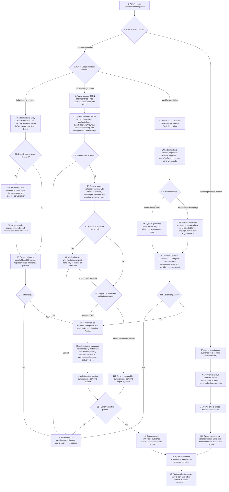
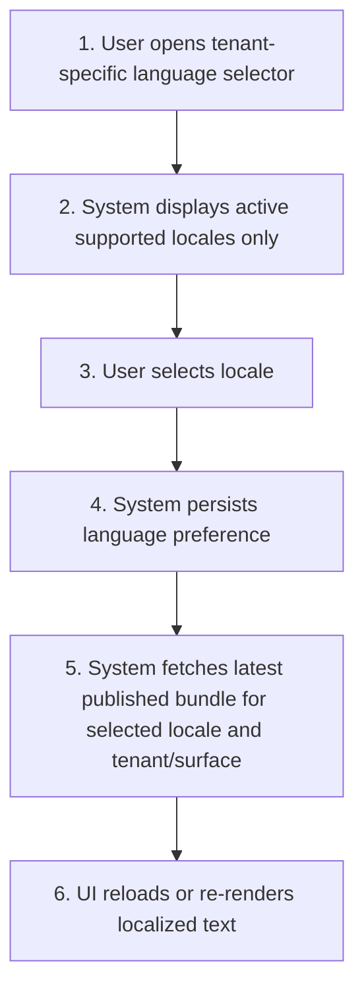
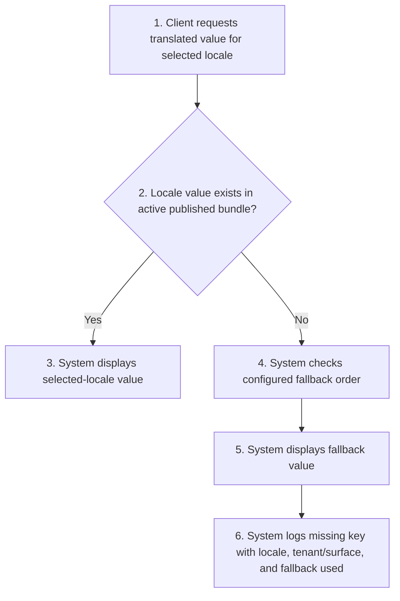
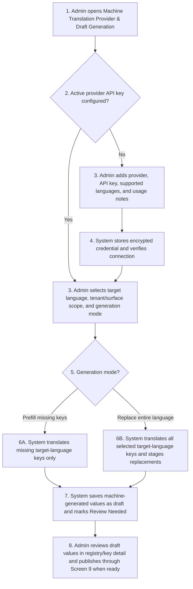

# FR-021 - Multi-Language & Localization

**Module**: P-01: Patient Account & Settings | PR-06: Profile & Settings Management | A-09: System Settings & Configuration | S-02: Payment Processing Service | S-03: Notification Service
**Feature Branch**: `fr021-i18n-localization`
**Created**: 2025-11-11
**Status**: ✅ Verified & Approved
**Source**: FR-021 from `local-docs/project-requirements/system-prd.md`; client transcriptions; product-defined localization operations

---

## Executive Summary

FR-021 defines Hairline's multi-language and localization capability across the Patient App, Provider Dashboard, Admin Platform, and system-delivered communications. The feature lets users choose a preferred interface language, lets the system serve translated UI and notification text with fallback behavior, and gives Admin a controlled way to manage supported locales, translation keys, translation values, JSON import/export, published translation versions, rollback, and coverage reporting.

The client requirement establishes multilingual behavior and editable language content, but the transcriptions do not define a detailed technical operating model for translation management. This PRD therefore specifies a product-owned hybrid approach:

1. A canonical translation registry stores every translatable key, English source value, metadata, lifecycle state, and locale values.
2. Admin users edit translation rows and key details for precise copy updates.
3. Admin users import/export JSON files for translator handoff and bulk translation work.
4. Inline edits and imports create draft changes only.
5. Published translation bundles are the only translation packages served to Patient, Provider, and Admin runtime clients.
6. Every publish creates an immutable version; rollback creates a new version restoring a prior published bundle.
7. Machine translation is an admin-controlled draft-generation accelerator for a whole target language/locale; it never publishes directly and never replaces the English source locale.

Initial supported languages are English (`en`) and Turkish (`tr`). Additional languages are expandable. RTL languages such as Arabic are planned, with V1 requiring locale metadata and implementation readiness, but not full RTL layout delivery.

---

## Module Scope

### Multi-Tenant Architecture

- **Patient Platform (P-01)**: Patient selects app language from Settings; Patient App fetches published patient-app translation bundles and applies fallback when translations are missing.
- **Provider Platform (PR-06)**: Provider users switch dashboard interface language from the top bar; Provider Dashboard fetches published provider-dashboard translation bundles. Provider profile spoken languages remain separate profile data.
- **Admin Platform (A-09)**: Admin users switch dashboard interface language from the top bar and manage localization through dedicated screens for locales, translation registry, key detail editing, JSON import/export, publish/version history, rollback, and coverage.
- **Shared Services (S-02 / S-03)**: S-02 supports localized currency display and conversion rules. S-03 consumes FR-021 supported locales and fallback rules for notification template selection and delivery.

### Multi-Tenant Breakdown

**Patient Platform (P-01)**:

- Patient can select an active supported language from Patient App Settings.
- Patient language preference persists across sessions/devices where account sync exists.
- Patient App loads the latest published patient-app translation bundle for the selected locale.
- Patient App displays fallback text when a selected-locale value is missing.
- Patient App continues to show user-generated content in the language originally entered by the user.

**Provider Platform (PR-06)**:

- Provider users can select dashboard UI language from the Provider Dashboard top bar.
- Provider Dashboard loads the latest published provider-dashboard translation bundle for the selected locale.
- Provider UI language preference does not overwrite provider profile spoken-language selections.
- Provider profile language chips consume the central language/locale catalog where appropriate, but represent languages spoken by the clinic/provider rather than UI translation preference.

**Admin Platform (A-09)**:

- Admin users can select Admin Platform UI language from the top bar.
- Admin can manage supported locales, default locale, locale activation state, native names, text direction metadata, and fallback order.
- Admin can view and edit translation keys/values through registry and key-detail screens.
- Admin can import/export translation JSON files by locale, tenant/surface, group, and version.
- Admin can manage machine-translation provider API credentials and run controlled machine-translation jobs for a selected non-English language.
- Admin can publish draft changes into versioned bundles and roll back to prior published versions.
- Admin can inspect coverage, missing keys, review-needed keys, and version history.

**Shared Services (S-02 / S-03)**:

- Shared localization service provides published bundles, version metadata, cache invalidation metadata, and fallback resolution.
- S-03 Notification Service selects notification language using recipient preference and FR-021 fallback rules while FR-030 owns template authoring.
- S-02 Payment Processing Service provides currency conversion source and formatting rules where localized currency display is required.
- Shared audit/logging captures localization changes, publish actions, rollback actions, and missing-translation events.

### Communication Structure

**In Scope**:

- Localized UI labels, navigation labels, validation messages, status labels, empty states, system guidance, and system-controlled static text.
- Localized notification template selection and fallback behavior for email/push where notification content is supplied by FR-030.
- Missing-translation logging and admin-facing coverage reporting.
- Admin publish/rollback audit records and import history.
- Admin-managed machine-translation provider configuration and draft generation for non-English target languages.

**Out of Scope**:

- Automatic translation of patient/provider messages, reviews, support-ticket messages, notes, uploaded documents, or any other user-generated content.
- Full notification-template authoring, variable management, and channel-specific template preview; these remain in FR-030.
- Legal document versioning and acceptance tracking; these remain in FR-027.
- Machine translation as an automatic runtime translator or direct-to-production publishing path.
- Full RTL layout delivery in V1.

### Entry Points

- Patient opens Patient App > Settings > Language & Region.
- Provider user opens the Provider Dashboard top-bar language selector.
- Admin user opens the Admin Platform top-bar language selector.
- Admin opens Admin Platform > Settings > Localization.
- Admin exports English/source JSON for translator handoff.
- Admin imports translated JSON for a target locale.
- Admin configures a machine-translation provider API key from Admin Platform > Settings > Localization > Machine Translation.
- Admin generates machine-translated draft values for a selected non-English language.
- Admin publishes pending localization changes from Language Version History & Rollback.
- Admin rolls back a published translation bundle from Language Version History & Rollback.
- Runtime clients fetch published translation bundles on app start, language change, cache revalidation, or version change.

---

## Business Workflows

### Main Flow: Admin Updates and Publishes Translation Version

**Actors**: Admin, System
**Trigger**: Admin needs to update translations through either individual text patching or JSON package import, then make those changes live
**Outcome**: System validates the selected update mode, saves individual patches as draft, either imports JSON packages as draft or publishes them as a version, and makes published bundles available to runtime clients

**Flow Diagram**:

### Alternative Flows

**A1: User Selects Language**

- **Trigger**: Patient, Provider, or Admin changes interface language.
- **Outcome**: User interface loads selected locale from latest published bundle, with fallback for missing keys.
- **Flow Diagram**:

**B1: Missing Translation**

- **Trigger**: Runtime client requests a key that has no value in the selected locale.
- **Outcome**: System displays fallback text and logs the missing key for coverage reporting.
- **Flow Diagram**:

**C1: Machine Translation Draft Generation**

- **Trigger**: Admin wants to quickly prepare a non-English target language using configured machine translation.
- **Outcome**: System creates machine-generated draft values for the selected language; Admin must review and publish through the standard version workflow before runtime clients receive the text.
- **Flow Diagram**:

---

## Screen Specifications

### Patient Platform

#### Screen 1: Patient App - Language & Region Settings

**Purpose**: Allow patients to choose the language used by the Patient App and review region-dependent display settings.

**Data Fields**:

| Field Name | Type | Required | Description | Validation Rules |
| --- | --- | --- | --- | --- |
| Language | select | Yes | Patient's preferred app language | Must be an active supported locale |
| Region/Locale | select | No | Regional formatting context for dates, numbers, and currency display | Must be a supported locale/region option when exposed |
| Timezone | select | No | Patient's preferred timezone for appointment and treatment schedule display | Must be a valid IANA timezone |
| Fallback notice | read-only text | No | Explains that some text may appear in the default language when translation is missing | Display only when fallback has occurred or product chooses persistent notice |

**Business Rules**:

- Language selection is stored on the patient profile/account preference.
- Patient App uses the latest published patient-app translation bundle for the selected locale.
- Draft translations are never served to the Patient App.
- If the selected locale has missing keys, the app displays fallback text from the configured fallback chain.
- If a locale is deactivated, patients who previously selected it are moved to fallback behavior without deleting their historical preference.
- The language selector must not include inactive locales.
- When timezone preference is null or unset, the Patient App uses the device/browser-detected timezone; if unavailable, it falls back to UTC and displays a visible timezone indicator so the patient knows which timezone is in use.

**Notes**:

- The language control lives inside the Settings menu, not in primary navigation.
- The selected language applies to navigation labels, button labels, validation messages, empty states, system-controlled status labels, and static UI guidance.
- User-generated content remains in the language originally entered by the user.

---

### Provider Platform

#### Screen 2: Provider Dashboard - Top-Bar Language Selector

**Purpose**: Allow provider users to switch the Provider Dashboard interface language without leaving their current workflow.

**Data Fields**:

| Field Name | Type | Required | Description | Validation Rules |
| --- | --- | --- | --- | --- |
| Current language | dropdown | Yes | Currently selected dashboard language | Must be an active supported locale |
| Available languages | dropdown options | Yes | Active supported locales available to provider users | Inactive locales hidden |
| Save/apply action | button or auto-apply | Yes | Applies selected language to dashboard session and profile preference | Must persist preference before refresh/re-render |

**Business Rules**:

- Provider Dashboard uses the latest published provider-dashboard translation bundle for the selected locale.
- Language selection applies to dashboard UI, system labels, validation messages, and provider-facing system notifications where FR-030 templates exist.
- Provider profile spoken languages are separate from Provider Dashboard UI language.
- Draft translations are never served to Provider Dashboard users.
- If a provider's selected locale becomes inactive, the dashboard falls back to the configured fallback locale.

**Notes**:

- The language selector lives in the top bar near account/profile controls.
- The control should show readable language names and native names where space permits.
- Switching language should preserve the current route and user task where technically feasible.

---

### Admin Platform

#### Screen 3: Admin Platform - Top-Bar Language Selector

**Purpose**: Allow admin users to switch the Admin Platform interface language while preserving their current administrative context.

**Data Fields**:

| Field Name | Type | Required | Description | Validation Rules |
| --- | --- | --- | --- | --- |
| Current language | dropdown | Yes | Currently selected admin UI language | Must be an active supported locale |
| Available languages | dropdown options | Yes | Active supported locales available to admin users | Inactive locales hidden |
| Apply action | button or auto-apply | Yes | Applies selected language to admin session and preference | Must persist preference |

**Business Rules**:

- Admin Platform uses the latest published admin-platform translation bundle for the selected locale.
- Localization-management screens may show translation values in multiple languages at once, regardless of the admin user's current UI language.
- Admin UI language preference does not change the default/source locale of the translation registry.
- Draft translation changes are visible inside localization-management screens but are not used to localize the Admin Platform UI until published.

**Notes**:

- The language selector lives in the top bar near profile/session controls.
- Admin screens that compare locale values should keep column language labels visible even when the admin UI language changes.

---

#### Screen 4: Admin - Localization Dashboard & Language Management

**Purpose**: Provide the overall localization dashboard where Admin manages available system languages and sees release readiness across tenants.

**Data Fields**:

| Field Name | Type | Required | Description | Validation Rules |
| --- | --- | --- | --- | --- |
| Language list | table | Yes | All supported locales/languages in the system | Includes active, inactive, default, and preparation-only locales |
| Locale code | text | Yes | Locale identifier such as `en`, `tr`, `en-GB`, or `ar` | Must be unique; must follow supported locale-code format |
| English name | text | Yes | Locale name in English | Required |
| Native name | text | Yes | Locale name in native script/language | Required |
| Direction | badge/select | Yes | Text direction metadata | Allowed values: `ltr`, `rtl` |
| Status | badge/toggle | Yes | Active, Inactive, or Preparation | Default locale cannot be inactive |
| Default locale | badge/radio | Yes | Identifies source/fallback locale | Exactly one default locale |
| Tenant coverage | metric group | No | Patient, Provider, and Admin coverage percentages | System-generated |
| Last published version | read-only text | No | Current active version by language/surface | System-generated |
| Add language action | button | Yes | Opens add-language form/modal | Locale code must be unique |
| Remove/deactivate action | button | Conditional | Deactivates or removes a language from active use | Default locale cannot be removed; historical data preserved |

**Business Rules**:

- This is the admin landing screen for localization.
- Admin can add new languages/locales from this screen.
- Admin can deactivate languages; deactivation hides the language from user-facing selectors but preserves translations, versions, and audit history.
- Hard deletion of a language is not allowed once translation history or published versions exist; use inactive/archived state instead.
- English (`en`) is the initial default/source locale unless changed through approved governance.
- New languages should start in Preparation state until required tenant bundles are ready.
- Only Active locales appear in user-facing language selectors; Inactive and Preparation locales are hidden from all patient, provider, and admin language selector controls.
- Selecting a language row opens Screen 5: Admin - Language Detail.

**Notes**:

- This screen should be the designer's primary overview for localization health.
- Coverage should be shown by tenant because Patient, Provider, and Admin readiness can differ.
- The default/source language should be visually protected from normal remove/deactivate controls.

---

#### Screen 5: Admin - Language Detail

**Purpose**: Let Admin manage one language's translations, coverage, draft changes, import route, edit route, export route, and publish readiness.

**Data Fields**:

| Field Name | Type | Required | Description | Validation Rules |
| --- | --- | --- | --- | --- |
| Language header | read-only group | Yes | Locale code, English name, native name, direction, status | Sourced from supported locale catalog |
| Tenant coverage | metric group | Yes | Patient, Provider, Admin, Shared/Notification coverage for this language | System-generated |
| Pending draft changes | read-only metric/list | No | Count and entry points for pending changes | System-generated |
| Missing keys | read-only metric/link | No | Missing translations for this language | Links to filtered key editor/inventory |
| Review-needed keys | read-only metric/link | No | Translations requiring review after source changes | Links to filtered key editor/inventory |
| Edit keys route | action card/button | Yes | Opens Screen 6 filtered to this language | Must preserve selected language context |
| Import JSON route | action card/button | Yes | Opens Screen 8 for this language | Must preserve selected language context |
| Export JSON action | button | No | Exports this language by tenant/surface/group/version | Must identify draft vs published export |
| Version history route | action card/button | Yes | Opens Screen 9 filtered to this language | Must preserve selected language context |
| Machine translation route | action card/button | Conditional | Opens Screen 10 for this language | Available only for non-English target languages and authorized admins |

**Business Rules**:

- Language Detail is the primary working screen for one language.
- Admin has two main update routes from this screen: edit individual keys or import JSON.
- Admin can also open machine translation for non-English languages when provider credentials and authorization are available.
- Export is available for translator handoff, backup, and implementation review, but export does not modify system state.
- Draft changes remain draft until published through Screen 9 or through controlled Import and Publish from Screen 8.
- Language status changes should be made from Screen 4 unless the design chooses to surface the same controls here as secondary actions.

**Notes**:

- This screen should make it obvious whether the language is live, inactive, or still being prepared.
- For a new language rollout, Admin should be able to move from this screen to key editing, import, export, coverage checks, and version publishing without returning to the dashboard.

---

#### Screen 6: Admin - Translation Key Inventory

**Purpose**: List translation keys across the whole system and split the inventory into Patient, Provider, and Admin tenant sub-screens so design, development, and Admin can understand the localization map and open key-level editing.

**Data Fields**:

| Field Name | Type | Required | Description | Validation Rules |
| --- | --- | --- | --- | --- |
| Tenant sub-screen | tabs/segmented control | Yes | Patient App, Provider Dashboard, Admin Platform | Exactly one tenant selected |
| Selected language filter | select/read-only | No | Optional language filter, especially when opened from Language Detail | Must be a supported locale |
| Namespace/group | table column/filter | Yes | Logical key group | Must follow key naming convention |
| Key pattern / key | table column | Yes | Stable key identifier or starter key pattern | Must be stable and machine-readable |
| Screen/context | table column | No | Product surface where key appears | Recommended for design/dev setup |
| English source value | table column | Conditional | Canonical source text for implemented keys | Required for active keys |
| Selected-language value | table column | Conditional | Value for selected language when a language filter is applied | Must preserve placeholders and ICU syntax |
| Coverage/status | badge/filter | Yes | Published, Draft, Missing, Review Needed, Deprecated, Orphaned | System-controlled where possible |
| Source value owner | table column | No | Owning module/FR/team | Recommended |
| Required at launch | badge | Yes | P1/P2/Future or Required/Optional | Must be reviewable before release |
| Flexibility status | badge | Yes | Baseline, implementation-discovered, deprecated, future | System/design governance field |
| Open key action | row click/button | Yes | Opens Screen 7 for the selected key | Must preserve tenant and selected language context where available |

**Business Rules**:

- This inventory is the canonical entry point for browsing and opening translation keys.
- Selecting a key opens Screen 7: Admin - Translation Key Detail Editor.
- This inventory is a baseline key map for design/dev setup, not a frozen exhaustive list.
- Developers may add, remove, split, or rename implementation keys without first updating this PRD when the change stays within the documented localization model, follows naming conventions, and is captured in the implementation registry/audit trail.
- PRD/design updates are required only when key changes alter user-facing workflow scope, add a new screen/surface, change source-locale governance, or change publish/version/rollback behavior.
- Shared/common keys may be reused only when meaning and context are identical across tenants.
- Tenant-specific keys should remain tenant-scoped even when the English words are similar but the user context differs.

**Notes**:

- When opened from Language Detail, this screen should be pre-filtered to that selected language and optionally to Missing / Review Needed / Draft states.
- Designers should use this screen to understand key groups and tenant coverage, not to hand-place every final implementation key.
- Dev should treat the lists below as seed groups and examples; the live registry remains the operational source of truth.

##### Screen 6A: Patient App Key Inventory

**Baseline Key Groups**:

| Namespace / Key Pattern | Context | Starter Keys / Examples | Flexibility Notes |
| --- | --- | --- | --- |
| `common.*` | Shared patient UI actions and states | `common.save`, `common.cancel`, `common.continue`, `common.back`, `common.loading`, `common.error.generic` | Can expand as shared components mature |
| `auth.*` | Login, signup, email verification, password reset | `auth.login.title`, `auth.login.button`, `auth.register.title`, `auth.password_reset.title`, `auth.email_verification.message` | Exact auth keys may follow FR-001 implementation naming |
| `settings.language.*` | Patient Settings language controls | `settings.language.title`, `settings.language.selected`, `settings.language.fallback_notice` | Required for FR-021 patient language setting |
| `profile.*` | Patient profile and account settings | `profile.photo.add`, `profile.location.label`, `profile.phone.label`, `profile.preferences.title` | Keep medical/private data out of translation bundles |
| `inquiry.*` | Quote request / inquiry creation | `inquiry.destination.title`, `inquiry.concern.title`, `inquiry.medical_questionnaire.title`, `inquiry.submit.button` | Exact keys depend on FR-003/FR-025 screen implementation |
| `quote.*` | Offers, quote comparison, quote detail | `quote.list.title`, `quote.offer_count`, `quote.accept.button`, `quote.details.title` | Align with FR-004/FR-005 labels |
| `booking.*` | Booking/scheduling status and date selection | `booking.title`, `booking.date_range.label`, `booking.status.pending`, `booking.status.confirmed` | Align with FR-006 |
| `payment.*` | Payment progress, methods, receipts | `payment.progress.title`, `payment.method.title`, `payment.pay_now`, `payment.receipt.title` | Align with FR-007/FR-007b |
| `travel.*` | Travel logistics and itinerary display | `travel.itinerary.title`, `travel.flight.label`, `travel.hotel.label`, `travel.passport.notice` | Align with FR-008 |
| `treatment.*` | In-progress treatment and treatment plan | `treatment.plan.title`, `treatment.day.label`, `treatment.status.in_progress`, `treatment.aftercare.start` | Align with FR-010 |
| `aftercare.*` | Aftercare tasks, questionnaires, education | `aftercare.today.title`, `aftercare.task.complete`, `aftercare.questionnaire.title`, `aftercare.resources.title` | Align with FR-010/FR-011 |
| `notifications.*` | Patient notification center labels | `notifications.title`, `notifications.empty`, `notifications.mark_all_read` | Notification content/templates remain owned by FR-030 |
| `support.*` | Help/support access | `support.help_center.title`, `support.ticket.create`, `support.contact.title` | Align with FR-035/FR-034 surfaces |

##### Screen 6B: Provider Dashboard Key Inventory

**Baseline Key Groups**:

| Namespace / Key Pattern | Context | Starter Keys / Examples | Flexibility Notes |
| --- | --- | --- | --- |
| `common.*` | Shared provider UI actions and states | `common.save`, `common.cancel`, `common.search`, `common.filter`, `common.empty_state` | Can share only where meaning is identical |
| `provider.nav.*` | Provider dashboard navigation/top bar | `provider.nav.dashboard`, `provider.nav.patients`, `provider.nav.quotes`, `provider.nav.settings`, `provider.nav.language` | Required for provider language selector |
| `provider.auth.*` | Provider login/account access | `provider.auth.login.title`, `provider.auth.password_reset.title` | May reuse auth concepts but tenant-scoped context can differ |
| `provider.patients.*` | Patient overview/work queue | `provider.patients.list.title`, `provider.patients.status`, `provider.patients.open_case` | Align with FR-009 |
| `provider.quotes.*` | Quote requests and quote submission | `provider.quotes.requests.title`, `provider.quotes.create.button`, `provider.quotes.submit.button` | Align with FR-003/FR-004 provider surfaces |
| `provider.bookings.*` | Provider booking schedule | `provider.bookings.title`, `provider.bookings.date`, `provider.bookings.status` | Align with FR-006 |
| `provider.treatment.*` | Treatment plan/execution participation | `provider.treatment.plan.title`, `provider.treatment.day.update`, `provider.treatment.status` | Align with FR-010 |
| `provider.analytics.*` | Provider analytics/reporting | `provider.analytics.title`, `provider.analytics.revenue`, `provider.analytics.conversion` | Align with FR-014 |
| `provider.finance.*` | Financial management and payouts | `provider.finance.payouts.title`, `provider.finance.earnings.title`, `provider.finance.statement.title` | Align with FR-017/FR-029/FR-032 as applicable |
| `provider.profile.*` | Provider profile settings | `provider.profile.languages.title`, `provider.profile.awards.title`, `provider.profile.logo.upload` | Spoken languages are profile data, not UI language preference |
| `provider.reviews.*` | Provider reviews tab/response | `provider.reviews.title`, `provider.reviews.respond`, `provider.reviews.empty` | Align with FR-013/FR-032 |
| `provider.support.*` | Provider help/support/settings support | `provider.support.help_center`, `provider.support.contact`, `provider.support.status` | Align with FR-032/FR-033/FR-034 |

##### Screen 6C: Admin Platform Key Inventory

**Baseline Key Groups**:

| Namespace / Key Pattern | Context | Starter Keys / Examples | Flexibility Notes |
| --- | --- | --- | --- |
| `common.*` | Shared admin UI actions and states | `common.save`, `common.cancel`, `common.search`, `common.filter`, `common.export`, `common.publish` | Can share with other tenants only when context is identical |
| `admin.nav.*` | Admin navigation/top bar | `admin.nav.dashboard`, `admin.nav.patients`, `admin.nav.providers`, `admin.nav.settings`, `admin.nav.language` | Required for admin language selector |
| `admin.auth.*` | Admin login/access management | `admin.auth.login.title`, `admin.auth.mfa.title`, `admin.auth.session_expired` | Align with FR-031 |
| `admin.patients.*` | Patient management | `admin.patients.list.title`, `admin.patients.detail.title`, `admin.patients.status` | Align with FR-016 |
| `admin.providers.*` | Provider management | `admin.providers.list.title`, `admin.providers.detail.title`, `admin.providers.languages.label` | Align with FR-015 |
| `admin.inquiries.*` | Inquiry/quote oversight | `admin.inquiries.list.title`, `admin.inquiries.detail.title`, `admin.inquiries.status` | Align with FR-003/FR-004 |
| `admin.payments.*` | Payment/billing/finance admin | `admin.payments.dashboard.title`, `admin.payments.refund.action`, `admin.payouts.title` | Align with FR-007/FR-017/FR-029 |
| `admin.reviews.*` | Review management | `admin.reviews.title`, `admin.reviews.insert`, `admin.reviews.remove`, `admin.reviews.takedown_queue` | Align with FR-013 |
| `admin.promotions.*` | Promotions/referrals | `admin.promotions.title`, `admin.promotions.create`, `admin.promotions.status` | Align with FR-019/FR-020 |
| `admin.localization.*` | FR-021 localization management | `admin.localization.dashboard.title`, `admin.localization.language.add`, `admin.localization.import.title`, `admin.localization.version.rollback` | Core FR-021 admin keys |
| `admin.notifications.*` | Notification rules/config | `admin.notifications.rules.title`, `admin.notifications.template.title`, `admin.notifications.preview` | Align with FR-030; content/template body remains FR-030-owned |
| `admin.help_center.*` | Help centre/content management | `admin.help_center.faq.title`, `admin.help_center.article.title`, `admin.help_center.video.title` | Align with FR-033 |
| `admin.support.*` | Support center ticketing | `admin.support.tickets.title`, `admin.support.status`, `admin.support.assignment` | Align with FR-034 |
| `admin.audit.*` | Audit trail and security settings | `admin.audit.title`, `admin.audit.actor`, `admin.audit.outcome` | Align with FR-031 |

---

#### Screen 7: Admin - Translation Key Detail Editor

**Purpose**: Let Admin open one selected translation key from the inventory, review all language values for that key, and edit per-language values through a controlled draft workflow.

**Data Fields**:

| Field Name | Type | Required | Description | Validation Rules |
| --- | --- | --- | --- | --- |
| Translation key | read-only text | Yes | Stable key identifier such as `auth.login.title` | Editable only through controlled key lifecycle process |
| Tenant/surface | read-only/select | Yes | Patient App, Provider Dashboard, Admin Platform, Shared/Notification | Required |
| Group/namespace | read-only/select | Yes | Logical namespace | Required |
| Screen/context | text | No | Where the key appears and how it is used | Recommended for translator clarity |
| Description/context | textarea | No | Translator guidance and usage context | Recommended |
| English source value | textarea | Yes | Canonical source value | Source edit requires elevated authorization, reason, and placeholder validation |
| Locale values | textarea per active language | Conditional | Translation value for each active language | Must preserve placeholders and ICU syntax |
| Selected language highlight | read-only state | No | Highlights the language filter used when opened from Language Detail | Must not hide other active language values |
| Character guidance | read-only text | No | Optional display length guidance for constrained UI | Non-blocking unless a screen-specific limit exists |
| Change reason | textarea | Conditional | Required when editing English source or publishing sensitive changes | Required for protected edits |
| History panel | read-only log | No | Prior changes, imports, publishes, and rollback references | System-generated |
| Save draft action | button | Yes | Saves edited values as draft | Does not affect runtime bundles |

**Business Rules**:

- This screen is downstream from Screen 6: Translation Key Inventory.
- One key is shown at a time.
- All active language values for the selected key should be visible or accessible from this screen.
- Saving changes creates or updates draft values only.
- Admin can save one language value or multiple language values for the key.
- System must block saving if placeholders are removed, renamed, or malformed.
- English source edits require elevated authorization, reason capture, audit logging, and review-needed marking for dependent translations unless Admin explicitly confirms the source change is non-semantic.
- Published client bundles are not changed until Admin publishes a version.

**Notes**:

- Show English source value first, then active languages, then inactive/preparation languages if Admin chooses to include them.
- Show missing/review-needed indicators beside affected languages.
- Show a clear Pending Publish state after saving draft changes.

---

#### Screen 8: Admin - JSON Import Modal/Screen

**Purpose**: Allow Admin to upload a JSON translation package for one language, tenant/surface, and group; validate it; then choose Import as Draft or controlled Import and Publish Version.

**Data Fields**:

| Field Name | Type | Required | Description | Validation Rules |
| --- | --- | --- | --- | --- |
| Target language | select/read-only | Yes | Language receiving imported values | Must be supported; inactive/preparation languages allowed for preparation workflows |
| Tenant/surface | select | Yes | Target translation surface | Patient App, Provider Dashboard, Admin Platform, Shared/Notification |
| Group/namespace | select | Yes | Target key group | Must exist or be authorized for creation |
| File | upload | Yes | JSON translation file/package | Valid JSON; size limit configured by platform |
| Import mode | radio/select | Yes | Overwrite draft values or only add missing | Must be selected before confirmation |
| Validation preview | read-only panel | Yes | Shows created, updated, unchanged, skipped, row warnings, and errors | Required before import confirmation |
| Import decision | radio/select | Yes | Import as Draft or Import and Publish Version | Import and Publish disabled if validation errors exist or approval is required |
| Publish summary | textarea | Conditional | Required when choosing Import and Publish Version | Required before publish confirmation |
| Error report | download link | Conditional | Downloadable validation errors/warnings | Shown when validation issues exist |

**Business Rules**:

- JSON import must be a separate modal/screen from the key editor.
- Import as Draft is the default and safest import decision.
- Import and Publish Version is available only after successful validation preview, required publish-summary entry, and required authorization.
- Import preview is required before confirmed import.
- System must validate JSON syntax, known keys, duplicate keys, placeholder consistency, ICU syntax, target-locale compatibility, and unsupported/orphaned keys.
- Every confirmed import creates an import record with file name, actor, timestamp, language, surface, group, decision, summary counts, and validation results.
- If Admin chooses Import and Publish Version, system creates both an import record and an immutable published version record.
- Unknown keys are blocked unless Admin has explicit permission to create new registry keys through import.

**Notes**:

- Import summary should separate structural errors, row-level warnings, publish-blocking errors, and non-blocking warnings.
- The modal/screen should clearly show whether the file is only being imported as draft or is being published as a live version.

---

#### Screen 9: Admin - Language Version History & Rollback

**Purpose**: Manage published versions for a language, inspect changes, publish draft changes, and roll back to a prior version.

**Data Fields**:

| Field Name | Type | Required | Description | Validation Rules |
| --- | --- | --- | --- | --- |
| Version ID | read-only text | Yes | Published bundle identifier | System-generated |
| Language | filter/read-only | Yes | Language included in version | Required |
| Tenant/surface | filter/read-only | Yes | Surface included in version | Required |
| Group/namespace | filter/read-only | No | Group included in version | Required when publishing partial bundle |
| Source type | badge | Yes | Manual patch, JSON import, import+publish, machine translation, rollback | System-generated |
| Change summary | textarea/read-only | Yes | Human-readable reason for publish or rollback | Required for publish/rollback |
| Pending changes | read-only list | No | Draft keys ready to publish | System-generated |
| Coverage summary | read-only panel | No | Translation coverage and missing key count | System-generated |
| Validation status | read-only badge | Yes | Pass, warning, blocked | Blocking errors prevent publish |
| Publish action | button | Conditional | Creates a new published version from draft changes | Enabled only after validation |
| Rollback action | button | Conditional | Restores selected prior bundle as active via new rollback version | Requires reason and confirmation |
| Compare versions action | button | No | Compares two versions at key/value level | Versions must share language/surface scope |

**Business Rules**:

- Published versions are immutable.
- Publishing creates a new active bundle version for selected language, tenant/surface, and group scope.
- Rollback creates a new version entry; it must not delete or mutate prior version history.
- Cache invalidation occurs after publish and rollback.
- System must record actor, timestamp, publish/rollback reason, impacted keys, language, tenant/surface, and previous active version.
- Admin cannot publish if required validation errors exist, such as malformed ICU syntax or placeholder mismatch.

**Notes**:

- Version history should show whether a version came from individual text patching, JSON import, import+publish, or rollback.
- This screen is language-focused when entered from Language Detail, but can support filters for all languages if the dashboard needs a global history view.

---

#### Screen 10: Admin - Machine Translation Provider & Draft Generation

**Purpose**: Let Admin configure a machine-translation provider API key and generate review-required draft translations for a selected non-English language.

**Data Fields**:

| Field Name | Type | Required | Description | Validation Rules |
| --- | --- | --- | --- | --- |
| Provider | select | Yes | Machine-translation service used for draft generation | Options may include Google Cloud Translation, DeepL, Microsoft Azure Translator, and Amazon Translate; custom provider allowed only if integration exists |
| Provider status | badge/read-only | Yes | Connected, Not Configured, Error, or Disabled | System-generated from credential and health checks |
| API key / credential | secret input | Conditional | Credential used to call the selected provider | Required to enable provider; encrypted at rest; masked after save |
| Supported languages | read-only/list | No | Provider-supported target languages available to Admin | Retrieved from provider metadata or configured integration |
| Target language | select | Yes | Non-English language receiving machine-generated draft values | Must be supported by FR-021 locale catalog and selected provider; English/source locale blocked |
| Tenant/surface scope | multi-select | Yes | Patient App, Provider Dashboard, Admin Platform, Shared/Notification | Default all selected surfaces for the target language |
| Group/namespace scope | multi-select | No | Optional key groups to include | Blank means all groups for selected surfaces |
| Generation mode | radio/select | Yes | Prefill Missing Keys or Replace Entire Language | Replace Entire Language disabled for English/source locale |
| Preview counts | read-only panel | Yes | Shows eligible, skipped, missing, replacement, error, and estimated usage counts | Required before generation confirmation |
| Confirmation reason | textarea | Yes | Business reason for running machine translation | Required for audit |
| Generate draft action | button | Yes | Starts machine-translation job and saves accepted results as draft | Requires active provider, preview, confirmation, and authorization |
| Job history | table | No | Prior machine-translation jobs, actor, language, mode, counts, provider, status, and errors | System-generated |

**Business Rules**:

- Machine translation is a draft-generation tool, not a runtime translation path.
- Machine translation can only target non-English locales; English/source values remain human-authored and governed by source-edit protections.
- Prefill Missing Keys generates draft values only where the selected target language has no value.
- Replace Entire Language generates replacement draft values for all selected target-language keys in the selected scope, except protected source values.
- All machine-generated values are marked Review Needed until reviewed or explicitly accepted by Admin.
- Generated values must pass the same placeholder, ICU syntax, key-existence, target-locale compatibility, and publish validation rules as JSON imports.
- Machine translation must not process patient/provider messages, reviews, support-ticket messages, notes, uploaded documents, legal content, or other user-generated/private content unless the owning FR explicitly permits it.
- API credentials must be encrypted at rest, masked in UI after save, and never exported in JSON files or audit detail.
- Every provider configuration change and machine-translation job must be audited with actor, timestamp, provider, target language, mode, scope, counts, and reason.

**Notes**:

- Notable starting providers for Admin evaluation: Google Cloud Translation, DeepL, Microsoft Azure Translator, and Amazon Translate.
- The screen should show cost/usage warnings where provider metadata or integration limits are available.
- Machine translation should be treated as a way to accelerate whole-language readiness, not as key-by-key silent automation.

---

## Business Rules

### General Module Rules

- **Rule 1**: All user-facing system-controlled text must be externalized into translation keys before production release.
- **Rule 2**: Translation keys must be stable identifiers and should not be based on mutable display copy.
- **Rule 3**: Active keys require an English source value.
- **Rule 4**: Keys must include tenant/surface and group/namespace metadata.
- **Rule 5**: Inline text edits save draft changes only; JSON imports default to Import as Draft, with Import and Publish Version allowed only after full validation preview, publish-summary entry, and required authorization.
- **Rule 6**: Runtime clients consume published bundles only; they never consume draft translation values.
- **Rule 7**: Every publish creates an immutable version record.
- **Rule 8**: Rollback creates a new version that restores a prior published bundle; rollback does not delete history.
- **Rule 9**: Fallback applies per key using selected locale, configured fallback locale, and default/source locale.
- **Rule 10**: Locale direction metadata must be stored so future RTL support is not blocked.
- **Rule 11**: Machine-generated translations save as draft only, must be marked Review Needed, and cannot be served to runtime clients until published.
- **Rule 12**: Machine translation generation can target a whole non-English language by missing keys or full-language replacement scope; English/source locale is never replaced by machine translation.
- **Rule 13**: Clients MUST revalidate translation bundles against version metadata (ETag/hash or equivalent) on each fetch cycle. After a publish or rollback, the maximum acceptable stale window is a platform-configurable interval, recommended at 5 minutes or less, ensuring clients do not serve outdated bundles for an indeterminate period after a version change.

### Data & Privacy Rules

- **Privacy Rule 1**: Translation bundles must not include patient/provider private data or user-generated content.
- **Privacy Rule 2**: Import/export files must contain system-controlled text only unless another owning FR explicitly permits additional metadata.
- **Privacy Rule 3**: Machine translation requests must contain system-controlled source text only and must exclude private data, medical data, user-generated content, legal content, uploaded documents, and support messages unless explicitly permitted by the owning FR.
- **Audit Rule**: System must log locale changes, protected source edits, imports, publishes, rollbacks, and missing-translation events with actor, timestamp, scope, and reason where applicable.
- **Data Retention Rule**: Published version history and audit trail must be retained according to platform audit-retention policy.
- **Data Integrity Rule**: Published versions are immutable and must remain inspectable after rollback.

### Admin Editability Rules

**Editable by Admin**:

- Supported locales, native names, activation state, fallback order, and locale direction metadata.
- Translation values for non-source locales.
- Translation key metadata such as description/context and group where allowed.
- Draft translation changes, import confirmations, publish actions, and rollback actions.
- Machine-translation provider credentials, provider activation state, and machine-translation draft generation jobs.
- Currency display configuration where already owned by A-09/S-02.

**Fixed in Codebase (Not Editable)**:

- Locale formatting library behavior.
- Runtime bundle fetch protocol.
- Mandatory system keys required by application code.
- Notification variable contracts owned by FR-030.
- Security and audit-retention mechanisms.

**Configurable with Restrictions**:

- English source values require elevated authorization, reason capture, audit logging, and review-needed marking for dependent locale values.
- Translation key identifiers after first publish require controlled migration rather than casual editing.
- Default locale changes require governance approval and must not deactivate the source locale.
- Machine translation full-language replacement requires explicit confirmation because it can overwrite many target-language draft values.
- Historical versions and audit records cannot be deleted through normal admin controls.

**Elevated Authorization Definition**: For the purposes of FR-021, "elevated authorization" means the **Super Admin** role as defined in FR-031 (Admin Access Control & Permissions). Only Super Admin role holders may edit English source values, change the default locale, publish translation versions, and perform rollback operations. The exact per-operation permission scope must be aligned with FR-031 configuration at implementation time.

### Payment & Billing Rules

- **Currency Rule 1**: Currency display must use configured country/locale/currency rules without storing currency settings inside translation JSON files.
- **Currency Rule 2**: Currency conversion source, refresh cadence, markup, rate locking, and payment-collection fallback are owned by FR-029 / S-02 and consumed by FR-021 for localized display. Locale-aware number formatting (decimal separator, symbol position, digit grouping, and RTL currency rendering) is owned by S-02 as a shared service capability and consumed by FR-021; neither FR-021 nor FR-029 duplicates this formatting logic.
- **Currency Rule 3**: User-selected language does not automatically override timezone or currency unless product rules explicitly map country/locale defaults.

---

## Success Criteria

### Patient Experience Metrics

- **SC-001**: 99% of active Patient App UI strings load from the selected published locale bundle or configured fallback for supported locales.
- **SC-002**: Patient language switching completes in < 2 seconds for 95th percentile interactions when the published bundle is already cached or reachable.
- **SC-003**: Patient App remains usable when selected-locale translations are missing because fallback text is displayed per key.

### Provider Efficiency Metrics

- **SC-004**: 99% of active Provider Dashboard UI strings load from the selected published locale bundle or configured fallback for supported locales.
- **SC-005**: Provider dashboard language switching preserves the current route/workflow where technically feasible.
- **SC-006**: Provider spoken-language profile data remains unchanged when provider UI language preference changes.

### Admin Management Metrics

- **SC-007**: Admin can edit a translation value, save it as draft, publish it, and verify it appears in a new published version.
- **SC-008**: Admin can import a valid locale JSON file, review validation summary, save values as draft, and publish a version.
- **SC-009**: Admin can roll back to a prior published translation bundle and see the rollback recorded as a new version.
- **SC-010**: Admin can identify missing translations by locale, tenant/surface, and group from coverage reporting.
- **SC-010a**: Admin can configure a machine-translation provider, prefill missing keys for a selected non-English language, review generated draft values, and publish them through the standard version workflow.
- **SC-010b**: Admin can replace an entire selected non-English language with machine-generated draft values without modifying English/source values or immediately affecting runtime clients.

### System Performance Metrics

- **SC-011**: Published bundle fetch/revalidation supports cache metadata such as version hash/ETag or equivalent.
- **SC-012**: Missing translation events are logged immediately when detected by runtime fallback, import validation, registry validation, or publish validation.
- **SC-013**: Dates/times reflect user timezone across the app with no incorrect cross-day conversions in 99.9% of appointment/treatment schedule displays.
- **SC-014**: Currency displays in user locale/country context with accurate conversion and formatting within configured rate-source tolerance for 99% of relevant views.

### Business Impact Metrics

- **SC-015**: New market-language readiness can be tracked by locale coverage before a locale is activated for users.
- **SC-016**: Translation release mistakes can be recovered through rollback without deleting published history.
- **SC-017**: English source copy changes are traceable and do not silently invalidate dependent translations.

---

## Dependencies

### Internal Dependencies (Other FRs/Modules)

- **FR-026 / A-09 App Settings**:
  - **Why needed**: May surface settings navigation and shared country/timezone/security configuration.
  - **Integration point**: FR-021 owns language/locale catalog semantics; FR-026 may surface the catalog through the broader App Settings shell but must not become the language-list source of truth.

- **FR-030 / S-03 Notification Rules & Configuration**:
  - **Why needed**: Notification template language variants consume supported locales and fallback rules.
  - **Integration point**: FR-030 owns template authoring, variables, preview, and channel content; FR-021 owns locale catalog, fallback, and translation-version behavior.

- **FR-027 / Legal Content Management**:
  - **Why needed**: Legal documents may have localized versions.
  - **Integration point**: FR-027 owns legal content versioning and acceptance; FR-021 supplies locale/fallback principles.

- **FR-024 / Treatment Package Management**:
  - **Why needed**: Treatment/package names, descriptions, and patient-facing package copy require translation readiness.
  - **Integration point**: Treatment/package content registers with FR-021 translation management where applicable.

- **FR-032 / Provider Dashboard Settings**:
  - **Why needed**: Provider profiles include spoken-language selections.
  - **Integration point**: FR-032 consumes the centrally managed language catalog for provider spoken-language chips; this is separate from provider UI language preference.

- **S-02 / Payment Processing Service**:
  - **Why needed**: Currency conversion and formatting are part of localization display.
  - **Integration point**: Currency source, refresh cadence, rounding policy, and display formatting are configured/audited outside translation JSON.

- **FR-029 / S-02 Payment System Configuration**:
  - **Why needed**: FR-029 owns enabled currencies, currency pairs, conversion sources, markup, rate locking, and fallback-to-USD behavior.
  - **Integration point**: FR-021 consumes FR-029/S-02 currency display and formatting outputs; it does not own payment conversion configuration.

- **FR-031 / Admin Access Control & Permissions**:
  - **Why needed**: FR-021 defines "elevated authorization" as the Super Admin role governed by FR-031. Protected operations — English source value editing, default locale changes, translation version publishing, and rollback — are restricted to Super Admin role holders.
  - **Integration point**: FR-031 owns role definitions and the permission matrix; FR-021's four protected operations must be registered as Super Admin-only permissions in the FR-031 permission matrix at implementation time. The exact per-operation permission scope must be aligned with FR-031 configuration before release.

### External Dependencies (APIs, Services)

- **Currency Rate Source**:
  - **Purpose**: Provides conversion rates for local currency display.
  - **Integration**: S-02-owned integration.
  - **Failure handling**: Use last valid configured rate within allowed freshness window or show configured fallback per S-02/finance rules.

- **Translation Vendor / Translator Workflow**:
  - **Purpose**: Human translation work using exported JSON files.
  - **Integration**: File export/import workflow; no automatic production translation required in V1.
  - **Failure handling**: Invalid or incomplete files remain draft and cannot publish when blocking validation errors exist.

- **Machine Translation Service**:
  - **Purpose**: Optional draft generation for a selected non-English target language.
  - **Integration**: Admin-configured provider API credential; notable starting options include Google Cloud Translation, DeepL, Microsoft Azure Translator, and Amazon Translate.
  - **Failure handling**: Provider errors, quota limits, unsupported languages, placeholder mismatches, or malformed outputs are recorded in job history; accepted results remain draft and cannot publish until validation passes.

### Data Dependencies

- **Supported Locale Catalog**:
  - **Why needed**: Drives language selectors, translation import/export targets, fallback order, and coverage reports.
  - **Source**: FR-021 Localization Dashboard & Language Management.

- **Translation Key Registry**:
  - **Why needed**: Provides canonical inventory of translatable text.
  - **Source**: FR-021 Translation Key Inventory / Translation Key Detail Editor, implementation key extraction, and admin-approved key creation.

- **Published Translation Bundles**:
  - **Why needed**: Runtime clients use published bundles only.
  - **Source**: FR-021 Language Version History & Rollback.

- **User Language Preference**:
  - **Why needed**: Determines which locale bundle each tenant should request.
  - **Source**: Patient, provider, and admin profile/account settings.

- **Machine Translation Provider Credential**:
  - **Why needed**: Allows Admin to generate draft translations through a configured provider.
  - **Source**: FR-021 Machine Translation Provider & Draft Generation screen.

- **Machine Translation Job**:
  - **Why needed**: Tracks machine-generated draft values, job mode, target language, provider, scope, counts, status, and audit metadata.
  - **Source**: FR-021 Machine Translation Provider & Draft Generation screen.

---

## Assumptions

### User Behavior Assumptions

- **Assumption 1**: Patients expect language selection to live in Settings rather than primary navigation.
- **Assumption 2**: Provider and Admin users expect language selection near account/profile controls in the dashboard top bar.
- **Assumption 3**: Admin users need both precise row editing and bulk JSON workflows.
- **Assumption 4**: Translators work from exported source files and return translated JSON files.

### Technology Assumptions

- **Assumption 1**: Client apps can fetch and cache published translation bundles by locale and tenant/surface.
- **Assumption 2**: Runtime clients can revalidate translation bundles using version metadata such as hash/ETag or equivalent.
- **Assumption 3**: Translation values can support structured message formats such as ICU where variables/plurals are needed.
- **Assumption 4**: Implementation can detect at least some missing/orphaned keys through registry validation, import validation, publish validation, runtime logging, or release checks.
- **Assumption 5**: Machine-translation providers can return structured responses for supported languages, but system validation remains responsible for placeholder, ICU, and publish readiness.

### Business Process Assumptions

- **Assumption 1**: English (`en`) is the initial source/default locale.
- **Assumption 2**: Turkish (`tr`) is the first non-English supported locale.
- **Assumption 3**: Arabic (`ar`) is a likely future locale requiring RTL support, but full RTL layout is not part of V1.
- **Assumption 4**: Translation releases should be controlled through explicit publish/versioning rather than going live immediately after edit/import.
- **Assumption 5**: Non-default locales may temporarily rely on fallback text when coverage is incomplete, provided release stakeholders accept that coverage state.
- **Assumption 6**: Machine translation may accelerate initial language coverage, but human/admin review remains required before publication.

---

## Implementation Notes

### Technical Considerations

- **Architecture**: Separate draft translation values from published bundle values so runtime clients never consume unreviewed edits.
- **Translation Format**: Use stable keys and structured values with ICU message support where variables/plurals are required.
- **Validation**: Validate placeholder parity, ICU syntax, required source values, duplicate keys, unknown keys, and target-locale compatibility.
- **Cache Behavior**: Published bundles should include version metadata so clients can revalidate and avoid unnecessary downloads.
- **Source Protection**: English source edits require additional workflow friction because dependent translations may become stale.
- **Machine Translation**: Provider credentials are configured by Admin, stored securely, and used only to create draft target-language values that pass normal validation before publish.

### Integration Points

- **Patient App bundle fetch**:
  - **Data format**: Published key/value bundle by locale and patient-app surface.
  - **Authentication**: Uses existing app authentication/session rules where required.
  - **Error handling**: Fall back to cached bundle or default locale where allowed.

- **Provider Dashboard bundle fetch**:
  - **Data format**: Published key/value bundle by locale and provider-dashboard surface.
  - **Authentication**: Uses provider dashboard authentication.
  - **Error handling**: Fall back to cached bundle or default locale where allowed.

- **Admin Platform localization management**:
  - **Data format**: Registry rows, draft values, import/export JSON, version metadata, and coverage summaries.
  - **Authentication**: Admin-authenticated access with elevated authorization for protected source/default changes.
  - **Error handling**: Block publish on validation failures; preserve draft state for correction. Protected endpoints (publish, rollback, English source edit, default locale change) must return HTTP 403 with the platform-standard error format when called by a non-Super-Admin role.

- **Notification Service**:
  - **Data format**: Recipient locale preference and fallback order.
  - **Authentication**: Internal service integration.
  - **Error handling**: Use fallback locale template/content when recipient locale is missing.

- **Machine Translation Service**:
  - **Data format**: Source text, target locale, placeholder/ICU metadata, and key context for system-controlled strings only.
  - **Authentication**: Provider-specific API credential stored through Screen 10.
  - **Error handling**: Save job errors and partial counts; do not create publishable values for failed rows.

### Scalability Considerations

- **Current scale**: Initial launch supports English and Turkish with limited tenant surfaces.
- **Growth projection**: Locale count and key count will grow as the Patient App, Provider Dashboard, Admin Platform, legal/static content, and treatment/package content expand.
- **Peak load**: Bundle fetch/revalidation may spike after publish or rollback.
- **Data volume**: Translation history grows by version and locale; historical bundles must remain inspectable.
- **Scaling strategy**: Use cacheable published bundles, version metadata, and scoped publish groups to avoid forcing all clients to download all surfaces at once.

### Security Considerations

- **Authentication**: Only authenticated Admin users can access localization-management screens.
- **Authorization**: Protected operations such as English source edits, default locale changes, publish, and rollback require elevated authorization.
- **Encryption**: Import/export files and bundle APIs must follow platform transport security requirements.
- **Credential Security**: Machine-translation API keys must be encrypted at rest, masked after save, access-controlled, and excluded from exports/log detail.
- **Audit trail**: Locale changes, source edits, imports, publishes, rollbacks, and missing-translation events must be logged.
- **Threat mitigation**: Import validation must prevent malformed payloads, invalid placeholders, and oversized files from disrupting published bundles.
- **Compliance**: Translation bundles must not include protected medical data, private account data, or user-generated free text.

---

## User Scenarios & Testing

### User Story 1 - Patient Selects Turkish (Priority: P1)

Patient changes language to Turkish in Patient App Settings and the Patient App uses the latest published Turkish patient-app bundle.

**Why this priority**: Patient-facing language selection is the core user outcome of FR-021.

**Independent Test**: Change a patient account language to Turkish and verify patient-app labels/messages render from the published Turkish bundle with fallback for missing keys.

**Acceptance Scenarios**:

1. **Given** Turkish is active and published for Patient App, **When** patient selects Turkish, **Then** navigation, buttons, validation messages, empty states, and system labels display in Turkish where translated.
2. **Given** a Patient App key is missing in Turkish, **When** patient views that screen, **Then** system displays configured fallback text and logs the missing key.
3. **Given** Turkish is deactivated after patient selected it, **When** patient next opens the app, **Then** system applies fallback behavior and does not show inactive Turkish as a selectable option.

---

### User Story 2 - Provider Switches Dashboard Language (Priority: P1)

Provider user changes dashboard UI language from the top bar without changing provider profile spoken-language data.

**Why this priority**: Provider dashboard localization is required across tenant surfaces and must not corrupt provider profile language data.

**Independent Test**: Change Provider Dashboard language from top bar and confirm UI text changes while profile spoken-language chips remain unchanged.

**Acceptance Scenarios**:

1. **Given** provider selects Turkish from the top bar, **When** the selection is applied, **Then** Provider Dashboard labels and validation messages render from the Turkish provider-dashboard bundle.
2. **Given** provider profile spoken languages include English and Turkish, **When** provider changes dashboard UI language, **Then** provider spoken-language chips are not overwritten.

---

### User Story 3 - Admin Edits One Translation Key (Priority: P1)

Admin corrects one translation value in the registry, saves it as draft, then publishes it.

**Why this priority**: Day-to-day translation corrections require a precise, controlled editing workflow.

**Independent Test**: Edit one locale value, verify it remains pending draft, publish it, and verify it appears in a new published version.

**Acceptance Scenarios**:

1. **Given** Admin edits a Turkish value, **When** Admin saves, **Then** the key is marked Pending Publish and runtime clients still use the previous published value.
2. **Given** Admin publishes pending Turkish Patient App changes, **When** Patient App fetches latest bundle, **Then** the new Turkish value appears.
3. **Given** Admin edits the English source value, **When** Admin saves, **Then** system requires a reason and marks non-English translations for review.

---

### User Story 4 - Admin Imports Translator JSON (Priority: P1)

Admin exports source JSON, receives translated JSON, validates the package, then either imports it as draft for later review or imports and publishes it as a version.

**Why this priority**: Bulk translation is necessary when adding or maintaining a complete locale.

**Independent Test**: Export English source JSON, import translated Turkish JSON, review validation summary, confirm either Import as Draft or Import and Publish Version, and verify import/version history.

**Acceptance Scenarios**:

1. **Given** Admin uploads a valid Turkish JSON file, **When** validation completes, **Then** system shows created/updated/unchanged/skipped/error counts and publish-blocking status before import confirmation.
2. **Given** Admin chooses Import as Draft, **When** import succeeds, **Then** values are saved as draft, an import record is created, and runtime clients still receive the previous published bundle.
3. **Given** Admin chooses Import and Publish Version after a fully valid preview, **When** Admin enters a publish summary and confirms, **Then** system creates both an import record and a new immutable published version.
4. **Given** Import and Publish Version succeeds, **When** client fetches latest translation metadata, **Then** the new version is available.

---

### User Story 5 - Admin Rolls Back Translation Version (Priority: P1)

Admin restores a previous published translation bundle after a bad translation release.

**Why this priority**: Localization mistakes can affect all tenants and require safe recovery.

**Independent Test**: Publish a new version, roll back to a prior version, and verify active bundle content matches the prior version while history remains intact.

**Acceptance Scenarios**:

1. **Given** version `v3` is active and version `v2` was previously active, **When** Admin rolls back to `v2`, **Then** system creates rollback version `v4` containing `v2` bundle content.
2. **Given** rollback is confirmed, **When** clients revalidate translation metadata, **Then** clients receive the rollback version.
3. **Given** rollback occurred, **When** Admin views version history, **Then** `v2`, `v3`, and rollback `v4` remain visible with actor, timestamp, and reason.

---

### User Story 6 - Local Currency and Timezone Display (Priority: P2)

System displays prices and scheduled times in user-appropriate formats.

**Why this priority**: Currency and timezone localization improve comprehension and trust, but translation management is the higher-risk FR-021 workflow.

**Independent Test**: Set user timezone/country/locale context and verify appointment times and price formatting display correctly without changing canonical stored values.

**Acceptance Scenarios**:

1. **Given** user timezone is Europe/London, **When** an appointment is stored in UTC, **Then** user sees the correct London local time.
2. **Given** user locale/country supports GBP display, **When** a quote price is shown, **Then** currency symbol/code and formatting match configured display rules.

---

### User Story 7 - Admin Generates Machine-Translated Drafts (Priority: P2)

Admin configures a machine-translation provider and uses it to prepare a non-English language for review.

**Why this priority**: Machine translation can accelerate whole-language readiness, but it must remain controlled and reviewable.

**Independent Test**: Configure a provider credential, run Prefill Missing Keys for Turkish, run Replace Entire Language for a non-English preparation locale, and verify generated values are draft-only, review-needed, audited, and publishable only through Screen 9.

**Acceptance Scenarios**:

1. **Given** no active provider credential exists, **When** Admin opens Machine Translation, **Then** system requires provider selection, API key entry, and successful connection verification before generation.
2. **Given** Turkish has missing keys, **When** Admin chooses Prefill Missing Keys, **Then** only missing Turkish values are machine-generated as Review Needed drafts.
3. **Given** Spanish is a preparation locale, **When** Admin chooses Replace Entire Language, **Then** all selected Spanish target-language values are replaced as machine-generated drafts while English source values remain unchanged.
4. **Given** machine-generated drafts exist, **When** runtime clients fetch published bundles, **Then** they continue receiving the previous published values until Admin publishes a new version.

### Edge Cases

- What happens when a selected locale is deactivated after users already selected it?
- What happens when a published bundle is missing a key needed by a runtime screen?
- How does system handle an import file with valid JSON but unknown keys?
- How does system handle placeholder mismatch between English source and translated value?
- What happens when English source copy changes meaning after non-English translations already exist?
- How does system prevent draft translation values from leaking to runtime clients?
- What happens when rollback occurs while clients have cached the newer bad version?
- How does system separate provider spoken-language profile data from provider UI language preference?
- What happens when machine translation provider credentials are invalid, quota-limited, or unavailable?
- What happens when machine translation output drops placeholders, breaks ICU syntax, or returns unsupported language content?
- How does system prevent Replace Entire Language from affecting English/source values?

---

## Functional Requirements Summary

### Core Requirements

- **REQ-021-001**: System MUST support multiple languages, initially English and Turkish, with expandable locale catalog and future RTL readiness.
- **REQ-021-002**: Patients MUST be able to select preferred language from Patient App Settings, and preference MUST persist across sessions/devices where account sync exists.
- **REQ-021-003**: Provider users MUST be able to select Provider Dashboard language from the dashboard top bar without overwriting provider profile spoken-language data.
- **REQ-021-004**: Admin users MUST be able to select Admin Platform language from the dashboard top bar.
- **REQ-021-005**: System MUST translate UI strings, validation messages, empty states, system labels, emails, and push notifications for supported locales where the owning module supplies translatable content.
- **REQ-021-006**: Admin MUST be able to manage supported locales, activation state, default locale, fallback order, native names, and locale direction metadata.
- **REQ-021-007**: Admin MUST be able to edit translation values in a table/grid registry and key-detail editor.
- **REQ-021-008**: Admin translation edits MUST save as draft and MUST NOT affect live clients until published.
- **REQ-021-009**: Admin MUST be able to import locale JSON files with validation preview and import history, choosing either Import as Draft or controlled Import and Publish Version.
- **REQ-021-010**: Admin MUST be able to export translation JSON files by locale, tenant/surface, group, version, and format.
- **REQ-021-011**: System MUST package published translation changes into immutable versioned bundles.
- **REQ-021-012**: System MUST allow Admin to roll back to a prior published translation bundle by creating a new rollback version.
- **REQ-021-013**: Published bundles MUST be the only translation source served to Patient, Provider, and Admin runtime clients.
- **REQ-021-013a**: Admin MUST be able to configure machine-translation provider credentials for draft generation, with notable provider options including Google Cloud Translation, DeepL, Microsoft Azure Translator, and Amazon Translate.
- **REQ-021-013b**: Admin MUST be able to prefill all missing keys for a selected non-English language using machine translation, saving generated values as Review Needed drafts.
- **REQ-021-013c**: Admin MUST be able to replace an entire selected non-English language with machine-generated draft values, excluding English/source values and requiring explicit confirmation.

### Data Requirements

- **REQ-021-014**: System MUST maintain a canonical translation registry with stable keys, source English values, tenant/surface metadata, group/namespace, locale values, lifecycle status, and history.
- **REQ-021-015**: System MUST validate placeholder variables, ICU syntax, duplicate keys, unknown keys, and required source values during edit/import/publish workflows.
- **REQ-021-016**: System MUST log missing translations and expose locale coverage metrics by tenant/surface, group, and locale.
- **REQ-021-017**: System MUST apply fallback per key when a selected locale value is missing.
- **REQ-021-018**: System MUST display dates/times in user timezone while storing canonical timestamps in UTC.
- **REQ-021-019**: System MUST display local currency with configured conversion, rounding, and locale-aware formatting.

### Security & Privacy Requirements

- **REQ-021-020**: English source value edits MUST require elevated authorization, reason capture, audit logging, and review-needed marking for dependent locale values.
- **REQ-021-021**: System MUST audit locale changes, import confirmations, publish actions, rollback actions, protected source edits, and missing-translation events.
- **REQ-021-022**: Translation bundles and import/export files MUST NOT include patient medical data, private account data, or user-generated free text.
- **REQ-021-022a**: Machine translation requests MUST exclude patient medical data, private account data, user-generated free text, legal content, support messages, and uploaded documents unless another owning FR explicitly permits the content.
- **REQ-021-022b**: Machine-translation API credentials MUST be encrypted at rest, masked after save, access-controlled, and excluded from exports and audit payload details.

### Integration Requirements

- **REQ-021-023**: System MUST provide published translation bundles consumable by Patient App, Provider Dashboard, and Admin Platform by locale and tenant/surface.
- **REQ-021-024**: System MUST provide locale/fallback behavior consumable by FR-030 notification template delivery.
- **REQ-021-025**: System MUST provide language/locale catalog data consumable by FR-032 provider spoken-language profile selection without conflating it with provider UI language preference.
- **REQ-021-026**: System MUST consume FR-029/S-02 currency conversion configuration for localized currency display and MUST NOT duplicate ownership of conversion rates, markup, rate locking, or payment fallback rules.

---

## Key Entities

- **Entity 1 - Locale**: Supported language/locale available to the platform.
  - **Key attributes**: locale code, English name, native name, direction, active state, default flag, fallback order, created/updated metadata.
  - **Relationships**: One locale can have many translation values, published bundles, imports, and user preferences.

- **Entity 2 - Translation Key**: Stable identifier for one system-controlled translatable text item.
  - **Key attributes**: key, tenant/surface, group/namespace, screen/context, description, source locale, source value, status, placeholder schema, created/updated metadata.
  - **Relationships**: One translation key has one source value and many locale-specific translation values.

- **Entity 3 - Translation Value**: Locale-specific value for a translation key.
  - **Key attributes**: key reference, locale, draft value, published value reference, status, review-needed flag, updated by, updated at.
  - **Relationships**: Belongs to one translation key and one locale; can be included in import records and published versions.

- **Entity 4 - Translation Import**: Record of a JSON file import attempt or confirmed import.
  - **Key attributes**: import ID, file name, locale, tenant/surface, group, mode, actor, timestamp, validation result, summary counts, error report.
  - **Relationships**: May create or update many draft translation values.

- **Entity 5 - Translation Version**: Immutable publish or rollback record.
  - **Key attributes**: version ID/hash, locale, tenant/surface, group scope, status, created by, created at, change summary, source type, previous active version.
  - **Relationships**: Owns one or more translation bundles and is referenced by runtime clients.

- **Entity 6 - Translation Bundle**: Serialized published key/value package for runtime client consumption.
  - **Key attributes**: version reference, locale, tenant/surface, group, serialized key/value payload, cache metadata, active state.
  - **Relationships**: Belongs to a translation version and locale/surface scope.

- **Entity 7 - Translation Audit Log**: Audit trail for protected localization changes.
  - **Key attributes**: actor, action, key/version/import reference, before/after summary, reason, timestamp.
  - **Relationships**: References locales, keys, imports, versions, or bundles depending on action type.

- **Entity 8 - Currency Config**: Localization-related currency display configuration.
  - **Key attributes**: display format context, consumed conversion snapshot/reference, source FR-029/S-02 configuration reference.
  - **Relationships**: Consumes FR-029/S-02 currency configuration for price-display surfaces.

- **Entity 9 - Machine Translation Provider Credential**: Secure provider configuration for machine-translation draft generation.
  - **Key attributes**: provider, credential reference, masked key label, status, supported languages, created/updated metadata, last verified timestamp.
  - **Relationships**: One active provider credential can create many machine-translation jobs.

- **Entity 10 - Machine Translation Job**: Record of a machine-translation draft generation run.
  - **Key attributes**: job ID, provider, target language, tenant/surface scope, group scope, generation mode, actor, reason, status, counts, error summary, created at.
  - **Relationships**: May create or update many draft translation values and is referenced by audit logs and version history.

---

## Appendix: Change Log

| Date | Version | Changes | Author |
| --- | --- | --- | --- |
| 2025-11-11 | 1.0 | Initial PRD creation | AI |
| 2026-05-19 | 1.1 | Major localization-management revision: aligned to `prd-template.md`; added canonical translation registry, tenant-specific language selectors, admin locale/key/import/export/publish/rollback/coverage screens, draft-to-publish versioning, rollback, source-locale protection, JSON workflows, fallback rules, and expanded requirements/entities. | AI |
| 2026-05-25 | 1.2 | Added machine-translation provider/API-key management, whole-language draft generation modes for missing keys and full non-English replacement, machine-translation job/audit requirements, FR-029 currency ownership alignment, and clarified FR-026 surfacing vs FR-021 language-catalog ownership. | Codex |
| 2026-05-25 | 1.3 | Verification fixes: defined "elevated authorization" as Super Admin role (FR-031); assigned locale-aware number formatting ownership to S-02 shared service in Currency Rule 2; added timezone fallback rule to Screen 1 (device/browser-detected → UTC); added Rule 13 for max cache stale window after publish/rollback (≤5 min recommended); added rule to Screen 4 excluding Inactive and Preparation locales from user-facing selectors. | AI |
| 2026-05-25 | 1.4 | Verification fixes: added FR-031 as formal internal dependency with integration point description; removed "preview only" from Screen 8 Import mode options (redundant with auto-generated validation preview); corrected SC-002 wording from "within 2 seconds" to "< 2 seconds" to match constitution Principle IV; added HTTP 403 error-handling requirement to Admin Platform localization management integration point. | AI |
| 2026-05-25 | 1.5 | Verification passed (verify-fr): no critical, medium, or minor issues found. Status updated to Verified & Approved. | AI |

---

## Appendix: Approvals

| Role | Name | Date | Signature/Approval |
| --- | --- | --- | --- |
| Product Owner | Joachim | 2026-05-25 | ✅ Approved |
| Product Owner |  |  |  |
| Technical Lead |  |  |  |
| Stakeholder |  |  |  |

---

**Template Version**: 2.0.0 (Constitution-Compliant)
**Constitution Reference**: Hairline Platform Constitution v1.0.0, Section III.B (Lines 799-883)
**Based on**: FR-011 Aftercare & Recovery Management PRD
**Last Updated**: 2026-05-19
