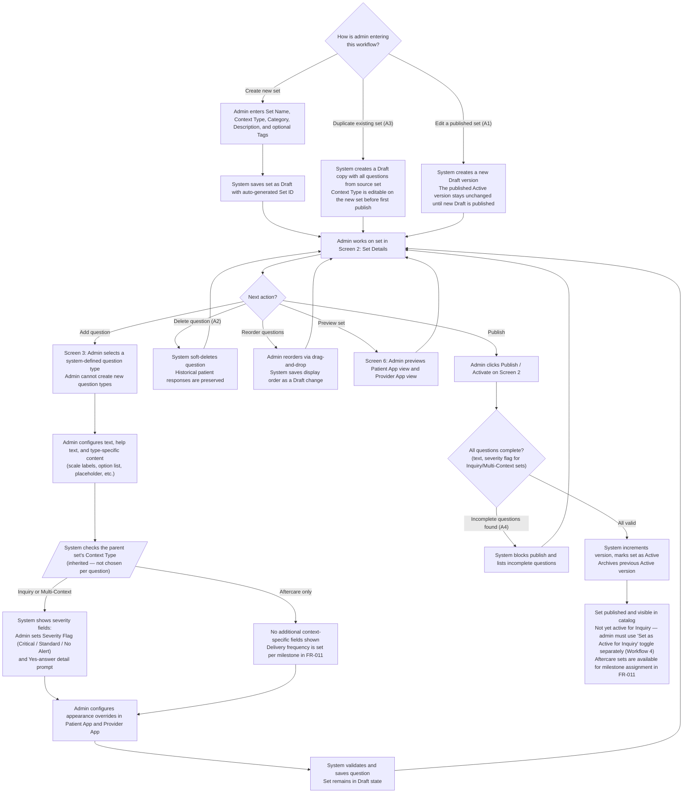
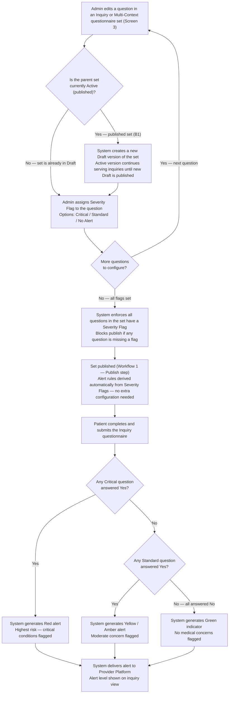
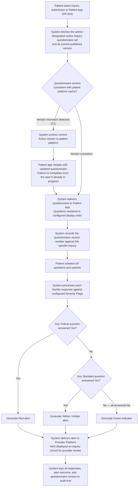
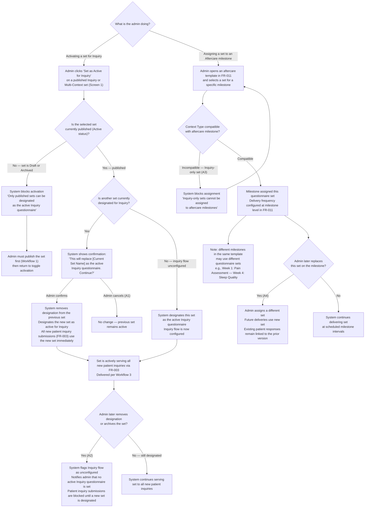

# FR-025 - Medical Questionnaire Management

**Module**: A-09: System Settings & Configuration  
**Feature Branch**: `fr025-medical-questionnaire-management`  
**Created**: 2025-10-23  
**Status**: ✅ Verified & Approved
**Source**: FR-025 from system-prd.md

## Executive Summary

The Medical Questionnaire Management module enables administrators to manage a central catalog of **questionnaire sets**, where each set is a named, versioned package of questions (e.g., "Medical Safety Screening", "Pain Assessment", "Sleep Quality Check"). Admins create and maintain questionnaire sets, add questions to them from system-defined question types, and configure how questions appear in the patient app and provider app. Published questionnaire sets are consumed by two downstream flows: (1) the inquiry submission flow uses the admin-designated active Inquiry-context set as the medical safety screening questionnaire — publishing a set does not automatically make it the active Inquiry set; the admin must explicitly toggle "Set as Active for Inquiry" on the Questionnaire Catalog — and (2) aftercare milestone templates assign individual questionnaire sets per milestone from the Aftercare catalog.

## Module Scope

### Multi-Tenant Architecture

- **Admin Platform (A-09)**: System Settings & Configuration
- **Integration Points**: Patient Platform (inquiry submission), Provider Platform (alert display)

### Communication Structure

- **Admin → System**: Questionnaire set and question management via admin platform
- **System → Patient Platform**: Dynamic questionnaire delivery per context (inquiry / aftercare milestone)
- **System → Provider Platform**: Medical alert generation (Inquiry context) and aftercare response summaries (Aftercare context)
- **System → All Platforms**: Version-controlled questionnaire set updates

### Entry Points

1. **Admin-Initiated**: Primary flow through the Questionnaire Catalog (Screen 1)
2. **System-Triggered (Inquiry)**: The admin-designated active Inquiry-context questionnaire set is delivered automatically during patient inquiry submission (FR-003). The active set is selected explicitly by the admin via the "Set as Active for Inquiry" toggle on the Questionnaire Catalog — publishing alone does not activate a set for the inquiry flow
3. **System-Triggered (Aftercare)**: Questionnaire set assigned to a milestone delivered according to the milestone schedule (FR-011)
4. **Provider-Viewed**: Inquiry alert summaries and aftercare response data displayed in provider platform

### Questionnaire Context Types

Context types are **system-defined** (fixed in source code). Admins cannot create or delete context types; they assign one to each questionnaire set they create.

| Context Type | Where Used | Question-Level Constraints |
|---|---|---|
| **Inquiry** | Patient inquiry submission (FR-003) | Yes/No recommended; other question types allowed after admin confirms a publish-time warning. Severity flag required per question; Yes-answer detail prompt required for Yes/No questions |
| **Aftercare** | Aftercare milestone templates (FR-011) | All system-defined types supported; no severity flags. Delivery frequency is set at milestone assignment time in FR-011 — not on the question itself |
| **Multi-Context** | Both flows | Supports all question types; severity flag and Yes-answer detail prompt required per question. Delivery frequency set in FR-011 when assigned to an aftercare milestone |

Each questionnaire set carries a required Context Type and optional tags (e.g., "pain", "sleep", "compliance"). Downstream modules filter the catalog by compatible Context Type when presenting assignment options.

## Business Workflows

### Workflow 1: Questionnaire Set Management (Primary Flow)

**Actors**: Admin, System
**Trigger**: Admin opens the Questionnaire Catalog to create, edit, or duplicate a questionnaire set
**Outcome**: A new version of a questionnaire set is published and available in the catalog. Publishing does not automatically designate a set as the active Inquiry questionnaire — that requires the separate "Set as Active for Inquiry" action (see Workflow 4)

**Flow Diagram** (includes alternative flows A1, A2, A3, A4):

### Workflow 2: Severity Management (Inquiry Context Only)

**Actors**: Admin, System, Alert Engine
**Scope**: Severity flags and the provider alert system apply exclusively to Inquiry-context and Multi-Context questionnaire sets. Aftercare-only sets do not use severity flags.
**Trigger**: Admin configures a question inside an Inquiry or Multi-Context questionnaire set, or a patient submits the Inquiry questionnaire
**Outcome**: Provider receives a colour-coded alert (Red / Amber / Green) reflecting the medical risk level of the patient's responses

**Flow Diagram** (includes alternative flow B1):

### Workflow 3: Questionnaire Deployment (System Flow)

**Actors**: System, Patient Platform, Provider Platform
**Trigger**: Patient starts the inquiry submission flow in the Patient App (FR-003)
**Outcome**: Patient's questionnaire responses are processed, tiered alerts are generated, and both the provider platform and audit trail are updated

**Flow Diagram** (includes alternative flow C1):

### Workflow 4: Inquiry Activation & Downstream Assignment

**Actors**: Admin, System, FR-003 (Inquiry), FR-011 (Aftercare Milestones)
**Trigger**: (a) Admin clicks "Set as Active for Inquiry" on a published Inquiry or Multi-Context set in the Questionnaire Catalog, or (b) Admin assigns a published Aftercare or Multi-Context set to a milestone in FR-011
**Outcome**: The designated set is actively serving patients — either as the admin-designated active Inquiry questionnaire in FR-003, or as a milestone-assigned questionnaire in one or more FR-011 aftercare templates

**Flow Diagram** (includes alternative flows A1, A2, A3, A4):

## Screen Specifications

### Admin Platform Screens

#### Screen 1: Questionnaire Catalog

**Purpose**: Main entry point for questionnaire management. Admin views all questionnaire sets, performs CRUD on sets, and sees where each set is currently in use across the platform.

**Data Fields**:

| Field Name | Type | Required | Description | Validation Rules |
| --- | --- | --- | --- | --- |
| Set Name | text (link) | Yes | Name of the questionnaire set; navigates to Screen 2 | Max 100 chars; unique |
| Context Type | enum | Yes | Inquiry / Aftercare / Multi-Context | System-defined values only |
| Question Count | derived | No | Total questions in this set | Auto-calculated |
| Status | enum | Yes | Draft / Active / Archived | System-managed |
| Version | derived | No | Current published version number | Auto-incremented on publish |
| Used In | derived | No | Where the set is currently assigned (e.g., "Inquiry Flow (active)", "Aftercare Template: Post-Op Recovery → Week 1 Milestone") | Auto-calculated |
| Last Modified | datetime | No | Timestamp of last change | ISO 8601 |
| Created By | text | No | Admin who created the set | From admin session |
| Inquiry Active | indicator | No | Shows "Active for Inquiry" badge on the set currently designated as the active Inquiry questionnaire. Only one set can have this designation at a time. Visible only on Inquiry and Multi-Context sets | System-managed; updated via "Set as Active for Inquiry" action |
| Search/Filters | control | No | Keyword search by Set Name. Filters: Context Type (Inquiry / Aftercare / Multi-Context / All), Status (Draft / Active / Archived / All), Category (from global category list / All) | Valid enums; filters applied with AND logic |
| Actions | action | — | View/Edit, Duplicate, Archive, Delete, **Set as Active for Inquiry** (shown only for published Inquiry / Multi-Context sets) | Delete blocked if set is in use; "Set as Active for Inquiry" blocked if set is Draft or Archived |

**Notes**:

- "Create New Questionnaire Set" button opens a creation form (Set Name, Context Type, Category, Description, Tags)

**Business Rules**:

- Sets currently assigned to the inquiry flow or at least one milestone template display their usage locations in the "Used In" column
- A set in use (designated for Inquiry or assigned to a milestone) cannot be deleted; it can only be Archived
- Archiving a set that is currently designated as the active Inquiry questionnaire removes the designation and flags the inquiry flow as unconfigured; system notifies admin
- **Publishing does not activate a set for the inquiry flow.** The admin must explicitly click "Set as Active for Inquiry" on a published Inquiry or Multi-Context set to designate it. This is a separate, deliberate action
- At most one set may be designated as the active Inquiry questionnaire at a time. Clicking "Set as Active for Inquiry" on a second set shows a confirmation dialog and, upon confirmation, transfers the designation from the previous set to the new one
- The "Set as Active for Inquiry" action is only available on sets with Status = Active (published) and Context Type = Inquiry or Multi-Context. It is hidden for Draft, Archived, and Aftercare-only sets
- If no set is currently designated for the inquiry flow, the catalog displays a warning banner: "No active Inquiry questionnaire set — patient inquiry submissions will be blocked until one is designated"
- Deleting a Draft set with no usages permanently removes it
- Duplicating a set creates a Draft copy with all questions; the copy's Context Type is editable before first publish; the copy does not inherit the Inquiry designation

---

#### Screen 2: Questionnaire Set Details

**Purpose**: Admin manages the full contents of one questionnaire set — metadata, ordered question list, and publish controls. Navigate here by clicking a set name on Screen 1.

**Set Metadata Fields**:

| Field Name | Type | Required | Description | Validation Rules |
| --- | --- | --- | --- | --- |
| Set Name | text | Yes | Name of the questionnaire set | Max 100 chars; unique |
| Context Type | select | Yes | Inquiry / Aftercare / Multi-Context | Locked when Status = Active; changing creates a new Draft version |
| Description | text | No | Optional free-text description | Max 500 chars |
| Category | select | Yes | Category assignment from global category list (Screen 4) | Must exist and be Active |
| Tags | chips | No | Free-form labels for search and filtering (e.g., "pain", "sleep", "compliance") | Optional |
| Status | enum | read-only | Draft / Active / Archived | System-managed badge |
| Version | number | read-only | Current published version number | Auto-incremented on publish |
| Used In | text | read-only | Usage locations (same as Screen 1) | Auto-calculated |

**Question List Fields** (one row per question; supports drag-and-drop reordering):

| Field Name | Type | Required | Description | Validation Rules |
| --- | --- | --- | --- | --- |
| # | number | Yes | Display order; drag handle for reordering | Integer ≥ 1; unique within set |
| Question Text | text | Yes | Truncated question preview; click to open Screen 3 | — |
| Question Type | label | Yes | System-defined type (e.g., Yes/No, Visual Scale 1–10) | Read-only after first save |
| Severity | badge | Conditional | Critical / Standard / No Alert | Required for Inquiry/Multi-Context sets; hidden for Aftercare-only sets |
| Status | badge | Yes | Active / Inactive | Default Active |
| Actions | action | — | Edit (opens Screen 3), Delete | Delete is soft; historical responses preserved |

**Notes**:

- "Add Question" button opens Screen 3 (Question Editor) for a new question
- "Preview" button opens Screen 6 (Questionnaire Preview) scoped to this set
- "Publish / Activate" button validates completeness and publishes the current draft as a new version
- "View Version History" link opens Screen 7 scoped to this set
- Breadcrumb navigation: Questionnaire Catalog → [Set Name]

**Business Rules**:

- Drag-and-drop reordering updates display order immediately and is saved as a Draft change
- Context Type cannot be changed while Status = Active; editing it creates a new Draft version automatically
- The set must have a Category assigned before publishing
- All questions in Inquiry/Multi-Context sets must have a Severity flag before publishing
- Publishing increments the version number and archives the previous Active version
- Delivery frequency for Aftercare questionnaire sets is not configured here; it is set per milestone when the set is assigned in FR-011

---

#### Screen 3: Question Editor

**Purpose**: Admin creates or edits a single question within a questionnaire set. Question types are system-defined (fixed in source code); admin selects from the available type list but cannot add new types. Admin configures question content, context-specific settings, and how the question appears in the patient app and provider app.

**Data Fields**:

| Field Name | Type | Required | Description | Validation Rules |
| --- | --- | --- | --- | --- |
| Question Type | select | Yes | System-defined type: Yes/No, Visual Scale 1–10, Numeric Scale 1–10, Multi-select, Free Text | Locked after first save; delete and recreate to change type |
| Question Text | rich text | Yes | Main question content shown to patient | Min 10 chars |
| Help Text | text | No | Sub-label displayed below the question in both apps | Max 300 chars |
| Detail Prompt (Yes answer) | text | Conditional | Prompt shown to patient when they answer Yes | Required for Yes/No questions in Inquiry/Multi-Context sets |
| Scale Point Labels | text ×10 | Conditional | Label for each point on the scale (e.g., 1 = None, 10 = Very Severe) | Required for Visual Scale 1–10 type |
| Scale Min / Max Labels | text ×2 | Conditional | Labels for minimum and maximum ends of the scale (e.g., 0 = No pain, 10 = Worst pain) | Required for Numeric Scale 1–10 type |
| Options | list | Conditional | Selectable answer options; admin adds/removes/reorders inline | Required for Multi-select type; min 2 options |
| Placeholder Text | text | Conditional | Input placeholder shown inside the text field | Optional for Free Text type |
| Max Characters | number | Conditional | Character limit for the text answer | Optional for Free Text type; integer > 0 |
| Severity Flag | select | Conditional | Critical / Standard / No Alert | Required for questions in Inquiry or Multi-Context sets; hidden for Aftercare-only sets |
| Alert Description | text | Conditional | Auto-populated description based on severity; editable | Auto-filled; required if Severity Flag is set |
| Patient App — Display Label | text | No | Overrides Question Text as the label shown in patient app | Max 200 chars; defaults to Question Text if empty |
| Patient App — Show Question Number | checkbox | No | Whether to prefix the question with its display number | Default: Yes |
| Patient App — Visible to Patient | checkbox | No | Whether the question is shown to the patient | Default: Yes |
| Provider App — Display Label | text | No | Label shown in provider summary view | Max 200 chars; defaults to Question Text if empty |
| Provider App — Highlight Response | checkbox | No | Whether to visually highlight this question's answer in the provider view | Default: No |
| Question ID | text | read-only | Auto-generated unique identifier | System-assigned |
| Created Date | datetime | read-only | Timestamp of question creation | ISO 8601 |
| Last Modified | datetime | read-only | Timestamp of last edit | ISO 8601 |
| Modified By | text | read-only | Admin who last edited this question | From admin session |
| Status | toggle | Yes | Active / Inactive | Default Active |

**Notes**:

- Conditional fields (Detail Prompt, Scale Labels, Options, Placeholder, Max Characters) are shown or hidden dynamically based on the selected Question Type
- Severity Flag and Alert Description are shown only if the parent questionnaire set's Context Type is Inquiry or Multi-Context
- For Yes/No questions with a Severity Flag: response color-coding in the provider view is automatic based on the flag value; no additional configuration is needed
- Question Type selection is presented as a list with a short description of each type to help admin choose correctly before locking in
- Delivery frequency (how often the patient is prompted to complete the questionnaire) is NOT configured per question here; it is set at the milestone level in FR-011 when the questionnaire set is assigned to a milestone in an aftercare template

**Business Rules**:

- Question Type is locked after first save; a confirmation dialog warns the admin before saving for the first time
- Incomplete questions (required fields missing) save as Inactive and are excluded from publish validation
- Changes to a question in an Active (published) set are saved as a Draft change on the parent set; the Active version continues to serve downstream consumers until the set is re-published
- Deleting a question performs a soft delete; historical patient responses referencing this question are preserved and remain accessible

---

#### Screen 4: Category Management

**Purpose**: Admin manages the global list of questionnaire set categories. Each questionnaire set is assigned one category, used for organising and filtering the catalog.

**Data Fields**:

| Field Name | Type | Required | Description | Validation Rules |
| --- | --- | --- | --- | --- |
| Category Name | text | Yes | Display name of the category | Max 100 chars; unique |
| Description | text | No | Purpose or scope of this category | Max 300 chars |
| Total Sets | derived | No | Count of questionnaire sets assigned to this category | Auto-calculated |
| Status | enum | Yes | Active / Inactive | Default Active |
| Actions | action | — | Edit, Deactivate, Delete | Delete blocked if sets are assigned to this category |

**Notes**:

- "Add Category" button opens an inline or modal creation form
- Example categories: Allergies, Cardiovascular, Medications, Previous Surgeries, Chronic Conditions, General Health

**Business Rules**:

- Category names must be unique
- Each questionnaire set belongs to exactly one category
- Deleting a category with assigned sets is blocked; admin must first reassign those sets or deactivate the category
- Deactivating a category hides it from the category picker in Screen 2 but does not remove existing assignments; affected sets are flagged as "Uncategorised" until reassigned

---

#### Screen 5: Context Type Reference

**Purpose**: Informational reference screen. Admin views the system-defined context types, their descriptions, which sets use each type, and which modules consume them. Context types are fixed in source code; this screen is read-only.

**Data Fields**:

| Field Name | Type | Required | Description | Validation Rules |
| --- | --- | --- | --- | --- |
| Context Type Name | text | read-only | System-defined label: Inquiry / Aftercare / Multi-Context | Fixed in source code |
| Description | text | read-only | What this context type means and where it is used in the platform | Fixed |
| Active Sets Count | derived | read-only | Number of Active questionnaire sets with this context type | Auto-calculated |
| Questionnaire Sets | list | read-only | Linked list of all sets assigned to this context type | Auto-calculated |
| Integration Points | text | read-only | Modules that consume this context type (e.g., FR-003: Inquiry, FR-011: Aftercare Milestones) | Fixed |

**Notes**:

- Context types are displayed in a fixed order: Inquiry, Aftercare, Multi-Context
- This screen serves as a reference for admins creating or assigning questionnaire sets

**Business Rules**:

- This screen is entirely read-only; no fields are editable
- Admins cannot create, rename, or delete context types; changes to context type definitions require a code deployment

---

#### Screen 6: Questionnaire Preview

**Purpose**: Admin previews how a questionnaire set will appear to patients in the mobile app and how submitted responses will be presented to providers. Accessible from Screen 2 via the "Preview" button.

**Data Fields**:

| Field Name | Type | Required | Description | Validation Rules |
| --- | --- | --- | --- | --- |
| View | tab selector | Yes | Patient App (Mobile) / Provider Summary | — |
| Test Mode | toggle | No | Enable sample response filling to simulate a completed submission | Off by default |
| Questionnaire Render | display | read-only | Full rendered questionnaire with question types, help text, and display label overrides applied in configured display order | Reflects current Draft state, not last published version |
| Sample Response Inputs | dynamic | Conditional | Input controls matching each question type; only active when Test Mode is on | Enabled only in Test Mode |
| Provider Summary Render | display | Conditional | Response summary as it would appear in the provider platform, including alert color-coding and highlighted responses | Only visible in Provider Summary tab with Test Mode on |
| Print Preview | action | No | Generate a printable version of the questionnaire | — |

**Notes**:

- Patient App (Mobile) tab renders questions in mobile-optimised layout with type-appropriate controls (scale sliders, checkbox groups, text inputs, etc.)
- Provider Summary tab shows the response format providers see, including any conditional color-coding derived from severity flags (Inquiry sets) or highlighted responses

**Business Rules**:

- Preview reflects the current saved Draft state of the set (all pending changes included); it does not show the last published version
- Test Mode submissions do not create any records; all inputs are discarded on exit
- Preview is scoped to one questionnaire set at a time; opened from Screen 2

---

#### Screen 7: Version History & Audit Trail

**Purpose**: Admin views the complete change history and audit log for a specific questionnaire set. Accessible from Screen 2 via the "View Version History" link.

**Version History Fields** (one row per published version):

| Field Name | Type | Required | Description | Validation Rules |
| --- | --- | --- | --- | --- |
| Version Number | number | read-only | Auto-incremented version identifier | Integer; assigned on each publish |
| Published Date | datetime | read-only | When this version was activated | ISO 8601 |
| Published By | text | read-only | Admin who published this version | From admin session |
| Question Count | number | read-only | Number of questions at the time of this version | Auto-captured on publish |
| Changes Summary | text | read-only | System-generated description of what changed from the prior version | Auto-generated |
| Status | enum | read-only | Active / Archived | System-managed |
| Actions | action | — | View Snapshot (read-only view of that version), Restore as New Draft | — |

**Audit Trail Fields** (one row per admin action on this set):

| Field Name | Type | Required | Description | Validation Rules |
| --- | --- | --- | --- | --- |
| Change Date | datetime | read-only | When the action was performed | ISO 8601 |
| Admin Name | text | read-only | Who performed the action | From admin session |
| Action Type | enum | read-only | Create Set / Edit Metadata / Add Question / Edit Question / Delete Question / Publish / Archive / Restore / **Set as Active for Inquiry** / **Remove Inquiry Designation** | System-defined |
| Question ID | text | read-only | Affected question identifier (if action is question-level) | Populated only for question-level actions |
| Change Details | text | read-only | Before and after values for all modified fields | System-generated |
| IP Address | text | read-only | IP address of the admin session for security tracking | System-captured |

**Notes**:

- "Restore as New Draft" creates a new Draft version of the set with the questions from the selected historical version; the currently Active version is not affected until the restored Draft is published

**Business Rules**:

- Version history and audit trail are maintained indefinitely and are tamper-proof
- All admin actions on the set — including metadata edits, question changes, and publish/archive events — are captured in the audit trail
- "View Snapshot" opens a read-only view of the questionnaire set at that version; no editing is possible from the snapshot view

## Business Rules

### Questionnaire Set Rules

1. **Set Structure Rules**
   - Each questionnaire set is a named, versioned package of questions with a single Context Type
   - A questionnaire set must contain at least one Active question before it can be published
   - Questions within a set are ordered; order determines display sequence to patients
   - A set may be duplicated to create a new Draft copy; the copy is independent of the source

2. **Question Type Rules**
   - Question types are system-defined (fixed in source code); admin selects from the available type list but cannot create, rename, or remove types
   - Available system-defined types: Yes/No, Visual Scale 1–10, Numeric Scale 1–10, Multi-select, Free Text
   - Question Type is locked after first save; changing type requires deleting and recreating the question

3. **Context-Specific Question Rules**
   - Questions in Inquiry or Multi-Context sets: Severity Flag is required; Yes-answer detail prompt is required for Yes/No questions
   - Questions in Aftercare or Multi-Context sets: no frequency setting at question level — delivery frequency is configured in FR-011 at the milestone assignment step
   - When an Inquiry set contains non-Yes/No questions, the system displays a publish-time warning reminding the admin that Inquiry questionnaires are typically Yes/No only. The admin may confirm and proceed — the warning does not block publishing

4. **Severity Flagging Rules** (Inquiry and Multi-Context sets only)
   - Critical questions: High-risk conditions (HIV, hepatitis, blood disorders, heart conditions)
   - Standard questions: Moderate concerns (allergies, medications, chronic conditions)
   - No Alert questions: General health status, lifestyle factors
   - Severity flags drive the automatic provider alert system for the inquiry flow only
   - Aftercare-only questionnaire sets do not have severity flags and do not generate inquiry-style alerts

5. **Category Rules**
   - Every questionnaire set must be assigned a category before it can be published
   - Categories are global across all questionnaire sets
   - Each questionnaire set belongs to exactly one category
   - Categories are used for organising and filtering the Questionnaire Catalog (Screen 1)

### Version Control Rules

1. **Change Management**
   - All question changes must be version controlled
   - Changes require admin authentication and authorization
   - Previous versions must be archived, not deleted
   - Version activation requires explicit admin confirmation
   - Rollback capability must be available for all versions

2. **Audit Requirements**
   - All changes must be logged with timestamp and admin identification
   - Audit trail must include before/after values for all modifications
   - Security information (IP address, session) must be tracked
   - Audit logs must be retained for compliance requirements
   - Audit trail must be tamper-proof and immutable

### Integration Rules

1. **Patient Platform Integration**
   - The admin-designated active Inquiry questionnaire set must be delivered dynamically to the patient inquiry process; publishing a set does not make it the active Inquiry set — the admin must explicitly toggle "Set as Active for Inquiry"
   - If no set is designated as the active Inquiry questionnaire, the system must block patient inquiry submissions and display a system-level warning to admins
   - Version consistency must be maintained across all platforms
   - Question formatting must be optimized for mobile devices
   - Validation rules must be consistent between admin and patient platforms
   - Error handling must provide clear user guidance

2. **Provider Platform Integration**
   - Medical alerts must be generated automatically from questionnaire responses
   - Alert severity must match question severity flags
   - Alert display must be consistent with color-coding standards
   - Provider notifications must be triggered by critical alerts
   - Alert history must be maintained for provider reference
   - FR-025 generates structured alert events (containing inquiry ID, alert level, triggering question IDs, and response summary) that are published to FR-020's notification engine for delivery to providers via their configured notification channels

3. **Aftercare Module Integration (FR-011)**

- Each aftercare milestone independently selects one questionnaire set from the catalog, filtered to Context Type = Aftercare or Multi-Context
- Different milestones within the same aftercare template may be assigned different questionnaire sets (e.g., Week 1 milestone → "Pain Assessment", Week 4 milestone → "Sleep Quality Check")
- Questionnaire sets with Context Type = Inquiry are not selectable in aftercare milestone assignments
- Delivery frequency (how often the patient is prompted to complete the questionnaire at a given milestone) is configured in FR-011 at the milestone assignment level — not in FR-025 at the question level
- Changing a milestone's assigned questionnaire set does not affect previously submitted patient responses; those remain linked to the version used at time of submission

### Data Integrity Rules

1. **Question Validation**
   - All questions must pass completeness validation before the parent set can be published
   - Question text must meet minimum length requirements
   - Severity flags must be assigned to all questions in Inquiry and Multi-Context sets
   - A category must be assigned to the questionnaire set
   - Duplicate question text within the same set must be prevented
   - Frequency is not a question-level field; it is not validated here

2. **System Consistency**
   - Questionnaire version must be consistent across all platforms
   - Alert generation rules must match severity flag assignments
   - Category assignment must be consistent across catalog views
   - Question order must be maintained during updates
   - System must handle concurrent admin modifications gracefully

## Success Criteria

### Admin Efficiency Metrics

- **SC-001**: Admin can create a new questionnaire set and add its first question in under 3 minutes
- **SC-002**: Admin can reorganize 20+ questions within a set using drag-and-drop in under 5 minutes
- **SC-003**: Admin can preview questionnaire changes in under 30 seconds
- **SC-004**: Admin can activate questionnaire updates in under 1 minute

### System Reliability Metrics

- **SC-005**: Questionnaire updates deploy to patient platform within 2 minutes
- **SC-006**: System maintains 99.9% uptime for questionnaire management
- **SC-007**: Version rollback completes within 1 minute
- **SC-008**: Audit trail captures 100% of admin actions

### Integration Performance Metrics

- **SC-009**: Patient questionnaire loads with current version in under 3 seconds
- **SC-010**: Medical alerts generate within 5 seconds of questionnaire completion
- **SC-011**: Provider platform receives alerts within 10 seconds
- **SC-012**: System handles 1000+ concurrent questionnaire completions

### Quality Assurance Metrics

- **SC-013**: 100% of questions pass validation before activation
- **SC-014**: Zero data loss during questionnaire updates
- **SC-015**: All audit trail entries are complete and accurate
- **SC-016**: Medical alert accuracy matches severity flag assignments

## Dependencies

### Internal Dependencies

- **FR-003**: Inquiry Submission & Distribution (consumes active Inquiry-context questionnaire set)
- **FR-011**: Aftercare & Recovery Management (milestones assign individual Aftercare-context questionnaire sets per milestone)
- **FR-020**: Notifications & Alerts (provider alert delivery for inquiry alerts; aftercare milestone reminders)
- **FR-001**: Patient Authentication & Profile Management (admin access control)

### External Dependencies

- **Medical Guidelines**: Reference materials for question content validation
- **Compliance Standards**: Healthcare data protection regulations
- **Rich Text Editor**: Advanced text formatting capabilities
- **Version Control System**: Change tracking and rollback capabilities

### Data Dependencies

- **Admin User Data**: From admin authentication and profile management
- **Questionnaire History**: From previous questionnaire versions and responses
- **Medical Standards**: From healthcare industry best practices
- **Audit Requirements**: From compliance and regulatory standards

## Assumptions

1. **Admin Expertise**: Admin users have sufficient medical knowledge to create appropriate questions
2. **Medical Compliance**: Question content aligns with healthcare industry standards
3. **System Performance**: Infrastructure can handle real-time questionnaire updates
4. **Data Security**: All questionnaire data meets healthcare compliance requirements
5. **Version Control**: System can maintain multiple questionnaire versions simultaneously
6. **Integration Stability**: Patient and provider platforms can handle dynamic questionnaire updates
7. **Audit Requirements**: Complete audit trail meets regulatory compliance needs
8. **User Training**: Admin users receive adequate training on questionnaire management
9. **Medical Review**: Question content undergoes medical professional review
10. **System Scalability**: Questionnaire management scales with platform growth

## Implementation Notes

### Technical Considerations

- **Real-time Updates**: Questionnaire changes must propagate immediately to patient platform
- **Version Management**: System must handle concurrent questionnaire versions gracefully
- **Data Integrity**: All changes must be atomic and consistent across platforms
- **Performance**: Questionnaire loading must be optimized for mobile devices

### Integration Points

- **Patient Module**: Dynamic questionnaire delivery during inquiry submission
- **Provider Module**: Medical alert generation and display
- **Admin Module**: Centralized questionnaire management interface
- **Audit Module**: Comprehensive change tracking and compliance reporting

### Security Considerations

- **Access Control**: Strict admin-only access to questionnaire management
- **Data Encryption**: All questionnaire data encrypted at rest and in transit
- **Audit Logging**: Comprehensive logging of all questionnaire modifications
- **Compliance**: Healthcare data protection regulations compliance

### Scalability Considerations

- **Question Volume**: System must handle large numbers of questions efficiently
- **Concurrent Users**: Multiple admins must be able to manage questionnaire simultaneously
- **Version Storage**: Efficient storage and retrieval of questionnaire versions
- **Global Deployment**: Questionnaire updates must deploy across all platform instances

---

## Appendix: Change Log

| Date | Version | Changes | Author |
|------|---------|---------|--------|
| 2025-10-23 | 1.0 | Initial PRD creation | AI |
| 2026-02-24 | 2.0 | Restructured to two-level model (Questionnaire Sets → Questions); updated screens, workflows, and FR-011 integration rule; decoupled publishing from inquiry activation (explicit "Set as Active for Inquiry" toggle) | AI |
| 2026-02-25 | 2.1 | Post-verification fixes: Inquiry question type constraint changed to soft warning (Yes/No recommended, other types allowed after admin confirms warning); replaced Visual Scale 1–5 with Visual Scale 1–10 as sole visual scale type; removed FR-002 as dependency (no data flow); added FR-020 alert event integration note; system PRD updated to defer Bulk Operations and Question Templates to V2, and align question grouping to set-level categorisation | AI |

---

## Appendix: Approvals

| Role | Name | Date | Signature/Approval |
|------|------|------|---------------------|
| Product Owner | TBD | 2026-02-25 | ✅ Verified & Approved |
| Technical Lead | TBD | 2026-02-25 | ✅ Verified & Approved |
| Stakeholder | TBD | 2026-02-25 | ✅ Verified & Approved |

---

**Template Version**: 2.0.0 (Constitution-Compliant)
**Constitution Reference**: Hairline Platform Constitution v1.0.0
**Last Updated**: 2026-02-25
