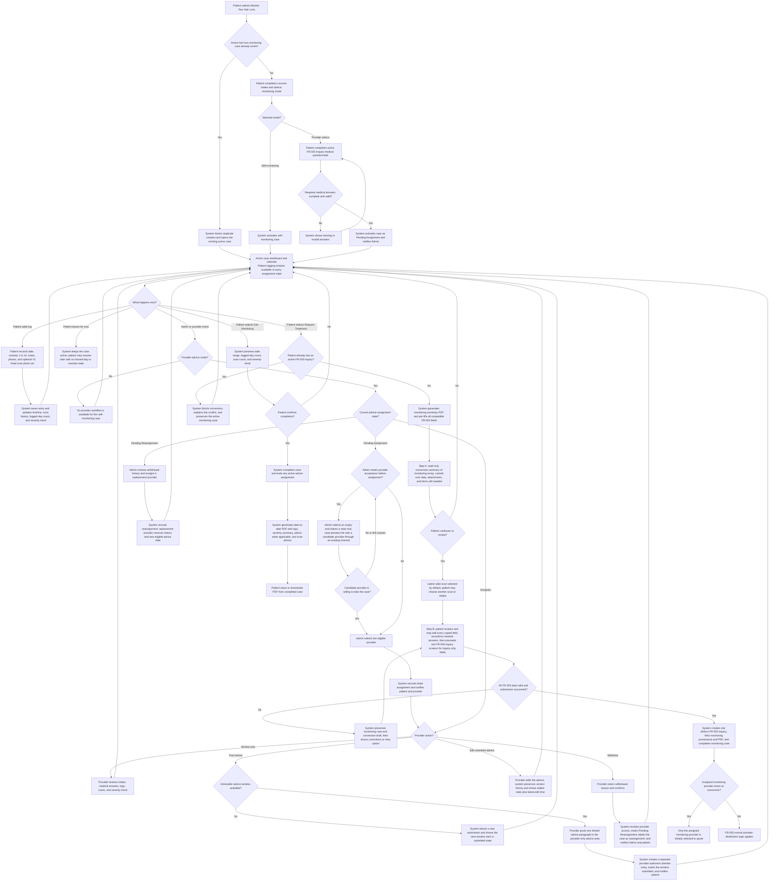

# FR-037 - Monitor Your Hair Loss

**Module**: P-05: Aftercare & Progress Monitoring | P-07: 3D Scan Capture & Viewing | PR-07: Communication & Messaging | A-01: Patient Management & Oversight | A-09: System Settings & Configuration | S-03: Notification Service | S-05: Media Processing Service
**Feature Branch**: `fr037-monitor-hair-loss`
**Created**: 2026-08-17
**Status**: Draft
**Source**: FR-037 from system-prd.md; product-owner requirements confirmed 2026-08-17 and clarified 2026-08-20; reuses compatible contracts from FR-002, FR-003, FR-020, and FR-025

---

## Executive Summary

Monitor Your Hair Loss gives a patient a structured, longitudinal record of their hair-loss condition before they decide whether to request treatment. A patient creates one active hair-loss monitoring case, records optional day-by-day entries, adds a severity score, notes, and standardized head scan photo sets, and can complete the case with a downloadable summary.

At case creation, the patient permanently chooses either self-monitoring or limited provider advice for that case. Advice-mode cases wait for Admin assignment while the patient continues logging. Admin may first share an expiring, read-only case preview with a candidate provider through an existing communication channel. An assigned provider sees the patient-parity monitoring calendar and can post one short, separate calendar advice entry from each configured window’s start date until it is submitted or superseded by the next window. Advice may be visibly edited with version history. The provider may withdraw, returning the case to Admin for clearly identified reassignment without interrupting patient logging.

The patient may convert an active case into a treatment inquiry under FR-003. Conversion completes the monitoring case, pre-fills all compatible inquiry information, permits the patient to review and edit every copied field, selects the latest scan by default while allowing another scan or a retake, and attaches a generated monitoring-summary PDF. The patient must not repeat information already supplied merely because they are changing services.

**V1 scan terminology**: In V1, all references to a “3D head scan” mean the standardized multi-view head scan photo set defined by FR-002. True 3D capture and viewing remain V2 scope.

---

## Module Scope

### Service Boundary: Self-Service Monitoring vs Aftercare Package (NON-NEGOTIABLE)

FR-037 is a **standalone, patient-driven self-service utility**. It is not an aftercare package and must never inherit aftercare mechanics. Reviewers and implementers must apply this boundary before raising a gap against this FR: an aftercare capability absent here is correct scope, not a defect.

| Capability | Aftercare package (FR-011 and related) | FR-037 self-service monitoring |
| --- | --- | --- |
| Cadence | Fixed clinical schedule with milestones | None; patient logs on any date, or not at all |
| Scan reminders / notifications to act | In scope — package drives the patient | **Out of scope** — no reminder feature belongs to this FR |
| Overdue, missed-day, compliance state | In scope | **Out of scope** — gaps are neutral forever |
| Care team relationship | Ongoing team, chat, prescriptions | One assigned provider, advice paragraphs only, advice mode only |
| Milestone-bound scan/task entities | In scope | **Out of scope** — monitoring uses its own flat entities |
| Progress presentation | Milestone-anchored progress views | Calendar, logged-day count, and severity trend derived from patient entries |

Notification scope for FR-037 is limited to the event list in Implementation Notes (assignment, advice, withdrawal, reassignment, completion, export-ready, conversion). FR-037 defines **no** patient-configurable logging or scan reminder.

### Multi-Tenant Architecture

- **Patient Platform (P-05, P-07)**: Case creation, mode selection, calendar, daily entries, severity tracking, scans, completion, PDF export, and conversion to FR-003.
- **Provider Platform (PR-07)**: Searchable assigned advice-case queue, patient-parity longitudinal calendar view, cadence-gated paragraph advice, and withdrawal.
- **Admin Platform (A-01, A-09)**: Case oversight, full audited editing, expiring pre-assignment case previews, provider assignment/reassignment, and advice-cadence configuration.
- **Shared Services (S-03, S-05)**: Assignment/advice notifications, secure scan media processing, PDF generation, and conversion orchestration.

### Multi-Tenant Breakdown

**Patient Platform (P-05, P-07)**:

- Starts a hair-loss monitoring case from the service gateway.
- Selects self-monitoring or provider-advice mode before activation.
- Completes a lightweight concern intake; advice mode additionally requires the active FR-025 Inquiry medical questionnaire before provider access.
- Logs optional entries on any date with severity from 1 to 10, notes, and scan photo sets.
- Continues logging while advice assignment is pending or pending reassignment.
- Completes the case, exports its summary PDF, or converts it into an FR-003 treatment inquiry.

**Provider Platform (PR-07)**:

- Sees only advice-mode cases currently assigned to the provider.
- Reviews intake, required medical answers, severity trend, entries, and scans.
- From each configured advice-window start date, may submit one concise advice paragraph. The window has no ordinary deadline and remains actionable until advice is submitted, except that an unsubmitted window expires when its next window opens.
- Each submitted advice creates its own provider-authored entry on the case tracking calendar; it is never attached to or stored as part of a patient log entry. Submitted advice remains editable with a visible edited state and latest-edit timestamp.
- Withdraws with a mandatory reason, after which access ends and Admin reassignment is required.
- Does not manage self-monitoring cases.

**Admin Platform (A-01, A-09)**:

- Views and edits every monitoring case and its information with actor, timestamp, reason, before-value, and after-value audit history.
- Assigns an eligible provider to a pending advice case and reassigns withdrawn cases.
- Generates a scoped case-preview link before assignment so a candidate provider can decide whether to accept the case; Admin selects the link expiry at share time.
- Distinguishes first assignment from reassignment in queues and case history.
- Configures the advice cadence as weekly or twice monthly.
- Supports self-monitoring cases without adding a provider.

**Shared Services (S-03, S-05)**:

- Stores monitoring media and entries securely and serves authorized tenant views.
- Generates date-to-date PDF summaries asynchronously and retains the generated artifact.
- Sends assignment, reassignment, advice, withdrawal, completion, export, and conversion notifications.
- Issues, validates, revokes, and audits expiring pre-assignment case-preview links.
- Performs idempotent transfer of compatible fields and attachments into FR-003.

### Communication Structure

**In Scope**:

- A short provider advice paragraph on an assigned advice-mode case.
- Patient notification when a provider is assigned, withdraws, is replaced, or posts advice.
- Provider and Admin notifications for assignment and reassignment actions.
- Advice history displayed chronologically within the monitoring case.
- An Admin-generated, read-only pre-assignment preview link shared through an existing external communication channel. Generating or viewing the preview does not assign the provider.

**Out of Scope**:

- An embedded or FR-037-specific chat screen, calls, diagnosis, prescriptions, or full medical consultation. Admin and a candidate provider may communicate through an existing channel before assignment, but that communication surface is not part of this FR.
- FR-012 secure messaging, which starts only after its own eligibility conditions are met.
- Provider advice for self-monitoring cases.
- Patient switching from self-monitoring to advice mode during an active case.
- Patient-configurable logging or scan reminders, and any nudge, streak, or adherence notification. Reminders belong to the aftercare package, not to this self-service FR.

### Entry Points

- Patient selects **Monitor Your Hair Loss** from FR-003 Screen 1: Service Selection.
- Patient opens the active case from the patient home/dashboard monitoring card.
- Provider opens **Hair Loss Monitoring Advice** from the provider dashboard.
- Admin opens **Monitoring Cases** or the pending assignment/reassignment queue.
- Patient opens conversion from the active case actions or from the completion flow.

---

## Business Workflows

### Unified Flow: Hair-Loss Monitoring Case Lifecycle

**Actors**: Patient, System, Admin, Provider when provider-advice mode is selected
**Trigger**: Patient selects Monitor Your Hair Loss or resumes an active monitoring case
**Outcome**: The patient continues monitoring, completes and exports the case, or converts it into a distinct FR-003 treatment inquiry

---

## Screen Specifications

> **Tenant screen ownership**:
>
> - **Patient App / Patient Platform (P-05, P-07)**: Screens 1-7 cover intake and mode selection, the active monitoring calendar, daily logs, scan capture/history, completion, PDF export, and conversion into FR-003.
> - **Provider Dashboard / Provider Platform (PR-07)**: Screens 8-10 exist only for provider-advice cases and cover the assigned advice queue, longitudinal review/advice, and provider withdrawal.
> - **Admin Dashboard / Admin Platform (A-01, A-09)**: Screens 11-12 cover monitoring oversight, initial assignment/reassignment, audited case correction, and advice-cadence configuration.

### Patient Platform Screens

#### Screen 1: Hair-Loss Monitoring Intake and Mode Selection

**Purpose**: Creates a monitoring case and captures reusable concern information.

| Field Name | Type | Required | Description | Validation Rules |
| --- | --- | --- | --- | --- |
| Monitoring Mode | radio | Yes | Self-monitoring or Provider advice | Immutable after activation |
| Nature of Concern | textarea | Yes | Current hair-loss concern | 1 to 2000 characters |
| Duration | select | Yes | How long the condition has been noticed | FR-003 Duration enum; identical value set so conversion copies without remapping |
| Previous Treatments | textarea | Yes | Previous treatment or “None” | Maximum 2000 characters |
| Current Severity | slider | Yes | Starting condition rating | Integer 1 to 10 |
| Lifestyle Factors | textarea | No | Relevant context | Maximum 2000 characters |
| Additional Notes | textarea | No | Other context | Maximum 2000 characters |
| Initial Photos | file list | No | Supporting current-condition images | FR-003 image limits |
| Initial Head Scan | capture | No | Initial V1 photo set | FR-002 quality contract |
| Medical Questionnaire | component | Conditional | Active Inquiry-context questionnaire | Required for provider advice mode |

**Business Rules**:

- A patient may have only one active hair-loss monitoring case.
- Mode cannot be changed after activation. A self-monitoring patient must complete the case before starting a new advice-mode case.
- A new monitoring case starts with its own intake; previous monitoring-case history is not attached to it.

#### Screen 2: Monitoring Dashboard and Calendar

**Purpose**: Provides the active case timeline, progress summary, and actions.

| Field Name | Type | Required | Description | Validation Rules |
| --- | --- | --- | --- | --- |
| Case Status | badge | Yes | Active or assignment state | Derived |
| Calendar | calendar | Yes | Dates with patient logs, scans, and separate provider-advice entries | Patient-local timezone; event author/type distinguishable |
| Logged Days | number | Yes | Unique dates with at least one entry | Derived |
| Severity Trend | chart | Yes | Rating over time | Derived from valid entries |
| Provider Advice Status | component | Conditional | Pending, assigned, or pending reassignment | Advice mode only |
| Advice Availability | status | Conditional | Future start date, available since date, submitted, or expired-unsubmitted | Advice mode and assigned only |
| Provider Advice Detail | detail panel | Conditional | Advice text, provider, original submission time, edited cue, and latest-edit time | Read-only to patient; separate from patient log detail |
| Add Log | action | Yes | Opens Screen 3 | Active cases only |
| Request Treatment | action | Yes | Opens Screen 7 Step A | Active cases only |
| End Monitoring | action | Yes | Opens Screen 5 | Active cases only |

**Business Rules**:

- No daily frequency is mandatory; missing dates are neutral and never overdue.
- Logging remains enabled during pending assignment and pending reassignment.
- Advice is shown chronologically as its own provider-authored calendar entry, never inside a patient log, and cannot be replied to as a chat thread.
- Edited advice shows a clear edited cue and latest-edit timestamp without exposing prior versions to the patient.

#### Screen 3: Daily Monitoring Log

**Purpose**: Records a dated observation using the same structure on every date.

| Field Name | Type | Required | Description | Validation Rules |
| --- | --- | --- | --- | --- |
| Log Date | date | Yes | Observation date | Not in future |
| Severity | slider | Yes | Condition rating | Integer 1 to 10 |
| Notes | textarea | No | Daily observation | Maximum 3000 characters |
| Photos | file list | No | Supporting images | Secure image limits |
| Head Scan | capture/select | No | V1 head scan photo set | FR-002 quality contract |

**Business Rules**:

- The patient may create, edit, or delete their own entries while the case is active; all versions remain auditable.
- Multiple entries on one date are allowed, but Logged Days counts the date once.
- Scan capture opens Screen 4 and links the resulting scan to the log date.

#### Screen 4: Head Scan Capture and History

**Purpose**: Captures or reviews standardized scan photo sets across the case.

| Field Name | Type | Required | Description | Validation Rules |
| --- | --- | --- | --- | --- |
| Capture Guidance | component | Yes | Front, top, left, and right guidance | FR-002 V1 contract |
| Photo Set | capture/upload | Yes | Standardized multi-view head photos | Quality and completeness validation |
| Captured At | datetime | Yes | Scan timestamp | System generated |
| Scan History | list | Yes | Previous scans and thumbnails | Current case only |

**Business Rules**:

- True 3D reconstruction is not required in V1.
- Patients can retake a failed-quality scan before saving.
- Providers can view scans only while assigned to the advice case.

#### Screen 5: Complete or Convert Monitoring Case

**Purpose**: Lets the patient deliberately end the active case.

| Field Name | Type | Required | Description | Validation Rules |
| --- | --- | --- | --- | --- |
| Case Summary | component | Yes | Date range, logged days, scans, severity trend | Derived |
| Completion Choice | radio | Yes | Complete and export, or Request Treatment | Single selection |
| Confirmation | checkbox | Yes | Acknowledges monitoring will end | Must be selected |

**Business Rules**:

- Completing or successfully converting ends the active case and any advice assignment.
- Conversion is not committed until the FR-003 inquiry is successfully submitted.
- A completed case is read-only except for Admin audited correction.

#### Screen 6: Monitoring Summary and PDF Export

**Purpose**: Displays the completed case and its downloadable report.

| Field Name | Type | Required | Description | Validation Rules |
| --- | --- | --- | --- | --- |
| Monitoring Period | date range | Yes | First through final case date | Derived |
| Logged Days | number | Yes | Unique dates logged | Derived |
| Severity Summary | component | Yes | First, latest, minimum, maximum, average, and trend | Derived |
| Log Timeline | list | Yes | Date-to-date entries and notes | Chronological |
| Head Scan Photos | gallery | Yes | Scans grouped by capture date | Authorized access only |
| Provider Advice | list | Conditional | Advice with provider and date | Advice mode only |
| PDF Status | status | Yes | Generating, ready, or failed | Derived |
| Download PDF | action | Conditional | Downloads ready report | Signed access link |

**Business Rules**:

- The PDF contains the complete date-to-date log, scan photos, logged-day count, and severity summary.
- Failed generation is retryable without altering the completed case.

#### Screen 7: Convert to Treatment Inquiry

**Purpose**: Turns a completed monitoring decision into an FR-003 inquiry through an explicit two-step handoff — first a read-only summary of everything the monitoring case carries over, then an editable review — before the patient enters the standard FR-003 inquiry screens.

**Step structure**: Screen 5 asks the patient to end the case by terminating (complete and export) or converting. Choosing conversion opens **Screen 7 Step A**, then **Screen 7 Step B**, then hands off to the FR-003 inquiry flow. Steps A and B belong to FR-037; every screen after the handoff belongs to FR-003 and is not redefined here.

##### Screen 7 Step A: Conversion Summary

**Purpose**: Gives the patient one consolidated preview of the monitoring record and the data that will populate the inquiry, so the volume of carried-over data points is understood before any form is opened. This step is what distinguishes conversion from a plain FR-003 start — an FR-003 inquiry begun from scratch has nothing to summarize.

| Field Name | Type | Required | Description | Validation Rules |
| --- | --- | --- | --- | --- |
| Monitoring Recap | component | Yes | Date range, logged days, scan count, severity summary and trend, advice count when applicable | Derived; read-only |
| Carried-Over Data Preview | grouped list | Yes | Every field that will pre-fill the inquiry, grouped as concern information, medical answers, selected scan, and attachments | Derived; read-only at this step |
| Items Still Needed | list | Yes | Inquiry-only information the patient must still supply, such as destinations, dates, and terms | Derived from FR-003 required set |
| Monitoring Summary PDF | attachment | Yes | Generated case summary that will attach to the inquiry | PDF; system generated |
| Provider Routing Notice | component | Conditional | States that the assigned advice provider will be the only initial quote recipient | Advice mode with active assignment only |
| Continue to Review | action | Yes | Opens Step B | Summary and PDF must be generated |
| Back | action | Yes | Returns to the active case with no state change | Monitoring stays active |

**Business Rules**:

- Step A is read-only. No field is edited and no inquiry record exists yet; the monitoring case is untouched until Step B submission succeeds.
- If PDF generation has not finished, Step A shows generation status and allows the patient to continue once it is ready or retry on failure.
- Leaving Step A never completes, converts, or alters the monitoring case.

##### Screen 7 Step B: Review and Edit Carried-Over Data

**Purpose**: Reviews and edits pre-filled FR-003 data before entering the remaining inquiry screens.

| Field Name | Type | Required | Description | Validation Rules |
| --- | --- | --- | --- | --- |
| Concern Information | editable component | Yes | Copied FR-003 Screen 3-compatible fields | FR-003 validation |
| Selected Head Scan | select/capture | Yes | Latest by default, another prior scan, or retake | FR-002 quality contract |
| Medical Answers | editable component | Yes | Previously answered items plus current active questions | Patient must review and reconfirm |
| Monitoring Summary PDF | attachment | Yes | Generated case summary | PDF; system generated |
| Inquiry-Only Fields | component | Yes | Destinations, dates, provider selection rules, terms | FR-003 owns validation |

**Business Rules**:

- Every copied field remains editable by the patient before submission.
- The patient answers only missing or newly required information and reconfirms existing medical answers.
- The monitoring case and inquiry remain distinct records linked by immutable conversion provenance.
- If an assigned advice provider exists at conversion, that provider is the only initial quote recipient. If none exists, FR-003 normal distribution applies.
- Completing Step B hands the patient into the standard FR-003 inquiry screens for the inquiry-only information. FR-037 does not duplicate those screens; it supplies pre-filled values and the summary PDF to them.
- Business Rule 7 release to normal FR-003 distribution is exercised **after** conversion, from the resulting FR-003 inquiry, not from Steps A or B. FR-003 owns that action and its confirmation.

### Provider Platform Screens

#### Screen 8: Provider Monitoring Advice Queue

**Purpose**: Shows and helps the provider find cases currently assigned to them.

| Field Name | Type | Required | Description | Validation Rules |
| --- | --- | --- | --- | --- |
| Assigned Cases | list | Yes | Active advice-mode cases | Assigned provider only |
| Search | text input | No | Finds cases by patient name or case ID | Debounced; scoped to assigned cases |
| Status Filter | multi-select | No | Filters by active assignment and case status | Valid values only |
| Advice Filter | select | No | All, advice available, awaiting future window, or submitted for current window | Derived from window state |
| Assignment Filter | select | No | All, initial assignment, or reassignment | Valid values only |
| Sort | select | No | Last patient log, advice availability, assignment date, or patient name | Valid values only |
| Last Patient Log | datetime | Yes | Most recent entry | Derived |
| Advice Availability | status | Yes | Available now or next date | Config-derived |
| Assignment Type | badge | Yes | Initial or reassignment | Derived |

**Business Rules**:

- Self-monitoring and unassigned cases never appear.
- Search, filters, sorting, and pagination compose without exposing cases assigned to another provider.
- Withdrawing removes the case from this queue immediately after confirmation.

#### Screen 9: Provider Monitoring Review and Advice

**Purpose**: Mirrors the patient’s full monitoring view for the assigned provider and adds a separate, cadence-controlled provider advice area.

| Field Name | Type | Required | Description | Validation Rules |
| --- | --- | --- | --- | --- |
| Case Header | component | Yes | Patient, case ID, mode, status, start date, assignment type, and assignment date | Read-only |
| Monitoring Dashboard | component | Yes | Same summary, trend, logged-day count, scan history, and status information visible to the patient | Read-only provider parity |
| Monitoring Calendar | calendar | Yes | Same dated calendar and event indicators visible to the patient | Read-only; any date may be opened |
| Daily Log Detail | detail panel | Conditional | Full patient-visible severity, notes, photos, scans, and entry version state for the selected date | Read-only |
| Medical Questionnaire | component | Yes | Required advice-mode medical answers | Read-only |
| Advice Window Stack | list | Yes | Current window plus the immediately superseded unsubmitted window when applicable, showing start date and available, submitted, or expired state | New window expires the prior unsubmitted window; only current available window is actionable |
| Provider Advice Area | component | Yes | Provider-only submission area separate from every patient log record | Enabled only for the current available window |
| Advice Paragraph | textarea | Conditional | One advice entry for the current available window | Maximum 1500 characters; stays enabled from window start until submitted or superseded |
| Advice History | list | Yes | Provider-authored calendar entries with original submission time, edited state, latest-edit time, and version history | Chronological; never attached to patient logs |
| Edit Advice | action | Conditional | Edits a submitted advice entry | Active assignment; audited; edited cue and latest-edit time required |
| Withdraw | action | No | Opens withdrawal confirmation | Active assignment only |

**Business Rules**:

- Advice is informational and must not be represented as diagnosis or prescription.
- Each window opens on its calculated start date and has no normal deadline. It remains available until its single advice entry is submitted.
- If the next calculated window opens while the prior window remains unsubmitted, the prior window alone expires and the new window becomes the sole actionable window. The two windows remain visibly stacked so the provider can see the superseded missed opportunity and the current opportunity.
- Submission creates a new provider-authored case-calendar entry. It must not mutate, annotate, or attach to a patient-authored daily log.
- A submitted advice entry may be edited; the patient, provider, and Admin views show that it was edited and when the latest edit occurred, while audit history preserves prior content.

#### Screen 10: Provider Withdrawal Confirmation

**Purpose**: Ends a provider assignment safely.

| Field Name | Type | Required | Description | Validation Rules |
| --- | --- | --- | --- | --- |
| Withdrawal Reason | textarea | Yes | Reason visible to Admin | 1 to 1000 characters |
| Confirmation | checkbox | Yes | Confirms immediate loss of access | Must be selected |

**Business Rules**:

- Withdrawal does not end the patient’s monitoring case.
- The case returns to Admin as Pending Reassignment and is clearly labeled as a reassignment.

### Admin Platform Screens

#### Screen 11: Admin Monitoring Cases and Assignment Queue

**Purpose**: Gives Admin a system-wide operational picture of monitoring cases and supports oversight, pre-assignment sharing, first assignment, and reassignment.

| Field Name | Type | Required | Description | Validation Rules |
| --- | --- | --- | --- | --- |
| Case List | table | Yes | All hair-loss monitoring cases | Paginated |
| Mode Tabs | tabs | Yes | All Cases, Self-Monitoring, and Provider Intervention | Counts and selected tab remain synchronized with filters |
| Search | text input | No | Finds by patient name, patient ID, case ID, assigned provider, or candidate provider | Debounced |
| Status Filters | multi-select | No | Active, completed, converted, pending assignment, pending reassignment | Valid values |
| Provider Filter | searchable select | No | Assigned provider, unassigned, or withdrawn-provider cases | Valid provider or derived state |
| Advice State Filter | multi-select | No | Available, awaiting future window, submitted, or expired-unsubmitted | Advice cases only |
| Date Filters | date range | No | Case start, last patient log, last advice, or completion date | Valid range |
| Sort | select | No | Updated date, start date, last patient log, advice availability, patient, or provider | Valid values |
| Case Identity | columns | Yes | Case ID, patient name and ID, mode, case status, and start date | Read-only summary |
| Activity Summary | columns | Yes | Last patient log, logged-day count, latest severity, scan count, last advice, and next/current advice state | Derived |
| Assignment Summary | columns | Conditional | Assigned provider, assignment state, assignment type, assignment date, and withdrawal indicator | Advice cases only |
| Assignment Type | badge | Conditional | Initial or reassignment | Advice cases only |
| Assign Provider | action | Conditional | Opens provider selector | Pending states only |
| Share Case Preview | action | Conditional | Creates a read-only preview for a candidate provider before assignment | Pending assignment or reassignment only |
| Preview Contents | review component | Conditional | Shows the exact read-only case overview and clinical summary that the candidate provider will receive | Must be reviewed before sharing; excludes patient direct-contact details and Admin-only audit/assignment data |
| Preview Expiry | duration selector | Conditional | Admin-selected lifetime for the preview link at share time | Required before link generation; must use an allowed duration |
| Preview Status | status | Conditional | Candidate provider, created by/time, expiry time, active/expired/revoked state, and last viewed time | Read-only except revoke action |

**Business Rules**:

- Reassignment cases display withdrawal reason and prior assignment history.
- The mode tabs are a primary partition: provider-intervention controls and advice fields do not appear as applicable on self-monitoring rows.
- Admin chooses the preview-link expiry each time Share is used. The preview is read-only, scoped to the minimum case information needed for an acceptance decision, audited, revocable, and does not grant assignment access.
- FR-037 does not embed a chat surface. Admin shares the preview link through an existing communication channel and records the eventual assignment decision in this screen.
- Assignment eligibility and Admin permissions are validated before save.

#### Screen 12: Admin Monitoring Case Detail and Configuration

**Purpose**: Gives Admin a patient-parity full case view plus complete audited operational control and configuration.

| Field Name | Type | Required | Description | Validation Rules |
| --- | --- | --- | --- | --- |
| Case Header | component | Yes | Case ID, patient identity and contact summary, mode, status, dates, completion/conversion state, and linked inquiry | Permission controlled |
| Intake and Medical Data | component | Yes | All intake answers and the advice-mode medical questionnaire visible in the patient case experience | Permission controlled; questionnaire conditional by mode |
| Monitoring Dashboard | component | Yes | Patient-parity summary, severity trend, logged-day count, scan history, and case status | Permission controlled |
| Monitoring Calendar | calendar | Yes | Full day-by-day patient calendar plus separate provider-advice entries | Any date/event may be opened; author type must be distinguishable |
| Daily Log Detail | editable detail panel | Conditional | Severity, notes, photos, scans, timestamps, author, and version state for a selected patient log | Permission controlled; audited edit reason required |
| Provider Advice Detail | editable detail panel | Conditional | Separate advice record, window, author, submission time, edited state, latest-edit time, and version history | Never attached to patient log; audited edit reason required |
| Assignment History | timeline | Conditional | Provider assignment lifecycle | Immutable events |
| Assignment Controls | component | Conditional | Candidate preview sharing, expiry/revocation, assignment, reassignment, and provider withdrawal context | Advice mode only; permission controlled |
| Advice Window History | list | Conditional | Window start, submitted/available/expired state, linked advice record, and supersession relationship | Advice mode only; versioned |
| Export and Conversion | component | Yes | PDF versions, export state, conversion summary, linked FR-003 inquiry, and provenance | Permission controlled |
| Edit Reason | textarea | Conditional | Reason for Admin mutation | Required before save |
| Advice Cadence | select | Yes | Weekly or twice monthly | Global active configuration; applies to cases created after the change only |
| Audit History | timeline | Yes | Before and after values, actor, reason, time | Read-only |

**Business Rules**:

- Admin may edit any case information, but no edit may erase historical values or provenance.
- Admin sees every field and dated record available in the patient case view, with additional assignment, advice-window, audit, preview-sharing, export, and conversion controls according to permission.
- Patient logs and provider advice remain separate record types and separate calendar entries even when they occur on the same date.
- Cadence changes apply prospectively to newly created cases only. Cases already created keep the cadence captured at their creation, so no in-flight advice window is shortened, extended, or recomputed, and no advice entry is retroactively created or removed.
- The cadence selector is a single global setting; Admin cannot set a case-specific cadence.

---

## Business Rules

### General Module Rules

- **Rule 1**: A patient may have one active case per monitoring type; an active FR-037 case does not block an active FR-038 case.
- **Rule 2**: Monitoring mode is chosen at creation and cannot change mid-case.
- **Rule 3**: Previous monitoring-case history is not linked to a newly created monitoring case. Full history linking is limited to conversion from that monitoring case into an FR-003 inquiry.
- **Rule 4**: Pending provider assignment or reassignment never blocks patient logging.
- **Rule 5**: Advice cadence is Admin-configurable as weekly or twice monthly, implemented as minimum intervals of 7 or 14 days. The setting is **global** — one value for the whole app, with no per-case, per-provider, or per-patient override.
- **Rule 5a**: A cadence change applies **only to cases created after the change**. Each case captures the active cadence value at creation and keeps it for the entire case lifetime, including through reassignment. An existing case never switches cadence mid-flight, so a partly elapsed advice window is never recomputed. A patient who already has an active case receives the new cadence on their next case.
- **Rule 5b**: An advice window becomes available on its calculated start date and otherwise has no deadline. The provider may submit its one advice entry at any later time until submission or until the next calculated window opens. If a successor opens first, only the older unsubmitted window expires; the successor becomes the sole actionable window, and both states remain visible together.
- **Rule 5c**: Provider advice is a separate provider-authored case-calendar record, never an attachment or annotation on a patient log. Submitted advice may be edited with immutable version history; patient, provider, and Admin views must show an edited cue and latest-edit timestamp.
- **Rule 5d**: Before assignment or reassignment, Admin may generate a read-only case-preview link for a candidate provider. Admin must select its expiry at share time. Preview access is audited, revocable, scoped to acceptance-decision information, and grants neither assignment nor ongoing case access. No FR-037 chat screen is created for this interaction.
- **Rule 6**: Completion and conversion are terminal case outcomes; a converted monitoring case remains distinct from the inquiry.
- **Rule 7**: If the exclusive assigned provider declines or lets the quote opportunity expire, distribution does not widen automatically. The patient may explicitly release the inquiry to normal FR-003 distribution.
- **Rule 8**: Monitoring has no required daily frequency and no overdue state. It also has no logging cadence, no milestones, and no patient reminders; those are aftercare-package mechanics excluded by the Service Boundary in Module Scope. The only cadence in this FR is the provider advice window in Rule 5, which limits the provider, not the patient.

### Data & Privacy Rules

- Monitoring entries, medical answers, scans, advice, assignments, and exports are medical data and require encryption in transit and at rest.
- Access is limited to the patient, authorized Admin users, and the currently assigned provider for advice-mode cases.
- Provider access ends immediately on withdrawal, reassignment away, case completion, or conversion.
- Case records, entries, advice, assignment history, conversion provenance, and PDF exports are retained for 7 years after completion or conversion.
- Raw monitoring scan media is medical data and is retained for 7 years after completion or conversion, matching the medical-record retention minimum. No shorter raw-media lifecycle applies.
- Every view, export, edit, assignment, withdrawal, and conversion of medical data is audited.
- Generated PDF links must be expiring, authorization-checked links.
- Pre-assignment preview links must use an unguessable token, expire at the Admin-selected time, support revocation, expose only the approved preview dataset, and record creation, access, expiry, and revocation events.

### Admin Editability Rules

**Editable by Admin**:

- All patient-supplied monitoring information, logs, severity ratings, scan metadata, assignment state, advice records, conversion links, and status where operational correction is required.
- Provider assignment and reassignment.
- Advice cadence selection between weekly and twice monthly.

**Fixed in Codebase (Not Editable)**:

- Encryption, authorization, audit immutability, one-active-case-per-type enforcement, and the rule that self mode cannot change mid-case.
- FR-003 conversion identity and idempotency controls.

**Configurable with Restrictions**:

- Admin edits require permission, a reason, and version history; edits cannot delete audit evidence.
- Cadence can use only the approved weekly and twice-monthly values in this release.

---

## Success Criteria

### Patient Experience Metrics

- 95% of valid monitoring-case creations complete without support intervention.
- 100% of active cases allow logging during pending assignment or reassignment.
- 100% of successful conversions pre-fill compatible FR-003 fields and permit editing before submission.

### Provider Efficiency Metrics

- Assigned case history loads within 3 seconds at p95 excluding original-media download.
- 100% of advice submissions enforce the configured cadence.
- 100% of withdrawals remove provider access and create a reassignment queue item.

### Admin Management Metrics

- 100% of advice-mode cases expose clear initial-assignment or reassignment state.
- 100% of Admin edits retain actor, reason, timestamp, before-value, and after-value.

### System Performance Metrics

- Daily-log saves complete within 2 seconds at p95 under normal load.
- PDF generation completes within 60 seconds for 95% of cases and is safely retryable.
- Duplicate conversion requests produce only one FR-003 inquiry.

### Business Impact Metrics

- Measure conversion from monitoring to FR-003 inquiry without counting case completion as treatment conversion.
- Track self-mode versus advice-mode engagement and provider effort separately.

---

## Dependencies

### Internal Dependencies (Other FRs/Modules)

- **FR-002**: V1 head scan photo-set capture and quality validation.
- **FR-003**: Service gateway, inquiry intake, active-inquiry rule, provider distribution, and conversion destination.
- **FR-004**: Quote creation for the exclusive assigned provider after conversion.
- **FR-020**: Notification event rules and delivery preferences.
- **FR-025**: Active Inquiry-context medical questionnaire for advice mode and conversion reconfirmation.
- **FR-026**: Privacy, security, consent, timezone, and file configuration.
- **FR-028**: Country and currency configuration for inquiry-only conversion fields.

### External Dependencies (APIs, Services)

- Secure object storage and signed media access.
- PDF rendering service with image embedding.
- Push and email delivery providers through S-03.

### Data Dependencies

- Patient profile and consent state.
- Monitoring case, entry, scan, assignment, advice, export, and conversion records.
- FR-025 questionnaire version and response snapshot.
- FR-003 inquiry schema and provider-distribution eligibility.

---

## Assumptions

### User Behavior Assumptions

- Patients understand severity 1 means least severe and 10 means most severe.
- Patients may log irregularly and are not penalized for gaps.
- Patients review pre-filled information before converting.

### Technology Assumptions

- V1 uses standardized photo sets rather than true 3D models.
- PDF generation can run asynchronously and notify the patient when ready.
- Conversion can use an idempotency key across monitoring and inquiry services.

### Business Process Assumptions

- Provider advice is a limited free service, not a full consultation.
- Admin selects providers manually for advice-mode cases.
- The provider assigned at conversion is eligible to receive the inquiry; otherwise Admin resolves eligibility before submission or the case follows the no-assigned-provider path.

---

## Implementation Notes

### Technical Considerations

- Use separate shared monitoring entities rather than FR-011 milestone-bound scan/task tables.
- Model case lifecycle separately from advice assignment lifecycle.
- Suggested case statuses: `active`, `completed`, `converted_to_inquiry`.
- Suggested advice statuses: `not_requested`, `pending_assignment`, `assigned`, `pending_reassignment`, `ended`.
- Use append-only versions for patient and Admin edits that affect clinical context.
- Store the advice cadence on the case at creation rather than reading the global setting at advice time, so a later Admin change cannot move an in-flight window.
- Retain raw scan media on the 7-year medical-record lifecycle; storage tiering may move it to cold storage but must not delete it earlier.

### Integration Points

- FR-003 receives compatible concern fields, selected scan, reconfirmed medical responses, and a generated PDF attachment.
- FR-003 must accept the system-generated PDF as an additional document even if its ordinary patient upload UI remains image/video-only.
- FR-004 restricts initial quote creation to the assigned monitoring provider when conversion carries an active assignment.
- FR-020 event candidates: `monitoring.assignment_pending`, `monitoring.provider_assigned`, `monitoring.provider_withdrawn`, `monitoring.provider_reassigned`, `monitoring.advice_posted`, `monitoring.completed`, `monitoring.export_ready`, and `monitoring.converted`.

### Scalability Considerations

- Paginate logs, scans, advice, and Admin queues.
- Generate PDFs and media derivatives asynchronously.
- Cache trend summaries while preserving source-entry accuracy.

### Security Considerations

- Recheck authorization on every signed media and PDF request.
- Revoke provider media access when assignment ends.
- Scan uploads and generated PDFs for malware before release.
- Never expose withdrawal reasons to another provider unless Admin includes an appropriate operational note.

---

## User Scenarios & Testing

### User Story 1 - Self-Monitor Hair Loss (Priority: P1)

**As a** patient, **I want** to record my hair-loss condition over time **so that** I can understand its progression without requesting provider advice.

**Acceptance Scenarios**:

1. Given no active FR-037 case, when the patient completes self-mode intake, then an active case opens without an assignment request.
2. Given an active case, when the patient logs severity and notes on irregular dates, then all entries appear correctly and no missing date is overdue.
3. Given self mode, when the patient looks for provider advice, then the app explains that mode cannot change until this case is completed.

### User Story 2 - Receive Limited Provider Advice (Priority: P1)

**As a** patient, **I want** a provider to periodically review my monitoring history **so that** I can receive limited guidance.

**Acceptance Scenarios**:

1. Given advice mode and completed medical questionnaire, when the case activates, then it is pending Admin assignment and logging is enabled.
2. Given an assigned provider and a window whose start date has arrived, when no advice has been submitted and no successor window has opened, then the advice area remains available without a deadline.
3. Given an unsubmitted available window, when its successor window opens, then the older window expires, the successor alone is actionable, and both appear stacked with distinct states.
4. Given submitted advice, when it is saved, then a separate provider-authored calendar entry is created and no patient log record is changed.
5. Given submitted advice, when the provider edits it, then the new content is shown with an edited cue and latest-edit timestamp and the prior version remains audited.
6. Given provider withdrawal, when the system commits withdrawal, then provider access ends, patient logging continues, and Admin sees a reassignment case.

### User Story 3 - Convert to Treatment Inquiry (Priority: P1)

**As a** patient, **I want** to reuse my monitoring data when requesting treatment **so that** I do not enter it again.

**Acceptance Scenarios**:

1. Given an active monitoring case and no active inquiry, when conversion opens, then compatible data is pre-filled and every copied field is editable.
2. Given multiple scans, when conversion opens, then the latest is selected by default and another scan or retake is available.
3. Given successful inquiry submission, then the monitoring case becomes converted, the inquiry remains distinct, and the PDF plus provenance link are attached.
4. Given an assigned advice provider, then only that provider initially receives quote access; given none, normal FR-003 distribution applies.

### Edge Cases

- Patient submits logs while provider assignment is pending or while reassignment is in progress.
- Admin shares a candidate-provider preview, then revokes it or allows it to expire without assigning that provider.
- A candidate provider opens a valid preview but is never assigned; preview access does not create assigned-case access.
- A provider leaves an advice window unsubmitted until the next window starts; the old window expires and the new window remains available.
- Patient creates a log on the same date that a provider submits advice; the calendar shows two separate authored records.
- Admin changes cadence while a current advice window is partly elapsed; the existing case keeps its creation-time cadence and the window is unaffected, while cases created afterwards use the new value.
- Provider withdraws while the patient is preparing conversion.
- Latest scan fails quality validation and patient selects an earlier valid scan.
- PDF generation fails after case completion and succeeds on retry.
- Conversion is retried after a network timeout without creating duplicate inquiries.
- Patient starts conversion but exits before submission; monitoring remains active.
- Admin corrects a severity value after PDF generation; the PDF is versioned and regenerated.

---

## Functional Requirements Summary

### Core Requirements

- **REQ-037-001**: System MUST enforce one active hair-loss monitoring case per patient.
- **REQ-037-002**: Patient MUST select self-monitoring or provider-advice mode before activation, and the mode MUST remain fixed for that case.
- **REQ-037-003**: System MUST provide optional dated logs with severity 1 to 10, notes, photos, and V1 head scan photo sets.
- **REQ-037-004**: System MUST allow logging during pending provider assignment and pending reassignment.
- **REQ-037-005**: Advice mode MUST require the active FR-025 Inquiry medical questionnaire before provider access.
- **REQ-037-006**: Admin MUST assign advice providers and clearly distinguish reassignment after withdrawal.
- **REQ-037-007**: Provider MUST be able to withdraw with a reason, ending access and returning the case to Admin.
- **REQ-037-008**: System MUST enforce a single global Admin-configurable weekly or twice-monthly advice cadence. Each case MUST capture the active cadence at creation and keep it for the case lifetime; a cadence change MUST apply only to cases created after the change.
- **REQ-037-023**: Each advice window MUST open on its calculated start date and remain actionable without an ordinary deadline until its single advice is submitted or a successor window opens; a successor MUST expire only the older unsubmitted window and become the sole actionable window.
- **REQ-037-024**: Submitted provider advice MUST create a separate provider-authored case-calendar record and MUST NOT attach to or modify any patient log record.
- **REQ-037-025**: Provider MUST be able to edit submitted advice while the system preserves immutable versions and displays an edited cue plus latest-edit timestamp to patient, provider, and Admin users.
- **REQ-037-026**: Provider and Admin listing screens MUST support scoped search, filters, sorting, and pagination; the Admin list MUST provide separate All Cases, Self-Monitoring, and Provider Intervention tabs with operational case, activity, and assignment summaries.
- **REQ-037-027**: Provider and Admin case-detail screens MUST include the full patient-visible monitoring dashboard, calendar, and day-level records, plus role-authorized advice and assignment controls.
- **REQ-037-028**: Admin MUST be able to generate and revoke a read-only pre-assignment case-preview link for a candidate provider, MUST select its expiry at share time, and preview access MUST NOT create an assignment or ongoing case access.
- **REQ-037-029**: FR-037 MUST NOT add an embedded chat screen for pre-assignment communication; the preview link is shared through an existing external communication channel.
- **REQ-037-021**: Conversion MUST present a read-only summary step showing the monitoring recap, all carried-over data, the summary PDF, and remaining inquiry-only items before any editable inquiry form is opened, and leaving that step MUST NOT alter the monitoring case.
- **REQ-037-022**: System MUST NOT provide patient logging or scan reminders, cadence, milestones, or overdue/compliance state; those belong to the aftercare package, not to this self-service FR.
- **REQ-037-009**: Patient MUST be able to complete the case and export a date-to-date PDF summary.
- **REQ-037-010**: Patient MUST be able to convert an active case into a distinct FR-003 inquiry.

### Data Requirements

- **REQ-037-011**: Conversion MUST pre-fill compatible information and allow the patient to edit all copied fields.
- **REQ-037-012**: Conversion MUST select the latest valid scan by default and allow another scan or retake.
- **REQ-037-013**: Conversion MUST attach a PDF containing logs, scan photos, logged-day count, and severity summary.
- **REQ-037-014**: Previous monitoring history MUST link to the FR-003 inquiry only through conversion and MUST NOT be attached to a newly created monitoring case.

### Security & Privacy Requirements

- **REQ-037-015**: System MUST enforce patient, current assigned provider, and authorized Admin access boundaries.
- **REQ-037-016**: System MUST audit all medical-data access, advice submissions and edits, preview-link creation/access/expiry/revocation, exports, assignments, withdrawals, and conversions.
- **REQ-037-017**: Admin edits MUST preserve version history and require a reason.

### Integration Requirements

- **REQ-037-018**: If an assigned advice provider exists at conversion, only that provider MUST initially be selected to quote; otherwise FR-003 normal distribution MUST apply.
- **REQ-037-019**: Monitoring MUST remain active if FR-003 submission fails and MUST terminate only after successful conversion commit or explicit completion.
- **REQ-037-020**: Conversion MUST be idempotent and MUST NOT create duplicate inquiries.

### Marking Unclear Requirements

No unresolved product requirements remain for Draft creation. Implementation must validate provider eligibility and final notification copy during technical design.

---

## Key Entities

1. **MonitoringCase**: Patient, type `hair_loss`, mode, case status, start/completion dates, intake snapshot, cadence-at-creation snapshot for advice mode, and conversion link.
2. **MonitoringEntry**: Patient-authored case log, log date, severity, notes, photos, creator, and version history.
3. **MonitoringScan**: Case/entry link, V1 photo-set media references, quality state, and capture timestamp.
4. **MonitoringProviderAssignment**: Case, provider, assignment type, status, dates, withdrawal reason, and Admin actor.
5. **MonitoringAdviceWindow**: Case, cadence snapshot, calculated start date, available/submitted/expired state, superseded-window link, and linked advice record.
6. **MonitoringAdvice**: Separate provider-authored case-calendar record with assignment, advice-window key, paragraph, author, original submission timestamp, edited state, latest-edit timestamp, and immutable versions; no patient-log foreign-key ownership.
7. **MonitoringCasePreview**: Case, candidate provider, approved preview dataset/version, token digest, created-by/time, Admin-selected expiry, access events, revocation state, and assignment-neutral outcome.
8. **MonitoringExport**: Case, report version, covered date range, metrics, PDF media reference, and generation state.
9. **MonitoringConversion**: Source case, destination inquiry, selected scan, field mapping version, PDF export, provider-routing rule, and idempotency key.

---

## Appendix: Change Log

| Version | Date | Changes | Author |
| --- | --- | --- | --- |
| 1.4 | 2026-08-20 | Separated provider advice from patient log records; defined open-until-submitted advice windows, supersession expiry, and visible advice edits; added expiring pre-assignment provider previews without embedded chat; expanded provider search/filtering and patient-parity review; expanded Admin mode tabs, list fields, and full-detail controls | Product Team |
| 1.3 | 2026-08-17 | Added the self-service vs aftercare service boundary (no reminders, cadence, milestones, or compliance state); aligned raw scan media retention to 7 years; bound the Duration field to the FR-003 enum; split conversion into Screen 7 Step A summary and Step B review with FR-003 handoff; made advice cadence global and snapshotted at case creation | Product Team |
| 1.2 | 2026-08-17 | Grouped Screens 1-12 under explicit Patient Platform, Provider Platform, and Admin Platform ownership sections following verified multi-tenant FR conventions | Product Team |
| 1.1 | 2026-08-17 | Consolidated all case-creation, monitoring, advice, reassignment, completion, export, exception, and conversion routes into one conditional lifecycle flow | Product Team |
| 1.0 | 2026-08-17 | Initial Draft: self/advice modes, provider assignment and withdrawal, longitudinal logs, PDF export, and FR-003 conversion | Product Team |

---

## Appendix: Approvals

| Role | Name | Status | Date |
| --- | --- | --- | --- |
| Product Owner | Pending | Pending Review | — |
| Technical Lead | Pending | Pending Review | — |
| Design Lead | Pending | Pending Review | — |
| Compliance Officer | Pending | Pending Review | — |

---

**Document Version**: 1.3
**Template Version**: 2.0.0
**Last Updated**: 2026-08-17
**Next Review**: Before implementation planning
