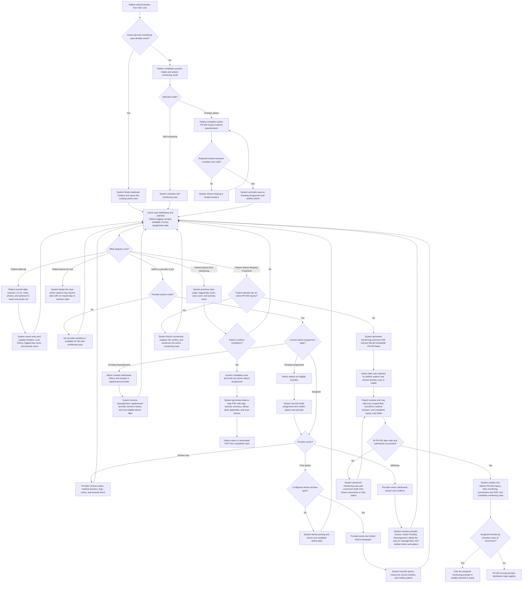

# FR-037 - Monitor Your Hair Loss

**Module**: P-05: Aftercare & Progress Monitoring | P-07: 3D Scan Capture & Viewing | PR-07: Communication & Messaging | A-01: Patient Management & Oversight | A-09: System Settings & Configuration | S-03: Notification Service | S-05: Media Processing Service
**Feature Branch**: `fr037-monitor-hair-loss`
**Created**: 2026-08-17
**Status**: Draft
**Source**: FR-037 from system-prd.md; product-owner requirements confirmed 2026-08-17; reuses compatible contracts from FR-002, FR-003, FR-020, and FR-025

---

## Executive Summary

Monitor Your Hair Loss gives a patient a structured, longitudinal record of their hair-loss condition before they decide whether to request treatment. A patient creates one active hair-loss monitoring case, records optional day-by-day entries, adds a severity score, notes, and standardized head scan photo sets, and can complete the case with a downloadable summary.

At case creation, the patient permanently chooses either self-monitoring or limited provider advice for that case. Advice-mode cases wait for Admin assignment while the patient continues logging. An assigned provider can review the monitoring history and post short advice at an Admin-configurable cadence. The provider may withdraw, returning the case to Admin for clearly identified reassignment without interrupting patient logging.

The patient may convert an active case into a treatment inquiry under FR-003. Conversion completes the monitoring case, pre-fills all compatible inquiry information, permits the patient to review and edit every copied field, selects the latest scan by default while allowing another scan or a retake, and attaches a generated monitoring-summary PDF. The patient must not repeat information already supplied merely because they are changing services.

**V1 scan terminology**: In V1, all references to a “3D head scan” mean the standardized multi-view head scan photo set defined by FR-002. True 3D capture and viewing remain V2 scope.

---

## Module Scope

### Multi-Tenant Architecture

- **Patient Platform (P-05, P-07)**: Case creation, mode selection, calendar, daily entries, severity tracking, scans, completion, PDF export, and conversion to FR-003.
- **Provider Platform (PR-07)**: Assigned advice-case queue, longitudinal read view, cadence-limited paragraph advice, and withdrawal.
- **Admin Platform (A-01, A-09)**: Case oversight, full audited editing, provider assignment/reassignment, and advice-cadence configuration.
- **Shared Services (S-03, S-05)**: Assignment/advice notifications, secure scan media processing, PDF generation, and conversion orchestration.

### Multi-Tenant Breakdown

**Patient Platform (P-05, P-07)**:

- Starts a hair-loss monitoring case from the service gateway.
- Selects self-monitoring or provider-advice mode before activation.
- Completes a lightweight concern intake; advice mode additionally requires the active FR-025 Inquiry medical questionnaire before provider access.
- Logs optional entries on any date with severity from 1 to 10, notes, and scan photo sets.
- Continues logging while advice assignment is pending or pending reassignment.
- Completes the case, exports its summary PDF, or converts it into an FR-003 treatment inquiry.

**Provider Platform (PR-07)**:

- Sees only advice-mode cases currently assigned to the provider.
- Reviews intake, required medical answers, severity trend, entries, and scans.
- Posts one concise paragraph of advice when the configured advice window is open.
- Withdraws with a mandatory reason, after which access ends and Admin reassignment is required.
- Does not manage self-monitoring cases.

**Admin Platform (A-01, A-09)**:

- Views and edits every monitoring case and its information with actor, timestamp, reason, before-value, and after-value audit history.
- Assigns an eligible provider to a pending advice case and reassigns withdrawn cases.
- Distinguishes first assignment from reassignment in queues and case history.
- Configures the advice cadence as weekly or twice monthly.
- Supports self-monitoring cases without adding a provider.

**Shared Services (S-03, S-05)**:

- Stores monitoring media and entries securely and serves authorized tenant views.
- Generates date-to-date PDF summaries asynchronously and retains the generated artifact.
- Sends assignment, reassignment, advice, withdrawal, completion, export, and conversion notifications.
- Performs idempotent transfer of compatible fields and attachments into FR-003.

### Communication Structure

**In Scope**:

- A short provider advice paragraph on an assigned advice-mode case.
- Patient notification when a provider is assigned, withdraws, is replaced, or posts advice.
- Provider and Admin notifications for assignment and reassignment actions.
- Advice history displayed chronologically within the monitoring case.

**Out of Scope**:

- Real-time chat, calls, diagnosis, prescriptions, or full medical consultation.
- FR-012 secure messaging, which starts only after its own eligibility conditions are met.
- Provider advice for self-monitoring cases.
- Patient switching from self-monitoring to advice mode during an active case.

### Entry Points

- Patient selects **Monitor Your Hair Loss** from FR-003 Screen 1: Service Selection.
- Patient opens the active case from the patient home/dashboard monitoring card.
- Provider opens **Hair Loss Monitoring Advice** from the provider dashboard.
- Admin opens **Monitoring Cases** or the pending assignment/reassignment queue.
- Patient opens conversion from the active case actions or from the completion flow.

---

## Business Workflows

### Unified Flow: Hair-Loss Monitoring Case Lifecycle

**Actors**: Patient, System, Admin, Provider when provider-advice mode is selected
**Trigger**: Patient selects Monitor Your Hair Loss or resumes an active monitoring case
**Outcome**: The patient continues monitoring, completes and exports the case, or converts it into a distinct FR-003 treatment inquiry

---

## Screen Specifications

> **Tenant screen ownership**:
>
> - **Patient App / Patient Platform (P-05, P-07)**: Screens 1-7 cover intake and mode selection, the active monitoring calendar, daily logs, scan capture/history, completion, PDF export, and conversion into FR-003.
> - **Provider Dashboard / Provider Platform (PR-07)**: Screens 8-10 exist only for provider-advice cases and cover the assigned advice queue, longitudinal review/advice, and provider withdrawal.
> - **Admin Dashboard / Admin Platform (A-01, A-09)**: Screens 11-12 cover monitoring oversight, initial assignment/reassignment, audited case correction, and advice-cadence configuration.

### Patient Platform Screens

#### Screen 1: Hair-Loss Monitoring Intake and Mode Selection

**Purpose**: Creates a monitoring case and captures reusable concern information.

| Field Name | Type | Required | Description | Validation Rules |
| --- | --- | --- | --- | --- |
| Monitoring Mode | radio | Yes | Self-monitoring or Provider advice | Immutable after activation |
| Nature of Concern | textarea | Yes | Current hair-loss concern | 1 to 2000 characters |
| Duration | select | Yes | How long the condition has been noticed | Active configured value |
| Previous Treatments | textarea | Yes | Previous treatment or “None” | Maximum 2000 characters |
| Current Severity | slider | Yes | Starting condition rating | Integer 1 to 10 |
| Lifestyle Factors | textarea | No | Relevant context | Maximum 2000 characters |
| Additional Notes | textarea | No | Other context | Maximum 2000 characters |
| Initial Photos | file list | No | Supporting current-condition images | FR-003 image limits |
| Initial Head Scan | capture | No | Initial V1 photo set | FR-002 quality contract |
| Medical Questionnaire | component | Conditional | Active Inquiry-context questionnaire | Required for provider advice mode |

**Business Rules**:

- A patient may have only one active hair-loss monitoring case.
- Mode cannot be changed after activation. A self-monitoring patient must complete the case before starting a new advice-mode case.
- A new monitoring case starts with its own intake; previous monitoring-case history is not attached to it.

#### Screen 2: Monitoring Dashboard and Calendar

**Purpose**: Provides the active case timeline, progress summary, and actions.

| Field Name | Type | Required | Description | Validation Rules |
| --- | --- | --- | --- | --- |
| Case Status | badge | Yes | Active or assignment state | Derived |
| Calendar | calendar | Yes | Dates with entries and scans | Patient-local timezone |
| Logged Days | number | Yes | Unique dates with at least one entry | Derived |
| Severity Trend | chart | Yes | Rating over time | Derived from valid entries |
| Provider Advice Status | component | Conditional | Pending, assigned, or pending reassignment | Advice mode only |
| Next Advice Date | date | Conditional | Earliest next advice posting date | Advice mode and assigned only |
| Add Log | action | Yes | Opens Screen 3 | Active cases only |
| Request Treatment | action | Yes | Opens Screen 7 | Active cases only |
| End Monitoring | action | Yes | Opens Screen 5 | Active cases only |

**Business Rules**:

- No daily frequency is mandatory; missing dates are neutral and never overdue.
- Logging remains enabled during pending assignment and pending reassignment.
- Advice is shown chronologically but cannot be replied to as a chat thread.

#### Screen 3: Daily Monitoring Log

**Purpose**: Records a dated observation using the same structure on every date.

| Field Name | Type | Required | Description | Validation Rules |
| --- | --- | --- | --- | --- |
| Log Date | date | Yes | Observation date | Not in future |
| Severity | slider | Yes | Condition rating | Integer 1 to 10 |
| Notes | textarea | No | Daily observation | Maximum 3000 characters |
| Photos | file list | No | Supporting images | Secure image limits |
| Head Scan | capture/select | No | V1 head scan photo set | FR-002 quality contract |

**Business Rules**:

- The patient may create, edit, or delete their own entries while the case is active; all versions remain auditable.
- Multiple entries on one date are allowed, but Logged Days counts the date once.
- Scan capture opens Screen 4 and links the resulting scan to the log date.

#### Screen 4: Head Scan Capture and History

**Purpose**: Captures or reviews standardized scan photo sets across the case.

| Field Name | Type | Required | Description | Validation Rules |
| --- | --- | --- | --- | --- |
| Capture Guidance | component | Yes | Front, top, left, and right guidance | FR-002 V1 contract |
| Photo Set | capture/upload | Yes | Standardized multi-view head photos | Quality and completeness validation |
| Captured At | datetime | Yes | Scan timestamp | System generated |
| Scan History | list | Yes | Previous scans and thumbnails | Current case only |

**Business Rules**:

- True 3D reconstruction is not required in V1.
- Patients can retake a failed-quality scan before saving.
- Providers can view scans only while assigned to the advice case.

#### Screen 5: Complete or Convert Monitoring Case

**Purpose**: Lets the patient deliberately end the active case.

| Field Name | Type | Required | Description | Validation Rules |
| --- | --- | --- | --- | --- |
| Case Summary | component | Yes | Date range, logged days, scans, severity trend | Derived |
| Completion Choice | radio | Yes | Complete and export, or Request Treatment | Single selection |
| Confirmation | checkbox | Yes | Acknowledges monitoring will end | Must be selected |

**Business Rules**:

- Completing or successfully converting ends the active case and any advice assignment.
- Conversion is not committed until the FR-003 inquiry is successfully submitted.
- A completed case is read-only except for Admin audited correction.

#### Screen 6: Monitoring Summary and PDF Export

**Purpose**: Displays the completed case and its downloadable report.

| Field Name | Type | Required | Description | Validation Rules |
| --- | --- | --- | --- | --- |
| Monitoring Period | date range | Yes | First through final case date | Derived |
| Logged Days | number | Yes | Unique dates logged | Derived |
| Severity Summary | component | Yes | First, latest, minimum, maximum, average, and trend | Derived |
| Log Timeline | list | Yes | Date-to-date entries and notes | Chronological |
| Head Scan Photos | gallery | Yes | Scans grouped by capture date | Authorized access only |
| Provider Advice | list | Conditional | Advice with provider and date | Advice mode only |
| PDF Status | status | Yes | Generating, ready, or failed | Derived |
| Download PDF | action | Conditional | Downloads ready report | Signed access link |

**Business Rules**:

- The PDF contains the complete date-to-date log, scan photos, logged-day count, and severity summary.
- Failed generation is retryable without altering the completed case.

#### Screen 7: Convert to Treatment Inquiry

**Purpose**: Reviews pre-filled FR-003 data before entering the remaining inquiry screens.

| Field Name | Type | Required | Description | Validation Rules |
| --- | --- | --- | --- | --- |
| Concern Information | editable component | Yes | Copied FR-003 Screen 3-compatible fields | FR-003 validation |
| Selected Head Scan | select/capture | Yes | Latest by default, another prior scan, or retake | FR-002 quality contract |
| Medical Answers | editable component | Yes | Previously answered items plus current active questions | Patient must review and reconfirm |
| Monitoring Summary PDF | attachment | Yes | Generated case summary | PDF; system generated |
| Inquiry-Only Fields | component | Yes | Destinations, dates, provider selection rules, terms | FR-003 owns validation |

**Business Rules**:

- Every copied field remains editable by the patient before submission.
- The patient answers only missing or newly required information and reconfirms existing medical answers.
- The monitoring case and inquiry remain distinct records linked by immutable conversion provenance.
- If an assigned advice provider exists at conversion, that provider is the only initial quote recipient. If none exists, FR-003 normal distribution applies.

### Provider Platform Screens

#### Screen 8: Provider Monitoring Advice Queue

**Purpose**: Shows cases currently assigned to the provider.

| Field Name | Type | Required | Description | Validation Rules |
| --- | --- | --- | --- | --- |
| Assigned Cases | list | Yes | Active advice-mode cases | Assigned provider only |
| Last Patient Log | datetime | Yes | Most recent entry | Derived |
| Advice Availability | status | Yes | Available now or next date | Config-derived |
| Assignment Type | badge | Yes | Initial or reassignment | Derived |

**Business Rules**:

- Self-monitoring and unassigned cases never appear.
- Withdrawing removes the case from this queue immediately after confirmation.

#### Screen 9: Provider Monitoring Review and Advice

**Purpose**: Provides a longitudinal view and limited advice action.

| Field Name | Type | Required | Description | Validation Rules |
| --- | --- | --- | --- | --- |
| Patient Monitoring Summary | component | Yes | Intake, trend, logs, and scans | Read-only |
| Medical Questionnaire | component | Yes | Required advice-mode medical answers | Read-only |
| Advice History | list | Yes | Previous advice paragraphs | Chronological |
| Advice Paragraph | textarea | Conditional | New limited advice | Maximum 1500 characters; window must be open |
| Withdraw | action | No | Opens withdrawal confirmation | Active assignment only |

**Business Rules**:

- Advice is informational and must not be represented as diagnosis or prescription.
- The provider can post once per configured window: every 7 days for weekly or every 14 days for twice monthly.

#### Screen 10: Provider Withdrawal Confirmation

**Purpose**: Ends a provider assignment safely.

| Field Name | Type | Required | Description | Validation Rules |
| --- | --- | --- | --- | --- |
| Withdrawal Reason | textarea | Yes | Reason visible to Admin | 1 to 1000 characters |
| Confirmation | checkbox | Yes | Confirms immediate loss of access | Must be selected |

**Business Rules**:

- Withdrawal does not end the patient’s monitoring case.
- The case returns to Admin as Pending Reassignment and is clearly labeled as a reassignment.

### Admin Platform Screens

#### Screen 11: Admin Monitoring Cases and Assignment Queue

**Purpose**: Supports oversight, first assignment, and reassignment.

| Field Name | Type | Required | Description | Validation Rules |
| --- | --- | --- | --- | --- |
| Case List | table | Yes | All hair-loss monitoring cases | Paginated |
| Status Filters | multi-select | No | Active, completed, converted, pending assignment, pending reassignment | Valid values |
| Mode Filter | select | No | Self or provider advice | Valid values |
| Assignment Type | badge | Conditional | Initial or reassignment | Advice cases only |
| Assign Provider | action | Conditional | Opens provider selector | Pending states only |

**Business Rules**:

- Reassignment cases display withdrawal reason and prior assignment history.
- Assignment eligibility and Admin permissions are validated before save.

#### Screen 12: Admin Monitoring Case Detail and Configuration

**Purpose**: Gives Admin complete audited control and configuration.

| Field Name | Type | Required | Description | Validation Rules |
| --- | --- | --- | --- | --- |
| Case Data | editable component | Yes | Intake, logs, scans, mode, status, and links | Permission controlled |
| Assignment History | timeline | Conditional | Provider assignment lifecycle | Immutable events |
| Advice History | list | Conditional | Provider advice | Versioned |
| Edit Reason | textarea | Conditional | Reason for Admin mutation | Required before save |
| Advice Cadence | select | Yes | Weekly or twice monthly | Global active configuration |
| Audit History | timeline | Yes | Before and after values, actor, reason, time | Read-only |

**Business Rules**:

- Admin may edit any case information, but no edit may erase historical values or provenance.
- Cadence changes apply prospectively; they do not retroactively create or remove advice entries.

---

## Business Rules

### General Module Rules

- **Rule 1**: A patient may have one active case per monitoring type; an active FR-037 case does not block an active FR-038 case.
- **Rule 2**: Monitoring mode is chosen at creation and cannot change mid-case.
- **Rule 3**: Previous monitoring-case history is not linked to a newly created monitoring case. Full history linking is limited to conversion from that monitoring case into an FR-003 inquiry.
- **Rule 4**: Pending provider assignment or reassignment never blocks patient logging.
- **Rule 5**: Advice cadence is Admin-configurable as weekly or twice monthly, implemented as minimum intervals of 7 or 14 days.
- **Rule 6**: Completion and conversion are terminal case outcomes; a converted monitoring case remains distinct from the inquiry.
- **Rule 7**: If the exclusive assigned provider declines or lets the quote opportunity expire, distribution does not widen automatically. The patient may explicitly release the inquiry to normal FR-003 distribution.
- **Rule 8**: Monitoring has no required daily frequency and no overdue state.

### Data & Privacy Rules

- Monitoring entries, medical answers, scans, advice, assignments, and exports are medical data and require encryption in transit and at rest.
- Access is limited to the patient, authorized Admin users, and the currently assigned provider for advice-mode cases.
- Provider access ends immediately on withdrawal, reassignment away, case completion, or conversion.
- Case records, entries, advice, assignment history, conversion provenance, and PDF exports are retained for 7 years after completion or conversion.
- Raw monitoring scan media is retained for 2 years after completion or conversion unless legal or consent policy requires longer retention.
- Every view, export, edit, assignment, withdrawal, and conversion of medical data is audited.
- Generated PDF links must be expiring, authorization-checked links.

### Admin Editability Rules

**Editable by Admin**:

- All patient-supplied monitoring information, logs, severity ratings, scan metadata, assignment state, advice records, conversion links, and status where operational correction is required.
- Provider assignment and reassignment.
- Advice cadence selection between weekly and twice monthly.

**Fixed in Codebase (Not Editable)**:

- Encryption, authorization, audit immutability, one-active-case-per-type enforcement, and the rule that self mode cannot change mid-case.
- FR-003 conversion identity and idempotency controls.

**Configurable with Restrictions**:

- Admin edits require permission, a reason, and version history; edits cannot delete audit evidence.
- Cadence can use only the approved weekly and twice-monthly values in this release.

---

## Success Criteria

### Patient Experience Metrics

- 95% of valid monitoring-case creations complete without support intervention.
- 100% of active cases allow logging during pending assignment or reassignment.
- 100% of successful conversions pre-fill compatible FR-003 fields and permit editing before submission.

### Provider Efficiency Metrics

- Assigned case history loads within 3 seconds at p95 excluding original-media download.
- 100% of advice submissions enforce the configured cadence.
- 100% of withdrawals remove provider access and create a reassignment queue item.

### Admin Management Metrics

- 100% of advice-mode cases expose clear initial-assignment or reassignment state.
- 100% of Admin edits retain actor, reason, timestamp, before-value, and after-value.

### System Performance Metrics

- Daily-log saves complete within 2 seconds at p95 under normal load.
- PDF generation completes within 60 seconds for 95% of cases and is safely retryable.
- Duplicate conversion requests produce only one FR-003 inquiry.

### Business Impact Metrics

- Measure conversion from monitoring to FR-003 inquiry without counting case completion as treatment conversion.
- Track self-mode versus advice-mode engagement and provider effort separately.

---

## Dependencies

### Internal Dependencies (Other FRs/Modules)

- **FR-002**: V1 head scan photo-set capture and quality validation.
- **FR-003**: Service gateway, inquiry intake, active-inquiry rule, provider distribution, and conversion destination.
- **FR-004**: Quote creation for the exclusive assigned provider after conversion.
- **FR-020**: Notification event rules and delivery preferences.
- **FR-025**: Active Inquiry-context medical questionnaire for advice mode and conversion reconfirmation.
- **FR-026**: Privacy, security, consent, timezone, and file configuration.
- **FR-028**: Country and currency configuration for inquiry-only conversion fields.

### External Dependencies (APIs, Services)

- Secure object storage and signed media access.
- PDF rendering service with image embedding.
- Push and email delivery providers through S-03.

### Data Dependencies

- Patient profile and consent state.
- Monitoring case, entry, scan, assignment, advice, export, and conversion records.
- FR-025 questionnaire version and response snapshot.
- FR-003 inquiry schema and provider-distribution eligibility.

---

## Assumptions

### User Behavior Assumptions

- Patients understand severity 1 means least severe and 10 means most severe.
- Patients may log irregularly and are not penalized for gaps.
- Patients review pre-filled information before converting.

### Technology Assumptions

- V1 uses standardized photo sets rather than true 3D models.
- PDF generation can run asynchronously and notify the patient when ready.
- Conversion can use an idempotency key across monitoring and inquiry services.

### Business Process Assumptions

- Provider advice is a limited free service, not a full consultation.
- Admin selects providers manually for advice-mode cases.
- The provider assigned at conversion is eligible to receive the inquiry; otherwise Admin resolves eligibility before submission or the case follows the no-assigned-provider path.

---

## Implementation Notes

### Technical Considerations

- Use separate shared monitoring entities rather than FR-011 milestone-bound scan/task tables.
- Model case lifecycle separately from advice assignment lifecycle.
- Suggested case statuses: `active`, `completed`, `converted_to_inquiry`.
- Suggested advice statuses: `not_requested`, `pending_assignment`, `assigned`, `pending_reassignment`, `ended`.
- Use append-only versions for patient and Admin edits that affect clinical context.

### Integration Points

- FR-003 receives compatible concern fields, selected scan, reconfirmed medical responses, and a generated PDF attachment.
- FR-003 must accept the system-generated PDF as an additional document even if its ordinary patient upload UI remains image/video-only.
- FR-004 restricts initial quote creation to the assigned monitoring provider when conversion carries an active assignment.
- FR-020 event candidates: `monitoring.assignment_pending`, `monitoring.provider_assigned`, `monitoring.provider_withdrawn`, `monitoring.provider_reassigned`, `monitoring.advice_posted`, `monitoring.completed`, `monitoring.export_ready`, and `monitoring.converted`.

### Scalability Considerations

- Paginate logs, scans, advice, and Admin queues.
- Generate PDFs and media derivatives asynchronously.
- Cache trend summaries while preserving source-entry accuracy.

### Security Considerations

- Recheck authorization on every signed media and PDF request.
- Revoke provider media access when assignment ends.
- Scan uploads and generated PDFs for malware before release.
- Never expose withdrawal reasons to another provider unless Admin includes an appropriate operational note.

---

## User Scenarios & Testing

### User Story 1 - Self-Monitor Hair Loss (Priority: P1)

**As a** patient, **I want** to record my hair-loss condition over time **so that** I can understand its progression without requesting provider advice.

**Acceptance Scenarios**:

1. Given no active FR-037 case, when the patient completes self-mode intake, then an active case opens without an assignment request.
2. Given an active case, when the patient logs severity and notes on irregular dates, then all entries appear correctly and no missing date is overdue.
3. Given self mode, when the patient looks for provider advice, then the app explains that mode cannot change until this case is completed.

### User Story 2 - Receive Limited Provider Advice (Priority: P1)

**As a** patient, **I want** a provider to periodically review my monitoring history **so that** I can receive limited guidance.

**Acceptance Scenarios**:

1. Given advice mode and completed medical questionnaire, when the case activates, then it is pending Admin assignment and logging is enabled.
2. Given an assigned provider and open advice window, when advice is posted, then it appears in the case and the next window is enforced.
3. Given provider withdrawal, when the system commits withdrawal, then provider access ends, patient logging continues, and Admin sees a reassignment case.

### User Story 3 - Convert to Treatment Inquiry (Priority: P1)

**As a** patient, **I want** to reuse my monitoring data when requesting treatment **so that** I do not enter it again.

**Acceptance Scenarios**:

1. Given an active monitoring case and no active inquiry, when conversion opens, then compatible data is pre-filled and every copied field is editable.
2. Given multiple scans, when conversion opens, then the latest is selected by default and another scan or retake is available.
3. Given successful inquiry submission, then the monitoring case becomes converted, the inquiry remains distinct, and the PDF plus provenance link are attached.
4. Given an assigned advice provider, then only that provider initially receives quote access; given none, normal FR-003 distribution applies.

### Edge Cases

- Patient submits logs while provider assignment is pending or while reassignment is in progress.
- Admin changes cadence while a current advice window is partly elapsed.
- Provider withdraws while the patient is preparing conversion.
- Latest scan fails quality validation and patient selects an earlier valid scan.
- PDF generation fails after case completion and succeeds on retry.
- Conversion is retried after a network timeout without creating duplicate inquiries.
- Patient starts conversion but exits before submission; monitoring remains active.
- Admin corrects a severity value after PDF generation; the PDF is versioned and regenerated.

---

## Functional Requirements Summary

### Core Requirements

- **REQ-037-001**: System MUST enforce one active hair-loss monitoring case per patient.
- **REQ-037-002**: Patient MUST select self-monitoring or provider-advice mode before activation, and the mode MUST remain fixed for that case.
- **REQ-037-003**: System MUST provide optional dated logs with severity 1 to 10, notes, photos, and V1 head scan photo sets.
- **REQ-037-004**: System MUST allow logging during pending provider assignment and pending reassignment.
- **REQ-037-005**: Advice mode MUST require the active FR-025 Inquiry medical questionnaire before provider access.
- **REQ-037-006**: Admin MUST assign advice providers and clearly distinguish reassignment after withdrawal.
- **REQ-037-007**: Provider MUST be able to withdraw with a reason, ending access and returning the case to Admin.
- **REQ-037-008**: System MUST enforce Admin-configurable weekly or twice-monthly advice cadence.
- **REQ-037-009**: Patient MUST be able to complete the case and export a date-to-date PDF summary.
- **REQ-037-010**: Patient MUST be able to convert an active case into a distinct FR-003 inquiry.

### Data Requirements

- **REQ-037-011**: Conversion MUST pre-fill compatible information and allow the patient to edit all copied fields.
- **REQ-037-012**: Conversion MUST select the latest valid scan by default and allow another scan or retake.
- **REQ-037-013**: Conversion MUST attach a PDF containing logs, scan photos, logged-day count, and severity summary.
- **REQ-037-014**: Previous monitoring history MUST link to the FR-003 inquiry only through conversion and MUST NOT be attached to a newly created monitoring case.

### Security & Privacy Requirements

- **REQ-037-015**: System MUST enforce patient, current assigned provider, and authorized Admin access boundaries.
- **REQ-037-016**: System MUST audit all medical-data access, edits, exports, assignments, withdrawals, and conversions.
- **REQ-037-017**: Admin edits MUST preserve version history and require a reason.

### Integration Requirements

- **REQ-037-018**: If an assigned advice provider exists at conversion, only that provider MUST initially be selected to quote; otherwise FR-003 normal distribution MUST apply.
- **REQ-037-019**: Monitoring MUST remain active if FR-003 submission fails and MUST terminate only after successful conversion commit or explicit completion.
- **REQ-037-020**: Conversion MUST be idempotent and MUST NOT create duplicate inquiries.

### Marking Unclear Requirements

No unresolved product requirements remain for Draft creation. Implementation must validate provider eligibility and final notification copy during technical design.

---

## Key Entities

1. **MonitoringCase**: Patient, type `hair_loss`, mode, case status, start/completion dates, intake snapshot, and conversion link.
2. **MonitoringEntry**: Case, log date, severity, notes, photos, creator, and version history.
3. **MonitoringScan**: Case/entry link, V1 photo-set media references, quality state, and capture timestamp.
4. **MonitoringProviderAssignment**: Case, provider, assignment type, status, dates, withdrawal reason, and Admin actor.
5. **MonitoringAdvice**: Assignment, advice paragraph, advice-window key, author, timestamp, and version state.
6. **MonitoringExport**: Case, report version, covered date range, metrics, PDF media reference, and generation state.
7. **MonitoringConversion**: Source case, destination inquiry, selected scan, field mapping version, PDF export, provider-routing rule, and idempotency key.

---

## Appendix: Change Log

| Version | Date | Changes | Author |
| --- | --- | --- | --- |
| 1.2 | 2026-08-17 | Grouped Screens 1-12 under explicit Patient Platform, Provider Platform, and Admin Platform ownership sections following verified multi-tenant FR conventions | Product Team |
| 1.1 | 2026-08-17 | Consolidated all case-creation, monitoring, advice, reassignment, completion, export, exception, and conversion routes into one conditional lifecycle flow | Product Team |
| 1.0 | 2026-08-17 | Initial Draft: self/advice modes, provider assignment and withdrawal, longitudinal logs, PDF export, and FR-003 conversion | Product Team |

---

## Appendix: Approvals

| Role | Name | Status | Date |
| --- | --- | --- | --- |
| Product Owner | Pending | Pending Review | — |
| Technical Lead | Pending | Pending Review | — |
| Design Lead | Pending | Pending Review | — |
| Compliance Officer | Pending | Pending Review | — |

---

**Document Version**: 1.2
**Template Version**: 2.0.0
**Last Updated**: 2026-08-17
**Next Review**: Before implementation planning
