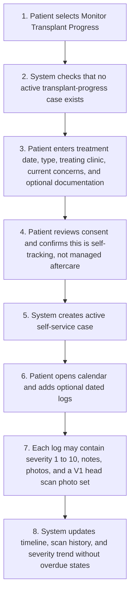
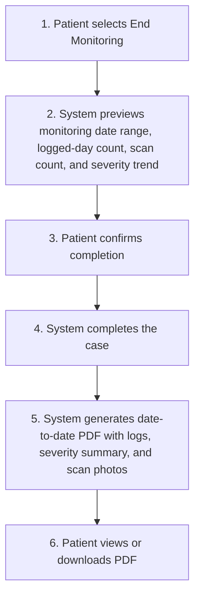
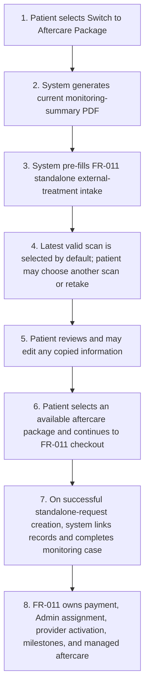
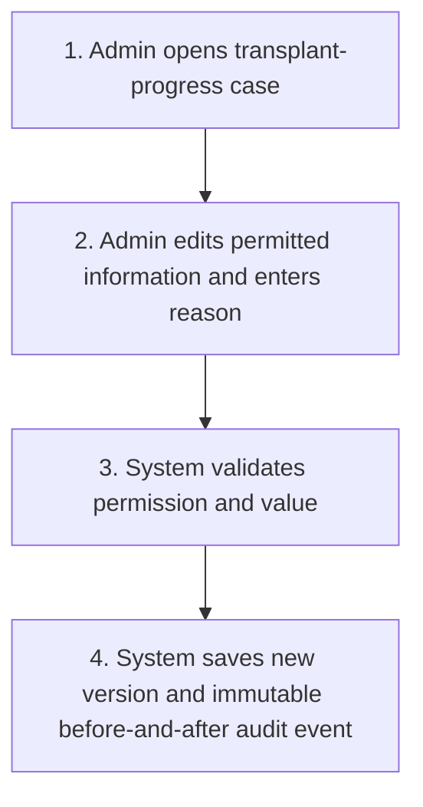
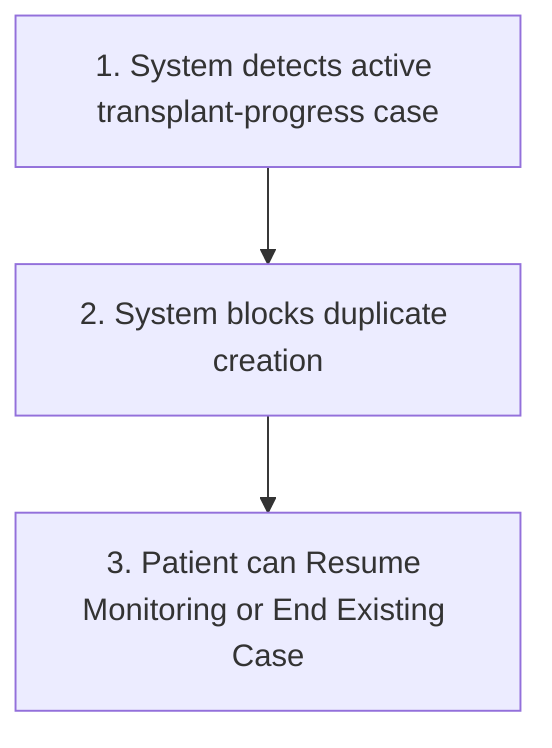
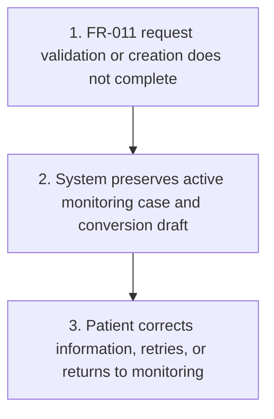

# FR-038 - Monitor Your Transplant Progress

**Module**: P-05: Aftercare & Progress Monitoring | P-07: 3D Scan Capture & Viewing | A-01: Patient Management & Oversight | S-03: Notification Service | S-05: Media Processing Service
**Feature Branch**: `fr038-monitor-transplant-progress`
**Created**: 2026-08-17
**Status**: Draft
**Source**: FR-038 from system-prd.md; product-owner requirements confirmed 2026-08-17; reuses compatible standalone-treatment intake from FR-011 and scan contracts from FR-002

---

## Executive Summary

Monitor Your Transplant Progress is a self-service utility for patients whose hair transplant may have been performed outside Hairline and who want to record recovery progress without buying an aftercare package. The patient creates one active transplant-progress monitoring case, records optional day-by-day entries, severity ratings, notes, photos, and standardized head scan photo sets, and may complete the case with a downloadable summary report.

This feature is intentionally distinct from FR-011 aftercare. It has no provider advice, no assigned provider, no required logging schedule, no clinical milestones, no overdue/compliance state, and no aftercare obligation. This separation avoids clinic conflicts of interest and prevents a free self-tracking tool from being represented as managed aftercare.

The patient may convert the active monitoring case into FR-011 standalone aftercare. Conversion completes the monitoring case only after the standalone-aftercare request is successfully created, pre-fills compatible external-treatment information, lets the patient edit every copied field, selects the latest scan by default while permitting another scan or a retake, and carries the monitoring-summary PDF into the aftercare request. FR-011 then exclusively owns package selection, payment, Admin assignment, provider activation, milestones, and managed aftercare.

**V1 scan terminology**: In V1, all references to a “3D head scan” mean the standardized multi-view head scan photo set defined by FR-002. True 3D capture and viewing remain V2 scope.

---

## Module Scope

### Multi-Tenant Architecture

- **Patient Platform (P-05, P-07)**: External-treatment intake, self-paced calendar, daily logs, scans, completion, PDF export, and conversion to FR-011 standalone aftercare.
- **Provider Platform (Not applicable)**: No operational surface. Providers cannot view, advise, or manage FR-038 cases.
- **Admin Platform (A-01)**: Full case visibility and audited editing for support, privacy, and operational correction.
- **Shared Services (S-03, S-05)**: Patient notifications, secure scan processing, PDF generation, and conversion orchestration.

### Multi-Tenant Breakdown

**Patient Platform (P-05, P-07)**:

- Creates a transplant-progress case using treatment details compatible with FR-011 standalone aftercare intake.
- Adds optional logs on any date with recovery severity/condition rating, notes, photos, and V1 head scan photo sets.
- Views a calendar, scan history, and trend summary without mandatory prompts.
- Completes the case, downloads the summary PDF, or converts the active case into standalone aftercare.

**Provider Platform (Not applicable)**:

- No provider is assigned to an FR-038 case.
- No provider dashboard, advice, chat, review queue, or patient-data access is included.
- Provider access begins only if a converted FR-011 aftercare request later completes the FR-011 assignment and activation workflow.

**Admin Platform (A-01)**:

- Views all self-service cases and supports the patient when needed.
- May edit any case information with actor, timestamp, reason, before-value, and after-value audit history.
- Cannot turn an FR-038 case into provider-managed monitoring; conversion to FR-011 is the only managed-aftercare route.

**Shared Services (S-03, S-05)**:

- Stores monitoring media and logs securely.
- Generates date-to-date PDF summaries asynchronously.
- Transfers compatible fields, a selected scan, and PDF into an FR-011 standalone-aftercare request idempotently.
- Sends export-ready, completion, and conversion notifications to the patient.

### Communication Structure

**In Scope**:

- System confirmations, reminders chosen by the patient, export-ready notifications, and conversion status notifications.
- Admin support actions visible in audit history where appropriate.

**Out of Scope**:

- Provider advice, provider assignment, provider chat, clinic review, diagnosis, and prescriptions.
- FR-012 secure messaging.
- FR-011 milestone/task communications before standalone aftercare is purchased, assigned, and activated.
- Automated clinical interpretation of severity or scan changes.

### Entry Points

- Patient selects **Aftercare: Monitor Transplant Progress** from FR-003 Screen 1: Service Selection.
- Patient opens the active case from the patient home/dashboard monitoring card.
- Admin opens **Monitoring Cases** and filters Type = Transplant Progress.
- Patient selects **Switch to Aftercare Package** from active-case actions or the completion screen.

---

## Business Workflows

### Main Flow: Patient Self-Monitors Transplant Progress

**Actors**: Patient, System
**Trigger**: Patient selects Aftercare: Monitor Transplant Progress
**Outcome**: An active self-service case is created and longitudinal tracking is available

### Alternative Flows

**A1: Patient Completes Case and Exports Summary**

- **Trigger**: Patient selects End Monitoring.
- **Outcome**: Case becomes completed and its PDF summary becomes available.

**A2: Patient Converts Active Case into FR-011 Standalone Aftercare**

- **Trigger**: Patient selects Switch to Aftercare Package.
- **Outcome**: A distinct FR-011 standalone request is created from reviewed data and the monitoring case is completed by conversion.

**A3: Admin Corrects Monitoring Information**

- **Trigger**: Authorized Admin resolves a support or data-quality issue.
- **Outcome**: Corrected value is visible while original value and reason remain auditable.

**B1: Active Transplant-Progress Case Already Exists**

- **Trigger**: Patient attempts to create another active FR-038 case.
- **Outcome**: Duplicate creation is blocked and the existing case is offered.

**B2: Standalone Aftercare Conversion Fails or Is Abandoned**

- **Trigger**: Required FR-011 information is invalid, request creation fails, or patient exits before request creation.
- **Outcome**: The monitoring case remains active and no partial conversion is committed.

---

## Screen Specifications

> **Tenant screen ownership**:
>
> - **Patient App / Patient Platform (P-05, P-07)**: Screens 1-7 cover external-treatment intake, the active monitoring calendar, daily logs, scan capture/history, completion, PDF export, and conversion into FR-011 standalone aftercare.
> - **Provider Dashboard / Provider Platform**: No FR-038 provider-facing screens. Providers cannot access or advise self-service transplant-progress cases; any provider screens reached after conversion are owned by FR-011.
> - **Admin Dashboard / Admin Platform (A-01)**: Screens 8-9 cover support visibility, audited case correction, export history, and conversion provenance. There is no provider-assignment control.

### Patient Platform Screens

#### Screen 1: Transplant-Progress Monitoring Intake

**Purpose**: Creates a self-service case using information compatible with FR-011 standalone aftercare.

| Field Name | Type | Required | Description | Validation Rules |
| --- | --- | --- | --- | --- |
| Treatment Date | date | Yes | Date transplant was performed | Not in future |
| Treatment Type | select | Yes | Transplant/procedure type | Active treatment-type value |
| Treating Clinic | text | Yes | External clinic name | 1 to 200 characters |
| Treating Country | select | No | Country of treatment | Active FR-028 country |
| Treatment Documentation | file list | No | Existing treatment records | PDF/JPG/PNG; maximum 10MB each |
| Current Concerns | textarea | No | Current recovery concern or symptom | Maximum 2000 characters |
| Initial Severity | slider | Yes | Starting condition/recovery rating | Integer 1 to 10 |
| Initial Photos | file list | No | Current-condition photos | Maximum 5; secure image limits |
| Initial Head Scan | capture | No | V1 multi-view photo set | FR-002 quality contract |
| Self-Service Acknowledgment | checkbox | Yes | Confirms no provider monitoring or required cadence | Must be selected |

**Business Rules**:

- A patient may have only one active transplant-progress case.
- This intake does not purchase aftercare and does not create an FR-011 request.
- Prior monitoring-case history is not attached when starting a new monitoring case.

#### Screen 2: Transplant-Progress Dashboard and Calendar

**Purpose**: Shows the self-paced longitudinal record and case actions.

| Field Name | Type | Required | Description | Validation Rules |
| --- | --- | --- | --- | --- |
| Case Status | badge | Yes | Active | Derived |
| Treatment Summary | component | Yes | Date, type, and clinic | Current case data |
| Calendar | calendar | Yes | Dates with logs/scans | Patient-local timezone |
| Logged Days | number | Yes | Unique dates with entries | Derived |
| Severity Trend | chart | Yes | Rating over time | Derived |
| Add Log | action | Yes | Opens Screen 3 | Active case only |
| Switch to Aftercare Package | action | Yes | Opens Screen 6 | Active case only |
| End Monitoring | action | Yes | Opens Screen 5 | Active case only |

**Business Rules**:

- The system must not display overdue, missed milestone, compliance, or required-frequency states.
- Optional personal reminders may be disabled without affecting case status.
- No provider identity or advice controls appear.

#### Screen 3: Daily Transplant-Progress Log

**Purpose**: Records a dated recovery observation with a consistent structure.

| Field Name | Type | Required | Description | Validation Rules |
| --- | --- | --- | --- | --- |
| Log Date | date | Yes | Observation date | Not in future and not before treatment date |
| Severity | slider | Yes | Patient-rated condition | Integer 1 to 10 |
| Notes | textarea | No | Recovery observation | Maximum 3000 characters |
| Photos | file list | No | Supporting photos | Secure image limits |
| Head Scan | capture/select | No | V1 photo set | FR-002 quality contract |

**Business Rules**:

- Patient may create, edit, or delete their own entries while active; versions remain auditable.
- Multiple entries on one date are allowed, but Logged Days counts that date once.
- No automated clinical advice is generated from a score or image.

#### Screen 4: Head Scan Capture and History

**Purpose**: Captures and compares standardized scan photo sets within the self-service case.

| Field Name | Type | Required | Description | Validation Rules |
| --- | --- | --- | --- | --- |
| Capture Guidance | component | Yes | Front, top, left, and right guidance | FR-002 V1 contract |
| Photo Set | capture/upload | Yes | Standardized multi-view photos | Quality and completeness checks |
| Captured At | datetime | Yes | Scan timestamp | System generated |
| Scan History | list | Yes | Prior scans grouped by date | Current case only |

**Business Rules**:

- V1 does not require true 3D reconstruction.
- A failed-quality scan may be retaken before save.
- Scans remain inaccessible to providers unless later transferred into an activated FR-011 case under FR-011 rules.

#### Screen 5: Complete or Convert Monitoring Case

**Purpose**: Lets the patient end self-tracking or begin standalone-aftercare conversion.

| Field Name | Type | Required | Description | Validation Rules |
| --- | --- | --- | --- | --- |
| Case Summary | component | Yes | Date range, logged days, scans, and severity trend | Derived |
| Completion Choice | radio | Yes | Complete and export, or Switch to Aftercare Package | Single selection |
| Confirmation | checkbox | Yes | Acknowledges current monitoring case will end | Must be selected |

**Business Rules**:

- Explicit completion ends the case immediately after confirmation.
- Conversion ends the case only when the FR-011 standalone request is successfully created.
- A completed or converted case is read-only except for Admin audited correction.

#### Screen 6: Convert to Standalone Aftercare

**Purpose**: Reviews pre-filled information before continuing into FR-011 Screen 6.

| Field Name | Type | Required | Description | Validation Rules |
| --- | --- | --- | --- | --- |
| External Treatment Details | editable component | Yes | Treatment date, type, clinic, country, concerns, documentation | FR-011 standalone validation |
| Selected Head Scan | select/capture | No | Latest valid scan by default, another scan, or retake | FR-002 quality contract |
| Monitoring Summary PDF | attachment | Yes | Current date-to-date report | System-generated PDF |
| Available Aftercare Services | list | Yes | Purchasable FR-011 templates | FR-011 compatibility and availability |
| Continue to Checkout | action | Yes | Continues to FR-011 Screen 7 | Package selected and fields valid |

**Business Rules**:

- Every copied field is editable before standalone request creation.
- The patient may replace copied documentation and may select another scan or retake.
- FR-038 does not calculate price, take payment, assign a provider, or activate aftercare.
- The monitoring record and FR-011 request remain distinct records linked by conversion provenance.

#### Screen 7: Monitoring Summary and PDF Export

**Purpose**: Displays the completed case and downloadable report.

| Field Name | Type | Required | Description | Validation Rules |
| --- | --- | --- | --- | --- |
| Monitoring Period | date range | Yes | First through final case date | Derived |
| Treatment Summary | component | Yes | Treatment date, type, clinic | Case snapshot |
| Logged Days | number | Yes | Unique dates logged | Derived |
| Severity Summary | component | Yes | First, latest, minimum, maximum, average, and trend | Derived |
| Log Timeline | list | Yes | Date-to-date entries and notes | Chronological |
| Head Scan Photos | gallery | Yes | Scans grouped by date | Authorized access only |
| PDF Status | status | Yes | Generating, ready, or failed | Derived |
| Download PDF | action | Conditional | Downloads ready report | Signed access link |

**Business Rules**:

- PDF includes treatment summary, complete date-to-date log, scan photos, logged-day count, and severity summary.
- Failed generation can be retried without reopening the case.

### Provider Platform Screens

No Provider Dashboard screens are defined in FR-038. This monitoring case is self-service only. Providers have no list, detail, advice, assignment, or media-access surface. If the patient successfully converts to standalone aftercare, the resulting provider workflow is governed by FR-011 Screens 8-12 and remains outside FR-038.

### Admin Platform Screens

#### Screen 8: Admin Monitoring Case List

**Purpose**: Gives Admin support and oversight visibility.

| Field Name | Type | Required | Description | Validation Rules |
| --- | --- | --- | --- | --- |
| Case List | table | Yes | All transplant-progress monitoring cases | Paginated |
| Status Filter | multi-select | No | Active, completed, converted | Valid values |
| Search | text | No | Patient or case identifier | Permission-scoped |
| Last Log Date | datetime | Yes | Most recent patient entry | Derived |
| Conversion State | badge | No | None, draft, or converted to FR-011 | Derived |

**Business Rules**:

- There is no assignment queue or provider field.
- Admin visibility does not imply clinical monitoring or advice responsibility.

#### Screen 9: Admin Monitoring Case Detail and Audit

**Purpose**: Supports audited correction and conversion support.

| Field Name | Type | Required | Description | Validation Rules |
| --- | --- | --- | --- | --- |
| Case Data | editable component | Yes | Intake, logs, scans, status, and conversion link | Permission controlled |
| Edit Reason | textarea | Conditional | Reason for any mutation | Required before save |
| Export History | list | Yes | PDF versions and generation state | Read-only metadata |
| Conversion Link | link | Conditional | Destination FR-011 request | Authorized access only |
| Audit History | timeline | Yes | Actor, reason, time, before and after values | Immutable |

**Business Rules**:

- Admin may edit any information but cannot erase version history, exports, or conversion provenance.
- Admin cannot assign a provider to FR-038; the patient must convert to FR-011 for managed aftercare.

---

## Business Rules

### General Module Rules

- **Rule 1**: A patient may have one active case per monitoring type; an active FR-038 case does not block an active FR-037 case.
- **Rule 2**: FR-038 is self-service only and never includes provider advice or assignment.
- **Rule 3**: Logging frequency is entirely optional; the system has no overdue, missed-task, compliance, or milestone state.
- **Rule 4**: Previous monitoring history is not linked to a new monitoring case. Conversion links only the source FR-038 case to its destination FR-011 standalone request.
- **Rule 5**: Completion and successful conversion are terminal outcomes, and source/destination cases remain distinct.
- **Rule 6**: FR-011 becomes the sole workflow owner after handoff, including package selection, payment, assignment, activation, and ongoing managed aftercare.
- **Rule 7**: The system must clearly state that self-tracking is not medical advice or provider-monitored aftercare.

### Data & Privacy Rules

- Intake, logs, severity ratings, scans, documentation, exports, and conversion links are medical data encrypted in transit and at rest.
- Access is restricted to the patient and authorized Admin users while data belongs to FR-038.
- Providers have no FR-038 access. Provider access to copied information begins only under FR-011 authorization after assignment/activation.
- Case records, entries, conversion provenance, and PDF exports are retained for 7 years after completion or conversion.
- Raw monitoring scan media is retained for 2 years after completion or conversion unless legal or consent policy requires longer.
- Every view, edit, export, and conversion is audited.
- PDF and media download links must expire and recheck authorization.

### Admin Editability Rules

**Editable by Admin**:

- All monitoring intake information, entries, severity ratings, scan metadata, status, exports, and conversion metadata when operational correction is required.

**Fixed in Codebase (Not Editable)**:

- Self-service-only restriction, provider-access prohibition, one-active-case-per-type enforcement, audit immutability, encryption, and conversion idempotency.
- FR-011 ownership after successful handoff.

**Configurable with Restrictions**:

- Admin edits require permission, a reason, and version history.
- Optional patient reminder defaults may be configured, but reminders cannot become mandatory milestones or compliance checks.

### Payment & Billing Rules

- FR-038 is free and creates no invoice, charge, subscription, or refund.
- If the patient converts, FR-011 and FR-007 exclusively own package pricing, checkout, payment status, invoice, subscription, and refund behavior.
- An incomplete or failed checkout must not create an FR-038 payment record.

---

## Success Criteria

### Patient Experience Metrics

- 95% of valid case creations complete without support intervention.
- 100% of active cases support irregular logging without overdue or compliance warnings.
- 100% of conversion screens permit editing of every copied field and scan reselection/retake.

### Provider Efficiency Metrics

- 100% of FR-038 cases remain absent from provider queues and provider APIs.
- Provider access begins only under an eligible FR-011 assignment after conversion.

### Admin Management Metrics

- 100% of Admin edits retain actor, reason, timestamp, before-value, and after-value.
- Admin can locate active, completed, and converted cases without implying provider assignment.

### System Performance Metrics

- Daily-log saves complete within 2 seconds at p95 under normal load.
- PDF generation completes within 60 seconds for 95% of cases and is retryable.
- Duplicate conversion submissions create at most one FR-011 standalone request.

### Business Impact Metrics

- Track conversion from self-monitoring to paid standalone aftercare separately from ordinary FR-011 acquisition.
- Measure monitoring engagement without treating missed days as failure.

---

## Dependencies

### Internal Dependencies (Other FRs/Modules)

- **FR-002**: V1 head scan photo-set capture and quality validation.
- **FR-003**: Service Selection gateway entry point.
- **FR-007**: Payment only after handoff into FR-011 checkout.
- **FR-011**: Standalone external-treatment intake, package selection, payment handoff, Admin assignment, provider activation, and managed aftercare.
- **FR-020**: Patient notification events and delivery preferences.
- **FR-026**: Privacy, security, consent, timezone, and file configuration.
- **FR-028**: Country configuration for external treatment information.

### External Dependencies (APIs, Services)

- Secure object storage and signed media access.
- PDF rendering service with embedded scan images.
- Push and email delivery providers through S-03.

### Data Dependencies

- Patient profile and consent state.
- Monitoring case, entry, scan, export, and conversion records.
- FR-011 aftercare template catalog and standalone-request schema.
- FR-002 scan-quality metadata.

---

## Assumptions

### User Behavior Assumptions

- Patients understand severity 1 means least severe and 10 means most severe.
- Patients may log at any frequency and understand this is not managed aftercare.
- Patients review copied external-treatment information before conversion.

### Technology Assumptions

- V1 uses standardized photo sets rather than true 3D models.
- PDF generation runs asynchronously and can notify the patient when ready.
- FR-011 exposes an idempotent standalone-request creation interface.

### Business Process Assumptions

- Clinic conflict-of-interest concerns require FR-038 to remain provider-free.
- FR-011 standalone aftercare remains the only route from self-tracking to provider-managed aftercare.
- Package availability and treatment compatibility are governed by FR-011 templates.

---

## Implementation Notes

### Technical Considerations

- Reuse shared monitoring entities with FR-037, discriminated by case type, rather than FR-011 milestone-bound task/scan tables.
- Suggested case statuses: `active`, `completed`, `converted_to_aftercare`.
- Do not create provider-assignment or advice records for FR-038.
- Use append-only versions for patient and Admin edits that affect medical context.

### Integration Points

- FR-011 receives external treatment fields, selected scan, treatment documentation, current concerns, and generated PDF.
- FR-011 must accept the generated monitoring PDF as treatment documentation/additional case context.
- FR-020 event candidates: `monitoring.completed`, `monitoring.export_ready`, `monitoring.aftercare_conversion_started`, and `monitoring.converted_to_aftercare`.
- FR-007 is invoked only after FR-011 package selection and checkout.

### Scalability Considerations

- Paginate logs, scans, exports, and Admin lists.
- Generate PDF and media derivatives asynchronously.
- Cache trend summaries while retaining source-entry authority.

### Security Considerations

- Exclude FR-038 routes and media from provider authorization scopes.
- Recheck authorization on signed media and PDF requests.
- Scan uploaded documentation and generated PDFs for malware.
- Transfer only data explicitly reviewed in the conversion draft.

---

## User Scenarios & Testing

### User Story 1 - Self-Track Transplant Progress (Priority: P1)

**As a** patient, **I want** to record transplant progress at my own pace **so that** I can maintain a personal recovery history.

**Acceptance Scenarios**:

1. Given no active FR-038 case, when valid external-treatment intake is submitted, then a self-service case opens without provider assignment.
2. Given an active case, when the patient logs on irregular dates, then all entries appear and no date is marked overdue.
3. Given a provider account, when provider routes are queried, then FR-038 cases and media are inaccessible.

### User Story 2 - Complete and Export Monitoring (Priority: P1)

**As a** patient, **I want** a summarized export **so that** I can keep or share my personal tracking record.

**Acceptance Scenarios**:

1. Given an active case, when the patient confirms completion, then the case becomes read-only and PDF generation begins.
2. Given a ready PDF, then it includes the treatment summary, complete date-to-date logs, scan photos, logged-day count, and severity summary.
3. Given PDF generation failure, then retry succeeds without reopening or duplicating the case.

### User Story 3 - Convert to Standalone Aftercare (Priority: P1)

**As a** patient, **I want** to reuse my progress data when purchasing aftercare **so that** I do not enter it again.

**Acceptance Scenarios**:

1. Given an active case, when conversion opens, then FR-011-compatible data is pre-filled and every copied field is editable.
2. Given multiple scans, then the latest is selected by default and another scan or retake is available.
3. Given successful FR-011 standalone-request creation, then the monitoring case becomes converted, remains distinct, and links to the request with PDF provenance.
4. Given failed or abandoned request creation, then the monitoring case remains active.

### Edge Cases

- Treatment date is corrected after several logs; invalid pre-treatment log dates are flagged for review rather than silently deleted.
- Patient logs multiple entries and scans on the same date.
- Latest scan fails quality and an earlier valid scan is selected during conversion.
- A package becomes unavailable while the conversion draft is open.
- FR-011 payment fails after a standalone request is created; FR-011 owns the pending/failed payment state while the FR-038 conversion link remains intact.
- Conversion is retried after network timeout without duplicate standalone requests.
- Admin corrects data after PDF generation; a new report version is generated.

---

## Functional Requirements Summary

### Core Requirements

- **REQ-038-001**: System MUST enforce one active transplant-progress monitoring case per patient.
- **REQ-038-002**: FR-038 MUST remain self-service only with no provider advice, assignment, queue, or data access.
- **REQ-038-003**: Patient MUST be able to record optional dated logs with severity 1 to 10, notes, photos, and V1 head scan photo sets.
- **REQ-038-004**: System MUST NOT impose required cadence, milestones, overdue status, or compliance obligations.
- **REQ-038-005**: Patient MUST be able to complete the case and export a date-to-date PDF summary.
- **REQ-038-006**: Patient MUST be able to convert an active case into a distinct FR-011 standalone-aftercare request.

### Data Requirements

- **REQ-038-007**: Initial intake MUST capture FR-011-compatible external treatment details.
- **REQ-038-008**: Conversion MUST pre-fill compatible information and allow the patient to edit all copied fields.
- **REQ-038-009**: Conversion MUST select the latest valid scan by default and allow another scan or retake.
- **REQ-038-010**: Conversion MUST attach a PDF containing treatment summary, logs, scan photos, logged-day count, and severity summary.
- **REQ-038-011**: Previous monitoring history MUST NOT attach to a new monitoring case; conversion provenance MUST link only the source case and destination FR-011 request.

### Security & Privacy Requirements

- **REQ-038-012**: System MUST restrict FR-038 data to the patient and authorized Admin users.
- **REQ-038-013**: System MUST audit all medical-data access, edits, exports, and conversions.
- **REQ-038-014**: Admin edits MUST preserve version history and require a reason.

### Integration Requirements

- **REQ-038-015**: Monitoring MUST remain active if FR-011 request creation fails and MUST terminate only after successful conversion commit or explicit completion.
- **REQ-038-016**: Conversion MUST be idempotent and MUST NOT create duplicate standalone-aftercare requests.
- **REQ-038-017**: After successful handoff, FR-011 MUST exclusively own package selection, payment, assignment, activation, milestones, and provider-managed aftercare.

### Marking Unclear Requirements

No unresolved product requirements remain for Draft creation. Technical design must validate final FR-011 request-creation boundary and notification copy.

---

## Key Entities

1. **MonitoringCase**: Patient, type `transplant_progress`, status, start/completion dates, external-treatment intake snapshot, and conversion link.
2. **MonitoringEntry**: Case, log date, severity, notes, photos, creator, and version history.
3. **MonitoringScan**: Case/entry link, V1 photo-set media references, quality state, and capture timestamp.
4. **MonitoringExport**: Case, report version, covered date range, metrics, PDF media reference, and generation state.
5. **MonitoringConversion**: Source case, destination standalone-aftercare request, selected scan, field mapping version, PDF export, and idempotency key.

---

## Appendix: Change Log

| Version | Date | Changes | Author |
| --- | --- | --- | --- |
| 1.1 | 2026-08-17 | Grouped Screens 1-9 under explicit Patient Platform, Provider Platform, and Admin Platform ownership sections; documented that FR-038 has no Provider Dashboard screens | Product Team |
| 1.0 | 2026-08-17 | Initial Draft: self-service transplant tracking, PDF export, and conversion to FR-011 standalone aftercare | Product Team |

---

## Appendix: Approvals

| Role | Name | Status | Date |
| --- | --- | --- | --- |
| Product Owner | Pending | Pending Review | — |
| Technical Lead | Pending | Pending Review | — |
| Design Lead | Pending | Pending Review | — |
| Compliance Officer | Pending | Pending Review | — |

---

**Document Version**: 1.1
**Template Version**: 2.0.0
**Last Updated**: 2026-08-17
**Next Review**: Before implementation planning
