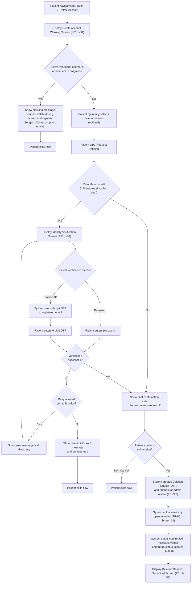
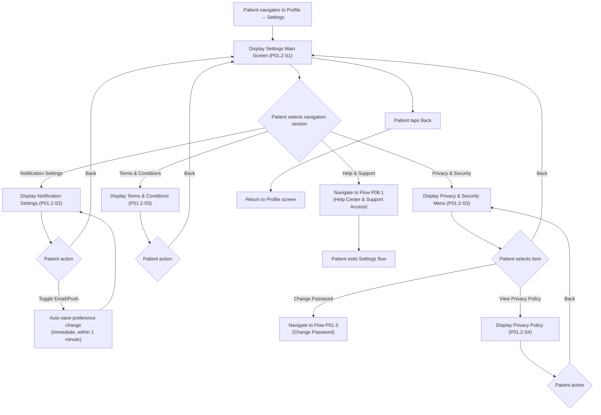
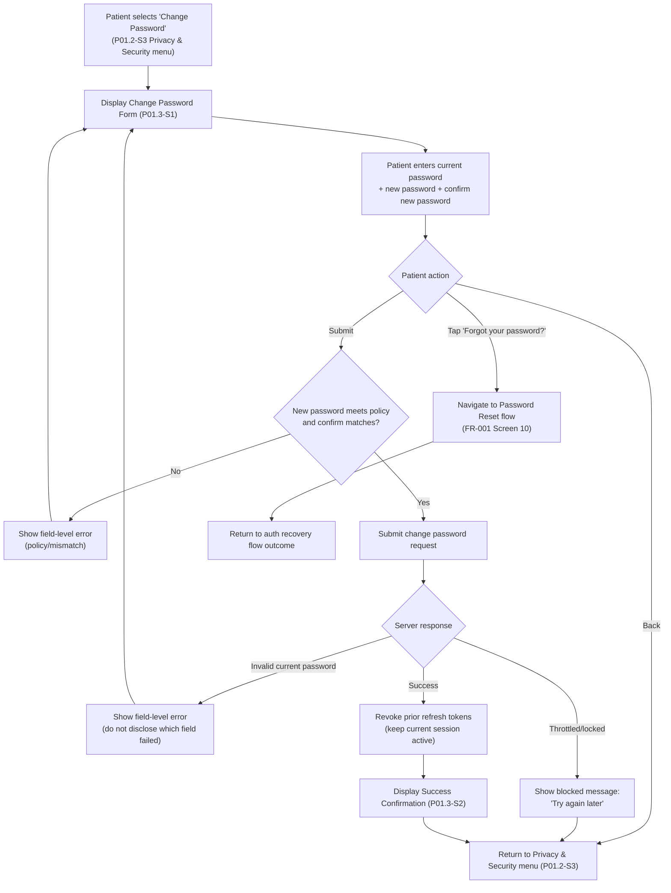
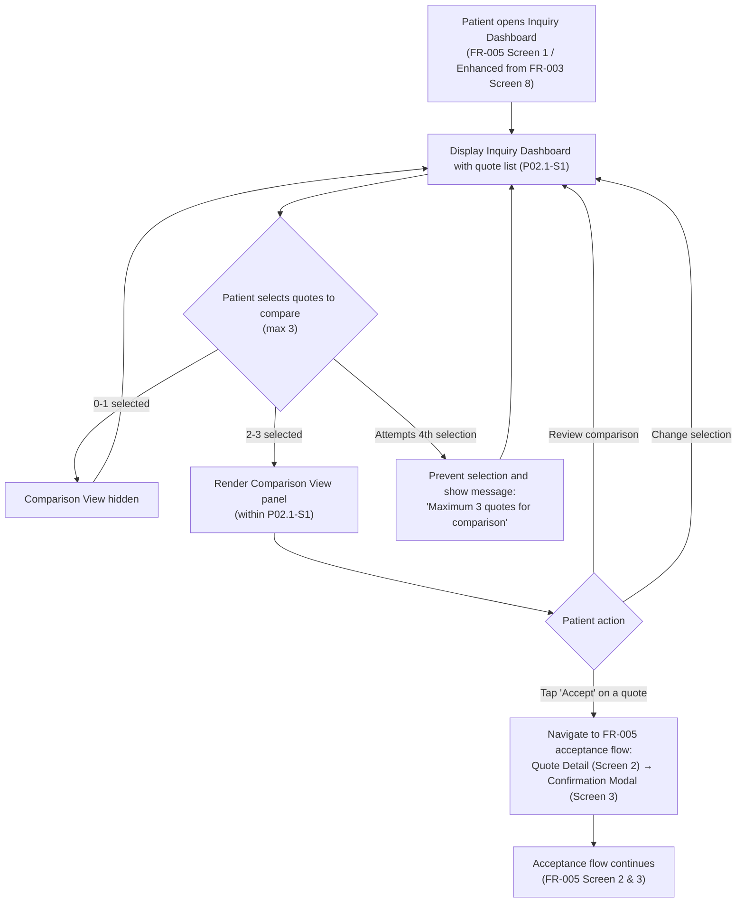
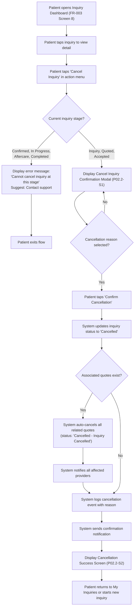

# Missing Mobile App Flows — Figma Design Complement Report

**Report Date**: 2026-02-05
**Report Type**: Design Gap Analysis & Screen Specification
**Platform**: Patient Mobile App
**Prepared For**: UI/UX Design Team
**Purpose**: Document missing flows not yet present in Figma, providing flow diagrams and screen specifications to guide design complementation.

---

## Summary Dashboard

| # | Flow | Module | Related FRs | Status |
|---|------|--------|-------------|--------|
| P01.1 | Delete Account | P-01: Auth & Profile Management | FR-001, FR-026, FR-023 | 🟡 Specified |
| P01.2 | Settings Screen | P-01: Auth & Profile Management | FR-001, FR-020, FR-027 | 🟡 Specified |
| P01.3 | Change Password | P-01: Auth & Profile Management | FR-001 | 🟡 Specified |
| P02.1 | Compare Offers Side-by-Side | P-02: Quote Request & Management | FR-005 | 🟡 Specified |
| P02.2 | Cancel Inquiry | P-02: Quote Request & Management | FR-003, FR-005 | ⏸️ On Hold |
| P02.3 | Expired Offers/Quotes | P-02: Quote Request & Management | FR-004, FR-005 | 🔴 Not Designed |
| P02.4 | Legal/Policy Screens (Quote Context) | P-02: Quote Request & Management | FR-005, FR-027 | 🔴 Not Designed |
| P03.1 | Payment Methods Management | P-03: Booking & Payment | FR-007, FR-007b | 🔴 Not Designed |
| P04.1 | Input Passport Details | P-04: Travel & Logistics | FR-008 | 🔴 Not Designed |
| P04.2 | Input Hotel & Flight Details | P-04: Travel & Logistics | FR-008 | 🔴 Not Designed |
| P05.1 | Day-to-Day Treatment Progress | P-05: Aftercare & Progress Monitoring | FR-010, FR-011 | 🔴 Not Designed |
| P05.2 | Previous Treatments List | P-05: Aftercare & Progress Monitoring | FR-010, FR-011 | 🔴 Not Designed |
| P05.3 | Submitted Reviews List | P-05: Aftercare & Progress Monitoring | FR-013 | 🔴 Not Designed |
| P06.1 | Notification Listing & Bubble | P-06: Communication | FR-020 | 🔴 Not Designed |
| P08.1 | Help & Support | P-08: Help Center & Support Access | FR-033, FR-034 | 🔴 Not Designed |

---

## How to Use This Document

Each flow section below contains:

1. **Mermaid flow diagram** — visual representation of the user journey
2. **Screen specifications** — field-level detail in the standard 5-column table format
3. **Concise business rules** — key constraints per screen

**For agents filling in content**:

- Read the referenced FR PRD files under `local-docs/project-requirements/functional-requirements/` for full business context
- Screen spec tables use the standard 5-column format: **Field Name** | **Type** | **Required** | **Description** | **Validation Rules**
- Accepted `Type` values: `text`, `number`, `badge`, `checkbox`, `select`, `list`, `table`, `group`, `chips`, `buttons`, `modal`, `toggle`, `datetime`, `image`, `icon`, `link`, `action`
- Keep business rules to 3–5 bullet points per screen
- Use Mermaid `flowchart TD` (top-down) syntax for flow diagrams
- Reference specific FR screens where applicable (e.g., "FR-005 Screen 3")
- Wrap all mermaid node labels in quotes if they contain special characters

---

## P-01: Auth & Profile Management

### Flow P01.1: Delete Account

**Related FRs**: FR-001 (Patient Authentication), FR-026 (App Settings & Security), FR-023 (Data Retention & Compliance)
**Source Reference**: `local-docs/project-requirements/functional-requirements/fr001-patient-authentication/prd.md`, `fr023-data-retention-compliance/prd.md`
**Status**: 🟡 Specified

#### Flow Diagram



#### Screen Specifications

##### Screen P01.1-S1: Delete Account Warning

**Purpose**: Explain deletion request consequences before patient submits a deletion request (DSR)

| Field Name | Type | Required | Description | Validation Rules |
|---|---|---|---|---|
| Warning Icon | icon | Yes | Red warning triangle or alert icon | Display at top of screen |
| Screen Title | text | Yes | "Delete Your Account" | Displayed prominently in red/destructive color |
| Back Navigation | action | Yes | Back arrow to return to Profile | Top-left corner |
| Blocking Message (Conditional) | group | Conditional | Displayed only if active treatment, aftercare, or payment in progress | Must block deletion with clear message: "Account deletion is unavailable during active care or payment processing. Please contact support or wait until completion." |
| Contact Support Link (Conditional) | link | Conditional | Shown only if blocking message is displayed | Opens support ticket flow (FR-034) |
| Consequences Header | text | Yes | "What may be deleted or anonymized:" | Bold, clear separator |
| Consequences List | list | Yes | Bulleted list of affected personal data categories | Must include: Profile and preferences, Messages/communications, Reviews content, Uploaded media (where not legally retained) |
| Retained Data Header | text | Yes | "What will be retained (legal requirement):" | Bold, clear separator |
| Retained Data Explanation | text | Yes | Explanation of legally retained records | Must state: "Medical and financial transaction records are retained for at least 7 years. Access is restricted and the legal basis will be documented in the deletion outcome." |
| Processing Timeline Notice | text | Yes | Informational message about processing time | Must state: "Verified deletion requests are completed within 30 calendar days." (FR-023) |
| Deletion Reason Selector (Optional) | select | No | Optional reason for requesting deletion | Optional; options are centrally managed (not hardcoded in this spec) |
| Final Confirmation Modal (Conditional) | modal | Conditional | Confirmation before submitting deletion request | Shown after "Request Deletion" tap; includes Confirm/Cancel; no irreversible deletion occurs at this step |
| Request Deletion Button | button | Yes | Primary CTA in destructive style (red) | Enabled unless blocked; tap triggers re-auth check and/or final confirmation modal |
| Go Back Button | button | Yes | Secondary CTA in default style | Returns to Profile screen, no changes saved |

**Business Rules**:

- Block deletion request when active treatment/aftercare or payment is in progress; provide support path (FR-001 Screen 14)
- Deletion reason is optional and must not block submission (FR-001 `deleteAccountRequest { reason? }`)
- Re-auth is required when last successful auth > 5 minutes (password or 6-digit email OTP) (FR-001 Screen 14)
- Submitting creates a Deletion Request (DSR) queued for Admin review; verified requests are completed within 30 calendar days with status updates (FR-023)
- If patient has an active inquiry, deletion request is allowed and system auto-closes open inquiries (FR-001 Screen 14)

##### Screen P01.1-S2: Identity Verification Step

**Purpose**: Verify patient identity before submitting deletion request

| Field Name | Type | Required | Description | Validation Rules |
|---|---|---|---|---|
| Screen Title | text | Yes | "Verify Your Identity" | Displayed prominently |
| Back Navigation | action | Yes | Back arrow to return to warning screen (P01.1-S1) | Top-left corner |
| Security Icon | icon | Yes | Lock or shield icon indicating security step | Display at top center |
| Instruction Text | text | Yes | "For your security, please verify your identity before proceeding." | Clear, concise explanation |
| Verification Method Selector | chips | Yes | Options: "Password" or "Email OTP" | Methods per FR-001 for sensitive re-auth; allow patient to switch methods |
| Password Field | text | Conditional | Masked password input field; shown if "Password" method selected | Must match current account password; show/hide toggle icon |
| Email OTP Field | text | Conditional | 6-digit OTP input; shown if "Email OTP" method selected | System sends OTP to registered email; code expires in 15 minutes |
| Resend OTP Link | link | Conditional | Shown only if "Email OTP" method selected | Rate-limited; cooldown applies |
| Error Message | text | Conditional | Displayed on verification failure | Must be actionable: "Invalid password/OTP. Please try again." |
| Verify Button | button | Yes | Primary CTA in destructive style (red) | Disabled until password entered OR 6-digit OTP entered; validates and returns to final confirmation modal |
| Cancel Button | button | Yes | Secondary CTA in default style | Returns to Profile screen, cancels deletion flow |

**Business Rules**:

- Re-authentication is required when last successful auth > 5 minutes (password or 6-digit email OTP) (FR-001 Screen 14)
- Selecting "Email OTP" sends a 6-digit code to the registered email; code expires in 15 minutes; resend is rate-limited (FR-001 OTP rules)
- Verification failures, throttling, and any lockout behavior follow the configured authentication security policy (do not hardcode attempt counts in UI copy) (FR-001)
- Successful verification returns the patient to the final confirmation modal to submit the deletion request (FR-023)
- Patient can cancel at any time to exit without submitting a deletion request

##### Screen P01.1-S3: Deletion Request Submitted Confirmation

**Purpose**: Confirm deletion request (DSR) has been submitted and explain next steps

| Field Name | Type | Required | Description | Validation Rules |
|---|---|---|---|---|
| Confirmation Icon | icon | Yes | Green checkmark or shield icon | Display at top center to indicate successful submission |
| Screen Title | text | Yes | "Deletion Request Submitted" | Displayed prominently |
| Request Status | badge | Yes | Current request status | Default: "Pending Admin Review" |
| Request Reference | text | Yes | Unique request reference ID | Read-only; used for support follow-up |
| Submitted Timestamp | datetime | Yes | Date/time request was submitted | Uses server time |
| Processing Timeline Notice | text | Yes | SLA expectation | Must state: "We complete verified deletion requests within 30 calendar days." (FR-023) |
| What Happens Next Section | group | Yes | Next steps list | Must include: "Your request will be reviewed", "You may be asked for additional verification", "You will receive status updates and the final outcome", "Open inquiries have been closed (if applicable)" |
| Retained Data Reminder | text | Yes | Reminder of legal retention | Must state medical/financial records retained ≥ 7 years with restricted access (FR-023) |
| Email Confirmation Notice | text | Yes | "A confirmation email has been sent to [patient email address]." | Show registered email |
| Back to Profile Button | button | Yes | Primary CTA | Returns to Profile screen |

**Business Rules**:

- Deletion request is queued for Admin review and processed after verification (FR-023)
- Verified deletion requests are completed within 30 calendar days; SLA may pause if additional verification is required (FR-023 Alternative Flow A1)
- If patient has an active inquiry, the system auto-closes open inquiries on request submission (FR-001 Screen 14)
- Outcome notification must document actions taken and legal basis for any retained records (FR-023)
- Non-protected personal data is deleted/anonymized; protected medical/financial records are retained (≥ 7 years) with restricted access (FR-023 REQ-023-005)

---

### Flow P01.2: Settings Screen

**Related FRs**: FR-001 (Patient Authentication), FR-020 (Notifications & Alerts), FR-027 (Legal Content Management)
**Source Reference**: `local-docs/project-requirements/functional-requirements/fr001-patient-authentication/prd.md`, `fr020-notifications-alerts/prd.md`, `fr027-legal-content-management/prd.md`
**Status**: 🟡 Specified

#### Flow Diagram



#### Screen Specifications

##### Screen P01.2-S1: Settings Main Screen

**Purpose**: Top-level settings navigation hub

| Field Name | Type | Required | Description | Validation Rules |
|---|---|---|---|---|
| Screen Title | text | Yes | "Settings" | Displayed at top of screen |
| Back Navigation | action | Yes | Back arrow to return to Profile screen | Top-left corner |
| Navigation Section: Notifications | link | Yes | Row with bell icon + "Notification Settings" label + chevron | Navigates to P01.2-S2 |
| Navigation Section: Privacy & Security | link | Yes | Row with lock icon + "Privacy & Security" label + chevron | Navigates to P01.2-S3 |
| Navigation Section: Terms & Conditions | link | Yes | Row with document icon + "Terms & Conditions" label + chevron | Navigates to P01.2-S5 |
| Navigation Section: Help & Support | link | Yes | Row with help/question icon + "Help & Support" label + chevron | Navigates to Flow P08.1 (P-08: Help Center & Support Access) |

**Business Rules**:

- Navigation sections are static items — always visible in the same order (FR-001 Screen 16)
- Tapping a navigation row must open the corresponding settings screen/flow and preserve back navigation to P01.2-S1
- Terms & Conditions must open read-only legal content sourced and versioned per FR-027
- Help & Support always routes to Flow P08.1 (separate module P-08)
- Settings items are patient-app only; no provider/admin controls appear here

> **Help & Support** is specified under **P-08: Help Center & Support Access** → see [Flow P08.1](#flow-p081-help--support) below.
> The Settings main screen links to it as a navigation item.

##### Screen P01.2-S2: Notification Settings

**Purpose**: Manage push and email notification preferences

| Field Name | Type | Required | Description | Validation Rules |
|---|---|---|---|---|
| Screen Title | text | Yes | "Notification Settings" | Displayed at top |
| Back Navigation | action | Yes | Back arrow to return to Settings main (P01.2-S1) | Top-left corner |
| Explanation Text | text | Yes | "Choose how you want to receive notifications from Hairline." | Displayed below title for context |
| MVP Notice (Conditional) | text | Conditional | "Per-category preferences coming soon. For now, you can enable/disable all notifications by channel." | Shown only in MVP; removed in V2 when per-category toggles ship |
| Global Email Toggle | toggle | Yes | Master switch: "Email Notifications" with ON/OFF state | Auto-saves immediately on toggle; default: ON |
| Global Push Toggle | toggle | Yes | Master switch: "Push Notifications" with ON/OFF state | Auto-saves immediately on toggle; default: ON |
| Mandatory Notifications Note | text | Yes | "Security notifications (password reset, account changes) are always sent and cannot be disabled." | Displayed below toggles as info text |
| System Event Notifications Note | text | Yes | "You will receive automatic notifications when your inquiry, booking, or payment status changes. These keep you informed of important updates." | Read-only informational text; explains system-driven event notifications per FR-020 |
| Save Status Indicator (Conditional) | text | Conditional | "Saved" or "Saving..." feedback | Shown briefly after toggle change; success message: "Preferences saved" |
| Error Message (Conditional) | text | Conditional | Displayed if save fails | "Failed to save preferences. Please try again." with Retry button; on failure, UI reverts to last saved state |

**Business Rules**:

- **MVP scope**: Only global Email/Push toggles available; per-category preferences (Quote, Booking, Payment, Treatment, Message, Promotional) are V2 and not shown in this screen (FR-020, FR-001 Screen 16)
- Security-critical notifications (email verification, password reset, account security alerts) are mandatory and cannot be disabled — not affected by global toggles
- System event notifications (inquiry stage changes, quote received, booking confirmed, payment events, aftercare reminders) are automatically sent per FR-020; user cannot disable individual events in MVP
- Changes auto-save immediately upon toggle (no explicit "Save" button); preference changes effective within 1 minute; default for new accounts: both Email and Push toggles ON (FR-001 Screen 16)
- If save fails, UI must revert to previous toggle state and show actionable error with Retry option (FR-001 Screen 16)

##### Screen P01.2-S3: Privacy & Security Menu

**Purpose**: Provide access to security and privacy items

| Field Name | Type | Required | Description | Validation Rules |
|---|---|---|---|---|
| Screen Title | text | Yes | "Privacy & Security" | Displayed at top |
| Back Navigation | action | Yes | Back arrow to return to Settings main (P01.2-S1) | Top-left corner |
| Change Password | link | Yes | Row with key icon + "Change Password" label + chevron | Navigates to Flow P01.3 (Change Password) |
| Privacy Policy | link | Yes | Row with shield/document icon + "Privacy Policy" label + chevron | Navigates to P01.2-S4 |

**Business Rules**:

- Change Password must always route to Flow P01.3; this menu does not embed inline password-edit controls
- Privacy Policy is read-only static content sourced from the Legal Content system (FR-027)
- If legal content cannot be loaded, show a retry state and allow returning to P01.2-S1 without blocking the user
- This menu contains only patient-facing items (no admin/provider configuration)

##### Screen P01.2-S4: Privacy Policy

**Purpose**: Display Privacy Policy content (static/read-only)

| Field Name | Type | Required | Description | Validation Rules |
|---|---|---|---|---|
| Screen Title | text | Yes | "Privacy Policy" | Displayed at top |
| Back Navigation | action | Yes | Back arrow to return to Privacy & Security menu (P01.2-S3) | Top-left corner |
| Policy Version | badge | Conditional | Current legal content version label | Shown if version metadata is available (FR-027) |
| Last Updated | datetime | Conditional | Last updated timestamp for the policy | Shown if available (FR-027) |
| Policy Content | text | Yes | Scrollable rich-text policy body | Must be readable and selectable; supports long content |

**Business Rules**:

- Policy content is read-only and must match the latest published Privacy Policy for the patient app (FR-027)
- If a newer version is published while the user is viewing, the app may prompt to refresh but must not interrupt reading
- If content fails to load, show a non-blocking error state with Retry and Back
- Analytics/audit (if implemented) must not capture the policy text itself; only view events and version identifiers (privacy-by-design)

##### Screen P01.2-S5: Terms & Conditions

**Purpose**: Display Terms & Conditions content (static/read-only)

| Field Name | Type | Required | Description | Validation Rules |
|---|---|---|---|---|
| Screen Title | text | Yes | "Terms & Conditions" | Displayed at top |
| Back Navigation | action | Yes | Back arrow to return to Settings main (P01.2-S1) | Top-left corner |
| Document Version | badge | Conditional | Current legal content version label | Shown if version metadata is available (FR-027) |
| Last Updated | datetime | Conditional | Last updated timestamp for the document | Shown if available (FR-027) |
| Document Content | text | Yes | Scrollable rich-text terms body | Must be readable and selectable; supports long content |

**Business Rules**:

- Terms content is read-only and must match the latest published Terms & Conditions for the patient app (FR-027)
- If a newer version is published while the user is viewing, the app may prompt to refresh but must not interrupt reading
- If content fails to load, show a non-blocking error state with Retry and Back
- Analytics/audit (if implemented) must not capture the document text itself; only view events and version identifiers (privacy-by-design)

---

### Flow P01.3: Change Password

**Related FRs**: FR-001 (Patient Authentication)
**Source Reference**: `local-docs/project-requirements/functional-requirements/fr001-patient-authentication/prd.md`
**Status**: 🟡 Specified

#### Flow Diagram



#### Screen Specifications

##### Screen P01.3-S1: Change Password Form

**Purpose**: Let an authenticated patient change their password (with an escape hatch to password reset)

| Field Name | Type | Required | Description | Validation Rules |
|---|---|---|---|---|
| Screen Title | text | Yes | "Change Password" | Displayed at top |
| Back Navigation | action | Yes | Back arrow to return to Privacy & Security menu (P01.2-S3) | Top-left corner |
| Current Password | text | Yes | Masked password input | Required unless user chooses "Forgot your password?" |
| Forgot Your Password Link | link | Yes | "Forgot your password?" link shown under Current Password | Navigates to FR-001 Screen 10 (Password Reset Initiation) |
| New Password | text | Yes | Masked password input | Must meet password policy (FR-001) |
| Confirm New Password | text | Yes | Masked password input | Must match New Password exactly |
| Password Policy Helper | text | Yes | Short reminder of password requirements | Must not list attempt limits; reference policy only |
| Save Button | button | Yes | Primary CTA: "Save" | Disabled until required fields are present |
| Error Message (Conditional) | text | Conditional | Inline field-level errors | Must not reveal whether current password or account exists |

**Business Rules**:

- Current password is required for an in-session password change; if user cannot provide it they must use the password reset flow (FR-001 Screens 10–12)
- New password must meet password policy and cannot reuse the last 5 passwords (FR-001 Password Rules)
- Validation errors must be shown inline without revealing sensitive details (avoid “current password incorrect” style disclosures)
- Retry/lockout behavior follows configured authentication throttling policy; UI must not hardcode attempt counts (FR-001)
- On successful change, prior refresh tokens are revoked and the current session remains active (FR-001 Screen 16)

##### Screen P01.3-S2: Password Changed Confirmation

**Purpose**: Confirm password change and return user back to settings

| Field Name | Type | Required | Description | Validation Rules |
|---|---|---|---|---|
| Confirmation Icon | icon | Yes | Success check icon | Displayed prominently |
| Screen Title | text | Yes | "Password Updated" | Displayed prominently |
| Message Text | text | Yes | Short confirmation copy | Must not include attempt limits or sensitive details |
| Done Button | button | Yes | "Done" | Returns to Privacy & Security menu (P01.2-S3) |

**Business Rules**:

- Confirmation must be shown only after the server confirms the change
- If token revocation fails after password change succeeds, the user still sees success but the app must retry revocation in background and log a security event
- Returning to Settings must preserve navigation state (back stack returns to P01.2-S3)

---

## P-02: Quote Request & Management

### Flow P02.1: Compare Offers Side-by-Side

**Related FRs**: FR-005 (Quote Comparison & Acceptance)
**Source Reference**: `local-docs/project-requirements/functional-requirements/fr005-quote-comparison-acceptance/prd.md`
**Status**: 🟡 Specified

#### Flow Diagram



#### Screen Specifications

##### Screen P02.1-S1: Inquiry Dashboard with Quote Comparison (Enhanced)

**Purpose**: Patient views inquiry status, compares received quotes, and may accept one quote (FR-005 Screen 1)

| Field Name | Type | Required | Description | Validation Rules |
|---|---|---|---|---|
| Screen Context | text | Yes | Enhanced Inquiry Dashboard | Extends FR-003 Screen 8 with FR-005 comparison & acceptance |
| Current Stage | badge | Yes | Inquiry stage (Inquiry/Quoted/Accepted/...) | Valid lifecycle value |
| Timeline | list | Yes | Chronological status changes | Timestamps present |
| Inquiry Summary | group | Yes | Read-only inquiry info | Complete and consistent |
| Quotes Received | list | Yes | Provider quotes with key highlights | Must list all non-archived quotes |
| Sort & Filter | group | Yes | Sort/filter quotes (e.g., price, grafts, rating, date) | Criteria list must be defined (FR-005) |
| Compare Selection (Per Quote) | checkbox | No | Select quotes to compare side-by-side | Max 3 selected; disabled for expired/withdrawn quotes |
| Comparison View Panel (Conditional) | group | Conditional | Side-by-side comparison panel for selected quotes | Renders only when ≥2 quotes are selected |
| Comparison Differentiators (Conditional) | table | Conditional | Comparison rows across selected quotes | Must include at least: total price, price per graft, graft count, review rating/count, soonest appointment slot (FR-005) |
| Treatment (Per Quote) | text | Yes | Treatment name | Read-only |
| Inclusions (Per Quote) | chips | No | Package/customizations | Read-only |
| Included Services (Per Quote) | list | No | Included services list | Read-only; derived from quote inclusions |
| Per-date Pricing (Per Quote) | table | Yes | Price for each offered date | All dates priced |
| Appointment Slot (Pre-Scheduled) (Per Quote) | datetime | Yes | Pre-scheduled appointment date/time | Read-only; sourced from FR-004 |
| Price per Graft (Per Quote) | number | Yes | Derived unit price (total ÷ graft count) | Calculated |
| Provider Reviews (Per Quote) | text | No | Review rating and count | Read-only; sourced from FR-013 |
| Provider Credentials Summary (Per Quote) | text | Yes | Licenses/certifications summary | Read-only; sourced from FR-015 |
| Estimated Travel Costs (Per Quote) | number | No | Estimated travel costs to destination | Provider input (FR-004) or FR-008 integration |
| Expiry (Per Quote) | datetime | Yes | Quote expiry timestamp / countdown display | Derived from quote expiresAt |
| Medical Alerts | chips | Yes | Patient medical risk level | Read-only; from FR-003 |
| Actions (Per Quote) | buttons | Yes | View Details, Accept, Ask Question | State-aware enabling; Accept disabled if expired/withdrawn/already accepted (FR-005) |
| Deadlines | datetime | Yes | Response/expiry deadlines | Future or past allowed |
| Next Actions | buttons | Yes | Available user actions for the inquiry | Based on stage/permissions |

**Business Rules**:

- Quotes are displayed within the Inquiry Dashboard context; comparison is a conditional panel (not a separate screen) (FR-005 Screen 1)
- Patient can compare up to 3 quotes; comparison view renders only when ≥ 2 quotes are selected (FR-005)
- Expired/withdrawn quotes are visually disabled and cannot be selected or accepted (FR-005)
- Patient can sort/filter quotes and view details; acceptance continues via FR-005 Screen 2 & 3 (FR-005)
- Exactly one quote can be accepted per inquiry; competing quotes are auto-cancelled as part of the FR-005 acceptance workflow (FR-005)

---

### Flow P02.2: Cancel Inquiry

**Related FRs**: FR-003 (Inquiry Submission), FR-005 (Quote Comparison & Acceptance)
**Source Reference**: `local-docs/project-requirements/functional-requirements/fr003-inquiry-submission/prd.md`, `fr005-quote-comparison-acceptance/prd.md`
**Status**: ⏸️ On Hold

#### Flow Diagram



#### Screen Specifications

##### Screen P02.2-S1: Cancel Inquiry Confirmation Modal

**Purpose**: Confirm patient's intent to cancel and capture cancellation reason

| Field Name | Type | Required | Description | Validation Rules |
|---|---|---|---|---|
| Warning Icon | icon | Yes | Red warning triangle or alert icon | Displayed at top of modal |
| Modal Title | text | Yes | "Cancel Inquiry?" | Displayed prominently in red/destructive color |
| Warning Message | text | Yes | Explanation of consequences | "Canceling this inquiry is irreversible. All quotes you've received will be cancelled and providers will be notified." |
| Current Stage Badge | badge | Yes | Shows inquiry current stage | Enum: "Inquiry", "Quoted", "Accepted"; read-only |
| Inquiry Reference | text | Yes | Inquiry ID (HPID format) | Read-only; format: HPID + YY + MM + 4-digit sequence |
| Impact Summary | text | Yes | Summary of cancellation impact | Conditional text based on stage: "X active quotes will be cancelled" OR "No quotes received yet" |
| Cancellation Reason Label | text | Yes | "Why are you cancelling?" | Required field indicator shown |
| Cancellation Reason Selector | select | Yes | Dropdown or radio list of predefined reasons | Must select one option from list |
| Cancellation Reason Options | list | Yes | Predefined cancellation reasons | Options: "Changed my mind", "Found a better option elsewhere", "Medical concerns", "Financial reasons", "Travel restrictions", "Timeline doesn't work", "Other" |
| Additional Notes (Conditional) | text | Conditional | Free text field; shown when "Other" selected | Required if "Other" selected; max 500 characters; placeholder: "Please explain..." |
| Optional Feedback Field | text | No | General feedback text area | Optional for all reasons; max 1000 characters; placeholder: "Any additional feedback? (Optional)" |
| Provider Notification Note | text | Yes | Informational message | "Affected providers will be notified of this cancellation within 5 minutes" |
| Confirm Cancellation Button | button | Yes | Destructive primary CTA | Red/destructive style; label: "Confirm Cancellation"; disabled until reason selected |
| Go Back Button | button | Yes | Secondary CTA to dismiss modal | Default/neutral style; label: "Go Back"; closes modal without action |

**Business Rules**:

- ⏸️ On hold: patient-initiated inquiry cancellation is not defined in FR-003/FR-005; do not proceed to design until requirements are updated/approved
- If resumed, allowable stages and impacts on quotes/reservations must be explicitly defined in the PRD before finalizing UI copy and state transitions
- If resumed, cancellation reason options must be centrally defined and audited; avoid hardcoding option lists without PRD backing
- All state changes, audit logging, and notifications must align with the confirmed inquiry lifecycle and privacy constraints once approved

##### Screen P02.2-S2: Cancellation Success Confirmation

**Purpose**: Confirm the inquiry has been successfully cancelled

| Field Name | Type | Required | Description | Validation Rules |
|---|---|---|---|---|
| Success Icon | icon | Yes | Checkmark or completion illustration | Green color; displayed at top center |
| Confirmation Title | text | Yes | "Inquiry Cancelled" | Displayed prominently below icon |
| Confirmation Message | text | Yes | Brief success message | "Your inquiry has been successfully cancelled." |
| Cancelled Inquiry Reference | text | Yes | Inquiry ID (HPID format) | Read-only; format: HPID + YY + MM + 4-digit sequence; label: "Reference:" |
| Cancellation Timestamp | datetime | Yes | Date and time of cancellation | Format: "Cancelled on [Month DD, YYYY] at [HH:MM AM/PM]" |
| Impact Summary | text | Yes | Summary of what was cancelled | Conditional based on inquiry stage:<br/>- "Your inquiry was cancelled."<br/>- "Your inquiry and X active quote(s) were cancelled."<br/>- "Your inquiry, accepted quote, and reservation were cancelled." |
| Provider Notification Status | text | Yes | Confirmation of provider notification | "All affected providers have been notified of this cancellation." |
| Next Steps Section Label | text | Yes | Section header | "What would you like to do next?" |
| Back to My Inquiries Button | button | Yes | Primary CTA | Default style; label: "Back to My Inquiries"; navigates to Inquiry Dashboard (FR-003 Screen 8) |
| Start New Inquiry Button | button | Yes | Secondary CTA | Outlined/secondary style; label: "Start New Inquiry"; navigates to Inquiry Creation flow (FR-003 Screen 1) |
| Contact Support Link | link | No | Optional support contact link | Text link; label: "Need help? Contact support"; navigates to Help & Support (Flow P08.1) |

**Business Rules**:

- ⏸️ On hold: this success screen is not PRD-backed; do not proceed to design until requirements are updated/approved
- If resumed, cancellation timestamp must reflect server time and the impact summary must match the confirmed lifecycle rules for inquiry/quotes/reservations
- Primary next steps should return patient to Inquiry Dashboard (FR-003 Screen 8) or allow starting a new inquiry (FR-003 Screen 1); support link is optional
- Cancelled inquiries (if supported) must be read-only and not re-openable; patient starts a new inquiry to proceed

---

### Flow P02.3: Expired Offers/Quotes

**Related FRs**: FR-004 (Quote Submission), FR-005 (Quote Comparison & Acceptance)
**Source Reference**: `local-docs/project-requirements/functional-requirements/fr005-quote-comparison-acceptance/prd.md`
**Status**: 🔴 Not Designed

#### Flow Diagram

```mermaid
%% PLACEHOLDER — Agent Instructions:
%% Create a flowchart TD showing:
%% 1. System detects quote past expiry date (background check or on screen load)
%% 2. Quote status updated to "Expired"
%% 3. Patient opens inquiry detail → sees expired badge on quote(s)
%% 4. Patient taps expired quote → detail view with "Expired" overlay
%% 5. Decision: "All quotes for this inquiry expired?"
%%    → Yes: show "All Quotes Expired" state with option to request re-quotes or cancel inquiry
%%    → No: show remaining valid quotes normally, expired ones grayed out
%% 6. If patient requests re-quote → system sends request to provider(s)
%% Reference FR-005 for quote expiry rules, FR-004 for provider-side quote lifecycle
```

#### Screen Specifications

##### Screen P02.3-S1: Expired Quote Indicator (State Variation within Inquiry Detail)

**Purpose**: Visual treatment for expired quotes in the quote list

<!-- PLACEHOLDER — Agent Instructions:
Read FR-005 PRD for quote states and expiry behavior.
This is NOT a standalone screen — it is a state variation of the quote card within the inquiry detail quote list.

Create a table describing the visual modifications applied to an expired quote card:
- Expired badge/label overlay on the quote card
- Grayed-out styling for the entire expired quote card
- Expiry date display ("Expired on [date]")
- "Request New Quote" action button (if provider allows re-quoting)
- Disabled "Accept" button with tooltip or explanation text
- Original quote summary remains visible but visually de-emphasized

Format:
| Field Name | Type | Required | Description | Validation Rules |
|---|---|---|---|---|
| ... | ... | ... | ... | ... |
-->

**Business Rules**:
<!-- PLACEHOLDER — Agent Instructions:
Include rules for:
- Expired quotes cannot be accepted under any circumstance
- Expired quotes remain visible for reference but are visually de-emphasized
- If all quotes for an inquiry are expired, show the "All Expired" state (Screen P02.3-S2)
- Provider may or may not allow re-quoting — check FR-004 for re-quote rules
- Expiry is determined by the quote's validity_end_date field
-->

##### Screen P02.3-S2: All Quotes Expired State

**Purpose**: Action state displayed when all received quotes for an inquiry have expired

<!-- PLACEHOLDER — Agent Instructions:
Create a table with these expected fields:
- Illustration/icon for the expired state
- Message explaining that all quotes have expired
- "Request New Quotes" primary CTA (re-notify providers to submit new quotes)
- "Cancel Inquiry" secondary action
- "Contact Support" tertiary link
- Inquiry summary (service type, date originally submitted)

Format:
| Field Name | Type | Required | Description | Validation Rules |
|---|---|---|---|---|
| ... | ... | ... | ... | ... |
-->

**Business Rules**:
<!-- PLACEHOLDER — Agent Instructions:
Include rules for:
- "Request New Quotes" re-opens the inquiry for provider quoting
- System auto-notifies previously quoted providers about the re-quote opportunity
- Patient may also choose to cancel the inquiry entirely from this state
-->

---

### Flow P02.4: Legal/Policy Screens (Quote Context)

**Related FRs**: FR-005 (Quote Comparison & Acceptance), FR-027 (Legal Content Management)
**Source Reference**: `local-docs/project-requirements/functional-requirements/fr027-legal-content-management/prd.md`, `fr005-quote-comparison-acceptance/prd.md`
**Status**: 🔴 Not Designed

#### Flow Diagram

```mermaid
%% PLACEHOLDER — Agent Instructions:
%% Create a flowchart TD showing:
%% 1. Patient views quote/offer detail screen
%% 2. Patient taps one of the legal links: "Cancellation Policy" | "Privacy Commitment" | "Terms of Service"
%% 3. System navigates to the corresponding legal document screen (P02.4-S1/S2/S3)
%% 4. Patient reads the document (scrollable full content)
%% 5. Patient taps "Back" to return to quote detail
%% Note: These are read-only viewing screens — no acceptance action is required here.
%% The actual acceptance/agreement happens during the quote acceptance flow (FR-005).
%% Reference FR-027 for legal content management and versioning rules.
```

#### Screen Specifications

##### Screen P02.4-S1: Cancellation Policy Screen

**Purpose**: Display the cancellation policy applicable to the quote/treatment

<!-- PLACEHOLDER — Agent Instructions:
Read FR-027 PRD for legal content structure and display requirements.
This is a full-screen document viewer accessed from the quote detail screen.

Create a table with these expected fields:
- Screen title ("Cancellation Policy")
- Back/close navigation
- Policy content body (rich text / markdown rendered, scrollable)
- Last updated date
- Applicable provider name (if provider-specific policy)
- Applicable treatment type (if treatment-specific)
- Scroll progress indicator
- Optional "Download PDF" action

Format:
| Field Name | Type | Required | Description | Validation Rules |
|---|---|---|---|---|
| ... | ... | ... | ... | ... |
-->

**Business Rules**:
<!-- PLACEHOLDER — Agent Instructions:
Include rules for:
- Content is fetched from backend, managed by admin via FR-027
- May include provider-specific cancellation terms alongside platform-wide terms
- Content must be the version applicable at the time the quote was created (versioned content)
- Read-only — no acceptance checkbox on this screen
-->

##### Screen P02.4-S2: Privacy Commitment Screen

**Purpose**: Display the privacy commitment and data handling practices

<!-- PLACEHOLDER — Agent Instructions:
Similar structure to Screen P02.4-S1.

Create a table with these expected fields:
- Screen title ("Privacy Commitment")
- Back/close navigation
- Privacy content body (rich text, scrollable)
- Last updated date
- Key sections: data collected, how it's used, who it's shared with, patient rights
- Scroll progress indicator

Format:
| Field Name | Type | Required | Description | Validation Rules |
|---|---|---|---|---|
| ... | ... | ... | ... | ... |
-->

**Business Rules**:
<!-- PLACEHOLDER — Agent Instructions:
Include rules for:
- Must comply with applicable data protection regulations
- Content managed centrally via FR-027
- Should highlight medical data handling practices specifically (medical tourism context)
-->

##### Screen P02.4-S3: Terms of Service Screen

**Purpose**: Display the platform terms of service

<!-- PLACEHOLDER — Agent Instructions:
Similar structure to Screen P02.4-S1.

Create a table with these expected fields:
- Screen title ("Terms of Service")
- Back/close navigation
- ToS content body (rich text, scrollable)
- Last updated date
- Table of contents / section navigation (for long documents)
- Scroll progress indicator

Format:
| Field Name | Type | Required | Description | Validation Rules |
|---|---|---|---|---|
| ... | ... | ... | ... | ... |
-->

**Business Rules**:
<!-- PLACEHOLDER — Agent Instructions:
Include rules for:
- Content managed via FR-027
- Version shown should match what patient will agree to (or current version if pre-acceptance)
- Must include effective date of the terms
-->

---

## P-03: Booking & Payment

### Flow P03.1: Payment Methods Management

**Related FRs**: FR-007 (Payment Processing), FR-007b (Payment Installments)
**Source Reference**: `local-docs/project-requirements/functional-requirements/fr007-payment-processing/prd.md`, `fr007b-payment-installments/prd.md`
**Status**: 🔴 Not Designed

#### Flow Diagram

```mermaid
%% PLACEHOLDER — Agent Instructions:
%% Create a flowchart TD showing:
%% 1. Patient navigates to Settings/Profile → Payment Methods
%% 2. System displays list of saved payment methods
%% 3. Decision branches from the list:
%%    a. "Add New" → payment method input form → validate → save → return to list
%%    b. "Edit" on existing → edit form (pre-filled) → validate → save → return to list
%%    c. "Remove" on existing → confirmation modal → remove → return to list
%%    d. "Set as Default" on existing → update default indicator → visual confirmation
%% 4. Each payment method card shows: type icon, masked number, expiry, default badge
%% Reference FR-007 for payment method types and validation rules
```

#### Screen Specifications

##### Screen P03.1-S1: Payment Methods List

**Purpose**: Display all saved payment methods with management actions

<!-- PLACEHOLDER — Agent Instructions:
Read FR-007 PRD for supported payment types and storage rules.
Accessed from the patient's settings/profile area.

Create a table with these expected fields:
- Screen title ("Payment Methods")
- Payment method cards list (each showing: type icon, card brand, masked last 4 digits, expiry date, default badge)
- Per-card actions: Set as Default, Edit, Remove
- "Add Payment Method" button
- Empty state (no methods saved — prompt to add first method)

Format:
| Field Name | Type | Required | Description | Validation Rules |
|---|---|---|---|---|
| ... | ... | ... | ... | ... |
-->

**Business Rules**:
<!-- PLACEHOLDER — Agent Instructions:
Include rules for:
- At least one payment method required if patient has active bookings with pending payments
- Default method is used for installment auto-charges (FR-007b)
- Cannot remove the only saved method if active payment obligations exist
- Card details are tokenized — only masked info is displayed
-->

##### Screen P03.1-S2: Add/Edit Payment Method

**Purpose**: Form to add a new or edit an existing payment method

<!-- PLACEHOLDER — Agent Instructions:
Create a table with these expected fields:
- Screen title ("Add Payment Method" or "Edit Payment Method")
- Card number input (with live formatting as user types)
- Cardholder name
- Expiry date (MM/YY)
- CVV/CVC
- Billing address fields (if required by payment gateway)
- "Set as default" toggle
- "Save" primary CTA
- "Cancel" secondary action
- Secure transaction badge / encryption indicator

Format:
| Field Name | Type | Required | Description | Validation Rules |
|---|---|---|---|---|
| ... | ... | ... | ... | ... |
-->

**Business Rules**:
<!-- PLACEHOLDER — Agent Instructions:
Include rules for:
- Card number must pass Luhn algorithm validation
- Expiry date must be a future date
- CVV is 3 digits (Visa/MC) or 4 digits (Amex)
- If this is the first method added, auto-set as default
- PCI compliance: card data is sent directly to payment gateway for tokenization, never stored on app servers
-->

---

## P-04: Travel & Logistics

### Flow P04.1: Input Passport Details

**Related FRs**: FR-008 (Travel Booking Integration)
**Source Reference**: `local-docs/project-requirements/functional-requirements/fr008-travel-booking-integration/prd.md`
**Status**: 🔴 Not Designed

#### Flow Diagram

```mermaid
%% PLACEHOLDER — Agent Instructions:
%% Create a flowchart TD showing:
%% 1. Booking confirmed → travel managed by provider (provider handles flight & hotel)
%% 2. Patient receives notification/prompt to submit passport details
%% 3. Patient navigates to booking detail → Travel section → "Submit Passport Details"
%% 4. Patient fills in passport form (personal details + passport fields)
%% 5. Patient uploads passport scan/photo
%% 6. System validates input (basic field validation)
%% 7. System saves and notifies provider that passport details are submitted
%% 8. Decision: "Details locked by provider for booking?"
%%    → Yes: show read-only view with "Contact provider to modify" message
%%    → No: details remain editable
%% Reference FR-008 for travel booking integration rules
```

#### Screen Specifications

##### Screen P04.1-S1: Passport Details Form

**Purpose**: Collect patient's passport information for provider-managed travel booking

<!-- PLACEHOLDER — Agent Instructions:
Read FR-008 PRD for travel integration and required passenger details.
Accessed from the booking detail under the Travel section.

Create a table with these expected fields:
- Full name (as printed on passport)
- Passport number
- Issuing country
- Nationality
- Date of birth
- Gender
- Passport issue date
- Passport expiry date
- Passport photo/scan upload (front page image)
- Special requirements (e.g., wheelchair assistance, dietary needs)
- "Submit" primary CTA
- "Save as Draft" secondary action

Format:
| Field Name | Type | Required | Description | Validation Rules |
|---|---|---|---|---|
| ... | ... | ... | ... | ... |
-->

**Business Rules**:
<!-- PLACEHOLDER — Agent Instructions:
Include rules for:
- Passport expiry must be at least 6 months from the scheduled travel date
- Name must match passport document exactly
- Photo upload: accepted formats (JPG, PNG, PDF), max file size limit
- Details remain editable until provider locks them for flight booking
- Locked state shows read-only view with "Contact provider to modify" message
- Data is encrypted at rest (medical tourism context — sensitive PII)
-->

---

### Flow P04.2: Input Hotel & Flight Details (Self-Managed)

**Related FRs**: FR-008 (Travel Booking Integration)
**Source Reference**: `local-docs/project-requirements/functional-requirements/fr008-travel-booking-integration/prd.md`
**Status**: 🔴 Not Designed

#### Flow Diagram

```mermaid
%% PLACEHOLDER — Agent Instructions:
%% Create a flowchart TD showing:
%% 1. Booking confirmed → patient handles own travel (self-managed)
%% 2. Patient receives prompt to submit travel details for provider coordination
%% 3. Patient navigates to booking detail → Travel section → "Add Travel Details"
%% 4. Two sub-sections: Flight Details + Hotel/Accommodation Details
%% 5. Patient fills in flight details (airline, flight number, dates, times)
%% 6. Patient fills in hotel details (name, address, check-in/out dates)
%% 7. System saves → details visible to provider for logistics coordination
%% 8. Patient can edit/update details until treatment start date
%% Reference FR-008 for self-managed travel fields and provider visibility
```

#### Screen Specifications

##### Screen P04.2-S1: Flight Details Input

**Purpose**: Collect patient's self-booked flight information

<!-- PLACEHOLDER — Agent Instructions:
Read FR-008 PRD for self-managed travel flow.

Create a table with these expected fields:
- Outbound flight section:
  - Airline name
  - Flight number
  - Departure airport/city
  - Arrival airport/city
  - Departure date & time
  - Arrival date & time
- Return flight section (same fields as outbound)
- Booking reference number
- "Add Connecting Flight" option (for multi-leg journeys)
- Upload booking confirmation document (optional)
- "Save" CTA

Format:
| Field Name | Type | Required | Description | Validation Rules |
|---|---|---|---|---|
| ... | ... | ... | ... | ... |
-->

**Business Rules**:
<!-- PLACEHOLDER — Agent Instructions:
Include rules for:
- Arrival date must be before or on treatment start date (with reasonable buffer)
- Return date must be after estimated treatment end date
- Flight details are shared with provider for airport pickup coordination (if applicable)
- Patient can update details anytime before the treatment start date
-->

##### Screen P04.2-S2: Hotel/Accommodation Details Input

**Purpose**: Collect patient's self-booked accommodation information

<!-- PLACEHOLDER — Agent Instructions:
Create a table with these expected fields:
- Hotel/accommodation name
- Address (street, city, postal code, country)
- Check-in date
- Check-out date
- Booking reference number
- Contact phone number of hotel
- Room type (optional)
- Upload booking confirmation document (optional)
- Map preview of location (auto-generated from address, optional)
- Distance from clinic indicator (if clinic address is known)
- "Save" CTA

Format:
| Field Name | Type | Required | Description | Validation Rules |
|---|---|---|---|---|
| ... | ... | ... | ... | ... |
-->

**Business Rules**:
<!-- PLACEHOLDER — Agent Instructions:
Include rules for:
- Check-in date must be on or before treatment start date
- Check-out date must be after estimated treatment end date (accounting for recovery period)
- Details are shared with provider for logistics coordination
- Patient can update details anytime before check-in date
-->

---

## P-05: Aftercare & Progress Monitoring

### Flow P05.1: Day-to-Day Treatment Progress

**Related FRs**: FR-010 (Treatment Execution), FR-011 (Aftercare Recovery Management)
**Source Reference**: `local-docs/project-requirements/functional-requirements/fr010-treatment-execution/prd.md`, `fr011-aftercare-recovery-management/prd.md`
**Status**: 🔴 Not Designed

#### Flow Diagram

```mermaid
%% PLACEHOLDER — Agent Instructions:
%% Create a flowchart TD showing:
%% 1. Treatment case reaches "In Progress" status
%% 2. Patient opens case detail → "Treatment Progress" tab/section
%% 3. System displays timeline/calendar view of treatment days
%% 4. Each day entry shows: provider notes, photos, medications, status
%% 5. Patient can:
%%    a. View a day's details (provider-submitted updates) → Day Detail View
%%    b. Add own notes/journal entry for a day
%%    c. Upload progress photos
%%    d. Log symptoms or concerns
%% 6. Overall progress indicator visible (day X of Y, percentage, milestone markers)
%% 7. "Contact Provider" quick action accessible from progress view
%% Reference FR-010 for treatment execution tracking, FR-011 for aftercare monitoring
```

#### Screen Specifications

##### Screen P05.1-S1: Treatment Progress Timeline

**Purpose**: Day-by-day overview of the treatment progress

<!-- PLACEHOLDER — Agent Instructions:
Read FR-010 and FR-011 PRDs for treatment phases and progress tracking mechanisms.
This is the main progress view within an active treatment case.

Create a table with these expected fields:
- Treatment case header (treatment name, provider name, start date)
- Overall progress bar/indicator (day X of Y)
- Current phase indicator (e.g., "Pre-op Day 2", "Recovery Day 5")
- Timeline/calendar view with day entries
- Each day card: date, status icon (completed/current/upcoming), summary text, photo thumbnail (if any)
- Filter options: All days, Provider updates only, My entries only
- "Add Today's Entry" floating action button
- Quick access actions: Contact Provider, Emergency Info

Format:
| Field Name | Type | Required | Description | Validation Rules |
|---|---|---|---|---|
| ... | ... | ... | ... | ... |
-->

**Business Rules**:
<!-- PLACEHOLDER — Agent Instructions:
Include rules for:
- Provider-submitted entries are read-only for patients
- Patients can only add entries for the current day or past days (not future)
- Photos uploaded by patient are visible to the assigned provider
- Timeline auto-scrolls to the current day on load
- Progress percentage calculated from treatment plan total duration
-->

##### Screen P05.1-S2: Day Detail View

**Purpose**: Detailed view of a single day's treatment progress entries

<!-- PLACEHOLDER — Agent Instructions:
Create a table with these expected fields:
- Day header (date, day number in plan, phase name)
- Provider section:
  - Provider notes (rich text, read-only)
  - Provider-uploaded photos (gallery view)
  - Medications administered/prescribed
  - Vital signs / measurements (if recorded)
  - Next steps / instructions for the patient
- Patient section:
  - Patient journal entry (text input, editable)
  - Patient-uploaded photos
  - Symptom log (pain level 1–10 slider, symptom checklist)
  - Questions/concerns for provider (text input)
- Status badge (e.g., "On Track", "Attention Needed")
- "Edit My Entry" action
- Navigation: Previous Day / Next Day arrows

Format:
| Field Name | Type | Required | Description | Validation Rules |
|---|---|---|---|---|
| ... | ... | ... | ... | ... |
-->

**Business Rules**:
<!-- PLACEHOLDER — Agent Instructions:
Include rules for:
- Patient entries can be edited within 24 hours of initial submission
- Provider entries appear in real-time as the provider submits updates
- Photos support zoom and swipeable gallery view
- Symptom data is structured for provider dashboard analytics
- Critical symptom selections (e.g., high pain, bleeding) should trigger a prompt to contact the provider
-->

---

### Flow P05.2: Previous Treatments List

**Related FRs**: FR-010 (Treatment Execution), FR-011 (Aftercare Recovery Management)
**Source Reference**: `local-docs/project-requirements/functional-requirements/fr010-treatment-execution/prd.md`
**Status**: 🔴 Not Designed

#### Flow Diagram

```mermaid
%% PLACEHOLDER — Agent Instructions:
%% Create a flowchart TD showing:
%% 1. Patient navigates to Profile/History → "My Treatments"
%% 2. System displays list of all treatment cases (all statuses)
%% 3. Each card shows: treatment name, provider, dates, status badge, outcome
%% 4. Patient can filter by: All, In Progress, Completed, Cancelled
%% 5. Patient taps a treatment → navigates to treatment case detail
%% Keep it simple — primarily a list and navigation flow
```

#### Screen Specifications

##### Screen P05.2-S1: My Treatments List

**Purpose**: List all patient's treatment cases across all stages

<!-- PLACEHOLDER — Agent Instructions:
Create a table with these expected fields:
- Screen title ("My Treatments")
- Filter tabs/chips: All, In Progress, Completed, Cancelled
- Treatment case cards, each showing:
  - Treatment name / type
  - Provider name & avatar
  - Treatment dates (start → end, or expected dates)
  - Current status badge (In Progress, Completed, Cancelled)
  - Outcome summary (for completed cases)
  - Thumbnail photo (if available)
- Sort options: Most recent, Status, Provider
- Empty state per filter tab (e.g., "No completed treatments yet")
- Search treatments input (for patients with many treatments)

Format:
| Field Name | Type | Required | Description | Validation Rules |
|---|---|---|---|---|
| ... | ... | ... | ... | ... |
-->

**Business Rules**:
<!-- PLACEHOLDER — Agent Instructions:
Include rules for:
- Default sort: most recent first
- In Progress treatments pinned to top of "All" list
- Cancelled treatments display cancellation reason
- Completed treatments show option to leave a review (if not yet reviewed, links to FR-013)
- All treatment cards are tappable — navigate to the full treatment case detail
-->

---

### Flow P05.3: Submitted Reviews List

**Related FRs**: FR-013 (Reviews & Ratings)
**Source Reference**: `local-docs/project-requirements/functional-requirements/fr013-reviews-ratings/prd.md`
**Status**: 🔴 Not Designed

#### Flow Diagram

```mermaid
%% PLACEHOLDER — Agent Instructions:
%% Create a flowchart TD showing:
%% 1. Patient navigates to Profile → "My Reviews"
%% 2. System displays list of all reviews submitted by the patient
%% 3. Each review card shows: treatment name, provider, star rating, date, excerpt
%% 4. Patient taps a review → full review detail view
%% 5. Decision: "Within edit window?" → Yes: show "Edit Review" option / No: read-only
%% Keep it simple — list view + detail view
%% Reference FR-013 for review structure and edit policies
```

#### Screen Specifications

##### Screen P05.3-S1: My Reviews List

**Purpose**: List all reviews submitted by the patient

<!-- PLACEHOLDER — Agent Instructions:
Read FR-013 PRD for review structure and patient review management rules.
Accessed from patient profile area.

Create a table with these expected fields:
- Screen title ("My Reviews")
- Review cards, each showing:
  - Treatment name / type
  - Provider name & avatar
  - Star rating (1–5)
  - Review date
  - Review text excerpt (truncated to 2 lines)
  - Status badge (Published, Under Review, Draft)
- Sort options: Most recent, Rating (high to low / low to high)
- Empty state ("No reviews yet — complete a treatment to leave a review")

Format:
| Field Name | Type | Required | Description | Validation Rules |
|---|---|---|---|---|
| ... | ... | ... | ... | ... |
-->

**Business Rules**:
<!-- PLACEHOLDER — Agent Instructions:
Include rules for:
- Only completed treatments can have reviews
- Reviews may have a limited edit window (e.g., 30 days after submission — check FR-013)
- Published reviews are visible to other patients and the provider
- "Under Review" status indicates the review is being moderated
-->

##### Screen P05.3-S2: Review Detail View

**Purpose**: Full view of a submitted review with edit capability

<!-- PLACEHOLDER — Agent Instructions:
Create a table with these expected fields:
- Treatment name & provider info header
- Star rating display (large)
- Full review text
- Review submission date
- Photos attached to review (gallery, if any)
- Provider response section (if the provider has responded)
- "Edit Review" button (visible only if within edit window)
- "Delete Review" option
- Back navigation

Format:
| Field Name | Type | Required | Description | Validation Rules |
|---|---|---|---|---|
| ... | ... | ... | ... | ... |
-->

**Business Rules**:
<!-- PLACEHOLDER — Agent Instructions:
Include rules for:
- Edit is only available within the allowed edit window (check FR-013 for specific duration)
- Delete requires a confirmation prompt
- Provider responses are read-only for the patient
- Edited reviews may go back to "Under Review" moderation status
-->

---

## P-06: Communication

### Flow P06.1: Notification Listing & Bubble

**Related FRs**: FR-020 (Notifications & Alerts)
**Source Reference**: `local-docs/project-requirements/functional-requirements/fr020-notifications-alerts/prd.md`
**Status**: 🔴 Not Designed

#### Flow Diagram

```mermaid
%% PLACEHOLDER — Agent Instructions:
%% Create a flowchart TD showing:
%% 1. Notification bubble visible on main navigation bar (shows unread count badge)
%% 2. Patient taps notification bell/icon
%% 3. System displays notification list screen
%% 4. Notifications grouped by date (Today, Yesterday, Earlier)
%% 5. Each notification shows: category icon, title, message preview, timestamp, read/unread indicator
%% 6. Patient taps a notification → marks as read AND navigates to the relevant screen (deep link)
%% 7. "Mark All as Read" action available
%% 8. Notification types: quote received, booking update, payment due, treatment update, new message, system alert
%% Reference FR-020 for notification types, categories, and delivery rules
```

#### Screen Specifications

##### Screen P06.1-S1: Notification Bubble Component

**Purpose**: Persistent unread notification indicator in app navigation

<!-- PLACEHOLDER — Agent Instructions:
This is a UI component that appears on the main tab bar or app header — not a full screen.

Create a table with these expected fields:
- Bell/notification icon
- Unread count badge (number overlay)
- Badge visibility rules (hidden when count is 0, shows "99+" for counts exceeding 99)
- Tap action (navigate to notification list screen P06.1-S2)
- Animation/attention indicator for newly arrived notifications

Format:
| Field Name | Type | Required | Description | Validation Rules |
|---|---|---|---|---|
| ... | ... | ... | ... | ... |
-->

**Business Rules**:
<!-- PLACEHOLDER — Agent Instructions:
Include rules for:
- Badge count reflects unread notifications only
- Count updates in real-time (via push notification or periodic polling)
- Badge is hidden when unread count is 0
- Tapping the bell icon navigates to the list — it does NOT mark notifications as read
-->

##### Screen P06.1-S2: Notification List Screen

**Purpose**: Full chronological list of all patient notifications

<!-- PLACEHOLDER — Agent Instructions:
Read FR-020 PRD for notification types, categories, and retention rules.

Create a table with these expected fields:
- Screen title ("Notifications")
- "Mark All as Read" action button
- Date group headers (Today, Yesterday, This Week, Earlier)
- Notification cards, each showing:
  - Category icon (quote, payment, treatment, message, system)
  - Notification title (bold if unread)
  - Message preview (1–2 lines, truncated)
  - Timestamp (relative format: "2h ago", "Yesterday at 3:00 PM")
  - Read/unread visual indicator (dot or background color difference)
  - Swipe actions: Mark as Read, Delete
- Filter tabs: All, Quotes, Payments, Treatment, Messages
- Empty state ("No notifications yet")
- Pull-to-refresh gesture
- Infinite scroll / pagination for long lists

Format:
| Field Name | Type | Required | Description | Validation Rules |
|---|---|---|---|---|
| ... | ... | ... | ... | ... |
-->

**Business Rules**:
<!-- PLACEHOLDER — Agent Instructions:
Include rules for:
- Tapping a notification marks it as read AND navigates to the relevant screen via deep link
- Notifications ordered newest first within each date group
- Old notifications may expire per data retention policy (check FR-020 and FR-023)
- System notifications (e.g., maintenance, policy updates) styled differently from transactional ones
- Deleted notifications are soft-deleted and not recoverable by the patient
-->

---

## P-08: Help Center & Support Access

### Flow P08.1: Help & Support

**Related FRs**: FR-033 (Help Centre Management), FR-034 (Support Center Ticketing)
**Source Reference**: `local-docs/project-requirements/functional-requirements/fr033-help-centre-management/prd.md`, `fr034-support-center-ticketing/prd.md`
**Status**: 🔴 Not Designed

#### Flow Diagram

```mermaid
%% PLACEHOLDER — Agent Instructions:
%% Create a flowchart TD showing:
%% 1. Patient navigates to Help & Support (from Settings P01.2-S1 or other entry points)
%% 2. Help & Support hub screen with options:
%%    a. FAQ / Help Center → browse articles/categories → view article detail
%%    b. Contact Support → create new support ticket (FR-034 flow)
%%    c. My Support Tickets → list of open/closed tickets → view ticket detail
%%    d. Live Chat (if available) → opens chat interface
%%    e. Emergency Contact → displays contact info directly
%% 3. Each sub-flow has back navigation to the Help & Support hub
%% Reference FR-033 for help centre content structure, FR-034 for ticketing flow
```

#### Screen Specifications

##### Screen P08.1-S1: Help & Support Hub

**Purpose**: Central access point for all help resources and support channels

<!-- PLACEHOLDER — Agent Instructions:
Read FR-033 (Help Centre Management) and FR-034 (Support Center Ticketing) PRDs.
This screen is the entry point for all help and support features.
Accessed from Settings (P01.2-S1) and potentially from other deep links in the app.

Create a table with these expected fields:
- Screen title ("Help & Support")
- Search bar (search across FAQ articles)
- Quick help categories (tappable cards/tiles for common topics)
- Navigation sections:
  - FAQ / Help Center (→ browse help articles, FR-033)
  - Contact Support (→ create support ticket, FR-034)
  - My Support Tickets (→ list of patient's tickets, FR-034)
  - Live Chat (if available)
- Emergency contact section (always visible):
  - Emergency phone number
  - Emergency email
- Back navigation

Format:
| Field Name | Type | Required | Description | Validation Rules |
|---|---|---|---|---|
| ... | ... | ... | ... | ... |
-->

**Business Rules**:
<!-- PLACEHOLDER — Agent Instructions:
Include rules for:
- Help Center content is read-only for patients (managed by admin via FR-033)
- Search covers all published help articles
- Emergency contact information is always visible and accessible
- Support ticket creation follows FR-034 flow and rules
- Live Chat availability depends on business hours configuration
-->

##### Screen P08.1-S2: Help Center / FAQ Browser

**Purpose**: Browse and search help articles organized by category

<!-- PLACEHOLDER — Agent Instructions:
Read FR-033 PRD for help centre content structure and categories.

Create a table with these expected fields:
- Screen title ("Help Center")
- Search bar (with auto-suggest)
- Category list (tappable, each showing: icon, category name, article count)
- Featured/popular articles section
- Recently viewed articles (if applicable)
- Article list within a category:
  - Article title
  - Brief excerpt
  - Last updated indicator
- Article detail view:
  - Article title
  - Content body (rich text, scrollable)
  - "Was this helpful?" feedback (Yes/No)
  - "Contact Support" CTA if article didn't help
  - Related articles list
- Back navigation (category → hub)

Format:
| Field Name | Type | Required | Description | Validation Rules |
|---|---|---|---|---|
| ... | ... | ... | ... | ... |
-->

**Business Rules**:
<!-- PLACEHOLDER — Agent Instructions:
Include rules for:
- Articles are organized by categories defined in FR-033
- Search returns results ranked by relevance
- Article content is read-only, managed by admin
- "Was this helpful?" feedback is sent to the admin dashboard
- If no articles match search, show "Contact Support" prompt
-->

##### Screen P08.1-S3: My Support Tickets

**Purpose**: List all support tickets submitted by the patient

<!-- PLACEHOLDER — Agent Instructions:
Read FR-034 PRD for support ticket structure and lifecycle.

Create a table with these expected fields:
- Screen title ("My Support Tickets")
- "Create New Ticket" button
- Ticket list, each card showing:
  - Ticket reference number
  - Subject / title
  - Status badge (Open, In Progress, Waiting for Reply, Resolved, Closed)
  - Date submitted
  - Last updated timestamp
  - Assigned agent name (optional)
- Filter options: All, Open, Resolved
- Sort: Most recent first
- Empty state ("No support tickets — need help? Create a ticket")
- Tapping a ticket → ticket detail view with conversation thread

Format:
| Field Name | Type | Required | Description | Validation Rules |
|---|---|---|---|---|
| ... | ... | ... | ... | ... |
-->

**Business Rules**:
<!-- PLACEHOLDER — Agent Instructions:
Include rules for:
- Tickets ordered by most recently updated
- Open tickets pinned to top
- Patient can reply to open tickets (adds to conversation thread)
- Resolved/closed tickets are read-only
- Patient can reopen a resolved ticket within a defined window (check FR-034)
-->

---

## Placeholder for Additional Flows

<!-- INSTRUCTIONS FOR ADDING NEW FLOWS:

When new missing flows are identified, follow these steps:

1. Determine which patient module (P-01 through P-08) the flow belongs to:
   - P-01: Auth & Profile Management
   - P-02: Quote Request & Management
   - P-03: Booking & Payment
   - P-04: Travel & Logistics
   - P-05: Aftercare & Progress Monitoring
   - P-06: Communication
   - P-07: 3D Scan Capture & Viewing
   - P-08: Help Center & Support Access

2. Add the flow under the appropriate module section above.
   If the module section doesn't exist yet (P-07, P-08), create it following the same heading pattern.

3. Assign the next sequential flow number within that module:
   e.g., if P-02 has flows P02.1–P02.4, the next flow is P02.5.

4. Update the Summary Dashboard table at the top of this document.

5. Follow the exact same template per flow:
   - Flow header with: Related FRs, Source Reference, Status
   - Mermaid flow diagram (flowchart TD)
   - Screen specifications: one sub-section per screen with:
     - Purpose (one line)
     - 5-column table: Field Name | Type | Required | Description | Validation Rules
     - Concise business rules (3–5 bullets)

6. Reference existing FR PRD documents for traceability.
-->

---

## Change Log

| Date | Version | Changes | Author |
|------|---------|---------|--------|
| 2026-02-05 | 0.1 | Initial structure with placeholders for 14 missing flows across 7 patient modules (P-01, P-02, P-03, P-04, P-05, P-06, P-08) | Product & Engineering |
