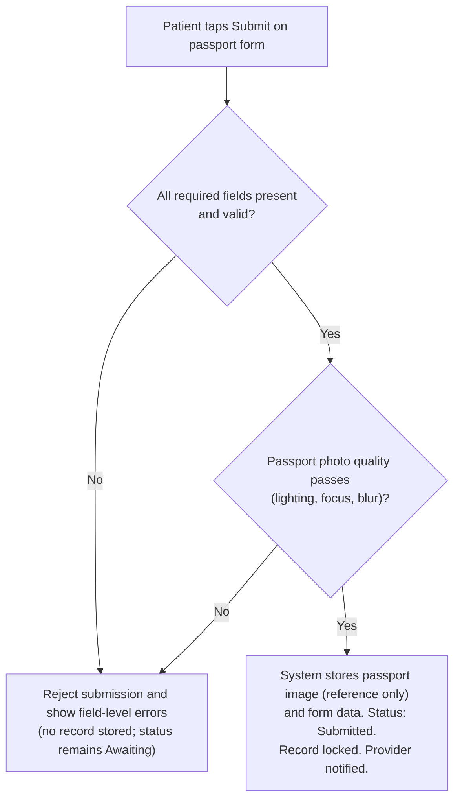
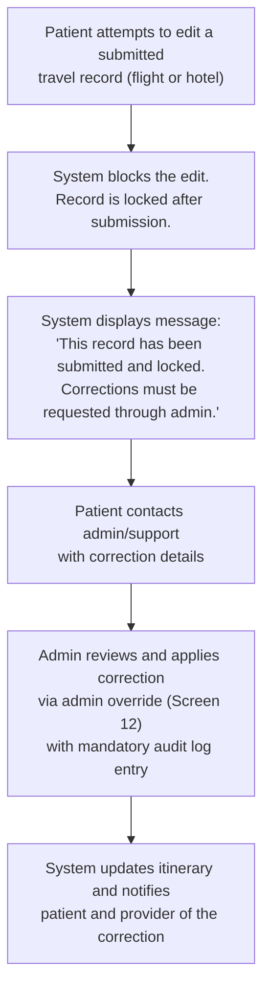

```mermaid
flowchart TD
    Start["Patient navigates to Profile → Payment Methods"] --> LoadList["System loads saved payment methods<br/>(tokenized references only)"]
    LoadList --> CheckEmpty{"Any saved<br/>payment methods?"}

    CheckEmpty -->|No| EmptyState["Display empty state (P03.1-S1):<br/>'No payment methods saved yet'<br/>with 'Add Payment Method' CTA"]
    CheckEmpty -->|Yes| ShowList["Display Payment Methods List (P03.1-S1)"]

    EmptyState --> TapAdd1["Patient taps 'Add Payment Method'"]
    TapAdd1 --> ShowAddForm

    ShowList --> ListAction{"Patient action"}
    ListAction -->|"Add Payment Method"| ShowAddForm["Display Add Payment Method Form (P03.1-S2)"]
    ListAction -->|"Set as Default"| SetDefault["System updates default indicator<br/>to selected method; shows confirmation"]
    SetDefault --> ShowList
    ListAction -->|"Edit" on a method| ShowEditForm["Display Edit Payment Method Form<br/>(P03.1-S2, pre-filled with editable fields)"]
    ListAction -->|"Remove" on a method| CheckRemovable{"Only saved method AND<br/>active payment obligations<br/>(pending booking payments<br/>or installments)?"}
    ListAction -->|Back| ExitFlow["Return to Profile screen"]

    CheckRemovable -->|Yes| BlockRemove["Show inline message:<br/>'Cannot remove your only payment method<br/>while you have pending payments.<br/>Add another method first.'"]
    BlockRemove --> ShowList
    CheckRemovable -->|No| ConfirmModal["Display Remove Confirmation Modal (P03.1-S3)"]

    ConfirmModal --> RemoveChoice{"Patient confirms<br/>removal?"}
    RemoveChoice -->|"Go Back"| ShowList
    RemoveChoice -->|"Remove"| ProcessRemove["System revokes token with<br/>payment gateway and deletes<br/>stored method reference"]
    ProcessRemove --> CheckWasDefault{"Was this the<br/>default method?"}
    CheckWasDefault -->|"Yes & other methods exist"| AutoReassign["System auto-assigns default<br/>to most recently added<br/>remaining method"]
    AutoReassign --> ShowList
    CheckWasDefault -->|No| ShowList

    ShowAddForm --> CardFields["Patient enters card details<br/>via payment gateway secure form<br/>(PCI-compliant hosted fields)"]

    CardFields --> GatewayValidate{"Payment gateway<br/>validates card?"}
    GatewayValidate -->|No| CardError["Show field-level error<br/>(invalid card / declined / expired)"]
    CardError --> CardFields
    GatewayValidate -->|Yes| Tokenize["Payment gateway tokenizes card;<br/>system stores token + masked details<br/>(brand, last 4, expiry)"]

    Tokenize --> CheckFirst{"Is this the patient's<br/>first payment method?"}
    CheckFirst -->|Yes| AutoDefault["Auto-set as default"]
    CheckFirst -->|No| RespectToggle["Apply patient's 'Set as default'<br/>toggle preference"]
    AutoDefault --> SaveSuccess["Show success confirmation<br/>and return to Payment Methods List"]
    RespectToggle --> SaveSuccess
    SaveSuccess --> ShowList

    ShowEditForm --> EditFields["Patient updates editable fields<br/>(billing address, nickname);<br/>card number/expiry change requires<br/>new card entry via gateway"]
    EditFields --> EditAction{"Patient action"}
    EditAction -->|Cancel| ShowList
    EditAction -->|Save| ValidateEdit{"Validation<br/>passes?"}
    ValidateEdit -->|No| EditError["Show field-level errors"]
    EditError --> EditFields
    ValidateEdit -->|Yes| UpdateMethod["System updates payment method<br/>metadata; refreshes list"]
    UpdateMethod --> ShowList
```

# Missing Mobile App Flows — Figma Design Complement Report

**Report Date**: 2026-02-05
**Report Type**: Design Gap Analysis & Screen Specification
**Platform**: Patient Mobile App
**Prepared For**: UI/UX Design Team
**Purpose**: Document missing flows not yet present in Figma, providing flow diagrams and screen specifications to guide design complementation.

---

## Summary Dashboard

| # | Flow | Module | Related FRs | Status |
| --- | --- | --- | --- | --- |
| P01.1 | Delete Account | P-01: Auth & Profile Management | FR-001, FR-026, FR-023 | 🟡 Specified |
| P01.2 | Settings Screen | P-01: Auth & Profile Management | FR-001, FR-020, FR-027 | 🟡 Specified |
| P01.3 | Change Password | P-01: Auth & Profile Management | FR-001 | 🟡 Specified |
| P02.1 | Compare Offers Side-by-Side | P-02: Quote Request & Management | FR-005 | 🟡 Specified |
| P02.2 | Cancel Inquiry | P-02: Quote Request & Management | FR-003, FR-005 | 🟡 Specified |
| P02.3 | Expired Offers/Quotes | P-02: Quote Request & Management | FR-004, FR-005 | 🟡 Specified |
| P02.4 | Legal/Policy Screens (Quote Context) | P-02: Quote Request & Management | FR-005, FR-027 | 🟡 Specified |
| P03.1 | Payment Methods Management | P-03: Booking & Payment | FR-007, FR-007b | 🟡 Specified |
| P04.1 | Passport Submission (Path A) | P-04: Travel & Logistics | FR-008 | 🟡 Specified |
| P04.2 | Flight & Hotel Submission (Path B) | P-04: Travel & Logistics | FR-008 | 🟡 Specified |
| P05.1 | Day-to-Day Treatment Progress | P-05: Aftercare & Progress Monitoring | FR-010, FR-011 | 🔴 Not Designed |
| P05.2 | Previous Treatments List | P-05: Aftercare & Progress Monitoring | FR-010, FR-011 | 🔴 Not Designed |
| P05.3 | Submitted Reviews List | P-05: Aftercare & Progress Monitoring | FR-013 | 🔴 Not Designed |
| P06.1 | Notification Listing & Bubble | P-06: Communication | FR-020 | 🔴 Not Designed |
| P08.1 | Help & Support | P-08: Help Center & Support Access | FR-033, FR-034 | 🔴 Not Designed |

---

## How to Use This Document

Each flow section below contains:

1. **Mermaid flow diagram** — visual representation of the user journey
2. **Screen specifications** — field-level detail in the standard 5-column table format
3. **Concise business rules** — key constraints per screen

**For agents filling in content**:

- Read the referenced FR PRD files under `local-docs/project-requirements/functional-requirements/` for full business context
- Screen spec tables use the standard 5-column format: **Field Name** | **Type** | **Required** | **Description** | **Validation Rules**
- Accepted `Type` values: `text`, `number`, `badge`, `checkbox`, `select`, `list`, `table`, `group`, `chips`, `buttons`, `modal`, `toggle`, `datetime`, `image`, `icon`, `link`, `action`
- Keep business rules to 3–5 bullet points per screen
- Use Mermaid `flowchart TD` (top-down) syntax for flow diagrams
- Reference specific FR screens where applicable (e.g., "FR-005 Screen 3")
- Wrap all mermaid node labels in quotes if they contain special characters

---

## P-01: Auth & Profile Management

### Flow P01.1: Delete Account

**Related FRs**: FR-001 (Patient Authentication), FR-026 (App Settings & Security), FR-023 (Data Retention & Compliance)
**Source Reference**: `local-docs/project-requirements/functional-requirements/fr001-patient-authentication/prd.md`, `fr023-data-retention-compliance/prd.md`
**Status**: 🟡 Specified

#### Flow Diagram


#### Screen Specifications

##### Screen P01.1-S1: Delete Account Warning

**Purpose**: Explain deletion request consequences before patient submits a deletion request (DSR)

| Field Name | Type | Required | Description | Validation Rules |
| --- | --- | --- | --- | --- |
| Warning Icon | icon | Yes | Red warning triangle or alert icon | Display at top of screen |
| Screen Title | text | Yes | "Delete Your Account" | Displayed prominently in red/destructive color |
| Back Navigation | action | Yes | Back arrow to return to Profile | Top-left corner |
| Blocking Message (Conditional) | group | Conditional | Displayed only if active treatment, aftercare, or payment in progress | Must block deletion with clear message: "Account deletion is unavailable during active care or payment processing. Please contact support or wait until completion." |
| Contact Support Link (Conditional) | link | Conditional | Shown only if blocking message is displayed | Opens support ticket flow (FR-034) |
| Consequences Header | text | Yes | "What may be deleted or anonymized:" | Bold, clear separator |
| Consequences List | list | Yes | Bulleted list of affected personal data categories | Must include: Profile and preferences, Messages/communications, Reviews content, Uploaded media (where not legally retained) |
| Retained Data Header | text | Yes | "What will be retained (legal requirement):" | Bold, clear separator |
| Retained Data Explanation | text | Yes | Explanation of legally retained records | Must state: "Medical and financial transaction records are retained for at least 7 years. Access is restricted and the legal basis will be documented in the deletion outcome." |
| Processing Timeline Notice | text | Yes | Informational message about processing time | Must state: "Verified deletion requests are completed within 30 calendar days." (FR-023) |
| Deletion Reason Selector (Optional) | select | No | Optional reason for requesting deletion | Optional; options are centrally managed (not hardcoded in this spec) |
| Final Confirmation Modal (Conditional) | modal | Conditional | Confirmation before submitting deletion request | Shown after "Request Deletion" tap; includes Confirm/Cancel; no irreversible deletion occurs at this step |
| Request Deletion Button | button | Yes | Primary CTA in destructive style (red) | Enabled unless blocked; tap triggers re-auth check and/or final confirmation modal |
| Go Back Button | button | Yes | Secondary CTA in default style | Returns to Profile screen, no changes saved |

**Business Rules**:

- Block deletion request when active treatment/aftercare or payment is in progress; provide support path (FR-001 Screen 14)
- Deletion reason is optional and must not block submission (FR-001 `deleteAccountRequest { reason? }`)
- Re-auth is required when last successful auth > 5 minutes (password or 6-digit email OTP) (FR-001 Screen 14)
- Submitting creates a Deletion Request (DSR) queued for Admin review; verified requests are completed within 30 calendar days with status updates (FR-023)
- If patient has an active inquiry, deletion request is allowed and system auto-closes open inquiries (FR-001 Screen 14)

##### Screen P01.1-S2: Identity Verification Step

**Purpose**: Verify patient identity before submitting deletion request

| Field Name | Type | Required | Description | Validation Rules |
| --- | --- | --- | --- | --- |
| Screen Title | text | Yes | "Verify Your Identity" | Displayed prominently |
| Back Navigation | action | Yes | Back arrow to return to warning screen (P01.1-S1) | Top-left corner |
| Security Icon | icon | Yes | Lock or shield icon indicating security step | Display at top center |
| Instruction Text | text | Yes | "For your security, please verify your identity before proceeding." | Clear, concise explanation |
| Verification Method Selector | chips | Yes | Options: "Password" or "Email OTP" | Methods per FR-001 for sensitive re-auth; allow patient to switch methods |
| Password Field | text | Conditional | Masked password input field; shown if "Password" method selected | Must match current account password; show/hide toggle icon |
| Email OTP Field | text | Conditional | 6-digit OTP input; shown if "Email OTP" method selected | System sends OTP to registered email; code expires in 15 minutes |
| Resend OTP Link | link | Conditional | Shown only if "Email OTP" method selected | Rate-limited; cooldown applies |
| Error Message | text | Conditional | Displayed on verification failure | Must be actionable: "Invalid password/OTP. Please try again." |
| Verify Button | button | Yes | Primary CTA in destructive style (red) | Disabled until password entered OR 6-digit OTP entered; validates and returns to final confirmation modal |
| Cancel Button | button | Yes | Secondary CTA in default style | Returns to Profile screen, cancels deletion flow |

**Business Rules**:

- Re-authentication is required when last successful auth > 5 minutes (password or 6-digit email OTP) (FR-001 Screen 14)
- Selecting "Email OTP" sends a 6-digit code to the registered email; code expires in 15 minutes; resend is rate-limited (FR-001 OTP rules)
- Verification failures, throttling, and any lockout behavior follow the configured authentication security policy (do not hardcode attempt counts in UI copy) (FR-001)
- Successful verification returns the patient to the final confirmation modal to submit the deletion request (FR-023)
- Patient can cancel at any time to exit without submitting a deletion request

##### Screen P01.1-S3: Deletion Request Submitted Confirmation

**Purpose**: Confirm deletion request (DSR) has been submitted and explain next steps

| Field Name | Type | Required | Description | Validation Rules |
| --- | --- | --- | --- | --- |
| Confirmation Icon | icon | Yes | Green checkmark or shield icon | Display at top center to indicate successful submission |
| Screen Title | text | Yes | "Deletion Request Submitted" | Displayed prominently |
| Request Status | badge | Yes | Current request status | Default: "Pending Admin Review" |
| Request Reference | text | Yes | Unique request reference ID | Read-only; used for support follow-up |
| Submitted Timestamp | datetime | Yes | Date/time request was submitted | Uses server time |
| Processing Timeline Notice | text | Yes | SLA expectation | Must state: "We complete verified deletion requests within 30 calendar days." (FR-023) |
| What Happens Next Section | group | Yes | Next steps list | Must include: "Your request will be reviewed", "You may be asked for additional verification", "You will receive status updates and the final outcome", "Open inquiries have been closed (if applicable)" |
| Retained Data Reminder | text | Yes | Reminder of legal retention | Must state medical/financial records retained ≥ 7 years with restricted access (FR-023) |
| Email Confirmation Notice | text | Yes | "A confirmation email has been sent to [patient email address]." | Show registered email |
| Back to Profile Button | button | Yes | Primary CTA | Returns to Profile screen |

**Business Rules**:

- Deletion request is queued for Admin review and processed after verification (FR-023)
- Verified deletion requests are completed within 30 calendar days; SLA may pause if additional verification is required (FR-023 Alternative Flow A1)
- If patient has an active inquiry, the system auto-closes open inquiries on request submission (FR-001 Screen 14)
- Outcome notification must document actions taken and legal basis for any retained records (FR-023)
- Non-protected personal data is deleted/anonymized; protected medical/financial records are retained (≥ 7 years) with restricted access (FR-023 REQ-023-005)

---

### Flow P01.2: Settings Screen

**Related FRs**: FR-001 (Patient Authentication), FR-020 (Notifications & Alerts), FR-027 (Legal Content Management)
**Source Reference**: `local-docs/project-requirements/functional-requirements/fr001-patient-authentication/prd.md`, `fr020-notifications-alerts/prd.md`, `fr027-legal-content-management/prd.md`
**Status**: 🟡 Specified

#### Flow Diagram


#### Screen Specifications

##### Screen P01.2-S1: Settings Main Screen

**Purpose**: Top-level settings navigation hub

| Field Name | Type | Required | Description | Validation Rules |
| --- | --- | --- | --- | --- |
| Screen Title | text | Yes | "Settings" | Displayed at top of screen |
| Back Navigation | action | Yes | Back arrow to return to Profile screen | Top-left corner |
| Navigation Section: Notifications | link | Yes | Row with bell icon + "Notification Settings" label + chevron | Navigates to P01.2-S2 |
| Navigation Section: Privacy & Security | link | Yes | Row with lock icon + "Privacy & Security" label + chevron | Navigates to P01.2-S3 |
| Navigation Section: Terms & Conditions | link | Yes | Row with document icon + "Terms & Conditions" label + chevron | Navigates to P01.2-S5 |
| Navigation Section: Help & Support | link | Yes | Row with help/question icon + "Help & Support" label + chevron | Navigates to Flow P08.1 (P-08: Help Center & Support Access) |

**Business Rules**:

- Navigation sections are static items — always visible in the same order (FR-001 Screen 16)
- Tapping a navigation row must open the corresponding settings screen/flow and preserve back navigation to P01.2-S1
- Terms & Conditions must open read-only legal content sourced and versioned per FR-027
- Help & Support always routes to Flow P08.1 (separate module P-08)
- Settings items are patient-app only; no provider/admin controls appear here

> **Help & Support** is specified under **P-08: Help Center & Support Access** → see [Flow P08.1](#flow-p081-help--support) below.
> The Settings main screen links to it as a navigation item.

##### Screen P01.2-S2: Notification Settings

**Purpose**: Manage push and email notification preferences

| Field Name | Type | Required | Description | Validation Rules |
| --- | --- | --- | --- | --- |
| Screen Title | text | Yes | "Notification Settings" | Displayed at top |
| Back Navigation | action | Yes | Back arrow to return to Settings main (P01.2-S1) | Top-left corner |
| Explanation Text | text | Yes | "Choose how you want to receive notifications from Hairline." | Displayed below title for context |
| MVP Notice (Conditional) | text | Conditional | "Per-category preferences coming soon. For now, you can enable/disable all notifications by channel." | Shown only in MVP; removed in V2 when per-category toggles ship |
| Global Email Toggle | toggle | Yes | Master switch: "Email Notifications" with ON/OFF state | Auto-saves immediately on toggle; default: ON |
| Global Push Toggle | toggle | Yes | Master switch: "Push Notifications" with ON/OFF state | Auto-saves immediately on toggle; default: ON |
| Mandatory Notifications Note | text | Yes | "Security notifications (password reset, account changes) are always sent and cannot be disabled." | Displayed below toggles as info text |
| System Event Notifications Note | text | Yes | "You will receive automatic notifications when your inquiry, booking, or payment status changes (including Inquiry Cancelled, Quote Received, Booking Confirmed, Payment events, and Aftercare reminders). These keep you informed of important updates." | Read-only informational text; explicitly lists system-driven event notifications per FR-001 Screen 16 and FR-020 |
| Save Status Indicator (Conditional) | text | Conditional | "Saved" or "Saving..." feedback | Shown briefly after toggle change; success message: "Preferences saved" |
| Error Message (Conditional) | text | Conditional | Displayed if save fails | "Failed to save preferences. Please try again." with Retry button; on failure, UI reverts to last saved state |

**Business Rules**:

- **MVP scope**: Only global Email/Push toggles available; per-category preferences (Quote, Booking, Payment, Treatment, Message, Promotional) are V2 and not shown in this screen (FR-020, FR-001 Screen 16)
- Security-critical notifications (email verification, password reset, account security alerts) are mandatory and cannot be disabled — not affected by global toggles
- System event notifications (inquiry stage changes, quote received, booking confirmed, payment events, aftercare reminders) are automatically sent per FR-020; user cannot disable individual events in MVP
- Changes auto-save immediately upon toggle (no explicit "Save" button); preference changes effective within 1 minute; default for new accounts: both Email and Push toggles ON (FR-001 Screen 16)
- If save fails, UI must revert to previous toggle state and show actionable error with Retry option (FR-001 Screen 16)

##### Screen P01.2-S3: Privacy & Security Menu

**Purpose**: Provide access to security and privacy items

| Field Name | Type | Required | Description | Validation Rules |
| --- | --- | --- | --- | --- |
| Screen Title | text | Yes | "Privacy & Security" | Displayed at top |
| Back Navigation | action | Yes | Back arrow to return to Settings main (P01.2-S1) | Top-left corner |
| Change Password | link | Yes | Row with key icon + "Change Password" label + chevron | Navigates to Flow P01.3 (Change Password) |
| Privacy Policy | link | Yes | Row with shield/document icon + "Privacy Policy" label + chevron | Navigates to P01.2-S4 |

**Business Rules**:

- Change Password must always route to Flow P01.3; this menu does not embed inline password-edit controls
- Privacy Policy is read-only static content sourced from the Legal Content system (FR-027)
- If legal content cannot be loaded, show a retry state and allow returning to P01.2-S1 without blocking the user
- This menu contains only patient-facing items (no admin/provider configuration)

##### Screen P01.2-S4: Privacy Policy

**Purpose**: Display Privacy Policy content (static/read-only)

| Field Name | Type | Required | Description | Validation Rules |
| --- | --- | --- | --- | --- |
| Screen Title | text | Yes | "Privacy Policy" | Displayed at top |
| Back Navigation | action | Yes | Back arrow to return to Privacy & Security menu (P01.2-S3) | Top-left corner |
| Policy Version | badge | Conditional | Current legal content version label | Shown if version metadata is available (FR-027) |
| Last Updated | datetime | Conditional | Last updated timestamp for the policy | Shown if available (FR-027) |
| Policy Content | text | Yes | Scrollable rich-text policy body | Must be readable and selectable; supports long content |

**Business Rules**:

- Policy content is read-only and must match the latest published Privacy Policy for the patient app (FR-027)
- If a newer version is published while the user is viewing, the app may prompt to refresh but must not interrupt reading
- If content fails to load, show a non-blocking error state with Retry and Back
- Analytics/audit (if implemented) must not capture the policy text itself; only view events and version identifiers (privacy-by-design)

##### Screen P01.2-S5: Terms & Conditions

**Purpose**: Display Terms & Conditions content (static/read-only)

| Field Name | Type | Required | Description | Validation Rules |
| --- | --- | --- | --- | --- |
| Screen Title | text | Yes | "Terms & Conditions" | Displayed at top |
| Back Navigation | action | Yes | Back arrow to return to Settings main (P01.2-S1) | Top-left corner |
| Document Version | badge | Conditional | Current legal content version label | Shown if version metadata is available (FR-027) |
| Last Updated | datetime | Conditional | Last updated timestamp for the document | Shown if available (FR-027) |
| Document Content | text | Yes | Scrollable rich-text terms body | Must be readable and selectable; supports long content |

**Business Rules**:

- Terms content is read-only and must match the latest published Terms & Conditions for the patient app (FR-027)
- If a newer version is published while the user is viewing, the app may prompt to refresh but must not interrupt reading
- If content fails to load, show a non-blocking error state with Retry and Back
- Analytics/audit (if implemented) must not capture the document text itself; only view events and version identifiers (privacy-by-design)

---

### Flow P01.3: Change Password

**Related FRs**: FR-001 (Patient Authentication)
**Source Reference**: `local-docs/project-requirements/functional-requirements/fr001-patient-authentication/prd.md`
**Status**: 🟡 Specified

#### Flow Diagram


#### Screen Specifications

##### Screen P01.3-S1: Change Password Form

**Purpose**: Let an authenticated patient change their password (with an escape hatch to password reset)

| Field Name | Type | Required | Description | Validation Rules |
| --- | --- | --- | --- | --- |
| Screen Title | text | Yes | "Change Password" | Displayed at top |
| Back Navigation | action | Yes | Back arrow to return to Privacy & Security menu (P01.2-S3) | Top-left corner |
| Current Password | text | Yes | Masked password input | Required unless user chooses "Forgot your password?" |
| Forgot Your Password Link | link | Yes | "Forgot your password?" link shown under Current Password | Navigates to FR-001 Screen 10 (Password Reset Initiation) |
| New Password | text | Yes | Masked password input | Must meet password policy (FR-001) |
| Confirm New Password | text | Yes | Masked password input | Must match New Password exactly |
| Password Policy Helper | text | Yes | Short reminder of password requirements | Must not list attempt limits; reference policy only |
| Save Button | button | Yes | Primary CTA: "Save" | Disabled until required fields are present |
| Error Message (Conditional) | text | Conditional | Inline field-level errors | Must not reveal whether current password or account exists |

**Business Rules**:

- Current password is required for an in-session password change; if user cannot provide it they must use the password reset flow (FR-001 Screens 10–12)
- New password must meet password policy and cannot reuse the last 5 passwords (FR-001 Password Rules)
- Validation errors must be shown inline without revealing sensitive details (avoid “current password incorrect” style disclosures)
- Retry/lockout behavior follows configured authentication throttling policy; UI must not hardcode attempt counts (FR-001)
- On successful change, prior refresh tokens are revoked and the current session remains active (FR-001 Screen 16)

##### Screen P01.3-S2: Password Changed Confirmation

**Purpose**: Confirm password change and return user back to settings

| Field Name | Type | Required | Description | Validation Rules |
| --- | --- | --- | --- | --- |
| Confirmation Icon | icon | Yes | Success check icon | Displayed prominently |
| Screen Title | text | Yes | "Password Updated" | Displayed prominently |
| Message Text | text | Yes | Short confirmation copy | Must not include attempt limits or sensitive details |
| Done Button | button | Yes | "Done" | Returns to Privacy & Security menu (P01.2-S3) |

**Business Rules**:

- Confirmation must be shown only after the server confirms the change
- If token revocation fails after password change succeeds, the user still sees success but the app must retry revocation in background and log a security event
- Returning to Settings must preserve navigation state (back stack returns to P01.2-S3)

---

## P-02: Quote Request & Management

### Flow P02.1: Compare Offers Side-by-Side

**Related FRs**: FR-005 (Quote Comparison & Acceptance)
**Source Reference**: `local-docs/project-requirements/functional-requirements/fr005-quote-comparison-acceptance/prd.md`
**Status**: 🟡 Specified

#### Flow Diagram


#### Screen Specifications

##### Screen P02.1-S1: Inquiry Dashboard with Quote Comparison (Enhanced)

**Purpose**: Patient views inquiry status, compares received quotes, and may accept one quote (FR-005 Screen 1)

**Inquiry-Level Fields** (always visible; one instance per screen):

| Field Name | Type | Required | Description | Validation Rules |
| --- | --- | --- | --- | --- |
| Screen Context | text | Yes | Enhanced Inquiry Dashboard | Extends FR-003 Screen 8 with FR-005 comparison & acceptance |
| Current Stage | badge | Yes | Inquiry stage (Inquiry/Quoted/Accepted/Cancelled/...) | Valid lifecycle value |
| Timeline | list | Yes | Chronological status changes | Timestamps present |
| Inquiry Summary | group | Yes | Read-only inquiry info | Complete and consistent |
| Medical Alerts | chips | Yes | Patient medical risk level | Read-only; from FR-003 |
| Deadlines | datetime | Yes | Response/expiry deadlines | Future or past allowed |
| Next Actions | buttons | Yes | Available user actions for the inquiry | Based on stage/permissions |

**Per-Quote Card Fields** (repeated for each quote in the list):

| Field Name | Type | Required | Description | Validation Rules |
| --- | --- | --- | --- | --- |
| Treatment | text | Yes | Treatment name | Read-only |
| Inclusions | chips | No | Package/customizations | Read-only |
| Included Services | list | No | Included services list | Read-only; derived from quote inclusions |
| Per-date Pricing | table | Yes | Price for each offered date | All dates priced |
| Appointment Slot (Pre-Scheduled) | datetime | Yes | Pre-scheduled appointment date/time | Read-only; sourced from FR-004 |
| Price per Graft | number | Yes | Derived unit price (total ÷ graft count) | Calculated |
| Provider Reviews | text | No | Review rating and count | Read-only; sourced from FR-013 |
| Provider Credentials Summary | text | Yes | Licenses/certifications summary | Read-only; sourced from FR-015 |
| Expiry Timer | timer | Yes | Countdown until quote expiry; shows static "Expired on [date]" when expired | Derived from quote expiresAt |
| Actions | buttons | Yes | View Details, Accept, Contact Support | State-aware enabling; Accept disabled if expired/withdrawn/already accepted; Contact Support opens secure messaging thread with Hairline Support via FR-012 (FR-005) |

**Quote List & Comparison Panel Fields** (list controls always visible; comparison panel renders only when ≥2 quotes selected):

| Field Name | Type | Required | Description | Validation Rules |
| --- | --- | --- | --- | --- |
| Quotes Received | list | Yes | Provider quotes with key highlights | Must list all non-archived quotes |
| Sort & Filter | group | Yes | Sort/filter quotes (e.g., price, grafts, rating, date) | Criteria list must be defined (FR-005) |
| Compare Selection (Per Quote) | checkbox | No | Select quotes to compare side-by-side | Max 3 selected; disabled for expired/withdrawn quotes |
| Comparison View Panel | group | Conditional | Side-by-side comparison panel for selected quotes | Renders only when ≥2 quotes are selected |
| Comparison Differentiators | table | Conditional | Comparison rows across selected quotes; draws data from Per-Quote Card Fields above | Must include at least: total price, price per graft, graft count, review rating/count, soonest appointment slot, provider credentials summary, included services checklist (FR-005 REQ-005-014) |

**Business Rules**:

- Quotes are displayed within the Inquiry Dashboard context; comparison is a conditional panel (not a separate screen) (FR-005 Screen 1)
- Patient can compare up to 3 quotes; comparison view renders only when ≥ 2 quotes are selected (FR-005)
- Expired/withdrawn quotes are visually disabled and cannot be selected or accepted (FR-005)
- Patient can sort/filter quotes and view details; acceptance continues via FR-005 Screen 2 & 3 (FR-005)
- Exactly one quote can be accepted per inquiry; competing quotes are auto-cancelled as part of the FR-005 acceptance workflow (FR-005)
- If inquiry stage is "Cancelled", all Accept buttons and Compare checkboxes are disabled; dashboard is read-only with "Cancelled" badge; quote data remains visible for reference (FR-005 Screen 1)

---

### Flow P02.2: Cancel Inquiry

**Related FRs**: FR-003 (Inquiry Submission), FR-005 (Quote Comparison & Acceptance)
**Source Reference**: `local-docs/project-requirements/functional-requirements/fr003-inquiry-submission/prd.md`, `fr005-quote-comparison-acceptance/prd.md`
**Status**: 🟡 Specified

#### Flow Diagram


#### Screen Specifications

##### Screen P02.2-S1: Cancel Inquiry Confirmation Modal

**Purpose**: Confirm patient's intent to cancel and capture cancellation reason

| Field Name | Type | Required | Description | Validation Rules |
| --- | --- | --- | --- | --- |
| Warning Icon | icon | Yes | Red warning triangle or alert icon | Displayed at top of modal |
| Modal Title | text | Yes | "Cancel Inquiry?" | Displayed prominently in red/destructive color |
| Warning Message | text | Yes | Explanation of consequences | "Canceling this inquiry is irreversible. All quotes you've received will be cancelled and providers will be notified." |
| Current Stage Badge | badge | Yes | Shows inquiry current stage | Enum: "Inquiry", "Quoted", "Accepted"; read-only |
| Inquiry Reference | text | Yes | Inquiry ID (HPID format) | Read-only; format: HPID + YY + MM + 4-digit sequence |
| Impact Summary | text | Yes | Summary of cancellation impact | Conditional text based on stage: "X active quotes will be cancelled" OR "No quotes received yet" |
| Cancellation Reason Label | text | Yes | "Why are you cancelling?" | Required field indicator shown |
| Cancellation Reason Selector | select | Yes | Dropdown or radio list of predefined reasons | Must select one option from list |
| Cancellation Reason Options | list | Yes | Predefined cancellation reasons | Options: "Changed my mind", "Found a better option elsewhere", "Medical concerns", "Financial reasons", "Travel restrictions", "Timeline doesn't work", "Other" |
| Additional Notes (Conditional) | text | Conditional | Free text field; shown when "Other" selected | Required if "Other" selected; max 500 characters; placeholder: "Please explain..." |
| Optional Feedback Field | text | No | General feedback text area | Optional for all reasons; max 1000 characters; placeholder: "Any additional feedback? (Optional)" |
| Provider Notification Note | text | Yes | Informational message | "Affected providers will be notified of this cancellation within 5 minutes" |
| Confirm Cancellation Button | button | Yes | Destructive primary CTA | Red/destructive style; label: "Confirm Cancellation"; disabled until reason selected |
| Go Back Button | button | Yes | Secondary CTA to dismiss modal | Default/neutral style; label: "Go Back"; closes modal without action |

**Business Rules**:

- Source of truth: FR-003 Workflow 5 and Screen 8a define the canonical cancellation flow, eligible stages (Inquiry, Quoted, Accepted), and cancellation rules. This screen extends FR-003 Screen 8a with design-level detail.
- Allowable stages and impacts on quotes/reservations are defined in FR-003 Workflow 5 steps 1–3 and Cancellation Rules (Business Rules §4)
- Cancellation reason options are admin-configurable via FR-026 Screen 5a; initial set defined in FR-003 Screen 8a
- All state changes, audit logging, and notifications align with FR-003 Workflow 5 steps 3–4 and the confirmed inquiry lifecycle and privacy constraints
- **Privacy constraint**: The patient's cancellation reason is patient-private data collected for internal analytics and audit. It is NOT shared with providers in any notification or dashboard view (FR-003 Workflow 5 Step 4)

##### Screen P02.2-S2: Cancellation Success Confirmation

**Purpose**: Confirm the inquiry has been successfully cancelled

| Field Name | Type | Required | Description | Validation Rules |
| --- | --- | --- | --- | --- |
| Success Icon | icon | Yes | Checkmark or completion illustration | Green color; displayed at top center |
| Confirmation Title | text | Yes | "Inquiry Cancelled" | Displayed prominently below icon |
| Confirmation Message | text | Yes | Brief success message | "Your inquiry has been successfully cancelled." |
| Cancelled Inquiry Reference | text | Yes | Inquiry ID (HPID format) | Read-only; format: HPID + YY + MM + 4-digit sequence; label: "Reference:" |
| Cancellation Timestamp | datetime | Yes | Date and time of cancellation | Format: "Cancelled on [Month DD, YYYY] at [HH:MM AM/PM]" |
| Impact Summary | text | Yes | Summary of what was cancelled | Conditional based on inquiry stage:<br/>- "Your inquiry was cancelled."<br/>- "Your inquiry and X active quote(s) were cancelled."<br/>- "Your inquiry, accepted quote, and reservation were cancelled." |
| Provider Notification Status | text | Yes | Confirmation of provider notification | "All affected providers have been notified of this cancellation." |
| Next Steps Section Label | text | Yes | Section header | "What would you like to do next?" |
| Back to My Inquiries Button | button | Yes | Primary CTA | Default style; label: "Back to My Inquiries"; navigates to Inquiry Dashboard (FR-003 Screen 8) |
| Start New Inquiry Button | button | Yes | Secondary CTA | Outlined/secondary style; label: "Start New Inquiry"; navigates to Inquiry Creation flow (FR-003 Screen 1) |
| Contact Support Link | link | No | Optional support contact link | Text link; label: "Need help? Contact support"; navigates to Help & Support (Flow P08.1) |

**Business Rules**:

- Source of truth: FR-003 Screen 8b defines the canonical success confirmation spec. This screen extends FR-003 Screen 8b with design-level detail.
- Cancellation timestamp must reflect server time (not client) per FR-003 Screen 8b business rules; impact summary must match the actual cascade results from Workflow 5 steps 3–4
- Primary next steps return patient to Inquiry Dashboard (FR-003 Screen 8) or allow starting a new inquiry (FR-003 Screen 1); support link is optional
- Cancelled inquiries are read-only and not re-openable per FR-003 Cancellation Rules §4; patient starts a new inquiry to proceed
- Provider notifications confirm cancellation occurrence only; the patient's cancellation reason and feedback are not disclosed to providers (FR-003 Workflow 5 Step 4)

---

### Flow P02.3: Expired Offers/Quotes

**Related FRs**: FR-004 (Quote Submission), FR-005 (Quote Comparison & Acceptance)
**Source Reference**: `local-docs/project-requirements/functional-requirements/fr005-quote-comparison-acceptance/prd.md`
**Status**: 🟡 Specified

#### Flow Diagram


#### Screen Specifications

##### Screen P02.3-S1: Expired Quote Indicator (State Variation within Inquiry Detail)

**Purpose**: Visual treatment for expired quotes in the quote list and detail view

| Field Name | Type | Required | Description | Validation Rules |
| --- | --- | --- | --- | --- |
| Expired Badge | badge | Yes | "Expired" label overlaid on the quote card | Red/muted badge; always visible on expired quote cards |
| Card Overlay Styling | group | Yes | Grayed-out / reduced-opacity treatment for the entire quote card | Opacity ~50%; text color muted; visually distinct from active quotes |
| Expiry Date Display | datetime | Yes | "Expired on [date]" shown below or replacing the countdown timer | Replaces the active Expiry Timer field (FR-005 Screen 1); format: "Expired on [Month DD, YYYY at HH:MM]" |
| Original Quote Summary | group | Yes | Treatment name, price, graft count, provider, appointment slot — all visible but de-emphasized | Read-only; same data as active quote card but with muted visual treatment |
| Price per Graft | number | Yes | Derived unit price, shown for reference | Read-only; muted styling |
| Provider Info | text | Yes | Provider name and credentials summary | Read-only; muted styling |
| Disabled Accept Button | button | Yes | "Accept" button in disabled/grayed-out state | Permanently disabled; non-tappable; shows tooltip on tap: "This quote has expired and can no longer be accepted" |
| Disabled Compare Checkbox | checkbox | Yes | Selection checkbox for comparison, disabled | Cannot be selected; excluded from comparison panel (FR-005) |
| View Details Action | action | Yes | "View Details" link/button remains tappable | Opens quote detail in read-only mode with expired overlay |
| Contact Support Link | link | No | "Need help? Contact support" | Navigates to Flow P08.1; shown below disabled Accept button |

**Business Rules**:

- Expired quotes cannot be accepted under any circumstance; the Accept button is permanently disabled and shows an explanatory tooltip on tap (FR-005 REQ-005-004)
- Expired quotes remain visible in the quote list for reference but are visually de-emphasized with grayed-out styling (FR-005 Alternative Flow A1)
- The countdown timer is replaced by a static "Expired on [date]" display derived from the quote's `expiresAt` field (FR-004)
- Expired quotes cannot be selected for side-by-side comparison (FR-005 Screen 1, Compare Selection)
- If all quotes for an inquiry are expired, the quote list area transitions to the "All Quotes Expired" state (Screen P02.3-S2)

##### Screen P02.3-S2: All Quotes Expired State

**Purpose**: Action state displayed when all received quotes for an inquiry have expired

| Field Name | Type | Required | Description | Validation Rules |
| --- | --- | --- | --- | --- |
| Expired State Icon | icon | Yes | Clock or hourglass illustration indicating all quotes have expired | Displayed at top center; muted/neutral color |
| State Title | text | Yes | "All Quotes Have Expired" | Displayed prominently below icon |
| Explanation Message | text | Yes | "The quotes you received for this inquiry have all expired. You can cancel this inquiry and submit a new one, or contact support for assistance." | Clear, actionable copy |
| Inquiry Summary | group | Yes | Read-only summary of the original inquiry | Must include: treatment type, submission date, number of expired quotes |
| Expired Quotes Count | text | Yes | "X quote(s) expired" | Derived from expired quotes for this inquiry |
| Last Expiry Date | datetime | Yes | Date of the most recently expired quote | Format: "Last quote expired on [Month DD, YYYY]" |
| Cancel Inquiry Button | button | Yes | Primary CTA: "Cancel Inquiry" | Default/primary style; navigates to Flow P02.2 (Cancel Inquiry) |
| Contact Support Link | link | Yes | "Need help? Contact support" | Text link; navigates to Flow P08.1 |

**Business Rules**:

- When all quotes for an inquiry have expired, the patient's primary options are to cancel the inquiry (and optionally start a new one) or contact support for assistance; there is no mechanism to re-open the same inquiry for new quotes (re-quoting is not a defined inquiry lifecycle transition)
- Previously expired quotes remain visible below the All Expired state as a collapsed reference section (grayed out, read-only) for the patient's reference
- Patient may cancel the inquiry entirely from this state via the Cancel Inquiry flow (Flow P02.2, FR-003 Workflow 5); cancellation eligibility follows standard stage rules (Inquiry, Quoted, or Accepted stages only — per FR-003 Cancellation Rules §4)
- The default quote expiry window is 48 hours (admin-controlled via FR-004 REQ-004-002)
- The "All Quotes Expired" state can only occur when the inquiry is in a stage where quotes are active (Quoted or Inquiry); it cannot occur in Confirmed or later stages because those require an accepted (non-expired) quote

---

### Flow P02.4: Legal/Policy Screens (Quote Context)

**Related FRs**: FR-005 (Quote Comparison & Acceptance), FR-027 (Legal Content Management)
**Source Reference**: `local-docs/project-requirements/functional-requirements/fr027-legal-content-management/prd.md`, `fr005-quote-comparison-acceptance/prd.md`
**Status**: 🟡 Specified

#### Flow Diagram


> **Note**: These screens are **read-only document viewers**. No acceptance checkbox or action is required here. The actual terms acknowledgment occurs on the Quote Detail screen (FR-005 Screen 2) via the Terms Acknowledgment checkbox before the Accept button is enabled.

#### Screen Specifications

##### Screen P02.4-S1: Legal Document Viewer (Shared Screen)

**Purpose**: Reusable full-screen viewer for static legal documents accessed from the Quote Detail screen. Renders one of three document types depending on the link tapped: **Cancellation Policy**, **Privacy Commitment**, or **Terms of Service**.

| Field Name | Type | Required | Description | Validation Rules |
| --- | --- | --- | --- | --- |
| Screen Title | text | Yes | Dynamic based on document type: "Cancellation Policy", "Privacy Commitment", or "Terms of Service" | Displayed at top of screen; must match the tapped link |
| Back Navigation | action | Yes | Back arrow to return to Quote Detail (FR-005 Screen 2) | Top-left corner |
| Document Version | badge | Conditional | Version label of the legal document | Shown if version metadata is available (FR-027) |
| Last Updated | datetime | Conditional | Last updated timestamp for the document | Shown if available; format: "Last updated [Month DD, YYYY]" (FR-027) |
| Document Content | text | Yes | Scrollable rich-text document body | Must be readable and selectable; supports headings, numbered sections, lists, and long content; rendered from Markdown or rich text |
| Table of Contents | list | Conditional | Section navigation links for long documents | Shown if document exceeds a threshold length; tapping a section title scrolls to that section |
| Scroll Progress Indicator | group | No | Visual indicator of reading progress | Shown for long documents; progress bar or page position indicator |

**Business Rules**:

- Content is read-only; no acceptance checkbox or action is required on this screen — the actual acknowledgment occurs on the Quote Detail screen via the Terms Acknowledgment checkbox (FR-005 Screen 2)
- **Display name → FR-027 document type mapping**: "Cancellation Policy" → `cancellation_policy`, "Privacy Commitment" → `privacy_policy`, "Terms of Service" → `terms_and_conditions`. These are patient-facing display names chosen for the quote acceptance context; the canonical FR-027 type identifiers are used in the backend and admin UI
- All three document types are platform-wide static content, managed centrally by admin via FR-027; there are no provider-specific, treatment-specific, or patient-specific variants
- Content version shown must be the **current published version** at the time the patient views it; this is the version the patient will agree to when they accept the quote (FR-027 REQ-027-004)
- If a localized version is unavailable, default to English (en-US) per FR-027 CL-3
- If content fails to load, show a non-blocking error state with Retry and Back options; do not prevent the patient from returning to the Quote Detail screen

---

## P-03: Booking & Payment

### Flow P03.1: Payment Methods Management

**Related FRs**: FR-007 (Payment Processing), FR-007b (Payment Installments)
**Source Reference**: `local-docs/project-requirements/functional-requirements/fr007-payment-processing/prd.md`, `fr007b-payment-installments/prd.md`
**Status**: 🟡 Specified

#### Flow Diagram



#### Screen Specifications

##### Screen P03.1-S1: Payment Methods List

**Purpose**: Display all saved payment methods with management actions; accessed from patient Profile area

**Related FR Screens:**

- **FR-007 Screen 1** (Patient Checkout - Deposit): Uses saved payment methods from this list in payment method selection dropdown
- **FR-007 Screen 2** (Patient Final Payment): Reuses billing details structure from this screen's Add/Edit form
- **FR-007B Screen 2** (Patient Booking Details - Installment Schedule View): Links to this screen via "Update Payment Method" action for updating installment payment methods

| Field Name | Type | Required | Description | Validation Rules |
| --- | --- | --- | --- | --- |
| Screen Title | text | Yes | "Payment Methods" | Displayed at top of screen |
| Back Navigation | action | Yes | Back arrow to return to Profile screen | Top-left corner |
| Payment Method Cards | list | Yes | List of saved payment methods; each card displays: payment type icon (Visa/MC/Amex), card brand, masked last 4 digits (e.g., "•••• 4242"), expiry date (MM/YY), and default badge if applicable | Must list all saved methods; ordered: default first, then by most recently added |
| Default Badge (Per Card) | badge | Conditional | "Default" label shown on the default payment method card | Exactly one method marked as default at any time (if methods exist) |
| Per-Card Action: Set as Default | action | Conditional | "Set as Default" option on non-default cards | Not shown on the card already marked as default; tap updates default indicator immediately |
| Per-Card Action: Edit | action | Yes | "Edit" option on each card | Opens P03.1-S2 in edit mode with pre-filled editable fields |
| Per-Card Action: Remove | action | Yes | "Remove" option on each card | Opens confirmation modal (P03.1-S3); blocked if this is the only method and active payment obligations exist |
| Add Payment Method Button | button | Yes | Primary CTA: "+ Add Payment Method" | Always visible at bottom of list or as floating action; navigates to P03.1-S2 in add mode |
| Empty State Illustration | group | Conditional | Illustration + "No payment methods saved yet" message + "Add your first payment method to get started" subtext | Shown only when no payment methods exist |
| Empty State CTA | button | Conditional | "Add Payment Method" button within empty state | Same action as Add Payment Method Button; prominent styling |
| Active Obligations Notice (Conditional) | text | Conditional | "You have pending payments — at least one payment method is required." | Shown only when patient has active bookings with pending deposit, final payment, or installments |
| Error State (Conditional) | text | Conditional | "Unable to load payment methods. Please try again." with Retry button | Shown if API call fails; allows retry without leaving screen |

**Business Rules**:

**Glossary:**

- **Active Payment Obligations**: Any of: (1) Pending deposit (booking Accepted, deposit unpaid), (2) Pending final payment (booking Confirmed, final payment not paid), (3) Active installment plan (1+ installments remaining), (4) Failed/overdue installments in retry cycle.

- At least one saved payment method is required if the patient has active bookings with pending payments (deposit, final payment, or installment charges); the system must prevent the patient from removing their last method in this case (FR-007, FR-007b)
- The default payment method is used for installment auto-charges (FR-007b); patients should be informed of this when changing the default
- All card details are tokenized via the payment gateway — the platform stores only the token reference, card brand, last 4 digits, and expiry date; full card numbers are never stored or displayed (FR-007 REQ-007-008, PCI-DSS)
- If the default method is removed and other methods exist, the system auto-reassigns the default to the most recently added remaining method and shows a brief notification to the patient

##### Screen P03.1-S2: Add/Edit Payment Method

**Purpose**: Secure form to add a new payment method or update editable fields of an existing one

| Field Name | Type | Required | Description | Validation Rules |
| --- | --- | --- | --- | --- |
| Screen Title | text | Yes | Dynamic: "Add Payment Method" (add mode) or "Edit Payment Method" (edit mode) | Displayed at top of screen |
| Back Navigation | action | Yes | Back arrow to return to Payment Methods List (P03.1-S1) | Top-left corner; prompts discard confirmation if unsaved changes exist |
| Secure Form Notice | text | Yes | "Your payment details are secured and encrypted" with lock icon | Displayed above card input fields; builds trust |
| Card Number Input | text | Yes (card type) | Card number field with live formatting (spaces every 4 digits) and card brand icon auto-detection (Visa/MC/Amex) | Rendered via payment gateway hosted/secure field (PCI-compliant); Luhn algorithm validation; 13–19 digits depending on brand; in edit mode, shown as masked read-only "•••• 4242" with "Replace card" link to re-enter |
| Cardholder Name | text | Yes (card type) | Full name as printed on card | Required; alphabetic characters, spaces, hyphens, and apostrophes allowed; max 100 characters |
| Expiry Date | text | Yes (card type) | Card expiry in MM/YY format | Must be a current or future month/year; auto-formats with "/" separator as user types |
| CVV/CVC | text | Yes (card type) | Security code on card | 3 digits (Visa/Mastercard/Discover) or 4 digits (Amex); rendered via payment gateway hosted field; never stored |
| Billing Address (Conditional) | group | Conditional | Address line 1, Address line 2 (optional), City, State/Region, Postal code, Country selector | Required if payment gateway mandates billing address for the patient's region; country defaults to patient profile country |
| Method Nickname (Optional) | text | No | Custom label for this payment method (e.g., "Personal Visa", "Business Card") | Max 50 characters; defaults to "[Brand] ending in [last 4]" if not provided |
| Set as Default Toggle | toggle | No | "Set as my default payment method" | Default: ON if this is the patient's first method (auto-set); OFF otherwise; toggle state saved on form submission |
| Save Button | button | Yes | Primary CTA: "Save Payment Method" (add mode) or "Save Changes" (edit mode) | Disabled until all required fields are valid; for card type, triggers payment gateway tokenization before saving |
| Cancel Button | action | Yes | Secondary action: "Cancel" | Returns to P03.1-S1 without saving; prompts confirmation if fields have been modified |
| Secure Transaction Badge | group | Yes | PCI compliance / encryption indicator (e.g., lock icon + "Secured by [Payment Processor]") | Displayed at bottom of form; non-interactive |
| Field-Level Error Messages (Conditional) | text | Conditional | Inline validation errors displayed below each invalid field | Must be specific and actionable: "Card number is invalid", "Card has expired", "CVV must be [3/4] digits" |
| Gateway Error Message (Conditional) | text | Conditional | Error returned by payment gateway after tokenization attempt | Must be user-friendly: "Your card was declined. Please check your details or try a different card."; do not expose raw gateway error codes |

**Business Rules**:

- **Edit mode field restrictions**: In edit mode, only metadata fields are editable (billing address, method nickname, default toggle); payment credentials (card number, CVV, expiry date) cannot be edited — they can only be replaced by deleting the entire payment method token and creating a new one via the "Replace card" flow
- **PCI compliance**: Card number and CVV fields are rendered by the payment gateway's secure hosted fields (e.g., Stripe Elements); card data is sent directly to the payment gateway for tokenization and is never transmitted to or stored on app servers (FR-007 REQ-007-008)
- Card number must pass Luhn algorithm validation; card brand is auto-detected from the first digits (BIN range) and the brand icon updates in real-time as the patient types
- Expiry date must be a current or future month/year; expired cards are rejected at the form level before gateway submission
- CVV is 3 digits for Visa/Mastercard/Discover or 4 digits for Amex; this field is used only for initial validation and is never stored after tokenization
- If this is the patient's first payment method, the "Set as default" toggle is forced ON and cannot be turned off (at least one default must exist) (FR-007b)
- In edit mode, the card number is displayed as a masked read-only field ("•••• 4242"); changing the card number requires the patient to tap "Replace card" which clears and re-renders the gateway secure fields for a new card entry — this creates a new token and replaces the old one
- All form fields must preserve entered data if a submission attempt fails, allowing the patient to correct errors and retry without re-entering everything (FR-007 Screen 1 Notes)

##### Screen P03.1-S3: Remove Payment Method Confirmation Modal

**Purpose**: Confirm patient's intent to remove a saved payment method

| Field Name | Type | Required | Description | Validation Rules |
| --- | --- | --- | --- | --- |
| Warning Icon | icon | Yes | Red warning triangle or alert icon | Displayed at top of modal |
| Modal Title | text | Yes | "Remove Payment Method?" | Displayed prominently in red/destructive color |
| Method Summary | group | Yes | Shows the method being removed: payment type icon, card brand, masked last 4 digits, and expiry date | Read-only; matches the card being removed for clear identification |
| Warning Message | text | Yes | Consequence explanation | Dynamic text based on context: If method is used for active installments: "This payment method is currently used for scheduled installment payments. Removing it will require you to update the payment method for those payments." Otherwise: "This payment method will be permanently removed from your account." |
| Default Reassignment Notice (Conditional) | text | Conditional | "Your default payment method will be reassigned to [next method description]." | Shown only if the method being removed is the current default and other methods exist |
| Active Installments Warning (Conditional) | text | Conditional | "You have active installment plans using this card. Please update the payment method for those bookings after removal." | Shown only if the method is linked to active installment schedules (FR-007b) |
| Remove Button | button | Yes | Destructive primary CTA: "Remove" | Red/destructive style; triggers removal and token revocation |
| Go Back Button | button | Yes | Secondary CTA: "Go Back" | Default/neutral style; dismisses modal without action |

**Business Rules**:

- Removal is blocked entirely (modal does not open) if this is the patient's only payment method and active payment obligations exist (pending deposit, final payment, or installment charges); the block message is shown inline on P03.1-S1 instead
- If the removed method was the default, the system automatically reassigns the default to the most recently added remaining method and briefly notifies the patient
- If the removed method is linked to active installment plans (FR-007b), the patient is warned and must update the payment method for those bookings separately — installment auto-charges will fail if no valid method is on file
- On confirmation, the system revokes the payment token with the payment gateway and deletes the stored method reference (token, masked details); this action is irreversible
- The modal must clearly identify which method is being removed (brand + last 4 digits) to prevent accidental deletion of the wrong method

---

## P-04: Travel & Logistics

### Flow P04.1: Passport Submission (Path A — Provider-Included Travel)

**Related FRs**: FR-008 (Travel & Logistics Coordination)
**Source Reference**: `local-docs/project-requirements/functional-requirements/fr008-travel-booking-integration/prd.md` — Screen 1, Main Flow 1, Alternative Flow A1, Business Rules (Passport Rules, Automated Trigger)
**Status**: 🟡 Specified

> **Scope**: This flow covers the **patient-side passport submission** for **Path A (provider-included travel)** only. Passport submission is **not required** and not shown for Path B (patient self-booked travel) — see FR-008 REQ-008-005 / REQ-008-005b.

#### Flow Diagram



```mermaid
flowchart TD
    Start["[AUTOMATED] Inquiry reaches Confirmed status<br/>(deposit paid, booking confirmed per FR-006)<br/>AND package includes provider-booked travel (Path A).<br/>System sends passport submission request<br/>to patient (in-app + email). (REQ-008-005)"] --> Navigate["Patient opens notification or navigates<br/>to Booking Detail → Travel section"]
    Navigate --> CheckExisting{"Passport already<br/>submitted for this<br/>appointment?"}

    CheckExisting -->|No| ShowForm["Display Passport Submission Form (P04.1-S1)"]
    CheckExisting -->|"Yes — record locked"| ShowReadOnly["Display Passport Details<br/>Read-Only View (P04.1-S2)"]

    ShowReadOnly --> LockedActions{"Patient action"}
    LockedActions -->|"Request Correction"| ContactAdmin["Patient contacts admin/support<br/>for correction (FR-008 REQ-008-017)"]
    LockedActions -->|Back| ExitFlow["Return to Booking Detail"]
    ContactAdmin --> ExitFlow

    ShowForm --> FillForm["Patient fills in passport form fields:<br/>full name, passport number, date of birth,<br/>gender, nationality, place of birth,<br/>issue date, expiry date"]
    FillForm --> UploadPhoto["Patient uploads passport photo<br/>(data page; JPEG/PNG/HEIC; max 10 MB)"]
    UploadPhoto --> PatientAction{"Patient action"}

    PatientAction -->|"Submit"| ClientValidate{"All required fields valid<br/>AND passport photo uploaded<br/>AND photo quality passes<br/>(lighting, focus, blur)?"}
    ClientValidate -->|No| ShowErrors["Show field-level validation errors<br/>(specific error per field)"]
    ShowErrors --> FillForm

    ClientValidate -->|Yes| CheckExpiry{"Passport expiry date<br/>is a future date?"}
    CheckExpiry -->|No| ExpiryError["Show validation error:<br/>'Passport expiry date must be<br/>in the future'"]
    ExpiryError --> FillForm

    CheckExpiry -->|Yes| SubmitDetails["System stores passport image<br/>(reference only, no auto-parsing)<br/>and form field data separately.<br/>Status: Submitted. Record locked."]
    SubmitDetails --> NotifyProvider["System notifies provider (email + in-app):<br/>'Patient passport details submitted'<br/>(REQ-008-004)"]
    NotifyProvider --> ShowSuccess["Display Submission Confirmation (P04.1-S2):<br/>read-only view of form fields<br/>(passport photo NOT shown in confirmation)"]
    ShowSuccess --> ExitFlow

    PatientAction -->|Back / Cancel| CheckUnsaved{"Unsaved changes?"}
    CheckUnsaved -->|Yes| DiscardPrompt["Prompt: 'Discard unsaved changes?'"]
    DiscardPrompt -->|Discard| ExitFlow
    DiscardPrompt -->|Stay| FillForm
    CheckUnsaved -->|No| ExitFlow
```

**Rejected Submission Path (Validation Failure)** (FR-008 Alternative Flow A1):



#### Screen Specifications

##### Screen P04.1-S1: Passport Submission Form

**Purpose**: Capture patient passport details (photo + structured form) after appointment is confirmed and the package includes provider-booked travel (Path A). The passport photo is stored as a reference document for manual provider verification — no OCR or automatic data extraction is performed. All passport fields must be filled in manually by the patient via the form (FR-008 Screen 1).

| Field Name | Type | Required | Description | Validation Rules |
| --- | --- | --- | --- | --- |
| Screen Title | text | Yes | "Passport Details" | Displayed at top of screen |
| Back Navigation | action | Yes | Back arrow to return to Booking Detail → Travel section | Top-left corner; prompts discard confirmation if unsaved changes exist |
| Booking Context Header | group | Yes | Read-only summary: booking reference, treatment type, provider name, procedure date, travel destination (clinic city/country) | Provides context so patient knows which booking these details are for. Note: travel destination is a design complement — FR-008 Screen 1 does not explicitly list this field |
| Submission Status Badge | badge | Yes | Current status of passport submission | Values: "Awaiting", "Incomplete", "Submitted"; color-coded (derived from FR-008 Screen 6 provider-side badge values; FR-008 Screen 1 does not define a patient-side badge — this is a design complement for UX consistency) |
| Section: Passport Photo | group | Yes | Section header: "Passport Photo" | Separator/header for upload section |
| Passport Photo Upload | image | Yes | Photo of the passport's data page | Accepted formats: JPEG, PNG, HEIC; max 10 MB; must be legible; **must pass photo quality check** (lighting, focus, blur) before submission is allowed; camera capture or gallery selection (FR-008 Screen 1: `passport_image`) |
| Upload Preview | image | Conditional | Thumbnail preview of uploaded document with option to replace | Shown after successful upload; includes "Replace" and "Remove" actions |
| Upload Guidelines | text | Yes | Instructions for acceptable passport photo | "Please upload a clear photo of your passport's data page. Ensure the full page is visible, including your photo, name, and passport number. All fields below must be filled in manually." |
| Upload Progress Indicator | group | Conditional | Progress bar during photo upload | Shown during upload; provides clear progress indication (FR-008 Screen 1 Notes) |
| Section: Personal Information | group | Yes | Section header: "Personal Information" | Separator/header for personal fields |
| Full Name (as on passport) | text | Yes | Full legal name exactly as printed on passport | Required; max 100 characters (FR-008: `passport_name`); emphasis: "Enter your name exactly as it appears on your passport" |
| Date of Birth | datetime | Yes | Date of birth as on passport | Required; date picker; must be a valid past date (FR-008: `passport_dob`) |
| Gender | select | Yes | Gender as shown on passport | Options: "Male", "Female", "Other" (FR-008: `gender`) |
| Location (Nationality) | text | Yes | Country of nationality | Required; non-empty (FR-008: `location`) |
| Place of Birth | text | Yes | City/country of birth as on passport | Required; non-empty (FR-008: `place_of_birth`) |
| Section: Passport Information | group | Yes | Section header: "Passport Information" | Separator/header for passport fields |
| Passport Number | text | Yes | Machine-readable passport number | Required; max 20 characters (FR-008: `passport_number`); note: displayed masked in patient views after submission |
| Passport Issue Date | datetime | Yes | Date the passport was issued | Required; date picker; must be a valid past date (FR-008: `passport_issue`) |
| Passport Expiry Date | datetime | Yes | Date the passport expires | Required; date picker; must be a future date (FR-008: `passport_expiry`) |
| Submit Button | button | Yes | Primary CTA: "Submit Passport Details" | Disabled until all required fields are valid and passport photo is uploaded; triggers server-side save, record lock, and provider notification |
| Error State (Conditional) | text | Conditional | Displayed if submission fails | "Unable to submit passport details. Please check your connection and try again." with Retry button |

**Business Rules**:

- This form is triggered **automatically** when the inquiry transitions to **Confirmed** status AND the accepted package includes provider-booked travel (Path A). No manual action triggers it (FR-008 REQ-008-005). It is NOT shown for Path B (patient self-booked) appointments (FR-008 REQ-008-005b)
- Full name must match the passport document exactly (`passport_name`); the form should emphasize this requirement visually to prevent travel booking failures
- Passport photo is stored as a reference document only — **no OCR or automatic data extraction**; all form fields must be completed manually by the patient (FR-008 Screen 1 Business Rules)
- Accepted photo formats: JPEG, PNG, HEIC; max 10 MB; must be legible (FR-008 Screen 1)
- Passport photo quality must pass the on-device quality gate (lighting, focus, blurriness) before submission is allowed. Use the app's standard Flutter implementation (Google ML Kit) for this quality gate. If quality fails, submission is rejected and no record is stored; patient must retry with a clearer photo (FR-008 Alternative Flow A1)
- Once submitted, the passport record is **locked immediately** by the system and cannot be edited, removed, or re-submitted by the patient or provider. Corrections must be requested through admin only, who applies corrections via Screen 12 with a mandatory audit log entry (FR-008 REQ-008-017)
- If passport details were previously submitted for an earlier appointment, the patient may reuse them; if the passport has since changed (e.g. renewed), admin must update the record (FR-008 Screen 1 Business Rules)
- All passport data is classified as sensitive PII: encrypted at rest (AES-256) and in transit (TLS 1.3); access restricted to the submitting patient, assigned provider, and admin (FR-008 Data & Privacy Rules, REQ-008-002, REQ-008-003)

##### Screen P04.1-S2: Passport Details — Submitted / Read-Only View

**Purpose**: Display submitted passport details in read-only mode. The confirmation view shows the manually entered form fields only — the passport photo is NOT displayed in this confirmation view (FR-008 Screen 1 Notes). Records are locked immediately on submission; neither patient nor provider can edit. Any correction requires admin intervention.

| Field Name | Type | Required | Description | Validation Rules |
| --- | --- | --- | --- | --- |
| Screen Title | text | Yes | "Passport Details" | Displayed at top of screen |
| Back Navigation | action | Yes | Back arrow to return to Booking Detail → Travel section | Top-left corner |
| Submitted Status Banner | group | Yes | Prominent banner: "Your passport details have been submitted and are now locked. To request a correction, please contact support." | Displayed at top below title; info color |
| Booking Context Header | group | Yes | Read-only summary: booking reference, treatment type, provider name, procedure date | Same as P04.1-S1 |
| Submitted Badge | badge | Yes | "Submitted" status | Displayed next to title; green |
| Submission Timestamp | datetime | Yes | Date/time the patient submitted the record | Format: "Submitted on [Month DD, YYYY at HH:MM]" |
| Full Name (Read-Only) | text | Yes | Full name as submitted | Non-editable; displayed as text label |
| Date of Birth (Read-Only) | text | Yes | Date of birth as submitted | Non-editable |
| Gender (Read-Only) | text | Yes | Gender as submitted | Non-editable |
| Location / Nationality (Read-Only) | text | Yes | Nationality as submitted | Non-editable |
| Place of Birth (Read-Only) | text | Yes | Place of birth as submitted | Non-editable |
| Passport Number (Read-Only, Masked) | text | Yes | Passport number with masking (e.g. `A1234****`) | Non-editable; masked for patient display; full number visible to assigned provider and admin only (FR-008 REQ-008-002) |
| Passport Issue Date (Read-Only) | text | Yes | Issue date as submitted | Non-editable |
| Passport Expiry Date (Read-Only) | text | Yes | Expiry date as submitted | Non-editable |
| Contact Support Button | button | Yes | "Contact Support to Request a Correction" | Opens support/admin channel; corrections applied by admin only with mandatory audit log entry (FR-008 REQ-008-017, Alternative Flow A2) |
| Back to Booking Button | action | Yes | "Back to Booking" | Returns to Booking Detail |

**Business Rules**:

- The read-only state is triggered immediately when the patient submits passport details — locking is automatic and system-controlled, not provider-controlled (FR-008 REQ-008-017)
- Neither the patient nor the provider can edit a submitted passport record; only admin can apply corrections, which create a new locked version with a mandatory audit log entry (FR-008 Alternative Flow A2)
- The confirmation view displays the manually entered form fields only: Full Name, Date of Birth, Gender, Location (Nationality), Place of Birth, Passport Issue Date, Passport Expiry Date, and masked Passport Number. **The passport photo is not displayed in the confirmation view** (FR-008 Screen 1 Notes)
- Passport number is shown masked (e.g. `A1234****`) in patient views; shown in full to the assigned provider and admin only (FR-008 REQ-008-002)
- Submission timestamp provides an audit trail of when details were provided

---

### Flow P04.2: Flight & Hotel Submission (Path B — Patient Self-Booked Travel)

**Related FRs**: FR-008 (Travel & Logistics Coordination)
**Source Reference**: `local-docs/project-requirements/functional-requirements/fr008-travel-booking-integration/prd.md` — Screen 2, Screen 3, Screen 4, Screen 5, Main Flow 2, Alternative Flow A2, Alternative Flow B1, Business Rules (Flight Records, Hotel Records, Automated Trigger)
**Status**: 🟡 Specified

> **Scope**: This flow covers the **patient-side flight and hotel submission** for **Path B (patient self-booked travel)** only. In Path B, the patient books flights and hotel independently outside the platform and submits confirmed details for provider coordination. **No passport submission** is required or shown in Path B — see FR-008 REQ-008-005b.

#### Flow Diagram



```mermaid
flowchart TD
    Start["[AUTOMATED] Inquiry reaches Confirmed status<br/>(deposit paid, booking confirmed per FR-006)<br/>AND travel is patient self-booked (Path B).<br/>System sends flight and hotel submission<br/>request to patient (in-app + email).<br/>No passport request sent. (REQ-008-005b)"] --> Navigate["Patient opens notification or navigates<br/>to Booking Detail → Travel section"]

    Navigate --> TravelCheck["Display Travel Requirement Check (P04.2-S1):<br/>'Do you need to arrange travel<br/>for this appointment?'"]

    TravelCheck --> TravelNeeded{"Patient response"}
    TravelNeeded -->|"Yes — I need to arrange travel"| FlightForm["Display Outbound Flight<br/>Submission Form (P04.2-S2)"]
    TravelNeeded -->|"No — I am local / no travel needed"| NoTravel["System sets travel status to<br/>'no_travel_required'.<br/>Suppresses all further travel reminders<br/>for this appointment. (Alt Flow B1)"]
    NoTravel --> ItineraryNoTravel["Display Travel Itinerary View (P04.2-S5)<br/>showing 'No travel required'"]
    ItineraryNoTravel --> ExitFlow["Return to Booking Detail"]

    FlightForm --> FillOutbound["Patient enters outbound flight details:<br/>airline, flight number, airports,<br/>departure/arrival dates and times,<br/>ticket confirmation number, ticket class"]
    FillOutbound --> SubmitOutbound{"Patient action"}

    SubmitOutbound -->|"Submit Outbound"| ValidateOutbound{"All required fields valid?<br/>arrival_date ≥ departure_date?<br/>outbound before procedure?"}
    ValidateOutbound -->|No| OutboundErrors["Show field-level validation errors"]
    OutboundErrors --> FillOutbound
    ValidateOutbound -->|Yes| SaveOutbound["System stores outbound flight record.<br/>Status: Submitted. Record locked.<br/>Leg type: outbound."]
    SaveOutbound --> NotifyOutbound["System notifies provider (email + in-app):<br/>'Patient submitted outbound flight details'<br/>(REQ-008-022)"]
    NotifyOutbound --> PromptReturn{"System prompts:<br/>'Would you like to submit<br/>your return flight details?'"}

    PromptReturn -->|Yes| ReturnForm["Display Return Flight<br/>Submission Form (P04.2-S2,<br/>leg_type: return)"]
    PromptReturn -->|"Not yet / Skip"| HotelPrompt

    ReturnForm --> FillReturn["Patient enters return flight details"]
    FillReturn --> SubmitReturn{"Patient action"}
    SubmitReturn -->|"Submit Return"| ValidateReturn{"All required fields valid?<br/>arrival_date ≥ departure_date?"}
    ValidateReturn -->|No| ReturnErrors["Show field-level validation errors"]
    ReturnErrors --> FillReturn
    ValidateReturn -->|Yes| SaveReturn["System stores return flight record.<br/>Status: Submitted. Record locked.<br/>Leg type: return."]
    SaveReturn --> NotifyReturn["System notifies provider (email + in-app)"]
    NotifyReturn --> HotelPrompt

    SubmitOutbound -->|Back / Cancel| DiscardFlightCheck{"Unsaved changes?"}
    SubmitReturn -->|Back / Cancel| DiscardFlightCheck
    DiscardFlightCheck -->|Yes| DiscardFlightPrompt["Prompt: 'Discard unsaved changes?'"]
    DiscardFlightPrompt -->|Discard| ExitFlow
    DiscardFlightPrompt -->|Stay| FillOutbound
    DiscardFlightCheck -->|No| ExitFlow

    HotelPrompt["System prompts patient to submit<br/>hotel details"] --> HotelForm["Display Hotel Submission Form (P04.2-S3)"]

    HotelForm --> FillHotel["Patient enters hotel details:<br/>name, address, check-in/out dates & times,<br/>reservation number, room type"]
    FillHotel --> SubmitHotel{"Patient action"}
    SubmitHotel -->|"Submit Hotel"| ValidateHotel{"All required fields valid?<br/>check_out_date after check_in_date?"}
    ValidateHotel -->|No| HotelErrors["Show field-level validation errors"]
    HotelErrors --> FillHotel
    ValidateHotel -->|Yes| SaveHotel["System stores hotel record.<br/>Status: Submitted. Record locked."]
    SaveHotel --> NotifyHotel["System notifies provider (email + in-app):<br/>'Patient submitted hotel details'<br/>(REQ-008-022)"]
    NotifyHotel --> ShowItinerary["Display Travel Itinerary View (P04.2-S5):<br/>unified read-only view of all<br/>submitted travel records"]
    ShowItinerary --> ExitFlow

    SubmitHotel -->|Back / Cancel| DiscardHotelCheck{"Unsaved changes?"}
    DiscardHotelCheck -->|Yes| DiscardHotelPrompt["Prompt: 'Discard unsaved changes?'"]
    DiscardHotelPrompt -->|Discard| ExitFlow
    DiscardHotelPrompt -->|Stay| FillHotel
    DiscardHotelCheck -->|No| ExitFlow
```

**Record Edit Attempt Path** (FR-008 Alternative Flow A2):



#### Screen Specifications

##### Screen P04.2-S1: Travel Requirement Check

**Purpose**: Allow the patient to confirm whether they need to arrange travel for their upcoming appointment. Shown immediately after the automated travel submission request is received (Path B only). Local patients who do not require flights or a hotel can dismiss the submission workflow here (FR-008 Screen 2).

| Field Name | Type | Required | Description | Validation Rules |
| --- | --- | --- | --- | --- |
| Appointment Summary | group | Yes | Clinic name + appointment date (read-only context) | Read-only; provides context |
| Prompt Heading | text | Yes | "Do you need to arrange travel for this appointment?" | Displayed prominently |
| Option A: Yes | button | Yes | Primary CTA: "Yes — I need to arrange travel" | Proceeds to P04.2-S2 (Flight Submission) |
| Option B: No | button | Yes | Secondary CTA: "No — I am local / no travel needed" | Sets travel status to `no_travel_required`; suppresses all further travel reminders for this appointment; redirects to P04.2-S5 (Itinerary View) showing "No travel required" |

**Business Rules**:

- This screen is shown **only for Path B** (patient self-booked travel). It is NOT shown for Path A — passport submission is requested instead (Flow P04.1) (FR-008 Screen 2)
- If patient selects **"Yes"**: system proceeds to Screen P04.2-S2 (Flight Submission) and then Screen P04.2-S3 (Hotel Submission) in sequence (FR-008 Screen 2)
- If patient selects **"No"**: system sets the appointment's travel status to `no_travel_required`, suppresses all further travel submission reminders for this appointment, and redirects to Screen P04.2-S5 (Travel Itinerary View) showing "No travel required" (FR-008 Alternative Flow B1)
- Once set to `no_travel_required`, the patient **cannot reverse this themselves**. If the patient's situation changes, they must contact admin (FR-008 Screen 2)
- Admin can override `no_travel_required` from the admin Travel Records Oversight (FR-008 Screen 11) and re-send the travel submission request (FR-008 Screen 2)
- This decision is recorded with a timestamp and actor ID (patient) (FR-008 Screen 2)

##### Screen P04.2-S2: Flight Information — Patient Submission

**Purpose**: Allow the patient to submit confirmed flight details for one leg of their trip. Used twice for a round-trip: once for the outbound leg (`leg_type: outbound`) and once for the return leg (`leg_type: return`). Both legs are independent; either may be submitted separately if the return is not yet confirmed (FR-008 Screen 3).

| Field Name | Type | Required | Description | Validation Rules |
| --- | --- | --- | --- | --- |
| Screen Title | text | Yes | Dynamic: "Outbound Flight" or "Return Flight" based on `leg_type` | Displayed at top of screen; must clearly indicate which leg (FR-008 Screen 3) |
| Back Navigation | action | Yes | Back arrow to return to previous screen | Top-left corner; prompts discard confirmation if unsaved changes exist |
| Booking Context Header | group | Yes | Read-only summary: booking reference, treatment type, provider name, procedure date, destination city | Provides context for which booking these details relate to |
| Leg Type Indicator | badge | Yes | "Outbound" or "Return" badge | Prominent visual indicator; drives form header label (FR-008: `leg_type`) |
| Airline Name | text | Yes | Name of the airline | Required; non-empty (FR-008: `airline_name`) |
| Flight Number | text | Yes | Specific flight number | Required; non-empty (FR-008: `flight_number`) |
| Departure Airport | text | Yes | IATA code + airport name | Required; non-empty (FR-008: `departure_airport`) |
| Arrival Airport | text | Yes | IATA code + airport name | Required; non-empty (FR-008: `arrival_airport`) |
| Departure Date | datetime | Yes | Scheduled departure date | Required; valid date; outbound must be before procedure start date (FR-008: `departure_date`) |
| Departure Time | datetime | Yes | Scheduled departure time | Required; valid time HH:MM (FR-008: `departure_time`) |
| Arrival Date | datetime | Yes | Scheduled arrival date | Required; must be ≥ departure date (FR-008: `arrival_date`, REQ-008-008) |
| Arrival Time | datetime | Yes | Scheduled arrival time | Required; valid time HH:MM (FR-008: `arrival_time`) |
| Ticket Confirmation Number | text | Yes | Booking reference from airline | Required; non-empty (FR-008: `ticket_confirmation_number`) |
| Ticket Class | select | Yes | Flight class | Required; must select one: "Economy", "Business", "First" (FR-008: `ticket_class`) |
| Baggage Allowance | text | No | Checked + carry-on allowance details | Optional; free text; max 300 characters (FR-008: `baggage_allowance`) |
| Special Requests | text | No | Seat preference, meal preference, etc. | Optional; free text; max 500 characters (FR-008: `special_request`) |
| Submit Button | button | Yes | Primary CTA: "Submit [Outbound/Return] Flight" | Disabled until all required fields are valid; triggers record lock and provider notification |
| Cancel Button | action | Yes | Secondary action: "Cancel" | Returns to previous screen without saving; prompts if unsaved changes |
| Provider Visibility Notice | text | Yes | "These details will be shared with your provider for logistics coordination (e.g., airport pickup)." | Displayed below Submit button; informational |
| Error State (Conditional) | text | Conditional | Displayed if submission fails | "Unable to submit flight details. Please check your connection and try again." with Retry button |

**Business Rules**:

- The form header must display the leg type label clearly: "Outbound Flight" or "Return Flight" (FR-008 Screen 3)
- After submitting the outbound leg, the system prompts the patient to also submit the return leg. Both legs are independent; either may be submitted separately if the return is not yet confirmed (FR-008 Screen 3)
- Maximum of **2 flight records** per appointment (outbound + return). No connecting flights in MVP (FR-008 Flight Records rules)
- `total_price` is explicitly **excluded** from this form. Flight cost is captured at the package/quote level (FR-004/FR-007) (FR-008 REQ-008-009)
- Flight date validation: `arrival_date` must be ≥ `departure_date`; outbound `departure_date` must be before procedure start date (FR-008 REQ-008-008)
- Once submitted, the flight record is **locked immediately**. The patient cannot edit it, and the provider cannot edit a patient-submitted record. Corrections must be requested through admin only (FR-008 REQ-008-017)
- `baggage_allowance` uses the normalised singular form (not `baggages_allowance`) per FR-008 REQ-008-010
- All submitted flight records contribute to the unified patient itinerary (FR-008 REQ-008-014)

##### Screen P04.2-S3: Hotel Information — Patient Submission

**Purpose**: Allow the patient to submit their confirmed hotel booking details so the provider has visibility for coordination. One hotel record per appointment in MVP (FR-008 Screen 4).

| Field Name | Type | Required | Description | Validation Rules |
| --- | --- | --- | --- | --- |
| Screen Title | text | Yes | "Hotel Information" | Displayed at top of screen |
| Back Navigation | action | Yes | Back arrow to return to previous screen | Top-left corner; prompts discard confirmation if unsaved changes exist |
| Booking Context Header | group | Yes | Read-only summary: booking reference, treatment type, provider name, procedure date, clinic city | Provides context for which booking these details relate to |
| Hotel Name | text | Yes | Full name of the hotel/lodging | Required; non-empty (FR-008: `hotel_name`) |
| Hotel Address | text | Yes | Full address for patient navigation | Required; non-empty (FR-008: `hotel_address`) |
| Check-In Date | datetime | Yes | Arrival date at hotel | Required; valid date; must be before check-out (FR-008: `check_in_date`) |
| Check-In Time | datetime | Yes | Expected check-in time | Required; valid time HH:MM (FR-008: `check_in_time`) |
| Check-Out Date | datetime | Yes | Departure date from hotel | Required; must be after check-in date (FR-008: `check_out_date`, REQ-008-012) |
| Check-Out Time | datetime | Yes | Expected check-out time | Required; valid time HH:MM (FR-008: `check_out_time`) |
| Reservation Number | text | Yes | Booking/reservation reference | Required; non-empty (FR-008: `reservation_number`) |
| Room Type | text | Yes | Room category (e.g. Single, Double, Suite) | Required; non-empty (FR-008: `room_type`) |
| Amenities Included | text | No | Gym, breakfast, parking, etc. | Optional; free text; max 500 characters (FR-008: `amenities`) |
| Transportation Details | text | No | Transfer/pickup info tied to this stay | Optional; free text; max 500 characters; this is the canonical field for airport pickup and transfer coordination in MVP (FR-008: `transportation`, REQ-008-013) |
| Special Requests | text | No | Accessibility needs, preferences, etc. | Optional; free text; max 500 characters (FR-008: `special_request`) |
| Phone Number | text | No | Hotel contact phone | Optional; valid phone format (FR-008: `contact_number`) |
| Email | text | No | Hotel contact email | Optional; valid email format (FR-008: `contact_email`) |
| Submit Button | button | Yes | Primary CTA: "Submit Hotel Details" | Disabled until all required fields are valid; triggers record lock and provider notification |
| Cancel Button | action | Yes | Secondary action: "Cancel" | Returns to previous screen without saving; prompts if unsaved changes |
| Provider Visibility Notice | text | Yes | "These details will be shared with your provider for logistics coordination." | Displayed below Submit button; informational |
| Error State (Conditional) | text | Conditional | Displayed if submission fails | "Unable to submit hotel details. Please check your connection and try again." with Retry button |

**Business Rules**:

- One hotel record per appointment in MVP (FR-008 Hotel Records rules)
- `check_out_date` must be after `check_in_date` (FR-008 REQ-008-012)
- The `Transportation Details` field is the **canonical field** for recording airport pickup and transfer notes in MVP. There is no separate transport form. Providers should use this field to understand patient transfer arrangements and plan clinic-side logistics (FR-008 REQ-008-013, Screen 4 Business Rules)
- Once submitted, the hotel record is **locked immediately**. The patient cannot edit it, and the provider cannot edit a patient-submitted record. Corrections must be requested through admin only (FR-008 REQ-008-017)
- All submitted hotel records contribute to the unified patient itinerary (FR-008 REQ-008-014)

##### Screen P04.2-S4: Submitted Travel Record — Read-Only View

**Purpose**: Display a submitted flight or hotel record in read-only mode. Shown when a patient navigates to a travel record that has already been submitted and locked. Neither patient nor provider can edit; corrections require admin intervention (FR-008 REQ-008-017).

| Field Name | Type | Required | Description | Validation Rules |
| --- | --- | --- | --- | --- |
| Screen Title | text | Yes | Dynamic: "Outbound Flight", "Return Flight", or "Hotel Details" | Based on record type |
| Back Navigation | action | Yes | Back arrow to return to Travel Itinerary (P04.2-S5) or Booking Detail | Top-left corner |
| Locked Status Banner | group | Yes | Prominent banner: "This record has been submitted and is locked. To request a correction, please contact support." | Displayed at top; info color |
| Submitted Badge | badge | Yes | "Submitted" status | Green badge |
| Submission Timestamp | datetime | Yes | Date/time the record was submitted | Format: "Submitted on [Month DD, YYYY at HH:MM]" |
| Submitter | text | Yes | Name of the submitter | "Submitted by: [patient name]" |
| All Record Fields (Read-Only) | group | Yes | All fields from the relevant submission form displayed in read-only mode | All fields non-editable; displayed as text labels |
| Contact Support Button | button | Yes | "Contact Support to Request a Correction" | Opens support/admin channel; corrections applied by admin only with mandatory audit log entry (FR-008 REQ-008-017, Alternative Flow A2) |
| Back to Itinerary Button | action | Yes | "Back to Itinerary" | Returns to Travel Itinerary View (P04.2-S5) |

**Business Rules**:

- Records are locked immediately on submission — system-controlled, not provider-controlled (FR-008 REQ-008-017)
- Neither the patient nor the provider can edit a submitted record; only admin can apply corrections, which create a new locked version with a mandatory audit log entry (FR-008 Alternative Flow A2)
- Submission timestamp and submitter provide an audit trail of when and by whom details were provided (FR-008 REQ-008-016)

##### Screen P04.2-S5: Travel Itinerary View — Patient

**Purpose**: Unified, read-only view of all confirmed travel details for the appointment, assembled automatically from submitted records (FR-008 Screen 5).

| Field Name | Type | Required | Description | Validation Rules |
| --- | --- | --- | --- | --- |
| Screen Title | text | Yes | "Travel Itinerary" | Displayed at top of screen |
| Back Navigation | action | Yes | Back arrow to return to Booking Detail | Top-left corner |
| Booking Context Header | group | Yes | Booking reference, treatment type, provider name, procedure date | Read-only |
| No Travel Required Message (Conditional) | text | Conditional | "No travel required for this appointment." | Shown if patient selected "No" on P04.2-S1; no other sections shown |
| Section: Package Travel Items (Conditional) | group | Conditional | List of provider-included services (e.g. "Hotel included", "Airport transfer included") | Shown only if provider-included items exist; read-only (FR-008 Screen 5) |
| Section: Outbound Flight | group | Conditional | Airline, flight number, departure → arrival airport, date/time, confirmation number, ticket class | Shown if outbound flight record exists; tappable to view full detail (P04.2-S4) |
| Section: Return Flight | group | Conditional | Same fields as outbound | Shown only if return flight record exists |
| Outbound Awaiting Prompt (Conditional) | group | Conditional | "Outbound flight not yet submitted" with link to submission form | Shown if no outbound record submitted yet |
| Return Awaiting Prompt (Conditional) | group | Conditional | "Return flight not yet submitted" with link to submission form | Shown if no return record submitted yet |
| Section: Hotel | group | Conditional | Hotel name, address, check-in/out date & time, reservation number, transportation details | Shown if hotel record exists; tappable to view full detail (P04.2-S4) |
| Hotel Awaiting Prompt (Conditional) | group | Conditional | "Hotel details not yet submitted" with link to submission form | Shown if no hotel record submitted yet |
| Submission Timestamps | datetime | Yes | Each section shows submission timestamp and submitter (patient or provider) | Read-only; per FR-008 Screen 5 |

**Business Rules**:

- Patient sees own records only; no access to other patients' data (FR-008 Screen 5)
- All records are read-only once submitted. No edit capability exists for the patient; any correction requires admin intervention (FR-008 Screen 5, REQ-008-017)
- Each record section shows the submission timestamp and the submitter (patient or provider) (FR-008 Screen 5)
- If a record is pending (not yet submitted), the section displays the relevant "Awaiting submission" prompt with a link to the submission screen (FR-008 Screen 5)
- The itinerary is assembled automatically from all submitted travel records per appointment (FR-008 REQ-008-014)
- Passport section is **not shown** in Path B (passport is not collected for patient self-booked travel) (FR-008 Screen 5)

---

## P-05: Aftercare & Progress Monitoring

### Flow P05.1: Day-to-Day Treatment Progress

**Related FRs**: FR-010 (Treatment Execution), FR-011 (Aftercare Recovery Management)
**Source Reference**: `local-docs/project-requirements/functional-requirements/fr010-treatment-execution/prd.md`, `fr011-aftercare-recovery-management/prd.md`
**Status**: 🔴 Not Designed

#### Flow Diagram

```mermaid
%% PLACEHOLDER — Agent Instructions:
%% Create a flowchart TD showing:
%% 1. Treatment case reaches "In Progress" status
%% 2. Patient opens case detail → "Treatment Progress" tab/section
%% 3. System displays timeline/calendar view of treatment days
%% 4. Each day entry shows: provider notes, photos, medications, status
%% 5. Patient can:
%%    a. View a day's details (provider-submitted updates) → Day Detail View
%%    b. Add own notes/journal entry for a day
%%    c. Upload progress photos
%%    d. Log symptoms or concerns
%% 6. Overall progress indicator visible (day X of Y, percentage, milestone markers)
%% 7. "Contact Provider" quick action accessible from progress view
%% Reference FR-010 for treatment execution tracking, FR-011 for aftercare monitoring
```

#### Screen Specifications

##### Screen P05.1-S1: Treatment Progress Timeline

**Purpose**: Day-by-day overview of the treatment progress

<!-- PLACEHOLDER — Agent Instructions:
Read FR-010 and FR-011 PRDs for treatment phases and progress tracking mechanisms.
This is the main progress view within an active treatment case.

Create a table with these expected fields:
- Treatment case header (treatment name, provider name, start date)
- Overall progress bar/indicator (day X of Y)
- Current phase indicator (e.g., "Pre-op Day 2", "Recovery Day 5")
- Timeline/calendar view with day entries
- Each day card: date, status icon (completed/current/upcoming), summary text, photo thumbnail (if any)
- Filter options: All days, Provider updates only, My entries only
- "Add Today's Entry" floating action button
- Quick access actions: Contact Provider, Emergency Info

Format:
| Field Name | Type | Required | Description | Validation Rules |
|---|---|---|---|---|
| ... | ... | ... | ... | ... |
-->

**Business Rules**:
<!-- PLACEHOLDER — Agent Instructions:
Include rules for:
- Provider-submitted entries are read-only for patients
- Patients can only add entries for the current day or past days (not future)
- Photos uploaded by patient are visible to the assigned provider
- Timeline auto-scrolls to the current day on load
- Progress percentage calculated from treatment plan total duration
-->

##### Screen P05.1-S2: Day Detail View

**Purpose**: Detailed view of a single day's treatment progress entries

<!-- PLACEHOLDER — Agent Instructions:
Create a table with these expected fields:
- Day header (date, day number in plan, phase name)
- Provider section:
  - Provider notes (rich text, read-only)
  - Provider-uploaded photos (gallery view)
  - Medications administered/prescribed
  - Vital signs / measurements (if recorded)
  - Next steps / instructions for the patient
- Patient section:
  - Patient journal entry (text input, editable)
  - Patient-uploaded photos
  - Symptom log (pain level 1–10 slider, symptom checklist)
  - Questions/concerns for provider (text input)
- Status badge (e.g., "On Track", "Attention Needed")
- "Edit My Entry" action
- Navigation: Previous Day / Next Day arrows

Format:
| Field Name | Type | Required | Description | Validation Rules |
|---|---|---|---|---|
| ... | ... | ... | ... | ... |
-->

**Business Rules**:
<!-- PLACEHOLDER — Agent Instructions:
Include rules for:
- Patient entries can be edited within 24 hours of initial submission
- Provider entries appear in real-time as the provider submits updates
- Photos support zoom and swipeable gallery view
- Symptom data is structured for provider dashboard analytics
- Critical symptom selections (e.g., high pain, bleeding) should trigger a prompt to contact the provider
-->

---

### Flow P05.2: Previous Treatments List

**Related FRs**: FR-010 (Treatment Execution), FR-011 (Aftercare Recovery Management)
**Source Reference**: `local-docs/project-requirements/functional-requirements/fr010-treatment-execution/prd.md`
**Status**: 🔴 Not Designed

#### Flow Diagram

```mermaid
%% PLACEHOLDER — Agent Instructions:
%% Create a flowchart TD showing:
%% 1. Patient navigates to Profile/History → "My Treatments"
%% 2. System displays list of all treatment cases (all statuses)
%% 3. Each card shows: treatment name, provider, dates, status badge, outcome
%% 4. Patient can filter by: All, In Progress, Completed, Cancelled
%% 5. Patient taps a treatment → navigates to treatment case detail
%% Keep it simple — primarily a list and navigation flow
```

#### Screen Specifications

##### Screen P05.2-S1: My Treatments List

**Purpose**: List all patient's treatment cases across all stages

<!-- PLACEHOLDER — Agent Instructions:
Create a table with these expected fields:
- Screen title ("My Treatments")
- Filter tabs/chips: All, In Progress, Completed, Cancelled
- Treatment case cards, each showing:
  - Treatment name / type
  - Provider name & avatar
  - Treatment dates (start → end, or expected dates)
  - Current status badge (In Progress, Completed, Cancelled)
  - Outcome summary (for completed cases)
  - Thumbnail photo (if available)
- Sort options: Most recent, Status, Provider
- Empty state per filter tab (e.g., "No completed treatments yet")
- Search treatments input (for patients with many treatments)

Format:
| Field Name | Type | Required | Description | Validation Rules |
|---|---|---|---|---|
| ... | ... | ... | ... | ... |
-->

**Business Rules**:
<!-- PLACEHOLDER — Agent Instructions:
Include rules for:
- Default sort: most recent first
- In Progress treatments pinned to top of "All" list
- Cancelled treatments display cancellation reason
- Completed treatments show option to leave a review (if not yet reviewed, links to FR-013)
- All treatment cards are tappable — navigate to the full treatment case detail
-->

---

### Flow P05.3: Submitted Reviews List

**Related FRs**: FR-013 (Reviews & Ratings)
**Source Reference**: `local-docs/project-requirements/functional-requirements/fr013-reviews-ratings/prd.md`
**Status**: 🔴 Not Designed

#### Flow Diagram

```mermaid
%% PLACEHOLDER — Agent Instructions:
%% Create a flowchart TD showing:
%% 1. Patient navigates to Profile → "My Reviews"
%% 2. System displays list of all reviews submitted by the patient
%% 3. Each review card shows: treatment name, provider, star rating, date, excerpt
%% 4. Patient taps a review → full review detail view
%% 5. Decision: "Within edit window?" → Yes: show "Edit Review" option / No: read-only
%% Keep it simple — list view + detail view
%% Reference FR-013 for review structure and edit policies
```

#### Screen Specifications

##### Screen P05.3-S1: My Reviews List

**Purpose**: List all reviews submitted by the patient

<!-- PLACEHOLDER — Agent Instructions:
Read FR-013 PRD for review structure and patient review management rules.
Accessed from patient profile area.

Create a table with these expected fields:
- Screen title ("My Reviews")
- Review cards, each showing:
  - Treatment name / type
  - Provider name & avatar
  - Star rating (1–5)
  - Review date
  - Review text excerpt (truncated to 2 lines)
  - Status badge (Published, Under Review, Draft)
- Sort options: Most recent, Rating (high to low / low to high)
- Empty state ("No reviews yet — complete a treatment to leave a review")

Format:
| Field Name | Type | Required | Description | Validation Rules |
|---|---|---|---|---|
| ... | ... | ... | ... | ... |
-->

**Business Rules**:
<!-- PLACEHOLDER — Agent Instructions:
Include rules for:
- Only completed treatments can have reviews
- Reviews may have a limited edit window (e.g., 30 days after submission — check FR-013)
- Published reviews are visible to other patients and the provider
- "Under Review" status indicates the review is being moderated
-->

##### Screen P05.3-S2: Review Detail View

**Purpose**: Full view of a submitted review with edit capability

<!-- PLACEHOLDER — Agent Instructions:
Create a table with these expected fields:
- Treatment name & provider info header
- Star rating display (large)
- Full review text
- Review submission date
- Photos attached to review (gallery, if any)
- Provider response section (if the provider has responded)
- "Edit Review" button (visible only if within edit window)
- "Delete Review" option
- Back navigation

Format:
| Field Name | Type | Required | Description | Validation Rules |
|---|---|---|---|---|
| ... | ... | ... | ... | ... |
-->

**Business Rules**:
<!-- PLACEHOLDER — Agent Instructions:
Include rules for:
- Edit is only available within the allowed edit window (check FR-013 for specific duration)
- Delete requires a confirmation prompt
- Provider responses are read-only for the patient
- Edited reviews may go back to "Under Review" moderation status
-->

---

## P-06: Communication

### Flow P06.1: Notification Listing & Bubble

**Related FRs**: FR-020 (Notifications & Alerts)
**Source Reference**: `local-docs/project-requirements/functional-requirements/fr020-notifications-alerts/prd.md`
**Status**: 🔴 Not Designed

#### Flow Diagram

```mermaid
%% PLACEHOLDER — Agent Instructions:
%% Create a flowchart TD showing:
%% 1. Notification bubble visible on main navigation bar (shows unread count badge)
%% 2. Patient taps notification bell/icon
%% 3. System displays notification list screen
%% 4. Notifications grouped by date (Today, Yesterday, Earlier)
%% 5. Each notification shows: category icon, title, message preview, timestamp, read/unread indicator
%% 6. Patient taps a notification → marks as read AND navigates to the relevant screen (deep link)
%% 7. "Mark All as Read" action available
%% 8. Notification types: quote received, booking update, payment due, treatment update, new message, system alert
%% Reference FR-020 for notification types, categories, and delivery rules
```

#### Screen Specifications

##### Screen P06.1-S1: Notification Bubble Component

**Purpose**: Persistent unread notification indicator in app navigation

<!-- PLACEHOLDER — Agent Instructions:
This is a UI component that appears on the main tab bar or app header — not a full screen.

Create a table with these expected fields:
- Bell/notification icon
- Unread count badge (number overlay)
- Badge visibility rules (hidden when count is 0, shows "99+" for counts exceeding 99)
- Tap action (navigate to notification list screen P06.1-S2)
- Animation/attention indicator for newly arrived notifications

Format:
| Field Name | Type | Required | Description | Validation Rules |
|---|---|---|---|---|
| ... | ... | ... | ... | ... |
-->

**Business Rules**:
<!-- PLACEHOLDER — Agent Instructions:
Include rules for:
- Badge count reflects unread notifications only
- Count updates in real-time (via push notification or periodic polling)
- Badge is hidden when unread count is 0
- Tapping the bell icon navigates to the list — it does NOT mark notifications as read
-->

##### Screen P06.1-S2: Notification List Screen

**Purpose**: Full chronological list of all patient notifications

<!-- PLACEHOLDER — Agent Instructions:
Read FR-020 PRD for notification types, categories, and retention rules.

Create a table with these expected fields:
- Screen title ("Notifications")
- "Mark All as Read" action button
- Date group headers (Today, Yesterday, This Week, Earlier)
- Notification cards, each showing:
  - Category icon (quote, payment, treatment, message, system)
  - Notification title (bold if unread)
  - Message preview (1–2 lines, truncated)
  - Timestamp (relative format: "2h ago", "Yesterday at 3:00 PM")
  - Read/unread visual indicator (dot or background color difference)
  - Swipe actions: Mark as Read, Delete
- Filter tabs: All, Quotes, Payments, Treatment, Messages
- Empty state ("No notifications yet")
- Pull-to-refresh gesture
- Infinite scroll / pagination for long lists

Format:
| Field Name | Type | Required | Description | Validation Rules |
|---|---|---|---|---|
| ... | ... | ... | ... | ... |
-->

**Business Rules**:
<!-- PLACEHOLDER — Agent Instructions:
Include rules for:
- Tapping a notification marks it as read AND navigates to the relevant screen via deep link
- Notifications ordered newest first within each date group
- Old notifications may expire per data retention policy (check FR-020 and FR-023)
- System notifications (e.g., maintenance, policy updates) styled differently from transactional ones
- Deleted notifications are soft-deleted and not recoverable by the patient
-->

---

## P-08: Help Center & Support Access

### Flow P08.1: Help & Support

**Related FRs**: FR-033 (Help Centre Management), FR-034 (Support Center Ticketing)
**Source Reference**: `local-docs/project-requirements/functional-requirements/fr033-help-centre-management/prd.md`, `fr034-support-center-ticketing/prd.md`
**Status**: 🔴 Not Designed

#### Flow Diagram

```mermaid
%% PLACEHOLDER — Agent Instructions:
%% Create a flowchart TD showing:
%% 1. Patient navigates to Help & Support (from Settings P01.2-S1 or other entry points)
%% 2. Help & Support hub screen with options:
%%    a. FAQ / Help Center → browse articles/categories → view article detail
%%    b. Contact Support → create new support ticket (FR-034 flow)
%%    c. My Support Tickets → list of open/closed tickets → view ticket detail
%%    d. Live Chat (if available) → opens chat interface
%%    e. Emergency Contact → displays contact info directly
%% 3. Each sub-flow has back navigation to the Help & Support hub
%% Reference FR-033 for help centre content structure, FR-034 for ticketing flow
```

#### Screen Specifications

##### Screen P08.1-S1: Help & Support Hub

**Purpose**: Central access point for all help resources and support channels

<!-- PLACEHOLDER — Agent Instructions:
Read FR-033 (Help Centre Management) and FR-034 (Support Center Ticketing) PRDs.
This screen is the entry point for all help and support features.
Accessed from Settings (P01.2-S1) and potentially from other deep links in the app.

Create a table with these expected fields:
- Screen title ("Help & Support")
- Search bar (search across FAQ articles)
- Quick help categories (tappable cards/tiles for common topics)
- Navigation sections:
  - FAQ / Help Center (→ browse help articles, FR-033)
  - Contact Support (→ create support ticket, FR-034)
  - My Support Tickets (→ list of patient's tickets, FR-034)
  - Live Chat (if available)
- Emergency contact section (always visible):
  - Emergency phone number
  - Emergency email
- Back navigation

Format:
| Field Name | Type | Required | Description | Validation Rules |
|---|---|---|---|---|
| ... | ... | ... | ... | ... |
-->

**Business Rules**:
<!-- PLACEHOLDER — Agent Instructions:
Include rules for:
- Help Center content is read-only for patients (managed by admin via FR-033)
- Search covers all published help articles
- Emergency contact information is always visible and accessible
- Support ticket creation follows FR-034 flow and rules
- Live Chat availability depends on business hours configuration
-->

##### Screen P08.1-S2: Help Center / FAQ Browser

**Purpose**: Browse and search help articles organized by category

<!-- PLACEHOLDER — Agent Instructions:
Read FR-033 PRD for help centre content structure and categories.

Create a table with these expected fields:
- Screen title ("Help Center")
- Search bar (with auto-suggest)
- Category list (tappable, each showing: icon, category name, article count)
- Featured/popular articles section
- Recently viewed articles (if applicable)
- Article list within a category:
  - Article title
  - Brief excerpt
  - Last updated indicator
- Article detail view:
  - Article title
  - Content body (rich text, scrollable)
  - "Was this helpful?" feedback (Yes/No)
  - "Contact Support" CTA if article didn't help
  - Related articles list
- Back navigation (category → hub)

Format:
| Field Name | Type | Required | Description | Validation Rules |
|---|---|---|---|---|
| ... | ... | ... | ... | ... |
-->

**Business Rules**:
<!-- PLACEHOLDER — Agent Instructions:
Include rules for:
- Articles are organized by categories defined in FR-033
- Search returns results ranked by relevance
- Article content is read-only, managed by admin
- "Was this helpful?" feedback is sent to the admin dashboard
- If no articles match search, show "Contact Support" prompt
-->

##### Screen P08.1-S3: My Support Tickets

**Purpose**: List all support tickets submitted by the patient

<!-- PLACEHOLDER — Agent Instructions:
Read FR-034 PRD for support ticket structure and lifecycle.

Create a table with these expected fields:
- Screen title ("My Support Tickets")
- "Create New Ticket" button
- Ticket list, each card showing:
  - Ticket reference number
  - Subject / title
  - Status badge (Open, In Progress, Waiting for Reply, Resolved, Closed)
  - Date submitted
  - Last updated timestamp
  - Assigned agent name (optional)
- Filter options: All, Open, Resolved
- Sort: Most recent first
- Empty state ("No support tickets — need help? Create a ticket")
- Tapping a ticket → ticket detail view with conversation thread

Format:
| Field Name | Type | Required | Description | Validation Rules |
|---|---|---|---|---|
| ... | ... | ... | ... | ... |
-->

**Business Rules**:
<!-- PLACEHOLDER — Agent Instructions:
Include rules for:
- Tickets ordered by most recently updated
- Open tickets pinned to top
- Patient can reply to open tickets (adds to conversation thread)
- Resolved/closed tickets are read-only
- Patient can reopen a resolved ticket within a defined window (check FR-034)
-->

---

## Placeholder for Additional Flows

<!-- INSTRUCTIONS FOR ADDING NEW FLOWS:

When new missing flows are identified, follow these steps:

1. Determine which patient module (P-01 through P-08) the flow belongs to:
   - P-01: Auth & Profile Management
   - P-02: Quote Request & Management
   - P-03: Booking & Payment
   - P-04: Travel & Logistics
   - P-05: Aftercare & Progress Monitoring
   - P-06: Communication
   - P-07: 3D Scan Capture & Viewing
   - P-08: Help Center & Support Access

2. Add the flow under the appropriate module section above.
   If the module section doesn't exist yet (P-07, P-08), create it following the same heading pattern.

3. Assign the next sequential flow number within that module:
   e.g., if P-02 has flows P02.1–P02.4, the next flow is P02.5.

4. Update the Summary Dashboard table at the top of this document.

5. Follow the exact same template per flow:
   - Flow header with: Related FRs, Source Reference, Status
   - Mermaid flow diagram (flowchart TD)
   - Screen specifications: one sub-section per screen with:
     - Purpose (one line)
     - 5-column table: Field Name | Type | Required | Description | Validation Rules
     - Concise business rules (3–5 bullets)

6. Reference existing FR PRD documents for traceability.
-->

---

## Change Log

| Date | Version | Changes | Author |
| --- | --- | --- | --- |
| 2026-02-05 | 0.1 | Initial structure with placeholders for 14 missing flows across 7 patient modules (P-01, P-02, P-03, P-04, P-05, P-06, P-08) | Product & Engineering |
